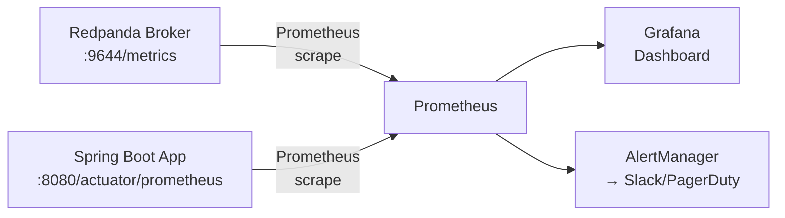

# 01. Monitoring

Prometheus 메트릭 수집, Grafana 대시보드 구성

> **분산 추적**: OpenTelemetry 기반 메시지 추적, Trace/Span 전파는 [04-opentelemetry.md](./04-opentelemetry.md) 참조. 이 문서는 **인프라 수준 모니터링**(메트릭, 대시보드, 알림)에 집중한다.

---

## 메트릭 수집 파이프라인



---

## 메트릭 엔드포인트

| 엔드포인트 | 포트 | 용도 |
|-----------|------|------|
| `/public_metrics` | 9644 | Prometheus 스크래핑용 |
| `/metrics` | 9644 | 내부 메트릭 |

```bash
# 메트릭 확인
curl http://localhost:9644/public_metrics
```

---

## Prometheus 설정

### prometheus.yml

```yaml
global:
  scrape_interval: 15s
  evaluation_interval: 15s

scrape_configs:
  - job_name: 'redpanda'
    static_configs:
      - targets:
          - 'redpanda-0:9644'
          - 'redpanda-1:9644'
          - 'redpanda-2:9644'
    metrics_path: /public_metrics

  # Kubernetes ServiceMonitor 사용 시
  # - job_name: 'redpanda-k8s'
  #   kubernetes_sd_configs:
  #     - role: endpoints
  #   relabel_configs:
  #     - source_labels: [__meta_kubernetes_service_name]
  #       regex: redpanda
  #       action: keep
```

### Helm values.yaml (ServiceMonitor)

```yaml
monitoring:
  enabled: true
  scrapeInterval: 30s

serviceMonitor:
  enabled: true
  labels:
    release: prometheus
  namespaceSelector:
    matchNames:
      - redpanda
```

---

## 주요 메트릭

### 클러스터 상태

| 메트릭 | 설명 | 임계값 |
|--------|------|--------|
| `redpanda_cluster_brokers` | 활성 브로커 수 | = 예상 수 |
| `redpanda_cluster_topics` | 토픽 수 | - |
| `redpanda_cluster_partitions` | 파티션 수 | - |
| `redpanda_kafka_under_replicated_replicas` | 복제 지연 파티션 | 0 |

### 성능 메트릭

| 메트릭 | 설명 | 권장 |
|--------|------|------|
| `redpanda_kafka_request_latency_seconds` | 요청 지연시간 | p99 < 100ms |
| `redpanda_kafka_request_bytes_total` | 요청 바이트 | - |
| `redpanda_storage_log_written_bytes` | 쓰기 처리량 | - |
| `redpanda_storage_log_read_bytes` | 읽기 처리량 | - |

### 리소스 메트릭

| 메트릭 | 설명 |
|--------|------|
| `redpanda_memory_allocated_memory` | 할당된 메모리 |
| `redpanda_memory_free_memory` | 가용 메모리 |
| `redpanda_io_queue_total_read_ops` | 읽기 I/O 작업 |
| `redpanda_io_queue_total_write_ops` | 쓰기 I/O 작업 |

### Raft 메트릭

| 메트릭 | 설명 | 주의 |
|--------|------|------|
| `redpanda_raft_leadership_changes` | 리더 변경 횟수 | 급증 시 확인 |
| `redpanda_raft_received_vote_requests` | 투표 요청 수 | - |

---

## Grafana 대시보드

### 공식 대시보드

```bash
# Grafana 대시보드 ID: 16935
# 또는 JSON 파일로 import
```

### 주요 패널

```
Row 1: 클러스터 개요
├── 브로커 수
├── 토픽 수
├── 파티션 수
└── 언더레플리케이션

Row 2: 처리량
├── 메시지 수신 rate
├── 메시지 송신 rate
├── 바이트 수신 rate
└── 바이트 송신 rate

Row 3: 지연시간
├── Producer 지연시간 (p50, p99)
├── Consumer 지연시간 (p50, p99)
└── Fetch 지연시간

Row 4: 리소스
├── CPU 사용률
├── 메모리 사용률
├── 디스크 사용률
└── 네트워크 I/O
```

### 커스텀 패널 예시

```json
{
  "title": "Request Latency p99",
  "type": "timeseries",
  "targets": [
    {
      "expr": "histogram_quantile(0.99, sum(rate(redpanda_kafka_request_latency_seconds_bucket[5m])) by (le, request))",
      "legendFormat": "{{request}}"
    }
  ]
}
```

---

## 알림 규칙

### Prometheus AlertManager

```yaml
groups:
  - name: redpanda
    rules:
      # 브로커 다운
      - alert: RedpandaBrokerDown
        expr: up{job="redpanda"} == 0
        for: 1m
        labels:
          severity: critical
        annotations:
          summary: "Redpanda broker down"
          description: "Broker {{ $labels.instance }} is down"

      # 언더레플리케이션
      - alert: RedpandaUnderReplicated
        expr: redpanda_kafka_under_replicated_replicas > 0
        for: 5m
        labels:
          severity: warning
        annotations:
          summary: "Under-replicated partitions"
          description: "{{ $value }} partitions are under-replicated"

      # 높은 지연시간
      - alert: RedpandaHighLatency
        expr: histogram_quantile(0.99, sum(rate(redpanda_kafka_request_latency_seconds_bucket[5m])) by (le)) > 0.1
        for: 5m
        labels:
          severity: warning
        annotations:
          summary: "High request latency"
          description: "p99 latency is {{ $value }}s"

      # 디스크 사용률
      - alert: RedpandaDiskUsageHigh
        expr: redpanda_storage_disk_free_bytes / redpanda_storage_disk_total_bytes < 0.2
        for: 5m
        labels:
          severity: warning
        annotations:
          summary: "Disk usage high"
          description: "Disk usage is above 80%"
```

---

## Admin API 모니터링

```bash
# 클러스터 상태
curl http://localhost:9644/v1/cluster/health_overview | jq

# 브로커 목록
curl http://localhost:9644/v1/brokers | jq

# 파티션 상태
curl http://localhost:9644/v1/partitions | jq

# 언더레플리케이션 확인
curl http://localhost:9644/v1/partitions?under_replicated=true | jq

# 설정 확인
curl http://localhost:9644/v1/cluster_config | jq
```

---

## 참고

- [Redpanda Monitoring](https://docs.redpanda.com/current/manage/monitoring/)
- [Grafana Dashboard 16935](https://grafana.com/grafana/dashboards/16935)
