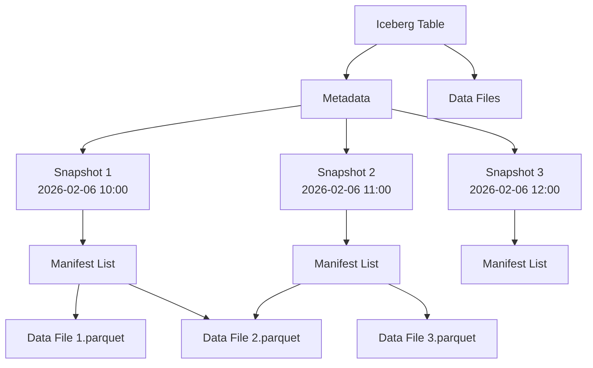

# 12. Iceberg Topics (실시간 데이터 레이크하우스)

Redpanda 전용 기능. 토픽을 Apache Iceberg 테이블로 자동 변환하여 Spark/Trino/DuckDB로 실시간 SQL 분석.

---

## 왜 Iceberg Topics인가?

### 기존 방식: 복잡한 파이프라인

전통적인 스트리밍 데이터 분석 아키텍처는 여러 단계의 데이터 이동이 필요했습니다.

```
┌──────────┐   ┌──────────┐   ┌────────┐   ┌──────────┐   ┌──────────┐
│ Producer │──>│ Redpanda │──>│ Kafka  │──>│ S3 Sink  │──>│   ETL    │
│          │   │  Topic   │   │ Connect│   │          │   │  Spark   │
└──────────┘   └──────────┘   └────────┘   └──────────┘   └──────────┘
                                                                  │
                                                                  ▼
                                                           ┌──────────┐
                                                           │ Iceberg  │
                                                           │  Table   │
                                                           └──────────┘
```

**문제점**:
- **복잡도**: 5단계 파이프라인 (Kafka Connect, S3, Spark ETL 등)
- **지연시간**: 데이터가 분석 가능해지기까지 수 분~수 시간
- **비용**: 중간 인프라 관리 비용 (Kafka Connect, Spark 클러스터)
- **데이터 중복**: S3에 원본 + Iceberg 테이블 = 2배 스토리지
- **운영 부담**: 여러 시스템의 장애 대응

### Iceberg Topics 방식: 단일 파이프라인

```
┌──────────┐   ┌─────────────────────────────┐
│ Producer │──>│    Redpanda Iceberg Topic   │
│          │   │  ┌──────────────────────┐   │
└──────────┘   │  │ Kafka API (실시간)   │   │
               │  ├──────────────────────┤   │
               │  │ Iceberg Table (분석) │   │
               │  └──────────────────────┘   │
               └─────────────────────────────┘
                            │
                            ▼
               ┌─────────────────────────────┐
               │  Spark / Trino / DuckDB     │
               │  (SQL 분석 - 즉시 가능)      │
               └─────────────────────────────┘
```

**장점**:
- **단순함**: 추가 파이프라인 불필요
- **실시간성**: 초 단위로 분석 가능 (< 30초)
- **비용 절감**: 중간 인프라 제거
- **단일 소스**: Redpanda 토픽 = Kafka + Iceberg
- **자동 관리**: 스키마 진화, 파티셔닝 자동 처리

### GA (Generally Available) 상태

Redpanda Iceberg Topics는 Redpanda 25.2부터 정식(GA) 기능으로 제공됩니다. 프로덕션 환경에서 안정적으로 사용할 수 있습니다.

---

## Apache Iceberg란?

Apache Iceberg는 대규모 분석 데이터세트를 위한 오픈 테이블 포맷입니다.

### 전통적인 Hive 테이블 vs Iceberg

| 특징 | Hive 테이블 | Apache Iceberg |
|------|-------------|----------------|
| **파티션 관리** | 디렉토리 기반 (느림) | 메타데이터 기반 (빠름) |
| **스키마 진화** | ALTER TABLE (수동) | 자동 스키마 진화 |
| **ACID 트랜잭션** | ❌ 지원 안 함 | ✅ ACID 보장 |
| **Time Travel** | ❌ 불가능 | ✅ 스냅샷 기반 |
| **Hidden Partitioning** | ❌ 쿼리에 파티션 명시 필요 | ✅ 자동 파티션 프루닝 |
| **대규모 메타데이터** | ❌ 느린 리스팅 | ✅ O(1) 메타데이터 접근 |

### Iceberg의 핵심 개념



**Iceberg 테이블 구조**:
- **Metadata**: 테이블 스키마, 파티션 정보, 스냅샷 히스토리
- **Manifest List**: 데이터 파일 목록 (빠른 쿼리 플래닝)
- **Data Files**: 실제 데이터 (Parquet/ORC/Avro)
- **Snapshot**: 특정 시점의 테이블 상태 (Time Travel)

---

## Redpanda Iceberg Topics 동작 원리

### 데이터 흐름

```
┌─────────────────────────────────────────────────────────────┐
│                    Redpanda Broker                          │
│                                                             │
│  ┌──────────────────────────────────────────────────────┐  │
│  │               Iceberg Topic: orders                  │  │
│  │                                                      │  │
│  │  [Kafka API Layer]                                  │  │
│  │  ├─ Producer writes → In-memory buffer              │  │
│  │  ├─ Consumer reads → Real-time streaming            │  │
│  │  └─ Offset management                               │  │
│  │                                                      │  │
│  │  [Iceberg Translation Layer]                        │  │
│  │  ├─ 30초마다 자동 플러시                              │  │
│  │  ├─ Parquet 파일 생성                                │  │
│  │  ├─ Manifest 파일 업데이트                           │  │
│  │  └─ Snapshot commit                                 │  │
│  └──────────────────────────────────────────────────────┘  │
└─────────────────────────────────────────────────────────────┘
                              │
                              ▼
                   ┌─────────────────────┐
                   │   Object Storage    │
                   │   (S3/GCS/Azure)    │
                   ├─────────────────────┤
                   │ /orders/            │
                   │  ├─ metadata/       │
                   │  │  └─ v1.json      │
                   │  ├─ data/           │
                   │  │  ├─ 001.parquet  │
                   │  │  └─ 002.parquet  │
                   │  └─ manifest/       │
                   │     └─ snap-1.avro  │
                   └─────────────────────┘
                              │
                              ▼
                   ┌─────────────────────┐
                   │  Query Engines      │
                   │  Spark / Trino /    │
                   │  DuckDB / Athena    │
                   └─────────────────────┘
```

### 자동 처리 항목

Redpanda가 자동으로 처리하는 작업:

| 작업 | 설명 | 사용자 개입 |
|------|------|-------------|
| **스키마 추출** | Kafka 메시지에서 스키마 자동 감지 | 불필요 |
| **파티셔닝** | 시간/필드 기반 자동 파티셔닝 | 설정만 |
| **파일 생성** | Parquet 파일 생성 및 최적화 | 불필요 |
| **스냅샷 관리** | Iceberg 스냅샷 자동 커밋 | 불필요 |
| **메타데이터 동기화** | 카탈로그 메타데이터 업데이트 | 불필요 |

---

## 지원 카탈로그

Iceberg 테이블은 메타데이터를 관리하는 "카탈로그"가 필요합니다.

### 카탈로그 비교

| 카탈로그 | 제공자 | 사용 사례 | 설정 복잡도 |
|----------|--------|-----------|-------------|
| **AWS Glue** | Amazon | AWS 환경 | ⭐⭐ 낮음 |
| **Databricks Unity Catalog** | Databricks | Databricks 사용자 | ⭐⭐⭐ 중간 |
| **Snowflake Open Catalog** | Snowflake | Snowflake 사용자 | ⭐⭐ 낮음 |
| **REST Catalog** | Tabular, Nessie | 멀티 클라우드 | ⭐⭐⭐⭐ 높음 |
| **Hive Metastore** | Apache | On-premise | ⭐⭐⭐ 중간 |

---

## 실습 시나리오: 주문 분석 파이프라인

### 시나리오 설명

전자상거래 시스템의 주문 이벤트를 실시간으로 수집하고, 비즈니스 분석팀이 SQL로 즉시 분석할 수 있도록 합니다.

**요구사항**:
- 초당 1000건의 주문 이벤트 수집
- 30초 이내에 분석 가능
- 시간대별 매출 집계
- 고객별 구매 패턴 분석
- 장기 보관 (1년+)

---

## Redpanda Cloud 설정 (GUI)

Redpanda Cloud에서 Iceberg Topics는 GUI로 쉽게 설정할 수 있습니다.

### 1. Redpanda Cloud 클러스터 생성

```
1. https://redpanda.com/cloud 접속
2. "Create Cluster" 클릭
3. 클러스터 설정:
   - Name: my-iceberg-cluster
   - Region: us-east-1
   - Tier: Professional (Iceberg Topics 필요)
4. "Create" 클릭
```

### 2. S3 버킷 생성 (AWS)

```bash
# AWS CLI로 버킷 생성
aws s3 mb s3://my-iceberg-data --region us-east-1

# Redpanda IAM 정책 생성
aws iam create-policy --policy-name RedpandaIcebergAccess --policy-document '{
  "Version": "2012-10-17",
  "Statement": [{
    "Effect": "Allow",
    "Action": [
      "s3:GetObject",
      "s3:PutObject",
      "s3:DeleteObject",
      "s3:ListBucket"
    ],
    "Resource": [
      "arn:aws:s3:::my-iceberg-data",
      "arn:aws:s3:::my-iceberg-data/*"
    ]
  }]
}'
```

### 3. Iceberg Topic 생성 (Redpanda Console)

```
1. Redpanda Console → Topics → "Create Topic"
2. 설정:
   - Topic Name: orders
   - Partitions: 6
   - Replication Factor: 3

3. "Iceberg" 탭 활성화:
   - Enable Iceberg: ✅
   - Mode: key_value
   - Catalog: AWS Glue
   - Database: default
   - Table: orders
   - S3 Bucket: s3://my-iceberg-data/orders
   - Commit Interval: 30s

4. "Create" 클릭
```

---

## rpk CLI 설정 (Self-Managed)

Self-Managed Redpanda 환경에서는 rpk CLI로 설정합니다.

### 1. Redpanda 설정 파일 업데이트

```yaml
# /etc/redpanda/redpanda.yaml
iceberg:
  enabled: true
  catalog_type: rest
  catalog_uri: http://iceberg-rest:8181

  # 또는 AWS Glue
  # catalog_type: glue
  # aws_region: us-east-1
  # glue_database: default

cloud_storage:
  enabled: true
  bucket: my-iceberg-data
  region: us-east-1
  access_key_id: ${AWS_ACCESS_KEY_ID}
  secret_access_key: ${AWS_SECRET_ACCESS_KEY}
```

### 2. rpk로 Iceberg Topic 생성

```bash
# Iceberg Topic 생성
rpk topic create orders \
  --topic-config redpanda.iceberg.mode=key_value \
  --topic-config redpanda.iceberg.destination.catalog=glue \
  --topic-config redpanda.iceberg.destination.database=default \
  --topic-config redpanda.iceberg.destination.table=orders \
  --topic-config redpanda.iceberg.commit.interval.ms=30000 \
  --partitions 6

# 설정 확인
rpk topic describe orders --configs
```

**출력**:
```
TOPIC   orders
=====
PARTITIONS             6
REPLICAS               3
redpanda.iceberg.mode  key_value
redpanda.iceberg.destination.catalog   glue
redpanda.iceberg.destination.database  default
redpanda.iceberg.destination.table     orders
```

---

## 데이터 발행 (Producer)

### Node.js Producer

```javascript
// producer.js
const { Kafka } = require('kafkajs');

const kafka = new Kafka({
  clientId: 'order-producer',
  brokers: ['your-redpanda-cluster.redpanda.com:9092'],
  ssl: true,
  sasl: {
    mechanism: 'scram-sha-256',
    username: 'your-username',
    password: 'your-password'
  }
});

const producer = kafka.producer();

async function sendOrders() {
  await producer.connect();

  for (let i = 0; i < 10000; i++) {
    const order = {
      orderId: `ORD-${Date.now()}-${i}`,
      customerId: `CUST-${Math.floor(Math.random() * 1000)}`,
      amount: Math.floor(Math.random() * 500000) + 1000,
      status: 'PENDING',
      items: [
        {
          productId: `PROD-${Math.floor(Math.random() * 100)}`,
          quantity: Math.floor(Math.random() * 5) + 1,
          price: Math.floor(Math.random() * 100000) + 1000
        }
      ],
      createdAt: new Date().toISOString()
    };

    await producer.send({
      topic: 'orders',
      messages: [{
        key: order.orderId,
        value: JSON.stringify(order)
      }]
    });

    if (i % 100 === 0) {
      console.log(`Sent ${i} orders`);
    }
  }

  await producer.disconnect();
  console.log('All orders sent!');
}

sendOrders();
```

### 실행

```bash
npm install kafkajs
node producer.js
```

**출력**:
```
Sent 0 orders
Sent 100 orders
Sent 200 orders
...
Sent 10000 orders
All orders sent!
```

---

## SQL 분석 (Query Engines)

Iceberg 테이블은 다양한 쿼리 엔진에서 표준 SQL로 조회할 수 있습니다.

### 1. DuckDB (로컬 분석)

```bash
# DuckDB 설치
brew install duckdb  # macOS
# 또는
wget https://github.com/duckdb/duckdb/releases/download/v0.10.0/duckdb_cli-linux-amd64.zip
unzip duckdb_cli-linux-amd64.zip

# DuckDB 실행
duckdb
```

**SQL 쿼리**:
```sql
-- Iceberg 확장 설치
INSTALL iceberg;
LOAD iceberg;

-- S3 인증 설정
SET s3_region='us-east-1';
SET s3_access_key_id='YOUR_ACCESS_KEY';
SET s3_secret_access_key='YOUR_SECRET_KEY';

-- Iceberg 테이블 읽기
CREATE TABLE orders AS
SELECT * FROM iceberg_scan('s3://my-iceberg-data/orders/metadata/v1.metadata.json');

-- 1. 시간대별 주문 건수 및 매출
SELECT
    date_trunc('hour', CAST(createdAt AS TIMESTAMP)) AS hour,
    COUNT(*) AS order_count,
    SUM(amount) AS total_amount,
    AVG(amount) AS avg_amount
FROM orders
WHERE createdAt >= '2026-02-06'
GROUP BY 1
ORDER BY 1;
```

**출력**:
```
┌─────────────────────┬─────────────┬──────────────┬─────────────┐
│        hour         │ order_count │ total_amount │ avg_amount  │
├─────────────────────┼─────────────┼──────────────┼─────────────┤
│ 2026-02-06 10:00:00 │        523  │  45,230,000  │   86,497    │
│ 2026-02-06 11:00:00 │        612  │  52,180,000  │   85,261    │
│ 2026-02-06 12:00:00 │        589  │  49,870,000  │   84,668    │
└─────────────────────┴─────────────┴──────────────┴─────────────┘
```

### 2. Apache Spark

```scala
// Spark Scala
import org.apache.spark.sql.SparkSession

val spark = SparkSession.builder()
  .appName("Iceberg Analysis")
  .config("spark.sql.catalog.glue", "org.apache.iceberg.spark.SparkCatalog")
  .config("spark.sql.catalog.glue.catalog-impl", "org.apache.iceberg.aws.glue.GlueCatalog")
  .config("spark.sql.catalog.glue.warehouse", "s3://my-iceberg-data/")
  .getOrCreate()

// 고객별 총 구매액 상위 10명
spark.sql("""
  SELECT
    customerId,
    COUNT(*) AS order_count,
    SUM(amount) AS total_spent,
    MAX(amount) AS max_order
  FROM glue.default.orders
  GROUP BY customerId
  ORDER BY total_spent DESC
  LIMIT 10
""").show()
```

**출력**:
```
+------------+------------+------------+----------+
| customerId | order_count| total_spent| max_order|
+------------+------------+------------+----------+
|  CUST-742  |     23     | 4,230,000  |  350,000 |
|  CUST-123  |     19     | 3,890,000  |  420,000 |
|  CUST-456  |     21     | 3,750,000  |  290,000 |
+------------+------------+------------+----------+
```

### 3. Trino (대화형 쿼리)

```sql
-- Trino 콘솔 (https://trino.io/)
SELECT
    status,
    COUNT(*) AS count,
    SUM(amount) AS revenue
FROM iceberg.default.orders
WHERE createdAt >= CURRENT_DATE - INTERVAL '7' DAY
GROUP BY status;
```

**출력**:
```
  status  | count  |   revenue
----------+--------+------------
 PENDING  | 12,345 | 1,234,567,890
 COMPLETED| 45,678 | 4,567,890,123
 CANCELLED|  1,234 |   123,456,789
```

### 4. AWS Athena (서버리스)

```sql
-- Athena 콘솔 (AWS Management Console)
CREATE EXTERNAL TABLE orders
LOCATION 's3://my-iceberg-data/orders/'
TBLPROPERTIES (
  'table_type'='ICEBERG',
  'format'='parquet'
);

-- 제품별 판매량
SELECT
    items.productId,
    SUM(items.quantity) AS total_quantity,
    COUNT(DISTINCT orderId) AS order_count
FROM orders
CROSS JOIN UNNEST(items) AS t(items)
GROUP BY items.productId
ORDER BY total_quantity DESC
LIMIT 20;
```

---

## Time Travel (과거 데이터 조회)

Iceberg의 강력한 기능 중 하나는 Time Travel입니다. 과거 특정 시점의 데이터를 조회할 수 있습니다.

### Snapshot 목록 조회

```sql
-- DuckDB
SELECT
    snapshot_id,
    parent_id,
    committed_at,
    summary
FROM iceberg_snapshots('s3://my-iceberg-data/orders/metadata/v1.metadata.json');
```

**출력**:
```
 snapshot_id |  parent_id  |      committed_at       |     summary
-------------+-------------+-------------------------+------------------
  123456789  |    NULL     | 2026-02-06 10:00:15 UTC | append: 1000 rows
  123456790  | 123456789   | 2026-02-06 10:30:15 UTC | append: 1200 rows
  123456791  | 123456790   | 2026-02-06 11:00:15 UTC | append: 1500 rows
```

### 특정 시점 데이터 조회

```sql
-- Spark: 1시간 전 데이터
SELECT COUNT(*)
FROM glue.default.orders
VERSION AS OF timestamp '2026-02-06 10:00:00';

-- DuckDB: Snapshot ID로 조회
SELECT *
FROM iceberg_scan(
  's3://my-iceberg-data/orders/metadata/v1.metadata.json',
  snapshot_id = 123456789
);
```

---

## 성능 최적화

### 1. 파티셔닝 전략

Iceberg는 "Hidden Partitioning"을 지원하여 쿼리에 파티션을 명시하지 않아도 자동으로 최적화됩니다.

```bash
# 시간 기반 파티셔닝 (일별)
rpk topic create orders \
  --topic-config redpanda.iceberg.partition.field=createdAt \
  --topic-config redpanda.iceberg.partition.transform=day

# 필드 기반 파티셔닝 (상태별)
rpk topic create orders \
  --topic-config redpanda.iceberg.partition.field=status \
  --topic-config redpanda.iceberg.partition.transform=identity
```

**쿼리 최적화 예시**:
```sql
-- 파티션 프루닝 자동 적용
SELECT *
FROM orders
WHERE createdAt >= '2026-02-06' AND createdAt < '2026-02-07';

-- 실행 계획: 1일치 파티션만 스캔 (전체 스캔 X)
```

### 2. 파일 크기 최적화

```bash
# 파일 크기 설정 (기본 128MB)
rpk topic alter-config orders \
  --set redpanda.iceberg.target.file.size.bytes=268435456  # 256MB
```

### 3. Commit 간격 조정

```bash
# 빠른 분석을 위해 10초마다 커밋
rpk topic alter-config orders \
  --set redpanda.iceberg.commit.interval.ms=10000

# 비용 절감을 위해 5분마다 커밋
rpk topic alter-config orders \
  --set redpanda.iceberg.commit.interval.ms=300000
```

---

## Self-Managed 환경 제약사항

**현재 상태 (2026년 2월)**:
- Iceberg Topics는 **Redpanda Cloud 우선 지원**
- Self-Managed 환경은 **실험적 기능** (Beta)
- 프로덕션 사용 시 Redpanda Cloud 권장

**Self-Managed 제한사항**:
- 추가 설정 복잡도 (REST Catalog 필요)
- 제한된 카탈로그 지원 (AWS Glue만 지원)
- GUI 설정 불가 (rpk CLI만)

---

## Kafka + Iceberg 대안 비교

| 항목 | Redpanda Iceberg Topics | Kafka + Iceberg (전통 방식) |
|------|-------------------------|------------------------------|
| **파이프라인 복잡도** | ⭐⭐⭐⭐⭐ 단순 (1단계) | ⭐⭐ 복잡 (5단계) |
| **지연시간** | < 30초 | 5분~1시간 |
| **운영 비용** | 낮음 (Redpanda만) | 높음 (Kafka + Connect + Spark) |
| **설정 복잡도** | rpk 명령어 1줄 | 수십 줄 설정 파일 |
| **스키마 진화** | 자동 | 수동 |
| **프로덕션 준비** | ✅ GA (25.2+) | ✅ 검증됨 |
| **멀티 클라우드** | ⚠️ 제한적 | ✅ 완전 지원 |

---

## 실습 체크리스트

- [ ] **환경 설정**
  - [ ] Redpanda Cloud 클러스터 생성 (또는 Self-Managed 설정)
  - [ ] S3 버킷 생성 및 IAM 정책 설정
  - [ ] AWS Glue 카탈로그 설정
- [ ] **Iceberg Topic 생성**
  - [ ] Redpanda Console에서 Iceberg 활성화
  - [ ] 또는 rpk CLI로 설정
  - [ ] 설정 확인 (`rpk topic describe`)
- [ ] **데이터 발행**
  - [ ] Producer 코드 작성 (Node.js/Java/Python)
  - [ ] 10,000건 주문 이벤트 발행
  - [ ] Redpanda Console에서 메시지 확인
- [ ] **SQL 분석**
  - [ ] DuckDB로 로컬 분석
  - [ ] 시간대별 매출 집계
  - [ ] 고객별 구매 패턴 분석
- [ ] **고급 기능**
  - [ ] Time Travel (과거 데이터 조회)
  - [ ] 파티셔닝 전략 적용
  - [ ] Spark/Trino 연동 (선택)
- [ ] **성능 측정**
  - [ ] Producer 처리량 측정
  - [ ] Iceberg 커밋 지연시간 확인
  - [ ] 쿼리 성능 벤치마크

---

## 다음 단계

이제 Event-Driven PoC 전체 과정을 완료했습니다!

**학습한 내용 복습**:
1. **01. 기본 이벤트 루프**: Producer/Consumer 기본
2. **02. 스키마 진화**: Avro/Protobuf 스키마 관리
3. **03. 무상태 토폴로지**: Kafka Streams 기본
4. **04. 상태 기반 스트리밍**: 윈도우 집계
5. **05. 코레오그래피 Saga**: 코레오그래피 Saga
6. **06. 오케스트레이션 Saga**: 오케스트레이션 Saga
7. **07. Outbox CDC**: Debezium CDC
8. **08. Request-Response 브릿지**: 동기-비동기 브릿지
9. **09. WASM Transforms**: 브로커 내 데이터 변환
10. **10. Connect Pipeline**: Redpanda Connect 파이프라인
11. **11. Testing Strategy**: 다계층 테스트 전략
12. **12. Iceberg Topics**: 실시간 데이터 레이크하우스

**다음 학습 방향**:
- 프로덕션 배포 (Kubernetes, Helm)
- 모니터링 (Prometheus, Grafana)
- 보안 (TLS, SASL, ACL)
- 성능 튜닝 (배치, 압축, 파티셔닝)

---

## 참고 자료

- [Redpanda Iceberg Topics 공식 문서](https://docs.redpanda.com/current/develop/iceberg-sink/)
- [Apache Iceberg 공식 사이트](https://iceberg.apache.org/)
- [AWS Glue 카탈로그 가이드](https://docs.aws.amazon.com/glue/latest/dg/catalog-and-crawler.html)
- [DuckDB Iceberg 확장](https://duckdb.org/docs/extensions/iceberg)
- [Trino Iceberg 커넥터](https://trino.io/docs/current/connector/iceberg.html)
- [Spark Iceberg 통합](https://iceberg.apache.org/docs/latest/spark-getting-started/)
