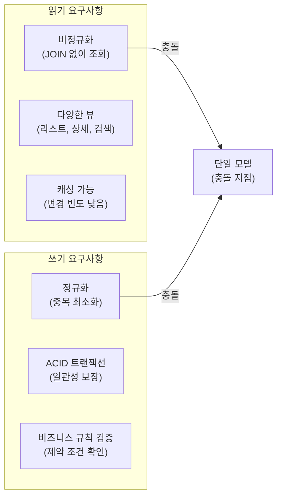
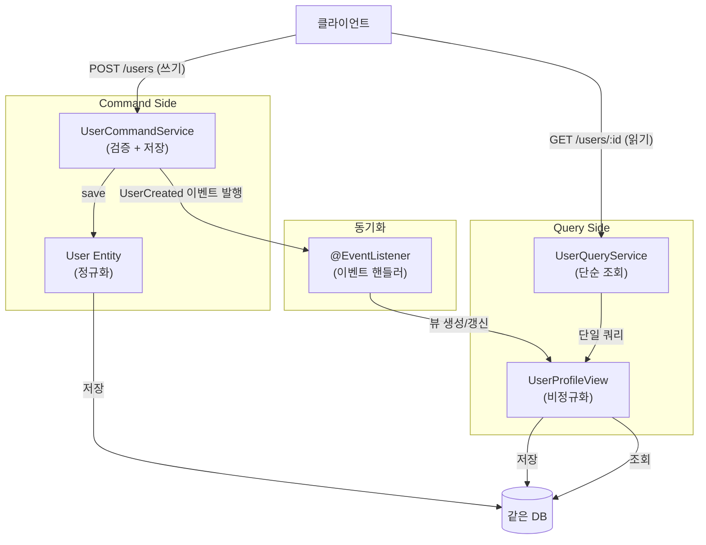
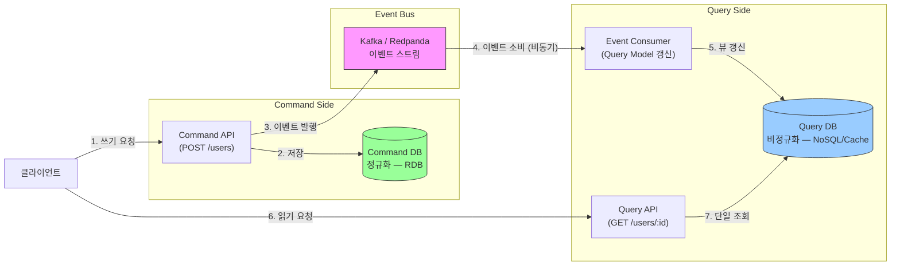
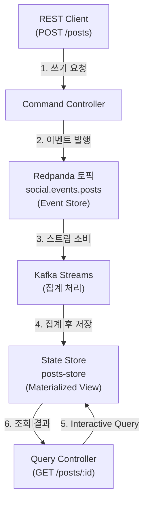
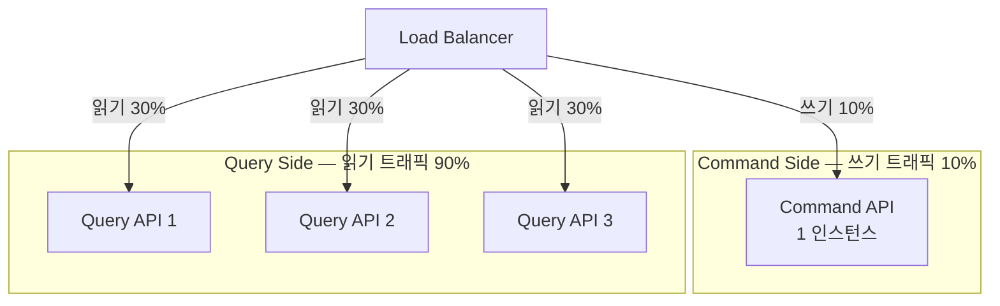
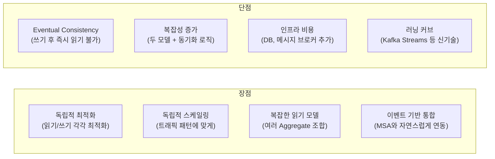
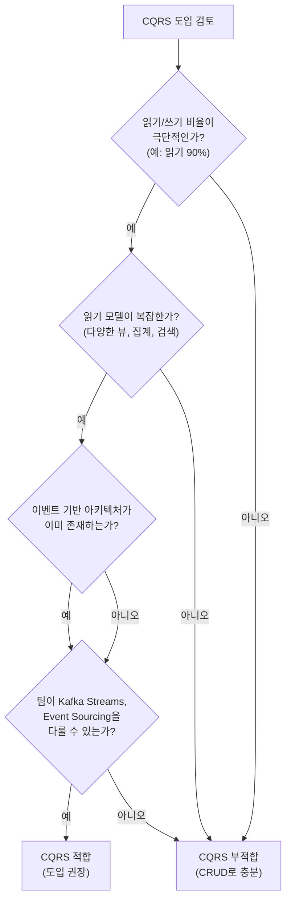

# CQRS 패턴

Command Query Responsibility Segregation

## 왜 읽기와 쓰기를 분리하는가?

전통적인 CRUD 애플리케이션에서는 하나의 데이터 모델로 읽기와 쓰기를 모두 처리한다. 이 접근법은 단순하지만, **읽기와 쓰기의 요구사항이 근본적으로 다르다**는 사실을 무시한다.

읽기는 빠른 응답 속도를 위해 비정규화된 데이터와 JOIN 없는 단일 조회를 원한다. 같은 데이터라도 리스트 화면, 상세 화면, 검색 결과처럼 다양한 형태의 뷰가 필요하며, 변경이 적은 데이터는 캐싱으로 성능을 극대화할 수 있다.

반면 쓰기는 데이터 정합성을 위해 정규화된 구조와 ACID 트랜잭션을 필요로 한다. 비즈니스 규칙과 제약 조건을 검증해야 하고, 변경이 발생하면 다른 시스템에 이벤트로 알려야 한다.

이 두 가지 요구사항을 하나의 모델로 동시에 만족시키려 할 때 충돌이 발생한다.



### 단일 모델의 문제점: JPA vs MyBatis

아래 예시는 하나의 데이터 모델로 읽기와 쓰기를 모두 처리할 때 어떤 문제가 발생하는지, ORM 선택에 따라 양상이 어떻게 달라지는지를 보여준다.

#### JPA: N+1과 관계 로딩 문제

```java
// 단일 모델: User 엔티티로 읽기/쓰기 모두 처리
@Entity
public class User {
    @Id private Long id;
    private String name;
    private String email;

    @OneToMany
    private List<Post> posts;  // 쓰기에는 불필요, 읽기에만 필요

    @ManyToMany
    private Set<User> followers;  // JOIN 비용 높음
}

// 쓰기: 사용자 생성 — posts, followers는 전혀 필요 없지만 엔티티가 들고 있음
public void createUser(String name, String email) {
    User user = new User(name, email);
    userRepository.save(user);
}

// 읽기: 사용자 프로필 조회 — N+1 문제 발생
public UserProfile getUserProfile(Long userId) {
    User user = userRepository.findById(userId);
    return new UserProfile(
        user.getName(),
        user.getPosts().size(),      // 별도 쿼리 발생 (비효율적)
        user.getFollowers().size()   // 별도 쿼리 발생 (비효율적)
    );
}
```

위 코드의 문제는 JPA의 ORM 매핑에서 비롯된다. 첫째, 쓰기 시 불필요한 `posts`, `followers` 관계를 엔티티가 항상 품고 있다. 둘째, 읽기 시 `getUserProfile()` 한 번 호출에 N+1 쿼리가 발생한다. 셋째, 엔티티 구조가 테이블과 1:1 매핑되므로 "읽기 전용 비정규화 뷰"를 만들기 어렵다.

#### MyBatis: 정규화 + SQL 직접 작성으로 충분

같은 조회를 MyBatis로 작성하면 N+1 문제가 발생하지 않는다. SQL을 직접 작성하므로 테이블은 정규화해두고, 필요한 데이터만 JOIN해서 원하는 형태로 가져오면 된다.

```java
// MyBatis: 같은 조회를 단일 SQL로 해결
@Select("""
    SELECT u.id, u.name, u.email,
           COUNT(DISTINCT p.id) AS post_count,
           COUNT(DISTINCT f.follower_id) AS follower_count
    FROM user u
    LEFT JOIN post p ON p.user_id = u.id
    LEFT JOIN follow f ON f.followee_id = u.id
    WHERE u.id = #{userId}
    GROUP BY u.id
    """)
UserProfile getUserProfile(@Param("userId") Long userId);

// 쓰기: 필요한 컬럼만 INSERT — 관계 로딩 없음
@Insert("INSERT INTO user (name, email) VALUES (#{name}, #{email})")
void createUser(@Param("name") String name, @Param("email") String email);
```

MyBatis에서는 쓰기용 SQL과 읽기용 SQL을 자연스럽게 분리할 수 있고, SELECT 결과를 어떤 DTO에든 담을 수 있으므로 테이블 구조와 조회 모델 사이에 강제적인 결합이 없다. JPA의 N+1, 관계 로딩, 정규화 트레이드오프 문제는 MyBatis에서 거의 발생하지 않는다.

#### 그렇다면 CQRS는 왜 필요한가?

N+1과 정규화 문제는 ORM 선택에 따라 해결 가능하다. CQRS가 풀려는 진짜 문제는 **단일 DB + SQL로 해결할 수 없는 영역**에 있다.

| 문제 | MyBatis SQL로 해결 가능? | CQRS가 필요한 이유 |
|------|------------------------|-------------------|
| **MSA에서 여러 서비스 데이터 합치기** | 단일 DB가 아니면 JOIN 불가 | 이벤트로 각 서비스 데이터를 하나의 읽기 모델에 집계 |
| **실시간 사전 집계 뷰 (타임라인, 피드)** | 매 요청마다 복잡한 JOIN은 느려짐 | 이벤트 발생 시 미리 계산해서 저장 |
| **읽기/쓰기 독립 스케일링** | DB replica로 일부 해소 | Query Side를 별도 기술 스택(NoSQL, 캐시)으로 수평 확장 |
| **이벤트 재생으로 상태 복구** | SQL 이력 테이블은 가능하나 한계 | Event Store에서 처음부터 재생하면 어떤 시점이든 재구축 |
| **감사 로그 / 시점 복원** | 별도 이력 테이블로 가능 | Event Sourcing이면 모든 변경이 자연스럽게 기록 |

정리하면, N+1은 ORM 문제이지 CQRS의 동기가 아니다. CQRS는 **서비스 간 데이터 통합, 실시간 사전 집계, 이벤트 기반 상태 복구**처럼 단일 DB 경계를 넘어서는 요구사항이 있을 때 가치를 발휘한다.

### Chronological Reduction 문제

Event Sourcing에서 현재 상태를 얻으려면 이벤트를 처음부터 순차적으로 적용(reduce)해야 한다. 이벤트가 적을 때는 문제 없지만, 이벤트가 수만~수백만 건으로 쌓이면 읽기 요청마다 전체 히스토리를 reduce하는 비용이 선형으로 증가한다. 이것이 **Chronological Reduction 문제**다.

```
장바구니 이벤트 10건:
  ADD(우유) → ADD(빵) → REMOVE(빵) → ADD(계란) → ... → 현재 상태 계산
  → 10번 reduce: 빠름

은행 계좌 이벤트 100만 건:
  입금(1000) → 출금(500) → 입금(200) → ... → 현재 잔액 계산
  → 100만 번 reduce: 매 조회마다 수초 소요
```

CQRS는 이 문제를 근본적으로 해결한다. 핵심 아이디어는 **reduce 연산을 읽기 시점이 아닌 쓰기 시점으로 옮기는 것**이다. 이벤트가 발생할 때마다 즉시 현재 상태를 계산하여 Read Side View에 저장해두면, 읽기는 미리 계산된 결과를 한 번에 반환하면 된다. reduce는 이벤트 하나당 한 번만 발생하고, 같은 계산이 반복되지 않는다.

```
쓰기 시점 (이벤트 발생 시):
  ADD(우유)   → View 갱신: {우유: 1}
  ADD(빵)     → View 갱신: {우유: 1, 빵: 1}
  REMOVE(빵)  → View 갱신: {우유: 1}

읽기 시점 (조회 요청 시):
  → View에서 즉시 반환: {우유: 1}
  → reduce 없음, O(1)
```

이 방식에서는 이벤트가 아무리 많이 쌓여도 읽기 성능이 일정하다. 대신 쓰기 시 View 갱신이라는 추가 작업이 발생하지만, 대부분의 시스템은 읽기가 쓰기보다 훨씬 빈번하므로 전체적으로 이득이다.

### Kafka 토픽 기반 CQRS 구현

Kafka(또는 Redpanda) 토픽을 활용하면 CQRS의 Write Side와 Read Side를 자연스럽게 분리할 수 있다. 핵심은 토픽 자체가 이벤트의 영구 저장소(Event Store)이자, Read Side로의 데이터 전달 통로 역할을 동시에 수행한다는 점이다.

**Write Side**는 Command를 받아 이벤트를 토픽에 직접 기록한다. 전통적인 DB INSERT와 달리 인덱스 업데이트가 없으므로 쓰기가 빠르다. 토픽에 저장된 이벤트는 불변(immutable)이며 순서가 보장된다.

**Read Side**는 토픽의 이벤트를 소비하여 자신만의 Materialized View를 구축한다. Kafka Streams의 KTable이나 외부 DB(Elasticsearch, Redis 등)에 미리 계산된 결과를 저장해두고, 조회 요청이 오면 즉시 반환한다. 이것이 앞서 설명한 Chronological Reduction 문제의 해법이다.

```
                    ┌──────────────────────┐
  Command ──────────→  Kafka/Redpanda 토픽   ──────→ Read Side View 1 (KTable)
  (쓰기)            │  (Event Store)        │──────→ Read Side View 2 (Elasticsearch)
                    │  retention.ms=-1      │──────→ Read Side View 3 (Redis Cache)
                    └──────────────────────┘
```

토픽의 보존 기간을 무한(`retention.ms=-1`)으로 설정하면 이벤트가 영구 보존된다. 이 덕분에 새로운 Read Side View가 필요할 때 토픽을 처음부터 다시 소비하여 새 View를 구축할 수 있다. 현재 존재하지 않는 View도 나중에 언제든지 추가할 수 있다는 뜻이다.

Confluent의 Event Sourcing 코스에서는 ksqlDB로 이 패턴을 선언적으로 구현하는 방법을 보여준다. ksqlDB의 `CREATE STREAM`과 `CREATE TABLE AS SELECT`는 SQL 문법으로 스트림 처리를 정의하며, 내부적으로 Kafka Streams와 동일한 메커니즘으로 동작한다. 이 프로젝트에서는 ksqlDB 대신 **Kafka Streams API를 직접 사용**하여 동일한 패턴을 구현한다. 구체적인 실습은 [06-cqrs-handson.md](06-cqrs-handson.md)에서 장바구니 도메인으로 다룬다.

---

## CQRS란 무엇인가

CQRS는 **읽기(Query)와 쓰기(Command)의 책임을 분리**하는 패턴이다. 단순히 코드를 두 덩이로 나누는 것이 아니라, 읽기와 쓰기가 서로 다른 모델을 바라보도록 설계하는 것이다.

> "읽기 모델과 쓰기 모델을 분리하라."

- **Command Model**: 쓰기에 최적화된 모델이다. 데이터는 정규화되어 있고, 비즈니스 규칙을 검증하며, 트랜잭션 일관성을 보장한다.
- **Query Model**: 읽기에 최적화된 모델이다. 데이터는 비정규화되어 있고, JOIN 없이 한 번에 원하는 뷰를 반환한다.

### Greg Young의 정의

CQRS 패턴을 처음 제시한 Greg Young은 다음과 같이 설명한다.

> "CQRS는 동일한 데이터에 대한 읽기와 쓰기 모델을 분리하는 것이다.<br>
> 핵심은 '책임의 분리'이지, 기술적 구현이 아니다."

이 말이 중요한 이유는, CQRS를 도입하기 위해 반드시 다른 데이터베이스나 메시지 브로커가 필요한 것은 아니라는 뜻이기 때문이다. CQRS는 구현 수준에 따라 두 가지 형태로 존재한다.

- **단순한 형태**: 같은 DB를 쓰되, 읽기 모델과 쓰기 모델을 코드 레벨에서 분리한다.
- **완전한 형태**: 읽기용 DB와 쓰기용 DB를 물리적으로 분리하고, 이벤트 스트림으로 동기화한다.

---

## CQRS의 단순한 형태: 같은 DB, 다른 모델

같은 데이터베이스를 쓰더라도 쓰기용 모델과 읽기용 뷰 객체를 코드 레벨에서 분리하면, 각 모델을 목적에 맞게 최적화할 수 있다. JPA 환경에서는 N+1과 관계 로딩 문제가 해소되고, MyBatis 환경에서도 쓰기 SQL과 읽기 SQL의 책임 경계가 명확해지는 이점이 있다.



```java
// Command Model: 쓰기 최적화 — 관계를 들고 있지 않는 정규화된 엔티티
@Entity
public class User {
    @Id private Long id;
    private String name;
    private String email;
    // posts, followers 관계 없음 (쓰기에 불필요)
}

// Command Service: 검증과 비즈니스 규칙을 담당
public class UserCommandService {
    public void createUser(CreateUserCommand cmd) {
        if (userRepository.existsByEmail(cmd.getEmail())) {
            throw new IllegalArgumentException("Email already exists");
        }

        User user = new User(cmd.getName(), cmd.getEmail());
        userRepository.save(user);

        // 이벤트 발행 — Query Model 동기화 트리거
        eventPublisher.publish(new UserCreated(user.getId()));
    }
}

// Query Model: 읽기 최적화 — JOIN 없이 한 번에 조회 가능한 비정규화 뷰
@Entity
@Table(name = "user_profile_view")
public class UserProfileView {
    @Id private Long userId;
    private String name;
    private String email;
    private int postCount;
    private int followerCount;
    private LocalDateTime lastActivityAt;
}

// Query Service: 단일 쿼리로 즉시 반환
public class UserQueryService {
    public UserProfileView getUserProfile(Long userId) {
        return userProfileViewRepository.findById(userId)
            .orElseThrow();  // JOIN 없음, N+1 없음
    }
}

// 동기화: 이벤트 핸들러가 Query Model을 최신 상태로 유지
@EventListener
public void on(UserCreated event) {
    UserProfileView view = new UserProfileView(event.getUserId());
    userProfileViewRepository.save(view);
}

@EventListener
public void on(PostCreated event) {
    UserProfileView view = userProfileViewRepository.findById(event.getUserId());
    view.incrementPostCount();
    userProfileViewRepository.save(view);
}
```

이 형태의 장점은 읽기와 쓰기가 독립적으로 최적화되면서도, 동일한 데이터베이스를 사용하기 때문에 운영 복잡성이 낮고 트랜잭션 일관성을 유지하기 쉽다는 점이다. 다만 DB를 공유하므로 읽기와 쓰기를 독립적으로 스케일링할 수 없고, Query Model 업데이트가 동기 방식이라 쓰기 성능에 영향을 준다는 단점이 있다.

---

## CQRS의 완전한 형태: 다른 DB, 이벤트로 동기화

읽기와 쓰기를 물리적으로 완전히 분리하면 각자의 특성에 맞는 데이터베이스를 선택하고 독립적으로 스케일링할 수 있다. Command Side가 이벤트를 Kafka/Redpanda 토픽에 발행하면, Query Side가 이를 소비하여 자신의 읽기 전용 DB를 갱신하는 방식으로 동기화가 이루어진다.



### 동작 흐름

동작은 크게 세 단계로 나뉜다.

**1단계 — Command 처리 (동기):** 클라이언트가 `POST /users`를 호출하면 Command Service가 유효성을 검증하고 정규화된 DB에 저장한다. 이후 `UserCreated` 이벤트를 Kafka 토픽에 발행하고 `202 Accepted`를 반환한다. 이 시점에 읽기 모델은 아직 갱신되지 않은 상태다.

**2단계 — Query Model 갱신 (비동기):** Kafka Consumer가 이벤트를 소비하여 비정규화된 읽기 전용 DB를 갱신한다. 이 과정은 비동기이므로 Command 응답과 Query Model 반영 사이에 짧은 지연이 발생한다.

**3단계 — Query 처리 (동기):** 클라이언트가 `GET /users/:id`를 호출하면 Query Service가 읽기 전용 DB에서 JOIN 없이 즉시 데이터를 반환한다.

```java
// Command Side — REST 요청을 이벤트로 변환하여 발행
@RestController
@RequestMapping("/api/commands")
public class UserCommandController {
    private final UserCommandService commandService;
    private final KafkaTemplate<String, Event> kafkaTemplate;

    @PostMapping("/users")
    public ResponseEntity<Void> createUser(@RequestBody CreateUserRequest req) {
        // 1. 검증 및 Command DB 저장
        User user = commandService.createUser(req.getName(), req.getEmail());

        // 2. 이벤트 발행 — Query Side가 비동기로 수신
        UserCreated event = new UserCreated(
            user.getId(),
            user.getName(),
            user.getEmail(),
            Instant.now()
        );
        kafkaTemplate.send("user.events", event);

        return ResponseEntity.accepted().build();  // 202 Accepted: 아직 읽기 모델 반영 전
    }
}

// Query Side — 이벤트를 소비하여 읽기 전용 뷰를 갱신하고, HTTP 조회 요청을 처리
@Service
public class UserQueryService {
    private final UserProfileViewRepository viewRepository;

    @KafkaListener(topics = "user.events")
    public void handleUserEvent(UserCreated event) {
        // Query Model 생성 — 비정규화된 뷰로 저장
        UserProfileView view = new UserProfileView(
            event.getUserId(),
            event.getName(),
            event.getEmail(),
            0,  // postCount 초기값
            0,  // followerCount 초기값
            event.getTimestamp()
        );
        viewRepository.save(view);
    }

    public UserProfileView getUserProfile(Long userId) {
        return viewRepository.findById(userId).orElseThrow();
    }
}

@RestController
@RequestMapping("/api/queries")
public class UserQueryController {
    private final UserQueryService queryService;

    @GetMapping("/users/{userId}/profile")
    public UserProfileView getUserProfile(@PathVariable Long userId) {
        return queryService.getUserProfile(userId);  // 단일 쿼리, JOIN 없음
    }
}
```

---

## 이 프로젝트에서의 구현

이 프로젝트는 **Redpanda + Spring Boot + Kafka Streams** 조합으로 CQRS를 구현한다. Redpanda 토픽이 Event Store(진실의 원천) 역할을 하고, Kafka Streams가 토픽의 이벤트를 집계하여 Query Model(State Store)을 구축하며, Interactive Query API로 외부에 HTTP 조회 인터페이스를 제공한다.



```java
// Command Side: REST 요청을 Redpanda 토픽에 이벤트로 발행
@PostMapping("/posts")
public ResponseEntity<Void> createPost(@RequestBody CreatePostRequest req) {
    PostCreated event = new PostCreated(
        UUID.randomUUID().toString(),
        req.getUserId(),
        req.getContent(),
        Instant.now()
    );
    kafkaTemplate.send("social.events.posts", event.getPostId(), event);
    return ResponseEntity.accepted().build();
}

// Query Side: Kafka Streams가 토픽을 집계하여 Materialized View(State Store) 구축
@Bean
public KStream<String, PostCreated> postsStream(StreamsBuilder builder) {
    KStream<String, PostCreated> stream = builder.stream("social.events.posts");

    KTable<String, Post> postsTable = stream
        .groupByKey()
        .aggregate(
            Post::new,
            (key, event, post) -> post.apply(event),
            Materialized.<String, Post, KeyValueStore<Bytes, byte[]>>as("posts-store")
                .withKeySerde(Serdes.String())
                .withValueSerde(new JsonSerde<>(Post.class))
        );

    return stream;
}

// Interactive Query: State Store를 HTTP API로 노출
@GetMapping("/posts/{postId}")
public Post getPost(@PathVariable String postId) {
    ReadOnlyKeyValueStore<String, Post> store =
        kafkaStreams.store(
            StoreQueryParameters.fromNameAndType("posts-store", QueryableStoreTypes.keyValueStore())
        );

    Post post = store.get(postId);
    if (post == null) {
        throw new NotFoundException();
    }
    return post;
}
```

이 구현의 핵심은 Redpanda 토픽이 단순한 메시지 통로가 아니라 **이벤트의 영구 저장소**라는 점이다. 토픽에 저장된 이벤트를 처음부터 다시 재생하면 State Store를 언제든지 재구축할 수 있어, Query Model이 손상되어도 토픽만 살아있으면 복구가 가능하다.

---

## 독립적 스케일링

CQRS의 실용적인 이점 중 하나는 읽기와 쓰기를 **트래픽에 따라 독립적으로 스케일링**할 수 있다는 점이다. 대부분의 시스템에서 읽기 트래픽은 쓰기 트래픽보다 압도적으로 많다. 단일 모델에서는 읽기를 위해 쓰기 서버까지 함께 늘려야 하지만, CQRS에서는 Query Side만 수평 확장하면 된다.



Command Side는 쓰기 트래픽에 맞춰, Query Side는 읽기 트래픽에 맞춰 각자 독립적으로 스케일링한다. 필요한 부분만 늘리므로 인프라 비용도 최적화된다.

---

## 트레이드오프

CQRS는 공짜가 아니다. 적용하면 얻는 이익과 치러야 하는 비용을 명확히 이해해야 한다.



**장점 상세:**
1. **독립적 최적화**: 읽기 모델은 조회에, 쓰기 모델은 정합성에 각각 집중할 수 있다.
2. **독립적 스케일링**: 읽기 트래픽이 폭증해도 Query Side만 수평 확장하면 된다.
3. **복잡한 읽기 모델**: 여러 Aggregate를 조합한 집계 뷰를 이벤트 스트림으로 자연스럽게 구축할 수 있다.
4. **이벤트 기반 통합**: MSA와 Event-Driven 아키텍처에 자연스럽게 녹아든다.

**단점 상세:**
1. **Eventual Consistency**: 쓰기 후 Query Model 반영까지 짧은 지연이 존재한다. 사용자가 방금 등록한 데이터를 즉시 못 볼 수 있다.
2. **복잡성 증가**: 두 개의 모델, 동기화 로직, 그리고 이 모두를 아우르는 디버깅이 복잡해진다.
3. **인프라 비용**: 읽기용 DB, 쓰기용 DB, 메시지 브로커까지 운영 대상이 늘어난다.
4. **팀 러닝 커브**: Kafka Streams, Event Sourcing 등 새로운 기술 스택에 대한 학습이 선행되어야 한다.

---

## 적용 기준

CQRS는 모든 시스템에 적합한 패턴이 아니다. 도입 전 아래 기준으로 적합성을 판단해야 한다.



### CQRS가 적합한 경우

- 읽기/쓰기 트래픽 비율이 극단적일 때 (예: 읽기 90%, 쓰기 10%)
- 여러 형태의 읽기 뷰, 복잡한 집계, 전문 검색이 필요할 때
- MSA 또는 Event-Driven 아키텍처 위에서 개발하고 있을 때
- 읽기 서버만 독립적으로 증설해야 하는 스케일링 요구가 있을 때
- 감사 로그나 특정 시점의 데이터 상태를 재현해야 할 때

### CQRS가 부적합한 경우

- 단순 CRUD이고 읽기/쓰기 비율이 비슷할 때 — 복잡성만 늘어난다.
- 금융 거래처럼 Strong Consistency가 반드시 필요할 때 — Eventual Consistency는 허용되지 않는다.
- 팀이 Kafka Streams나 Event Sourcing에 익숙하지 않을 때 — 러닝 커브가 개발 속도를 늦춘다.
- 초기 스타트업처럼 빠른 출시가 최우선일 때 — 과도한 설계는 오히려 독이 된다.

---

## 핵심 교훈

> "CQRS는 복잡성을 추가한다. 필요하지 않으면 사용하지 마라."

대부분의 시스템은 CRUD로 충분하다. CQRS가 가치를 발휘하는 것은 읽기와 쓰기를 분리함으로써 얻는 이익이 그 복잡성을 명백히 초과할 때뿐이다.

도입을 결정했다면 **단순한 형태(같은 DB)에서 시작**하는 것이 좋다. 코드 레벨의 모델 분리만으로도 읽기/쓰기 각각의 최적화라는 즉각적인 이점을 얻을 수 있다. 이후 스케일링 요구가 실제로 발생했을 때 이벤트 기반의 완전한 형태로 점진적으로 진화시키면 된다.

무엇보다 중요한 것은 **"언제 사용하지 말아야 하는가"를 아는 것**이다. 강력한 도구일수록 남용했을 때의 비용도 크다.
