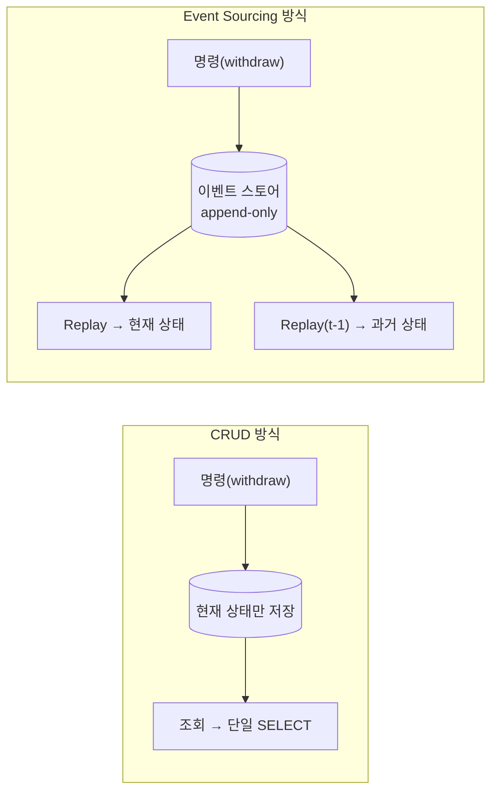
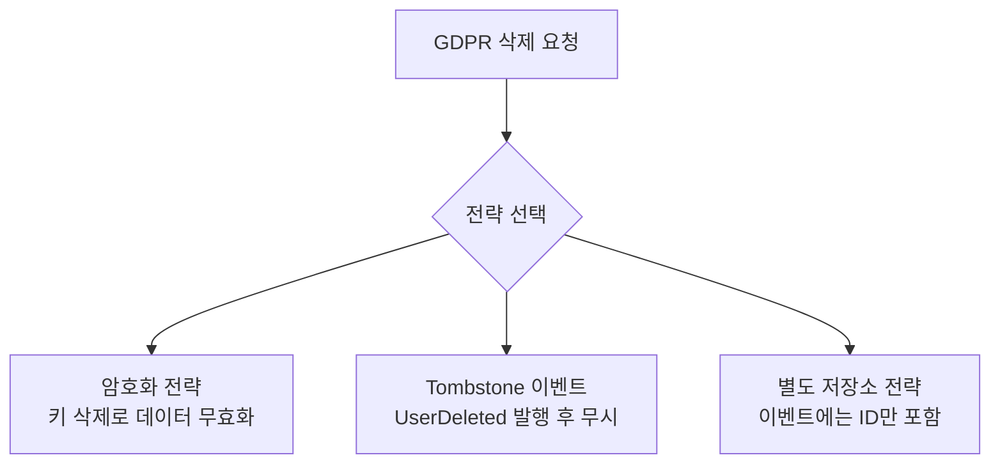

# Event Sourcing 기초

Event Sourcing은 이벤트가 시스템의 유일한 진실(source of truth)인 아키텍처 패턴이다. 데이터베이스에 "현재 상태"를 덮어쓰는 대신, 상태를 변경한 모든 이벤트를 시간 순서로 쌓아두고 그 이벤트들을 재생(replay)하여 현재 상태를 도출한다.

---

## Event Sourcing이란 무엇인가

전통적인 CRUD 방식은 데이터베이스에 현재 상태만 저장한다. 잔액이 50원에서 150원으로 바뀌면, 150이라는 숫자만 남고 왜 바뀌었는지, 언제 중간 단계가 있었는지는 영구히 사라진다. "어제 오후 3시에 이 계좌의 잔액은 얼마였는가?"라는 질문에 답할 수 없고, 감사 로그가 필요하다면 별도로 구축해야 한다.

Event Sourcing은 상태 변경을 일으킨 이벤트 자체를 저장한다. 세 가지 핵심 원칙이 이 방식을 지탱한다. 이벤트가 source of truth이므로 모든 변경의 근거가 이벤트에 있다. 현재 상태는 이벤트를 처음부터 재생하면 언제든 얻을 수 있다. 이벤트는 불변(immutable)으로 절대 수정하거나 삭제하지 않는다.

```sql
-- Event Sourcing: 상태 변경 이벤트를 시간 순서로 저장 (append-only)
INSERT INTO user_events VALUES
(1, 1, 'UserCreated',    '{"name": "Alice", "email": "alice@example.com"}', '2024-01-01 10:00:00'),
(2, 1, 'DepositMade',   '{"amount": 100.00, "reason": "Initial deposit"}',  '2024-01-01 10:05:00'),
(3, 1, 'WithdrawalMade','{"amount": 50.00,  "reason": "ATM withdrawal"}',   '2024-01-02 14:30:00'),
(4, 1, 'DepositMade',   '{"amount": 100.00, "reason": "Salary"}',           '2024-01-03 09:00:00');
-- 현재 잔액 = 0 + 100 - 50 + 100 = 150
```

```java
// Aggregate: 이벤트를 순서대로 적용하여 현재 상태를 구축한다
public class Account {
    private String userId;
    private BigDecimal balance;
    private List<Event> changes = new ArrayList<>();

    public void withdraw(BigDecimal amount, String reason) {
        if (balance.compareTo(amount) < 0) throw new InsufficientBalanceException();
        apply(new WithdrawalMade(userId, amount, reason, Instant.now()));
    }

    public void apply(WithdrawalMade event) {
        this.balance = this.balance.subtract(event.amount());
        this.changes.add(event);
    }
}

// Repository: 이벤트를 저장하고 이벤트로부터 상태를 재구축한다
public class EventSourcedAccountRepository {
    public void save(Account account) {
        for (Event event : account.getChanges()) {
            kafkaTemplate.send("account.events", account.getUserId(), event);
        }
    }

    public Account findById(String userId) {
        List<Event> events = loadEventsFromKafka(userId);
        Account account = new Account();
        for (Event event : events) account.apply(event);
        return account;
    }
}
```

CRUD와 Event Sourcing의 트레이드오프를 요약하면 다음과 같다.

| | CRUD | Event Sourcing |
|--|------|---------------|
| **이력 추적** | 별도 audit 테이블 필요 | 이벤트 자체가 감사 로그 |
| **과거 상태 조회** | 불가 | 이벤트 재생으로 가능 |
| **현재 상태 조회** | 단일 SELECT | 이벤트 재생 (스냅샷으로 최적화) |
| **적합한 도메인** | 이력 불필요한 CRUD | 주문, 계좌, 계약 등 이력이 핵심인 도메인 |



---

## Event Store와 Kafka

Event Store는 항상 새 이벤트를 끝에 추가(append)하는 방식으로만 동작한다. 과거 이벤트를 수정하거나 삭제하는 것은 Event Sourcing의 근본 원칙을 위반한다. Append-Only 방식이 가져다주는 이점은 네 가지다. **불변성**: 과거는 변하지 않으므로 법적·감사 요구사항을 자연스럽게 충족한다. **쓰기 성능**: 레코드를 덮어쓰지 않으므로 인덱스 재구성이 불필요하다. **동시성**: 같은 레코드에 대한 UPDATE 경합이 없어 Lock 충돌이 최소화된다. **이벤트 리플레이**: 처음부터 끝까지 순서대로 재생하여 어떤 시점의 상태도 복원할 수 있다.

Kafka와 Redpanda는 설계 자체가 append-only 분산 로그이기 때문에 Event Store의 요구사항과 정확히 일치한다. 별도의 Event Store 전용 데이터베이스 없이 Kafka 토픽을 Event Store로 그대로 활용할 수 있다.

| 특성 | Kafka/Redpanda | 관계형 DB |
|------|----------------|-----------|
| **Append-Only** | 네이티브 지원 | INSERT only로 직접 구현 필요 |
| **순서 보장** | 파티션 내 보장 | `ORDER BY timestamp` 수동 구현 |
| **스케일링** | 파티션으로 수평 확장 | 샤딩이 복잡함 |
| **리플레이** | Consumer offset 리셋 | 전체 테이블 스캔 (느림) |
| **리텐션** | 시간 기반 자동 관리 | 수동 삭제 로직 구현 필요 |
| **스트림 처리** | Kafka Streams 네이티브 통합 | 별도 도구 필요 |

동일한 key(예: userId)를 가진 이벤트는 항상 같은 파티션에 배치되어 순서가 보장된다. 한번 기록된 메시지는 수정할 수 없어 이벤트의 불변성을 구조적으로 강제한다. Consumer offset을 0으로 되돌리면 전체 이벤트를 처음부터 재생할 수 있다.

---

## 이벤트 설계 원칙

좋은 이벤트 설계는 시스템의 유지보수성과 신뢰성에 직결된다. 이벤트는 한번 저장되면 수정할 수 없으므로, 설계 단계에서 신중하게 결정해야 한다.

**원칙 1: 과거 시제 네이밍.** 이벤트는 이미 일어난 사실을 기록하는 것이므로 반드시 과거 시제로 이름 짓는다. `CreatePost`는 "생성하라"는 명령(Command)이지만, `PostCreated`는 "생성되었다"는 사실(Event)이다.

```java
// ❌ 명령형은 Command다
public record CreatePost(...) {}
// ✅ 과거 시제로 "이미 일어난 사실"을 표현한다
public record PostCreated(...) {}
public record UserFollowed(String followerId, String followeeId, Instant timestamp) {}
public record PaymentCompleted(String paymentId, BigDecimal amount, Instant timestamp) {}
```

**원칙 2: 충분한 정보 포함.** 이벤트 하나만 읽어도 무슨 일이 일어났는지 완전히 이해할 수 있어야 한다. 특히 "이전 값"을 포함하면 변경 전후 상황을 단번에 파악할 수 있다.

```java
// ❌ 이전 이름을 알 수 없어 감사 로그로 불완전하다
public record UserNameChanged(String userId, String newName) {}
// ✅ 변경 전후와 변경 주체를 모두 기록하여 완전한 사실을 담는다
public record UserNameChanged(String userId, String oldName, String newName, String changedBy, Instant timestamp) {}
```

**원칙 3: 멱등성 고려.** 네트워크 장애나 재시도로 인해 같은 이벤트가 두 번 전달될 수 있다(at-least-once delivery). 고유 식별자를 포함하여 중복 처리를 감지할 수 있도록 설계한다.

```java
// ❌ 같은 이벤트를 2번 적용하면 잔액이 2배 증가한다
public record BalanceIncreased(String userId, BigDecimal amount) {}
// ✅ depositId로 중복 처리를 감지할 수 있다
public record DepositMade(String depositId, String userId, BigDecimal amount, Instant timestamp) {}
```

**원칙 4: 도메인 언어 사용.** 이벤트 이름은 개발자뿐만 아니라 비즈니스 이해관계자도 이해할 수 있어야 한다. `UserRecordUpdated`는 기술적 용어이고, `UserEmailVerified`는 비즈니스 사건이다.

```java
// ❌ 어떤 비즈니스 사건인지 알 수 없다
public record UserRecordUpdated(...) {}
// ✅ 비즈니스 사건이 명확하게 드러난다
public record UserEmailVerified(...) {}
public record UserSubscriptionUpgraded(...) {}
```

---

## Aggregate와 Snapshot

### Aggregate

Aggregate는 도메인 모델에서 일관성 경계를 가진 객체 클러스터다. 하나의 Aggregate는 하나의 이벤트 스트림에 대응한다. Aggregate ID를 Kafka의 파티션 키로 사용하면, 해당 Aggregate의 모든 이벤트가 같은 파티션에 배치되어 순서가 보장된다.

```java
public class Account {
    private String accountId;  // Aggregate ID = Kafka Key
    private BigDecimal balance;
    private List<Event> changes = new ArrayList<>();

    // Command: 비즈니스 규칙을 검증하고 이벤트를 발행한다
    public void withdraw(BigDecimal amount) {
        if (balance.compareTo(amount) < 0) throw new InsufficientBalanceException();
        apply(new WithdrawalMade(accountId, amount, Instant.now()));
    }

    // Event 적용: 이벤트가 확정된 후에만 상태를 변경한다
    private void apply(WithdrawalMade event) {
        this.balance = this.balance.subtract(event.amount());
        this.changes.add(event);
    }
}
```

### Snapshot: 재생 비용 최적화

Event Sourcing의 가장 큰 성능 약점은 Aggregate를 로드할 때 처음부터 모든 이벤트를 재생해야 한다는 점이다. 10년간 사용된 계좌에 이벤트가 100,000개라면, 조회 한 번에 100,000개를 재생해야 한다. Snapshot은 특정 시점의 Aggregate 상태를 별도로 저장한 체크포인트다. 이벤트 전체를 재생하는 비용이 O(N)에서 O(스냅샷 이후 이벤트 수)로 줄어든다.

```java
public record AccountSnapshot(String accountId, BigDecimal balance, long lastEventOffset, Instant snapshotAt) {}

public Account findById(String accountId) {
    // 1단계: 가장 최근 스냅샷을 로드한다
    AccountSnapshot snapshot = snapshotRepository.findLatest(accountId);
    // 2단계: 스냅샷 이후에 발생한 이벤트만 가져온다
    List<Event> events = loadEventsAfter(accountId, snapshot.lastEventOffset());
    // 3단계: 스냅샷 상태에서 출발하여 최근 이벤트만 재생한다
    Account account = Account.fromSnapshot(snapshot);
    for (Event event : events) account.apply(event);
    return account;
}
```

스냅샷 생성 시점은 시스템 특성에 따라 조정한다. 일반적으로 일정 이벤트 수마다(예: 100개마다), 또는 일정 시간마다(예: 매일 자정) 스냅샷을 찍는다.

---

## 이 프로젝트에서의 Event Sourcing

이 프로젝트에서는 두 개의 Kafka 토픽을 Event Store로 사용한다.

```
social.events.posts  — Key: postId  → PostCreated, PostEdited, PostDeleted
social.events.follows — Key: followerId → UserFollowed, UserUnfollowed
```

```java
public record PostCreated(String postId, String userId, String content, Instant timestamp) {}
public record UserFollowed(String followerId, String followeeId, Instant timestamp) {}
```

Kafka Streams는 토픽의 이벤트 스트림을 소비하면서 KTable을 통해 Aggregate의 현재 상태를 유지한다.

```java
@Bean
public KStream<String, PostCreated> postsStream(StreamsBuilder builder) {
    KStream<String, PostCreated> stream = builder.stream("social.events.posts");
    KTable<String, Post> postsTable = stream
        .groupByKey()
        .aggregate(
            Post::new,
            (key, event, post) -> post.apply(event),
            Materialized.as("posts-store")  // RocksDB에 상태 저장
        );
    return stream;
}
```

---

## 리플레이(Replay)

리플레이는 Event Sourcing의 핵심 능력이다. 저장된 이벤트를 처음부터(또는 특정 시점부터) 다시 재생하여 상태를 재구축한다.

### Consumer Offset 리셋으로 재생

```java
public class EventReplayer {
    // 전체 리플레이: 모든 파티션의 offset을 0으로 되돌린다
    public void replayAll(String topic) {
        consumer.subscribe(List.of(topic));
        consumer.poll(Duration.ZERO);  // 파티션 할당 트리거
        consumer.assignment().forEach(partition -> consumer.seek(partition, 0));

        while (true) {
            ConsumerRecords<String, Event> records = consumer.poll(Duration.ofMillis(1000));
            if (records.isEmpty()) break;
            for (ConsumerRecord<String, Event> record : records) handler.handle(record.value());
        }
    }

    // 시점 지정 리플레이: 특정 타임스탬프 이후의 이벤트만 재생한다
    public void replayFrom(String topic, Instant fromTimestamp) {
        consumer.subscribe(List.of(topic));
        consumer.poll(Duration.ZERO);
        Map<TopicPartition, Long> timestampMap = consumer.assignment().stream()
            .collect(Collectors.toMap(p -> p, p -> fromTimestamp.toEpochMilli()));
        Map<TopicPartition, OffsetAndTimestamp> offsets = consumer.offsetsForTimes(timestampMap);
        offsets.forEach((partition, offsetAndTimestamp) -> {
            if (offsetAndTimestamp != null) consumer.seek(partition, offsetAndTimestamp.offset());
        });
        while (true) {
            ConsumerRecords<String, Event> records = consumer.poll(Duration.ofMillis(1000));
            if (records.isEmpty()) break;
            for (ConsumerRecord<String, Event> record : records) handler.handle(record.value());
        }
    }
}
```

### 동기/비동기 처리 원칙

리플레이는 이벤트 순서가 곧 상태의 정확성이기 때문에 기본적으로 동기(순차) 처리다.

| 상황 | 동기/비동기 | 이유 |
|------|------------|------|
| 단일 Aggregate 상태 복원 | **동기 필수** | 순서 = 정확성 |
| 서로 다른 Aggregate | **병렬 가능** | 서로 독립 |
| Projector (Read Model) | **비동기 가능** | 멱등 upsert이면 안전 |
| Reactor (이메일/결제) | **리플레이 자체를 안 함** | 부수효과 중복 방지 |

```java
// 단일 Aggregate: 동기 순서 필수
for (Event event : events) account.apply(event);

// 서로 다른 Aggregate: 병렬 처리 가능
Map<String, List<Event>> eventsByAggregate = groupByKey(allEvents);
eventsByAggregate.entrySet().parallelStream().forEach(entry -> {
    Account account = new Account();
    for (Event event : entry.getValue()) account.apply(event);
});
```

핵심은 "같은 Aggregate 안에서는 순서 필수, Aggregate 간에는 병렬 가능"이다. Kafka의 파티션 모델이 이 원칙을 구조적으로 강제해준다.

### 토픽 간 인과 관계: Saga 패턴

단일 토픽 내부의 순서 보장은 Kafka가 해결해주지만, 토픽을 넘나드는 워크플로우는 Kafka가 순서를 보장하지 않는다. 이 문제를 해결하는 표준 패턴이 **Saga(Process Manager)**다.

```
Ticket 토픽:  [사전준비] ──────────────────→ [시작]
                  │                              ↑
GitLab 토픽:     [정합성 검증 요청] → [정합성 검증 완료]
```

```java
public class TicketWorkflowSaga {
    private SagaState state;

    public List<Command> handle(TicketPrepared event, EventMetadata metadata) {
        // Projector 역할: 상태 복원은 항상 실행
        this.state = SagaState.VALIDATING;
        // Reactor 역할: 리플레이가 아닐 때만 실제 명령 발행
        if (!metadata.isReplay()) return List.of(new RequestGitlabValidation(event.ticketId()));
        return List.of();
    }
}
```

Saga 자체도 이벤트 소싱된다. Saga의 상태 전이 이벤트가 별도 토픽에 저장되어 있으므로, 리플레이 시 Saga 토픽을 재생하면 워크플로우 진행 상태가 정확히 복원된다.

---

## 외부 부수효과: Projector vs Reactor

이벤트를 재생할 때 이메일 발송이나 결제 API 호출 같은 외부 부수효과가 다시 실행되면 안 된다. 이 문제를 체계적으로 해결하는 핵심 패턴이 **Projector와 Reactor의 분리**다.

**Projector**는 이벤트를 소비하여 Read Model(조회용 테이블)을 갱신하는 핸들러다. 외부 시스템을 호출하지 않고 DB의 Read Model만 업데이트하기 때문에 리플레이 시 다시 실행해도 문제없다(멱등).

```java
@Component
public class OrderSummaryProjector {
    @EventHandler  // 리플레이 시에도 실행됨
    public void on(OrderPlaced event) {
        summaryMapper.upsert(new OrderSummary(event.getOrderId(), event.getCustomerId(), event.getTotalAmount(), "PLACED"));
    }
}
```

**Reactor**는 이메일 발송, 외부 API 호출, 결제 처리 등 부수효과를 수행하는 핸들러다. 리플레이 시 실행되면 안 된다.

```java
@Component
public class OrderNotificationReactor {
    @EventHandler(allowReplay = false)  // 리플레이 시 건너뜀
    public void on(OrderPlaced event) {
        if (emailSentMapper.existsByOrderId(event.getOrderId()) == 0) {
            emailService.sendOrderConfirmation(event.getCustomerEmail());
            emailSentMapper.insert(event.getOrderId());
        }
    }
}
```

하나의 핸들러에서 처리하는 경우 `isReplay` 플래그로 분기한다.

```java
public void handle(OrderPlaced event, EventMetadata metadata) {
    summaryMapper.upsert(toSummary(event));           // Projector: 항상 실행
    if (!metadata.isReplay()) {                        // Reactor: 리플레이가 아닐 때만
        emailService.sendOrderConfirmation(event.getCustomerEmail());
    }
}
```

스냅샷과 결합하면 리플레이 비용도 줄어든다. 스냅샷이 99,900번째 이벤트까지의 Read Model 상태를 저장하고 있으면, Projector는 이후 100개의 이벤트만 재생하면 된다. Reactor는 아예 리플레이에서 제외되므로 이메일/결제 중복 실행 없이 안전하다.

---

## 주의사항

### 이벤트 스키마 변경

이벤트는 불변이므로 스키마를 변경하면 기존에 저장된 이벤트가 새 스키마로 역직렬화되지 않는 문제가 발생한다. 세 가지 해결 전략이 있다. 이벤트에 `eventVersion` 필드를 추가하여 버전별로 다른 역직렬화 로직을 적용하거나, Avro/Protobuf 같은 스키마 레지스트리 기반 포맷으로 Backward/Forward 호환성을 유지하거나, 완전히 새로운 이벤트 타입(`PostCreatedV2`)을 별도 정의한다.

### 개인정보 삭제 (GDPR)

Event Sourcing의 불변성은 GDPR의 "잊혀질 권리"와 충돌한다. 이벤트를 삭제하면 Event Sourcing의 근본 원칙이 무너지므로, 삭제 대신 세 가지 우회 전략 중 하나를 선택한다.



---

## 핵심 교훈

> "Event Sourcing은 강력하지만, 복잡성을 추가한다.
> 감사 로그, 시간 여행 디버깅, 이벤트 리플레이가 필요한 경우에만 사용하라."

Event Sourcing이 모든 시스템에 적합한 것은 아니다. 주문, 계좌, 계약처럼 완전한 이력 추적이 비즈니스 요구사항인 특정 Aggregate에만 선택적으로 적용하는 것이 현명하다. CQRS와 결합하면 이벤트 재생 비용이 없는 빠른 Read 경로를 별도로 만들 수 있어 Query 성능 문제를 효과적으로 해결한다.

---

## 실제 사례

**Wix**: Invoice와 Stores 등 여러 프로젝트에서 Event Sourcing을 도입했다. 주문, 결제, 재고처럼 감사 추적이 중요한 도메인에 적용하여 완전한 이력을 보존한다.

**Netflix**: 디바이스 관리 플랫폼에서 MQTT 메시지를 Kafka 레코드로 브릿지하고, `device_session_id`를 Kafka key로 설정하여 같은 디바이스 세션의 모든 업데이트가 같은 파티션에 배치되도록 보장한다. 실시간 이벤트 파이프라인에서는 CQRS를 활용한다. Write Side는 재생 이벤트를 Kafka 토픽에 기록하고, Read Side 1은 서비스 헬스 모니터링, Read Side 2는 개인화 추천 알고리즘을 실시간으로 업데이트한다. Netflix의 클러스터 격리 교훈도 중요하다. 200개 이상의 브로커로 구성된 대형 Kafka 클러스터를 구축했으나 브로커 하나가 죽었을 때 전사 장애로 이어진 경험을 토대로, 작은 Kafka 클러스터와 격리된 Zookeeper를 조합하여 장애 영향 범위(blast radius)를 축소했다.

**Grab**: 동남아시아 최대 음식 배달·차량 호출 플랫폼으로 TB/hour 규모의 Kafka를 운영한다. 미션 크리티컬 이벤트 로그, 이벤트 소싱, 스트림 처리를 모두 Kafka로 처리한다.

**SSENSE**: 실전 운영에서 얻은 핵심 교훈 두 가지다. 첫째, 이벤트에는 최소한의 데이터만 포함해야 한다. 이벤트에 Aggregate 전체 상태를 넣으면 스키마 변경 시 모든 이벤트가 영향을 받는다. 둘째, 네임스페이스로 이벤트 충돌을 방지해야 한다. 주문 도메인의 `PackageShipped`와 재고 이동의 `PackageShipped`는 의미가 다르므로 `Order.PackageShipped`처럼 Aggregate 이름을 접두어로 붙여 구분한다.

**국내 사례 주의점**: "이벤트 드리븐 아키텍처(EDA)"와 "이벤트 소싱(ES)"은 다른 개념인데 혼용되는 경우가 많다. 우아한형제들(배달의민족)은 회원 시스템 MSA 전환에서 이벤트를 서비스 간 통신 수단으로 활용한 EDA 사례이며, 이벤트 스토어가 primary persistence인 풀 이벤트 소싱과는 구분된다. 국내에서 풀 이벤트 소싱 도입을 검토한다면, Axon Framework나 EventStoreDB 같은 전용 도구를 활용한 해외 사례를 참고하되 자체 도메인의 이력 추적 필요성을 먼저 평가하는 것이 현실적이다.

> **참고 자료**
> - Netflix Engineering, "Building a Reliable Device Management Platform" — Event Sourcing + MQTT + Kafka (2021)
> - Wix Engineering, "Event Sourcing at Wix" — Invoice, Stores 프로젝트
> - Zhenzhong Xu, "The Four Innovation Phases of Netflix's Trillions Scale Real-time Data Infrastructure" (2022)
> - Grab Engineering — TB/hour 규모 Kafka 운영 사례
> - SSENSE Tech, "Event Sourcing: What it is and why it's awesome"
> - Spatie, "Thinking in Events: From Databases to Distributed Collaboration" — Projector vs Reactor
> - Domain Centric, "Side Effects & Event Sourcing" — 리플레이 시 부수효과 처리 전략
> - 우아한형제들 기술블로그, "회원시스템 이벤트기반 아키텍처 구축하기"
