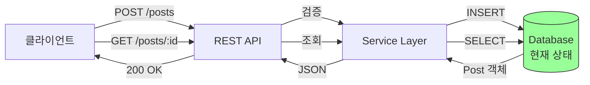
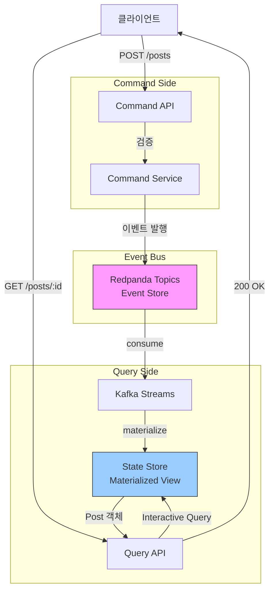
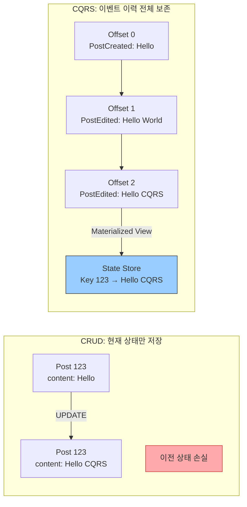
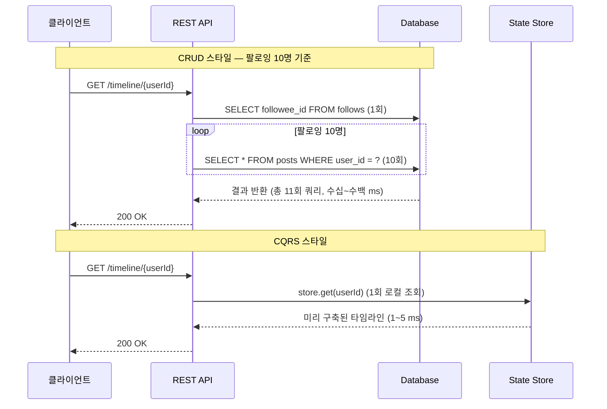
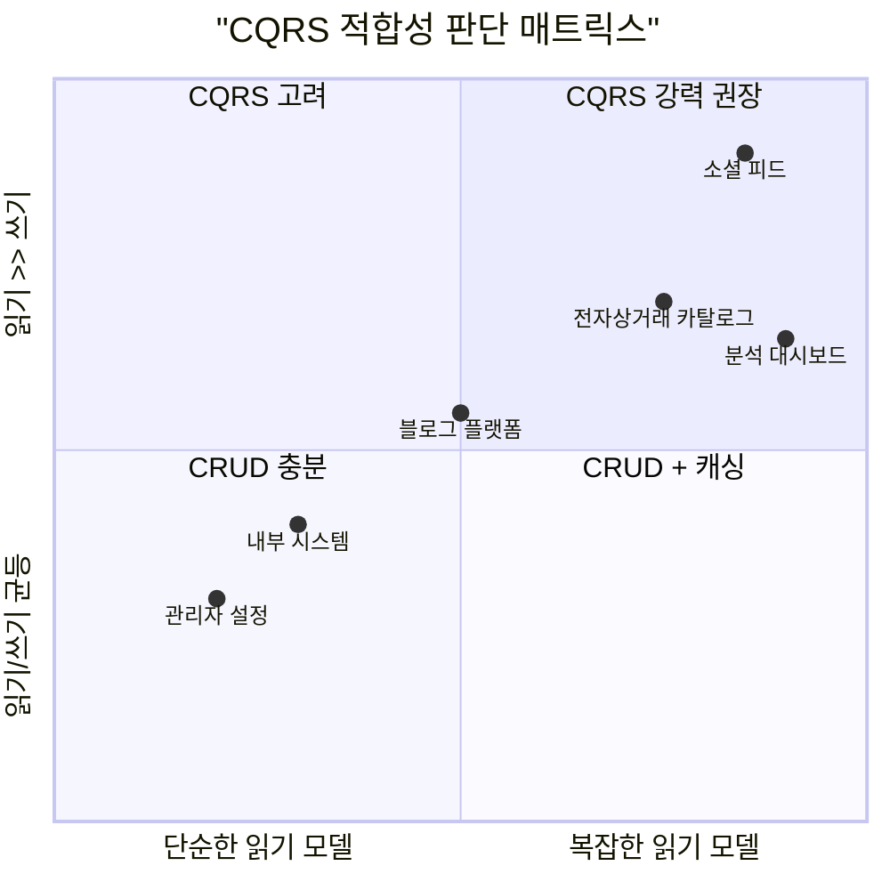
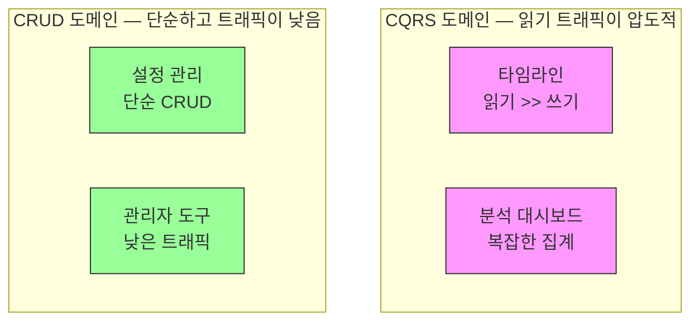

# CQRS vs CRUD 비교

CQRS와 CRUD는 상충 관계에 있는 두 가지 아키텍처 전략이다. 이 문서는 두 접근법의 차이를 코드·성능·적용 판단 기준 세 가지 축으로 분석한다. CQRS 패턴 개요와 JPA/MyBatis N+1 문제 상세 예제는 [01-cqrs-pattern.md](./01-cqrs-pattern.md)를 참조한다.

---

## 기존 ch02/ch07 (CRUD 스타일) vs ch09 (CQRS) 비교

### 데이터 흐름 비교

두 스타일의 가장 큰 차이는 "읽기와 쓰기가 같은 경로를 공유하느냐"에 있다.

#### CRUD 스타일 (ch02, ch07)



단일 DB와 단일 모델을 사용한다. 구조가 단순하고 쓰기 직후 조회하면 즉시 결과가 반영되는 Strong Consistency를 보장한다.

#### CQRS 스타일 (ch09)



Redpanda 토픽이 source of truth 역할을 하며, Kafka Streams가 이벤트를 소비해 State Store에 Materialized View를 구축한다. Query Side가 반영하기까지 약간의 딜레이가 존재하는 Eventual Consistency를 가진다.

---

## 코드 수준 비교

### 1. 쓰기 (Create)

CRUD는 DB 저장 완료 후 결과를 반환하는 동기 처리이고, CQRS는 이벤트 발행 즉시 `202 Accepted`를 반환하는 비동기 처리이다.

#### CRUD 스타일

```java
@RestController
@RequestMapping("/api/posts")
public class PostController {
    @PostMapping
    public ResponseEntity<Post> createPost(@RequestBody CreatePostRequest req) {
        Post post = postService.createPost(req.getUserId(), req.getContent());
        return ResponseEntity.ok(post);  // 201 Created
    }
}

@Service
public class PostService {
    @Transactional
    public Post createPost(String userId, String content) {
        if (content.length() > 280) {
            throw new IllegalArgumentException("Content too long");
        }
        Post post = new Post(UUID.randomUUID().toString(), userId, content, Instant.now());
        return postRepository.save(post);
    }
}
```

#### CQRS 스타일

```java
@RestController
@RequestMapping("/api/commands")
public class PostCommandController {
    private final KafkaTemplate<String, PostCreated> kafkaTemplate;

    @PostMapping("/posts")
    public ResponseEntity<Void> createPost(@RequestBody CreatePostRequest req) {
        if (req.getContent().length() > 280) {
            throw new IllegalArgumentException("Content too long");
        }
        PostCreated event = new PostCreated(
            UUID.randomUUID().toString(),
            req.getUserId(),
            req.getContent(),
            Instant.now()
        );
        kafkaTemplate.send("social.events.posts", event.getPostId(), event);
        return ResponseEntity.accepted().build();  // 202 Accepted
    }
}

public record PostCreated(String postId, String userId, String content, Instant timestamp) {}
```

---

### 2. 읽기 (Read)

CRUD는 DB에 SELECT 쿼리를 보내고, CQRS는 로컬 State Store(RocksDB)를 직접 조회한다. 네트워크 I/O 유무가 성능 차이의 핵심이다.

#### CRUD 스타일

```java
@Transactional(readOnly = true)
public Post getPost(String postId) {
    return postRepository.findById(postId)
        .orElseThrow(() -> new NotFoundException("Post not found"));
}

public interface PostRepository extends JpaRepository<Post, String> {}
```

여러 테이블을 조회할 때 N+1 문제가 발생할 수 있고, 고성능이 필요하면 별도 캐싱 레이어(Redis 등)를 추가해야 한다.

#### CQRS 스타일

```java
// Query Service: Interactive Query로 State Store를 직접 조회한다
@Service
public class PostQueryService {
    private final KafkaStreams kafkaStreams;

    public Post getPost(String postId) {
        ReadOnlyKeyValueStore<String, Post> store = kafkaStreams.store(
            StoreQueryParameters.fromNameAndType("posts-store", QueryableStoreTypes.keyValueStore())
        );
        Post post = store.get(postId);
        if (post == null) throw new NotFoundException("Post not found");
        return post;
    }
}

// Kafka Streams Topology: 이벤트를 소비해 State Store에 Materialized View를 구축한다
@Bean
public KStream<String, PostCreated> postsStream(StreamsBuilder builder) {
    KStream<String, PostCreated> stream = builder.stream("social.events.posts");
    stream.groupByKey().reduce((old, newPost) -> newPost, Materialized.as("posts-store"));
    return stream;
}
```

로컬 RocksDB를 조회하므로 네트워크 I/O가 발생하지 않고, 데이터가 비정규화된 형태로 저장되어 JOIN도 불필요하다.

---

### 3. 상태 저장 방식

CRUD는 현재 상태만 보존하고, CQRS는 상태 변화의 전체 이력을 이벤트 스트림으로 보존한다.



```sql
-- CRUD: UPDATE 시 이전 상태는 영구 손실된다
UPDATE posts SET content = 'Updated content' WHERE post_id = '123';
```

```
-- CQRS: 이벤트 스트림이 source of truth
Kafka Topic: social.events.posts
  Offset 0: PostCreated { postId: "123", content: "Hello" }
  Offset 1: PostEdited  { postId: "123", content: "Hello CQRS" }

State Store: posts-store
  Key: "123" → Value: Post { content: "Hello CQRS" }
```

이벤트 스트림을 처음부터 재생(replay)하면 언제든지 과거 임의 시점의 상태를 복원할 수 있다.

---

## 비교 테이블

| 항목 | ch02/ch07 (CRUD) | ch09 (CQRS) |
|------|------------------|-------------|
| **쓰기** | `PostService.save()` → DB INSERT | `CommandService` → 이벤트 발행 |
| **읽기** | `PostRepository.findById()` → DB SELECT | Interactive Query → State Store 조회 |
| **상태 저장** | DB (현재 상태) | Kafka 토픽 (이벤트 로그) + State Store (Materialized View) |
| **일관성** | Strong (즉시 반영) | Eventual (약간 딜레이) |
| **변경 이력** | 없음 (별도 감사 로그 필요) | 이벤트 스트림에 완전 보존 |
| **스케일링** | DB 스케일링 (수직/수평) | Command/Query 독립적 스케일링 |
| **복잡도** | 낮음 | 높음 (이벤트, Kafka Streams, State Store) |
| **디버깅** | 현재 상태만 확인 | 이벤트 리플레이, 시간 여행 디버깅 |
| **조회 성능** | DB 쿼리 (네트워크 I/O) | State Store (로컬 조회, 빠름) |
| **JOIN** | SQL JOIN (N+1 가능) | Kafka Streams Join (Materialized) |
| **캐싱** | 별도 구현 필요 (Redis 등) | State Store가 캐시 역할 |

---

## 성능 비교

### 읽기 성능 — 타임라인 조회 예시

팔로잉 기반 타임라인처럼 여러 사용자의 데이터를 합쳐야 하는 경우, 두 스타일의 성능 차이가 극명하게 드러난다.



#### CRUD 스타일

```java
@GetMapping("/timeline/{userId}")
public List<Post> getTimeline(@PathVariable String userId) {
    List<String> following = followRepository.findFolloweesByFollowerId(userId);

    // 팔로잉의 포스트를 각각 조회한다 → N+1 문제 발생
    List<Post> timeline = new ArrayList<>();
    for (String followeeId : following) {
        timeline.addAll(postRepository.findByUserId(followeeId));
    }
    timeline.sort(Comparator.comparing(Post::getCreatedAt).reversed());
    return timeline;
}
// 팔로잉 10명 → 총 11번 DB 쿼리 (네트워크 I/O 11회)
```

#### CQRS 스타일

```java
@GetMapping("/timeline/{userId}")
public List<Post> getTimeline(@PathVariable String userId) {
    ReadOnlyKeyValueStore<String, List<Post>> store = kafkaStreams.store(
        StoreQueryParameters.fromNameAndType("timeline-store", QueryableStoreTypes.keyValueStore())
    );
    List<Post> timeline = store.get(userId);
    return timeline != null ? timeline : List.of();
}
// 팔로잉 수와 무관하게 항상 1번 로컬 조회 (네트워크 I/O 없음)
```

**성능 차이**: CRUD 수십~수백 ms vs CQRS 1~5 ms

---

### 쓰기 성능 — 응답 시간 비교

```java
// CRUD: DB INSERT 완료까지 대기 → 10~50ms
Post post = postService.createPost(req);
return ResponseEntity.ok(post);

// CQRS: 이벤트 발행 직후 즉시 반환 → 1~2ms
kafkaTemplate.send("social.events.posts", event);
return ResponseEntity.accepted().build();
```

---

## 언제 CQRS가 적합한가 / 부적합한가

### 판단 매트릭스



적합/부적합 판단 기준의 상세 설명은 [01-cqrs-pattern.md — 적용 기준 섹션](./01-cqrs-pattern.md#적용-기준)을 참조한다. 아래는 구체적인 시나리오별 판단 예시다.

### CQRS가 적합한 경우 — 시나리오 예시

```
소셜 미디어: 포스트 작성 10 req/sec vs 타임라인 조회 1,000 req/sec
→ 읽기가 쓰기보다 100배 많다 → Query Side만 수평 확장

전자상거래 대시보드: 판매 순위, 카테고리별 집계, 시간대별 트렌드
→ 같은 데이터를 여러 형태로 표현해야 한다 → 목적별 Materialized View 구축

MSA 환경: 여러 서비스가 같은 이벤트를 소비한다
→ 이벤트 인프라가 이미 존재한다 → CQRS를 자연스럽게 적용 가능

금융/의료: 모든 변경 이력 보존 + 과거 시점 상태 복원 필요
→ Event Sourcing + CQRS
```

### CQRS가 부적합한 경우 — 시나리오 예시

```
관리자 설정 페이지: 읽기/쓰기 비율 50:50, 단순 키-값 저장
→ CQRS는 over-engineering

은행 송금: 잔액 조회 시 즉시 반영 필요, Eventual Consistency 허용 불가
→ CRUD + 트랜잭션

초기 스타트업: Kafka Streams 경험 없음, 빠른 배포가 최우선
→ CRUD로 시작하고 필요할 때 전환

소규모 프로젝트: Kafka 클러스터 운영 비용·인력 없음
→ CRUD + 단일 DB
```

---

## "CRUD로 충분한데 CQRS를 쓰면 over-engineering" 경고

단순한 관리자 설정 페이지에 CQRS를 적용하면, 얻는 이득은 없고 복잡도만 폭발적으로 증가한다.

```java
// 안티패턴: 하루 10회 설정 변경, 20회 조회에 CQRS 적용
@PostMapping("/settings")
public ResponseEntity<Void> updateSetting(@RequestBody Setting setting) {
    kafkaTemplate.send("settings.events", new SettingUpdated(setting));  // 불필요
    return ResponseEntity.accepted().build();
}

// 올바른 해결책: 단순 CRUD로 충분하다
@PutMapping("/settings")
public ResponseEntity<Setting> updateSetting(@RequestBody Setting setting) {
    return ResponseEntity.ok(settingRepository.save(setting));
}

@GetMapping("/settings/{key}")
public ResponseEntity<Setting> getSetting(@PathVariable String key) {
    return settingRepository.findById(key)
        .map(ResponseEntity::ok)
        .orElse(ResponseEntity.notFound().build());
}
```

문제점: 이벤트·Kafka Streams·State Store로 인한 복잡도 증가, 디버깅 어려움, Kafka 클러스터 운영 비용, 팀 러닝 커브.

---

## 하이브리드 접근: 일부 도메인만 CQRS

CQRS가 필요한 도메인과 CRUD로 충분한 도메인을 구분해서 선택적으로 적용하는 것이 가장 실용적인 전략이다.



```java
// CQRS 도메인: 상품 카탈로그 (조회가 압도적으로 많다)
@PostMapping("/products")
public ResponseEntity<Void> createProduct(@RequestBody Product product) {
    kafkaTemplate.send("products.events", new ProductCreated(product));
    return ResponseEntity.accepted().build();
}

@GetMapping("/products/{id}")
public Product getProduct(@PathVariable String id) {
    return productQueryService.getProduct(id);  // State Store 조회
}

// CRUD 도메인: 관리자 설정 (단순하고 트래픽이 낮다)
@PutMapping("/settings")
public ResponseEntity<Setting> updateSetting(@RequestBody Setting setting) {
    return ResponseEntity.ok(settingRepository.save(setting));
}
```

필요한 곳에만 CQRS를 적용하면 전체 복잡도를 최소화하면서 팀이 점진적으로 학습할 수 있다.

---

## 핵심 교훈

> "CQRS는 트레이드오프다. 복잡성을 추가하는 대신 읽기/쓰기 독립 최적화와 스케일링을 얻는다."

트레이드오프 상세와 점진적 도입 전략은 [01-cqrs-pattern.md — 트레이드오프 / 적용 기준 섹션](./01-cqrs-pattern.md#트레이드오프)을 참조한다.

**도입 전 체크리스트**:
- [ ] CRUD로는 해결할 수 없는 구체적인 문제가 있는가?
- [ ] 팀이 Event Sourcing과 Kafka Streams를 이해하는가?
- [ ] Eventual Consistency를 수용할 수 있는가?
- [ ] Kafka 클러스터 운영 비용을 감당할 수 있는가?

네 항목 모두 체크되면 CQRS 적용을 고려한다. 하나라도 체크되지 않으면 CRUD가 더 나은 선택이다.
