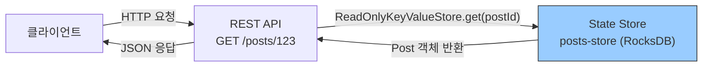
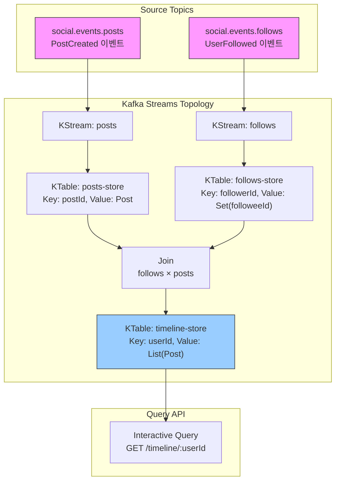
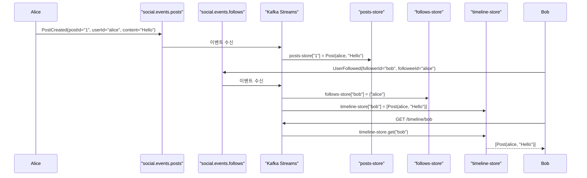

# Kafka Streams Topology — CQRS Materialized View

Interactive Query로 실시간 Materialized View를 구축하여 CQRS의 Query Side를 구현한다.

> **Kafka Streams 기본 내용은 이관되었다.**
> DSL 연산, Serde, Spring Boot 설정, 에러 처리, 테스트 등 Kafka Streams의 범용 내용은 [03-spring-boot-integration/23-kafka-streams-spring-boot](../03-spring-boot-integration/23-kafka-streams-spring-boot.md)을 참조한다. 이 문서는 **CQRS에 특화된 Interactive Query와 프로젝트 토폴로지**에 집중한다.

---

### 다른 챕터와의 관계

| 챕터 | 내용 | 이 문서와의 관계 |
|------|------|----------------|
| [03-spring/23-kafka-streams-spring-boot](../03-spring-boot-integration/23-kafka-streams-spring-boot.md) | Kafka Streams DSL, 조인, 윈도우, 에러 처리, 설정, Serde, 테스트 | Streams 본문 — 범용 내용은 23에서 |
| [09-kafka-streams/01-stream-processing](../09-kafka-streams/01-stream-processing.md) | KStream/KTable 개념, Windowing 이론, EOS | 이론적 기반 |

---

## KStream vs KTable 개요

> 상세 개념과 코드 비교는 [09-kafka-streams/01 §3](../09-kafka-streams/01-stream-processing.md)을 참조한다.

CQRS에서 두 추상화의 역할을 요약하면 다음과 같다.

| 항목 | KStream | KTable |
|------|---------|--------|
| **개념** | 이벤트 스트림 (모든 레코드) | 변경 로그 → 최신 상태 테이블 |
| **SQL 비유** | INSERT 로그 | UPDATE 로그 |
| **CQRS 역할** | Command Side 이벤트 수신 | Query Side Materialized View |
| **조회** | 스트림 처리만 가능 | **State Store로 직접 조회 가능 (Interactive Query)** |

핵심은 KTable이 State Store를 통해 **외부에서 직접 조회 가능**하다는 점이다. 이것이 CQRS Query Side로 Kafka Streams를 사용하는 이유다.

---

## Interactive Query: 외부에서 State Store 조회

### 기본 개념

Interactive Query는 **Kafka Streams 내부의 State Store를 HTTP API 같은 외부 인터페이스에서 직접 조회할 수 있게 해주는 기능**이다. 이를 통해 Kafka Streams가 관리하는 Materialized View를 별도 DB 없이 Query Side로 활용할 수 있다.



### 구현 예시

```java
@Service
public class PostQueryService {
    private final KafkaStreams kafkaStreams;

    public PostQueryService(KafkaStreams kafkaStreams) {
        this.kafkaStreams = kafkaStreams;
    }

    // 단건 조회: postId로 Post 조회
    public Post getPost(String postId) {
        ReadOnlyKeyValueStore<String, Post> store = kafkaStreams.store(
            StoreQueryParameters.fromNameAndType(
                "posts-store",
                QueryableStoreTypes.keyValueStore()
            )
        );

        Post post = store.get(postId);
        if (post == null) {
            throw new NotFoundException("Post not found: " + postId);
        }
        return post;
    }

    // 전체 조회: 모든 Post 반환
    public List<Post> getAllPosts() {
        ReadOnlyKeyValueStore<String, Post> store = kafkaStreams.store(
            StoreQueryParameters.fromNameAndType(
                "posts-store",
                QueryableStoreTypes.keyValueStore()
            )
        );

        List<Post> posts = new ArrayList<>();
        try (KeyValueIterator<String, Post> iter = store.all()) {
            while (iter.hasNext()) {
                posts.add(iter.next().value);
            }
        }
        return posts;
    }
}

@RestController
@RequestMapping("/api/posts")
public class PostQueryController {
    private final PostQueryService queryService;

    @GetMapping("/{postId}")
    public Post getPost(@PathVariable String postId) {
        return queryService.getPost(postId);
    }

    @GetMapping
    public List<Post> getAllPosts() {
        return queryService.getAllPosts();
    }
}
```

### 장점과 주의사항

Interactive Query의 가장 큰 장점은 **네트워크 I/O 없이 로컬 RocksDB를 직접 읽기 때문에 응답이 빠르다**는 점이다. 이벤트가 발생하면 State Store가 즉시 갱신되므로 항상 최신 데이터를 조회할 수 있다.

다만, 애플리케이션 시작 직후에는 State Store가 아직 Changelog 토픽에서 상태를 복구 중일 수 있다. 이 시점에 조회하면 빈 결과를 반환할 수 있으므로, 반드시 `State.RUNNING` 상태를 확인해야 한다.

```java
public Post getPost(String postId) {
    // 스트림이 RUNNING 상태가 아니면 요청 거부
    if (kafkaStreams.state() != KafkaStreams.State.RUNNING) {
        throw new ServiceUnavailableException(
            "Streams not ready. State: " + kafkaStreams.state());
    }
    // ... 조회 로직
}
```

State Store 준비 시간은 데이터 양에 따라 수초에서 수분까지 소요될 수 있다. 초기 기동 시 이 점을 반드시 고려해야 한다.

---

## 이 프로젝트의 토폴로지

### 목표: 타임라인 Materialized View 구축

타임라인이란 **내가 팔로우하는 사람들이 작성한 포스트의 모음**이다. 포스트 이벤트와 팔로우 이벤트 두 토픽을 Join하여 사용자별 타임라인을 State Store에 미리 계산해둔다.



### 코드 구현

> 이 코드에서 사용하는 Serde, @EnableKafkaStreams 설정, @Bean 패턴은 [ch23 §2~3](../03-spring-boot-integration/23-kafka-streams-spring-boot.md)을 참조한다.

```java
@Configuration
public class TimelineTopology {

    @Bean
    public KStream<String, Object> timelineStream(StreamsBuilder builder) {

        // 1. Posts KTable: postId를 key로 최신 Post 상태를 유지
        KTable<String, Post> postsTable = builder
            .stream("social.events.posts",
                    Consumed.with(Serdes.String(), new JsonSerde<>(PostCreated.class)))
            .mapValues(event -> new Post(event.postId(), event.userId(),
                                        event.content(), event.timestamp()))
            .groupByKey()
            .reduce(
                (old, newPost) -> newPost,  // 최신 Post로 교체
                Materialized.as("posts-store")
            );

        // 2. Follows KTable: followerId를 key로, 팔로우 중인 사용자 Set을 집계
        KTable<String, Set<String>> followsTable = builder
            .stream("social.events.follows",
                    Consumed.with(Serdes.String(), new JsonSerde<>(UserFollowed.class)))
            .groupByKey()
            .aggregate(
                HashSet::new,  // 초기값: 빈 Set
                (followerId, event, followees) -> {
                    followees.add(event.followeeId());
                    return followees;
                },
                Materialized.as("follows-store")
            );

        // 3. posts를 userId(작성자) 기준으로 re-keying
        //    이유: Join의 key가 일치해야 하므로, postId → userId로 변환
        KTable<String, Post> postsByUser = postsTable
            .toStream()
            .selectKey((postId, post) -> post.getUserId())
            .groupByKey()
            .reduce((old, newPost) -> newPost);

        // 4. Join: followsTable × postsByUser → 팔로워의 타임라인 구축
        KTable<String, List<Post>> timelineTable = followsTable
            .join(
                postsByUser,
                (followees, post) -> {
                    List<Post> timeline = new ArrayList<>();
                    if (followees.contains(post.getUserId())) {
                        timeline.add(post);
                    }
                    return timeline;
                },
                Materialized.as("timeline-store")
            );

        return builder.stream("social.events.posts");
    }
}
```

### 동작 흐름 예시

아래는 Alice가 포스트를 작성하고 Bob이 타임라인을 조회하는 전체 흐름이다.



---

## 핵심 교훈

> "Interactive Query = 별도 DB 없는 CQRS Query Side.<br>
> State Store가 Materialized View 역할을 하고, HTTP API로 직접 조회한다."

- **Materialized View = State Store다.** 외부 DB에 미리 계산해두는 것과 동일한 효과를 State Store로 달성한다.
- **Interactive Query로 HTTP API를 직접 제공할 수 있다.** 별도 읽기 전용 DB 없이 State Store가 Query Side 역할을 한다.
- **State.RUNNING 확인 필수.** 기동 직후에는 Changelog 토픽에서 상태를 복구 중이므로, 조회 전 상태를 확인해야 한다.
- **Kafka Streams 범용 내용**(DSL 연산, Serde, 설정, 에러 처리, 튜닝, 테스트)은 [ch23](../03-spring-boot-integration/23-kafka-streams-spring-boot.md)을 참조한다.
