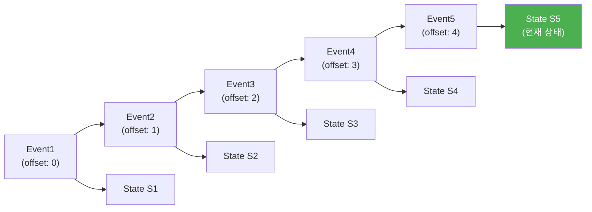
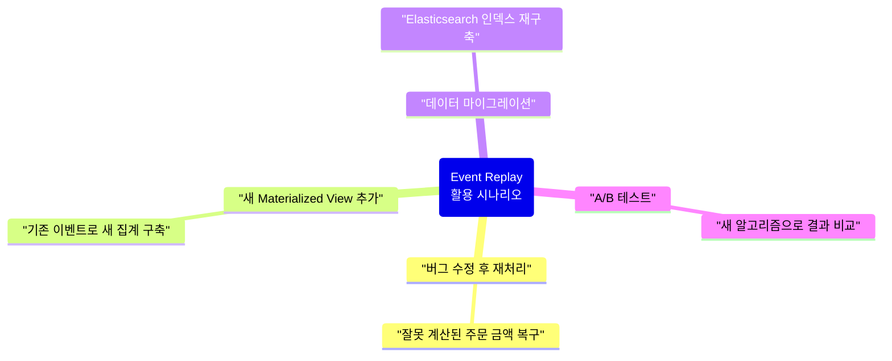
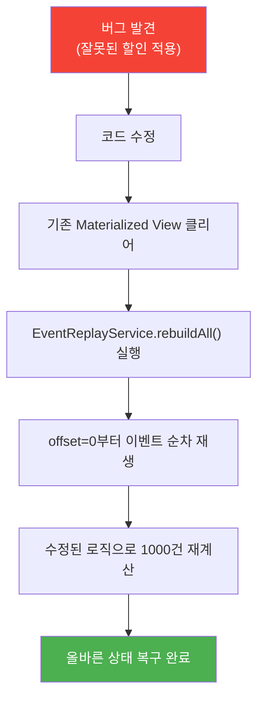
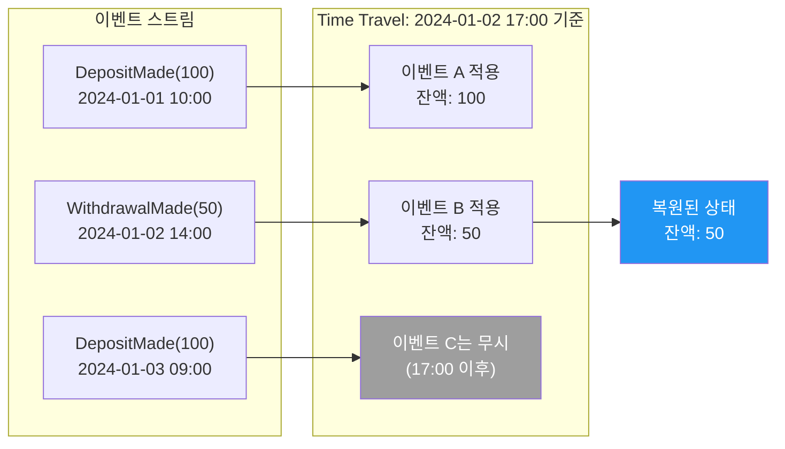
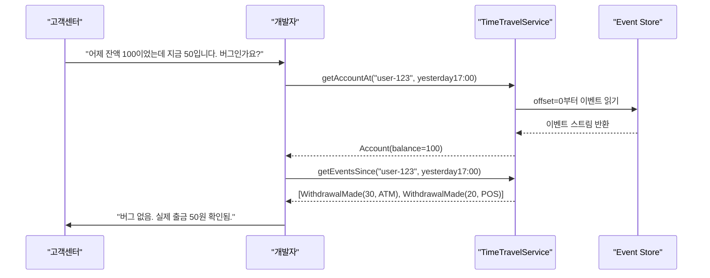
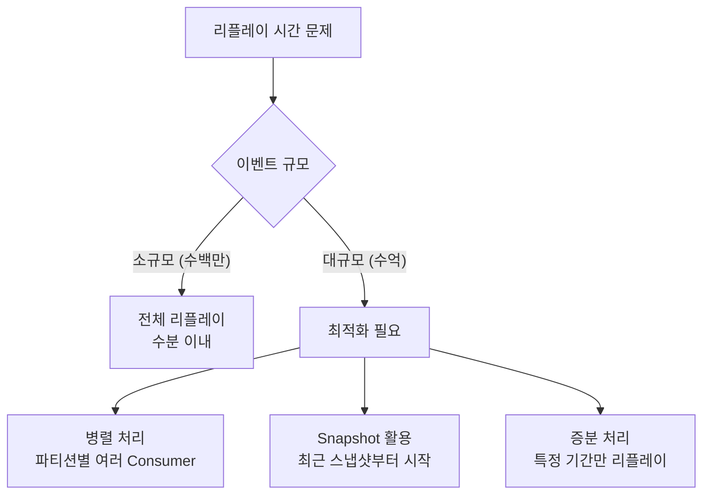
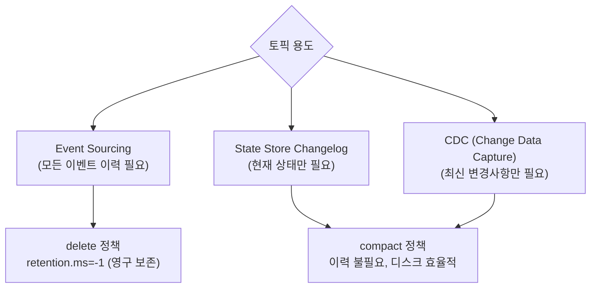
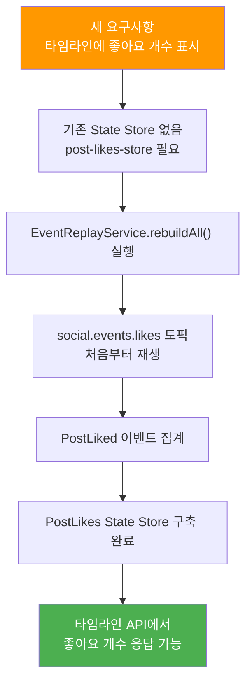

# Event Replay & Time Travel

이벤트 리플레이로 과거 상태를 복원하는 방법

## Event Replay란 무엇인가

Event Replay는 Event Store에 쌓인 이벤트를 처음부터 다시 재생하여 특정 상태를 재구축하는 프로세스이다. 이것이 가능한 이유는 이벤트가 애플리케이션의 유일한 source of truth이기 때문이다. 이벤트 스트림은 변경 불가능한 기록이므로, 그 기록을 처음부터 순서대로 다시 적용하면 어느 시점이든 동일한 상태를 얻을 수 있다.



각 이벤트를 순서대로 상태에 적용하면, 최종적으로 현재 상태인 S5에 도달한다. 이 흐름은 결정론적(deterministic)이기 때문에 몇 번을 반복해도 동일한 결과가 보장된다.

## 왜 Event Replay가 필요한가

Event Replay는 단순한 기술적 기능이 아니라, 프로덕션 운영에서 실질적인 문제를 해결하는 핵심 도구이다.



### 1. 버그 수정 후 재처리

버그로 인해 수천 건의 데이터가 잘못 저장된 상황을 생각해보자. 기존 시스템이라면 잘못된 데이터를 직접 수정하는 복잡한 마이그레이션 스크립트를 작성해야 한다. 하지만 Event Sourcing을 사용하면 버그를 수정한 후 이벤트를 처음부터 다시 재생하기만 하면 된다.

```java
// 버그가 있는 코드: 할인 코드와 무관하게 항상 10% 할인을 적용
@EventListener
public void on(OrderPlaced event) {
    // 버그: 모든 주문에 강제로 10% 할인 적용
    BigDecimal total = event.getAmount().multiply(new BigDecimal("0.9"));
    orderRepository.save(new Order(event.getOrderId(), total));
}

// 문제: 이미 처리된 1000건의 주문이 잘못된 금액으로 저장됨
```

```java
// 수정된 코드: 할인 코드가 있는 경우에만 10% 할인 적용
@EventListener
public void on(OrderPlaced event) {
    BigDecimal total = event.getAmount();
    if (event.getDiscountCode() != null) {
        total = total.multiply(new BigDecimal("0.9"));  // 할인 코드가 있을 때만
    }
    orderRepository.save(new Order(event.getOrderId(), total));
}

// 이벤트 리플레이 → 1000건 재계산 → 올바른 금액으로 저장
```



### 2. 새로운 Materialized View 추가

새로운 비즈니스 요구사항이 생겨 기존에 없던 집계 데이터가 필요해졌을 때, Event Replay는 과거 이벤트 전체를 재처리하여 새로운 뷰를 즉시 구축한다. 이것이 가능한 이유는 이벤트가 사실(fact)을 기록하고 있기 때문이다. 과거에 무엇을 저장했느냐와 무관하게, 이벤트 스트림에서 필요한 정보를 언제든지 새롭게 파생시킬 수 있다.

```
기존: 사용자별 포스트 개수만 저장
새 요구사항: 사용자별 태그별 포스트 개수도 필요

→ 새로운 State Store 추가
→ 전체 이벤트 리플레이
→ 태그별 집계 Materialized View 구축
```

### 3. 데이터 마이그레이션

기존에 PostgreSQL에만 현재 상태를 저장하고 있었는데, 전문 검색 기능을 위해 Elasticsearch를 도입해야 하는 경우를 생각해보자. 이벤트 리플레이를 통해 전체 이벤트를 재처리하면 Elasticsearch 인덱스를 완전히 구축할 수 있다.

```
기존: PostgreSQL에 현재 상태만 저장
마이그레이션: Elasticsearch로 검색 기능 추가

→ 이벤트 리플레이
→ Elasticsearch 인덱스 구축
→ 검색 가능
```

### 4. A/B 테스트 및 실험

새로운 추천 알고리즘이 기존보다 더 나은 결과를 낼지 확인하고 싶다면, 새 Consumer Group을 생성하고 새 알고리즘으로 이벤트를 재생한다. 기존 시스템을 전혀 건드리지 않고 새 알고리즘의 결과를 독립적으로 검증할 수 있다.

```
실험: 다른 추천 알고리즘으로 타임라인을 구축하면 어떻게 될까?

→ 새 Consumer Group 생성
→ 새 알고리즘으로 이벤트 리플레이
→ 결과 비교
```

## 구현 방법

### 1. 새 Consumer Group 생성

Event Replay의 핵심은 기존 Consumer Group과 완전히 독립된 새 Group을 만드는 것이다. Consumer Group은 각자 독립적인 offset을 관리하기 때문에, 새 Group은 기존 Group의 처리 상태에 전혀 영향을 주지 않고 처음부터 이벤트를 읽을 수 있다.

```java
// 기존 Consumer Group: 정상 운영 중
@KafkaListener(
    topics = "social.events.posts",
    groupId = "timeline-service"  // 기존 group
)
public void handlePostEvent(PostCreated event) {
    // 정상 처리
}

// 새 Consumer Group (리플레이 전용)
@Service
public class EventReplayService {
    private final KafkaConsumer<String, PostCreated> consumer;

    public EventReplayService() {
        Properties props = new Properties();
        props.put(ConsumerConfig.BOOTSTRAP_SERVERS_CONFIG, "localhost:9092");
        props.put(ConsumerConfig.GROUP_ID_CONFIG, "replay-" + UUID.randomUUID());  // 매번 새 group
        props.put(ConsumerConfig.AUTO_OFFSET_RESET_CONFIG, "earliest");  // 처음부터 읽기
        props.put(ConsumerConfig.ENABLE_AUTO_COMMIT_CONFIG, "false");  // 수동 커밋

        consumer = new KafkaConsumer<>(props);
        consumer.subscribe(List.of("social.events.posts"));
    }

    public void replayAll() {
        while (true) {
            ConsumerRecords<String, PostCreated> records = consumer.poll(Duration.ofSeconds(1));
            for (ConsumerRecord<String, PostCreated> record : records) {
                processEvent(record.value());
            }

            if (records.isEmpty()) {
                break;  // 모든 이벤트 처리 완료
            }

            consumer.commitSync();  // 수동 커밋
        }
    }

    private void processEvent(PostCreated event) {
        // 새 로직으로 처리
    }
}
```

세 가지 설정이 Event Replay를 가능하게 한다. `auto.offset.reset=earliest`는 저장된 offset이 없을 때 토픽의 가장 처음부터 읽도록 지시한다. 새로 생성된 `UUID` 기반의 Group ID는 기존 offset 정보가 없으므로 항상 처음부터 시작한다. 수동 커밋(`ENABLE_AUTO_COMMIT_CONFIG=false`)은 재처리 중 실패가 발생했을 때 해당 지점부터 재시도할 수 있게 한다.

### 2. 전체 이벤트 리플레이

새로운 Materialized View를 구축하는 전체 리플레이 구현이다. `seekToBeginning`을 사용하면 이미 할당된 파티션의 offset을 강제로 처음으로 되돌릴 수 있다.

```java
@Service
public class EventReplayService {
    private final KafkaConsumer<String, Event> consumer;
    private final NewMaterializedViewRepository newViewRepo;

    public void rebuildMaterializedView() {
        log.info("Starting event replay...");

        long processedCount = 0;
        consumer.seekToBeginning(consumer.assignment());  // 처음으로 이동

        while (true) {
            ConsumerRecords<String, Event> records = consumer.poll(Duration.ofSeconds(1));

            for (ConsumerRecord<String, Event> record : records) {
                updateView(record.value());
                processedCount++;

                if (processedCount % 1000 == 0) {
                    log.info("Processed {} events", processedCount);
                }
            }

            if (records.isEmpty()) {
                log.info("Event replay completed. Total: {}", processedCount);
                break;
            }

            consumer.commitSync();
        }
    }

    private void updateView(Event event) {
        // 새로운 비즈니스 로직으로 Materialized View 업데이트
        if (event instanceof PostCreated created) {
            NewView view = new NewView(created.userId(), created.tags());
            newViewRepo.save(view);
        }
    }
}
```

### 3. 새로운 State Store에 적재

Kafka Streams를 사용하면 새 Topology와 새 Application ID를 정의하는 것만으로 전체 이벤트 리플레이를 자동으로 수행할 수 있다. Kafka Streams는 Application ID를 Consumer Group ID로 사용하기 때문에, Application ID를 변경하면 기존 offset과 무관하게 새 Group으로 동작한다.

```java
@Configuration
public class NewTopologyConfig {

    @Bean
    public KStream<String, PostCreated> newTopology(StreamsBuilder builder) {
        KStream<String, PostCreated> stream = builder.stream("social.events.posts");

        // 새로운 집계: 태그별 포스트 개수
        KTable<String, Long> postsByTag = stream
            .flatMapValues(event -> event.tags())  // 태그 추출
            .groupBy((key, tag) -> tag)
            .count(Materialized.as("posts-by-tag-store"));  // 새 State Store

        return stream;
    }
}

// Application 설정: 처음부터 읽기
spring.kafka.streams.auto-offset-reset=earliest
spring.kafka.streams.application-id=new-topology-v2  // 새 앱 ID → 새 Consumer Group
```

동작 원리는 세 단계로 이루어진다. 새 Application ID로 인해 Kafka Streams는 새 Consumer Group을 생성한다. 저장된 offset이 없으므로 `auto-offset-reset=earliest`에 따라 처음부터 읽기 시작한다. 전체 이벤트를 재생하여 새 State Store를 완전히 구축한다.

## 시간 여행 디버깅

### 개념

Time Travel 디버깅은 "특정 시점의 상태는 어떠했는가?"라는 질문에 답하는 기능이다. 이것이 가능한 이유는 이벤트에 타임스탬프가 포함되어 있기 때문이다. 특정 시각 이후의 이벤트를 무시하고 그 이전 이벤트만 재생하면, 해당 시각의 상태를 정확히 복원할 수 있다.



### 구현: 타임스탬프 기반 필터링

```java
public class TimeTravelService {
    private final KafkaConsumer<String, Event> consumer;

    public Account getAccountAt(String accountId, Instant targetTime) {
        consumer.seekToBeginning(consumer.assignment());

        Account account = new Account();

        while (true) {
            ConsumerRecords<String, Event> records = consumer.poll(Duration.ofSeconds(1));

            for (ConsumerRecord<String, Event> record : records) {
                Event event = record.value();

                // targetTime 이후 이벤트는 무시하고 즉시 반환
                if (event.timestamp().isAfter(targetTime)) {
                    return account;
                }

                // targetTime 이전 이벤트만 순서대로 적용
                if (event instanceof DepositMade deposit) {
                    account.apply(deposit);
                } else if (event instanceof WithdrawalMade withdrawal) {
                    account.apply(withdrawal);
                }
            }

            if (records.isEmpty()) {
                return account;
            }
        }
    }
}

// 사용
Account accountYesterday = timeTravelService.getAccountAt(
    "account-123",
    Instant.parse("2024-01-02T17:00:00Z")
);
System.out.println("Balance at yesterday 17:00: " + accountYesterday.getBalance());
```

### 디버깅 활용

Time Travel의 실제 가치는 고객 문의나 버그 리포트를 조사할 때 드러난다. "어제는 잔액이 100이었는데 지금 50이다"라는 신고가 들어왔을 때, 과거 특정 시점의 상태를 즉시 복원하고 그 이후 발생한 이벤트를 순서대로 조회하면 변경 원인을 명확히 파악할 수 있다.

```java
// 문제: 사용자가 "어제는 잔액이 100이었는데, 지금 50이다. 버그인가?" 보고

// 1. 시간 여행으로 어제 상태 확인
Account yesterday = timeTravelService.getAccountAt("user-123", yesterday17);
System.out.println("Yesterday balance: " + yesterday.getBalance());  // 100

// 2. 어제 이후 이벤트 조회
List<Event> eventsSinceYesterday = getEventsSince("user-123", yesterday17);
eventsSinceYesterday.forEach(System.out::println);
// 출력:
// WithdrawalMade(amount: 30, reason: "ATM", timestamp: 2024-01-03 08:00)
// WithdrawalMade(amount: 20, reason: "POS", timestamp: 2024-01-03 09:00)

// 결론: 버그 아님. 실제로 50 출금함.
```



## 주의사항

Event Replay는 강력하지만, 프로덕션에서 활용하려면 반드시 고려해야 할 네 가지 제약이 있다.

### 1. 리플레이 시간

이벤트 수가 많아질수록 리플레이에 걸리는 시간이 선형으로 증가한다. 100만 건은 약 1.6분이지만, 1억 건이라면 2.7시간이 소요된다. 이 시간 동안 새 Materialized View는 아직 구축 중이므로 서비스 가용성에 영향을 줄 수 있다.

```
이벤트 개수: 1,000,000개
처리 속도: 10,000 events/sec
리플레이 시간: 100초 (약 1.6분)

이벤트 개수: 100,000,000개 (1억)
처리 속도: 10,000 events/sec
리플레이 시간: 10,000초 (약 2.7시간)
```



### 2. 토픽 보존 기간

Kafka 토픽의 기본 보존 기간은 7일이다. 이는 7일 이전의 이벤트가 자동으로 삭제됨을 의미하며, 삭제된 이벤트는 리플레이할 수 없다. Event Sourcing에서는 이벤트가 source of truth이므로, 이벤트를 잃는다는 것은 과거 상태를 영구적으로 복원할 수 없다는 뜻이다. 따라서 Event Sourcing용 토픽은 반드시 영구 보존 또는 충분히 긴 보존 기간으로 설정해야 한다.

```java
// Kafka 토픽 기본 설정 (위험)
retention.ms=604800000  // 7일 → 7일 이전 이벤트는 삭제됨 → 리플레이 불가

// Event Sourcing용 토픽 설정 (권장)
retention.ms=-1  // 영구 보존

// 또는 비즈니스 요건에 따른 충분한 보존 기간
retention.ms=31536000000  // 1년
```

### 3. 외부 부수효과 (이메일 재전송 등)

Event Replay에서 가장 조심해야 할 함정은 외부 시스템 호출이다. 이벤트 핸들러가 이메일 발송이나 결제 요청 같은 외부 부수효과를 포함하고 있다면, 리플레이 시 해당 작업이 다시 실행된다. 고객에게 동일한 이메일이 수천 번 전송되거나, 결제가 중복으로 처리될 수 있다. 이를 방지하려면 모든 외부 호출에 멱등성(idempotency)을 보장해야 한다.

```java
// 위험: 리플레이 시 이메일이 다시 전송됨
@EventListener
public void on(OrderPlaced event) {
    emailService.sendOrderConfirmation(event.getCustomerEmail());  // 리플레이마다 재발송!
}

// 안전: 멱등성 보장 — 이미 발송된 경우 스킵
@EventListener
public void on(OrderPlaced event) {
    String idempotencyKey = event.getOrderId();
    if (!emailSentRepository.existsByKey(idempotencyKey)) {
        emailService.sendOrderConfirmation(event.getCustomerEmail());
        emailSentRepository.save(idempotencyKey);
    }
}
```

외부 시스템 호출은 반드시 멱등성을 보장해야 한다. 동일한 이벤트를 몇 번 처리하더라도 외부에 미치는 효과는 정확히 한 번이어야 한다.

### 4. 이벤트 스키마 변경

이벤트는 한번 저장되면 변경할 수 없다. 따라서 시스템이 진화하면서 이벤트 스키마가 변경되더라도, 과거에 저장된 이벤트는 구버전 스키마를 그대로 유지한다. 리플레이 시 구버전 이벤트를 신버전 코드로 역직렬화하면 새로 추가된 필드가 `null`이 되는 문제가 발생한다.

```java
// v1: 초기 이벤트 스키마
public record PostCreated(String postId, String userId, String content) {}

// v2: 태그 필드 추가
public record PostCreated(String postId, String userId, String content, List<String> tags) {}

// 문제: v1 이벤트를 v2로 역직렬화하면 tags=null → NullPointerException 가능
```

```java
// 해결: Backward 호환성 유지 — null 대신 빈 리스트를 기본값으로
public record PostCreated(
    String postId,
    String userId,
    String content,
    @JsonInclude(JsonInclude.Include.NON_NULL)
    List<String> tags  // null 허용
) {
    public PostCreated {
        if (tags == null) {
            tags = List.of();  // 구버전 이벤트의 null을 빈 리스트로 변환
        }
    }
}
```

## Compacted 토픽 vs Delete 토픽에서의 리플레이 차이

Kafka 토픽의 Log Cleanup Policy는 Event Replay 가능 여부와 직결되기 때문에, 용도에 맞는 정책을 선택하는 것이 매우 중요하다.

### Delete 토픽 (Log Cleanup Policy: delete)

Delete 정책은 retention 기간 내의 모든 이벤트를 보존한다. 어떤 key로 몇 번의 이벤트가 발생했든 모두 유지되기 때문에, 이벤트의 전체 이력을 재생해야 하는 Event Sourcing에 적합하다.

```
이벤트 스트림 (모든 이벤트 보존):
[Event1] → [Event2] → [Event3] → [Event4] → [Event5]

리플레이: 모든 이벤트를 순서대로 재생 → 완전한 상태 복원 가능
```

### Compacted 토픽 (Log Cleanup Policy: compact)

Compact 정책은 동일한 key의 이벤트 중 가장 최신 값만 유지하고 이전 값은 삭제한다. 현재 상태만 빠르게 복원할 수 있으므로 State Store Changelog나 CDC에는 유용하지만, 과거 이벤트를 모두 재생해야 하는 Event Sourcing에는 사용할 수 없다.

```
원본 이벤트:
Key: user-1, Value: {name: "Alice"}   (offset: 0)
Key: user-2, Value: {name: "Bob"}     (offset: 1)
Key: user-1, Value: {name: "Alice2"}  (offset: 2)  // 같은 key

Compaction 후 (offset 0은 삭제됨):
Key: user-2, Value: {name: "Bob"}     (offset: 1)
Key: user-1, Value: {name: "Alice2"}  (offset: 2)  // 최신 값만 유지
```

### 선택 기준



| 용도 | Cleanup Policy | 이유 |
|------|----------------|------|
| Event Sourcing | `delete` | 모든 이벤트 이력을 재생해야 하므로 |
| State Store Changelog | `compact` | 현재 상태만 복원하면 되므로 |
| CDC (Change Data Capture) | `compact` | 최신 변경사항만 필요하므로 |

## 이 프로젝트: EventReplayService.rebuildAll()

### 시나리오

타임라인 서비스의 새로운 요구사항으로 포스트의 좋아요 개수를 함께 표시해야 한다고 가정하자. 기존에는 좋아요 개수를 집계하는 State Store가 없었기 때문에, 모든 과거 좋아요 이벤트를 리플레이하여 새 State Store를 구축해야 한다.



### 구현

```java
@Service
public class EventReplayService {
    private final KafkaConsumer<String, Event> consumer;
    private final PostLikesRepository likesRepo;

    @PostConstruct
    public void init() {
        Properties props = new Properties();
        props.put(ConsumerConfig.BOOTSTRAP_SERVERS_CONFIG, "localhost:9092");
        props.put(ConsumerConfig.GROUP_ID_CONFIG, "replay-" + UUID.randomUUID());
        props.put(ConsumerConfig.AUTO_OFFSET_RESET_CONFIG, "earliest");

        consumer = new KafkaConsumer<>(props);
        consumer.subscribe(List.of("social.events.posts", "social.events.likes"));
    }

    public void rebuildAll() {
        log.info("Starting full event replay...");

        Map<String, Integer> likesCount = new HashMap<>();
        consumer.seekToBeginning(consumer.assignment());

        while (true) {
            ConsumerRecords<String, Event> records = consumer.poll(Duration.ofSeconds(1));

            for (ConsumerRecord<String, Event> record : records) {
                if (record.value() instanceof PostLiked liked) {
                    likesCount.merge(liked.postId(), 1, Integer::sum);
                }
            }

            if (records.isEmpty()) {
                break;
            }
        }

        // 집계 결과를 State Store에 저장
        likesCount.forEach((postId, count) -> {
            likesRepo.save(new PostLikes(postId, count));
        });

        log.info("Event replay completed. Total posts: {}", likesCount.size());
    }
}

// 관리자 API를 통한 리플레이 트리거
@PostMapping("/admin/replay")
public ResponseEntity<Void> triggerReplay() {
    eventReplayService.rebuildAll();
    return ResponseEntity.accepted().build();
}
```

### 테스트

```java
@Test
public void testEventReplay() {
    // 1. 기존 State Store 클리어
    likesRepository.deleteAll();

    // 2. 이벤트 발행
    kafkaTemplate.send("social.events.likes", new PostLiked("post-1", "user-1"));
    kafkaTemplate.send("social.events.likes", new PostLiked("post-1", "user-2"));
    kafkaTemplate.send("social.events.likes", new PostLiked("post-2", "user-3"));

    // 3. 리플레이
    eventReplayService.rebuildAll();

    // 4. 검증
    assertThat(likesRepository.findById("post-1").getLikesCount()).isEqualTo(2);
    assertThat(likesRepository.findById("post-2").getLikesCount()).isEqualTo(1);
}
```

## 핵심 교훈

> "Event Sourcing의 가장 큰 장점은 이벤트 리플레이와 시간 여행 디버깅이다. <br>
> 하지만 외부 부수효과, 토픽 보존 기간, 스키마 변경에 주의해야 한다."

이벤트가 source of truth이기 때문에 상태는 언제든 이벤트 스트림에서 재파생될 수 있다. 이 특성이 버그 수정 후 재처리, 새 Materialized View 추가, 데이터 마이그레이션을 모두 단순화한다. Time Travel 디버깅은 타임스탬프 기반 필터링만으로 과거 특정 시점의 상태를 정확히 복원하여, 고객 문의나 버그 조사를 극적으로 단순화한다.

반면 리플레이를 운영에 도입하려면 네 가지를 반드시 고려해야 한다. 이벤트 수가 증가할수록 리플레이 시간도 증가하므로 Snapshot과 병렬 처리로 대응해야 한다. 토픽 보존 기간이 짧으면 과거 이벤트가 삭제되어 리플레이 자체가 불가능해진다. 외부 시스템 호출은 반드시 멱등성을 보장해야 한다. 스키마가 변경될 때는 구버전 이벤트와의 Backward 호환성을 유지해야 한다. 마지막으로 Event Sourcing 토픽은 Delete 정책을 사용해야 하며, Compact 정책은 State Store Changelog에만 사용해야 한다.
