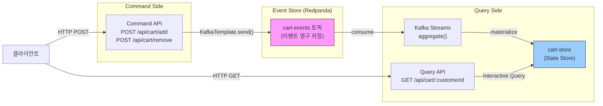
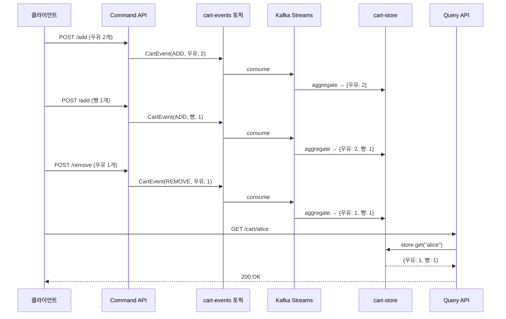

# CQRS 실습 — 장바구니 이벤트 소싱 (Kafka Streams)

이 문서는 장바구니(shopping cart) 도메인을 사용해 CQRS 패턴을 단계별로 구현하는 실습이다. Confluent의 Event Design 코스에서 ksqlDB SQL로 작성된 장바구니 데모를 Kafka Streams Java 코드로 변환하여, Redpanda 환경에서 동작하도록 재구성한다.

왜 ksqlDB 대신 Kafka Streams인가? ksqlDB는 선언적 SQL로 빠르게 프로토타이핑할 수 있지만, 별도의 ksqlDB 서버가 필요하고 Redpanda와의 호환성이 제한적이다. 반면 Kafka Streams는 Spring Boot 애플리케이션에 내장되어 추가 인프라 없이 동작하며, Redpanda와 완전히 호환된다. 이 실습에서는 ksqlDB 원본을 참고한 뒤 동일한 로직을 Java로 구현하는 과정을 밟는다.

> **출처**: Confluent Event Design 코스 — Hands-On: Shopping Cart CQRS
> **원본**: ksqlDB SQL 기반 실습을 Kafka Streams Java로 변환
> **선행**: [01-cqrs-pattern.md](01-cqrs-pattern.md) — CQRS 이론, [04-kafka-streams-topology.md](04-kafka-streams-topology.md) — Interactive Query

---

## 다른 문서와의 관계

| 문서 | 관계 |
|------|------|
| [01-cqrs-pattern.md](01-cqrs-pattern.md) | CQRS 이론 — 이 실습의 개념적 기반 |
| [04-kafka-streams-topology.md](04-kafka-streams-topology.md) | Interactive Query, State Store — Query Side 구현 기술 |
| [09-kafka-streams/08-single-vs-multiple-streams-handson.md](../09-kafka-streams/08-single-vs-multiple-streams-handson.md) | 같은 장바구니 도메인이지만 관점이 다름 (아래 설명) |

---

## 09-kafka-streams/08과의 차이점

같은 장바구니 도메인을 다루지만, 두 문서가 탐구하는 질문은 근본적으로 다르다.

**09-kafka-streams/08 — Event Design 관점**: "장바구니 이벤트를 어떻게 설계할 것인가?"가 핵심 질문이다. ADD와 REMOVE를 하나의 토픽에 담을지 분리할지, `action` 필드로 구분하는 단일 스트림 방식의 trade-off는 무엇인지, `branch`/`split` 패턴으로 이벤트 타입을 분기 처리하는 방법은 무엇인지를 다룬다. 관심사는 이벤트의 구조와 토픽 설계 원칙에 있다.

**06-cqrs/06 (이 문서) — CQRS 관점**: "Command와 Query를 어떻게 분리할 것인가?"가 핵심 질문이다. Command API가 이벤트를 발행하는 쓰기 경로, Kafka Streams가 이벤트를 집계하여 Materialized View를 구축하는 과정, Interactive Query로 REST 조회 API를 제공하는 읽기 경로를 분리하여 구현한다. 관심사는 책임 분리 아키텍처에 있다.

정리하면 08은 "이벤트를 어떤 모양으로 만들까"에, 이 문서는 "만들어진 이벤트로 읽기/쓰기를 어떻게 분리할까"에 집중한다.

---

## 시나리오: 장바구니 CQRS

사용자가 온라인 쇼핑몰에서 상품을 장바구니에 담거나 제거하는 상황을 가정한다. 이 행위는 Command로 표현되고, 시스템은 이를 이벤트로 변환하여 Redpanda 토픽에 저장한다. Query Side에서는 Kafka Streams가 이벤트를 실시간으로 집계하여 "현재 장바구니에 뭐가 들어있어?"라는 질문에 즉시 응답할 수 있는 Materialized View를 유지한다.

핵심 요소를 정리하면 다음과 같다.

- **Command**: `AddItemToCart`, `RemoveItemFromCart` — 사용자의 의도를 표현한다
- **Event**: `ItemAdded`, `ItemRemoved` — 과거시제로 명명하며, 이미 발생한 사실을 나타낸다
- **Query**: "고객 alice의 현재 장바구니 상태는?" — Materialized View에서 즉시 조회한다



Command Side는 이벤트를 토픽에 기록하기만 하고 현재 상태를 관리하지 않는다. Query Side는 Kafka Streams가 이벤트를 집계한 State Store를 Interactive Query로 노출한다. 두 경로가 완전히 분리되어 있다는 점이 CQRS의 핵심이다.

---

## ksqlDB 원본 (Confluent 코스 참고)

Confluent 코스에서는 같은 로직을 ksqlDB SQL로 구현한다. 먼저 원본을 이해한 뒤, 이를 Kafka Streams로 변환하는 과정을 밟는다.

```sql
-- 이벤트 스트림 생성
CREATE STREAM shopping_cart_events (
    customer_id VARCHAR KEY,
    item_name VARCHAR,
    quantity INT,
    event_type VARCHAR,    -- 'ADD' or 'REMOVE'
    event_time TIMESTAMP
) WITH (
    KAFKA_TOPIC='cart-events',
    VALUE_FORMAT='JSON',
    TIMESTAMP='event_time'
);

-- Materialized View: 고객별 현재 장바구니 상태
CREATE TABLE current_shopping_cart AS
    SELECT
        customer_id,
        item_name,
        SUM(CASE WHEN event_type = 'ADD' THEN quantity ELSE -quantity END) AS total_quantity
    FROM shopping_cart_events
    GROUP BY customer_id, item_name
    HAVING SUM(CASE WHEN event_type = 'ADD' THEN quantity ELSE -quantity END) > 0
    EMIT CHANGES;
```

이 SQL은 두 가지 일을 선언적으로 수행한다. 첫째, `cart-events` 토픽을 스트림으로 정의한다. 둘째, `GROUP BY customer_id, item_name`으로 이벤트를 집계하여 고객별-상품별 현재 수량을 Materialized View로 유지한다. `HAVING` 절은 수량이 0 이하인 상품을 결과에서 제거한다.

ksqlDB의 장점은 SQL 한 줄로 스트림 처리를 정의할 수 있다는 점이다. 하지만 별도의 ksqlDB 서버를 운영해야 하고, Redpanda에서 직접 지원하지 않으며, 복잡한 비즈니스 로직을 SQL로 표현하는 데에는 한계가 있다. 이제 이 로직을 Kafka Streams Java 코드로 변환한다.

---

## 이벤트 및 모델 설계

CQRS에서 데이터는 세 가지 계층으로 나뉜다. Command(사용자의 의도), Event(발생한 사실), Query Model(조회를 위한 집계 상태). 각 계층이 명확히 분리되어야 하는 이유는, 쓰기에 최적화된 구조와 읽기에 최적화된 구조가 근본적으로 다르기 때문이다.

```java
// Command (요청) — 사용자의 의도를 표현한다
public record AddItemCommand(String customerId, String itemName, int quantity) {}
public record RemoveItemCommand(String customerId, String itemName, int quantity) {}

// Event (이벤트) — 토픽에 저장되는 불변 사실
// 과거시제가 아닌 eventType 필드로 구분하는 이유:
// 단일 토픽에 JSON으로 직렬화할 때 하나의 레코드 구조가 더 단순하다
public record CartEvent(
    String customerId,
    String itemName,
    int quantity,
    String eventType,    // "ADD" or "REMOVE"
    Instant eventTime
) {}

// Query Model (Materialized View에 저장되는 상태)
// 읽기에 최적화: customerId로 조회하면 상품-수량 맵을 즉시 반환한다
public record CartSummary(
    String customerId,
    Map<String, Integer> items    // itemName → quantity
) {
    public CartSummary apply(CartEvent event) {
        Map<String, Integer> updated = new HashMap<>(items);
        if ("ADD".equals(event.eventType())) {
            updated.merge(event.itemName(), event.quantity(), Integer::sum);
        } else if ("REMOVE".equals(event.eventType())) {
            updated.merge(event.itemName(), -event.quantity(), Integer::sum);
            updated.values().removeIf(qty -> qty <= 0);
        }
        return new CartSummary(customerId, updated);
    }
}
```

`CartSummary.apply()` 메서드가 핵심이다. 이 메서드는 현재 상태에 이벤트 하나를 적용하여 새로운 상태를 반환한다. `apply`가 순수 함수(입력이 같으면 출력이 같다)라는 점이 중요한데, 이 덕분에 이벤트를 처음부터 순서대로 재생하면 동일한 최종 상태를 복원할 수 있다. 이것이 Event Sourcing의 근간이다.

---

## Command Side 구현

Command Side의 책임은 단 하나다. 사용자의 요청을 검증하고, 유효한 요청을 이벤트로 변환하여 Redpanda 토픽에 발행하는 것이다. Command Side는 현재 상태를 조회하거나 관리하지 않는다. 왜냐하면 현재 상태는 Query Side의 책임이기 때문이다.

```java
@RestController
@RequestMapping("/api/cart")
public class CartCommandController {

    private final KafkaTemplate<String, CartEvent> kafkaTemplate;

    public CartCommandController(KafkaTemplate<String, CartEvent> kafkaTemplate) {
        this.kafkaTemplate = kafkaTemplate;
    }

    @PostMapping("/add")
    public ResponseEntity<Void> addItem(@RequestBody AddItemCommand cmd) {
        CartEvent event = new CartEvent(
            cmd.customerId(), cmd.itemName(), cmd.quantity(),
            "ADD", Instant.now()
        );
        // customerId를 키로 사용 → 같은 고객의 이벤트가 같은 파티션으로 라우팅된다
        kafkaTemplate.send("cart-events", cmd.customerId(), event);
        return ResponseEntity.accepted().build();
    }

    @PostMapping("/remove")
    public ResponseEntity<Void> removeItem(@RequestBody RemoveItemCommand cmd) {
        CartEvent event = new CartEvent(
            cmd.customerId(), cmd.itemName(), cmd.quantity(),
            "REMOVE", Instant.now()
        );
        kafkaTemplate.send("cart-events", cmd.customerId(), event);
        return ResponseEntity.accepted().build();
    }
}
```

`ResponseEntity.accepted()` — 즉 HTTP 202를 반환하는 이유에 주목해야 한다. 이벤트가 토픽에 기록되었다는 것은 "요청을 수락했다"는 의미이지, "장바구니 상태가 갱신되었다"는 의미가 아니다. Kafka Streams가 이벤트를 소비하여 State Store를 갱신하기까지 약간의 지연(Eventual Consistency)이 존재하기 때문이다. 이 지연은 CQRS에서 의도된 trade-off이며, [01-cqrs-pattern.md](01-cqrs-pattern.md)에서 설명한 Eventual Consistency의 구체적인 발현이다.

`customerId`를 메시지 키로 사용하는 것도 중요한 설계 결정이다. Kafka(Redpanda)는 같은 키를 가진 메시지를 항상 같은 파티션으로 라우팅하므로, 한 고객의 모든 장바구니 이벤트가 순서대로 처리된다.

---

## Query Side 구현: Kafka Streams Topology

Query Side는 `cart-events` 토픽의 이벤트를 실시간으로 소비하여, 고객별 장바구니 상태를 State Store에 집계한다. 이 과정은 ksqlDB의 `CREATE TABLE AS SELECT ... GROUP BY`와 동일한 로직을 Java 코드로 표현한 것이다.

```java
@Configuration
public class CartTopology {

    @Bean
    public KStream<String, CartEvent> cartStream(StreamsBuilder builder) {
        KStream<String, CartEvent> stream = builder.stream(
            "cart-events",
            Consumed.with(Serdes.String(), new JsonSerde<>(CartEvent.class))
        );

        // customerId로 그룹핑 → CartSummary로 집계
        KTable<String, CartSummary> cartTable = stream
            .groupByKey()
            .aggregate(
                // 초기값: 빈 장바구니
                () -> new CartSummary(null, Map.of()),
                // 집계 함수: 이벤트를 현재 상태에 적용
                (customerId, event, summary) -> {
                    CartSummary current = summary.customerId() == null
                        ? new CartSummary(customerId, new HashMap<>())
                        : summary;
                    return current.apply(event);
                },
                // State Store 설정: "cart-store"라는 이름으로 RocksDB에 저장
                Materialized.<String, CartSummary, KeyValueStore<Bytes, byte[]>>as("cart-store")
                    .withKeySerde(Serdes.String())
                    .withValueSerde(new JsonSerde<>(CartSummary.class))
            );

        return stream;
    }
}
```

이 코드가 하는 일을 단계별로 풀어보면 다음과 같다.

1. `builder.stream("cart-events")` — `cart-events` 토픽을 KStream으로 소비한다
2. `.groupByKey()` — 메시지 키(customerId)로 그룹핑한다. 같은 고객의 이벤트가 하나의 그룹으로 묶인다
3. `.aggregate()` — 그룹별로 이벤트를 순서대로 접어(fold) CartSummary를 만든다. 새 이벤트가 도착할 때마다 `CartSummary.apply()`가 호출되어 상태가 갱신된다
4. `Materialized.as("cart-store")` — 집계 결과를 "cart-store"라는 이름의 State Store(RocksDB)에 저장한다. 이 이름이 Interactive Query에서 Store를 찾는 식별자가 된다

이 토폴로지가 ksqlDB의 `CREATE TABLE current_shopping_cart AS SELECT ...`와 정확히 동일한 역할을 한다는 점을 기억하자. 차이는 SQL 대신 Java 코드로 표현했다는 것뿐이다.

---

## Interactive Query: REST 조회 API

Kafka Streams의 State Store에 집계된 장바구니 상태를 HTTP API로 외부에 노출한다. 이것이 CQRS에서 Query Side의 최종 인터페이스다. Interactive Query의 핵심은 별도의 데이터베이스 없이 Kafka Streams 내부의 State Store를 직접 조회한다는 점이다. 이 개념의 상세한 설명은 [04-kafka-streams-topology.md](04-kafka-streams-topology.md)를 참조한다.

```java
@RestController
@RequestMapping("/api/cart")
public class CartQueryController {

    private final KafkaStreams kafkaStreams;

    public CartQueryController(KafkaStreams kafkaStreams) {
        this.kafkaStreams = kafkaStreams;
    }

    @GetMapping("/{customerId}")
    public ResponseEntity<CartSummary> getCart(@PathVariable String customerId) {
        // Streams 상태 확인: RUNNING이 아니면 아직 집계가 준비되지 않았다
        if (kafkaStreams.state() != KafkaStreams.State.RUNNING) {
            throw new ResponseStatusException(HttpStatus.SERVICE_UNAVAILABLE,
                "Streams not ready: " + kafkaStreams.state());
        }

        ReadOnlyKeyValueStore<String, CartSummary> store = kafkaStreams.store(
            StoreQueryParameters.fromNameAndType(
                "cart-store",
                QueryableStoreTypes.keyValueStore()
            )
        );

        CartSummary cart = store.get(customerId);
        if (cart == null) {
            // 이벤트가 없는 고객 → 빈 장바구니 반환
            return ResponseEntity.ok(new CartSummary(customerId, Map.of()));
        }
        return ResponseEntity.ok(cart);
    }
}
```

`kafkaStreams.state()` 체크가 필수인 이유는, 애플리케이션이 시작된 직후에는 Kafka Streams가 토픽의 기존 이벤트를 재생하여 State Store를 복원하는 과정(rebalancing)을 거치기 때문이다. 이 과정이 완료되기 전에 조회하면 불완전한 결과를 반환할 수 있으므로, RUNNING 상태가 아니면 503을 반환하여 클라이언트가 재시도하도록 유도한다.

Command API(`CartCommandController`)와 Query API(`CartQueryController`)가 같은 `/api/cart` 경로 아래에 있지만 완전히 다른 컨트롤러라는 점에 주목하자. 실제 프로덕션에서는 이 둘을 별도의 마이크로서비스로 분리하여 독립적으로 스케일링할 수 있다. 읽기 트래픽이 쓰기보다 10배 많다면 Query 서비스만 10개로 늘리면 된다.

---

## 전체 데이터 흐름

구체적인 요청으로 전체 흐름을 따라가 보자. Alice가 우유와 빵을 장바구니에 담고, 우유 하나를 제거하는 시나리오다.

```
1. POST /api/cart/add { customerId: "alice", itemName: "우유", quantity: 2 }
   → CartEvent("alice", "우유", 2, "ADD", T1) → cart-events 토픽에 저장
   → cart-store["alice"] = CartSummary("alice", {우유: 2})

2. POST /api/cart/add { customerId: "alice", itemName: "빵", quantity: 1 }
   → CartEvent("alice", "빵", 1, "ADD", T2) → cart-events 토픽에 저장
   → cart-store["alice"] = CartSummary("alice", {우유: 2, 빵: 1})

3. POST /api/cart/remove { customerId: "alice", itemName: "우유", quantity: 1 }
   → CartEvent("alice", "우유", 1, "REMOVE", T3) → cart-events 토픽에 저장
   → cart-store["alice"] = CartSummary("alice", {우유: 1, 빵: 1})

4. GET /api/cart/alice
   → ReadOnlyKeyValueStore.get("alice")
   → { "customerId": "alice", "items": { "우유": 1, "빵": 1 } }
```

cart-events 토픽에는 세 개의 이벤트가 순서대로 영구 저장된다. 이것이 Event Sourcing에서 말하는 "이벤트가 source of truth"이다. State Store의 `{우유: 1, 빵: 1}`은 이 세 이벤트를 순서대로 재생한 결과물일 뿐이며, State Store가 유실되더라도 이벤트를 처음부터 재생하면 동일한 상태를 복원할 수 있다.



---

## 테스트: TopologyTestDriver

Kafka Streams의 강력한 장점 중 하나는 `TopologyTestDriver`를 사용해 실제 Kafka(Redpanda) 클러스터 없이 토폴로지를 단위 테스트할 수 있다는 점이다. 이는 ksqlDB로는 불가능한 기능이며, Kafka Streams를 프로덕션에서 선호하는 이유 중 하나다.

```java
@Test
void addAndRemoveItems_shouldAggregateToCurrentState() {
    // Given: Topology 설정
    StreamsBuilder builder = new StreamsBuilder();
    new CartTopology().cartStream(builder);
    Topology topology = builder.build();

    Properties config = new Properties();
    config.put(StreamsConfig.APPLICATION_ID_CONFIG, "cart-test");
    config.put(StreamsConfig.BOOTSTRAP_SERVERS_CONFIG, "dummy:9092");

    try (TopologyTestDriver driver = new TopologyTestDriver(topology, config)) {
        TestInputTopic<String, CartEvent> inputTopic = driver.createInputTopic(
            "cart-events",
            new StringSerializer(),
            new JsonSerializer<>(CartEvent.class)
        );

        // When: ADD 2개 → ADD 1개 → REMOVE 1개
        inputTopic.pipeInput("alice",
            new CartEvent("alice", "우유", 2, "ADD", Instant.now()));
        inputTopic.pipeInput("alice",
            new CartEvent("alice", "빵", 1, "ADD", Instant.now()));
        inputTopic.pipeInput("alice",
            new CartEvent("alice", "우유", 1, "REMOVE", Instant.now()));

        // Then: 현재 상태 확인
        KeyValueStore<String, CartSummary> store =
            driver.getKeyValueStore("cart-store");
        CartSummary cart = store.get("alice");

        assertThat(cart.items()).containsEntry("우유", 1);
        assertThat(cart.items()).containsEntry("빵", 1);
        assertThat(cart.items()).hasSize(2);
    }
}

@Test
void removeAllItems_shouldResultInEmptyCart() {
    // Given
    StreamsBuilder builder = new StreamsBuilder();
    new CartTopology().cartStream(builder);

    Properties config = new Properties();
    config.put(StreamsConfig.APPLICATION_ID_CONFIG, "cart-test");
    config.put(StreamsConfig.BOOTSTRAP_SERVERS_CONFIG, "dummy:9092");

    try (TopologyTestDriver driver = new TopologyTestDriver(builder.build(), config)) {
        TestInputTopic<String, CartEvent> inputTopic = driver.createInputTopic(
            "cart-events",
            new StringSerializer(),
            new JsonSerializer<>(CartEvent.class)
        );

        // When: ADD 1개 → REMOVE 1개 (수량 동일)
        inputTopic.pipeInput("bob",
            new CartEvent("bob", "사과", 3, "ADD", Instant.now()));
        inputTopic.pipeInput("bob",
            new CartEvent("bob", "사과", 3, "REMOVE", Instant.now()));

        // Then: 사과가 제거되어 빈 맵이어야 한다
        KeyValueStore<String, CartSummary> store =
            driver.getKeyValueStore("cart-store");
        CartSummary cart = store.get("bob");

        assertThat(cart.items()).isEmpty();
    }
}
```

첫 번째 테스트는 일반적인 시나리오(상품 추가 후 부분 제거)를 검증하고, 두 번째 테스트는 엣지 케이스(전량 제거 시 상품이 맵에서 사라지는지)를 검증한다. `CartSummary.apply()` 메서드의 `removeIf(qty -> qty <= 0)` 로직이 두 번째 테스트에서 검증된다.

`TopologyTestDriver`는 내장 메모리 State Store를 사용하므로 RocksDB 설정 없이 밀리초 단위로 테스트가 실행된다. 이것이 Kafka Streams의 테스트 용이성이 ksqlDB보다 우수한 구체적인 이유다.

---

## 인프라: docker-compose

이 실습은 기존 `redpanda-spring-boot` 프로젝트의 docker-compose를 그대로 사용한다. ksqlDB와 달리 별도의 서버가 필요 없다는 점이 Kafka Streams의 운영상 이점이다.

필요한 컨테이너는 두 개뿐이다.

- **Redpanda**: Kafka 프로토콜 호환 브로커. `cart-events` 토픽이 자동 생성된다
- **Redpanda Console**: 웹 UI로 토픽의 이벤트를 직접 확인할 수 있다

Kafka Streams는 Spring Boot 애플리케이션의 의존성(`spring-kafka`)에 포함되어 별도 컨테이너 없이 동작한다. 이는 ksqlDB를 사용할 때 ksqlDB 서버 컨테이너를 추가로 운영해야 하는 것과 대비된다.

---

## ksqlDB vs Kafka Streams 비교

| 항목 | ksqlDB | Kafka Streams |
|------|--------|---------------|
| 문법 | SQL 선언적 — 간결하다 | Java/Kotlin 코드 — 자유도가 높다 |
| 배포 | 별도 ksqlDB 서버 필요 | 애플리케이션에 내장 (추가 인프라 없음) |
| Redpanda 호환 | 부분적 (별도 설치 및 설정 필요) | 완전 호환 (Kafka 프로토콜 사용) |
| 테스트 | 제한적 (통합 테스트 위주) | TopologyTestDriver로 단위 테스트 가능 |
| 복잡한 로직 | SQL 표현력 한계 (조건 분기, 외부 호출 어려움) | Java 코드로 자유롭게 구현 |
| 빠른 프로토타입 | SQL 한 줄로 즉시 확인 가능 | 코드 작성 + 컴파일 필요 |
| 상태 관리 | ksqlDB 서버가 관리 | RocksDB (애플리케이션 로컬) |
| 운영 비용 | ksqlDB 서버 모니터링/스케일링 필요 | 애플리케이션과 함께 관리 |

프로토타이핑 단계에서는 ksqlDB의 SQL이 빠르게 아이디어를 검증하는 데 유리하다. 하지만 프로덕션에서는 Kafka Streams가 테스트 가능성, 운영 단순성, Redpanda 호환성 면에서 우위에 있다. 이 프로젝트에서 Kafka Streams를 선택한 이유도 여기에 있다.

---

## 핵심 교훈

> "CQRS 실습의 핵심은 Command(이벤트 발행)와 Query(State Store 조회)가 완전히 분리된다는 점이다. Command Side는 '무슨 일이 일어났는가'를 기록하고, Query Side는 '현재 상태가 무엇인가'를 계산한다."

**Command Side는 현재 상태를 관리하지 않는다.** `CartCommandController`는 이벤트를 토픽에 발행만 할 뿐, 장바구니에 현재 몇 개의 상품이 있는지 알지 못한다. 이 분리 덕분에 Command Side는 매우 단순하게 유지되며, 쓰기 처리량을 독립적으로 확장할 수 있다.

**Query Side는 이벤트의 파생물이다.** Kafka Streams의 `aggregate()`가 이벤트를 순서대로 접어 CartSummary를 만들고, State Store에 저장한다. 이 Materialized View는 원본 이벤트에서 언제든 재구축할 수 있으므로, State Store가 유실되어도 데이터 손실이 없다.

**Interactive Query로 별도 DB 없이 조회한다.** 전통적인 CQRS 구현에서는 Query Side에 별도의 읽기 전용 DB(PostgreSQL, Elasticsearch 등)를 두는 경우가 많지만, Kafka Streams의 Interactive Query를 사용하면 State Store를 직접 HTTP API로 노출할 수 있어 인프라가 단순해진다.

**ksqlDB는 프로토타이핑에, Kafka Streams는 프로덕션에 적합하다.** SQL의 선언적 간결함은 빠른 검증에 유리하지만, 단위 테스트, 복잡한 비즈니스 로직, Redpanda 호환성을 고려하면 Kafka Streams가 현실적인 선택이다.

**장바구니는 CQRS의 성능 이점이 두드러지지 않는 도메인이다.** 이 실습에서 다루는 장바구니는 이벤트 수가 적고, 읽기/쓰기 비율이 극단적이지 않다. CQRS의 진정한 성능 이점은 은행 거래 이력, 물류 추적, 소셜 피드처럼 이벤트가 대량으로 축적되고 읽기 요구사항이 다양한 도메인에서 명확해진다. 이에 대한 상세한 분석은 [01-cqrs-pattern.md](01-cqrs-pattern.md)의 "Chronological Reduction" 섹션을 참조한다.
