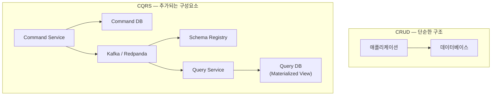
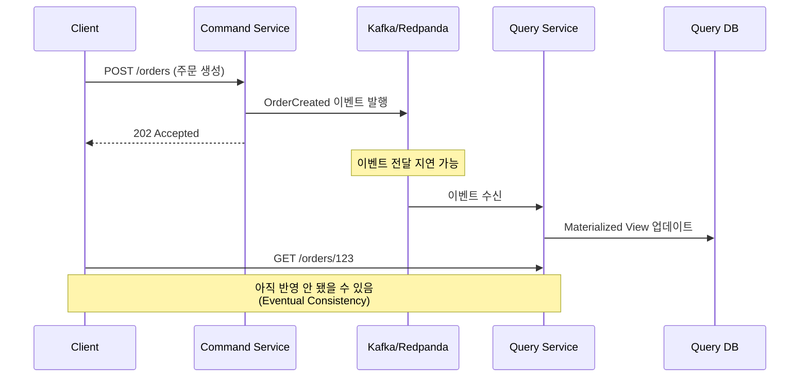
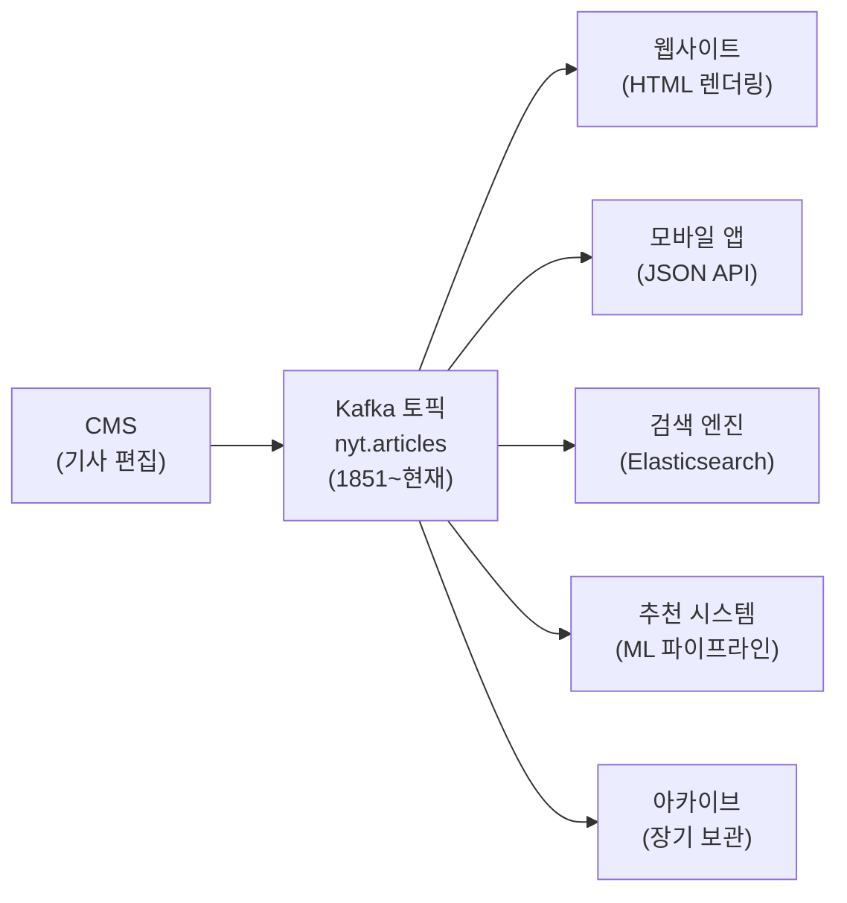
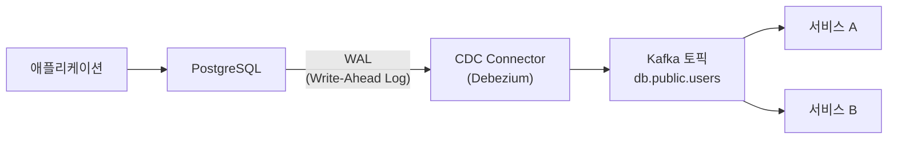
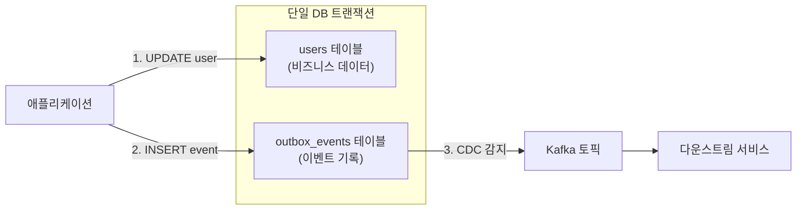
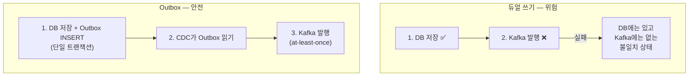
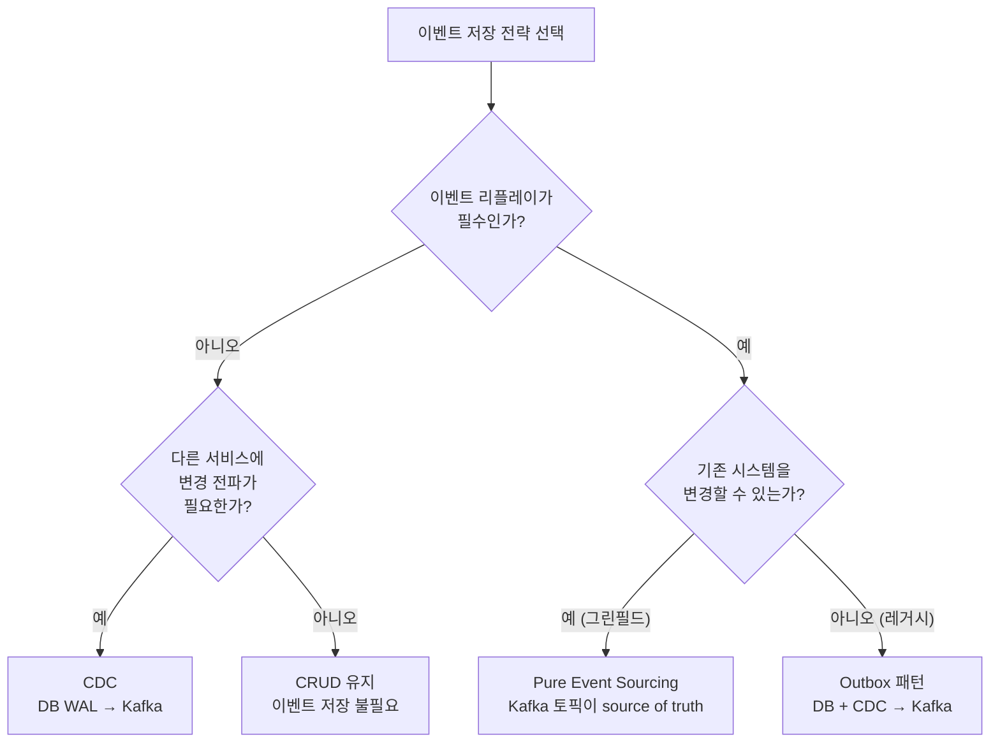
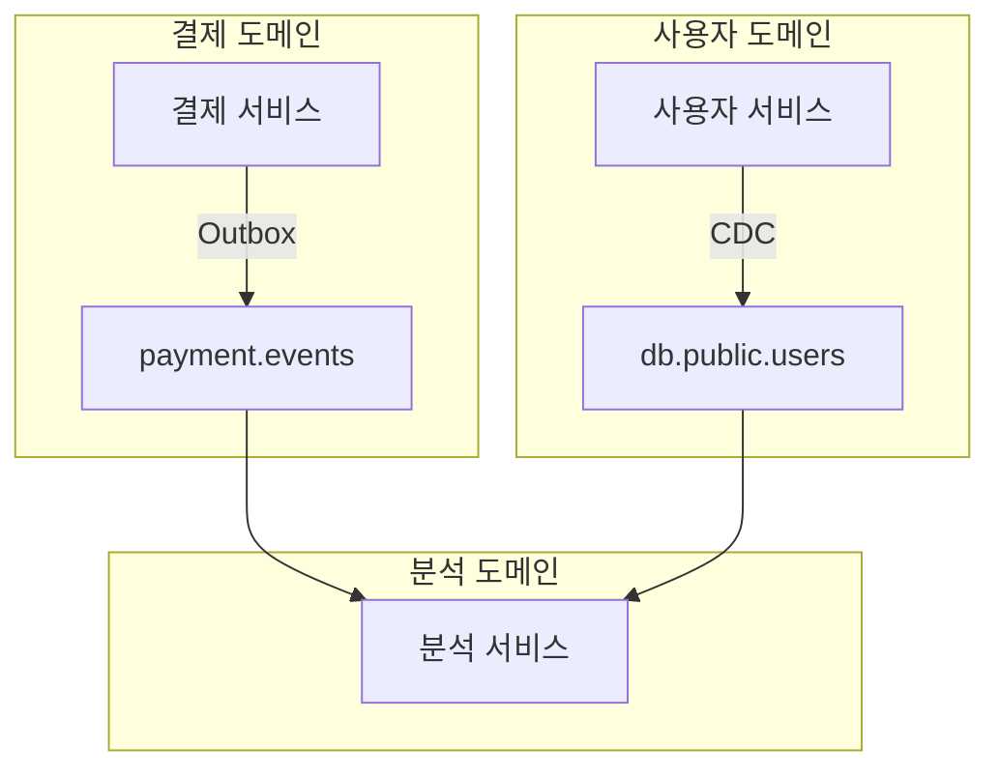

# 이벤트 저장 전략 — CDC, Outbox, Kafka 토픽

이벤트를 어디에, 어떻게 저장할 것인가

## 들어가며

Event Sourcing이 이벤트 저장의 유일한 방법은 아니다. Kafka 토픽을 source of truth로 삼는 순수 Event Sourcing 외에도, 기존 데이터베이스의 변경 로그를 캡처하는 CDC, 비즈니스 이벤트를 별도 테이블에 기록하는 Outbox 패턴 등 여러 전략이 존재한다. 각 전략은 구현 난이도, 기존 시스템과의 호환성, 이벤트 리플레이 가능 여부에서 서로 다른 트레이드오프를 가진다.

이 문서에서는 CQRS 도입이 수반하는 복잡성을 먼저 짚은 뒤, 세 가지 이벤트 저장 전략의 동작 원리와 선택 기준을 다룬다. 저장된 이벤트를 "어떻게 재생하고 활용하는가"는 별도 문서에서 다루므로, 여기서는 "어디에 어떻게 저장하는가"에 집중한다.

---

## 1. CQRS 도입의 복잡성

CQRS는 공짜가 아니다. 읽기와 쓰기를 분리하는 순간, 단순한 CRUD에서는 존재하지 않았던 추가 구성요소와 관리 비용이 발생한다. 도입 전에 이 비용을 정확히 이해해야 "왜 이렇게까지 해야 하는가"라는 질문에 답할 수 있다.

### 추가되는 인프라

CRUD 아키텍처는 애플리케이션과 데이터베이스, 두 개의 구성요소만으로 동작한다. CQRS를 도입하면 메시지 브로커(Kafka/Redpanda), Consumer Group, 스키마 레지스트리, 별도의 Query DB가 추가된다. 각 구성요소는 독립적으로 모니터링하고 장애에 대비해야 하므로 운영 부담이 늘어난다.



### 스키마 버전 관리

이벤트 스키마가 변경되면 이미 토픽에 저장된 구버전 이벤트와의 호환성을 관리해야 한다. 예를 들어 `OrderPlaced` 이벤트에 `couponCode` 필드를 추가하면, 이 필드가 없는 과거 이벤트를 Consumer가 역직렬화할 수 있어야 한다. Avro의 BACKWARD/FORWARD 호환성 전략이 이 문제를 해결하는데, 호환성 모드를 잘못 설정하면 Consumer가 일괄 실패하는 장애로 이어질 수 있다. Schema Registry 브랜치 전략에 대한 상세 내용은 [02-fundamentals/02-producer-consumer.md](../02-fundamentals/02-producer-consumer.md)를 참조한다.

### Eventual Consistency

Write 측에서 데이터를 변경한 후, Read 측의 Materialized View에 반영되기까지 지연이 존재한다. 사용자가 게시글을 작성한 직후 자신의 프로필 페이지에서 해당 게시글을 보지 못하는 상황이 발생할 수 있다. 이 지연은 보통 밀리초~초 단위이지만, 브로커나 Consumer에 장애가 발생하면 분 단위로 벌어질 수도 있다.

이 문제를 완화하는 방법으로는 "자신의 쓰기를 읽는(read-your-own-writes)" 패턴이 있다. Command 측에서 반환한 데이터를 클라이언트가 로컬에 캐싱하여 Query 측의 응답과 병합하는 방식이다. 하지만 이 역시 추가 구현 비용이 든다.

### 디버깅 복잡도

CRUD에서는 API 요청 → DB 쿼리 → 응답이라는 단순한 흐름만 추적하면 된다. CQRS에서는 Command → 이벤트 발행 → 브로커 전달 → Consumer 처리 → View 업데이트라는 비동기 파이프라인 전체를 추적해야 한다. 분산 추적(Distributed Tracing)과 correlation ID 기반의 로그 연결이 없으면 "이벤트가 어디서 유실되었는가"를 파악하기 어렵다. SAGA 패턴에서의 MDC 기반 분산 추적 경험은 이 문제의 해결 방향을 잘 보여준다.



이 시퀀스에서 문제가 발생했을 때, 원인이 Command Service의 발행 실패인지, 브로커의 전달 지연인지, Query Service의 처리 오류인지를 구분하려면 각 단계에 correlation ID가 전파되어야 한다. MDC를 활용한 분산 추적은 Kafka Consumer 스레드 풀 재사용 환경에서 반드시 try-finally로 정리해야 로그 오염을 방지할 수 있다.

### 도입 전 자문 체크리스트

CQRS를 도입하기 전에 다음 질문에 "예"라고 답할 수 있는지 확인한다.

1. 읽기와 쓰기의 부하 비율이 10:1 이상 차이나는가?
2. 읽기 모델과 쓰기 모델이 구조적으로 다른가? (예: 쓰기는 정규화, 읽기는 비정규화)
3. 다수의 소비자가 동일한 데이터를 서로 다른 형태로 필요로 하는가?
4. Eventual Consistency를 사용자 경험 측면에서 허용할 수 있는가?

네 질문 모두 "예"가 아니라면, CRUD가 더 적합할 가능성이 높다.

---

## 2. 실전 사례: New York Times

New York Times는 1851년부터 발행된 모든 기사를 단일 Kafka 토픽에 저장한다. 이 사례는 이벤트 저장 전략의 실전 적용을 보여주는 가장 대표적인 예시 중 하나이다.

### 아키텍처

CMS(Content Management System)에서 기사가 작성되거나 수정되면, 해당 변경이 이벤트로 Kafka 토픽에 발행된다. 이 토픽은 infinite retention(`retention.ms=-1`)으로 설정되어 있어 170년치 기사 데이터가 삭제되지 않고 보존된다.



### 왜 이 방식이 동작하는가

첫째, 각 소비자는 독립적으로 토픽을 소비한다. 웹사이트는 HTML 렌더링에 필요한 형태로 데이터를 가공하고, 검색 엔진은 Elasticsearch에 인덱싱하고, 추천 시스템은 ML 파이프라인에 데이터를 공급한다. 소비자 간 의존성이 없으므로 한 소비자의 장애가 다른 소비자에 영향을 주지 않는다.

둘째, 새로운 서비스가 추가되면 토픽을 처음(offset 0)부터 다시 소비하여 자체 View를 구축할 수 있다. 예를 들어 2024년에 새로운 팟캐스트 추천 서비스를 만들었다면, 170년치 기사 데이터를 처음부터 읽어 팟캐스트와 관련된 기사만 필터링하여 자체 데이터베이스를 구축하면 된다.

셋째, 토픽이 source of truth이므로 개별 서비스의 데이터가 손상되어도 토픽에서 다시 재구축할 수 있다. Elasticsearch 인덱스가 깨졌다면 인덱스를 삭제하고 토픽을 처음부터 다시 소비하면 된다.

### 핵심 설계 결정: Log Compaction vs Infinite Retention

NYT의 기사 토픽에서 중요한 설계 결정이 하나 있다. 같은 기사 ID로 여러 번 수정 이벤트가 발생할 때, 최신 버전만 유지할 것인가(Log Compaction), 모든 버전을 보존할 것인가(Infinite Retention)를 선택해야 한다.

Log Compaction(`cleanup.policy=compact`)을 사용하면 같은 키(기사 ID)의 이전 이벤트가 삭제되어 디스크를 절약할 수 있지만, 기사의 수정 이력을 잃는다. Infinite Retention(`retention.ms=-1`)을 사용하면 모든 수정 이력이 보존되어 "2003년 3월 15일 시점의 기사 내용"처럼 시점별 조회가 가능하지만, 디스크 사용량이 계속 증가한다.

NYT는 아카이브와 시점별 조회가 중요하므로 Infinite Retention을 선택했다. 이 선택은 Tiered Storage(로컬 → S3 오프로드)와 결합하여 비용을 관리한다.

### 이 사례에서 배우는 점

NYT 방식은 Pure Event Sourcing의 이상적인 형태이다. 하지만 모든 시스템이 이렇게 할 수 있는 것은 아니다. NYT가 이 방식을 선택할 수 있었던 이유는 기사 데이터가 상대적으로 단순한 구조(제목, 본문, 메타데이터)이고, 기사 간 복잡한 트랜잭션 관계가 없기 때문이다. 은행의 계좌 이체처럼 여러 엔티티 간 정합성이 필요한 도메인에서는 이렇게 단순하게 적용하기 어렵다.

---

## 3. CDC (Change Data Capture)

CDC는 기존 데이터베이스의 변경 사항을 실시간으로 캡처하여 이벤트 스트림으로 변환하는 기술이다. 애플리케이션 코드를 전혀 수정하지 않고도 데이터 변경을 이벤트로 얻을 수 있다는 점이 핵심이다.

### 동작 원리

CDC는 데이터베이스의 트랜잭션 로그를 직접 읽는다. PostgreSQL의 WAL(Write-Ahead Log), MySQL의 binlog가 대표적인 예시이다. 이 로그에는 모든 INSERT, UPDATE, DELETE가 기록되어 있으므로, CDC 커넥터(Debezium 등)가 이를 읽어 Kafka 토픽에 이벤트로 발행한다.



### CDC 이벤트의 구조

CDC 이벤트는 변경 전(before)과 변경 후(after)의 레코드 전체를 포함한다.

```json
{
  "before": { "id": 1, "name": "Alice", "status": "active" },
  "after":  { "id": 1, "name": "Alice", "status": "inactive" },
  "op": "u",
  "source": {
    "connector": "postgresql",
    "db": "mydb",
    "table": "users",
    "ts_ms": 1706000000000
  }
}
```

이 이벤트를 보면 Alice의 status가 "active"에서 "inactive"로 변경되었다는 사실은 알 수 있다. 하지만 **왜** 비활성화되었는지는 알 수 없다. 본인이 탈퇴 요청을 했는지, 관리자가 정지시킨 것인지, 장기 미접속으로 자동 비활성화된 것인지 — 비즈니스 의도가 이벤트에 담기지 않는다.

### 장점

- **기존 코드 변경 불필요**: 애플리케이션을 한 줄도 수정하지 않고 이벤트 스트림을 얻을 수 있다. 레거시 시스템을 이벤트 기반으로 전환할 때 가장 빠른 방법이다.
- **모든 변경 캡처**: WAL에는 애플리케이션을 거치지 않는 직접 SQL 변경(DBA의 수동 UPDATE 등)도 기록되므로 누락이 없다.
- **낮은 오버헤드**: DB에 추가 쓰기가 발생하지 않는다. WAL은 DB가 정상 동작을 위해 이미 기록하는 것이므로, CDC는 이를 읽기만 한다.

### 한계

- **DB 스키마 종속**: 테이블 구조가 곧 이벤트 구조이다. 컬럼 이름을 변경하면 이벤트 스키마도 변경되고, Consumer도 함께 수정해야 한다. 이는 CDC가 애플리케이션 레벨이 아닌 DB 레벨에서 동작하기 때문에 발생하는 본질적 제약이다.
- **비즈니스 의도 누락**: 위 예시처럼 "무엇이 변경되었는가"만 기록하고 "왜 변경되었는가"는 기록하지 않는다. Event Sourcing의 핵심 가치인 "의도 기반 이벤트"를 얻을 수 없다.
- **불완전한 리플레이**: CDC 이벤트만으로는 완전한 상태 재구축이 어렵다. 비즈니스 의도 없이 데이터 변경만으로 리플레이하면, 파생 효과(이메일 발송, 알림 등)를 올바르게 재현할 수 없다.
- **초기 스냅샷 부하**: CDC 커넥터를 처음 시작하면 기존 테이블의 전체 데이터를 스냅샷으로 읽어야 한다. 수억 건의 레코드가 있는 테이블에서는 이 과정이 수 시간 걸릴 수 있고, DB에 상당한 읽기 부하를 가한다.

### CDC가 적합한 시나리오

CDC는 비즈니스 의도가 중요하지 않은 시나리오에서 빛을 발한다. 대표적인 예시로 데이터 웨어하우스 동기화가 있다. 운영 DB의 변경을 실시간으로 분석용 DB에 복제하는 것이 목적이므로, "왜 변경되었는가"보다 "무엇이 변경되었는가"가 중요하다. 마이크로서비스 간 캐시 무효화도 좋은 예시이다. 사용자 테이블의 이름이 변경되면 다른 서비스의 캐시를 갱신해야 하는데, 이름 변경 이유까지 알 필요는 없다.

---

## 4. Outbox 패턴

Outbox 패턴은 CDC의 한계인 비즈니스 의도 누락을 보완하면서도, 기존 관계형 DB의 트랜잭션 보장을 활용하는 전략이다. 핵심 아이디어는 비즈니스 테이블과 이벤트 테이블에 **동일한 트랜잭션**으로 기록하는 것이다.

### 동작 원리

애플리케이션은 비즈니스 로직을 처리하면서 두 가지를 동시에 수행한다. 비즈니스 테이블(users, orders 등)을 업데이트하고, outbox_events 테이블에 발생한 이벤트를 기록한다. 이 두 쓰기가 하나의 DB 트랜잭션 안에서 이루어지므로 원자성이 보장된다. 이후 CDC 커넥터가 outbox_events 테이블의 변경을 감지하여 Kafka 토픽에 발행한다.



### Outbox 테이블 스키마

```sql
CREATE TABLE outbox_events (
    id              UUID PRIMARY KEY,
    aggregate_type  VARCHAR(255) NOT NULL,   -- 'User', 'Order'
    aggregate_id    VARCHAR(255) NOT NULL,   -- 엔티티 ID
    event_type      VARCHAR(255) NOT NULL,   -- 'UserDeactivated'
    payload         JSONB NOT NULL,          -- 이벤트 데이터 (비즈니스 의도 포함)
    created_at      TIMESTAMP NOT NULL DEFAULT NOW()
);
```

`aggregate_type`과 `aggregate_id`는 Kafka 토픽 라우팅과 파티셔닝에 사용된다. `event_type`은 Consumer가 이벤트 종류를 식별하는 데 사용된다. `payload`에 비즈니스 의도가 포함되므로 CDC의 한계를 극복할 수 있다.

### 구현 예시

```java
@Transactional
public void deactivateUser(Long userId, String reason) {
    // 1. 비즈니스 테이블 업데이트
    User user = userRepository.findById(userId)
        .orElseThrow(() -> new UserNotFoundException(userId));
    user.setStatus("inactive");
    userRepository.save(user);

    // 2. 같은 트랜잭션에서 Outbox에 이벤트 기록
    OutboxEvent event = new OutboxEvent(
        "User",
        userId.toString(),
        "UserDeactivated",
        Map.of(
            "userId", userId,
            "reason", reason,              // 비즈니스 의도가 명시됨
            "deactivatedAt", Instant.now(),
            "deactivatedBy", SecurityContext.getCurrentUser()
        )
    );
    outboxRepository.save(event);
    // → CDC connector가 outbox_events INSERT를 감지하여 Kafka에 발행
}
```

이 코드에서 `reason` 필드가 CDC와의 결정적 차이이다. CDC는 `status` 컬럼이 "active"에서 "inactive"로 바뀌었다는 사실만 캡처하지만, Outbox에는 "관리자에 의한 정지", "본인 탈퇴 요청", "장기 미접속 자동 비활성화" 같은 비즈니스 의도가 명시적으로 기록된다.

### 장점

- **비즈니스 의도 보존**: 이벤트에 "왜"가 포함되므로 Event Sourcing과 동일한 수준의 의미 있는 이벤트를 얻을 수 있다.
- **트랜잭션 원자성**: 비즈니스 변경과 이벤트 기록이 하나의 트랜잭션이므로, 이벤트만 기록되고 비즈니스 변경이 안 되거나, 그 반대 상황이 발생하지 않는다.
- **리플레이 가능**: outbox_events 테이블은 append-only이므로, 이벤트를 시간순으로 다시 재생하여 상태를 재구축할 수 있다.
- **점진적 도입**: 기존 테이블 구조를 변경하지 않고 outbox_events 테이블만 추가하면 된다.

### 한계

- **이중 저장**: 비즈니스 데이터가 비즈니스 테이블과 outbox_events 테이블, 그리고 Kafka 토픽에 세 군데 저장된다. 디스크 사용량이 늘어난다.
- **Outbox 테이블 성장**: append-only 테이블은 빠르게 커지므로 주기적인 아카이빙(archiving)이 필요하다. Kafka에 발행이 완료된 이벤트는 outbox_events 테이블에서 삭제하거나 별도 아카이브 테이블로 이동해야 한다.
- **트랜잭션 오버헤드**: 매 비즈니스 연산마다 추가 INSERT가 발생하므로 트랜잭션 시간이 미세하게 증가한다. 대부분의 경우 무시할 수 있는 수준이지만, 초당 수만 건의 쓰기가 발생하는 시스템에서는 고려해야 한다.

### 듀얼 쓰기 vs Outbox 패턴

흔한 실수는 Outbox 패턴 대신 "듀얼 쓰기"를 시도하는 것이다. 듀얼 쓰기란 DB에 저장한 후 Kafka에 직접 발행하는 방식인데, 이 두 연산은 하나의 트랜잭션으로 묶을 수 없다.



DB 저장은 성공했는데 Kafka 발행이 실패하면 데이터 불일치가 발생한다. Outbox 패턴은 이 문제를 원천적으로 차단한다. DB 트랜잭션이 성공하면 outbox_events에 이벤트가 반드시 기록되고, CDC가 이를 at-least-once로 Kafka에 발행하기 때문이다.

at-least-once 전달이라는 것은 동일한 이벤트가 중복 발행될 수 있다는 뜻이다. 따라서 Consumer 측에서 멱등성(idempotency) 처리가 필수적이다. 이 프로젝트의 SAGA 실습에서 사용한 preemptive acquire 패턴 — `(correlationId, eventType)` 복합 키로 `INSERT...WHERE NOT EXISTS` — 이 여기서도 동일하게 적용된다.

### Outbox 테이블 관리

Outbox 테이블은 append-only이므로 시간이 지나면 크기가 급격히 커진다. 이를 관리하는 전략은 크게 두 가지이다.

**삭제 방식**: CDC 커넥터가 이벤트를 Kafka에 성공적으로 발행한 후, 해당 행을 outbox_events에서 삭제한다. Debezium의 Outbox Event Router는 이 방식을 기본으로 지원한다. 장점은 테이블이 항상 작게 유지된다는 것이고, 단점은 DB 레벨에서 이벤트 이력을 잃는다는 것이다.

**아카이브 방식**: 발행 완료된 이벤트를 별도의 아카이브 테이블이나 오브젝트 스토리지로 이동한다. 이력을 보존하면서도 운영 테이블의 크기를 관리할 수 있다. 규제 준수(audit trail)가 필요한 금융 도메인에서 주로 사용한다.

```sql
-- 발행 완료된 이벤트를 아카이브로 이동 (배치 작업)
INSERT INTO outbox_events_archive
SELECT * FROM outbox_events
WHERE created_at < NOW() - INTERVAL '7 days';

DELETE FROM outbox_events
WHERE created_at < NOW() - INTERVAL '7 days';
```

---

## 5. 전략 비교

세 가지 전략을 다양한 기준으로 비교하면 다음과 같다.

| 기준 | Pure Event Sourcing | CDC | Outbox |
|------|---------------------|-----|--------|
| 이벤트가 source of truth | 예 | 아니오 (DB가 source) | 부분적 (DB + 토픽) |
| 리플레이 가능 | 완전한 리플레이 | 비즈니스 의도 누락 | 가능 |
| 기존 시스템 변경 | 전면 재설계 | 변경 없음 | events 테이블 추가 |
| 구현 복잡도 | 높음 | 낮음 | 중간 |
| 비즈니스 의도 포함 | 이벤트에 명시 | DB 변경만 캡처 | 이벤트에 명시 |
| 스키마 진화 | Avro 호환성 관리 | DB 스키마에 종속 | Avro 호환성 관리 |
| 디스크 사용량 | 토픽에 전체 이력 | 토픽에 변경분 | DB + 토픽 이중 저장 |
| 레거시 통합 | 어려움 | 쉬움 | 중간 |
| 새 소비자 추가 | 토픽 재소비 | 토픽 재소비 | 토픽 재소비 |

어떤 전략이 "최고"인 것은 아니다. 각 전략은 시스템의 성숙도, 팀의 역량, 기존 인프라에 따라 적합성이 달라진다. 실제 프로덕션에서는 도메인별로 서로 다른 전략을 혼합하는 것이 일반적이다. 결제 도메인은 Outbox 패턴으로 비즈니스 의도를 보존하고, 로그 수집은 CDC로 빠르게 처리하는 식이다.

표에서 주목할 점은 "리플레이 가능" 행이다. CDC는 기술적으로 이벤트를 다시 재생할 수 있지만, 비즈니스 의도가 빠져 있으므로 재생 결과의 품질이 떨어진다. 예를 들어 "사용자 비활성화" 이벤트를 재생할 때, Pure Event Sourcing이나 Outbox는 "관리자가 정지시킨 사용자"와 "본인이 탈퇴한 사용자"를 구분하여 서로 다른 후처리(이메일 발송, 데이터 삭제 등)를 적용할 수 있다. CDC는 둘 다 단순한 status 변경으로만 보이므로 이런 분기가 불가능하다.

또한 "기존 시스템 변경" 행에서 CDC가 "변경 없음"인 것은 애플리케이션 코드 관점이다. DB 측에서는 WAL 레벨의 복제(logical replication)를 활성화해야 하고, CDC 커넥터에 DB 접근 권한을 부여해야 하므로 인프라 변경은 필요하다.

---

## 6. 선택 가이드

### 의사결정 플로우차트



### 상황별 가이드

**다수 소비자 + 그린필드 프로젝트**: Pure Event Sourcing을 선택한다. NYT 사례처럼 Kafka 토픽을 source of truth로 삼고, 각 소비자가 자체 Materialized View를 구축하는 방식이다. 시스템을 처음부터 이벤트 중심으로 설계할 수 있을 때만 가능하다.

**리플레이 필요 + 레거시 시스템**: Outbox 패턴이 적합하다. 기존 테이블 구조를 변경하지 않으면서 비즈니스 의도가 포함된 이벤트를 얻을 수 있다. 트랜잭션 원자성도 보장되므로 데이터 불일치 위험이 없다.

**변경 전파 + 기존 시스템 유지**: CDC를 선택한다. 애플리케이션 코드를 한 줄도 수정하지 않고 데이터 변경을 이벤트 스트림으로 변환할 수 있다. 다만 비즈니스 의도가 누락되므로, 리플레이가 필요하지 않은 시나리오에 적합하다.

**단순 CRUD**: 이벤트 저장 전략 자체가 불필요하다. 읽기와 쓰기 패턴이 비슷하고, 다른 서비스에 변경을 전파할 필요가 없으며, 과거 상태를 재구축할 일이 없다면 CRUD로 충분하다. CQRS와 이벤트 저장은 복잡성을 수반하므로, 그 복잡성이 해결하는 문제가 실제로 존재하는지 먼저 확인해야 한다.

### 점진적 진화 경로

많은 시스템이 처음부터 Event Sourcing을 도입하지는 않는다. 일반적인 진화 경로는 다음과 같다.

```
CRUD → CDC (변경 전파 필요 시)
     → Outbox (비즈니스 의도 보존 필요 시)
     → Pure Event Sourcing (토픽이 source of truth가 되어야 할 때)
```

각 단계는 이전 단계의 한계를 경험한 후에 진행하는 것이 자연스럽다. 처음부터 Pure Event Sourcing을 도입하면 불필요한 복잡성을 떠안게 되고, 반대로 CDC에서 멈추면 비즈니스 의도 누락이라는 한계에 부딪힌다. 시스템이 성장하면서 도메인별로 적합한 단계를 선택하면 된다.

### 혼합 전략

실제 프로덕션 시스템에서는 한 가지 전략만 사용하는 경우가 드물다. 도메인의 특성에 따라 전략을 혼합하는 것이 현실적이다.



결제 도메인은 "왜 결제가 취소되었는가"라는 비즈니스 의도가 중요하므로 Outbox 패턴을 사용한다. 사용자 도메인은 프로필 변경 사실만 전파하면 되므로 CDC로 충분하다. 분석 도메인은 양쪽 이벤트를 모두 소비하여 통합 뷰를 구축한다.

---

## 7. Redpanda 호환성 노트

### Redpanda Connect

Redpanda Connect는 Kafka Connect 호환 커넥터를 실행할 수 있으므로, Debezium CDC 커넥터를 그대로 사용할 수 있다. PostgreSQL/MySQL의 WAL/binlog를 캡처하여 Redpanda 토픽에 발행하는 구성이 가능하다. 커넥터 구성과 운영에 대한 상세 내용은 [07-connectors/](../07-connectors/) 디렉토리를 참조한다.

### 무한 보존 토픽

NYT 사례처럼 이벤트를 영구 보존하려면 `retention.ms=-1`로 설정한다. Redpanda는 Tiered Storage를 지원하므로 로컬 디스크가 부족해지면 오래된 세그먼트를 오브젝트 스토리지(S3 등)로 자동 오프로드한다. 이를 통해 로컬 디스크 용량에 제한받지 않고 장기 이벤트를 보존할 수 있다.

```
# 토픽 생성 시 무한 보존 설정
rpk topic create nyt.articles \
    --partitions 12 \
    --config retention.ms=-1 \
    --config retention.bytes=-1
```

### Schema Registry 내장

Redpanda에는 Schema Registry가 기본 내장되어 있으므로 별도 Confluent Schema Registry를 설치할 필요가 없다. Avro 스키마의 호환성 검증(BACKWARD, FORWARD, FULL)을 Redpanda 자체에서 처리한다. 이는 CDC와 Outbox 패턴 모두에서 이벤트 스키마 진화를 관리할 때 활용된다.

CDC의 경우, Debezium이 테이블 스키마를 Avro로 변환하여 Schema Registry에 자동 등록한다. 테이블에 컬럼이 추가되면 새 Avro 스키마가 등록되고, 호환성 검증을 통과해야만 이벤트가 발행된다. Outbox 패턴의 경우, `payload` 필드 자체가 JSONB이므로 Avro 스키마 관리는 payload 내부 구조에 대해 별도로 적용해야 한다.

### Debezium Outbox Event Router

Debezium은 Outbox 패턴을 위한 전용 SMT(Single Message Transform)인 `outbox.EventRouter`를 제공한다. 이 트랜스폼은 outbox_events 테이블의 행을 읽어 `aggregate_type`을 토픽 이름으로, `aggregate_id`를 메시지 키로 자동 매핑한다.

```json
{
  "transforms": "outbox",
  "transforms.outbox.type": "io.debezium.transforms.outbox.EventRouter",
  "transforms.outbox.table.field.event.id": "id",
  "transforms.outbox.table.field.event.key": "aggregate_id",
  "transforms.outbox.table.field.event.type": "event_type",
  "transforms.outbox.table.field.event.payload": "payload",
  "transforms.outbox.route.topic.replacement": "${routedByValue}.events"
}
```

이 설정을 사용하면 `aggregate_type`이 "User"인 이벤트는 `User.events` 토픽으로, "Order"인 이벤트는 `Order.events` 토픽으로 자동 라우팅된다. Redpanda Connect에서도 이 Debezium SMT를 그대로 사용할 수 있다.

---

## 기존 문서와의 관계

> 이 문서는 "이벤트를 어디에 어떻게 저장하는가"에 집중한다. 저장된 이벤트를 "어떻게 재생하고 활용하는가"는 [05-event-replay-time-travel.md](05-event-replay-time-travel.md)을 참조한다. CQRS 패턴 자체의 동작 원리와 읽기/쓰기 분리의 근거는 [01-cqrs-pattern.md](01-cqrs-pattern.md)에서 다룬다.

---

## 핵심 교훈

> "이벤트 소싱만이 이벤트 저장의 유일한 방법은 아니다. 시스템의 성숙도와 요구사항에 맞는 전략을 선택하라."

- **CQRS 도입은 공짜가 아니다.** 인프라 복잡성, 스키마 버전 관리, Eventual Consistency라는 비용이 따라온다. 이 비용을 감수할 만한 문제가 존재하는지 먼저 확인해야 한다.
- **NYT 사례는 단일 토픽 + 다수 소비자 패턴의 교과서적 성공 사례다.** 170년치 기사를 하나의 토픽에 저장하고, 각 서비스가 독립적으로 소비하여 자체 View를 구축한다.
- **CDC는 가장 빠른 시작점이지만 한계가 있다.** 기존 시스템을 건드리지 않고 이벤트 스트림을 얻을 수 있지만, "왜 변경되었는가"라는 비즈니스 의도가 누락된다.
- **Outbox 패턴은 CDC + 비즈니스 의도 보존의 균형점이다.** 트랜잭션 원자성으로 데이터 일관성을 보장하면서도 의미 있는 이벤트를 기록할 수 있다.
- **대부분의 시스템은 전략을 혼합한다.** 도메인별로 요구사항이 다르므로, 결제는 Outbox, 사용자 프로필은 CDC, 새 서비스는 Event Sourcing처럼 혼합하는 것이 현실적이다.
