# Event Sourcing에서 Event Streaming으로

Event Sourcing은 단일 애플리케이션 내에서 이벤트를 source of truth로 사용하는 패턴이다. 하지만 마이크로서비스 아키텍처에서는 이벤트가 단일 앱의 경계를 넘어 여러 서비스와 데이터베이스를 연결하는 "흐르는 데이터(Data in Motion)"가 된다. 이 문서는 Event Sourcing이 Event Streaming이라는 더 넓은 개념으로 확장되는 과정을 다룬다.

앞선 다섯 개 문서에서는 하나의 앱 안에서 CQRS와 Event Sourcing이 어떻게 동작하는지 학습했다. 쓰기 모델과 읽기 모델을 분리하고([01](01-cqrs-pattern.md)), 이벤트를 source of truth로 사용하며([02](02-event-sourcing-fundamentals.md)), CRUD와의 트레이드오프를 판단하고([03](03-cqrs-vs-crud-comparison.md)), Kafka Streams로 Materialized View를 구축하고([04](04-kafka-streams-topology.md)), 이벤트 리플레이로 시간 여행 디버깅을 수행했다([05](05-event-replay-time-travel.md)). 이 문서에서는 시야를 넓혀, 이 모든 것이 분산 시스템에서 어떻게 확장되는지 조감한다.

---

## 1. Data at Rest에서 Data in Motion으로

전통적인 시스템에서 데이터는 데이터베이스에 "정지된 상태(at rest)"로 존재한다. 애플리케이션이 필요할 때 DB에 쿼리를 보내고, DB가 결과를 반환하는 요청-응답 방식이다. 모놀리스 아키텍처에서는 하나의 DB에 모든 데이터가 있으므로 JOIN으로 필요한 정보를 조합할 수 있다. 이 방식은 단순하고 직관적이지만, 시스템이 여러 서비스로 분산되면 한계를 드러낸다.

왜 한계가 드러나는가? 마이크로서비스로 전환하면 각 서비스가 자체 DB를 소유한다. 주문 서비스의 DB와 재고 서비스의 DB는 물리적으로 분리되어 있으므로, 하나의 SQL로 두 서비스의 데이터를 JOIN할 수 없다. 서비스 간에 HTTP로 데이터를 요청할 수 있지만, 이는 서비스 간 결합도를 높이고 장애 전파를 일으킨다.

구체적인 예를 들어보자. 주문 서비스가 주문을 생성할 때 재고 서비스에 HTTP 요청을 보내 재고를 차감한다고 하자. 재고 서비스가 다운되면 주문도 실패한다. 재고 서비스의 응답이 느리면 주문 API의 응답도 느려진다. 재고 서비스가 복구된 후에도 장애 동안 실패한 주문을 재처리하는 별도의 메커니즘이 필요하다. 서비스가 10개, 20개로 늘어나면 이런 동기 호출 체인은 관리가 불가능해진다.

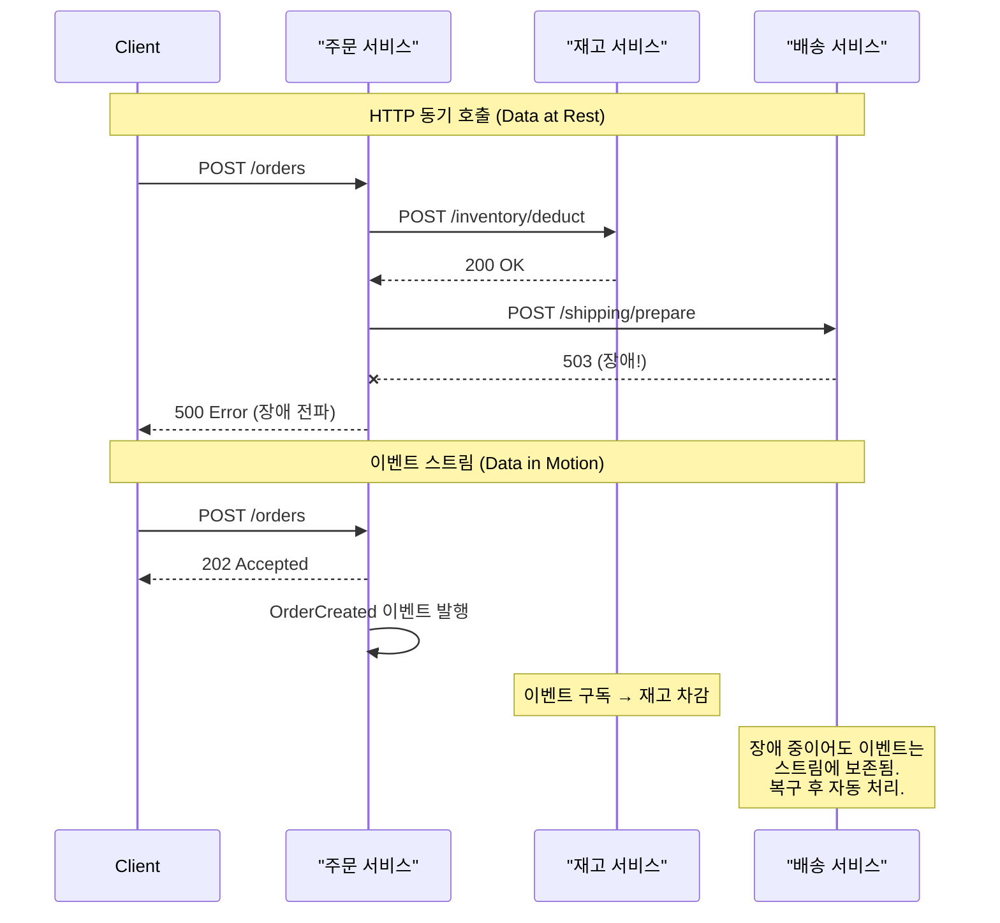

위 다이어그램에서 보듯, HTTP 동기 호출 방식에서는 배송 서비스의 장애가 주문 서비스를 거쳐 클라이언트까지 전파된다. 반면 이벤트 스트림 방식에서는 주문 서비스가 이벤트를 발행하고 즉시 응답을 반환한다. 배송 서비스가 장애 상태여도 이벤트는 스트림에 안전하게 보존되고, 복구 후 밀린 이벤트를 순서대로 처리하면 된다.

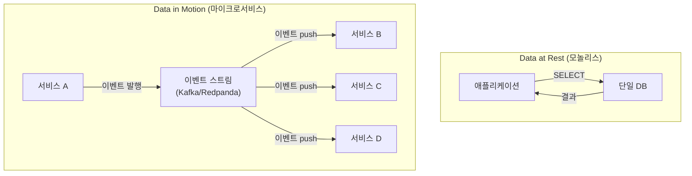

Data in Motion은 이 문제를 근본적으로 다른 방식으로 해결한다. 데이터가 DB에 갇혀 있는 것이 아니라, 이벤트로 변환되어 시스템 사이를 흐른다. 소비자가 데이터를 요청하는 것이 아니라, 데이터가 소비자에게 push된다. 서비스 A에서 변경이 발생하면 이벤트가 스트림에 발행되고, 관심 있는 서비스가 해당 이벤트를 구독하여 자체 DB를 갱신한다.

이 방식에서 서비스는 다른 서비스의 DB를 직접 조회하지 않는다. 대신 이벤트 스트림을 통해 변경 사항을 구독한다. 서비스 A가 다운되더라도 서비스 B는 이미 수신한 이벤트로 자체 뷰를 유지하고 있으므로 영향을 받지 않는다. 이것이 서비스 간 결합도를 낮추고 독립적 배포를 가능하게 하는 핵심 메커니즘이다.

| 차원 | Data at Rest | Data in Motion |
|------|-------------|----------------|
| 데이터 위치 | DB에 저장, 필요 시 조회 | 이벤트로 변환되어 시스템 사이를 흐름 |
| 통신 방식 | 요청-응답 (Pull) | 이벤트 구독 (Push) |
| 서비스 간 결합 | 강결합 (직접 조회/호출) | 약결합 (이벤트 스트림 통한 간접 통신) |
| 장애 전파 | DB 다운 시 전체 영향 | 발행자 다운해도 소비자 독립 운영 |

---

## 2. Data in Motion 환경에서의 CQRS

앞서 [01-cqrs-pattern](01-cqrs-pattern.md)에서 CQRS의 개념과 구현을 다뤘다. 그때는 단일 애플리케이션 또는 하나의 서비스 내에서 읽기 모델과 쓰기 모델을 분리하는 데 초점을 맞췄다. Data in Motion 환경에서 CQRS는 서비스 경계를 넘어 확장되며, 그 진정한 가치를 발휘한다.

항공 예약 시스템을 생각해보자. 이 시스템에서 읽기 트래픽은 쓰기의 10,000배 이상이다. 수천 명의 사용자가 동시에 좌석을 검색하고 가격을 비교하지만, 실제로 예약 버튼을 누르는 사람은 극소수이기 때문이다. 쓰기(예약)는 정합성이 핵심이므로 하나의 일관된 Command DB에서 처리해야 한다. 반면 읽기(검색, 가격 비교, 모바일 조회)는 각각 다른 데이터 형태와 성능 요구사항을 갖는다.

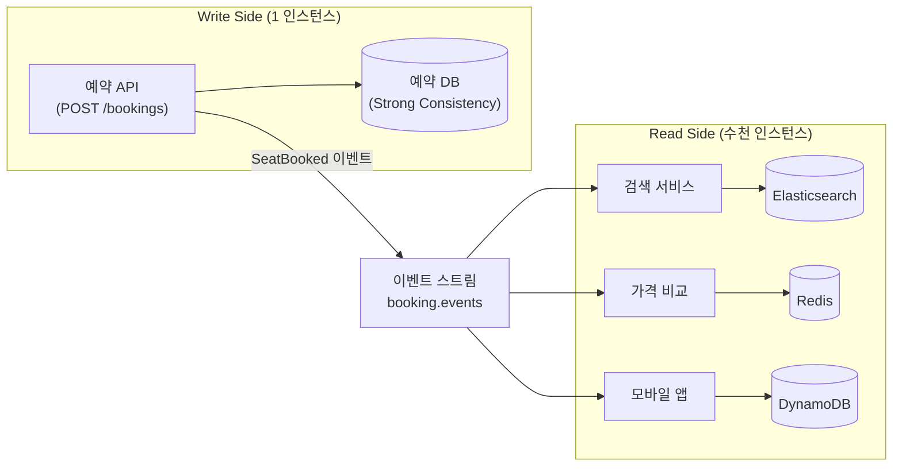

Write Side에서 좌석 예약이 발생하면 `SeatBooked` 이벤트가 스트림에 발행된다. 검색 서비스는 이 이벤트를 소비하여 Elasticsearch 인덱스를 갱신하고, 가격 비교 서비스는 Redis에 최신 가격을 캐싱하며, 모바일 앱 서비스는 DynamoDB에 모바일 최적화된 형태로 저장한다.

각 Read Side 서비스는 이벤트 스트림을 구독하여 자신의 목적에 맞는 DB와 데이터 형태를 독립적으로 선택한다. 검색에는 전문 검색에 특화된 Elasticsearch를, 가격 비교에는 초저지연 조회를 위한 Redis를, 모바일은 글로벌 분산에 강한 DynamoDB를 사용할 수 있다. Write Side는 Read Side가 몇 개인지, 어떤 기술을 쓰는지 알 필요가 없다. 이것이 Data in Motion 환경에서 CQRS가 발휘하는 진정한 가치다.

[01-cqrs-pattern](01-cqrs-pattern.md)에서 다룬 단일 앱 CQRS와의 차이가 여기서 드러난다. 단일 앱 CQRS에서는 같은 DB 안에서 읽기 테이블과 쓰기 테이블을 분리하거나, 기껏해야 하나의 Kafka Streams State Store를 사용했다. Data in Motion 환경의 CQRS에서는 Read Side 자체가 독립된 마이크로서비스이며, 각 서비스가 자신의 목적에 맞는 완전히 다른 기술 스택을 선택한다. 이 확장은 단순히 규모의 차이가 아니라, 조직 구조의 차이이기도 하다. 검색 팀은 Elasticsearch를 운영하고, 모바일 팀은 DynamoDB를 운영하며, 각 팀이 자신의 Read Model을 독립적으로 진화시킬 수 있다.

---

## 3. 마이크로서비스에 적용된 CQRS

2절에서는 항공 예약 시스템이라는 거시적 사례를 통해 Data in Motion 환경에서 CQRS의 가치를 확인했다. 이번에는 더 구체적인 사례로 장바구니 서비스를 살펴보자. 이 사례는 하나의 이벤트가 여러 서비스에서 어떻게 다른 의미로 해석되는지를 보여준다.

사용자가 장바구니에 상품을 담거나 빼는 행위는 단일 서비스에서 발생하지만, 그 이벤트는 시스템 전체에 걸쳐 다양한 목적으로 소비된다. 하나의 `ItemAdded` 이벤트가 재고 관점에서는 "예약 차감"이고, 추천 관점에서는 "관심사 신호"이며, 분석 관점에서는 "전환 퍼널 진입"이다. 동일한 사실(fact)에서 서로 다른 파생 데이터가 만들어지는 것이다.

장바구니 서비스는 `ItemAdded`와 `ItemRemoved` 이벤트를 `cart-events` 토픽에 발행한다. 이 이벤트를 소비하는 서비스는 네 개인데, 각각 완전히 다른 관점에서 동일한 이벤트를 처리한다.

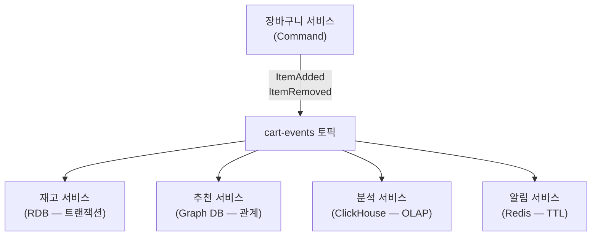

**재고 서비스**는 장바구니에 담긴 수량만큼 예약 재고를 차감한다. 트랜잭션 정합성이 중요하므로 RDB를 사용한다. 사용자가 장바구니에서 상품을 빼면 예약 재고를 복원한다.

**추천 서비스**는 함께 담긴 상품 패턴을 분석하여 추천 모델을 갱신한다. "이 상품을 함께 구매한 사람들이 많이 본 상품"이라는 관계를 추출해야 하므로 Graph DB가 적합하다.

**분석 서비스**는 장바구니 이탈률, 평균 담기 시간, 카테고리별 담기 빈도 같은 비즈니스 메트릭을 집계한다. 대량의 이벤트를 빠르게 집계해야 하므로 ClickHouse 같은 OLAP 엔진을 사용한다.

**알림 서비스**는 장바구니에 상품을 담고 1시간 후에도 구매하지 않은 사용자에게 리마인더를 발송한다. TTL(Time To Live) 기반으로 만료를 감지해야 하므로 Redis가 적합하다.

핵심은 각 서비스가 **동일한 이벤트**를 소비하지만 **자체 View의 형태**(RDB, Graph DB, OLAP, Redis)를 독립적으로 결정한다는 점이다. 이벤트 발행자인 장바구니 서비스는 소비자의 존재를 알 필요가 없다. 새로운 소비자(예: 사기 탐지 서비스)가 추가되어도 장바구니 서비스의 코드는 한 줄도 변경되지 않는다. 이것이 이벤트 기반 아키텍처에서 CQRS가 자연스럽게 실현되는 방식이다.

### Consumer Group의 독립성

이 패턴이 기술적으로 가능한 이유는 Kafka/Redpanda의 Consumer Group 메커니즘 때문이다. 각 서비스는 서로 다른 Consumer Group ID를 사용하므로, 하나의 토픽에서 모든 서비스가 독립적으로 모든 이벤트를 수신한다. 재고 서비스가 이벤트를 소비한 것이 추천 서비스의 offset에 영향을 주지 않는다.

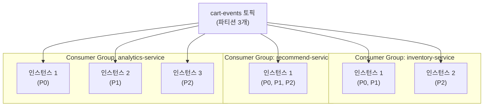

각 Consumer Group은 독립적인 offset을 관리하고, 그룹 내에서 파티션을 분배한다. 재고 서비스는 2개 인스턴스로 충분하지만, 분석 서비스는 대량 집계를 위해 3개 인스턴스가 필요할 수 있다. 이 스케일링 결정은 각 팀이 독립적으로 내린다. 이벤트 발행자인 장바구니 서비스는 소비자가 몇 개의 인스턴스를 운영하는지 전혀 모르고, 알 필요도 없다.

---

## 4. Event Sourcing은 Event Streaming의 부분집합이다

지금까지 학습한 내용을 종합하면, Event Sourcing과 Event Streaming의 관계가 명확해진다. 이 두 개념은 별개가 아니라 포함 관계에 있다.

### Event Sourcing의 범위

[02-event-sourcing-fundamentals](02-event-sourcing-fundamentals.md)에서 다룬 Event Sourcing은 **단일 애플리케이션 + 단일 데이터베이스** 범위에서 동작한다. 이벤트는 한 곳(Event Store)에 저장되고, 같은 애플리케이션이 이벤트를 기록하고 읽는다. Data at Rest 패러다임이다. 이벤트를 저장하는 목적은 상태 복원, 감사 로그, 시간 여행 디버깅이며, 범위는 하나의 Aggregate 또는 Bounded Context로 한정된다.

### Event Streaming의 범위

Event Streaming은 **다수 서비스 + 다수 데이터베이스**를 아우르는 시스템 전체 수준의 개념이다. 이벤트가 서비스 경계를 넘어 흐르며, 각 서비스가 이벤트를 소비하여 자체 View를 구축한다. Data in Motion 패러다임이다. 이벤트의 목적은 서비스 간 통합, 실시간 데이터 파이프라인, 프로세스 자동화이며, 범위는 전체 시스템(여러 Bounded Context)에 걸친다.

### 포함 관계

Event Sourcing은 Event Streaming이 제공하는 여러 기능 중 하나다. Event Streaming이라는 넓은 우산 아래에 Event Sourcing, CDC/Outbox, 마이크로서비스 통합, 실시간 데이터 파이프라인, 프로세스 자동화가 모두 포함된다.

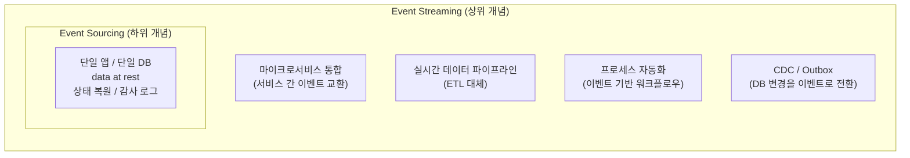

이 관계를 비유하면, Event Sourcing이 "하나의 방에서 일기를 쓰는 것"이라면, Event Streaming은 "건물 전체에 방송 시스템을 깔아서 모든 방이 실시간으로 소통하는 것"이다. 일기(Event Sourcing)는 방송 시스템(Event Streaming)의 콘텐츠 중 하나일 수 있지만, 방송 시스템은 일기 외에도 공지사항, 비상 알림, 배경음악 등 다양한 용도로 활용된다.

### 비교 테이블

| 차원 | Event Sourcing | Event Streaming |
|------|---------------|----------------|
| 데이터 모델 | Data at Rest | Data in Motion |
| 범위 | 단일 앱, 단일 DB | 다수 서비스, 다수 DB |
| 목적 | 상태 복원, 감사 로그, 시간 여행 | 서비스 통합, 실시간 파이프라인 |
| 이벤트의 역할 | source of truth (진실의 원천) | 서비스 간 통신 매체 |
| 스트림 처리 | 선택적 (Replay 위주) | 핵심 (실시간 집계, 변환, 라우팅) |
| 소비자 수 | 보통 1개 (자기 자신) | 다수 (알 수 없을 만큼 많을 수 있음) |
| 도입 결정 | 단일 팀이 자체적으로 결정 가능 | 조직 수준의 합의와 인프라 투자 필요 |

왜 이 구분이 중요한가? 이 학습의 01~05에서는 단일 앱 관점에서 CQRS와 Event Sourcing을 다뤘다. 그것만으로도 상태 복원, 시간 여행 디버깅, Materialized View 구축이라는 강력한 도구를 얻을 수 있다. 하지만 실제 프로덕션에서는 이벤트가 하나의 앱에 머무르지 않는다. 주문 이벤트는 결제, 배송, 알림, 분석 서비스로 흘러가야 하고, 그 각각이 자체 View를 구축해야 한다. 이때 필요한 것이 Event Streaming이라는 더 넓은 패러다임이다.

### 진화 경로

대부분의 시스템은 한 번에 Event Streaming으로 도약하지 않는다. 단계적으로 진화하는 것이 현실적이며, 각 단계에서 이전 단계의 학습이 기반이 된다.

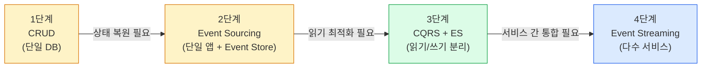

1단계에서 2단계로의 전환은 "현재 상태만으로는 부족하다"는 인식에서 시작한다. 감사 로그가 필요하거나, 버그 수정 후 재처리가 빈번하거나, 특정 시점의 상태를 재현해야 할 때 Event Sourcing을 도입한다. 2단계에서 3단계로는 읽기와 쓰기의 성능 요구사항이 극단적으로 갈릴 때 CQRS를 적용한다. 3단계에서 4단계로는 시스템이 다수의 마이크로서비스로 분화되면서 서비스 간 이벤트 교환이 필요해질 때 Event Streaming으로 확장한다.

중요한 것은 모든 시스템이 4단계까지 갈 필요가 없다는 점이다. 단일 앱으로 충분하다면 2단계에서 멈춰도 되고, 읽기 최적화만 필요하다면 3단계에서 충분하다. [03-cqrs-vs-crud-comparison](03-cqrs-vs-crud-comparison.md)에서 강조한 것처럼, 불필요한 복잡성을 피하는 것이 가장 중요한 설계 판단이다.

---

## 5. 핵심 교훈 — 이벤트 보존의 가치

Event Sourcing과 Event Streaming을 관통하는 가장 중요한 교훈이 하나 있다. 이벤트를 보존하면 아직 떠올리지 못한 질문에도 나중에 답할 수 있다는 것이다.

### 현재 상태만 저장하면 잃는 것

전통적인 CRUD 시스템은 현재 상태(snapshot)만 저장한다. 사용자의 잔액이 10만 원이라는 사실은 알 수 있지만, "왜 10만 원인지"는 알 수 없다. 장바구니에 상품 3개가 담겨 있다는 사실은 알 수 있지만, "어떤 순서로 담았고, 중간에 뺐다가 다시 담은 상품은 무엇인지"는 알 수 없다.

이 정보가 당장은 필요하지 않을 수 있다. 하지만 비즈니스는 진화한다. 6개월 후 마케팅 팀이 "지난 분기에 장바구니 이탈률이 왜 증가했는가?"라고 물으면, 현재 상태만 저장한 시스템은 이 질문에 영원히 답할 수 없다. 과거의 행동 데이터가 이미 사라졌기 때문이다.

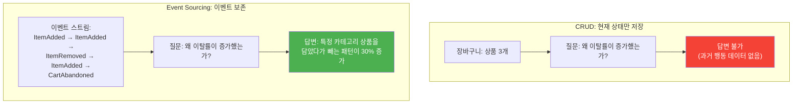

### 이벤트를 보존하면 얻는 것

이벤트를 보존하면 과거의 어떤 질문이든 나중에 대답할 수 있다. 이벤트 스트림에는 "무엇이 언제 왜 발생했는지"가 모두 기록되어 있기 때문이다. 새로운 분석 모델이 필요하면 이벤트를 처음부터 재생하여 새 View를 구축하면 된다. [05-event-replay-time-travel](05-event-replay-time-travel.md)에서 다룬 것처럼, 이벤트 리플레이는 기존 시스템을 건드리지 않고 새로운 Materialized View를 추가하는 것을 가능하게 한다.

Greg Young은 이 가치를 다음과 같이 표현했다.

> "이벤트를 가장 가치 있게 만드는 것은 아직 떠올리지 못한 질문에 답할 수 있다는 점이다."

이 말의 의미를 풀어보면, 시스템을 설계하는 시점에는 미래에 어떤 분석이 필요할지 모른다는 것이다. 현재 상태만 저장하는 시스템은 설계 시점에 예상한 질문에만 답할 수 있다. 반면 이벤트를 보존한 시스템은 설계 시점에 예상하지 못한 질문에도 답할 수 있다. 이벤트는 사실(fact)의 기록이므로, 그 사실로부터 어떤 파생 데이터든 나중에 만들어낼 수 있기 때문이다.

### 구체적 사례: 이커머스 장바구니 분석

이커머스 회사에서 올해 1분기 장바구니 이탈률이 전년 대비 15% 증가했다는 보고가 올라왔다고 하자. 경영진은 원인을 파악하고 싶다.

**CRUD 시스템이라면**: 장바구니 테이블에는 현재 담긴 상품만 저장되어 있다. 이미 이탈한(비어 있는) 장바구니의 과거 내용은 DELETE되어 복구할 수 없다. 별도의 로그 테이블을 만들어뒀다면 일부 추적이 가능하겠지만, 로그 설계 시점에 예상하지 못한 분석 차원(예: "담은 후 삭제까지 걸린 시간", "같은 상품을 반복적으로 담았다 뺀 횟수")은 기록되어 있지 않다.

**Event Sourcing 시스템이라면**: `ItemAdded`, `ItemRemoved`, `CartAbandoned` 이벤트가 모두 보존되어 있다. 분석팀이 새 Consumer Group을 생성하고 1분기 이벤트를 재생하면, 다음 질문에 즉시 답할 수 있다.

- 특정 카테고리 상품의 담기 후 삭제 비율이 급증했는가?
- 가격이 변동된 상품에서 이탈이 집중되었는가?
- 모바일과 웹에서 이탈 패턴이 다른가?
- 장바구니에 담은 후 평균 몇 분 만에 이탈하는가?

이 질문들은 시스템 설계 시점에 예상하지 못한 것들이다. 하지만 이벤트가 보존되어 있었기 때문에 사후에 답할 수 있다.

### 분석 데이터의 비가역성

분석 데이터를 잃으면 복구할 방법이 없다. 코드 버그는 수정하면 되고, DB가 망가지면 백업에서 복원하면 된다. 하지만 "사용자가 무엇을 했는지"라는 행동 데이터는 발생 시점에 기록하지 않으면 영원히 사라진다. 이벤트 수준으로 기록해두면 항상 재방문할 수 있다.

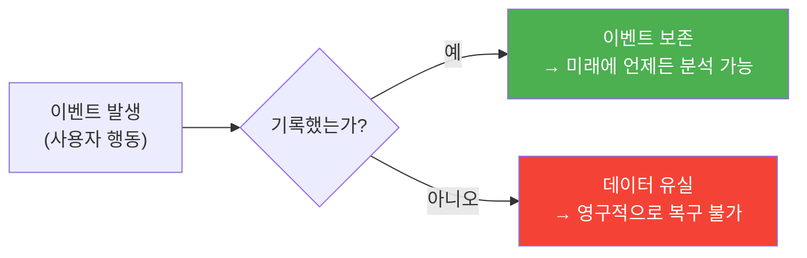

이것이 Event Sourcing과 Event Streaming 모두에서 이벤트 보존 정책(`retention.ms=-1` 또는 충분히 긴 보존 기간)이 중요한 이유다. 이벤트를 버리는 것은 미래의 가능성을 버리는 것과 같다. [05-event-replay-time-travel](05-event-replay-time-travel.md)에서 다룬 토픽 보존 기간 설정이 단순한 인프라 설정이 아니라 비즈니스 의사결정임을 다시 한번 강조한다.

한편, 이벤트를 영구 보존하면 스토리지 비용이 문제가 된다. 하루 100만 건의 이벤트가 발생하는 시스템에서 1년이면 3.65억 건이다. 로컬 SSD에 이 모든 데이터를 보관하는 것은 비현실적이다. 이 문제를 해결하는 것이 다음 절에서 다루는 Redpanda의 Tiered Storage 기능이다.

---

## 6. Redpanda 호환성 노트

이 학습 프로젝트에서 사용하는 Redpanda는 Kafka API와 완전 호환되면서도 Event Streaming 인프라를 더 단순하게 운영할 수 있는 기능을 제공한다. Data in Motion 아키텍처를 프로덕션에 적용할 때 알아두면 유용한 네 가지 기능을 정리한다.

### 멀티 클러스터

Redpanda는 멀티 클러스터 환경을 지원한다. 지역별로 독립된 클러스터를 운영하면서 이벤트를 스트리밍할 수 있다. 예를 들어 서울 클러스터의 주문 이벤트를 도쿄 클러스터의 분석 서비스가 소비하는 구성이 가능하다. 각 클러스터는 독립적으로 운영되므로 한 지역의 장애가 다른 지역으로 전파되지 않는다.

### Geo-Replication

Remote Read Replicas를 통해 지역 간 이벤트 스트림을 복제할 수 있다. 원본 클러스터에서 발행된 이벤트가 읽기 전용 복제본에 자동으로 동기화되어, 지역 간 네트워크 지연 없이 로컬에서 이벤트를 소비할 수 있다.

왜 이것이 Event Streaming에서 중요한가? 3절의 장바구니 사례에서 분석 서비스가 미국 리전에 있고, 장바구니 서비스가 한국 리전에 있다면, 분석 서비스가 한국 클러스터의 이벤트를 직접 소비할 때 네트워크 지연이 발생한다. Geo-Replication으로 한국 클러스터의 이벤트를 미국 리전에 복제해두면, 분석 서비스는 로컬 복제본에서 이벤트를 소비할 수 있어 지연이 사라진다. 이를 통해 글로벌 Event Streaming 인프라를 구축할 수 있다. 상세는 [02-fundamentals/19-geo-replication.md](../02-fundamentals/19-geo-replication.md) 참조.

### Tiered Storage

오래된 이벤트를 S3 등 오브젝트 스토리지로 자동 이관하는 기능이다. 로컬 디스크에는 최근 이벤트만 유지하면서도, S3에 저장된 전체 이벤트 히스토리에 투명하게 접근할 수 있다. 이벤트 보존의 가치를 실현하려면 이벤트를 영구 보존해야 하는데, Tiered Storage는 그 비용을 현실적인 수준으로 낮춰준다. 로컬 SSD 비용 대비 S3 비용은 수십 배 저렴하기 때문이다.

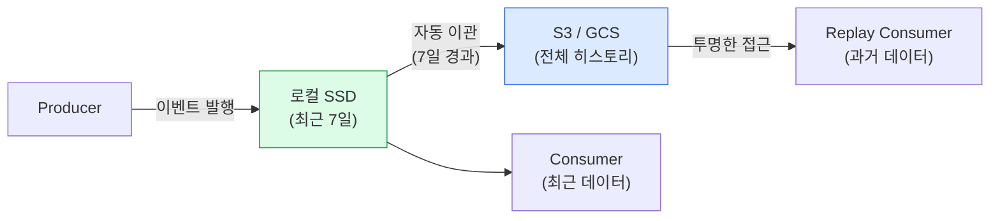

Consumer 입장에서는 이벤트가 로컬 디스크에 있든 S3에 있든 동일한 API로 접근할 수 있다. Tiered Storage는 이 투명성을 보장하기 때문에, 애플리케이션 코드를 수정하지 않고도 이벤트 보존 기간을 무제한으로 늘릴 수 있다. 5절에서 강조한 "이벤트 보존의 가치"를 현실적인 비용으로 실현하는 핵심 인프라 기능이다.

### Redpanda Connect

Data in Motion 파이프라인을 구축하기 위한 커넥터 프레임워크다. 외부 시스템(DB, 클라우드 서비스, SaaS)과 이벤트 스트림을 연결하여, 코드 없이 데이터를 흘려보낼 수 있다. 예를 들어 PostgreSQL의 변경사항을 CDC로 캡처하여 Redpanda 토픽에 발행하거나, 토픽의 이벤트를 Elasticsearch에 자동으로 인덱싱하는 파이프라인을 선언적으로 구성할 수 있다.

2절의 항공 예약 시스템 사례를 다시 떠올려 보자. 검색 서비스가 Elasticsearch에 이벤트를 인덱싱하려면, 일반적으로 Kafka Consumer 코드를 작성하고 Elasticsearch 클라이언트를 통해 인덱싱 로직을 구현해야 한다. Redpanda Connect를 사용하면 이 파이프라인을 YAML 설정만으로 정의할 수 있다. 토픽에서 이벤트를 읽고, 필요한 변환을 거쳐, Elasticsearch에 인덱싱하는 전체 흐름이 코드 한 줄 없이 동작한다. 이는 Data in Motion 아키텍처의 운영 부담을 크게 줄여준다. 상세는 [07-connectors/](../07-connectors/) 참조.

---

## 핵심 교훈

> "Event Sourcing이 '하나의 앱이 과거를 기억하는 방법'이라면, 
> Event Streaming은 '전체 시스템이 실시간으로 소통하는 방법'이다."

이 문서의 핵심을 네 가지로 요약한다.

**Event Sourcing은 단일 앱의 상태 관리 패턴이고, Event Streaming은 시스템 전체의 데이터 흐름 아키텍처다.** 둘은 별개가 아니라 포함 관계에 있으며, Event Sourcing은 Event Streaming의 부분집합이다. 단일 앱에서 이벤트를 source of truth로 사용하는 것이 Event Sourcing이라면, 이벤트가 서비스 경계를 넘어 흐르며 시스템 전체를 연결하는 것이 Event Streaming이다.

**CQRS는 Data in Motion 환경에서 각 서비스가 자체 View를 최적의 기술로 구축할 수 있게 해준다.** 항공 예약 시스템처럼 검색에는 Elasticsearch, 가격 비교에는 Redis, 모바일에는 DynamoDB를 독립적으로 선택할 수 있다. 이벤트 발행자는 소비자의 존재를 알 필요가 없으므로, 새 소비자를 추가해도 기존 서비스의 코드는 변경되지 않는다.

**이벤트 보존의 가치는 현재가 아닌 미래에 드러난다.** 아직 떠올리지 못한 질문에 답할 수 있다는 것이 이벤트를 가장 가치 있게 만드는 특성이다. 현재 상태만 저장한 시스템은 설계 시점에 예상한 질문에만 답할 수 있지만, 이벤트를 보존한 시스템은 미래의 어떤 분석 요구에도 대응할 수 있다.

**이 학습의 전체 흐름**: [01](01-cqrs-pattern.md)~[05](05-event-replay-time-travel.md)에서 단일 앱의 CQRS와 Event Sourcing을 이해했다. 이 문서에서는 그것이 분산 시스템으로 확장되는 방향을 조감했다. 단일 앱의 Event Store가 서비스 간 Event Stream으로 진화하고, 단일 앱의 Materialized View가 다수 서비스의 독립적인 Read Model로 확장되는 과정이다.

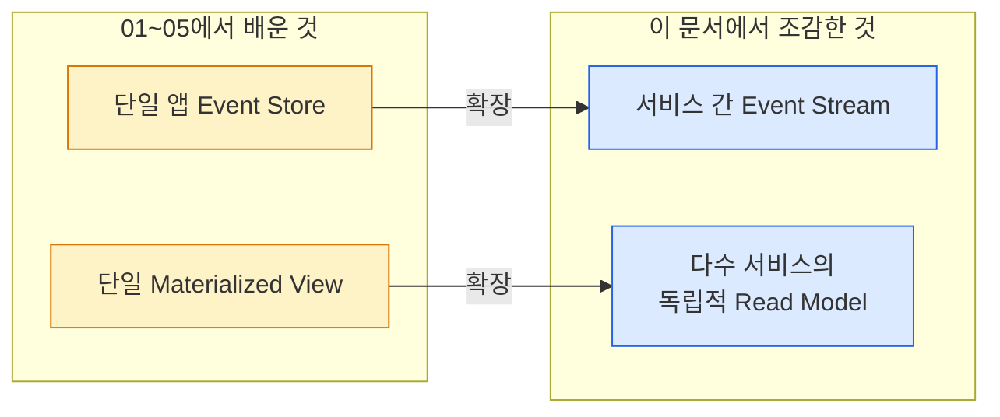

이 조감도를 가지고 있으면, 이후 학습하는 CDC, Outbox 패턴, Saga 등의 패턴이 Event Streaming이라는 큰 그림 안에서 어떤 위치를 차지하는지 명확하게 파악할 수 있다. CDC는 Data at Rest를 Data in Motion으로 전환하는 브릿지이고, Outbox는 DB 트랜잭션과 이벤트 발행의 원자성을 보장하는 패턴이며, Saga는 Event Streaming 위에서 분산 트랜잭션을 조율하는 패턴이다. 모두 Event Streaming이라는 넓은 우산 아래의 구성 요소들이다.
