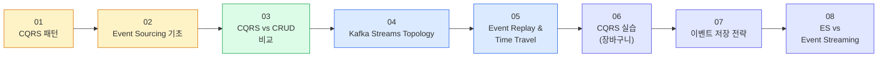
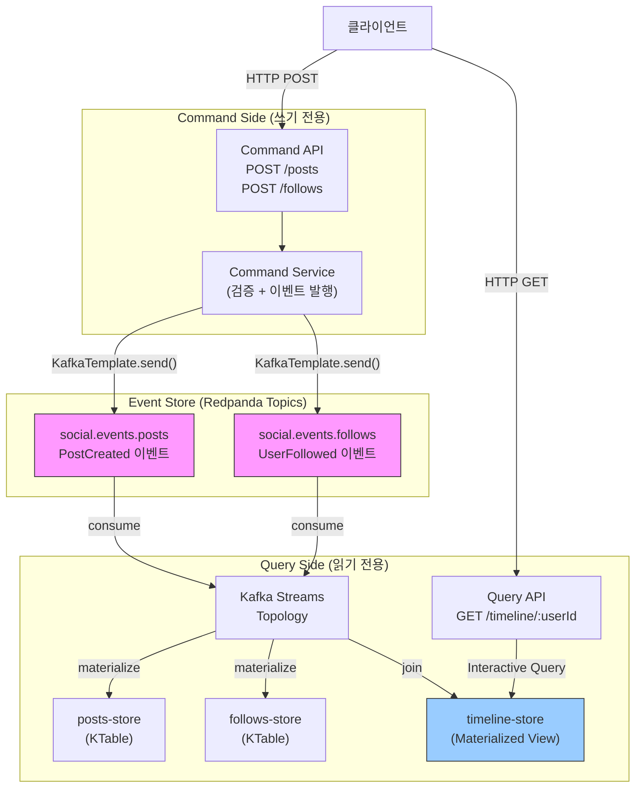

# 06. CQRS + Event Sourcing

Redpanda와 Spring Boot를 사용해 CQRS와 Event Sourcing 패턴을 구현한다. 이 챕터는 앞선 학습(ch01~ch05)과 근본적으로 다른 패러다임을 다룬다. 이전까지는 Kafka를 "메시지 전달 수단"으로 사용했다면, 이 챕터에서는 "이벤트가 시스템의 source of truth"인 아키텍처를 탐구한다.

---

## 왜 이 패턴인가

기존 학습에서 우리는 이벤트를 서비스 간 통신 수단으로 사용했다. Producer가 이벤트를 발행하면 Consumer가 처리하고, 처리 결과는 별도의 데이터베이스에 현재 상태로 저장된다. 이 방식은 직관적이지만, 대규모 시스템에서 읽기와 쓰기의 요구사항이 극명하게 갈릴 때 한계를 드러낸다.

CQRS(Command Query Responsibility Segregation)는 이 한계를 "쓰기 모델과 읽기 모델을 명시적으로 분리"함으로써 해결한다. 여기에 Event Sourcing을 결합하면, 데이터베이스의 현재 상태 대신 이벤트 스트림 자체가 진실의 원천이 된다. 현재 상태는 이벤트를 처음부터 재생한 결과물일 뿐이다.

### 패러다임 전환

| 기존 학습 (ch01~ch05) | 이 챕터에서 배우는 것 |
|---|---|
| KafkaTemplate.send() → Consumer 처리 | 이벤트가 source of truth (토픽 = 이벤트 스토어) |
| 단일 모델 (같은 DB에서 읽고 쓰기) | Command 모델 ≠ Query 모델 (쓰기 최적화 ≠ 읽기 최적화) |
| Consumer가 메시지 처리 후 완료 | Kafka Streams로 실시간 Materialized View 구축 |
| 현재 상태만 저장 | 이벤트 리플레이로 상태 복원 (시간 여행 디버깅) |
| Strong Consistency | Eventual Consistency (의도된 트레이드오프) |

### 세 가지 핵심 질문

이 챕터를 관통하는 질문은 다음 세 가지다. 각 문서는 이 질문에 대한 답을 쌓아가는 방식으로 구성되어 있다.

**1. 왜 읽기와 쓰기를 분리하는가?**
읽기와 쓰기는 근본적으로 다른 요구사항을 가진다. 쓰기는 데이터 검증, 비즈니스 규칙 적용, 정규화된 데이터 저장을 필요로 한다. 반면 읽기는 빠른 조회, 비정규화된 뷰, 복잡한 집계를 필요로 한다. 하나의 모델로 두 요구사항을 동시에 만족시키려면 필연적으로 타협이 발생한다.

**2. 이벤트가 source of truth라는 것은 무엇인가?**
전통적인 시스템은 "현재 상태"를 데이터베이스에 저장한다. Event Sourcing은 이 관점을 뒤집는다. Kafka 토픽에 저장된 이벤트 스트림이 진실의 원천이며, 현재 상태는 이 스트림을 처음부터 재생한 결과다. 덕분에 과거의 임의 시점으로 돌아가 상태를 복원하거나, 전혀 새로운 뷰를 이벤트 히스토리로부터 만들어낼 수 있다.

**3. Kafka Streams는 왜 필요한가?**
일반 Consumer는 메시지를 하나씩 처리하는 데 최적화되어 있어, 상태를 유지하며 집계하거나 여러 스트림을 조인하는 작업이 번거롭다. Kafka Streams는 State Store를 내장하여 실시간 Materialized View 구축을 선언적으로 표현할 수 있게 해주며, Interactive Query를 통해 외부에서 State Store를 직접 조회할 수 있다.

---

## 학습 로드맵

다섯 개의 문서는 개념에서 비교·판단까지 순서대로 쌓이도록 설계되어 있다.



> **설계 원칙**: "What(개념)" → "When(판단)" → "How(구현)" 순서로 진행. 개념을 이해한 뒤 "내 상황에 맞는가"를 판단하고, 그 다음에 구현 세부사항에 들어간다.

### 1단계: 개념 이해 (What)

| 순서 | 문서 | 핵심 질문 | 난이도 |
|:---:|------|-----------|:-----:|
| ① | 01-cqrs-pattern | 왜 읽기와 쓰기를 분리하는가? | ★★☆ |
| ② | 02-event-sourcing-fundamentals | 이벤트가 source of truth라는 것은 무엇인가? | ★★☆ |

> ①→② 흐름: CQRS가 "모델 분리"라면, Event Sourcing은 "쓰기 모델의 구현 방식". 개념 수준에서 둘의 관계를 먼저 이해한다.

### 2단계: 적용 판단 (When)

| 순서 | 문서 | 핵심 질문 | 난이도 |
|:---:|------|-----------|:-----:|
| ③ | 03-cqrs-vs-crud-comparison | 언제 CQRS를 쓰고, 언제 CRUD로 충분한가? | ★★☆ |

> 구현에 투자하기 전에 "이 패턴이 내 상황에 맞는가?"를 판단한다. 불필요한 복잡성을 피하는 것이 가장 중요한 설계 판단이다.

### 3단계: 구현과 활용 (How)

| 순서 | 문서 | 핵심 질문 | 난이도 |
|:---:|------|-----------|:-----:|
| ④ | 04-kafka-streams-topology | KTable, Join, Interactive Query는 어떻게 동작하는가? | ★★★ |
| ⑤ | 05-event-replay-time-travel | 이벤트 리플레이로 과거 상태를 어떻게 복원하는가? | ★★★ |

> ④→⑤ 흐름: Kafka Streams로 Materialized View를 구축한 뒤, Event Replay로 시간 여행 디버깅과 새 View 생성을 실습한다.

### 4단계: 실전 적용 (How — Advanced)

| 순서 | 문서 | 핵심 질문 | 난이도 |
|:---:|------|-----------|:-----:|
| ⑥ | 06-cqrs-handson | 장바구니 CQRS를 Kafka Streams로 어떻게 구현하는가? | ★★★ |
| ⑦ | 07-event-storage-strategies | 이벤트를 어디에 어떻게 저장하는가? (CDC, Outbox, 토픽) | ★★☆ |
| ⑧ | 08-event-sourcing-vs-streaming | ES는 Event Streaming의 어디에 위치하는가? | ★★☆ |

> ⑥→⑦→⑧ 흐름: 장바구니 도메인으로 CQRS를 직접 구현한 뒤, 이벤트 저장 전략의 선택지를 비교하고, 마지막으로 단일 앱의 ES가 분산 시스템의 Event Streaming으로 확장되는 전체 그림을 조감한다.

---

## 실습 프로젝트

**위치**: `project/redpanda-spring-boot/` > `ch09` 패키지
**도메인**: 소셜 피드 (포스트 작성, 팔로우, 타임라인 조회)

소셜 피드는 CQRS를 설명하기에 이상적인 도메인이다. 쓰기(포스트 작성, 팔로우)는 단순하지만, 읽기(타임라인)는 여러 데이터를 조인하고 집계해야 한다. 단일 모델로 이 두 요구사항을 모두 만족시키는 것은 비효율적이다.

### 기능 요구사항

**Command (쓰기) — 이벤트를 발행한다**

- **포스트 작성**: 사용자가 포스트를 작성하면 `PostCreated` 이벤트가 `social.events.posts` 토픽에 저장된다.
- **팔로우**: 사용자가 다른 사용자를 팔로우하면 `UserFollowed` 이벤트가 `social.events.follows` 토픽에 저장된다.

**Query (읽기) — Materialized View를 조회한다**

- **타임라인 조회**: 특정 사용자가 팔로우한 사람들의 포스트를 시간순으로 반환한다. Kafka Streams가 백그라운드에서 실시간으로 타임라인 Materialized View를 구축하며, Interactive Query로 즉시 조회한다.

### 전체 아키텍처



### 데이터 흐름 예시

다음은 Alice가 포스트를 올리고 Bob이 타임라인을 조회하는 전체 흐름이다.

```
1. Alice가 포스트를 작성한다
   → POST /posts { userId: 'alice', content: 'Hello' }
   → PostCreated { postId: 1, userId: 'alice', content: 'Hello', timestamp: T1 }
   → social.events.posts 토픽에 영구 저장

2. Bob이 Alice를 팔로우한다
   → POST /follows { followerId: 'bob', followeeId: 'alice' }
   → UserFollowed { followerId: 'bob', followeeId: 'alice', timestamp: T2 }
   → social.events.follows 토픽에 영구 저장

3. Kafka Streams가 백그라운드에서 View를 구축한다
   → social.events.posts 소비 → posts-store KTable 갱신
   → social.events.follows 소비 → follows-store KTable 갱신
   → 조인: follows-store['bob'] = ['alice'] + posts-store['alice']
        → timeline-store['bob'] 갱신

4. Bob이 타임라인을 조회한다
   → GET /timeline/bob
   → Interactive Query: timeline-store.get('bob')
   → 즉시 반환: [{ postId: 1, userId: 'alice', content: 'Hello', timestamp: T1 }]
```

---

## 이 챕터에서 배우는 핵심 기술

### 1. CQRS 패턴

Command와 Query의 책임을 명확히 분리하고, 각각 독립적인 데이터 모델로 최적화하는 방법을 배운다. 분리의 대가로 Eventual Consistency를 받아들이는 트레이드오프도 함께 다룬다.

### 2. Event Sourcing

이벤트를 source of truth로 사용하는 설계를 배운다. Kafka 토픽을 event store로 활용하며, 이벤트 설계 원칙(과거시제 명명, 충분한 정보 포함, 멱등성 보장)을 실습한다.

### 3. Kafka Streams

KStream과 KTable의 차이, State Store를 사용한 Materialized View 구축, Interactive Query를 통한 외부 조회, 그리고 Join과 Aggregate 등 스트림 연산을 직접 구현한다.

### 4. Event Replay

이벤트 스트림을 처음부터 재생하여 상태를 복원하는 기법을 배운다. 이를 활용한 시간 여행 디버깅과, 기존 이벤트 히스토리로부터 새로운 Materialized View를 추가하는 방법도 다룬다.

---

## 언제 사용하고, 언제 피할 것인가

CQRS와 Event Sourcing은 모든 상황에 적합한 은탄환이 아니다. 이 패턴을 도입하면 운영 복잡도가 크게 증가하므로, 적용 기준을 명확히 이해하는 것이 중요하다.

### 적합한 상황

- 읽기/쓰기 비율이 극단적으로 치우친 경우 (예: 읽기 90%, 쓰기 10%)
- 읽기 모델이 복잡하여 다양한 뷰, 집계, 검색이 필요한 경우
- 감사 로그(audit log)나 시간 여행 디버깅이 비즈니스 요구사항인 경우
- 이벤트 드리븐 MSA 아키텍처에서 이미 이벤트를 중심으로 설계된 경우

### 피해야 할 상황

- **단순 CRUD 애플리케이션**: 읽기와 쓰기가 단순하다면 CQRS는 불필요한 복잡성을 추가할 뿐이다. CRUD로 충분하다.
- **팀 역량이 준비되지 않은 경우**: Event Sourcing 환경에서의 디버깅은 익숙하지 않으면 매우 어렵고, 이벤트 스키마 진화 관리도 별도의 전략이 필요하다.
- **Strong Consistency가 필수인 경우**: 금융 거래처럼 쓰기 후 즉각적인 일관성이 요구되는 도메인은 Eventual Consistency를 전제로 한 CQRS와 맞지 않는다.

---

## 학습 순서

1. 각 문서를 01번부터 순서대로 읽으며 개념을 이해한다.
2. `project/redpanda-spring-boot/ch09` 코드를 구현한다.
3. TopologyTestDriver를 사용해 Kafka Streams Topology를 단위 테스트한다.
4. Redpanda Console에서 이벤트가 토픽에 쌓이는 흐름을 직접 확인한다.
5. Interactive Query API를 호출해 Materialized View 조회를 검증한다.
6. 이벤트 리플레이를 직접 실습하며 시간 여행 디버깅을 경험한다.

---

## 참고 자료

### 패턴 원문

- [Confluent - Event Sourcing 코스](https://developer.confluent.io/courses/event-sourcing/) — Confluent Developer 공식 Event Sourcing 코스 (7모듈, CQRS + ES + Event Streaming)
- [Greg Young - CQRS Documents](https://cqrs.files.wordpress.com/2010/11/cqrs_documents.pdf) — CQRS 패턴 원저자의 공식 문서
- [Martin Fowler - Event Sourcing](https://martinfowler.com/eaaDev/EventSourcing.html) — Event Sourcing 개념의 기준이 되는 정의
- [Martin Fowler - CQRS](https://martinfowler.com/bliki/CQRS.html) — CQRS 패턴 개요 및 적용 판단 기준

### Kafka Streams

- [Kafka Streams 공식 문서](https://kafka.apache.org/documentation/streams/) — Apache Kafka Streams API 레퍼런스
- [Kafka Streams Developer Guide](https://kafka.apache.org/documentation/streams/developer-guide/) — KTable, Interactive Query, State Store 상세 가이드
- [Spring Kafka Streams Support](https://docs.spring.io/spring-kafka/reference/streams.html) — Spring Boot에서 Kafka Streams를 사용하는 방법

### Redpanda

- [Redpanda 공식 문서](https://docs.redpanda.com/) — Kafka 호환 스트리밍 플랫폼 전체 가이드
- [Redpanda + Spring Boot 튜토리얼](https://www.redpanda.com/blog/build-event-driven-microservices-spring-boot) — 공식 블로그 실전 튜토리얼
- [Redpanda Kafka Streams 가이드](https://docs.redpanda.com/current/develop/kafka-clients/kafka-streams/) — Redpanda 환경에서 Kafka Streams 사용법

### 오픈소스 참고 프로젝트

- [eventuate-tram](https://github.com/eventuate-tram/eventuate-tram-core) — Java 기반 CQRS/Event Sourcing 프레임워크
- [Axon Framework](https://github.com/AxonFramework/AxonFramework) — 프로덕션 레벨의 Java CQRS + Event Sourcing 프레임워크
- [kafka-streams-examples](https://github.com/confluentinc/kafka-streams-examples) — Confluent 공식 Kafka Streams 예제 모음
- [spring-kafka samples](https://github.com/spring-projects/spring-kafka/tree/main/samples) — Spring Kafka 공식 샘플 코드
