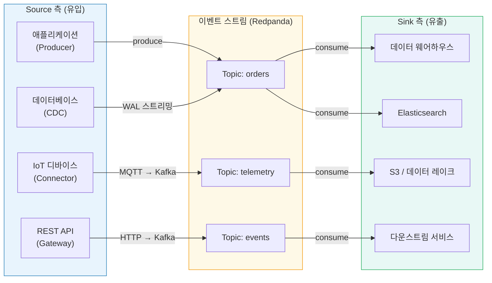
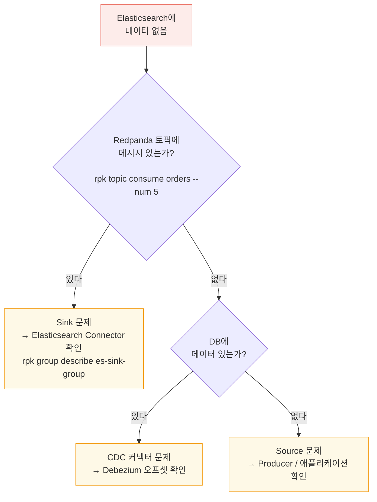
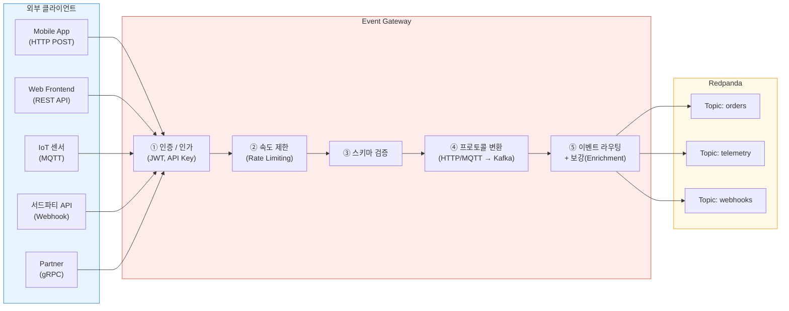
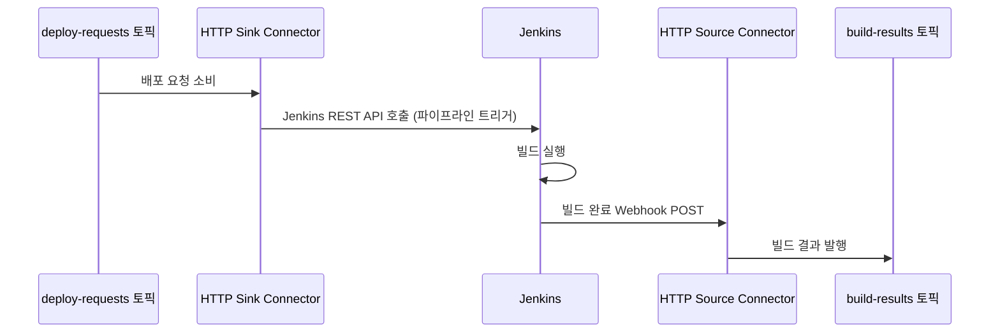
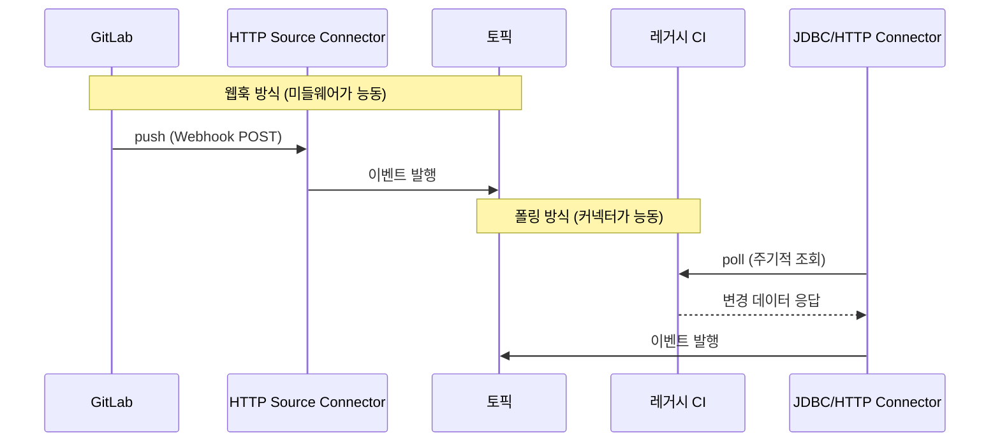
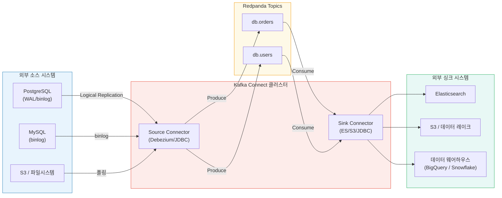
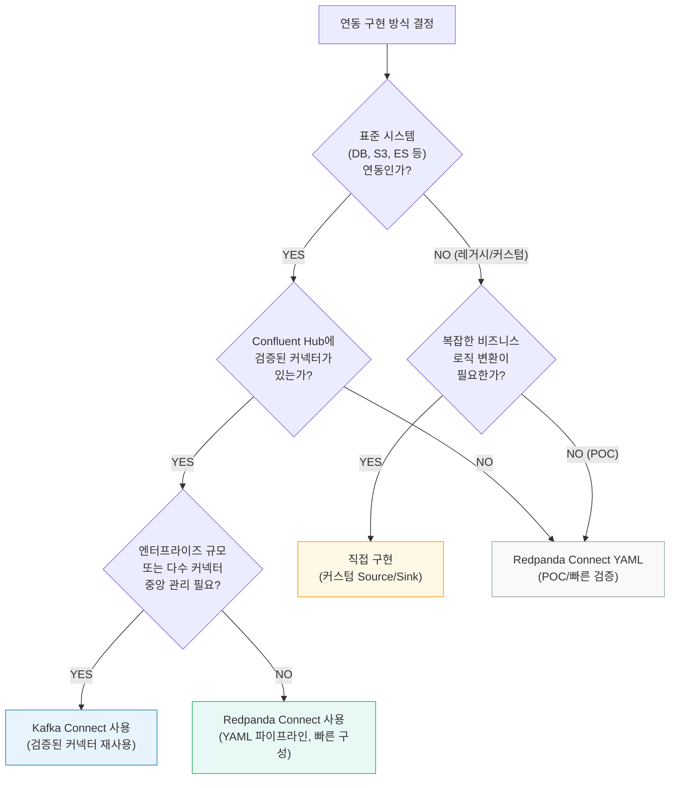
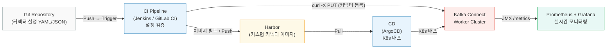

# 01. Source/Sink 패턴 이론

> **시리즈**: `learning/07-connectors/` — Redpanda 커넥터 통합 학습
> | **[01-이론](./01-source-sink-patterns.md)** | [02-Redpanda Connect](./02-redpanda-connect.md) | [03-Spring Boot](./03-spring-boot-impl.md) | [04-운영](./04-operations.md) |

이벤트 스트림은 진공 속에 존재하지 않는다. 데이터는 반드시 어딘가에서 들어오고, 어딘가로 나간다. 이 문서는 Source/Sink의 개념 정의부터 시작하여, Event Gateway와 커넥터 프레임워크(Kafka Connect, Redpanda Connect)를 다룬다.

> **출처**: Confluent "Event Streaming Patterns" — Event Source, Event Sink, Event Source Connector, Event Sink Connector, Event Gateway

---

## Source와 Sink — 용어 정의

모든 데이터 파이프라인에는 두 가지 역할이 존재한다.

**Source(소스)** 는 데이터가 이벤트 스트림으로 흘러들어오는 출발점이다. 데이터베이스, 애플리케이션, REST API, IoT 센서 등 — 이벤트를 생산하는 모든 시스템이 Source에 해당한다. "토픽에 데이터를 넣는 쪽"이라고 이해하면 된다.

**Sink(싱크)** 는 이벤트 스트림에서 데이터가 빠져나가는 도착점이다. 데이터 웨어하우스, Elasticsearch, S3, 다운스트림 마이크로서비스 등 — 이벤트를 소비하여 최종적으로 저장하거나 활용하는 모든 시스템이 Sink다. "토픽에서 데이터를 꺼내 쓰는 쪽"이다.

이 두 용어는 원래 배관(plumbing)에서 왔다. 수도꼭지(source)에서 물이 나오고, 싱크대(sink)로 물이 빠진다. 이벤트 스트림에서도 마찬가지로, Source에서 이벤트가 생성되어 토픽으로 흘러들어오고, Sink에서 이벤트가 소비되어 외부 시스템으로 빠져나간다.

여기서 핵심은, Source와 Sink는 **특정 기술이 아니라 역할**이라는 점이다. 같은 PostgreSQL 데이터베이스라도 CDC로 변경 이벤트를 Redpanda에 보내면 Source이고, 토픽의 이벤트를 받아서 테이블에 저장하면 Sink가 된다. 역할은 데이터 흐름의 방향이 결정한다.

---

## 학습 목표

- 이벤트 소스(Source)와 싱크(Sink)의 개념과 대칭 구조를 이해하고 설계에 적용한다
- Event Gateway로 REST/Webhook/IoT 같은 외부 시스템을 이벤트 스트림에 연결하는 방법을 이해한다
- Kafka Connect와 Redpanda Connect의 차이를 파악하고 상황에 맞게 선택한다

---

## 1. Source와 Sink의 대칭 구조

앞에서 정의한 Source와 Sink는 독립적으로 존재하지 않는다. 이벤트 스트림(토픽)을 중심에 놓고 보면, 이 둘은 항상 대칭 관계를 이룬다. Source가 없으면 스트림에 데이터가 없고, Sink가 없으면 스트림의 데이터가 아무런 가치를 만들지 못한다. 실제 시스템 설계에서는 이 대칭을 의식하면서 양쪽을 함께 설계해야 한다.



### 왜 Source와 Sink를 명시적으로 구분해야 할까

구분하지 않으면 이벤트 흐름 설계가 암묵적이 된다. "누가 이 토픽에 쓰는가?", "이 데이터는 결국 어디에 도달하는가?"라는 질문에 답하지 못하면 시스템을 이해하거나 장애를 진단하기 어려워진다. Source/Sink를 명시적으로 설계하면 데이터 계보(Data Lineage)가 명확해지고, 각 경계에서 스키마 검증, 인증, 모니터링을 체계적으로 적용할 수 있다.

장애 진단 속도가 가장 직접적인 효과다. "Elasticsearch에서 주문 데이터가 안 보인다"는 장애가 발생했을 때, Source/Sink가 명확하면 다음 순서로 빠르게 범위를 좁힐 수 있다.



Source와 Sink를 별도로 모니터링하면 각 경계에서 메트릭(input_received, output_sent)을 독립적으로 관찰할 수 있어 장애 위치를 토픽 단위로 격리할 수 있다.

스키마 진화 관리도 분리 덕분에 단순해진다. Source 측에서 스키마를 변경하더라도 Sink 측은 Schema Registry의 하위 호환 정책 덕분에 영향을 받지 않고, Sink가 새로운 필드를 기대한다면 Source에서만 추가하면 된다.

Source 측에서 DB 변경을 이벤트로 전달하는 방법 — 이중 쓰기(Write-Aside), CDC(Write-Through), Outbox 패턴 — 은 별도 문서에서 깊이 다룬다.

> **관련**: [09-transactional-messaging.md](../../../../02_Architecture/01-event-driven/learning/09-transactional-messaging.md) — 이중 쓰기 문제, CDC, Transactional Outbox 패턴 비교와 구현

이 문서에서는 DB 연동 외의 Source/Sink 패턴에 집중한다. 먼저, Kafka 클라이언트를 사용할 수 없는 외부 시스템은 어떻게 이벤트 스트림에 참여할까?

---

## 2. Event Gateway

Kafka 클라이언트 라이브러리를 사용할 수 없는 시스템은 어떻게 이벤트를 발행할까. 모바일 앱, IoT 센서, 외부 파트너 API 같은 클라이언트가 Kafka 프로토콜을 직접 사용하도록 요구하는 것은 현실적이지 않다. 언어 제약, 방화벽, 클라이언트 라이브러리 관리 문제가 뒤따른다. **Event Gateway**는 이 복잡성을 한 곳에서 흡수하는 표준화된 진입점이다.



Event Gateway가 담당하는 책임은 단순히 프로토콜 변환에 그치지 않는다. 외부에서 들어오는 모든 요청이 거쳐야 하는 일종의 세관이 된다.

| 책임 | 설명 |
|------|------|
| **인증/인가** | JWT, API Key 검증. 클라이언트가 어느 토픽에 발행 가능한지 제어 |
| **속도 제한(Rate Limiting)** | 과도한 트래픽으로 브로커가 과부하되는 것을 방지 |
| **스키마 검증** | 잘못된 형식의 메시지가 토픽에 유입되는 것을 사전 차단 |
| **프로토콜 변환** | HTTP/MQTT/gRPC → Kafka 프로토콜 변환 |
| **이벤트 보강(Enrichment)** | 클라이언트 메타데이터(IP, 타임스탬프, 버전) 추가 |

### Redpanda HTTP Proxy (Pandaproxy)

Redpanda는 내장 HTTP Proxy인 **Pandaproxy**를 제공한다. 별도 게이트웨이 서버 없이도 REST API로 이벤트를 발행하고 소비할 수 있어, 빠른 통합과 디버깅에 유용하다.

```bash
# Pandaproxy 기본 포트: 8082
# 메시지 발행
curl -s -X POST \
  "http://localhost:8082/topics/orders" \
  -H "Content-Type: application/vnd.kafka.json.v2+json" \
  -d '{
    "records": [
      {
        "key": "ord-123",
        "value": {
          "orderId": "ord-123",
          "customerId": "cust-456",
          "total": 59900
        }
      }
    ]
  }'

# Consumer Group 생성 후 메시지 소비
curl -s -X POST \
  "http://localhost:8082/consumers/my-group" \
  -H "Content-Type: application/vnd.kafka.v2+json" \
  -d '{"name": "consumer1", "format": "json", "auto.offset.reset": "earliest"}'

curl -s -X GET \
  "http://localhost:8082/consumers/my-group/instances/consumer1/records" \
  -H "Accept: application/vnd.kafka.json.v2+json"
```

Pandaproxy는 간단한 시나리오에 충분하지만, 인증과 속도 제한 같은 고급 기능이 필요하면 별도 API Gateway(Kong, AWS API Gateway)나 커스텀 서비스를 Event Gateway로 구성하는 것이 현실적이다. Spring Boot로 직접 구현하면 이렇게 된다.

```java
@RestController
@RequestMapping("/events")
@RequiredArgsConstructor
public class EventGatewayController {

    private final KafkaTemplate<String, Object> kafkaTemplate;
    private final SchemaValidator schemaValidator;
    private final RateLimiter rateLimiter;

    @PostMapping("/orders")
    public ResponseEntity<Void> publishOrderEvent(
            @RequestHeader("X-Api-Key") String apiKey,
            @RequestBody Map<String, Object> payload) {

        // 1. 인증 — API Key 검증
        if (!isValidApiKey(apiKey)) {
            return ResponseEntity.status(HttpStatus.UNAUTHORIZED).build();
        }

        // 2. 속도 제한
        if (!rateLimiter.tryAcquire(apiKey)) {
            return ResponseEntity.status(HttpStatus.TOO_MANY_REQUESTS).build();
        }

        // 3. 스키마 검증 — 필수 필드 존재 여부 확인
        if (!schemaValidator.validate("order-created-v1", payload)) {
            return ResponseEntity.badRequest().build();
        }

        // 4. 이벤트 보강 — 서버 측 메타데이터 추가
        payload.put("receivedAt", Instant.now().toEpochMilli());
        payload.put("sourceIp", getClientIp());

        // 5. Redpanda로 발행
        String orderId = (String) payload.get("orderId");
        kafkaTemplate.send("orders", orderId, payload);

        return ResponseEntity.accepted().build();
    }
}
```

Event Gateway까지 살펴봤다. 이제 Source/Sink 연동을 실제로 구현할 때 선택하게 되는 커넥터 프레임워크로 넘어갈 차례다.

---

## 3. Source / Sink 커넥터

### 커넥터란 무엇인가

커넥터(Connector)는 외부 시스템과 이벤트 스트림(토픽) 사이의 데이터 이동을 담당하는 **미리 만들어진 통합 컴포넌트**다. 직접 Producer/Consumer 코드를 작성하는 대신, 커넥터를 설정 파일(JSON)로 등록하면 데이터가 자동으로 흘러간다.

커넥터는 역할에 따라 두 종류로 나뉜다. **Source Connector**는 외부 시스템(DB, 파일, API 등)에서 데이터를 읽어 토픽으로 발행하고, **Sink Connector**는 토픽의 데이터를 읽어 외부 시스템(Elasticsearch, S3, DW 등)에 쓴다. §1에서 정의한 Source/Sink 역할을 자동화하는 도구라고 보면 된다.

Jenkins를 예로 들면 이해가 쉽다. 배포 요청이 `deploy-requests` 토픽에 들어오면 Jenkins 파이프라인을 자동 실행하고, 빌드 결과를 다시 `build-results` 토픽에 발행하는 흐름을 만들고 싶다고 하자. 직접 코드를 짜면 토픽을 소비하는 Consumer, Jenkins REST API를 호출하는 HTTP 클라이언트, 빌드 웹훅을 받는 API 서버, KafkaProducer까지 전부 구현해야 한다. 반면 커넥터를 쓰면 **HTTP Sink Connector**가 토픽의 메시지를 Jenkins API로 전달하고, **HTTP Source Connector**가 빌드 완료 웹훅을 받아 토픽에 발행한다. Sink와 Source가 각각 한 방향씩 담당하는 구조다.



코드 한 줄 없이, Sink Connector와 Source Connector 설정만으로 Redpanda → Jenkins → Redpanda 파이프라인이 완성된다.

#### 웹훅이 없는 미들웨어는?

위 예시는 GitLab/Jenkins가 웹훅을 보낸다는 전제다. 하지만 레거시 미들웨어, 폐쇄망 CI/CD, 사내 빌드 시스템처럼 **아웃바운드 웹훅 기능이 없거나 보안 정책상 차단**된 환경은 엔터프라이즈에서 오히려 더 흔하다. 이 경우 커넥터는 반대로 미들웨어 쪽을 **능동적으로 조회**한다.

| 방식 | 동작 | 적합 사례 |
|------|------|----------|
| **DB 폴링** | 미들웨어가 상태를 DB에 기록 → JDBC Source Connector가 주기적 SELECT | 빌드 결과가 DB에 저장되는 레거시 시스템 |
| **API 폴링** | 미들웨어의 REST API를 주기적으로 호출 → 변경분만 토픽에 발행 | Jenkins REST API, SonarQube API 등 |
| **로그 테일링** | 미들웨어가 남기는 로그 파일을 `file` input으로 실시간 감시 | 로그만 남기는 배치 시스템 |



웹훅은 실시간성이 좋지만 미들웨어의 지원이 필요하고, 폴링은 미들웨어 수정 없이 도입 가능하지만 폴링 간격만큼 지연이 생긴다. 두 방식 모두 커넥터가 처리하므로 애플리케이션 코드에는 영향이 없다.

> **프로덕션 사례**: JDBC Source Connector의 쿼리 모드별 데이터 누락 시나리오와 `timestamp.delay.interval.ms` 방어 전략은 [20-jdbc-source-pipeline.md](../03-spring-boot-integration/20-jdbc-source-pipeline.md)를 참조한다.

그렇다면 직접 코드를 짜는 것과 뭐가 다를까?

### 커넥터 프레임워크가 존재하는 이유

"KafkaTemplate으로 직접 보내면 되는데 왜 커넥터를 쓰나?"라는 질문은 자연스럽다. 작은 시스템에서는 직접 Producer/Consumer 코드가 더 빠르고 간단하다. 하지만 시스템이 성장하면 같은 문제가 반복된다.

서비스 5개가 각각 DB, S3, Elasticsearch에 데이터를 보내면 15개의 커스텀 연동 코드가 필요하다. 커넥터 프레임워크는 이를 설정 파일 15개로 대체한다. 코드 리뷰, 테스트, 배포 파이프라인이 15배 줄어든다. 오프셋 관리, 재시도, DLQ, 모니터링, 스키마 변환은 모든 연동에 필요한 공통 관심사인데, 직접 구현하면 각 연동마다 이 로직을 반복하고 팀마다 품질이 달라진다. Kafka Connect는 이를 프레임워크 레벨에서 제공한다.

**Kafka Connect**는 이 설계 철학을 구현한 프레임워크다.



Kafka Connect의 가치는 이미 검증된 커넥터를 재사용할 수 있다는 점이다. JDBC Source Connector 하나로 Oracle, MySQL, PostgreSQL 등 수십 종의 DB를 지원한다.

| 유형 | 커넥터 | 설명 |
|------|--------|------|
| **Source** | Debezium (PostgreSQL/MySQL/Oracle) | DB WAL/binlog → Redpanda (CDC) |
| **Source** | JDBC Source | DB 테이블 폴링 → Redpanda |
| **Source** | HTTP Source | 웹훅 수신 → Redpanda (Jenkins/GitLab 빌드 이벤트 등) |
| **Source** | Kafka MirrorMaker 2 | 클러스터 간 토픽 복제 |
| **Sink** | HTTP Sink | Redpanda → 외부 REST API 호출 (Jenkins 파이프라인 트리거 등) |
| **Sink** | MinIO (S3 호환) Sink | Redpanda → MinIO/S3 (파케이/AVRO/JSON) |
| **Sink** | Elasticsearch Sink | Redpanda → Elasticsearch |
| **Sink** | JDBC Sink | Redpanda → 관계형 DB |
| **Sink** | BigQuery Sink | Redpanda → Google BigQuery |

### Redpanda Connect — 다른 철학으로 접근한다

**Redpanda Connect**는 Redpanda가 제공하는 내장 데이터 파이프라인 도구다. Kafka Connect와 달리 단일 바이너리로 실행되며, YAML 설정만으로 복잡한 파이프라인을 구성할 수 있다.

```bash
# Redpanda Connect 설치 확인
rpk connect --version

# 설정 파일로 파이프라인 실행
rpk connect run pipeline.yaml

# 가용 커넥터(컴포넌트) 목록 확인
rpk connect list inputs
rpk connect list outputs
rpk connect list processors
```

두 프레임워크는 서로 다른 상황에 적합하다. 어느 쪽이 "더 좋다"기보다는, 요구사항에 따라 선택이 달라진다.

| 기준 | Kafka Connect | Redpanda Connect |
|------|--------------|-----------------|
| **배포 방식** | JVM 워커 클러스터 (분산 모드) | 단일 Go 바이너리 |
| **설정 방식** | REST API로 JSON 설정 | YAML 파일 |
| **확장성** | 워커 추가로 수평 확장 | 프로세스 복제 |
| **커넥터 생태계** | 풍부함 (Confluent Hub, 1000+ 커넥터) | 성장 중 (주요 시스템 지원) |
| **운영 부담** | 높음 (ZooKeeper 또는 KRaft 필요) | 낮음 (의존성 없음) |
| **변환(SMT)** | Single Message Transforms 지원 | Bloblang 매핑 언어 |
| **적합 사례** | 엔터프라이즈, 다수 커넥터 관리 | 소규모~중규모, 빠른 구성 |

Confluent Hub의 검증된 커넥터(Debezium, Snowflake Sink 등)가 필요하거나 수십 개의 커넥터를 중앙에서 관리해야 한다면 Kafka Connect가 적합하다. Redpanda 환경에서 빠르게 파이프라인을 구성하고 싶거나 JVM 운영 부담을 피하고 싶다면 Redpanda Connect가 낫다. 단일 바이너리로 실행되므로 컨테이너 배포도 단순하다.

### 어떤 방식을 선택할지 결정하는 흐름



### 커넥터는 단독으로 존재하지 않는다

실무 환경에서 Redpanda/Kafka는 단독으로 존재하지 않는다. CI/CD(Jenkins, GitLab), 배포(ArgoCD), 레지스트리(Harbor), 모니터링(Prometheus/Grafana) 등 여러 시스템과 공존한다. 커넥터 프레임워크는 이 생태계에 자연스럽게 녹아드는데, 이것이 가능한 핵심 이유는 설정 기반(declarative)이기 때문이다. 코드가 아닌 JSON/YAML 설정이므로 Git에 저장하고, CI에서 검증하고, CD에서 적용하는 GitOps 워크플로우가 자연스럽게 따라온다.

| 외부 시스템 | 커넥터와의 관계 |
|------------|----------------|
| **Jenkins / GitLab CI** | 커넥터 설정 변경 시 CI 파이프라인에서 자동 검증 → REST API로 배포. `curl -X PUT` 한 줄이면 커넥터가 업데이트된다. 코드 배포와 인프라 배포가 같은 파이프라인에서 관리된다. |
| **ArgoCD** | Kafka Connect를 K8s에 배포할 때 ArgoCD가 Helm chart나 Kustomize로 Worker를 관리한다. 커넥터 설정은 ConfigMap으로 선언하여 GitOps 워크플로우에 통합된다. |
| **Harbor** | 커스텀 커넥터 플러그인을 포함한 Docker 이미지를 Harbor에 저장한다. `FROM confluentinc/cp-kafka-connect` + 플러그인 JAR 복사 → Harbor push → ArgoCD/Jenkins가 pull하여 배포. |
| **Prometheus / Grafana** | Kafka Connect Worker는 JMX 메트릭을 노출하고, Redpanda Connect는 `/metrics` 엔드포인트를 제공한다. Prometheus가 수집하여 Grafana 대시보드에서 커넥터 상태, 처리량, 지연시간을 실시간 모니터링한다. |
| **Vault / Secrets Manager** | DB 비밀번호, API 키 같은 민감 정보를 커넥터 설정에 직접 넣지 않고, Vault에서 주입한다. Kafka Connect는 `${file:/secrets/...}` 패턴을, Redpanda Connect는 `${ENV_VAR}` 패턴을 지원한다. |

직접 코드로 구현한 연동은 이 워크플로우에 올리려면 별도의 배포 파이프라인을 구축해야 한다. 커넥터 프레임워크는 이 구조를 처음부터 내장하고 있다.



---

## 4. Redpanda Connect 실전 예시

이론을 이해했다면 이제 실제 파이프라인을 구성해볼 차례다. HTTP Webhook → Redpanda, Redpanda → PostgreSQL, Redpanda → Redpanda(변환) 시나리오는 [02-redpanda-connect.md](./02-redpanda-connect.md)에서 YAML 파이프라인으로 다룬다.

---

## 5. 비즈니스 로직 경계 — 커넥터 vs 애플리케이션

Redpanda Connect 공식 문서는 이 프레임워크를 "simple, chained, stateless processing steps" 중심으로 설명한다. 이 표현은 단순한 철학 선언이 아니라, 커넥터에 무엇을 담아야 하는지를 직접적으로 알려준다. 커넥터는 상태 없는 단순 변환에 강하고, 상태 많은 업무 오케스트레이션을 커넥터에 넣으면 YAML 파일이 비즈니스 규칙의 은신처가 되어 설계가 비틀린다.

### 커넥터에 둘 것

커넥터가 잘하는 일은 데이터를 형태만 바꾸거나 이동시키는 것이다.

- **프로토콜 변환**: JSON↔Avro, REST↔Kafka처럼 같은 데이터를 다른 언어로 번역하는 작업
- **라우팅**: 조건에 따라 토픽이나 엔드포인트를 분기하는 작업 (이미 결정된 규칙을 집행하는 것이지, 판단 자체가 아님)
- **단순 enrichment**: 캐시 조회로 필드를 추가하는 것처럼, 외부 호출 1회로 데이터를 보강하는 작업
- **헤더/메타데이터 정리**: 수신 타임스탬프, 출처 시스템 식별자 삽입
- **포맷 변환**: 날짜 형식 변환, 필드명 재매핑
- **재시도 / DLQ / rate limit / fan-out**: 전달 신뢰성과 흐름 제어는 커넥터 프레임워크가 일관되게 처리하는 것이 낫다

### 애플리케이션에 둘 것

비즈니스 판단이 개입되는 순간, 그 로직은 애플리케이션 코드에 있어야 한다.

- **권한 판단**: "이 사용자가 이 작업을 할 수 있는가?"는 코드 테스트가 필요한 규칙이다
- **트랜잭션 규칙**: 원자적으로 처리해야 하는 여러 단계의 조합
- **비즈니스 검증**: 도메인 규칙 위반 여부 확인 ("재고가 충분한가?", "결제 한도를 초과하는가?")
- **상태 전이**: SAGA처럼 이전 상태에 따라 다음 행동이 달라지는 오케스트레이션
- **도메인 멱등성**: 같은 이벤트가 두 번 처리되면 어떻게 할지 — 이것은 도메인 규칙이지 인프라 규칙이 아니다
- **복잡한 오케스트레이션**: 여러 외부 시스템을 순서대로 호출하며 결과를 종합하는 흐름

### 판단 기준

경계가 모호할 때 쓸 수 있는 질문이 하나 있다.

> "이 로직이 변경되면 YAML 설정 변경인가, 코드 배포인가?"

라우팅 규칙이 바뀌어서 설정 파일을 수정하는 것은 자연스럽다. 하지만 할인 조건이 바뀌었는데 YAML을 고쳐야 한다면, 비즈니스 규칙이 설정 파일 안으로 스며든 것이다. 이런 상황이 생기면 경계를 넘은 신호로 봐야 한다.

---

## 6. 데이터 최신성 계약 (Freshness Contract)

커넥터를 조회 경로에 활용하면 사용자는 REST API처럼 느끼지만, 실제로는 비동기로 갱신되는 Materialized View를 읽는 경우가 많다. 이 간격을 숨기면 "방금 등록했는데 왜 안 보이냐"는 민원이 된다. 해결책은 기술적 개선이 아니라 계약의 명시다.

### API 계약서에 명시해야 할 것

커넥터가 조회 경로에 관여하는 API라면, 설계 시점에 아래를 결정해두어야 한다.

| 항목 | 설명 |
|------|------|
| **반영 지연 허용 시간** | "최대 5초 이내 반영" — 허용 SLA를 숫자로 명시한다 |
| **not found의 의미** | "아직 반영 안 됨"인지 "진짜 없음"인지 구분해야 한다. 둘이 같은 404로 반환되면 클라이언트가 잘못 처리한다 |
| **stale 데이터 허용 여부** | 읽는 시점에 데이터가 최신이 아닐 수 있음을 허용할지 |
| **상태값 노출 여부** | `PENDING`, `PROCESSING`, `READY`, `FAILED` 같은 처리 단계를 외부에 노출할지 |

### 실무 기준 — 어떤 조회에 커넥터를 쓸까

모든 조회를 커넥터 경유로 만드는 것이 목표가 아니다. 조회의 성격에 따라 다르게 접근해야 한다.

| 조회 유형 | 커넥터 적합성 | 이유 |
|-----------|--------------|------|
| **커맨드(쓰기 접수)** | 적극 권장 | 비동기 접수 후 상태 조회 분리 — 커넥터가 자연스럽게 중간 역할을 한다 |
| **캐시/검색계 조회** | 가능 | 커넥터가 Materialized View를 지속 갱신하고, 조회는 그 뷰를 읽는다 |
| **강한 즉시성 OLTP 조회** | 부적합 | "방금 저장한 것을 바로 읽어야 함" — 직접 API가 더 안전하다 |

커넥터 기반 조회의 자연스러운 형태는 "모든 조회를 커넥터로" 보다는 **"조회 모델을 따로 두고, 그 조회 모델을 커넥터가 지속적으로 갱신"**하는 방식이다. 쓰기 경로와 읽기 경로를 분리하고, 읽기 경로는 커넥터가 최신 상태를 유지하는 별도 저장소에서 제공한다. 이것은 CQRS의 핵심 원리와 일치한다.

> **교차참조**: [06-cqrs-event-sourcing/01-cqrs-pattern.md](../../06-cqrs-event-sourcing/01-cqrs-pattern.md) — 쓰기/읽기 모델 분리와 Materialized View 갱신 전략

---

## 참고 자료

- **Confluent Event Streaming Patterns**: [Event Source](https://developer.confluent.io/patterns/event-source/event-source/) | [Event Sink](https://developer.confluent.io/patterns/event-sink/event-sink/) | [Event Source Connector](https://developer.confluent.io/patterns/event-source/event-source-connector/) | [Event Sink Connector](https://developer.confluent.io/patterns/event-sink/event-sink-connector/) | [Event Gateway](https://developer.confluent.io/patterns/event-source/event-gateway/)
- **Redpanda Connect 공식 문서**: [https://docs.redpanda.com/redpanda-connect/](https://docs.redpanda.com/redpanda-connect/)
- **Redpanda HTTP Proxy (Pandaproxy)**: [https://docs.redpanda.com/current/develop/http-proxy/](https://docs.redpanda.com/current/develop/http-proxy/)
- **관련 문서**: [09-transactional-messaging.md](../../../../02_Architecture/01-event-driven/learning/09-transactional-messaging.md) — 이중 쓰기, CDC, Outbox 패턴 상세
