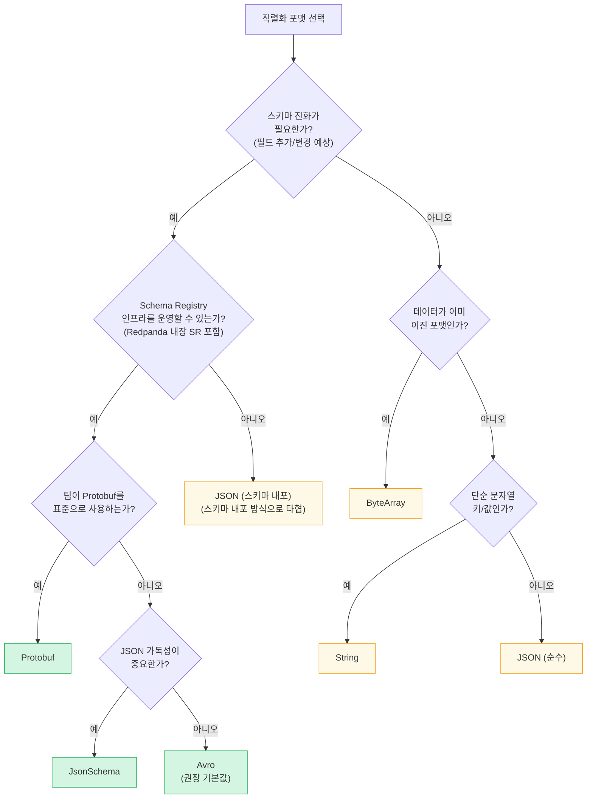
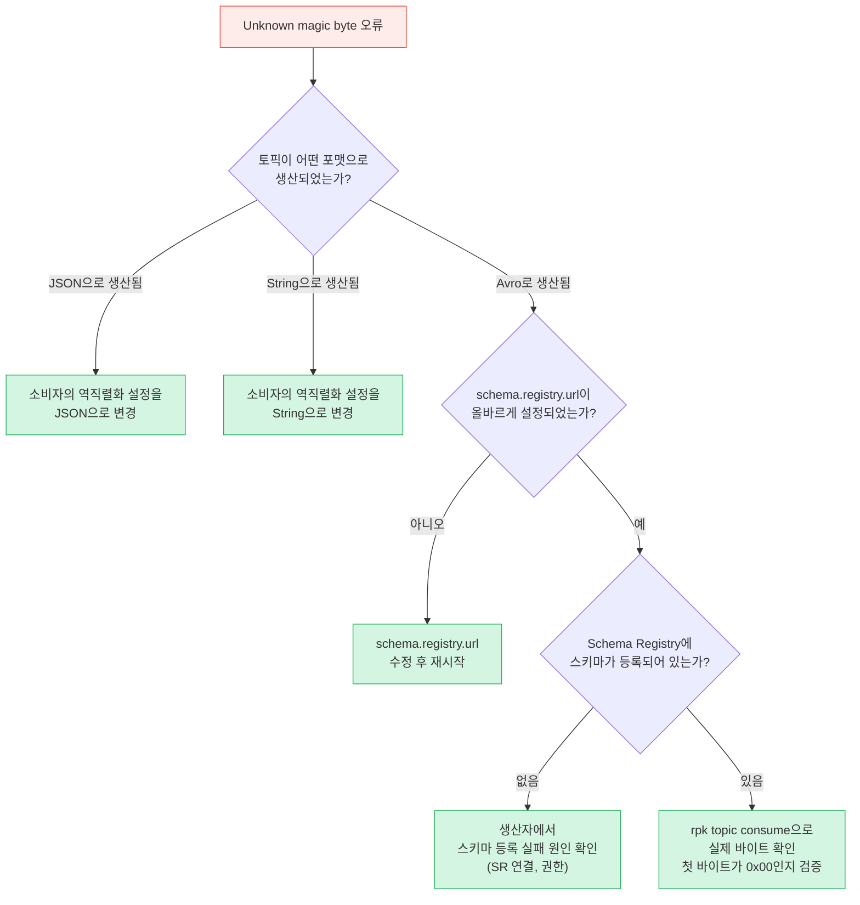
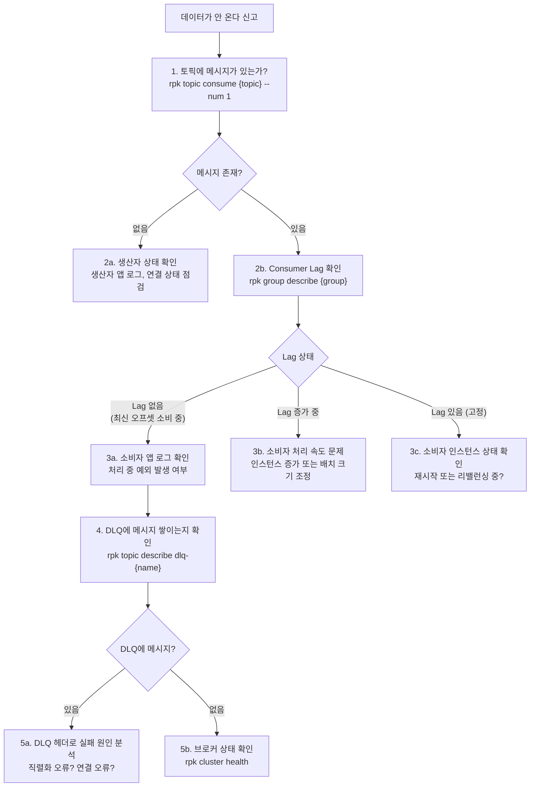

# 04. 운영 — 직렬화, 에러 핸들링, 모니터링

> **시리즈**: `learning/07-connectors/` — Redpanda 커넥터 통합 학습
> | [01-이론](./01-source-sink-patterns.md) | [02-Redpanda Connect](./02-redpanda-connect.md) | [03-Spring Boot](./03-spring-boot-impl.md) | **[04-운영](./04-operations.md)** |

데이터 파이프라인을 구축한 뒤에는 직렬화 포맷 관리, 에러 처리, 모니터링이라는 세 가지 운영 과제가 남는다. 이 문서는 Redpanda 환경에서 공통적으로 적용되는 운영 패턴을 다룬다. Redpanda Connect(rpk connect) 파이프라인이든, Spring Boot 컨슈머든, 또는 Kafka Connect를 사용하든 동일하게 적용되는 개념과 rpk 기반 진단 방법에 집중한다.

---

## 학습 목표

- 직렬화 포맷(Avro, JSON, Protobuf 등)의 특성과 선택 기준을 파악한다
- Redpanda 내장 Schema Registry의 활용 방법을 이해한다
- Dead Letter Queue(DLQ) 개념과 rpk 기반 재처리 패턴을 습득한다
- rpk 명령어를 활용한 Consumer Lag 모니터링과 트러블슈팅 방법을 익힌다
- 외부 시스템별 Rate Limit 정책을 설계하고 장애 연쇄 전파를 방지한다
- 커넥터 경유 시 인증/인가 컨텍스트 전파 전략을 수립한다

---

## 1. 직렬화 포맷과 Schema Registry

직렬화 포맷 선택은 파이프라인의 메시지 크기, 스키마 진화 가능성, 타입 안전성, 다운스트림 호환성을 결정한다. 어떤 컨슈머(Spring Boot, Redpanda Connect, Kafka Connect 등)를 쓰더라도 토픽에 어떤 포맷으로 저장할지는 동일하게 결정해야 하는 문제다.

### 1.1 직렬화 포맷 선택 기준

선택 기준은 세 가지 질문으로 시작한다. 스키마가 변경될 가능성이 있는가? Schema Registry 인프라를 구성할 수 있는가? 다운스트림 소비자가 어떤 포맷을 기대하는가?

| 포맷 | Schema Registry 필요 | 스키마 진화 | 메시지 크기 | 가독성 | 주요 사용처 |
|------|----------------------|-------------|-------------|--------|-------------|
| Avro | 필요 | 자동 호환성 검증 | 작음 (이진) | 없음 | 프로덕션 파이프라인, 스키마 변경 빈번 |
| Protobuf | 필요 | 자동 호환성 검증 | 작음 (이진) | 없음 | gRPC 연동, Protobuf 표준 팀 |
| JsonSchema | 필요 | SR 기반 검증 | 중간 (JSON) | 있음 | JSON 선호, 스키마 관리 필요 |
| JSON (스키마 내포) | 불필요 | 수동 관리 | 큼 (스키마 포함) | 있음 | 소규모 파이프라인, 디버깅 |
| JSON (순수) | 불필요 | 없음 | 작음 (JSON만) | 있음 | 단순 데이터, 레거시 연동 |
| String | 불필요 | 없음 | 가장 작음 | 있음 | 키 필드, 로그 라인 |
| ByteArray | 불필요 | 없음 | 원본 그대로 | 없음 | 이진 포맷 패스스루 |



### 1.2 Key vs Value 직렬화 분리

Kafka 메시지에는 Key와 Value가 독립적으로 존재하기 때문에, 두 영역에 서로 다른 직렬화 방식을 적용할 수 있다. 가장 흔한 패턴은 Value는 Avro로 처리하여 스키마를 관리하면서, Key는 String으로 처리하여 단순한 주문 ID나 사용자 ID를 유지하는 것이다.

파티션 분배 전략도 이 구분에 영향을 미친다. Kafka는 기본적으로 Key의 해시값으로 파티션을 결정한다. Key를 String으로 처리하면 단순한 문자열 해시가 되어 파티션 분배가 예측 가능하다. Key도 Avro로 처리한다면 Avro 인코딩된 바이트가 해시 대상이 되므로, 소비자 측에서 파티션 키를 기반으로 데이터를 그룹화할 때 추가 역직렬화 단계가 필요해진다.

### 1.3 Redpanda 내장 Schema Registry

Confluent Kafka 환경에서는 Schema Registry를 별도 프로세스로 구성해야 한다. Redpanda의 실용적인 장점 중 하나는 Schema Registry가 브로커에 내장되어 있다는 점이다. 별도 컨테이너나 프로세스 없이 포트 8081로 Schema Registry API를 그대로 사용할 수 있다.

```yaml
# docker-compose.yml — Redpanda 단독으로 SR 포함
services:
  redpanda:
    image: docker.redpanda.com/redpandadata/redpanda:v25.3.6
    command:
      - redpanda
      - start
      - --smp=1
      - --memory=512M
      - --schema-registry-addr=0.0.0.0:8081
      - --kafka-addr=0.0.0.0:9092
      - --advertise-kafka-addr=redpanda:9092
    ports:
      - "9092:9092"
      - "8081:8081"  # Schema Registry — 별도 컨테이너 불필요
```

Schema Registry는 스키마를 등록할 때 기존 스키마와의 호환성을 검사한다. 호환성 수준은 Subject별로 독립적으로 설정할 수 있다.

| 호환성 모드 | 설명 | 적합한 상황 |
|-------------|------|-------------|
| `BACKWARD` (기본값) | 신규 스키마로 구버전 메시지를 읽을 수 있음 | 소비자를 먼저 업데이트하는 배포 |
| `FORWARD` | 구버전 스키마로 신규 메시지를 읽을 수 있음 | 생산자를 먼저 업데이트하는 배포 |
| `FULL` | BACKWARD + FORWARD 동시 만족 | 엄격한 스키마 관리 환경 |
| `NONE` | 호환성 검사 없음 | 개발 환경, 프로토타입 |

```bash
# Subject의 호환성 수준 변경
curl -X PUT http://redpanda:8081/config/orders-value \
  -H "Content-Type: application/vnd.schemaregistry.v1+json" \
  -d '{"compatibility": "BACKWARD"}'

# 현재 등록된 스키마 목록 확인
curl -s http://redpanda:8081/subjects | jq .

# 특정 Subject의 최신 스키마 조회
curl -s http://redpanda:8081/subjects/orders-value/versions/latest | jq .
```

### 1.4 Subject 네이밍 전략

Schema Registry는 스키마를 Subject 단위로 관리한다. 세 가지 전략이 있으며, 선택에 따라 스키마 관리 범위가 달라진다.

- **TopicNameStrategy** (기본값): `{토픽이름}-value` 형태. 동일 토픽의 모든 메시지가 같은 Subject를 공유해야 한다.
- **RecordNameStrategy**: 레코드 타입(FQCN)별로 Subject를 분리. 하나의 토픽에 여러 이벤트 타입이 혼재할 때 유용하다.
- **TopicRecordNameStrategy**: 토픽과 레코드 타입을 결합(`orders-com.example.OrderCreated`). 가장 세분화된 관리가 가능하다.

하나의 토픽에 `OrderCreated`, `OrderUpdated`, `OrderCancelled` 세 이벤트 타입이 들어온다면 `TopicNameStrategy`에서는 세 타입이 하나의 Subject를 공유해야 해서 스키마 진화가 복잡해진다. `RecordNameStrategy`를 사용하면 각 타입이 독립된 Subject를 가지므로 관리가 분리된다.

### 1.5 흔한 직렬화 오류와 진단

Avro 메시지는 특정 와이어 포맷을 따른다. 이 구조를 알아야 오류를 진단할 수 있다.

```
byte[0]   = 0x00 (매직 바이트 — Avro + Schema Registry 형식임을 표시)
byte[1-4] = schema_id (4바이트 정수 — Schema Registry에서 발급한 스키마 ID)
byte[5+]  = Avro 이진 페이로드
```

`Unknown magic byte` 오류는 역직렬화를 시도할 때 첫 바이트가 `0x00`이 아닌 경우에 발생한다. JSON 텍스트의 첫 바이트는 `{`(0x7B)이므로, Avro 역직렬화기는 "알 수 없는 매직 바이트"라고 오류를 던진다. 소비자가 Avro 포맷을 기대하는데 토픽에 JSON이 저장된 상황이 가장 흔한 원인이다.



```bash
# 토픽의 실제 첫 바이트 확인 — 0x00이면 Avro, 7b이면 JSON
rpk topic consume orders --num 1 --format '%v\n' | xxd | head -2
# Avro라면: 00 00 00 00 03 ...
# JSON이라면: 7b 22 69 64 22 ...  ({ " i d " ...)

# Schema Registry에 등록된 Subject 목록
curl -s http://redpanda:8081/subjects | jq .

# 특정 Subject의 최신 스키마 조회
curl -s http://redpanda:8081/subjects/orders-value/versions/latest | jq .

# 스키마 ID로 스키마 직접 조회 (메시지 바이트에서 추출한 ID 사용)
SCHEMA_ID=3
curl -s http://redpanda:8081/schemas/ids/${SCHEMA_ID} | jq .

# Schema Registry 호환성 수준 확인
curl -s http://redpanda:8081/config/orders-value | jq .
# {"compatibilityLevel": "BACKWARD"}
```

---

## 2. 에러 핸들링과 Dead Letter Queue

데이터 파이프라인에서 장애는 "발생하면"이 아니라 "언제 발생하느냐"의 문제다. 형식이 잘못된 레코드 하나가 에러 처리 전략 없이는 전체 파이프라인을 멈춰 세울 수 있다.

### 2.1 에러 허용 전략 개요

에러가 발생했을 때 선택지는 세 가지다. 즉시 중단하거나, 조용히 건너뛰거나, 별도 토픽으로 격리한다. 어떤 전략이 "정답"인지는 상황에 따라 다르지만, 대부분의 프로덕션 환경에서는 Dead Letter Queue(DLQ)가 가장 균형 잡힌 선택이다.

| 전략 | 데이터 손실 | 파이프라인 중단 | 복구 가능성 | 적합한 상황 |
|------|------------|----------------|------------|------------|
| Fail Fast | 없음 | 발생 | 불가 (처리 중단) | 개발/테스트, 금융 데이터 |
| Silently Ignore | 발생 | 없음 | 불가 | 비중요 로그, 지표 |
| DLQ | 없음 (격리됨) | 없음 | 가능 | 대부분의 프로덕션 |

Fail Fast는 에러가 즉시 표면으로 드러나야 문제를 빨리 발견할 수 있는 개발 환경, 또는 단 하나의 손실도 허용하지 않는 금융 거래 파이프라인에 적합하다. Silently Ignore는 애플리케이션 로그를 적재하는 파이프라인처럼 데이터 손실이 치명적이지 않은 경우에만 적합하다. 그러나 이 경우에도 로그에 에러 빈도와 패턴은 남겨두어야 한다.

### 2.2 DLQ 개념

> **DLQ 개념과 Redpanda Connect 구현**: [02-redpanda-connect.md "에러 처리 전략"](./02-redpanda-connect.md)에서 retry, fallback(DLQ), switch, catch 4가지 메커니즘을 다룬다. 이 섹션에서는 DLQ의 운영 관점(재처리, 보존 정책, 모니터링)에 집중한다.

DLQ 메시지에는 컨텍스트 헤더가 붙는다. Kafka Connect를 사용하는 경우 `__connect.errors.*` 헤더가 자동으로 추가된다. 이 헤더가 DLQ를 실용적으로 만드는 핵심이다. 헤더 없이는 DLQ 메시지를 보고 왜 실패했는지 알 방법이 없다.

### 2.3 rpk 기반 DLQ 재처리

DLQ에 메시지가 소량 쌓인 경우 `rpk`로 내용을 확인하고, 수정 후 원본 토픽에 다시 발행하는 것이 가장 빠른 방법이다.

```bash
# 1단계: DLQ 메시지 전체 내용 확인 (헤더 포함)
rpk topic consume dlq-orders-sink \
  --brokers localhost:19092 \
  --offset start \
  --format 'Partition=%p Offset=%o\nHeaders=%h\nValue=%v\n---\n'

# 2단계: 특정 오프셋의 메시지만 확인
rpk topic consume dlq-orders-sink \
  --brokers localhost:19092 \
  --offset 42 \
  --num 1

# 3단계: DLQ 메시지 수 확인 (운영 모니터링)
rpk topic describe dlq-orders-sink \
  --brokers localhost:19092 \
  --print-watermarks

# 4단계: 수정된 레코드를 원본 토픽에 재발행
echo '{"orderId":"ORD-2024-001","amount":1500000,"status":"PENDING"}' | \
  rpk topic produce orders \
  --brokers localhost:19092 \
  --key "ORD-2024-001"

# 5단계: 재처리 후 DLQ가 더 이상 증가하지 않는지 확인
rpk topic describe dlq-orders-sink \
  --brokers localhost:19092 \
  --print-watermarks
```

### 2.4 DLQ 운영 고려사항

DLQ 토픽은 보존 정책 없이 운영하면 디스크를 무한정 소비한다. 일반적으로 재처리에 충분한 시간인 7일을 기준으로 삼는다.

```bash
# DLQ 토픽 보존 정책 설정 (7일)
rpk topic alter-config dlq-orders-sink \
  --set retention.ms=604800000 \
  --brokers localhost:19092

# DLQ 토픽 크기 확인 (빠르게 증가하고 있다면 근본 원인 분석 필요)
rpk topic describe dlq-orders-sink \
  --brokers localhost:19092 \
  --print-watermarks
```

DLQ 메시지가 빠르게 쌓이고 있다는 것은 파이프라인에 구조적인 문제가 있다는 신호다. 재처리 속도보다 실패 속도가 빠른 상황에서는 DLQ 토픽이 오히려 문제를 감추는 역할을 한다. 이 경우 파이프라인을 멈추고 근본 원인을 해결하는 것이 더 나은 선택이다.

순서 보장도 고려해야 한다. Kafka는 파티션 내에서 순서를 보장하지만, DLQ를 사용하면 싱크 입장에서 오프셋 시퀀스에 빈 공간이 생긴다. 주문 처리처럼 비즈니스 순서가 중요한 파이프라인에서는 DLQ 대신 Fail Fast 전략을 사용하거나, 싱크 시스템이 멱등성을 보장하도록 설계해야 한다.

DLQ 모니터링 자동화가 필요하다면 아래 스크립트를 cron에 등록하면 된다.

```bash
#!/bin/bash
# DLQ 모니터링 스크립트

BROKERS="localhost:19092"
DLQ_TOPICS=(
  "dlq-orders-sink"
  "dlq-payments-sink"
)
ALERT_THRESHOLD=10

for topic in "${DLQ_TOPICS[@]}"; do
  msg_count=$(rpk topic describe "$topic" \
    --brokers "$BROKERS" \
    --print-watermarks 2>/dev/null | \
    awk '/^[0-9]/ {sum += $3 - $2} END {print sum}')

  if [ -z "$msg_count" ]; then
    echo "[$topic] 토픽 없음 또는 연결 실패"
    continue
  fi

  echo "[$topic] 메시지 수: $msg_count"

  if [ "$msg_count" -gt "$ALERT_THRESHOLD" ]; then
    echo "경고: $topic 에 $msg_count 건 초과 누적. 즉시 확인 필요"
    # curl -X POST "$SLACK_WEBHOOK" -d "{\"text\": \"DLQ 경고: $topic\"}"
  fi
done
```

---

## 3. 모니터링과 트러블슈팅

모니터링 없는 Kafka/Redpanda 파이프라인은 블랙박스다. 컨슈머가 RUNNING 상태를 보여주더라도 내부적으로 데이터가 흐르지 않거나, Consumer Lag이 쌓여가는 상황이 얼마든지 발생한다.

### 3.1 Consumer Lag — 가장 중요한 지표

Consumer Lag은 최신 오프셋과 현재 소비 오프셋의 차이다. 이 값이 지속적으로 증가한다면 소비자의 처리 속도가 생산 속도를 따라가지 못한다는 뜻이다. Redpanda 환경에서는 `rpk` 명령어로 Consumer Lag을 확인하는 것이 가장 직관적이다.

```bash
# Consumer Group 목록 확인
rpk group list

# 특정 그룹의 Consumer Lag 상세 조회
rpk group describe my-consumer-group

# 모든 그룹의 Lag를 한 번에 확인
rpk group list | awk '{print $1}' | tail -n +2 | while read group; do
    echo "=== $group ==="
    rpk group describe "$group" --print-lag
done
```

`rpk group describe` 출력은 파티션별 상태를 보여준다. 아래는 전형적인 출력 예시다.

```
GROUP           my-consumer-group
COORDINATOR     redpanda-0
STATE           Stable
BALANCER        range
MEMBERS         2

TOPIC    PARTITION  CURRENT-OFFSET  LOG-END-OFFSET  LAG    MEMBER-ID
orders   0          1500            1500            0      consumer-1
orders   1          1420            1500            80     consumer-2
orders   2          900             1500            600    consumer-2
```

이 출력에서 파티션 2의 Lag가 600으로 크고, `consumer-2`가 파티션 1과 2를 모두 담당하고 있다. 즉 한 인스턴스에 부하가 집중된 상황이다. 컨슈머 인스턴스를 하나 더 추가하면 파티션이 재분배되면서 Lag가 해소될 것이다.

반면 모든 파티션에서 Lag가 고르게 증가한다면 전체적인 처리 능력 부족이다. 이 경우 파티션 수와 컨슈머 인스턴스 수를 함께 늘려야 한다. 파티션 수보다 컨슈머 인스턴스가 많아도 초과 인스턴스는 유휴 상태가 되므로, 두 값을 맞추는 것이 자원 효율적이다.

Lag가 지속적으로 증가할 때 해결 방법은 세 가지다. 컨슈머 인스턴스 수를 늘리거나, 외부 시스템의 쓰기 성능을 개선하거나, 배치 크기를 조정한다. Kafka Connect Sink를 사용한다면 `tasks.max`를 늘리는 것이 첫 번째 선택지다.

Lag 수치 자체보다 **Lag의 변화율**이 더 중요한 지표다. Lag가 1000이라도 꾸준히 감소하고 있다면 소비자가 따라잡고 있는 것이다. 반대로 Lag가 100이라도 계속 증가하는 추세라면 구조적 문제가 있다는 뜻이다.

### 3.2 Prometheus + Grafana 기본 설정

Prometheus가 주기적으로 메트릭을 스크레이핑하여 시계열 데이터베이스에 저장하고, Grafana가 그것을 시각화하는 구조가 표준적인 접근법이다. Redpanda 브로커는 포트 9644에서 Prometheus 형식의 메트릭을 직접 노출한다. 별도의 JMX Exporter가 필요하지 않다.

```yaml
# prometheus.yml
global:
  scrape_interval: 15s

scrape_configs:
  # Redpanda 브로커 메트릭 — 포트 9644에서 직접 수집
  - job_name: 'redpanda'
    static_configs:
      - targets: ['redpanda:9644']
    metrics_path: '/metrics'
    scrape_interval: 30s

  # Kafka Connect를 사용하는 경우 JMX Exporter 추가 (선택)
  # - job_name: 'kafka-connect'
  #   static_configs:
  #     - targets: ['kafka-connect:9404']
```

Redpanda 메트릭에서 모니터링에 유용한 항목은 다음과 같다.

| 메트릭 | 설명 | 알람 기준 |
|--------|------|---------|
| `vectorized_kafka_request_latency_seconds` | 브로커 요청 지연 시간 | p99 > 500ms 시 경고 |
| `vectorized_storage_log_segment_count` | 토픽 세그먼트 수 | 급증 시 디스크 확인 |
| `vectorized_cluster_partition_leader_count` | 리더 파티션 수 | 0으로 감소 시 즉각 알람 |
| `vectorized_io_queue_total_read_ops` | 디스크 읽기 작업 수 | 지속 높으면 I/O 병목 |
| `vectorized_kafka_records_produced_total` | 생산된 레코드 누적 수 | 증가 멈추면 생산자 중단 |

Grafana 대시보드에서 가장 유용한 패널은 Consumer Lag 추이다. Redpanda는 Consumer Group 정보를 브로커 메트릭으로 직접 노출하므로 다음 PromQL로 시각화할 수 있다.

```promql
# Consumer Group별 Lag 합계
sum by (group, topic) (
  vectorized_kafka_consumer_group_lag
)

# Lag 변화율 (5분 윈도우) — 양수면 쌓이는 중, 음수면 해소 중
rate(vectorized_kafka_consumer_group_lag[5m])

# 브로커 요청 지연 p99
histogram_quantile(0.99,
  rate(vectorized_kafka_request_latency_seconds_bucket[5m])
)
```

Prometheus AlertManager를 통해 Lag 임계값 초과 시 즉각 알림이 가도록 설정하는 것이 중요하다. 운영자가 항상 Grafana를 보고 있을 수 없기 때문이다.

```yaml
# prometheus-alerts.yml
groups:
  - name: redpanda-pipeline
    rules:
      - alert: ConsumerLagHigh
        expr: sum by (group, topic) (vectorized_kafka_consumer_group_lag) > 1000
        for: 5m
        labels:
          severity: warning
        annotations:
          summary: "Consumer Lag 임계값 초과: {{ $labels.group }}/{{ $labels.topic }}"
          description: "Lag가 5분 이상 1000 초과. 컨슈머 처리 능력을 점검하세요."

      - alert: ConsumerLagGrowing
        expr: rate(vectorized_kafka_consumer_group_lag[10m]) > 10
        for: 10m
        labels:
          severity: critical
        annotations:
          summary: "Consumer Lag 지속 증가: {{ $labels.group }}"
          description: "초당 10 이상 속도로 Lag가 10분째 증가 중. 즉각 조치가 필요합니다."
```

Kafka Connect를 함께 사용한다면 JMX Exporter를 추가하여 커넥터별 태스크 상태와 처리율도 수집할 수 있다. 자세한 JMX Exporter 설정은 Kafka Connect 공식 문서를 참조한다.

### 3.3 rpk 기반 토픽 진단

운영 중 문제가 생겼을 때 `rpk` 명령어는 빠른 진단의 첫 번째 도구다.

```bash
# 토픽에 메시지가 있는지 확인 (최신 1건 소비)
rpk topic consume orders --num 1 --brokers localhost:19092

# 토픽 파티션별 watermark(시작/끝 오프셋) 확인
rpk topic describe orders \
  --brokers localhost:19092 \
  --print-watermarks

# 원시 바이트 확인 — 포맷 식별에 사용
rpk topic consume orders --num 1 --format '%v\n' | xxd | head -5

# 브로커 전체 상태 확인
rpk cluster health

# 특정 Consumer Group의 Lag 확인
rpk group describe my-consumer-group --brokers localhost:19092
```

### 3.4 트러블슈팅 흐름도

"데이터가 안 온다"는 신고를 받았을 때 아래 흐름도를 따라가면 원인을 체계적으로 좁힐 수 있다.



### 3.5 문제별 빠른 참조

| 증상 | 가능한 원인 | rpk 진단 명령어 | 해결 방법 |
|------|-----------|----------------|---------|
| 토픽에 메시지 없음 | 생산자 중단, 연결 실패 | `rpk topic describe {topic} --print-watermarks` | 생산자 상태 확인 |
| Consumer Lag 지속 증가 | 소비자 처리 속도 < 생산 속도 | `rpk group describe {group}` | 컨슈머 인스턴스 증가 |
| Unknown magic byte 오류 | 직렬화 포맷 불일치 | `rpk topic consume {topic} --num 1 \| xxd` | 소비자 역직렬화 설정을 실제 포맷에 맞게 수정 |
| DLQ 메시지 급증 | 구조적 파이프라인 문제 | `rpk topic describe dlq-{name} --print-watermarks` | 근본 원인 분석 후 파이프라인 수정 |
| 브로커 응답 없음 | 브로커 과부하, 네트워크 | `rpk cluster health` | 브로커 리소스 확인 |
| 특정 파티션만 Lag 증가 | 해당 파티션 컨슈머 문제 | `rpk group describe {group}` | 해당 컨슈머 인스턴스 재시작 |
| Schema Registry 오류 | SR 연결 실패, 스키마 미등록 | `curl http://redpanda:8081/subjects` | SR 접근 가능 여부 확인, 스키마 등록 |

---

## 4. Rate Limit 정책 설계

커넥터를 통신 계층으로 쓸 때 가장 먼저 부딪히는 운영 문제는 외부 시스템 속도 제어다. 특정 외부 시스템이 느려지거나 429를 반환하기 시작하면, 해당 시스템으로 향하는 파이프라인이 재시도를 반복하다 Consumer Lag을 급격히 쌓이게 만든다. 더 나쁜 시나리오는 이 압력이 같은 브로커를 공유하는 다른 파이프라인으로 전이되는 것이다. 외부 시스템 하나의 장애가 연쇄 전파되는 이 패턴을 막으려면 파이프라인 단위의 Rate Limit과 에러 분류 전략이 필요하다.

### 4.1 rpk connect rate_limit 리소스

`rpk connect`는 `rate_limit_resources`를 파이프라인 수준의 공유 자원으로 정의한다. 여러 파이프라인이 동일한 `label`을 참조하면 QPS 제한을 공유한다. Jenkins API처럼 요청이 몰리면 안 되는 시스템에 유용하다.

```yaml
rate_limit_resources:
  - label: jenkins_api
    local:
      count: 10
      interval: 1s
  - label: nexus_api
    local:
      count: 50
      interval: 1s

output:
  http_client:
    url: http://jenkins:8080/api/json
    rate_limit: jenkins_api   # rate_limit_resources의 label 참조
```

`count`는 `interval` 동안 허용하는 최대 요청 수다. `jenkins_api`는 초당 10건, `nexus_api`는 초당 50건으로 각각 분리해 관리한다.

### 4.2 반드시 정해야 할 항목

Rate Limit을 도입할 때 QPS 수치만 결정하고 끝내는 경우가 많다. 그러나 실제 운영에서 문제가 되는 것은 QPS보다 나머지 항목이다.

| 항목 | 결정해야 할 것 | 예시 |
|------|--------------|------|
| **QPS 제한** | 외부 시스템별 초당 허용 요청 수 | Jenkins 10 rps, Nexus 50 rps |
| **timeout 예산** | 요청 하나당 최대 대기 시간 | 외부 API 3초, 내부 DB 500ms |
| **retry 횟수/간격** | 재시도 최대 횟수와 지수 백오프 설정 | 3회, 초기 간격 1s, 최대 30s |
| **임시 실패 vs 영구 실패** | 재시도 대상 에러 코드 명시 | 5xx/429 → 재시도, 4xx → DLQ |
| **DLQ/parking topic 기준** | 어느 시점에 재시도를 포기하고 격리할지 | 3회 재시도 후 실패 시 DLQ 전송 |

임시 실패(5xx, 429)와 영구 실패(4xx)를 구분하는 것이 핵심이다. 400 Bad Request를 재시도하면 동일한 요청이 계속 실패를 반복하면서 재시도 큐를 점령한다. rpk connect에서는 `switch` 프로세서나 `fallback` 출력으로 이 분기를 구현한다.

```yaml
output:
  fallback:
    - http_client:
        url: http://external-api/endpoint
        rate_limit: external_api
        retries: 3
        retry_period: 1s
        max_retry_backoff: 30s
        timeout: 3s
    - kafka:
        addresses: [redpanda:9092]
        topic: dlq-external-api   # 3회 재시도 후 DLQ로 격리
```

---

## 5. 인증/인가 전파

이 주제는 공식 문서에서 잘 다루지 않지만, 커넥터를 통신 계층으로 쓸 때 반드시 설계해야 하는 부분이다.

애플리케이션 간 직접 HTTP 호출에서는 `Authorization` 헤더, `X-Tenant-Id`, `X-Actor-Id` 같은 컨텍스트가 자연스럽게 전파된다. 커넥터가 중간에 개입하면 이 정보가 payload, Kafka 메시지 헤더, rpk connect metadata 세 층으로 흩어질 수 있다. 어느 층에 무엇을 싣는지 명시적으로 설계하지 않으면 감사 추적이 불가능해지고, 재시도 시 잘못된 권한으로 요청이 나가는 문제가 생긴다.

### 5.1 rpk connect metadata와 헤더 전파

rpk connect의 공식 문서는 메시지 구조를 이렇게 설명한다: "each message has raw contents and metadata, which is a map of key/value pairs". metadata는 파이프라인 내부에서 헤더를 전달하는 통로로 쓸 수 있다. 단, metadata가 보안 경계 설계를 대신하지는 않는다.

```yaml
pipeline:
  processors:
    - mapping: |
        # 유지할 헤더만 명시적으로 전파 (화이트리스트 방식)
        meta trace_id = meta("trace_id")
        meta tenant_id = meta("tenant_id")
        meta actor_id = meta("actor_id")
        meta correlation_id = meta("correlation_id")
        # Authorization 헤더는 전파하지 않음 (보안)
        meta = meta().without("Authorization")
```

화이트리스트 방식으로 전파할 헤더를 명시하는 것이 중요하다. `meta = meta().without(...)` 블랙리스트 방식은 새로운 민감 헤더가 추가될 때 누락될 위험이 있다.

### 5.2 설계 시 결정해야 할 항목

| 항목 | 설계 질문 | 권장 방향 |
|------|---------|---------|
| **헤더 화이트리스트** | 어떤 헤더를 파이프라인 전체에서 유지할지 | `traceId`, `correlationId`, `tenantId`, `actorId`만 허용 |
| **민감 헤더 마스킹** | 로그/DLQ에 민감 정보가 노출되지 않는지 | `Authorization` 헤더는 파이프라인 진입 시점에서 제거 |
| **감사 추적** | 재시도 시에도 최초 요청자 컨텍스트를 유지하는지 | `actorId`와 `correlationId`를 payload에 포함 |
| **실행 주체 구분** | 사용자 권한으로 실행하는지, 시스템이 대행하는지 | payload에 `executionMode: "user" | "system"` 필드 추가 |

"사용자 권한 실행" vs "시스템 대행 요청"을 구분하는 것이 감사 로그에서 중요하다. 사용자가 트리거한 요청이 커넥터를 경유해 다운스트림에 도달했을 때, 감사 로그에 원래 사용자 ID가 남아 있어야 한다. 이를 위해 `actorId`를 Kafka 메시지 payload에 포함시키고, 커넥터가 이를 싱크 시스템의 요청 헤더(`X-Actor-Id`)로 매핑하는 패턴을 권장한다.

---

## 핵심 요약

직렬화 포맷은 스키마 진화 필요 여부에서 선택을 시작한다. 스키마가 변경될 가능성이 있고 Schema Registry 인프라를 구성할 수 있다면 Avro가 가장 적합하다. Redpanda는 Schema Registry를 브로커에 내장하므로 `http://redpanda:8081`을 바로 사용할 수 있다. 직렬화 오류 발생 시 `rpk topic consume`으로 실제 바이트를 확인하고, Schema Registry API로 스키마 등록 상태를 점검하는 것이 진단의 첫 단계다.

에러 처리에서 DLQ는 파이프라인 가용성과 데이터 추적성을 모두 만족시키는 방법이다. DLQ를 도입했다면 반드시 모니터링도 함께 구축해야 한다. DLQ가 있는데 아무도 보지 않는다면 데이터를 조용히 버리는 것과 큰 차이가 없다. DLQ 메시지 수를 주기적으로 확인하고, 증가율이 임계값을 넘으면 즉시 알림이 가도록 자동화한다.

모니터링은 Consumer Lag에서 시작한다. `rpk group describe`로 각 파티션의 Lag를 확인하는 것이 가장 직관적인 파이프라인 상태 진단 방법이다. 문제가 생겼을 때는 추측으로 재시작을 반복하기보다, 토픽 메시지 존재 확인 → Consumer Lag 확인 → 소비자 로그 확인 → 브로커 상태 확인의 순서로 계층적으로 좁혀가는 것이 훨씬 빠른 길이다.

---

## 참고 자료

- **Redpanda Schema Registry 공식 문서**: https://docs.redpanda.com/current/manage/schema-reg/
- **Redpanda rpk CLI 레퍼런스**: https://docs.redpanda.com/current/reference/rpk/
- **Redpanda 모니터링 가이드**: https://docs.redpanda.com/current/manage/monitoring/
- **Apache Avro 스펙**: https://avro.apache.org/docs/current/specification/
- **Confluent Schema Registry API**: https://docs.confluent.io/platform/current/schema-registry/develop/api.html
