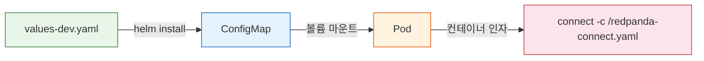
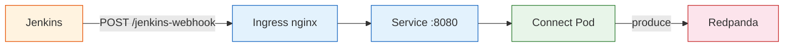

# 05. Redpanda Connect Kubernetes (Helm) 배포

> **시리즈**: `learning/07-connectors/` — Redpanda 커넥터 통합 학습
> | [01-이론](./01-source-sink-patterns.md) | [02-Redpanda Connect](./02-redpanda-connect.md) | [03-Spring Boot](./03-spring-boot-impl.md) | [04-운영](./04-operations.md) | **[05-Helm 배포](./05-helm-deployment.md)** |

---

## 학습 목표

Redpanda Connect를 Kubernetes 환경에 Helm 차트로 배포하는 방법을 이해한다. 로컬 `rpk connect run`과 K8s 배포의 차이, ConfigMap 기반 파이프라인 주입, Ingress/Service 설정, 헬스체크를 다룬다.

---

## 로컬 실행 vs K8s 배포

로컬에서는 `rpk connect run pipeline.yaml`로 실행하지만, K8s 환경에서는 **Helm 차트**를 사용한다. 핵심 차이는 파이프라인 YAML이 ConfigMap으로 변환되어 Pod에 마운트된다는 점이다.



| | 로컬 | K8s (Helm) |
|---|---|---|
| 실행 | `rpk connect run pipeline.yaml` | `helm install -f values-dev.yaml` |
| 설정 | YAML 파일 직접 편집 | values-dev.yaml → ConfigMap 변환 |
| 재시작 | 수동 (Ctrl+C → 재실행) | ConfigMap checksum 변경 → Pod 자동 재시작 |
| 스케일링 | 프로세스 수동 추가 | HPA (CPU 기반 오토스케일링) |
| 네트워크 | localhost | Service + Ingress |
| 모니터링 | curl localhost:PORT/metrics | ServiceMonitor → Prometheus |

---

## Helm 차트 구조

```
connect/                         # redpanda/connect 공식 차트
├── Chart.yaml                   # 차트 메타 (v3.1.0, appVersion 4.68.0)
├── values.yaml                  # 기본값 (수정하지 않음)
├── values-dev.yaml              # 환경별 오버라이드 ← 실제 설정
└── templates/
    ├── configmap.yaml           # config: → ConfigMap으로 변환
    ├── deployment.yaml          # Pod 스펙 + configmap checksum 어노테이션
    ├── service.yaml             # ClusterIP (메인 + 메트릭스 포트)
    ├── ingress.yaml             # 외부 접근 (nginx)
    ├── hpa.yaml                 # CPU 기반 오토스케일링
    ├── pdb.yaml                 # Pod Disruption Budget
    ├── serviceaccount.yaml      # RBAC
    └── servicemonitor.yaml      # Prometheus 스크레이핑
```

`values.yaml`은 기본값을 정의하고, `values-dev.yaml`에서 환경에 맞게 오버라이드한다. `helm install -f values-dev.yaml`로 설치하면 두 파일이 병합되어 최종 설정이 된다. ConfigMap에 checksum 어노테이션이 붙어 있어서, 설정이 바뀌면 Pod가 자동으로 재시작된다.

---

## 설정 예시 (values-dev.yaml)

```yaml
# --- 이미지 ---
image:
  repository: harbor.dev.console.trombone.okestro.cloud/trb/connect  # 사설 레지스트리
  tag: "4.80.0"

# --- 파이프라인 (ConfigMap으로 변환됨) ---
config:
  input:
    http_server:
      path: /jenkins-webhook
      address: 0.0.0.0:8080           # 웹훅 수신 포트
      allowed_verbs: [POST]

  pipeline:
    processors:
      - mapping: |
          root = this
          root.metadata.timestamp = now()
          root.metadata.source = "jenkins"

  output:
    redpanda:
      seed_brokers: ["redpanda.trb-oss.svc.cluster.local:9093"]  # K8s 내부 DNS
      topic: jenkins.events
      max_in_flight: 1

# --- 네트워크 ---
service:
  type: ClusterIP
  port: 8080                           # 메인: 웹훅 수신
  extraPorts:
    - name: metrics
      port: 4195                       # 메트릭스: Prometheus 스크레이핑
      targetPort: 4195

ingress:
  enabled: true
  className: "nginx"
  hosts:
    - host: redpanda-connect.dev.console.trombone.okestro.cloud
      paths:
        - path: /
          pathType: Prefix

# --- 리소스 제한 ---
resources:
  limits:   { cpu: 500m, memory: 256Mi }
  requests: { cpu: 100m, memory: 64Mi }
```

---

## Ingress가 필요한 경우

Ingress는 **K8s 외부에서 Connect로 요청을 보내야 할 때** 설정한다. 웹훅 수신(http_server)이 대표적인 예다.



반면 Input이 `kafka_franz`(Pull 방식)라면, Connect가 Redpanda에 **직접 연결**하므로 Ingress가 필요 없다. Ingress 필요 여부는 Input 유형으로 판단할 수 있다.

| Input 유형 | 방향 | Ingress 필요 |
|-----------|------|-------------|
| `http_server` | 외부 → Connect (Push) | 필요 |
| `kafka_franz` | Connect → Redpanda (Pull) | 불필요 |
| `sql_select` | Connect → DB (Pull) | 불필요 |
| `generate` | 내부 생성 | 불필요 |

---

## 헬스체크

Helm 차트는 기본적으로 두 가지 프로브를 설정한다.

| 프로브 | 엔드포인트 | 주기 | 역할 |
|--------|-----------|------|------|
| **readiness** | `GET /ready` | 5초 | 트래픽 수신 가능 여부. 실패 시 Service에서 제외 |
| **liveness** | `GET /ping` | 5초 | 프로세스 정상 여부. 3회 실패 시 Pod 재시작 |

readiness와 liveness를 분리하는 이유는, 파이프라인이 초기화 중일 때 트래픽은 받지 않되(readiness 실패) Pod 자체는 살려둬야(liveness 성공) 하기 때문이다.

---

## 배포 명령어

```bash
# 설치
helm install connect ./helm-charts/connect \
  -f helm-charts/connect/values-dev.yaml \
  -n trb-oss --create-namespace

# 설정 변경 후 업그레이드 (ConfigMap checksum 변경 → Pod 자동 재시작)
helm upgrade connect ./helm-charts/connect \
  -f helm-charts/connect/values-dev.yaml \
  -n trb-oss

# 상태 확인
kubectl get pods -n trb-oss -l app.kubernetes.io/name=connect
kubectl logs -n trb-oss -l app.kubernetes.io/name=connect -f
```

---

## 다음 단계

- [02-redpanda-connect.md](./02-redpanda-connect.md) — YAML 문법, Bloblang, 실습 시나리오
- [04-operations.md](./04-operations.md) — 직렬화, DLQ, 모니터링 운영
