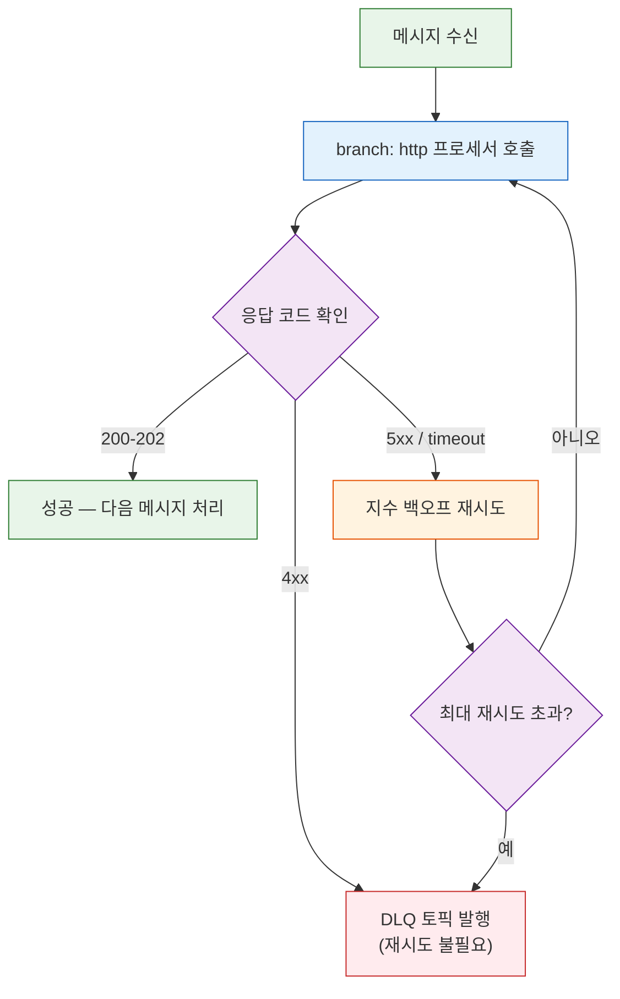
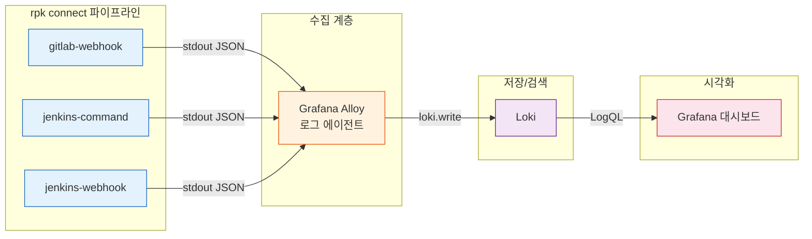
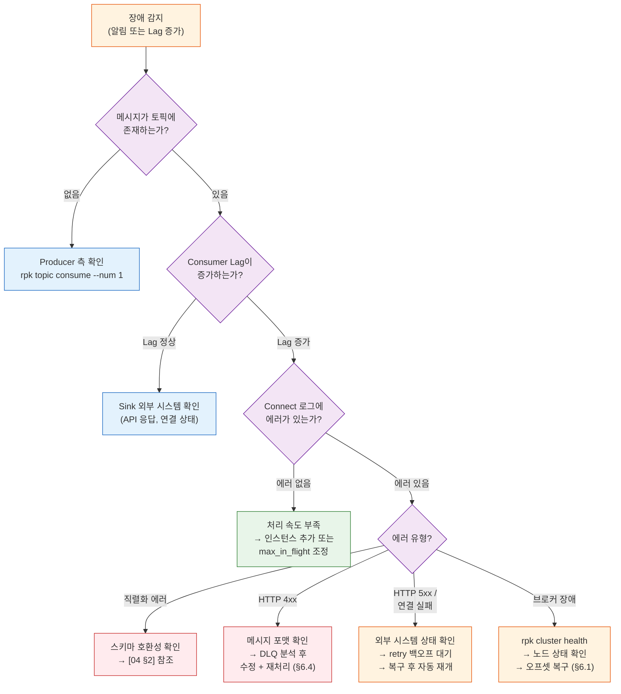
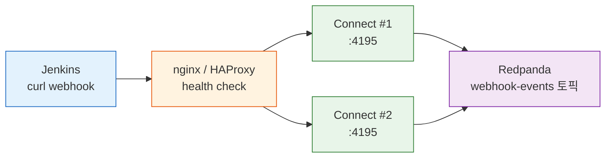
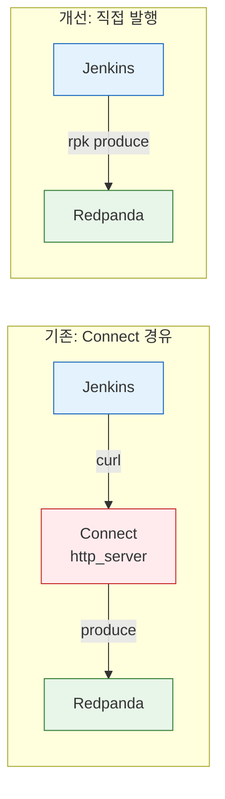

# 06. 에러 복구 — HTTP 응답 분류, 구조화 로깅, 장애 복구 런북

> **시리즈**: `learning/07-connectors/` — Redpanda 커넥터 통합 학습
> | [01-이론](./01-source-sink-patterns.md) | [02-Redpanda Connect](./02-redpanda-connect.md) | [03-Spring Boot](./03-spring-boot-impl.md) | [04-운영](./04-operations.md) | [05-Helm 배포](./05-helm-deployment.md) | **[06-에러 복구](./06-error-recovery.md)** |

커넥터 파이프라인이 정상 경로(happy path)에서 동작하는 것은 시작일 뿐이다. 프로덕션에서는 외부 API가 429를 반환하고, 브로커 노드가 재시작되고, 디스크가 꽉 차는 상황이 실제로 일어난다. [02](./02-redpanda-connect.md)에서 다룬 `retry`/`fallback`/`switch` 문법과 [04](./04-operations.md)에서 다룬 DLQ 개념은 에러 처리의 빌딩 블록이다. 이 문서는 그 블록을 조합하여 rpk connect 파이프라인의 "HTTP 응답 코드별 분기", "재시도 추적 로깅", "장애 복구 절차"라는 운영 시나리오를 구성하는 방법을 다룬다.

---

## 학습 목표

- HTTP 응답 코드(4xx/5xx)에 따라 재시도와 DLQ를 분기하는 rpk connect 파이프라인을 설계할 수 있다
- Output 래퍼(`retry`, `fallback`, `switch`)로 Output 레벨 에러를 처리하는 방법을 이해한다
- `errored()`/`error()` 함수의 동작 원리와 에러 플래그 생명주기를 파악한다
- rpk connect의 `log` 프로세서와 `fields_mapping`으로 에러 컨텍스트를 구조화 로그로 기록하는 방법을 이해한다
- Alloy + Loki + Grafana로 커넥터 로그를 수집하고 LogQL로 검색하는 파이프라인을 구성할 수 있다
- 커넥터 장애 유형별 복구 절차(런북)를 실행할 수 있다

---

## 1. `errored()` / `error()` 레퍼런스

이 문서 전체에서 사용하는 두 함수를 먼저 정리한다. `errored()`와 `error()`는 rpk connect의 Bloblang 표현식에서 메시지의 에러 상태를 검사하는 핵심 도구다.

### `errored()` — boolean

메시지가 이전 프로세서에서 에러 상태로 마킹되었는지 반환한다. rpk connect는 프로세서가 실패해도 메시지를 버리지 않고, 내부 에러 플래그를 `true`로 설정한 채 다음 프로세서로 넘긴다. `errored()`는 이 플래그를 읽는 함수다.

**에러 플래그가 설정되는 경우:**

| 프로세서 | 에러 발생 조건 |
|---------|--------------|
| `http` | `successful_on`에 포함되지 않은 HTTP 상태 코드 수신 |
| `mapping` | `throw("message")` 호출 |
| `json_parse` / `jmespath` | 파싱 실패 (잘못된 JSON 등) |
| `sql_insert` | DB 연결 실패, 제약 조건 위반 |
| 모든 프로세서 | 타임아웃, 연결 거부 등 내부 예외 |

### `error()` — string

에러 메시지 문자열을 반환한다. 에러가 없으면 빈 문자열 `""`이다.

| 실패 원인 | `error()` 반환값 |
|-----------|-----------------|
| HTTP 503 | `"request returned status 503"` |
| HTTP 429 | `"request returned status 429"` |
| HTTP 400 | `"request returned status 400"` |
| 연결 거부 | `"Post \"http://...\": dial tcp: connection refused"` |
| 타임아웃 | `"Post \"http://...\": context deadline exceeded"` |
| JSON 파싱 | `"failed to parse JSON: unexpected end of JSON input"` |
| throw() | 직접 지정한 문자열 (예: `"validation failed: missing field"`) |
| SQL 에러 | `"pq: duplicate key value violates unique constraint"` |

`error().contains("status 4")`로 분기하는 이유는, rpk connect가 HTTP 에러를 `"request returned status 4XX"` 형태의 고정 포맷 문자열로 생성하기 때문이다. 정확한 상태 코드가 필요하면 `error().contains("status 429")`처럼 전체 코드를 매칭한다.

### 주의사항

- `errored()`/`error()`는 **직전 프로세서의 결과**만 반영한다. 중간에 성공한 프로세서가 있으면 에러 플래그가 리셋된다
- `catch` 프로세서는 에러 상태인 메시지만 가로채서 처리한 뒤 에러 플래그를 **해제**한다
- Output 래퍼(`retry`, `fallback`)는 `errored()`와 무관하게 Output 자체의 반환값으로 동작한다 — 이것이 프로세서 에러 처리(§2)와 Output 에러 처리(§3)를 구분하는 이유다

---

## 2. HTTP 응답 코드 기반 에러 핸들링

외부 API를 호출하는 Sink 커넥터에서 가장 빈번한 에러는 HTTP 응답 코드로 분류된다. 핵심 원칙은 하나다: **4xx(클라이언트 에러)는 재시도해도 결과가 같으므로 즉시 DLQ로 보내고, 5xx(서버 에러)는 일시적 장애일 수 있으므로 재시도한다.**

이 구분이 없으면 400 Bad Request를 무한 재시도하며 파이프라인이 멈추거나, 503 Service Unavailable을 즉시 DLQ로 보내 복구 가능한 메시지를 버리게 된다.

### 2.1 `branch` + `http` 프로세서 + `switch` 분기

rpk connect에서 HTTP 호출 후 응답 코드별 분기를 하려면 `http` **프로세서**를 `branch` 안에서 사용해야 한다. Output의 `http_client`는 에러 시 전체 파이프라인이 멈추기 때문에 응답 코드를 검사할 수 없다. 프로세서는 메시지 단위로 `errored()` 함수와 `error()` 메타데이터를 제공하므로 세밀한 분기가 가능하다.

> `retry`/`fallback`/`switch` 문법 자체는 [02-redpanda-connect.md §3 "Output Wrapper"](./02-redpanda-connect.md)에서 다루었다. 여기서는 HTTP 응답 코드 분기에 집중한다.



아래 YAML은 이 흐름을 구현한 파이프라인이다. `successful_on`으로 성공 코드를 명시하고, 나머지는 에러로 처리한다.

```yaml
input:
  kafka_franz:
    seed_brokers: ["localhost:19092"]
    topics: ["api-sink-requests"]
    consumer_group: "http-sink-group"

pipeline:
  processors:
    # 1. HTTP 호출 (branch 안에서 프로세서로 실행)
    - branch:
        processors:
          - http:
              url: "http://external-api:8080/webhook"
              verb: POST
              successful_on: [200, 201, 202]
              timeout: 10s
              headers:
                Content-Type: application/json
        result_map: |
          root = if errored() {
            root = this
            root.meta_error = error()
          }

    # 2. 에러 여부로 분기
    - switch:
        # 에러 없음 → 정상 처리 완료, 로그만 남기고 통과
        - check: '!errored()'
          processors:
            - log:
                message: "HTTP 호출 성공"
                level: DEBUG

        # 4xx → 재시도 불필요, 즉시 DLQ
        - check: 'error().contains("status 4")'
          processors:
            - log:
                message: "4xx 에러 — DLQ 전송"
                level: WARN
                fields_mapping: |
                  root.error = error()
                  root.payload_preview = this.string()[0:100]
            - resource: "dlq_output"

        # 5xx / 기타 → 재시도 가능
        - check: 'error().contains("status 5") || errored()'
          processors:
            - log:
                message: "5xx/네트워크 에러 — 재시도 예정"
                level: ERROR
                fields_mapping: |
                  root.error = error()
                  root.attempt = meta("retry_count").or("0")
            - retry:
                max_retries: 5
                backoff:
                  initial_interval: 1s
                  max_interval: 30s
                processors:
                  - http:
                      url: "http://external-api:8080/webhook"
                      verb: POST
                      successful_on: [200, 201, 202]
                      timeout: 10s
            - catch:
                - resource: "dlq_output"

output:
  resource: "success_output"

output_resources:
  - label: success_output
    kafka_franz:
      seed_brokers: ["localhost:19092"]
      topic: "api-sink-results"

  - label: dlq_output
    kafka_franz:
      seed_brokers: ["localhost:19092"]
      topic: "dlq-api-sink"
```

`successful_on`을 명시하지 않으면 rpk connect는 2xx 전체를 성공으로 간주한다. 204 No Content 같은 응답이 성공인 경우라면 기본값으로 충분하지만, 207 Multi-Status처럼 부분 실패를 담는 코드가 있을 때는 명시적으로 열거하는 것이 안전하다.

### 2.2 429 Too Many Requests — 재시도가 유효한 4xx

429는 4xx이지만 재시도가 유효한 특수 케이스다. rpk connect에서는 `switch` 분기를 하나 더 추가하여 429를 5xx와 동일하게 재시도 경로로 보낼 수 있다.

```yaml
    # 429 → 재시도 가능 (Rate Limit)
    - check: 'error().contains("status 429")'
      processors:
        - log:
            message: "429 Rate Limited — 대기 후 재시도"
            level: WARN
            fields_mapping: |
              root.error = error()
        - sleep:
            duration: "5s"  # Retry-After 헤더 대신 고정 대기
        - retry:
            max_retries: 3
            backoff:
              initial_interval: 5s
              max_interval: 60s
            processors:
              - http:
                  url: "http://external-api:8080/webhook"
                  verb: POST
                  successful_on: [200, 201, 202]
        - catch:
            - resource: "dlq_output"
```

이 분기는 §2.1의 `switch` 블록에서 4xx 분기 **앞에** 배치해야 한다. `switch`는 첫 번째로 매칭되는 `check`를 실행하므로, 429를 먼저 잡지 않으면 일반 4xx 분기에서 DLQ로 빠진다.

---

## 3. Output 레벨 에러 처리

§2는 파이프라인 프로세서 안에서 HTTP 호출을 제어하는 방식이다. 그런데 실제 파이프라인에서는 Output 자체가 실패하는 경우도 빈번하다. Kafka 브로커 연결 끊김, HTTP Sink의 타임아웃, 파일 시스템 쓰기 실패 등이 여기에 해당한다. Output 레벨 에러는 프로세서의 `errored()`/`error()`로 잡을 수 없고, rpk connect의 **Output 래퍼**(`retry`, `fallback`, `switch`)로 처리해야 한다.

### 3.1 `retry` Output — 일시적 장애 자동 복구

Output 실패 시 가장 기본적인 대응은 `retry` 래퍼다. Output을 감싸면 발행 실패 시 지수 백오프로 자동 재시도한다.

```yaml
output:
  retry:
    max_retries: 10
    backoff:
      initial_interval: 500ms
      max_interval: 30s
    output:
      http_client:
        url: "http://external-api:8080/ingest"
        verb: POST
        timeout: 10s
```

`retry`는 Output이 에러를 반환할 때만 동작한다. HTTP 200을 받았지만 응답 본문에 에러가 있는 경우는 Output 입장에서 "성공"이므로 `retry`가 트리거되지 않는다. 이런 케이스는 §2처럼 프로세서에서 응답을 검사해야 한다.

### 3.2 `fallback` Output — 대체 경로

`retry`를 모두 소진하거나, 특정 Output이 완전히 불가용할 때 대체 Output으로 전환하는 패턴이다. `fallback`은 목록의 첫 번째 Output부터 시도하고, 실패하면 다음 Output으로 넘어간다.

```yaml
output:
  fallback:
    # 1순위: 외부 API 직접 호출
    - retry:
        max_retries: 3
        backoff:
          initial_interval: 1s
          max_interval: 10s
        output:
          http_client:
            url: "http://external-api:8080/ingest"
            verb: POST
            timeout: 10s

    # 2순위: 실패 시 DLQ 토픽으로 전환
    - kafka_franz:
        seed_brokers: ["localhost:19092"]
        topic: "dlq-api-sink"
```

이 설정은 외부 API 호출을 3회 재시도한 뒤에도 실패하면, 메시지를 DLQ 토픽에 발행한다. 메시지가 유실되지 않으면서도 파이프라인이 멈추지 않는 구성이다.

### 3.3 `switch` Output — 조건부 라우팅

메시지 내용이나 메타데이터에 따라 다른 Output으로 보내는 패턴이다. 에러 복구보다는 정상 흐름에서 라우팅에 주로 쓰이지만, "에러가 발생한 메시지만 별도 Output으로 보내기"에도 활용할 수 있다.

```yaml
output:
  switch:
    retry_until_success: false
    cases:
      # 에러 메시지 → DLQ
      - check: 'meta("has_error") == "true"'
        output:
          kafka_franz:
            seed_brokers: ["localhost:19092"]
            topic: "dlq-api-sink"

      # 정상 메시지 → 결과 토픽
      - output:
          kafka_franz:
            seed_brokers: ["localhost:19092"]
            topic: "api-sink-results"
```

`retry_until_success: false`로 설정하면, 매칭된 Output이 실패해도 다음 케이스로 넘어가지 않고 에러를 반환한다. 기본값은 `true`(매칭될 때까지 무한 재시도)이므로, DLQ 라우팅 용도에서는 `false`가 적절하다.

### 3.4 프로세서 vs Output 에러 처리 비교

| 구분 | 프로세서 (§2) | Output 래퍼 (§3) |
|------|-------------|-----------------|
| 적용 위치 | `pipeline.processors` | `output` |
| 에러 감지 | `errored()`, `error()` | Output 반환값 (자동) |
| 응답 코드 분기 | 가능 (`switch` + `check`) | 불가 (성공/실패만 구분) |
| 재시도 대상 | 개별 프로세서 | 전체 Output |
| 적합한 상황 | HTTP 응답 코드별 분기, 비즈니스 로직 에러 | 연결 실패, 타임아웃, 브로커 장애 |

**실전 조합**: 프로세서에서 HTTP 응답 코드를 분류하고, Output에서 `fallback`으로 DLQ를 구성하는 것이 가장 흔한 패턴이다. 두 레벨의 에러 처리는 상호 배타가 아니라 보완 관계다. §1에서 정리한 `errored()`/`error()` 함수는 프로세서 레벨에서만 동작하고, Output 래퍼는 이와 무관하게 Output 자체의 반환값으로 동작한다.

---

## 4. 재시도 추적과 구조화 로깅

에러를 분류하는 것만으로는 부족하다. 프로덕션에서 "왜 이 메시지가 DLQ에 갔는가?"를 추적하려면 재시도 횟수, 에러 내용, 원본 메시지 식별자가 로그에 남아야 한다. 비구조화된 텍스트 로그(`ERROR: something went wrong`)는 grep으로 찾을 수는 있지만, 집계하거나 대시보드에 연결할 수 없다. JSON 구조화 로그는 필드 단위 검색과 집계를 가능하게 하여 운영 효율을 높인다.

### 4.1 `log` 프로세서 + `fields_mapping`

rpk connect의 `log` 프로세서는 `fields_mapping`을 통해 Bloblang 표현식으로 로그 필드를 동적으로 구성할 수 있다. 단순 문자열 메시지 대신, 에러 컨텍스트를 구조화된 필드로 기록하는 것이 목표다.

> `logger` 기본 설정(level, format)은 아래 §4.2에서 다룬다. 여기서는 에러 추적에 필요한 `fields_mapping` 활용에 집중한다.

```yaml
pipeline:
  processors:
    - branch:
        processors:
          - http:
              url: "http://external-api:8080/ingest"
              verb: POST
              successful_on: [200, 201]
        result_map: 'root = this'

    - switch:
        - check: 'errored()'
          processors:
            - log:
                message: "HTTP 호출 실패 — 재시도 또는 DLQ 분기"
                level: ERROR
                fields_mapping: |
                  root.correlation_id = meta("kafka_key").or("unknown")
                  root.topic = meta("kafka_topic")
                  root.partition = meta("kafka_partition")
                  root.offset = meta("kafka_offset")
                  root.error_message = error()
                  root.timestamp = now()
                  root.payload_size = content().length()
            # 이후 retry 또는 DLQ 분기...
```

이 설정이 만드는 로그 출력은 다음과 같다.

```json
{
  "level": "ERROR",
  "message": "HTTP 호출 실패 — 재시도 또는 DLQ 분기",
  "correlation_id": "order-12345",
  "topic": "api-sink-requests",
  "partition": 2,
  "offset": 48291,
  "error_message": "request returned status 503",
  "timestamp": "2026-03-09T15:04:05Z",
  "payload_size": 1024
}
```

`correlation_id`에 Kafka 키를 사용하는 이유는, 대부분의 이벤트 기반 시스템에서 메시지 키가 비즈니스 식별자(주문 ID, 사용자 ID)를 담기 때문이다. 별도 Correlation ID 헤더가 있다면 `meta("correlation_id")`로 교체하면 된다.

### 4.2 전체 파이프라인 로거 설정

개별 `log` 프로세서 외에, 파이프라인 전체의 로거를 JSON 포맷으로 설정하면 rpk connect 자체 로그(시작, 종료, 연결 에러 등)도 구조화된다.

```yaml
logger:
  level: INFO
  format: json            # logfmt 대신 json → 필드 파싱 용이
  add_timestamp: true
  static_fields:
    service: "http-sink-pipeline"
    environment: "production"
```

`static_fields`는 모든 로그 라인에 고정 필드를 추가한다. 여러 파이프라인이 같은 로그 수집기로 들어올 때 `service` 필드로 필터링할 수 있다. `logfmt`과 `json` 중 선택 기준은 로그 수집기가 어떤 포맷을 더 잘 파싱하는가에 달려 있다 — Loki는 logfmt을 네이티브로 지원하고, Elasticsearch는 JSON이 자연스럽다.

---

## 5. 커넥터 로그 수집 아키텍처 — Loki 연계

구조화 로그를 만들었으면, 그 로그를 중앙에 수집하고 검색할 수 있어야 운영에 쓸모가 있다. 개별 Pod의 `kubectl logs`를 일일이 확인하는 것은 파이프라인이 하나일 때만 가능하고, 커넥터가 늘어나면 중앙 집중 수집이 필수다.

> 메트릭 기반 모니터링(Prometheus, Grafana, rpk 메트릭 수집)은 [04-operations.md §4 "모니터링과 트러블슈팅"](./04-operations.md)에서 다루었다. 여기서는 **로그** 수집 파이프라인만 다룬다.

메트릭은 "무엇이 얼마나 발생했는가"를 알려주고, 로그는 "구체적으로 무슨 일이 있었는가"를 알려준다. 둘은 보완 관계이며, 메트릭으로 이상을 감지한 뒤 로그로 원인을 추적하는 흐름이 일반적이다. 여기서는 Grafana Alloy를 로그 수집 에이전트로 사용한다.



**Loki vs Elasticsearch**: 선택 기준은 기존 인프라에 달려 있다. Prometheus + Grafana를 이미 사용 중이라면 Loki가 자연스럽고, 전문 검색이 필요하거나 Kibana 기반 워크플로우가 있다면 Elasticsearch(ELK)가 적합하다. 두 선택지 모두 JSON 구조화 로그를 필드 단위로 검색할 수 있다.

> **Promtail → Alloy**: Grafana Alloy는 Promtail, Grafana Agent, Agent Flow를 통합한 후속 프로젝트다. Promtail의 YAML 설정 대신 컴포넌트 기반 문법(`.alloy`)을 사용하며, 로그/메트릭/트레이스를 하나의 바이너리로 수집한다. 신규 구성에서는 Alloy를 사용하는 것이 권장된다.

Kubernetes 환경에서는 컨테이너의 stdout이 노드의 `/var/log/containers/`에 파일로 남는다. Alloy DaemonSet이 이 파일을 읽어 중앙 저장소로 전송하는 구조다. rpk connect는 stdout에 JSON을 출력하기만 하면 되므로, 로그 파일을 직접 관리할 필요가 없다.

### 5.1 Alloy 설정 — K8s 환경

K8s DaemonSet으로 Alloy를 배포하여 각 노드의 rpk connect 컨테이너 로그를 수집한다. K8s 환경에서는 컨테이너의 stdout이 노드의 `/var/log/containers/`에 파일로 남고, Alloy가 이 파일을 읽어 Loki로 전송한다.

```alloy
// alloy-config.alloy — K8s 환경

// ① K8s Pod 디스커버리
discovery.kubernetes "pods" {
  role = "pod"
}

// ② rpk connect Pod만 필터링 + 레이블 추가
discovery.relabel "rpk_connect" {
  targets = discovery.kubernetes.pods.targets

  rule {
    source_labels = ["__meta_kubernetes_pod_label_app"]
    regex         = "rpk-connect-.*"
    action        = "keep"
  }
  rule {
    source_labels = ["__meta_kubernetes_pod_name"]
    target_label  = "pod"
  }
  rule {
    source_labels = ["__meta_kubernetes_namespace"]
    target_label  = "namespace"
  }
}

// ③ K8s Pod 로그 수집
loki.source.kubernetes "rpk_connect" {
  targets    = discovery.relabel.rpk_connect.output
  forward_to = [loki.process.rpk_connect.receiver]
}

// ④ JSON 파싱 → 필드를 Loki 레이블로 추출
loki.process "rpk_connect" {
  stage.json {
    expressions = {
      level   = "level",
      service = "service",
    }
  }
  stage.labels {
    values = {
      level   = "",
      service = "",
    }
  }
  forward_to = [loki.write.default.receiver]
}

// ⑤ Loki로 전송
loki.write "default" {
  endpoint {
    url = "http://loki:3100/loki/api/v1/push"
  }
}
```

`stage.json` → `stage.labels`에서 JSON 로그의 `service`, `level` 필드를 Loki 레이블로 추출하는 것이 핵심이다. §4.2의 `static_fields.service`가 여기서 레이블로 변환되어, Grafana에서 `{service="connect-jenkins-webhook", level="ERROR"}`로 필터링할 수 있게 된다.

Alloy의 컴포넌트 모델은 `forward_to`로 데이터 흐름을 명시적으로 연결한다. Promtail의 암묵적 파이프라인과 달리, 어떤 컴포넌트가 어디로 데이터를 보내는지 설정 파일만 보고 파악할 수 있다.

### 5.2 Alloy 설정 — 로컬(비K8s) 환경

K8s 없이 `rpk connect run`으로 직접 실행하는 경우, stdout을 파일로 리다이렉트하고 Alloy가 파일을 수집하는 패턴을 쓴다.

```bash
rpk connect run pipeline.yaml 2>&1 | tee -a /var/log/rpk-connect/jenkins-webhook.log
```

```alloy
// alloy-config.alloy — 로컬(파일 기반) 환경

// ① 로그 파일 경로 매칭
local.file_match "rpk_connect" {
  path_targets = [{
    __path__ = "/var/log/rpk-connect/*.log",
    job      = "rpk-connect",
  }]
}

// ② 파일 읽기
loki.source.file "rpk_connect" {
  targets    = local.file_match.rpk_connect.targets
  forward_to = [loki.process.rpk_connect.receiver]
}

// ③ JSON 파싱 + 레이블 추출
loki.process "rpk_connect" {
  stage.json {
    expressions = {
      level   = "level",
      service = "service",
    }
  }
  stage.labels {
    values = {
      level   = "",
      service = "",
    }
  }
  forward_to = [loki.write.default.receiver]
}

// ④ Loki로 전송
loki.write "default" {
  endpoint {
    url = "http://loki:3100/loki/api/v1/push"
  }
}
```

### 5.3 Loki 최소 설정

```yaml
# loki-config.yaml
auth_enabled: false

server:
  http_listen_port: 3100

common:
  ring:
    kvstore:
      store: inmemory
    replication_factor: 1
  path_prefix: /loki

schema_config:
  configs:
    - from: 2024-01-01
      store: tsdb
      object_store: filesystem
      schema: v13
      index:
        prefix: index_
        period: 24h

storage_config:
  filesystem:
    directory: /loki/chunks
```

### 5.4 Docker Compose 통합

로컬 개발 환경에서 Loki + Alloy + Grafana를 한번에 띄우는 설정이다.

```yaml
# docker-compose.monitoring.yml
services:
  loki:
    image: grafana/loki:3.4.2
    ports:
      - "3100:3100"
    volumes:
      - ./loki-config.yaml:/etc/loki/config.yaml
      - loki-data:/loki
    command: -config.file=/etc/loki/config.yaml

  alloy:
    image: grafana/alloy:v1.8.1
    volumes:
      - ./alloy-config.alloy:/etc/alloy/config.alloy
      - /var/log:/var/log
      - /var/lib/docker/containers:/var/lib/docker/containers:ro
    command:
      - run
      - /etc/alloy/config.alloy
      - --stability.level=generally-available

  grafana:
    image: grafana/grafana:11.6.0
    ports:
      - "3000:3000"
    environment:
      - GF_AUTH_ANONYMOUS_ENABLED=true
    volumes:
      - grafana-data:/var/grafana

volumes:
  loki-data:
  grafana-data:
```

### 5.5 Grafana LogQL 검색 예시

Loki에 수집된 rpk connect 로그를 Grafana에서 검색하는 LogQL 예시다.

```
# 특정 파이프라인의 에러 로그만 조회
{service="connect-jenkins-command"} |= "ERROR"

# correlation_id로 특정 메시지 추적
{service=~"connect-.*"} | json | correlation_id = "order-12345"

# 최근 1시간 에러 카운트 (파이프라인별)
sum by (service) (
  count_over_time({service=~"connect-.*"} |= "ERROR" [1h])
)
```

`static_fields.service`를 파이프라인별로 다르게 설정해둔 덕분에 `service` 레이블로 필터링이 가능하다. §4.2에서 `static_fields`를 강조한 이유이며, §5.1~5.2의 Alloy `stage.labels`에서 이 값이 Loki 레이블로 변환된다.

```logql
# DLQ 전송 로그만
{service=~"connect-.*"} |= "DLQ"

# 에러 메시지별 Top 5 (최근 24시간)
topk(5,
  sum by (error_message) (
    count_over_time({service=~"connect-.*"} | json | level="ERROR" [24h])
  )
)
```

---

## 6. 커넥터 장애 복구 런북

이 섹션은 프로덕션에서 자주 발생하는 장애 시나리오별 복구 절차를 정리한 런북(Runbook)이다. 각 시나리오는 "증상 → 진단 → 조치" 순서로 구성되어 있다.

### 6.1 Pod 재시작 → 오프셋 복구 (at-least-once 검증)

Kafka Consumer(rpk connect 포함)가 재시작되면 마지막으로 커밋한 오프셋부터 다시 읽는다. 이것이 at-least-once 보장의 기본 동작이다. 확인해야 할 것은 "재시작 전후로 오프셋이 정상적으로 이어지는가"이다.

**진단 절차:**

```bash
# 1. 재시작 전 — 현재 오프셋 기록
rpk group describe http-sink-group

# 출력 예시:
# GROUP           TOPIC              PARTITION  CURRENT-OFFSET  LOG-END-OFFSET  LAG
# http-sink-group api-sink-requests  0          1523            1530            7
# http-sink-group api-sink-requests  1          2041            2041            0

# 2. Pod 재시작 후 — 오프셋 비교
rpk group describe http-sink-group

# 기대: CURRENT-OFFSET이 재시작 전 값과 같거나 약간 작음 (미커밋분)
# 이상: CURRENT-OFFSET이 0 또는 LOG-END-OFFSET으로 점프 → auto.offset.reset 설정 확인
```

`CURRENT-OFFSET`이 재시작 전보다 작아졌다면 일부 메시지가 중복 처리될 수 있다. 이는 at-least-once의 정상 동작이며, Sink 측에서 멱등성을 보장하면 문제가 되지 않는다. 0으로 리셋된 경우에는 Consumer Group ID가 변경되었거나, 오프셋 보존 기간(`offsets.retention.minutes`, 기본 7일)이 초과된 것이다.

### 6.2 Consumer Group 오프셋 리셋

장애 복구나 데이터 재처리를 위해 오프셋을 수동 리셋해야 할 때가 있다. `rpk group seek` 명령어로 Consumer Group의 오프셋을 원하는 위치로 이동할 수 있다.

> 오프셋 리셋은 메시지 중복 처리를 유발할 수 있으므로, Sink 측 멱등성이 보장되는 상태에서만 실행해야 한다.

```bash
# 컨슈머 중지 후 실행 (활성 컨슈머가 있으면 리셋 불가)

# 가장 처음부터 재처리
rpk group seek http-sink-group --to earliest

# 특정 시각 이후부터 재처리 (ISO 8601)
rpk group seek http-sink-group --to 2026-03-09T10:00:00+09:00

# 특정 파티션의 특정 오프셋으로 이동
rpk group seek http-sink-group \
  --topics api-sink-requests \
  --partitions 0:1500,1:2000
```

리셋 후 컨슈머를 재시작하면 지정한 위치부터 다시 메시지를 읽기 시작한다. `rpk group describe`로 리셋 결과를 확인한 뒤 재시작하는 것이 안전하다.

### 6.3 브로커 장애 → 무한 재시도 + 백프레셔

브로커가 장시간 불가용하면 커넥터 파이프라인이 메시지를 발행할 수 없다. rpk connect의 `retry` output은 자체적으로 백프레셔를 제공하므로, `max_retries: 0`(무한)과 `max_interval`을 조합하면 브로커가 복구될 때까지 점진적으로 대기하는 동작을 구성할 수 있다.

```yaml
output:
  retry:
    max_retries: 0  # 무한 재시도
    backoff:
      initial_interval: 500ms
      max_interval: 60s   # 최대 1분 간격
      max_elapsed_time: 0  # 시간 제한 없음
    output:
      kafka_franz:
        seed_brokers: ["localhost:19092"]
        topic: "target-topic"
```

이 설정은 브로커가 다운되면 500ms → 1s → 2s → ... → 60s 간격으로 재시도하며, 브로커가 복구되면 자동으로 정상 처리를 재개한다. 파이프라인이 중단되지 않고 자연스럽게 복구되므로, rpk connect에서는 별도 Circuit Breaker 라이브러리가 필요하지 않다.

단, 무한 재시도는 **브로커 장애**처럼 "기다리면 복구되는" 상황에 적합하다. 외부 API 호출(§2)에서는 `max_retries`를 유한하게 설정하고, 초과 시 DLQ로 보내는 것이 올바르다. 상황에 따라 재시도 전략을 달리 적용해야 한다.

### 6.4 DLQ 백로그 일괄 재처리

DLQ에 쌓인 메시지를 수정 후 원본 토픽으로 재발행하는 패턴이다.

> rpk 명령어로 **단건** 재발행하는 절차는 [04-operations.md §3 "에러 핸들링과 Dead Letter Queue"](./04-operations.md)에서 다루었다. 여기서는 **일괄 재처리** 파이프라인을 다룬다.

DLQ 메시지가 수십~수백 건 쌓였을 때 하나씩 `rpk topic produce`하는 것은 비현실적이다. rpk connect 파이프라인을 일회성으로 실행하여 DLQ → 원본 토픽으로 일괄 재발행할 수 있다.

```yaml
# dlq-reprocess.yaml — 일회성 실행 파이프라인
input:
  kafka_franz:
    seed_brokers: ["localhost:19092"]
    topics: ["dlq-api-sink"]
    consumer_group: "dlq-reprocess"
    start_from_oldest: true

pipeline:
  processors:
    # DLQ 헤더에서 에러 정보 로깅
    - log:
        message: "DLQ 메시지 재처리"
        level: INFO
        fields_mapping: |
          root.original_topic = meta("kafka_topic")
          root.original_offset = meta("kafka_offset")
          root.error_header = meta("__connect.errors.exception.message").or("N/A")

    # 필요 시 메시지 변환 (스키마 변경, 필드 수정 등)
    # - mapping: |
    #     root = this
    #     root.fixed_field = "corrected_value"

output:
  kafka_franz:
    seed_brokers: ["localhost:19092"]
    topic: "api-sink-requests"  # 원본 토픽
```

실행 방법:

```bash
# 일회성 실행 — 모든 DLQ 메시지를 소비하면 자동 종료되지 않으므로
# 메시지 수를 확인 후 실행하고, 처리 완료 후 Ctrl+C로 중단
rpk topic describe dlq-api-sink --print-watermarks  # 메시지 수 확인
rpk connect run dlq-reprocess.yaml                   # 파이프라인 실행
rpk group describe dlq-reprocess                     # 처리 진행 확인
```

재처리 전 원본 에러 원인이 해결되었는지 반드시 확인해야 한다. 외부 API 스키마가 변경되어 400 에러가 발생한 경우라면, 메시지 포맷을 수정하는 `mapping` 프로세서를 추가하거나, Sink 서비스를 수정한 뒤 재처리해야 한다.

### 6.5 복구 의사결정 흐름도

장애가 발생했을 때 어떤 순서로 진단하고 조치할지를 흐름도로 정리했다.



이 흐름도는 [04-operations.md §4.4 "트러블슈팅 흐름도"](./04-operations.md)의 일반적인 진단 흐름을 확장한 것이다. 04에서는 "메시지가 있는가 → Lag이 있는가 → 로그를 봐라"까지 다루었다면, 이 문서는 "로그에서 에러를 발견한 뒤 에러 유형별로 어떻게 조치하는가"를 다룬다.

### 6.6 `dedupe` 프로세서의 at-least-once 보장 파괴 경고

`dedupe` 프로세서는 distributed cache(Redis 등)에 메시지 시그니처를 저장하여 중복 메시지를 제거한다. 직관적으로 "중복 제거 = 데이터 품질 향상"처럼 보이지만, 공식 문서는 다음과 같이 경고한다.

> *"Performing deduplication on a stream using a distributed cache voids any at-least-once guarantees that it previously had"*

at-least-once가 파괴되는 메커니즘은 다음과 같다. `dedupe` 프로세서가 메시지 시그니처를 캐시에 기록한 뒤, Output이 실패하면 rpk connect는 해당 메시지를 재처리 대상으로 표시한다. 그런데 재시작 후 같은 메시지가 다시 들어오면, 캐시에 이미 기록된 시그니처와 일치하므로 `dedupe`가 이를 "중복"으로 판단하여 건너뛴다. 결과적으로 메시지가 Output에 단 한 번도 도달하지 못한 채 유실된다.

공식 문서 원문:

> *"This is because the cache will preserve message signatures even if the message fails to leave the Redpanda Connect pipeline, which would cause message loss in the event of an outage at the output sink followed by a restart"*

정리하면, `dedupe`는 "Output 성공 후 중복 재처리 방지"가 아니라 "캐시 등록 후 중복 방지"로 동작하기 때문에, Output 실패 + 재시작 조합에서 메시지 유실이 발생한다. §6.1에서 확인한 at-least-once 재처리 흐름과 정면으로 충돌하는 지점이다.

**결론: `dedupe` 프로세서를 중복 제거의 유일한 수단으로 사용하지 말 것.** 커넥터의 `dedupe`는 보조 필터로만 활용하고, 실제 중복 제거는 업무 레벨 멱등성으로 설계해야 한다.

| 방법 | 구현 예시 | 특징 |
|------|-----------|------|
| Idempotency Key | `INSERT ... ON CONFLICT DO NOTHING` | DB 레벨 보장 |
| Upsert | `MERGE INTO`, `REPLACE INTO` | 최신 값으로 덮어쓰기 |
| Unique Constraint | DB 유니크 인덱스 | 스키마 레벨 강제 |
| 이벤트 ID 검사 | 처리 전 `processed_events` 테이블 조회 | 세밀한 제어 가능 |

업무 레벨 멱등성 설계에 대한 상세 내용은 Spring Boot 구현 관점에서 다룬 [`03-spring-boot-integration/06-idempotent-consumer.md`](../03-spring-boot-integration/06-idempotent-consumer.md)를 참조한다.

### 6.5.1 멱등성 키 선택 — 복합 키 vs 범용 키

이벤트 ID 검사 방식에서 어떤 값을 멱등성 키로 쓸지에 따라 커버 범위가 달라진다.

**복합 키 `(correlationId, eventType)`**: correlationId는 하나의 비즈니스 흐름(예: 파이프라인 실행 1회)을 관통하는 추적 ID이므로, 같은 흐름에서 여러 이벤트 타입이 발생할 때 eventType을 합쳐야 구분된다. 문제는 **같은 타입의 이벤트가 한 흐름에서 여러 번 발생하면** (예: STEP_CHANGED가 스텝마다 발생) 첫 번째 이후가 전부 중복으로 무시된다는 점이다. 이를 해결하려면 stepOrder 같은 추가 컬럼을 계속 붙여야 하므로 키 설계가 이벤트 구조에 종속된다.

**범용 키 `eventId`(Outbox PK)**: Transactional Outbox 패턴에서 발행하는 모든 메시지는 outbox 테이블의 auto-increment PK를 가진다. 이 값을 CloudEvents `ce_id` 헤더로 전달하면 컨슈머는 이벤트 구조를 몰라도 단일 컬럼으로 중복 검사가 가능하다. 이벤트 타입이 반복되든, 새로운 이벤트가 추가되든 멱등성 로직을 수정할 필요가 없다.

```sql
-- 범용 키 테이블
CREATE TABLE processed_event (
    event_id VARCHAR(100) NOT NULL PRIMARY KEY,
    processed_at TIMESTAMP NOT NULL DEFAULT NOW()
);

-- 컨슈머 멱등성 검사
SELECT EXISTS(SELECT 1 FROM processed_event WHERE event_id = #{eventId});
INSERT INTO processed_event (event_id, processed_at) VALUES (#{eventId}, NOW())
ON CONFLICT (event_id) DO NOTHING;
```

Outbox 패턴을 사용한다면 범용 키 방식이 단순하고 안전하다. 복합 키는 Outbox 없이 이벤트 ID가 보장되지 않는 환경에서의 차선책이다.

---

## 7. Connect 고가용성과 Webhook 신뢰성

§6까지는 메시지가 Connect에 정상 도달한 뒤의 에러 처리를 다뤘다. 이 섹션은 그 이전 단계, 즉 **외부 시스템의 webhook이 Connect에 도달하지 못하는 상황**을 다룬다. Break-and-Resume 패턴([05-break-and-resume.md](../../project/redpanda-playground/docs/patterns/05-break-and-resume.md))에서 Jenkins가 빌드 완료 후 Connect로 webhook을 보내는 구간이 대표적 사례다.

### 7.1 HTTP→Kafka at-most-once 갭

Connect의 `http_server` input은 HTTP 요청을 수신하여 Kafka로 발행한다. 문제는 이 변환 과정이 **at-most-once**라는 점이다. HTTP 요청 수신 → Kafka 발행 사이에 Connect가 죽으면 메시지가 유실된다.

```
Jenkins curl → [HTTP 수신] → [Kafka 발행] → ack(200)
                    ↑              ↑
                    A              B
```

| 장애 시점 | 결과 | Jenkins 인지 |
|-----------|------|-------------|
| A 이전 (Connect 다운) | connection refused | curl 실패로 인지 가능 |
| A~B 사이 (수신 후 발행 전 죽음) | **메시지 유실** | 타임아웃으로 인지, 그러나 재전송해도 이미 수신된 줄 모름 |
| B 이후 (발행 성공, ack 전 죽음) | Kafka에는 존재, Jenkins는 실패로 인지 | curl 타임아웃 → 재전송 → 중복 가능 |

A~B 구간이 핵심이다. Connect는 WAL(Write-Ahead Log)이 없으므로 HTTP 수신과 Kafka 발행 사이의 원자성을 보장하지 못한다. `http_server`는 Kafka 발행 성공 후에 200을 반환하지만, 발행 직전에 프로세스가 죽으면 메시지가 사라진다.

### 7.2 Connect 다중 인스턴스 + 로드밸런서

Connect는 stateless이므로 수평 확장이 단순하다. 여러 인스턴스를 띄우고 로드밸런서로 묶으면 단일 인스턴스 장애에 대한 가용성이 높아진다.



```yaml
# nginx.conf 예시
upstream connect {
    server connect-1:4195;
    server connect-2:4195;
}

server {
    listen 4195;
    location /webhook {
        proxy_pass http://connect;
        proxy_next_upstream error timeout http_502;  # 실패 시 다음 인스턴스로
    }
}
```

`proxy_next_upstream`이 핵심이다. Connect #1이 502를 반환하거나 타임아웃되면 nginx가 자동으로 Connect #2로 재시도한다. Jenkins 입장에서는 단일 엔드포인트로 보인다.

**한계**: §7.1의 A~B 구간 문제는 다중 인스턴스로 해결되지 않는다. 인스턴스가 요청을 수신한 뒤 Kafka 발행 전에 죽으면 nginx는 이미 해당 인스턴스에 요청을 전달했으므로 재라우팅이 불가능하다. 가용성은 높아지지만 at-most-once 갭은 여전하다.

### 7.3 rpk 직접 발행 — Connect 우회

at-most-once 갭을 근본적으로 제거하려면 HTTP→Kafka 변환 레이어 자체를 없애면 된다. Jenkins가 Kafka에 직접 메시지를 발행하면 브로커 ack를 받는 순간 메시지 보존이 보장된다.



**Jenkins에 rpk 설치 방법:**

rpk는 의존성 없는 단일 바이너리(~30MB)다. Jenkins Agent 이미지에 추가하면 된다.

```dockerfile
# Jenkins Agent Dockerfile
RUN curl -LO https://github.com/redpanda-data/redpanda/releases/latest/download/rpk-linux-amd64.zip \
    && unzip rpk-linux-amd64.zip -d /usr/local/bin/ \
    && rm rpk-linux-amd64.zip
```

Docker Compose 환경에서는 Redpanda 컨테이너의 rpk를 직접 호출할 수도 있다.

```groovy
// Jenkinsfile — rpk 직접 발행
post {
    always {
        script {
            def result = currentBuild.result ?: 'SUCCESS'
            def payload = """{"executionId":"${params.EXECUTION_ID}","stepOrder":${params.STEP_ORDER},"result":"${result}"}"""

            // 방법 1: Jenkins Agent에 rpk 설치된 경우
            sh "echo '${payload}' | rpk topic produce webhook-events --brokers redpanda:9092"

            // 방법 2: Docker Compose에서 Redpanda 컨테이너의 rpk 사용
            // sh "docker exec redpanda rpk topic produce webhook-events <<< '${payload}'"
        }
    }
}
```

rpk produce는 브로커로부터 ack를 받아야 성공으로 반환한다. 브로커가 다운되면 즉시 에러가 나므로 Jenkins의 `retry` 블록으로 처리할 수 있다.

**트레이드오프:**

| 항목 | Connect 경유 | rpk 직접 발행 |
|------|-------------|--------------|
| 전달 보장 | at-most-once (HTTP→Kafka 갭) | at-least-once (브로커 ack) |
| 장애 포인트 | Jenkins → Connect → Redpanda (3개) | Jenkins → Redpanda (2개) |
| Jenkins 의존성 | curl만 필요 | rpk 바이너리 설치 필요 |
| 메시지 변환 | Connect 파이프라인에서 Bloblang 변환 가능 | Jenkinsfile에서 직접 JSON 구성 |
| 운영 복잡도 | Connect 설정/모니터링 필요 | 줄어듦 (Connect 불필요) |

단순 webhook 전달 용도라면 rpk 직접 발행이 낫다. 메시지 변환, 라우팅, 필터링이 필요하면 Connect가 여전히 유용하다.

### 7.4 Connect 장애 시 기록과 진단

Connect가 죽는 경우 유형별로 남는 기록이 다르다.

| 장애 유형 | Connect 로그 | Jenkins 로그 | Kafka | 진단 방법 |
|-----------|-------------|-------------|-------|----------|
| 수신 전 다운 | 없음 (프로세스 없음) | `curl: connection refused` | 없음 | Jenkins 빌드 로그 확인 |
| 수신 후 발행 전 죽음 | 비정상 종료 로그 (SIGKILL이면 없음) | `curl: timeout` | 없음 | Container 재시작 이력 (`docker inspect`, `kubectl describe pod`) |
| 발행 후 ack 전 죽음 | 비정상 종료 로그 | `curl: timeout` | **메시지 존재** | `rpk topic consume webhook-events --num 1` |

**Docker 환경에서 Connect 재시작 이력 확인:**

```bash
# 재시작 횟수와 마지막 종료 시각
docker inspect --format='{{.RestartCount}} {{.State.FinishedAt}}' redpanda-connect

# OOMKill 여부 (메모리 부족으로 죽은 경우)
docker inspect --format='{{.State.OOMKilled}}' redpanda-connect

# 최근 로그 (죽기 직전)
docker logs --tail 50 redpanda-connect
```

**Kubernetes 환경:**

```bash
# Pod 재시작 횟수
kubectl get pod -l app=rpk-connect -o jsonpath='{.items[*].status.containerStatuses[*].restartCount}'

# 마지막 종료 사유
kubectl describe pod rpk-connect-0 | grep -A5 "Last State"
```

§5의 Alloy + Loki 파이프라인이 구성되어 있다면, Connect 종료 직전 로그가 Loki에 남아 있을 수 있다. SIGKILL이 아닌 정상 종료(SIGTERM)라면 rpk connect가 graceful shutdown 로그를 남긴다.

### 7.5 Playground 프로젝트에서의 적용

현재 redpanda-playground 프로젝트의 파이프라인은 Jenkins 빌드/배포 완료 시 Connect 경유로 webhook을 수신한다. 이 구간에서 위 문제가 실제로 발생할 수 있다.

**현재 구조와 보호 장치:**

```
Jenkins → curl → Redpanda Connect(http_server) → webhook-events 토픽
                                                         ↓
                              WebhookEventConsumer → PipelineEngine.resumeAfterWebhook()
```

- **WebhookTimeoutChecker**: 5분 이상 WAITING_WEBHOOK 상태인 스텝을 자동 FAILED 처리 → SAGA 보상 실행. webhook이 유실되어도 데이터 정합성은 유지된다.
- **CAS(Compare-And-Swap)**: `resumeAfterWebhook()`과 타임아웃 체커가 동시에 실행될 때 `updateStatusIfCurrent`로 중복 처리를 방지한다. 늦게 도착한 webhook은 무시된다.

**개선 방향:**

현재 학습 환경에서는 WebhookTimeoutChecker가 충분한 안전망이지만, 프로덕션 적용 시 다음 순서로 강화할 수 있다.

1. **Jenkins curl 재시도** (즉시 적용 가능): Jenkinsfile의 `post` 블록에 `--retry 3 --retry-delay 5` 추가. Connect 일시 다운을 커버한다.
2. **rpk 직접 발행으로 전환** (§7.3): Connect 의존성을 제거하여 at-least-once를 보장한다. Jenkins Agent에 rpk 바이너리만 추가하면 된다.
3. **Connect 다중 인스턴스** (§7.2): rpk 전환이 어려운 환경에서 가용성을 높이는 차선책이다.

---

## 핵심 요약

| 주제 | rpk connect 구현 | 섹션 |
|------|-----------------|------|
| `errored()` / `error()` | 에러 플래그 boolean / 에러 메시지 string | §1 |
| HTTP 에러 분류 | `branch` + `http` 프로세서 + `switch` | §2 |
| 4xx 처리 | `error().contains("status 4")` → 즉시 DLQ | §2 |
| 429 처리 | `sleep` + `retry` (Rate Limit 대응) | §2.2 |
| 5xx 처리 | `retry` + `catch` → DLQ | §2 |
| Output 레벨 에러 | `retry` / `fallback` / `switch` Output 래퍼 | §3 |
| 프로세서 vs Output | 응답 코드 분기 → 프로세서, 연결 실패 → Output 래퍼 | §3.4 |
| 구조화 로깅 | `log` + `fields_mapping` + `static_fields` | §4 |
| 로그 수집 | Alloy → Loki → Grafana (LogQL 검색) | §5 |
| 브로커 장애 | `retry` + `max_interval` (내장 백프레셔) | §6.3 |
| DLQ 일괄 재처리 | 별도 rpk connect 파이프라인 | §6.4 |
| HTTP→Kafka 갭 | at-most-once (WAL 없음, A~B 구간 유실 가능) | §7.1 |
| Connect HA | 다중 인스턴스 + nginx `proxy_next_upstream` | §7.2 |
| rpk 직접 발행 | Connect 우회, 브로커 ack로 at-least-once 보장 | §7.3 |
| Connect 장애 진단 | 장애 유형별 로그 위치와 `docker inspect` 확인 | §7.4 |

**기억할 것 일곱 가지:**
1. 4xx와 5xx를 구분하지 않으면 파이프라인이 멈추거나 복구 가능한 메시지를 잃는다
2. 프로세서 에러(`errored()`)와 Output 에러(래퍼)는 별개 레이어다 — 둘 다 구성해야 빈틈이 없다
3. `errored()`/`error()`는 직전 프로세서의 결과만 반영한다 — 중간에 성공하면 리셋된다
4. 구조화 로그 없이는 "왜 DLQ에 갔는가"를 추적할 수 없다
5. 장애 복구는 절차가 정해져 있을 때만 빠르게 실행할 수 있다 — 런북이 필요한 이유다
6. Connect의 HTTP→Kafka 변환은 at-most-once다 — 수신과 발행 사이에 원자성이 없으므로 webhook 유실 가능성이 존재한다
7. rpk 직접 발행은 중간 레이어를 제거하여 at-least-once를 보장한다 — 단순 webhook 전달에는 Connect보다 낫다

---

## 참고 자료

- [02-redpanda-connect.md §3 — Output Wrapper (retry/fallback/switch)](./02-redpanda-connect.md)
- [04-operations.md §3 — DLQ 개념과 rpk 재처리](./04-operations.md)
- [04-operations.md §4 — 모니터링과 트러블슈팅](./04-operations.md)
- [Redpanda Connect — HTTP Processor](https://docs.redpanda.com/redpanda-connect/components/processors/http/)
- [Redpanda Connect — Log Processor](https://docs.redpanda.com/redpanda-connect/components/processors/log/)
- [Redpanda Connect — Retry Output](https://docs.redpanda.com/redpanda-connect/components/outputs/retry/)
