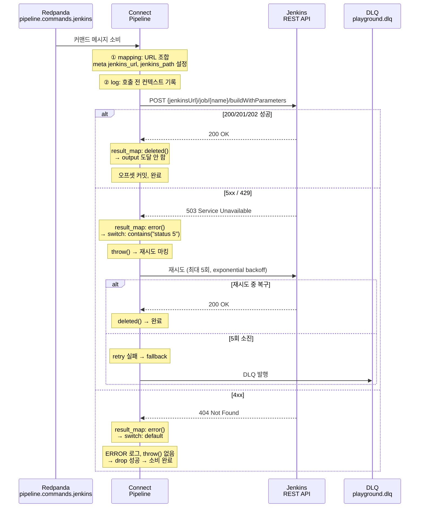
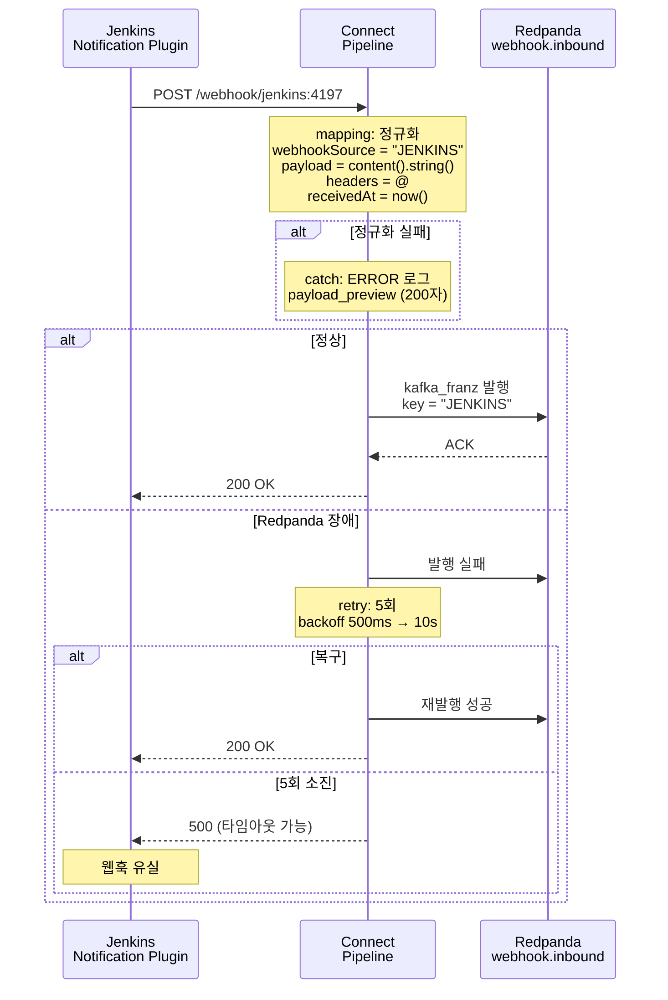
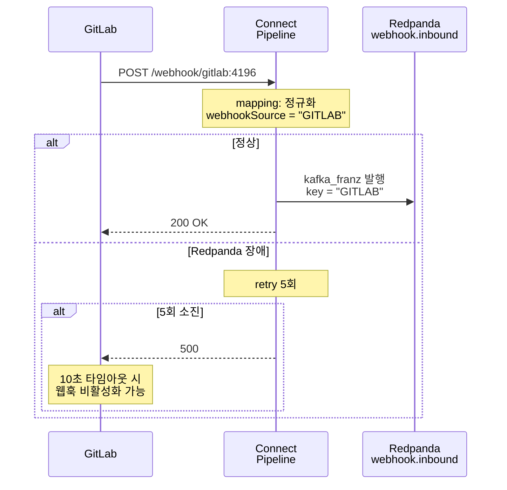
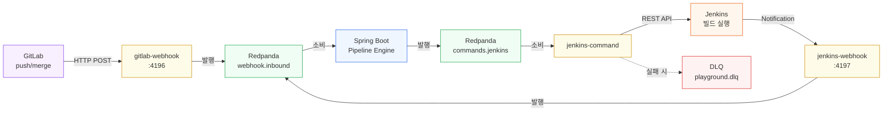

# 07. Playground 커넥터 실무 해설 — Bloblang 문법, 호출 흐름, 에러 전략

> **시리즈**: `learning/07-connectors/` — Redpanda 커넥터 통합 학습
> | [01-이론](./01-source-sink-patterns.md) | [02-Redpanda Connect](./02-redpanda-connect.md) | [03-Spring Boot](./03-spring-boot-impl.md) | [04-운영](./04-operations.md) | [05-Helm 배포](./05-helm-deployment.md) | [06-에러 복구](./06-error-recovery.md) | **[07-Playground 커넥터](./07-playground-connectors.md)** |

Playground 프로젝트에는 3개의 Redpanda Connect 파이프라인과 1개의 전역 관측성 설정이 있다. GitLab/Jenkins 웹훅을 Redpanda로 브릿지하는 인바운드 2개, Redpanda 토픽에서 Jenkins REST API를 호출하는 아웃바운드 1개, 그리고 로깅/메트릭/트레이싱을 통합 관리하는 `observability.yaml`이다. 이 문서는 실제 YAML 코드를 기준으로 Bloblang 문법, 메시지 흐름, 에러 처리 전략을 해설한다.

---

## 학습 목표

- Playground 커넥터에서 사용된 Bloblang 문법을 이해한다
- 4개 YAML 파일의 역할과 상호 관계를 파악한다
- output 래퍼(`retry`, `fallback`, `drop`)의 동작 원리를 이해한다
- 장애 시나리오별로 메시지가 어떤 경로를 타는지 추적한다
- local과 server-1 배포 간 차이(인증 모델, 컨슈머 그룹)를 이해한다

---

## 1. Bloblang 문법 레퍼런스

[02-redpanda-connect.md](./02-redpanda-connect.md)에서 Bloblang 기본 문법을 다뤘다. 여기서는 Playground 커넥터에서 **실제로 사용된** 문법만 정리한다.

### 1.1 핵심 키워드

| 문법 | 의미 | 커넥터 사용 예 |
|------|------|---------------|
| `this` | 현재 메시지 payload (JSON root) | `this.jobName`, `this.executionId` |
| `root` | 출력 메시지 (쓰기 대상) | `root.webhookSource = "GITLAB"` |
| `root = ""` | 출력을 빈 문자열로 설정 | jenkins-command: HTTP body를 비움 |

`this`는 읽기 전용이고, `root`는 쓰기 대상이다. `root = ""`로 설정하면 입력 메시지 전체가 빈 문자열로 교체된다. Jenkins의 `buildWithParameters`는 쿼리스트링으로 파라미터를 받으므로, 요청 본문을 비우는 용도로 쓴다.

### 1.2 메타데이터

| 문법 | 의미 | 커넥터 사용 예 |
|------|------|---------------|
| `meta("key")` | 메타데이터 읽기 | `meta("execution_id")` |
| `meta key = val` | 메타데이터 쓰기 | `meta jenkins_path = "/job/..."` |
| `@` | 전체 메타데이터 맵 | `root.headers = @` (웹훅 HTTP 헤더 보존) |

`this`와 `meta`를 구분해서 보면 이해가 쉽다.

- `this`: 현재 메시지의 **payload 본문**(JSON)
- `meta`: 메시지의 **metadata 컨텍스트**(주로 헤더 매핑 + 파이프라인 중간 계산값)

즉, `meta`는 "원본 헤더만"을 뜻하지 않는다. 입력 단계에서 들어온 헤더가 metadata로 보존될 수 있고, 이후 프로세서에서 `meta key = val`로 계산한 값을 추가해 다음 단계로 전달할 수도 있다.

예시(개념):

```blobl
# payload에서 읽기
let execId = this.executionId

# metadata에 중간값 저장(원본 헤더가 아니어도 가능)
meta jenkins_url = this.jenkinsUrl
meta jenkins_path = "/job/%s/buildWithParameters".format(this.jobName)

# 이후 단계에서 metadata 재사용
root.callUrl = meta("jenkins_url") + meta("jenkins_path")
```

Playground의 jenkins-command도 같은 패턴이다. Jenkins URL을 `meta jenkins_url`에, 경로를 `meta jenkins_path`에 저장하고, HTTP 프로세서에서 `${! meta("jenkins_url") }${! meta("jenkins_path") }`로 조합한다. 메타데이터를 프로세서 간 전달 버스로 사용하는 방식이다.

### 1.3 인터폴레이션과 환경변수

| 문법 | 의미 | 평가 시점 |
|------|------|----------|
| `${! expr }` | Bloblang 인터폴레이션 (YAML 문자열 내) | **런타임** (메시지마다) |
| `${ENV_VAR}` | 환경변수 치환 (Connect 레벨) | **시작 시** (1회) |

두 문법은 비슷하게 생겼지만 평가 시점이 다르다. `${!`는 느낌표가 붙어 "Bloblang 표현식이다"라고 선언하는 것이고, `${`만 쓰면 환경변수 치환이다. local의 jenkins-command에서 `"${JENKINS_TOKEN}"`은 컨테이너 시작 시 환경변수로 대체되고, `'${! meta("jenkins_path") }'`는 매 메시지마다 메타데이터에서 경로를 읽는다.

### 1.4 변수와 문자열 조작

| 문법 | 의미 | 커넥터 사용 예 |
|------|------|---------------|
| `let x = ...` / `$x` | 지역변수 선언 / 참조 | `let job = this.jobName` → `$job` |
| `"%s=%s".format(a, b)` | 포맷 문자열 | 쿼리스트링 `key=value` 조합 |
| `.escape_url_query()` | URL 쿼리 파라미터 이스케이프 | 특수문자(`&`, `=`) 인코딩 |
| `.key_values()` | 오브젝트를 `[{key, value}]` 배열로 변환 | `this.params` 순회 |
| `.map_each(fn)` | 배열 각 요소에 함수 적용 | `key=value` 문자열 배열 생성 |
| `.join(sep)` | 배열을 문자열로 결합 | `&`로 조인하여 쿼리스트링 완성 |
| `.encode("base64")` | Base64 인코딩 | server-1: 인증 헤더 구성 |
| `.type()` | 값의 타입 문자열 반환 | Avro union 타입 분기 |

jenkins-command의 URL 조합 과정을 풀어 쓰면 이렇다:

```
입력: { "jobName": "deploy", "jenkinsUrl": "http://jenkins:8080",
        "params": { "BRANCH": "main", "TAG": "v1.0" } }

1. let job = "deploy"
2. this.params.key_values() → [{"key":"BRANCH","value":"main"}, {"key":"TAG","value":"v1.0"}]
3. .map_each(...)           → ["BRANCH=main", "TAG=v1.0"]
4. .join("&")               → "BRANCH=main&TAG=v1.0"
5. meta jenkins_url = "http://jenkins:8080"
6. meta jenkins_path = "/job/deploy/buildWithParameters?BRANCH=main&TAG=v1.0"
7. HTTP 호출: "http://jenkins:8080/job/deploy/buildWithParameters?BRANCH=main&TAG=v1.0"
```

### 1.5 에러 처리와 메시지 제어

| 문법 | 의미 | 커넥터 사용 예 |
|------|------|---------------|
| `content().string()` | 원본 바이트를 문자열로 변환 | 로그 기록용, 에러 메시지 읽기 |
| `content().length()` | 메시지 바이트 길이 | 성공(빈 메시지) 판별 |
| `.slice(0, 200)` | 문자열 슬라이싱 | 로그에 payload 미리보기 (200자) |
| `.contains(str)` | 문자열 포함 여부 | `this.contains("status 5")` → 5xx 판별 |
| `deleted()` | 메시지 삭제 마커 | HTTP 성공 시 output에 전달할 것 없음 |
| `throw(msg)` | 에러 플래그 + 메시지 설정 | 5xx → 재시도 대상으로 마킹 |
| `errored()` | 현재 메시지 에러 여부 (bool) | branch result_map에서 분기 |
| `error()` | 에러 메시지 문자열 | 에러 내용 읽기, 로그 기록 |
| `now()` | 현재 타임스탬프 | 웹훅 수신 시각 기록 |

`deleted()`와 `throw()`는 서로 반대 방향이다. `deleted()`는 "이 메시지는 성공적으로 처리됐으니 더 이상 전달하지 마라"이고, `throw()`는 "이 메시지는 실패했으니 재시도하라"이다. [06-에러 복구 §2](./06-error-recovery.md)에서 이 패턴을 상세히 다뤘다.

---

## 2. 커넥터별 호출 흐름

### 2.1 jenkins-command.yaml — Redpanda → Jenkins API

가장 복잡한 파이프라인이다. Redpanda 토픽에서 빌드 커맨드를 읽어 Jenkins REST API를 호출하고, HTTP 응답 코드에 따라 성공/재시도/소비완료로 분기한다.



핵심 설계: HTTP 호출을 **output이 아닌 프로세서(branch + http)**에서 실행한다. 이렇게 하면 `errored()`/`error()`로 응답을 검사하여 5xx와 4xx를 분기할 수 있다. output에서 HTTP를 호출하면 모든 에러가 동일하게 재시도 대상이 되어, 재시도해도 의미 없는 4xx까지 반복하게 된다.

### 2.2 jenkins-webhook.yaml — Jenkins → Redpanda

Jenkins Notification Plugin이 빌드 완료/실패 시 보내는 HTTP POST를 Redpanda로 브릿지한다. `catch` 프로세서가 정규화 실패를 로깅한다.



### 2.3 gitlab-webhook.yaml — GitLab → Redpanda

구조는 jenkins-webhook과 거의 동일하다. 포트(4196)와 경로(`/webhook/gitlab`), `webhookSource` 값(`"GITLAB"`)만 다르다. 마찬가지로 `catch` 프로세서가 정규화 실패를 로깅한다.



### 2.4 4개 파일의 관계

3개 파이프라인 + 1개 관측성 설정이 CI/CD 이벤트의 전체 흐름을 구성한다. `observability.yaml`은 `-o` 플래그로 전역 적용되며, 각 파이프라인의 로깅/메트릭/트레이싱을 통합 관리한다.



이벤트 순환 경로: GitLab push → `gitlab-webhook` → Redpanda → Spring Boot(파이프라인 생성) → Redpanda → `jenkins-command` → Jenkins 빌드 → `jenkins-webhook` → Redpanda → Spring Boot(상태 업데이트). Connect가 애플리케이션과 외부 시스템 사이의 **접착제** 역할을 한다.

---

## 3. Output 래퍼와 drop 개념

### 3.1 세 가지 output 래퍼

Redpanda Connect의 output은 래퍼(wrapper)로 감싸서 에러 처리 전략을 선언한다.

| 래퍼 | 동작 | 사용 시점 |
|------|------|----------|
| `retry` | output 실패 시 exponential backoff 재시도 | 일시적 장애 대응 |
| `fallback` | 첫 번째 output 실패 → 다음 output 시도 | DLQ 패턴 |
| `drop` | 메시지를 **성공적으로 버림** (ACK 반환) | 이미 처리 완료된 메시지 소비 |

### 3.2 drop: {}의 의미

`drop: {}`은 "이 메시지를 아무 데도 보내지 않되, 성공으로 처리한다"이다. ACK를 반환하므로 오프셋이 커밋되고, 재시도가 발생하지 않는다. 반면 `throw()`로 에러가 마킹된 메시지가 `drop`에 도착하면, drop은 **에러 상태의 메시지를 성공으로 전환하지 못하고 실패를 전파**한다.

이 동작이 jenkins-command의 에러 분류를 가능하게 한다.

### 3.3 jenkins-command의 retry(drop) + fallback(DLQ) 패턴

jenkins-command의 output 구조를 풀어 쓰면 이렇다:

```yaml
output:
  fallback:            # 2차 방어: retry 실패 시 DLQ
    - retry:           # 1차 방어: 재시도
        max_retries: 5
        backoff:
          initial_interval: 2s
          max_interval: 30s
        output:
          drop: {}     # 이미 HTTP 호출은 프로세서에서 완료됨
    - kafka_franz:     # DLQ 토픽
        topic: playground.dlq
        key: '${! meta("execution_id") }'
```

HTTP 호출은 pipeline 프로세서에서 이미 완료되었으므로, output이 할 일은 "메시지를 소비 완료 처리"하는 것뿐이다. 그래서 `drop`을 쓴다.

**경로별 동작:**

| 시나리오 | pipeline 결과 | drop 동작 | retry 동작 | fallback 동작 |
|---------|--------------|-----------|-----------|--------------|
| **성공 (200)** | `deleted()` → output 미도달 | - | - | - |
| **4xx (404)** | `throw()` 없이 통과 | 성공 (ACK) | 성공 → 종료 | 미발동 |
| **5xx (503)** | `throw()` 에러 마킹 | 실패 전파 | 파이프라인 재실행 (5회) | 5회 소진 → DLQ |

성공 시 `deleted()`가 반환되면 메시지 자체가 사라지므로 output에 도달하지 않는다. 이것이 가장 흔한 경로이고, output은 실패 케이스만 처리한다.

4xx에서 `throw()`를 호출하지 않는 이유가 핵심이다. 재시도해도 같은 404가 반복될 뿐이므로, ERROR 로그만 남기고 `drop`으로 소비 완료한다. DLQ에 들어가지 않는다. 5xx는 일시적 장애일 수 있으므로 `throw()`로 마킹하여 retry가 파이프라인 전체를 재실행하도록 한다.

---

## 4. 실패 시나리오별 동작 분석

### 4.1 요약 테이블

| 장애 시나리오 | 커넥터 | 동작 | 최종 결과 |
|-------------|--------|------|----------|
| Jenkins 일시 다운 (503) | jenkins-command | 5회 exponential backoff (2s→30s) | 복구되면 성공, 소진 시 DLQ |
| Jenkins 잘못된 Job (404) | jenkins-command | 4xx → throw() 없이 통과 → drop 성공 | ERROR 로그만, 소비 완료 |
| Jenkins 인증 실패 (401) | jenkins-command | 4xx → drop 성공 | ERROR 로그, 인증 정보 확인 필요 |
| Redpanda 일시 다운 | jenkins-webhook | output retry 5회 (500ms→10s) | 복구되면 발행, 실패 시 웹훅 유실 |
| Redpanda 일시 다운 | gitlab-webhook | output retry 5회 (500ms→10s) | 복구되면 발행, 실패 시 웹훅 유실 |
| Connect 컨테이너 재시작 | jenkins-command | consumer group 리밸런싱 | 마지막 커밋 오프셋부터 재소비 |
| Connect 컨테이너 재시작 | jenkins-webhook | 수신 대기 재개 | 재시작 중 도착한 웹훅은 유실 |
| DLQ 발행 실패 | jenkins-command | fallback의 kafka_franz도 실패 | 메시지 nack → 오프셋 미커밋 → 재소비 |
| GitLab 웹훅 전송 실패 | gitlab-webhook | Connect 문제 아님 | GitLab 설정에 따라 자동 재전송 |
| 웹훅 정규화 실패 | jenkins/gitlab-webhook | catch 프로세서가 ERROR 로그 기록 | payload 미리보기(200자) 남김 |

### 4.2 상세 시나리오

#### Jenkins 일시 다운 (503)

```
메시지 소비 → mapping(URL 조합) → branch/http → 503 응답
  → result_map: error() 반환 → switch: contains("status 5") 매칭
  → throw("retryable: ...") → output drop 실패
  → retry: 2초 후 파이프라인 재실행 (mapping부터)
  → 4초 후 재실행 ... → 30초 간격으로 반복
  → 5회 소진 → fallback → DLQ(playground.dlq) 발행
```

retry가 재실행하는 범위는 **파이프라인 전체**(mapping부터)다. HTTP 호출도 다시 일어나므로, Jenkins가 복구되면 재시도 중에 성공할 수 있다.

#### 웹훅 유실 시나리오

jenkins-webhook과 gitlab-webhook은 HTTP 서버로 웹훅을 수신한다. Redpanda가 다운되어 output retry가 5회 소진되면, Connect는 웹훅 발신자에게 500을 반환하거나 타임아웃된다.

- **Jenkins**: Notification Plugin은 기본적으로 재전송하지 않는다. 웹훅 유실 시 `WebhookTimeoutChecker`가 5분 후 파이프라인을 FAILED로 전환한다.
- **GitLab**: 프로젝트 설정에 따라 자동 재전송할 수 있다. 다만 GitLab은 10초 내 응답이 없으면 실패로 간주하고, 반복 실패 시 웹훅을 비활성화할 수 있다. 양쪽 웹훅 모두 `timeout: 5s`로 설정되어 있어 10초 내에 응답을 반환한다.

#### DLQ마저 실패하는 경우

jenkins-command에서 5회 재시도 후 DLQ로 fallback했는데, Redpanda 자체가 다운되어 DLQ 발행도 실패하면 어떻게 될까? 메시지가 nack되어 오프셋이 커밋되지 않는다. Connect가 해당 메시지를 재소비하면서 동일 사이클이 반복된다. Redpanda가 복구되면 정상 처리되거나 DLQ로 발행된다.

---

## 5. observability.yaml — 전역 관측성 설정

streams 모드에서 logger, metrics, tracer, http는 파이프라인별이 아닌 **서비스 전역** 설정이다. `-o` 플래그로 이 파일을 지정한다.

```bash
# docker-compose 실행 명령
redpanda-connect streams --chilled \
  -o /etc/connect/observability.yaml \
  /etc/connect/jenkins-command.yaml \
  /etc/connect/jenkins-webhook.yaml \
  /etc/connect/gitlab-webhook.yaml
```

`--chilled` 플래그는 "입력이 연결되지 않아도 프로세스를 종료하지 않는다"는 의미다. 웹훅 파이프라인은 HTTP 요청이 올 때까지 유휴 상태이므로, 이 플래그 없이 실행하면 Connect가 "할 일이 없다"고 판단하고 종료할 수 있다.

### 5.1 설정 항목

| 영역 | 설정 | 설명 |
|------|------|------|
| **logger** | `format: logfmt` | key=value 형태로 grep 친화적 |
| | `static_fields.service: redpanda-connect` | Loki/Grafana에서 서비스 식별 |
| **metrics** | `prometheus: {}` | `/metrics` 엔드포인트로 Prometheus 메트릭 노출 |
| **http** | `address: 0.0.0.0:4195` | `/ready`(헬스), `/metrics`(Prometheus), `/streams/*`(CRUD API) |
| **tracer** | `open_telemetry_collector` | Grafana Alloy(`alloy:4318`)로 트레이스 전송 |
| | `tags.service.name: redpanda-connect` | Tempo/Grafana에서 서비스 식별 |

### 5.2 Redpanda Console에서 커넥터 가시성

**Redpanda Console에서 이 커넥터들은 보이지 않는다.** Redpanda Console은 **Kafka Connect REST API**(`GET /connectors`)를 통해 커넥터를 표시하는데, Redpanda Connect(구 Benthos)는 Kafka Connect와 완전히 다른 런타임이다.

| 항목 | Kafka Connect | Redpanda Connect |
|------|--------------|-----------------|
| 런타임 | JVM (Kafka Connect 프레임워크) | Go 단일 바이너리 |
| 설정 방식 | REST API로 커넥터 등록 | YAML 파일 직접 실행 |
| 관리 API | `/connectors` REST 엔드포인트 | `/ready`, `/metrics` HTTP |
| Console 표시 | 커넥터 목록, 상태, 태스크 | **표시 안 됨** |

대신 observability.yaml이 제공하는 3가지 채널로 모니터링한다:

1. **Prometheus**: `/metrics` 엔드포인트에서 `input_received_total`, `output_sent_total`, `output_error_total` 등을 scrape
2. **Grafana Tempo**: OpenTelemetry 트레이스로 메시지별 처리 경로와 지연 시간을 시각화
3. **Loki**: `logfmt` 형식 + `service=redpanda-connect` 고정 필드로 구조화 로그 수집

---

## 6. local vs server-1 배포 차이

jenkins-command.yaml은 local과 server-1 배포 간에 세 가지 차이가 있다.

### 6.1 인증 모델

| 항목 | local | server-1 |
|------|-------|----------|
| 인증 방식 | `basic_auth` (username/password 고정) | `Authorization` 헤더 (메시지 필드에서 동적 구성) |
| 사용자 | `admin` 하드코딩 | `this.username` (Avro union fallback: `"admin"`) |
| 비밀번호 | `${JENKINS_TOKEN}` 환경변수 | `this.credential` (Avro union fallback: `"admin"`) |
| Base64 인코딩 | basic_auth가 자동 처리 | `($user + ":" + $cred).encode("base64")` 직접 구성 |

server-1은 메시지의 `username`/`credential` 필드에서 인증 정보를 읽는다. Avro 스키마에서 이 필드가 `["null","string"]` union 타입이므로, JSON 직렬화 시 `{"string":"value"}` 형태가 된다. `.type() == "object"` 체크로 이를 분기한다:

```blobl
# Avro union 처리: {"string":"admin"} → "admin", null → fallback "admin"
let user = if this.username.type() == "object" { this.username.string } else { this.username | "admin" }
let cred = if this.credential.type() == "object" { this.credential.string } else { this.credential | "admin" }
meta jenkins_auth = "Basic " + ($user + ":" + $cred).encode("base64")
```

### 6.2 컨슈머 그룹과 오프셋

| 항목 | local | server-1 |
|------|-------|----------|
| consumer_group | `connect-jenkins-command-v4` | `connect-jenkins-command-v6` |
| start_from_oldest | `false` (최신만) | `true` (처음부터) |

local은 `start_from_oldest: false`로 최신 오프셋부터 소비한다. 개발 중 재시작 시 과거 커맨드가 Jenkins 빌드를 중복 트리거하는 것을 방지하기 위함이다. server-1은 `true`로 설정하여 누락 없이 모든 커맨드를 처리한다.

컨슈머 그룹 버전이 다른 이유는 토픽 스키마 변경이나 오프셋 리셋이 필요할 때 그룹명을 올려서(v4 → v6) 새 그룹으로 재소비하기 위함이다.

---

## 7. 설계 결정 요약

4개 파일을 관통하는 설계 원칙을 정리한다.

| 결정 | 이유 |
|------|------|
| 웹훅을 동일 토픽(`playground.webhook.inbound`)으로 통합 | 다운스트림 컨슈머가 `webhookSource`로 분기. 토픽 수 최소화 |
| 커넥터 파일을 소스별로 분리 | 포트/경로/필터를 독립적으로 관리. 한쪽 재배포가 다른 쪽에 영향 없음 |
| 관측성을 별도 YAML로 분리 (`-o` 플래그) | 파이프라인별이 아닌 서비스 전역 설정. 관측성 변경이 파이프라인에 영향 없음 |
| HTTP 호출을 output이 아닌 프로세서에서 실행 | `errored()`/`error()`로 응답 코드 검사 가능. 4xx/5xx 분기의 전제 조건 |
| 4xx에 `throw()` 안 함 | 재시도해도 같은 결과. 로그만 남기고 소비 완료 (DLQ 미진입) |
| 5xx에 `throw()` 호출 | 일시적 장애 가능성. retry가 파이프라인 재실행 |
| `max_retries: 5` (무한 재시도 안 함) | 장기 다운 시 Lag 무한 증가 방지. `WebhookTimeoutChecker`가 5분 후 FAILED 전환 |
| `start_from_oldest: false` (local) | 과거 커맨드 재실행 시 Jenkins 빌드 중복 트리거 방지 |
| `max_in_flight: 1` | 순서 보장 + `acks=all` 전송 보장 |
| `--chilled` 모드 | 웹훅 파이프라인 유휴 시 프로세스 종료 방지 |
| `catch` 프로세서 (웹훅) | 정규화 실패 시 payload 미리보기(200자)로 디버깅 지원 |
| jenkinsUrl을 메시지 필드로 전달 | server-1에서 Jenkins 주소가 환경마다 다를 수 있으므로 메시지에 포함 |

---

## 8. rpk 직접 발행 — Connect 우회 대안

§2.2에서 jenkins-webhook은 Jenkins → Connect(HTTP) → Redpanda 경로로 웹훅을 전달한다. 이 구간은 [06-에러 복구 §7.1](./06-error-recovery.md)에서 분석한 대로 at-most-once 갭이 존재한다. Connect가 HTTP 요청을 수신한 뒤 Kafka 발행 전에 죽으면 메시지가 유실된다.

rpk를 Jenkins에 직접 설치하면 Connect를 우회하여 Redpanda에 바로 발행할 수 있다. 브로커 ack를 받는 순간 메시지 보존이 보장되므로 at-least-once가 된다.

### 8.1 Jenkins Docker 이미지에 rpk 설치

rpk는 의존성 없는 단일 정적 바이너리다. Playground의 Jenkins Dockerfile(`docker/shared/jenkins/Dockerfile`)에 다음이 포함되어 있다:

```dockerfile
# rpk CLI (Kafka 직접 발행용, ~30MB 단일 바이너리)
USER root
RUN curl -sL https://github.com/redpanda-data/redpanda/releases/latest/download/rpk-linux-amd64.zip \
    -o /tmp/rpk.zip \
    && unzip /tmp/rpk.zip -d /usr/local/bin/ \
    && rm /tmp/rpk.zip \
    && chmod +x /usr/local/bin/rpk
USER jenkins
```

다운로드 URL은 OS/아키텍처별로 다르다.

| 환경 | 파일명 |
|------|--------|
| Linux x86_64 (Docker 기본) | `rpk-linux-amd64.zip` |
| Linux ARM64 (M1 Mac Docker) | `rpk-linux-arm64.zip` |
| macOS Intel | `rpk-darwin-amd64.zip` |
| macOS Apple Silicon | `rpk-darwin-arm64.zip` |

Docker 이미지 기반 Jenkins Agent라면 베이스 이미지가 Linux이므로 `rpk-linux-amd64.zip` 고정이다. 멀티 아키텍처 빌드가 필요하면 `ARG TARGETARCH`를 활용한다.

### 8.2 자원 영향

| 항목 | 값 |
|------|----|
| 디스크 | ~109MB (Go static binary, 압축 해제 후) |
| 메모리 | 실행 중에만 ~10-15MB (상주 프로세스 아님) |
| CPU | 메시지 1건 produce에 수 ms |
| 의존성 | 없음 (Go static binary) |

빌드 완료 시점에 `rpk topic produce`를 한 번 실행하고 즉시 종료되므로 Agent 리소스에 실질적 영향이 없다. Docker 이미지 기반이면 레이어가 공유되어 Agent가 몇 대든 rpk 바이너리는 디스크에 한 번만 저장된다.

### 8.3 사용 명령어

```bash
# Jenkins 컨테이너에서 토픽 목록 조회
docker exec playground-jenkins rpk topic list --brokers redpanda:9092

# 테스트 메시지 발행
docker exec playground-jenkins sh -c \
  'echo "{\"test\":\"hello-from-jenkins\"}" | rpk topic produce playground.webhook.inbound --brokers redpanda:9092'

# 키 지정 발행
docker exec playground-jenkins sh -c \
  'echo "{\"executionId\":\"test-123\",\"stepOrder\":1,\"result\":\"SUCCESS\"}" | rpk topic produce playground.webhook.inbound --brokers redpanda:9092 --key test-123'

# 토픽에서 최근 메시지 조회
docker exec playground-jenkins rpk topic consume playground.webhook.inbound --brokers redpanda:9092 -n 3
```

Jenkinsfile에서는 `post` 블록에서 직접 호출한다:

```groovy
post {
    always {
        script {
            def result = currentBuild.result ?: 'SUCCESS'
            def payload = """{"executionId":"${params.EXECUTION_ID}","stepOrder":${params.STEP_ORDER},"result":"${result}"}"""
            sh "echo '${payload}' | rpk topic produce playground.webhook.inbound --brokers redpanda:9092"
        }
    }
}
```

### 8.4 curl vs rpk 비교

| 항목 | curl (Connect 경유) | rpk (직접 발행) |
|------|-------------------|----------------|
| 전달 보장 | at-most-once (HTTP→Kafka 갭) | at-least-once (브로커 ack) |
| 장애 포인트 | Jenkins → Connect → Redpanda (3개) | Jenkins → Redpanda (2개) |
| 설치 부담 | 없음 (curl 기본 탑재) | rpk ~109MB, 의존성 없음 |
| 메시지 변환 | Connect Bloblang 변환 가능 | Jenkinsfile/Groovy에서 직접 JSON 구성 |
| 디버깅 | Jenkins → Connect 로그 → Kafka (3곳) | Jenkins → Kafka (2곳) |

단순 JSON 전달 용도라면 rpk가 낫다. 메시지 변환, 라우팅, 필터링이 필요하면 Connect가 여전히 유용하다.

---

## 참조

- [02-Redpanda Connect](./02-redpanda-connect.md) — Bloblang 기본 문법, YAML 구조
- [06-에러 복구](./06-error-recovery.md) — `errored()`/`error()` 상세, 구조화 로깅 패턴
- `docker/shared/connect/jenkins-command.yaml` — 아웃바운드 파이프라인 (local)
- `docker/shared/connect/jenkins-webhook.yaml` — Jenkins 인바운드 파이프라인
- `docker/shared/connect/gitlab-webhook.yaml` — GitLab 인바운드 파이프라인
- `docker/shared/connect/observability.yaml` — 전역 관측성 설정
- `docker/deploy/server-1/connect/jenkins-command.yaml` — 아웃바운드 파이프라인 (server-1, per-message 인증)
- `docker/shared/jenkins/Dockerfile` — rpk 설치 포함 Jenkins 이미지
