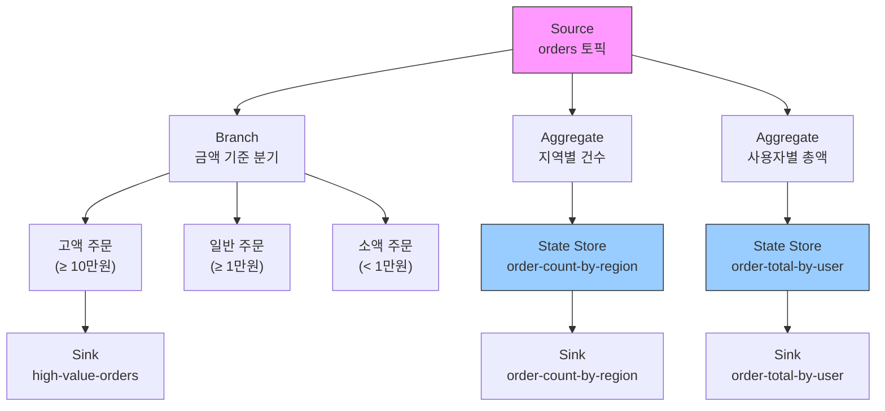
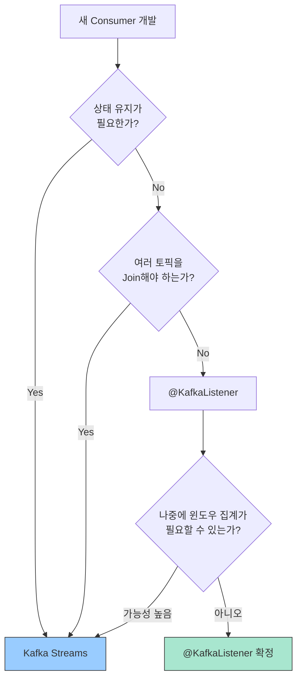

# 1. 스트림 처리 (Stream Processing)

Kafka Streams는 Redpanda(Kafka API 호환)에서 그대로 동작하는 스트림 처리 라이브러리다. 이 문서는 Kafka Streams 핵심 API(KStream/KTable, State Store, Windowing, Exactly-once, Processor API)와 `@KafkaListener`와의 선택 기준을 다룬다.

> 범용 스트림 처리 이론(배치 vs 스트림 비교, 왜 실시간이 필요한가)은 [02-fundamentals](../02-fundamentals/) 참조

---

## 2. Kafka Streams 개요

**Kafka Streams**는 Apache Kafka에서 공식 제공하는 스트림 처리 라이브러리다. Redpanda는 Kafka API와 호환되므로 Kafka Streams를 그대로 사용할 수 있다.

> **한 줄 요약**: Kafka Streams = "내 Spring Boot 앱 안에서 바로 돌아가는 실시간 데이터 처리 엔진". 별도 서버를 설치할 필요가 없다.

### 클라이언트 라이브러리 방식

Kafka Streams의 가장 큰 특징은 **별도 클러스터가 필요 없다**는 것이다. Flink나 Spark Streaming은 별도의 클러스터를 구축하고 관리해야 하지만, Kafka Streams는 애플리케이션에 라이브러리로 포함된다.

```
Flink / Spark Streaming:
애플리케이션 JAR 제출 → Flink/Spark 클러스터 → 배포 및 실행
(별도 클러스터 운영 필요)

Kafka Streams:
애플리케이션 JAR 실행 → 바로 스트림 처리 시작
(추가 인프라 불필요)
```

확장도 간단하다. 애플리케이션 인스턴스를 여러 개 실행하면, Kafka Streams가 자동으로 파티션을 분산하여 병렬 처리한다.

### Topology: Source → Processor → Sink

Kafka Streams 애플리케이션은 **Topology(토폴로지)** 라는 구조로 정의된다. "어디서 물건을 받아서(Source) → 어떤 작업을 하고(Processor) → 어디로 보내는가(Sink)"를 선언하는 것이다.

```
Source (입력 토픽)
   ↓
Processor (변환, 필터링, 집계)
   ↓
Processor (추가 변환)
   ↓
Sink (출력 토픽)
```

예시에서 사용하는 `Order` 클래스:

```java
// 주문 도메인 객체
public class Order {
    private String orderId;
    private String userId;
    private String region;
    private long amount;        // 주문 금액 (원)
    private String productId;
    private Instant createdAt;

    // 생성자, getter 생략

    public Order withDiscountApplied() {
        Order discounted = new Order();
        discounted.orderId = this.orderId;
        discounted.userId = this.userId;
        discounted.region = this.region;
        discounted.amount = (long) (this.amount * 0.9);  // 10% 할인
        discounted.productId = this.productId;
        discounted.createdAt = this.createdAt;
        return discounted;
    }
}
```

간단한 필터링 예시:

```java
StreamsBuilder builder = new StreamsBuilder();

// Source: orders 토픽에서 읽기
KStream<String, Order> orders = builder.stream("orders");

// Processor: 필터링 및 변환
KStream<String, Order> highValueOrders = orders
    .filter((key, order) -> order.getAmount() >= 10000)
    .mapValues(order -> order.withDiscountApplied());

// Sink: high-value-orders 토픽에 쓰기
highValueOrders.to("high-value-orders");
```

실무 수준의 Topology — 분기 + 집계:

```java
@Component
public class OrderStreamTopology {

    @Autowired
    public void buildTopology(StreamsBuilder builder) {

        // 1. Source: 주문 이벤트 스트림
        KStream<String, Order> orders = builder.stream(
            "orders",
            Consumed.with(Serdes.String(), new JsonSerde<>(Order.class))
        );

        // 2. 분기(Branch): 금액 기준으로 일반/고액 주문 분리
        Map<String, KStream<String, Order>> branches = orders
            .split(Named.as("order-"))
            .branch((key, order) -> order.getAmount() >= 100_000, Branched.as("high-value"))
            .branch((key, order) -> order.getAmount() >= 10_000,  Branched.as("normal"))
            .defaultBranch(Branched.as("small"));

        KStream<String, Order> highValue = branches.get("order-high-value");

        // 3. 고액 주문 → 별도 토픽
        highValue.to("high-value-orders");

        // 4. 지역별 주문 건수 집계 (모든 주문 대상)
        KTable<String, Long> countByRegion = orders
            .selectKey((key, order) -> order.getRegion())
            .groupByKey(Grouped.with(Serdes.String(), new JsonSerde<>(Order.class)))
            .count(Materialized.as("order-count-by-region"));

        // 5. 사용자별 총 주문 금액 집계
        KTable<String, Long> totalByUser = orders
            .groupByKey()  // key = userId
            .aggregate(
                () -> 0L,
                (userId, order, runningTotal) -> runningTotal + order.getAmount(),
                Materialized.<String, Long, KeyValueStore<Bytes, byte[]>>as("order-total-by-user")
                    .withKeySerde(Serdes.String())
                    .withValueSerde(Serdes.Long())
            );

        // 6. Sink: 집계 결과를 출력 토픽으로 전송
        countByRegion.toStream().to("order-count-by-region",
            Produced.with(Serdes.String(), Serdes.Long()));
        totalByUser.toStream().to("order-total-by-user",
            Produced.with(Serdes.String(), Serdes.Long()));
    }
}
```

이 Topology의 데이터 흐름:



Topology는 선언적(Declarative)이므로 "무엇을 할 것인가"만 정의하면, Kafka Streams가 "어떻게 할 것인가"를 자동으로 처리한다.

### Redpanda와의 호환성

Redpanda는 Kafka Wire Protocol을 구현하므로, Kafka Streams 애플리케이션을 수정 없이 실행할 수 있다. 설정 파일에서 `bootstrap.servers`만 Redpanda 클러스터 주소로 변경하면 된다.

```properties
# Kafka 설정
bootstrap.servers=kafka-broker:9092

# Redpanda 설정 (동일한 애플리케이션 코드)
bootstrap.servers=redpanda-node:9092
```

### Sub-topology와 Task

Topology는 내부적으로 **Sub-topology**와 **Task**라는 단위로 분할되어 실행된다.

**Sub-topology**: 하나의 Topology 안에서 서로 연결되지 않은 독립 그래프가 각각 하나의 Sub-topology가 된다. 예를 들어, `orders` 토픽과 `clicks` 토픽을 각각 별도로 처리하면 2개의 Sub-topology가 생긴다.

**Task**: Sub-topology가 참조하는 소스 토픽의 파티션 수만큼 Task가 생성된다. Task는 Kafka Streams의 **병렬 처리 단위**다.

```
예시:
  Sub-topology 1 → 소스 토픽 "orders" (8 파티션)
    → Task 1_0, 1_1, 1_2, ... 1_7  (8개 Task)

  Sub-topology 2 → 소스 토픽 "clicks" (4 파티션)
    → Task 2_0, 2_1, 2_2, 2_3     (4개 Task)

  총 12개 Task → Consumer Group 내 인스턴스들에 분산 할당
```

단, **Task 수보다 인스턴스가 많으면 유휴 인스턴스가 생기므로**, 인스턴스 수는 최대 파티션 수까지만 의미가 있다.

### DSL vs Processor API

Kafka Streams는 두 가지 프로그래밍 인터페이스를 제공한다.

| 항목 | DSL (Domain Specific Language) | Processor API |
|------|-------------------------------|---------------|
| **스타일** | 선언적, 함수형 (Lambda 체이닝) | 명령형, 절차적 |
| **추상화** | KStream, KTable, GlobalKTable | Processor, Transformer |
| **사용 난이도** | 낮음 (대부분의 사용 사례 커버) | 높음 (세밀한 제어 필요 시) |
| **State Store 접근** | Materialized로 암묵적 생성 | ProcessorContext로 직접 접근 |
| **스케줄링** | 지원 안 함 | `context.schedule()`로 주기적 작업 가능 |

대부분의 실무 시나리오는 DSL로 충분하며, DSL로 표현할 수 없는 복잡한 로직(주기적 flush, 커스텀 State Store 조작 등)에만 Processor API를 사용한다.

---

## 3. KStream vs KTable

Kafka Streams는 두 가지 핵심 추상화를 제공한다: **KStream**과 **KTable**.

- **KStream** = 은행 거래 내역서. 모든 레코드를 시간순으로 보존한다. **"무슨 일이 일어났는가"** (사건의 기록).
- **KTable** = 통장 잔액. 같은 키에 대해 최신 값으로 덮어씌운다. **"지금 상태가 뭔가"** (최신 스냅샷).

### KStream: 이벤트 스트림 (Event Stream)

**KStream**은 **모든 변경 이력을 보존**하는 무한 이벤트 스트림이다. 같은 키에 대해 여러 레코드가 존재할 수 있으며, 각 레코드는 독립적인 이벤트다.

```
주문 이벤트 스트림 (KStream):
key=user123, value={orderId: 1, amount: 5000}  ← 첫 번째 주문
key=user123, value={orderId: 2, amount: 8000}  ← 두 번째 주문
key=user123, value={orderId: 3, amount: 3000}  ← 세 번째 주문
```

**실무 예시**: 주문 이벤트, 클릭 이벤트, 로그 메시지 (각각 독립적 사건)

### KTable: 변경 로그 (Changelog)

**KTable**은 **최신 상태만 유지**하는 변경 로그다. 같은 키에 대해 여러 레코드가 오면, 최신 값으로 덮어씀다.

```
재고 상태 테이블 (KTable):
key=product123, value={stock: 100}     ← 초기 재고
key=product123, value={stock: 95}      ← 5개 판매 (이전 값 덮어씀)
key=product123, value={stock: 90}      ← 5개 추가 판매 (최신 상태)
```

**실무 예시**: 사용자 프로필, 재고 수량, 계좌 잔액 (현재 상태만 의미 있음)

### 둘의 변환

KStream과 KTable은 서로 변환할 수 있다:

```java
// KStream → KTable: 최신 값으로 집계
KTable<String, Long> userOrderCount = orders
    .groupByKey()
    .count();  // 사용자별 주문 건수 (KTable)

// KTable → KStream: 변경 이벤트로 변환
KStream<String, StockChange> stockChanges = stockTable.toStream();
```

### GlobalKTable: 전체 파티션을 가진 테이블

KTable은 할당된 파티션의 데이터만 로컬에 유지하지만, GlobalKTable은 **모든 파티션의 데이터를 모든 인스턴스에 복제**한다.

```java
// KTable: 인스턴스별로 할당된 파티션의 데이터만 보유
KTable<String, Product> products = builder.table("products");

// GlobalKTable: 모든 인스턴스가 전체 상품 데이터를 보유
GlobalKTable<String, Product> allProducts = builder.globalTable(
    "products",
    Materialized.<String, Product, KeyValueStore<Bytes, byte[]>>as("products-global-store")
);
```

| 항목 | KTable | GlobalKTable |
|------|--------|-------------|
| **데이터 범위** | 할당된 파티션만 | 모든 파티션 (전체 복제) |
| **메모리 사용** | 적음 (파티션 비례) | 많음 (전체 데이터) |
| **조인 시 키 제약** | 동일 파티션 키 필요 | 아무 키로든 조인 가능 |
| **적합한 데이터** | 대용량 (사용자, 주문) | 소용량 참조 데이터 (상품, 설정) |

GlobalKTable의 핵심 장점은 **조인 시 키 제약이 없다**는 것이다. 단, 전체 데이터를 모든 인스턴스에 복제하므로 상품 코드표나 설정값처럼 소규모 참조 데이터에만 사용해야 한다.

### Stream-Table Join

실무에서는 KStream과 KTable을 **조인(Join)** 하는 경우가 많다. 주문 이벤트(KStream)와 상품 정보(KTable)를 조인하면 주문에 상품명과 가격을 붙인 "풍부한 주문(Enriched Order)"을 만들 수 있다. Stream-Table Join은 KStream 쪽에 새 레코드가 도착할 때만 트리거되며, KTable 쪽은 최신 상태를 참조한다.

> **Spring Boot 구현**: 조인 종류별 코드(Inner/Left/Outer, Stream-Stream, Stream-Table, Stream-GlobalKTable)는 [23 §5 조인 연산](../03-spring-boot-integration/23-kafka-streams-spring-boot.md) 참조

### GroupBy vs GroupByKey: 재파티셔닝 차이

집계(count, aggregate)를 하려면 먼저 그룹화가 필요하다. `groupBy()`와 `groupByKey()` 두 가지가 있는데, 성능 차이가 크다.

- **groupByKey()**: 현재 키를 그대로 사용. **재파티셔닝 없음**.
- **groupBy()**: 새 키로 변경. 내부적으로 재파티션 토픽을 자동 생성하고 데이터를 재분배하므로 **네트워크 + 스토리지 오버헤드 발생**.
- **selectKey() + groupByKey()** 조합도 키가 변경되었으므로 재파티셔닝이 발생한다.

결국 **키 변경이 일어나느냐**가 핵심이지, 어떤 메서드를 호출하느냐가 아니다.

```
키 변경 없음: groupByKey()              → 재파티셔닝 없음 ✅ (빠름)
키 변경 있음: groupBy(newKeyFn)         → 재파티셔닝 발생 ⚠️ (느림)
키 변경 있음: selectKey() + groupByKey() → 재파티셔닝 발생 ⚠️ (느림)
```

> **Spring Boot 구현**: groupBy/groupByKey 코드 예시와 aggregate 구현은 [23 §4 DSL 연산](../03-spring-boot-integration/23-kafka-streams-spring-boot.md) 참조

### Aggregate: 범용 집계 함수

`count()`는 건수만 세지만, `aggregate()`는 **임의의 집계 로직**을 정의할 수 있다. 3개의 함수를 파라미터로 받는다.

1. **Initializer**: 키를 처음 만났을 때의 초기 집계값 (예: `0L`)
2. **Adder**: 새 레코드가 도착할 때마다 호출되어 집계값을 갱신
3. **Subtractor** (KTable aggregate에만 해당): 이전 값이 변경될 때 역연산 수행

KStream의 aggregate는 Adder만 있으면 충분하지만, KTable의 aggregate는 값이 **업데이트(덮어쓰기)** 되므로 이전 값을 빼는 Subtractor가 필요하다.

> **Spring Boot 구현**: Initializer/Adder/Subtractor 코드 예시는 [23 §4 DSL 연산](../03-spring-boot-integration/23-kafka-streams-spring-boot.md) 참조

---

## 4. State Store: 로컬 상태 저장소

집계(Aggregation), 조인(Join), 윈도우(Window) 연산은 모두 과거 데이터를 기억해야 한다. Kafka Streams는 이를 위해 **State Store**를 제공한다. "서울 주문 150건"같은 중간 결과를 기억해야 다음 주문이 들어왔을 때 151건으로 갱신할 수 있다.

### RocksDB란 무엇인가

RocksDB는 **Facebook이 만든 임베디드 Key-Value 스토리지 엔진**이다. 별도 서버 프로세스 없이 애플리케이션 내부에 라이브러리로 내장된다.

| 항목 | SQLite | RocksDB |
|------|--------|---------|
| **데이터 모델** | 관계형 (테이블, SQL) | Key-Value (get/put/delete) |
| **최적화 대상** | 범용 (읽기/쓰기 균형) | **쓰기 집중** 워크로드 |
| **내부 구조** | B-Tree | **LSM-Tree** (Log-Structured Merge Tree) |
| **사용처** | 모바일 앱, 소규모 DB | Kafka Streams, CockroachDB, TiKV |

Kafka Streams의 State Store는 이벤트가 들어올 때마다 상태를 갱신하는 쓰기 집중 워크로드다. RocksDB의 **LSM-Tree** 구조가 이런 패턴에 최적이다.

```
쓰기 요청 → MemTable (메모리) → 꽉 차면 → SSTable (디스크 파일)로 flush
                                              ↓
                                   백그라운드 Compaction으로 병합/정리
```

- **쓰기가 빠르다**: 디스크에 바로 쓰지 않고 메모리(MemTable)에 먼저 쓴 뒤 일괄 flush하므로, 랜덤 I/O 대신 순차 I/O가 발생한다.
- **읽기도 충분히 빠르다**: MemTable → Block Cache → SSTable 순서로 조회하므로 최근 데이터는 메모리에서 바로 반환된다.
- **메모리 한계를 넘길 수 있다**: JVM 힙을 차지하지 않고 대량 상태도 디스크에 저장하면서 처리할 수 있다.

### Kafka Streams에서의 RocksDB

State Store는 각 애플리케이션 인스턴스의 로컬 디스크에 생성된다. RocksDB는 "빠른 로컬 캐시" 역할을 하고, Changelog 토픽이 "영구 백업" 역할을 한다.

```
Kafka Streams 인스턴스 (JVM 프로세스)
├── 비즈니스 로직 (filter, aggregate, join)
├── RocksDB (State Store)         ← 프로세스 내부에 내장
│   ├── MemTable (메모리)
│   └── SSTable (로컬 디스크)
│       ├── /tmp/kafka-streams/app-id/
│       │   ├── 0_0/             # Partition 0의 State Store
│       │   │   ├── CURRENT
│       │   │   ├── MANIFEST
│       │   │   └── *.sst        # SSTable 파일
│       │   ├── 1_0/             # Partition 1의 State Store
│       │   └── ...
└── Changelog 토픽               ← RocksDB 변경사항의 백업 (Kafka에 저장)
```

각 파티션마다 독립적인 State Store(RocksDB 인스턴스)가 생성된다. 인스턴스가 죽으면 로컬 RocksDB 파일은 사라지지만, Changelog 토픽에서 재생하면 복구된다.

### Changelog 토픽으로 내결함성 보장

Kafka Streams는 State Store 업데이트 시 **복사본을 Kafka 토픽(Changelog 토픽)에도 자동으로 전송**한다. 서버가 재시작되면 이 복사본을 읽어서 State Store를 복원한다.

```
애플리케이션이 State Store 업데이트:
state.put("user123", 10);

↓ Kafka Streams가 자동으로 Changelog 토픽에 전송:

Changelog 토픽:
key=user123, value=10
```

Changelog 토픽은 **Compaction 정책**을 사용한다 (`cleanup.policy=compact`). 최신 상태만 유지하므로, 복원 시간이 최소화된다.

### 인터랙티브 쿼리 (Interactive Queries)

State Store는 **읽기 전용 쿼리**를 지원한다. 외부에서 REST API를 통해 현재 상태를 조회할 수 있다.

```java
// State Store 조회
ReadOnlyKeyValueStore<String, Long> store = streams.store(
    StoreQueryParameters.fromNameAndType("user-order-count", QueryableStoreTypes.keyValueStore())
);

Long orderCount = store.get("user123");  // 사용자 주문 건수 조회
```

이를 활용하면 Kafka Streams 애플리케이션이 **실시간 쿼리 서비스**가 된다. 별도 데이터베이스 없이도 "현재 사용자의 주문 건수는?"을 즉시 응답할 수 있다.

### State Store 종류와 생성

**Persistent Store (RocksDB)**: 로컬 디스크에 저장되므로 프로세스가 재시작되어도 데이터가 남아 있다. Changelog 토픽에서 복원할 필요 없이 바로 시작할 수 있어 복구 시간이 짧다.

```java
// Persistent KeyValue Store 생성
StoreBuilder<KeyValueStore<String, Long>> storeBuilder =
    Stores.keyValueStoreBuilder(
        Stores.persistentKeyValueStore("persistent-counts"),  // RocksDB 기반
        Serdes.String(),
        Serdes.Long()
    );
```

**In-Memory Store**: 메모리에만 저장되므로 프로세스 종료 시 데이터가 사라진다. 데이터 양이 적고 속도가 중요한 경우에 적합하다.

```java
// In-Memory KeyValue Store 생성
StoreBuilder<KeyValueStore<String, Long>> storeBuilder =
    Stores.keyValueStoreBuilder(
        Stores.inMemoryKeyValueStore("inmemory-counts"),  // 메모리 기반
        Serdes.String(),
        Serdes.Long()
    );
```

### Changelog 복원 프로세스

```
Kafka Streams 시작
    ↓
Task 할당 (파티션 기반)
    ↓
로컬 State Store 확인
    ├─ RocksDB 파일 존재 → 마지막 커밋 이후의 Changelog만 읽기 (빠름)
    └─ 파일 없음 → Changelog 토픽 전체 읽기 (느림)
    ↓
State Store 복원 완료
    ↓
처리 재개
```

**복원 시간 문제**: State Store의 데이터가 많을수록 복원 시간이 길어진다. 운영 환경에서는 다음을 고려해야 한다.

- **Standby Replica**: `num.standby.replicas=1` 설정으로 다른 인스턴스에 State Store 복제본을 유지. 장애 시 복제본에서 바로 처리 재개.
- **데이터 양 관리**: Windowed Store의 retention 설정으로 오래된 데이터 자동 삭제.

### Changelog 비활성화

외부 API에서 가져온 불변 데이터를 캐시하는 State Store처럼 특수한 경우에는 Changelog 토픽을 비활성화할 수 있다.

```java
StoreBuilder<KeyValueStore<String, String>> cacheStore =
    Stores.keyValueStoreBuilder(
        Stores.persistentKeyValueStore("external-cache"),
        Serdes.String(),
        Serdes.String()
    )
    .withLoggingDisabled();  // Changelog 비활성화
```

**주의**: Changelog를 비활성화하면 리밸런싱이나 노드 장애 시 State Store 데이터가 유실된다. 복원 불가능한 데이터에는 절대 사용하면 안 된다.

### State Store 캐시 메커니즘

Kafka Streams는 State Store 앞에 **메모리 캐시**를 두어 불필요한 I/O를 줄인다.

```
레코드 도착 → 메모리 캐시에 저장
            → 같은 키 업데이트 반복 (캐시에서만 갱신)
            → Flush 타이밍 도달
                → 최종 값만 RocksDB에 기록
                → 최종 값만 Changelog 토픽에 전송
                → 최종 값만 다음 Processor에 전달
```

캐시 Flush는 두 조건 중 하나가 충족되면 발생한다:
- `cache.max.bytes.buffering` (기본 10MB): 캐시 크기 초과 시
- `commit.interval.ms` (기본 30초): 커밋 주기 도달 시

### State Store는 데이터베이스를 대체하지 못한다

State Store는 **토폴로지에 사전 정의된 연산만 실행**한다. Interactive Query는 `store.get(key)` 룩업만 가능하며, "지난달 매출 100만 이상인 고객 목록"같은 ad-hoc 쿼리는 불가능하다.

| 관점 | DB | Kafka Streams (State Store) |
|------|-----|-------------|
| **처리** | ad-hoc 질의 (즉석 쿼리) | 사전 정의 토폴로지 (배포 전 결정) |
| **조회** | SQL, 인덱스, JOIN, WHERE | key 룩업만 (Interactive Query) |
| **데이터 성격** | 정본 (source of truth) | 파생 (changelog에서 복구) |
| **트랜잭션** | ACID | 스트림 범위 내 exactly-once |
| **쓰기** | INSERT/UPDATE/DELETE 자유 | 스트림을 통해서만 |

둘은 대체 관계가 아닌 **보완 관계**다. Kafka Streams 결과를 DB에 sink하는 구조로 함께 사용한다. CQRS 패턴에서는 Kafka Streams로 실시간 뷰를 구성하고 DB에 Materialized View를 저장한다.

---

## 5. Windowing: 시간 기반 집계

무한한 스트림에서 "최근 5분간 주문 건수" 또는 "매시간 매출"처럼 시간 구간을 정해서 집계하는 것이 **Windowing**이다.

### Tumbling Window (고정 윈도우)

고정된 크기의 겹치지 않는 윈도우다.

```
시간: 00:00  00:05  00:10  00:15  00:20
윈도우:  [----1---][----2---][----3---][----4---]
```

각 윈도우는 5분이고, 서로 겹치지 않는다. 이벤트는 정확히 하나의 윈도우에만 속한다.

**실무 예시**: "매 5분간 주문 건수"

```java
KStream<Windowed<String>, Long> orderCountsPer5Min = orders
    .groupByKey()
    .windowedBy(TimeWindows.ofSizeWithNoGrace(Duration.ofMinutes(5)))
    .count();
```

### Hopping Window (슬라이딩 윈도우, 겹침)

고정된 크기이지만 **일정 간격으로 이동**하여 겹치는 윈도우다.

```
시간: 00:00  00:05  00:10  00:15  00:20
윈도우:  [------1------]
           [------2------]
              [------3------]
                 [------4------]
```

윈도우 크기 10분, 진행 간격 5분이면, 각 이벤트는 2개 윈도우에 속한다.

**실무 예시**: "최근 10분간 주문 건수 (5분마다 업데이트)"

```java
KStream<Windowed<String>, Long> orderCountsLast10Min = orders
    .groupByKey()
    .windowedBy(TimeWindows.ofSizeAndGrace(Duration.ofMinutes(10), Duration.ofMinutes(1))
        .advanceBy(Duration.ofMinutes(5)))
    .count();
```

### Session Window (세션 윈도우)

**비활성 기간(inactivity gap)** 을 기준으로 윈도우를 동적으로 생성한다. 이벤트 간 간격이 임계값(예: 30분)을 초과하면 새 윈도우가 시작된다.

```
사용자 활동:
00:00 클릭 → 00:05 클릭 → 00:10 클릭 [30분 공백] 01:00 클릭 → 01:05 클릭

윈도우:
[Session 1: 00:00 ~ 00:10]  (3개 이벤트)
[Session 2: 01:00 ~ 01:05]  (2개 이벤트)
```

**실무 예시**: "사용자 세션별 페이지뷰 수"

```java
KStream<Windowed<String>, Long> sessionPageViews = clicks
    .groupByKey()
    .windowedBy(SessionWindows.ofInactivityGapWithNoGrace(Duration.ofMinutes(30)))
    .count();
```

### 윈도우 선택 가이드

| 윈도우 타입 | 사용 사례 | 예시 |
|------------|---------|------|
| **Tumbling** | 정기적 집계 (겹치지 않음) | "매시간 매출", "매일 신규 가입자" |
| **Hopping** | 이동 평균 (겹침) | "최근 1시간 트래픽 (10분마다 갱신)" |
| **Session** | 사용자 활동 세션 | "웹 세션별 체류 시간", "게임 플레이 세션" |

### WindowStore 내부 구조

윈도우 집계는 내부적으로 일반 KeyValueStore가 아닌 **WindowStore**를 사용한다. WindowStore는 키에 타임스탬프를 결합하여 "어떤 키가 어떤 시간 구간에 어떤 값을 가지는지"를 저장한다.

```java
// WindowStore 직접 생성 (Processor API에서 사용)
StoreBuilder<WindowStore<String, Long>> windowStoreBuilder =
    Stores.windowStoreBuilder(
        Stores.persistentWindowStore(
            "order-count-per-window",
            Duration.ofHours(2),      // retention: 2시간 이전 데이터 자동 삭제
            Duration.ofMinutes(5),    // window size: 5분 단위 윈도우
            false                     // retainDuplicates: 중복 허용 여부
        ),
        Serdes.String(),
        Serdes.Long()
    );
```

**Segmentation 구조**: WindowStore는 내부적으로 복수의 RocksDB Segment로 구성된다. 타임스탬프 범위별로 Segment를 나누어 저장하므로, 보존 기한이 지난 데이터는 Segment 단위로 한꺼번에 삭제할 수 있다.

```
WindowStore 내부 구조:
├── Segment 1 (00:00 ~ 00:30)  ← retention 초과 시 통째로 삭제
├── Segment 2 (00:30 ~ 01:00)
├── Segment 3 (01:00 ~ 01:30)  ← 현재 활성 구간
└── 키 구조: [원래 키] + [밀리초 Unix Timestamp]
```

**시간 범위 조회**: WindowStore는 특정 키의 시간 범위 데이터를 조회할 수 있다. Interactive Query와 결합하면 "최근 1시간의 5분 단위 주문 건수 추이"를 REST API로 제공할 수 있다.

```java
WindowStore<String, Long> store = streams.store(
    StoreQueryParameters.fromNameAndType("order-count-per-window",
        QueryableStoreTypes.windowStore())
);

// 최근 1시간의 5분 단위 데이터 조회
Instant from = Instant.now().minus(Duration.ofHours(1));
Instant to = Instant.now();
try (WindowStoreIterator<Long> iter = store.fetch("seoul", from, to)) {
    while (iter.hasNext()) {
        KeyValue<Long, Long> entry = iter.next();
        // entry.key = 윈도우 시작 시간 (밀리초)
        // entry.value = 해당 윈도우의 집계 값
    }
}
```

세 윈도우 전략의 시간 범위 차이:

```mermaid
gantt
    title Windowing 전략 비교
    dateFormat X
    axisFormat %s

    section Tumbling (5s)
    Window 1 :0, 5
    Window 2 :5, 10
    Window 3 :10, 15

    section Hopping (5s, advance 2s)
    Window 1 :0, 5
    Window 2 :2, 7
    Window 3 :4, 9

    section Session (gap 3s)
    Session 1 :0, 4
    Session 2 :7, 11
```



> **프로덕션 사례**: 컬리 SCM 팀의 Tumbling Window 도입기 — TimestampExtractor, 스트림 시간 함정, 더미 이벤트 전략은 [19-production-case-studies.md §컬리 SCM](../03-spring-boot-integration/19-production-case-studies.md)을 참조한다.

---

## 6. Exactly-once Semantics

분산 시스템에서 메시지 처리 보장 수준은 세 가지다:

- **At-most-once**: 메시지가 최대 1번 처리됨. 빠르지만 **손실될 수 있다**.
- **At-least-once**: 메시지가 최소 1번 처리됨. 안전하지만 **중복될 수 있다**.
- **Exactly-once**: 메시지가 정확히 1번만 처리됨. **손실도 중복도 없다**.

Kafka Streams는 **Exactly-once Semantics (EOS)** 를 지원한다. 장애 발생 시에도 각 메시지가 정확히 한 번만 처리됨을 보장한다.

### 트랜잭션 기반 구현

EOS는 Kafka의 **트랜잭션(Transaction)** 기능을 활용한다. 처리 결과와 오프셋 커밋을 하나의 트랜잭션으로 묶는다.

```
1. 입력 토픽에서 메시지 읽기
2. 비즈니스 로직 처리
3. 트랜잭션 시작
   ├─ 출력 토픽에 결과 쓰기
   └─ Consumer 오프셋 커밋
4. 트랜잭션 커밋

장애 발생 → 트랜잭션 롤백 → 처음부터 재시도
```

### 설정 방법

```java
Properties props = new Properties();
props.put(StreamsConfig.PROCESSING_GUARANTEE_CONFIG, StreamsConfig.EXACTLY_ONCE_V2);
props.put(StreamsConfig.APPLICATION_ID_CONFIG, "my-stream-app");

KafkaStreams streams = new KafkaStreams(topology, props);
streams.start();
```

`EXACTLY_ONCE_V2`는 Kafka 2.5+에서 도입된 개선된 버전으로, 성능이 `EXACTLY_ONCE`보다 우수하다.

**주의사항**: EOS는 **처리량을 약간 희생**한다. 트랜잭션 오버헤드로 인해 지연시간이 수십 ms 증가할 수 있다. 중복이 허용되는 시나리오(예: 클릭 집계)에서는 `AT_LEAST_ONCE`를 사용하여 성능을 최적화할 수 있다.

---

## 6-1. 시간 시멘틱스 (Time Semantics)

Kafka Streams에서 윈도우와 조인은 **타임스탬프**를 기준으로 동작한다. "어떤 시간을 사용하느냐"에 따라 처리 결과가 달라지므로, 4가지 시간 개념을 이해하는 것이 중요하다.

| 시간 유형 | 정의 | 예시 |
|-----------|------|------|
| **Event-time** | 이벤트가 실제 발생한 시간 | 주문이 클라이언트에서 생성된 시각 |
| **Ingestion-time** | 이벤트가 Kafka 브로커에 도착한 시간 | 브로커가 레코드를 수신한 시각 |
| **Processing-time** | 이벤트가 스트림 애플리케이션에서 처리되는 시간 | 애플리케이션이 poll()한 시각 |
| **Stream-time** | Task별로 처리한 레코드 중 최대 타임스탬프 | 현재까지 본 가장 최근 이벤트 시간 |

Kafka Streams는 기본적으로 **Event-time** 기반으로 동작한다. 네트워크 지연으로 실제 처리 시점과 이벤트 발생 시점이 다를 수 있기 때문에, Event-time을 사용해야 **정확한 시간 기반 집계**가 가능하다.

### 커스텀 타임스탬프 추출기

기본 타임스탬프가 적합하지 않을 때, 레코드 값에서 직접 타임스탬프를 추출할 수 있다.

```java
public class OrderTimestampExtractor implements TimestampExtractor {
    @Override
    public long extract(ConsumerRecord<Object, Object> record, long partitionTime) {
        Order order = (Order) record.value();
        // 레코드 값에서 이벤트 시간 추출
        long timestamp = order.getCreatedAt().toEpochMilli();

        // 타임스탬프가 유효하지 않으면 파티션의 현재 시간 사용 (fallback)
        return timestamp > 0 ? timestamp : partitionTime;
    }
}

// DSL에서 커스텀 추출기 적용
KStream<String, Order> orders = builder.stream(
    "orders",
    Consumed.with(Serdes.String(), new JsonSerde<>(Order.class))
            .withTimestampExtractor(new OrderTimestampExtractor())
);
```

### Grace Period: 늦게 도착한 레코드

네트워크 지연이나 재전송으로 인해 윈도우 종료 후에 도착하는 레코드가 있을 수 있다. **Grace Period**를 설정하면 윈도우 종료 후 일정 시간 동안 늦은 레코드를 수용한다.

```java
// 5분 윈도우 + 1분 grace period
// → 윈도우 종료 후 1분까지는 늦은 레코드도 집계에 포함
TimeWindows window = TimeWindows.ofSizeAndGrace(
    Duration.ofMinutes(5),   // 윈도우 크기
    Duration.ofMinutes(1)    // grace period
);

// grace period 없이 설정 (늦은 레코드 즉시 폐기)
TimeWindows strictWindow = TimeWindows.ofSizeWithNoGrace(Duration.ofMinutes(5));
```

Grace Period가 지난 후에 도착한 레코드는 폐기된다. 실시간성이 중요하면 grace를 짧게, 정확성이 중요하면 길게 설정한다.

---

## 6-2. Processor API (저수준 API)

DSL은 `filter()`, `mapValues()`, `aggregate()` 같은 선언적 메서드를 체이닝하여 사용하는 반면, **Processor API**는 `process()` 메서드 안에서 직접 로직을 작성하는 명령형 방식이다.

### 언제 Processor API가 필요한가

- **주기적 작업**: `context.schedule()`로 1초마다 State Store를 순회하여 결과 전송
- **조건부 전달**: 레코드 내용에 따라 서로 다른 downstream Processor로 분기
- **커스텀 State Store 조작**: get/put/delete/range 등 세밀한 State Store 접근
- **타임스탬프 직접 제어**: 출력 레코드의 타임스탬프를 명시적으로 설정

### Processor 구현

```java
public class WordCountProcessor implements Processor<String, String, String, String> {
    private KeyValueStore<String, Integer> kvStore;
    private ProcessorContext<String, String> context;

    @Override
    public void init(final ProcessorContext<String, String> context) {
        this.context = context;

        // State Store 참조 획득
        kvStore = context.getStateStore("Counts");

        // 1초마다 State Store 전체를 순회하여 다음 Processor로 전달
        context.schedule(Duration.ofSeconds(1), PunctuationType.STREAM_TIME, timestamp -> {
            try (final KeyValueIterator<String, Integer> iter = kvStore.all()) {
                while (iter.hasNext()) {
                    final KeyValue<String, Integer> entry = iter.next();
                    context.forward(new Record<>(entry.key, entry.value.toString(), timestamp));
                }
            }
        });
    }

    @Override
    public void process(final Record<String, String> record) {
        final String[] words = record.value().toLowerCase().split("\\W+");

        for (final String word : words) {
            final Integer oldValue = kvStore.get(word);
            kvStore.put(word, oldValue == null ? 1 : oldValue + 1);
        }
    }

    @Override
    public void close() {
        // State Store는 Kafka Streams가 관리하므로 여기서 닫지 않음
    }
}
```

`PunctuationType`에는 두 가지가 있다:
- `STREAM_TIME`: 처리 중인 레코드의 타임스탬프 기반. 데이터가 들어오지 않으면 트리거되지 않음.
- `WALL_CLOCK_TIME`: 실제 시계 기반. 데이터 유무와 무관하게 주기적으로 트리거.

### Topology에 Processor 등록

Processor API로 구현한 Processor는 `Topology` 객체에 직접 등록한다.

```java
Topology topology = new Topology();

// State Store 정의
StoreBuilder<KeyValueStore<String, Integer>> countStore =
    Stores.keyValueStoreBuilder(
        Stores.persistentKeyValueStore("Counts"),
        Serdes.String(),
        Serdes.Integer()
    );

// Source → Processor → Sink 연결
topology.addSource("Source", "source-topic")
    .addProcessor("Process", WordCountProcessor::new, "Source")
    .addStateStore(countStore, "Process")   // Processor에 State Store 연결
    .addSink("Sink", "sink-topic", "Process");
```

**주의**: `addStateStore()`의 두 번째 파라미터에 Processor 이름을 정확히 전달해야 한다. 이름이 틀리면 `init()`에서 `context.getStateStore()`가 실패한다.

### DSL과 Processor API 혼합

실무에서는 DSL을 기본으로 사용하되, 특정 단계에서만 Processor API를 섞어 쓰는 것이 일반적이다. `KStream.process()`를 사용하면 DSL 파이프라인 중간에 커스텀 Processor를 삽입할 수 있다.

```java
StreamsBuilder builder = new StreamsBuilder();

builder.stream("orders", Consumed.with(Serdes.String(), new JsonSerde<>(Order.class)))
    .filter((key, order) -> order.getAmount() >= 10000)  // DSL
    .process(CustomEnrichmentProcessor::new,              // Processor API
             Named.as("enrichment"),
             "enrichment-store")
    .to("enriched-orders");                               // DSL
```

---

## 7. Spring Boot 연동

Spring Boot에서 Kafka Streams를 사용하는 구체적인 설정과 구현은 [03-spring-boot-integration/23-kafka-streams-spring-boot](../03-spring-boot-integration/23-kafka-streams-spring-boot.md)에서 다룬다. 여기서는 핵심 요점만 정리한다.

- **의존성**: `spring-kafka` + `kafka-streams` (Avro 사용 시 `kafka-streams-avro-serde` 추가)
- **설정**: `@EnableKafkaStreams` 선언 → `StreamsBuilderFactoryBean`이 자동으로 라이프사이클(생성, 시작, 종료)을 관리
- **토폴로지 등록**: `@Bean`으로 `KStream` 반환하거나, `@Component` 생성자에서 `StreamsBuilder` 주입
- **Serde**: 기본 타입은 `Serdes.String()` 등 내장 Serde, 도메인 객체는 `JsonSerde` 또는 `SpecificAvroSerde`

상세 내용:
- 설정 및 빈 등록 → [23 § 2](../03-spring-boot-integration/23-kafka-streams-spring-boot.md#2-spring-boot-설정)
- Serde (JSON, Avro) → [23 § 3](../03-spring-boot-integration/23-kafka-streams-spring-boot.md#3-serde-serializerdeserializer)
- DSL 연산 카탈로그 → [23 § 4](../03-spring-boot-integration/23-kafka-streams-spring-boot.md#4-dsl-연산-카탈로그)
- 조인 구현 → [23 § 5](../03-spring-boot-integration/23-kafka-streams-spring-boot.md#5-조인-연산)
- 윈도우 구현 → [23 § 6](../03-spring-boot-integration/23-kafka-streams-spring-boot.md#6-윈도우-집계-spring-boot-구현)
- 에러 처리 → [23 § 8](../03-spring-boot-integration/23-kafka-streams-spring-boot.md#8-에러-처리)

---

## 8. 대안 프레임워크

| 요구사항 | 권장 프레임워크 | 특이사항 |
|---------|---------------|---------|
| 간단한 변환/필터링, 경량 | **Kafka Streams** | 별도 클러스터 불필요 |
| 대규모 상태, 복잡한 윈도우 | **Apache Flink** | 별도 클러스터 필요, Flink SQL 지원 |
| SQL로 빠르게 구축 | **ksqlDB** | 복잡한 로직 표현에 한계 |
| 기존 Spark 인프라 활용 | **Spark Structured Streaming** | 미니배치 방식, 지연시간 초 단위 |

---

## 9. @KafkaListener vs Kafka Streams 판단 가이드

Spring Boot 환경에서 이벤트를 소비할 때 `@KafkaListener`와 Kafka Streams 중 어느 것을 선택할지는 **상태 유지 필요성**이 핵심 기준이다.

### @KafkaListener의 한계와 Kafka Streams의 해결

`@KafkaListener`는 **상태(State)를 자체적으로 유지하는 능력이 없다**. Stateful 집계를 위해선 외부 DB가 필요하고, 여러 토픽 Join이나 시간 기반 집계는 직접 구현해야 한다.

```java
// @KafkaListener: 외부 DB 의존
@KafkaListener(topics = "user.events")
public void handle(UserEvent event) {
    long count = userRepository.countByUserId(event.getUserId());
    userRepository.updatePostCount(event.getUserId(), count + 1);
}

// Kafka Streams: State Store로 직접 집계 — 외부 DB 불필요
KTable<String, Long> postCounts = builder
    .<String, UserEvent>stream("user.events")
    .groupByKey()
    .count(Materialized.as("post-count-store"));
```

### 비교 표

| 항목 | @KafkaListener | Kafka Streams |
|------|---------------|---------------|
| **Stateful 집계** | 외부 DB 필요 | State Store 내장 (RocksDB) |
| **조인** | 직접 구현 (복잡) | DSL로 선언적 (Stream-Stream, Stream-Table, GlobalKTable) |
| **윈도우** | 직접 구현 필요 | Tumbling, Hopping, Session 내장 |
| **에러 처리** | DefaultErrorHandler, @RetryableTopic | DeserializationExceptionHandler, StreamsUncaughtExceptionHandler |
| **스케일링** | Consumer Group 리밸런스 | 파티션 기반 자동 분산 + State Store 마이그레이션 |
| **테스트** | @EmbeddedKafka, Testcontainers | TopologyTestDriver (브로커 불필요, ms 단위) |
| **학습 곡선** | 낮음 (Spring 친화적) | 중간 (Topology, Serde, State Store 이해 필요) |

### 판단 플로우차트



핵심은 간단하다. **상태가 필요하면 Kafka Streams, 필요 없으면 @KafkaListener**다.

### 마이그레이션 신호

다음 신호가 보이면 `@KafkaListener` → Kafka Streams 전환을 검토할 시점이다.

- **DB 호출이 리스너의 주요 병목**일 때 — State Store로 전환하면 네트워크 왕복이 사라진다
- **여러 리스너가 같은 DB 테이블을 동시에 갱신**할 때 — 파티션 기반 처리로 경합이 해소된다
- **시간 기반 집계를 직접 구현**하게 되었을 때 — Windowing DSL로 대체
- **메모리 Map으로 토픽 간 조인**하고 있을 때 — 재시작 시 유실, State Store + Changelog로 해결

### 두 모델 공존

하나의 Spring Boot 앱에서 두 모델을 함께 사용할 수 있다. Stateless 처리는 `@KafkaListener`로, Stateful 집계는 Kafka Streams로 분리한다. **같은 Consumer Group을 공유하면 안 된다** — Kafka Streams는 `application.id`를 Consumer Group으로 사용하므로 `group-id`와 겹치지 않도록 설정한다.

---

## 참고

- [Kafka Streams Documentation](https://kafka.apache.org/documentation/streams/)
- [Spring Kafka Streams](https://docs.spring.io/spring-kafka/reference/html/#kafka-streams)
- [Confluent Kafka Streams Examples](https://github.com/confluentinc/kafka-streams-examples)
- [devkuma - Kafka Streams 완전 정리](https://www.devkuma.com/docs/apache-kafka/strems/) — Processor API, StateStore 캐시, WindowStore 내부 구조
- [Yandex Cloud - Kafka Streams](https://yandex.cloud/en/blog/posts/2025/03/kafka-streams) — Time Semantics, Interactive Queries

---

## 학습 정리

| 개념 | 핵심 |
|------|------|
| **Kafka Streams** | 클라이언트 라이브러리, 별도 클러스터 불필요, Sub-topology → Task 병렬 처리 |
| **KStream** | 모든 이력 보존 (사건 기록) |
| **KTable** | 최신 상태만 유지 (스냅샷) |
| **GlobalKTable** | 전체 파티션 복제, 조인 키 제약 없음, 소규모 참조 데이터용 |
| **GroupByKey vs GroupBy** | 키 변경 여부가 재파티셔닝 결정 |
| **State Store** | RocksDB(Persistent) 또는 In-Memory, Changelog 토픽으로 내결함성 |
| **State Store ≠ DB** | key 룩업만 가능한 파생 데이터, ACID/ad-hoc 쿼리 불가 |
| **Windowing** | Tumbling(고정)/Hopping(겹침)/Session(비활성 기반) + Grace Period |
| **Time Semantics** | Event-time 기반, 커스텀 TimestampExtractor 가능 |
| **Exactly-once** | `EXACTLY_ONCE_V2`, 트랜잭션으로 출력+오프셋 원자적 커밋 |
| **Processor API** | 주기적 작업(`schedule`), 세밀한 State Store 조작, DSL과 혼합 가능 |
| **선택 기준** | 상태 필요 → Kafka Streams, 불필요 → @KafkaListener |
