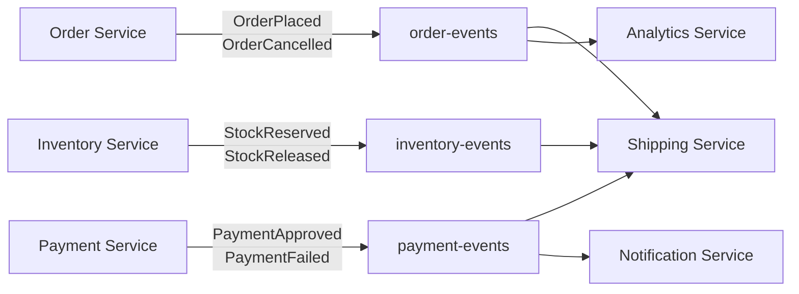

# 2. 이벤트 설계 개론 (Event Design Introduction)

이벤트 vs Command 구별, 4가지 설계 차원, DDD 기반 도메인 이벤트 식별. 선행: [01-kafka-streams-intro.md](./01-kafka-streams-intro.md).

---

## 1. 이벤트란 무엇인가

소프트웨어 시스템에서 "이벤트"라는 단어는 UI 클릭, 네트워크 패킷, 로그 항목 등 다양한 의미로 쓰인다. 하지만 Kafka 기반 아키텍처에서 말하는 이벤트는 이보다 훨씬 구체적인 정의를 갖는다. **이벤트는 비즈니스 도메인에서 실제로 발생한 사실(fact)의 기록이다.** 주문이 접수됐다, 결제가 완료됐다, 사용자가 구독을 해지했다 — 이런 사실들이 이벤트다.

이벤트의 핵심 속성은 **불변성(immutability)**이다. 과거에 일어난 일은 되돌릴 수 없기 때문에, 이벤트도 한번 기록되면 수정하지 않는다. "주문이 취소됐다"는 새로운 이벤트를 추가하는 것이지, 기존 "주문이 접수됐다" 이벤트를 수정하는 게 아니다. 이 불변성 덕분에 Kafka 토픽에 저장된 이벤트 로그는 시스템의 진실 원본(source of truth)이 된다.

### Command vs Event

Command와 Event는 겉보기에 비슷하지만 의미가 정반대다.

**Command(명령)**는 미래에 어떤 일이 일어나길 요청하는 메시지다. "주문을 처리하라(ProcessOrder)", "재고를 차감하라(DeductInventory)" 같은 형태다. Command는 수신자가 거부할 수 있다. 재고가 부족하면 DeductInventory 명령은 실패한다.

**Event(이벤트)**는 이미 일어난 일의 기록이다. "주문이 처리됐다(OrderProcessed)", "재고가 차감됐다(InventoryDeducted)" 형태다. 이벤트는 거부할 수 없다. 이미 발생한 사실이기 때문이다.

```
Command: PlaceOrder     → (처리 성공하면) → Event: OrderPlaced
Command: CancelOrder    → (처리 성공하면) → Event: OrderCancelled
Command: DeductStock    → (처리 성공하면) → Event: StockDeducted
```

Kafka를 쓸 때 이 구분이 중요한 이유는 **토픽 설계 방향**이 달라지기 때문이다. Command 토픽은 특정 서비스가 소비해야 할 요청을 담고, 소비자는 하나다. Event 토픽은 도메인에서 발생한 사실을 담고, 여러 소비자가 각자의 관심사에 따라 구독한다. 결제 서비스, 알림 서비스, 분석 서비스가 모두 `OrderPlaced` 이벤트를 독립적으로 소비할 수 있다.

---

## 2. 이벤트 설계가 중요한 이유

이벤트 설계는 단순히 "어떤 필드를 JSON에 넣을까" 수준의 결정이 아니다. 이벤트 구조는 **토픽 수, 소비자 결합도, 스키마 진화 비용, 시스템 전체 유연성**에 직접 영향을 미친다.

구체적인 예를 보자. 사용자 서비스에서 사용자 정보가 변경될 때마다 이벤트를 발행한다고 하자.

**나쁜 설계**: 이름이 바뀌면 `UserNameChanged`, 이메일이 바뀌면 `UserEmailChanged`, 플랜이 바뀌면 `UserPlanChanged`를 각각 별도 토픽에 발행한다. 처음에는 깔끔해 보이지만, 소비자가 사용자의 전체 상태를 알고 싶다면 세 토픽을 모두 구독하고 직접 조합해야 한다. 토픽이 늘어날수록 운영 복잡도가 선형으로 증가한다.

**좋은 설계**: 어떤 필드가 바뀌든 `user-profile-updated` 단일 토픽에 발행하고, 이벤트 안에 변경된 내용을 담는다. 소비자는 자신이 관심 있는 필드만 읽으면 된다. 토픽 하나로 모든 소비자를 충족시킬 수 있다.

잘못된 이벤트 설계의 대가는 크다. Kafka 토픽은 한번 소비자가 붙으면 구조를 바꾸기 어렵다. 프로덕션 토픽의 이벤트 구조를 바꾸려면 소비자 마이그레이션, 다운타임 조율, 스키마 버전 관리가 따라온다. **설계 단계에서 10분 더 고민하는 것이 운영 단계에서 2주를 절약하는 것보다 낫다.**

---

## 3. 4가지 이벤트 설계 차원

Confluent Event Design 코스는 이벤트를 설계할 때 반드시 결정해야 하는 4가지 차원(Dimension)을 제시한다. 이 차원들은 독립적이지 않으며 서로 영향을 주지만, 각각을 별도로 이해하는 것이 먼저다.

### Dimension 1: Facts vs Deltas (전체 상태 vs 변경분)

Fact 이벤트는 엔티티의 **현재 전체 상태**를 담는다. 소비자는 이 이벤트 하나만 보면 해당 엔티티의 현재 상태를 알 수 있다. 반면 Delta 이벤트는 **변경된 부분만** 담는다. 소비자는 이전 이벤트들과 조합해야 현재 상태를 알 수 있다.

어떤 걸 선택할지는 03번 문서에서 상세히 다룬다.

### Dimension 2: Normalized vs Denormalized (정규화 vs 비정규화)

데이터베이스에서 정규화는 중복을 제거하고 데이터를 여러 테이블에 분리하는 것을 뜻한다. 이벤트 설계에서도 같은 개념이 적용된다.

**Normalized 이벤트**는 엔티티의 고유 정보만 포함한다. 예를 들어 주문 이벤트에 `customerId`만 있고 고객 이름/이메일은 없다. 소비자가 고객 정보를 원하면 별도로 조회해야 한다.

**Denormalized 이벤트**는 소비자가 필요한 정보를 모두 포함한다. 주문 이벤트에 `customerId`, `customerName`, `customerEmail`이 모두 있다. 소비자는 추가 조회 없이 처리가 완료된다.

정규화된 이벤트는 일관성(데이터가 한 곳에만 존재)을 보장하지만 소비자 복잡도가 높아진다. 비정규화된 이벤트는 소비자 처리가 단순하지만, 고객 이름이 바뀌면 기존 이벤트의 고객 이름은 이미 "오래된 스냅샷"이 된다. 이 trade-off는 시스템의 일관성 요구사항과 소비자 독립성 중 무엇이 더 중요한지에 따라 결정된다.

### Dimension 3: Single vs Multiple Event Types per Stream (단일 vs 다중 이벤트 타입)

하나의 토픽에 하나의 이벤트 타입만 담을지, 여러 이벤트 타입을 함께 담을지의 결정이다.

**Single Event Type**: `order-placed` 토픽에는 `OrderPlaced` 이벤트만 있다. 스키마가 단순하고, 소비자는 항상 동일한 구조의 이벤트를 처리한다.

**Multiple Event Types**: `order-events` 토픽에 `OrderPlaced`, `OrderShipped`, `OrderCancelled`가 모두 있다. 특정 주문의 생명주기를 하나의 토픽에서 추적할 수 있다. Kafka Streams로 같은 `orderId`의 이벤트를 스트림 처리할 때 유리하다. 하지만 소비자는 `type` 필드를 보고 분기해야 하고, 스키마 관리가 복잡해진다. Schema Registry의 Union 스키마나 Header를 활용해 해결할 수 있다.

### Dimension 4: Discrete vs Continuous (이산 vs 연속 이벤트 흐름)

이산(Discrete) 이벤트는 명확한 비즈니스 사건을 나타낸다. "주문 접수", "배송 시작" 같이 뚜렷한 트리거가 있는 이벤트다.

연속(Continuous) 이벤트는 시간에 따라 지속적으로 생성되는 이벤트다. IoT 센서 온도 데이터, 주식 가격 변동, 사용자 마우스 이동 같은 데이터가 여기에 해당한다. 이런 이벤트는 개별 이벤트보다 **집계(aggregation)와 윈도우(window) 연산**이 중요하다. "최근 5분간 평균 온도", "1분 이내 클릭 횟수" 같은 질문에 답하는 것이 목적이다.

---

## 4. 도메인 매핑: DDD에서 이벤트 스트림으로

좋은 이벤트를 설계하려면 도메인을 먼저 이해해야 한다. Domain-Driven Design(DDD)에서 사용하는 **Bounded Context** 개념이 출발점이 된다.

Bounded Context는 특정 비즈니스 도메인의 경계다. 이커머스 시스템이라면 주문(Order), 재고(Inventory), 결제(Payment), 배송(Shipping)이 각각 Bounded Context가 될 수 있다. 각 Bounded Context는 자신의 도메인 모델과 언어를 갖는다.

### Event Storming 접근법

Event Storming은 도메인 전문가와 개발자가 함께 도메인 이벤트를 발견하는 워크숍 기법이다. 포스트잇을 사용해 비즈니스에서 발생하는 모든 사건을 시간 순으로 나열하는 것으로 시작한다.

```
[주문 접수됨] → [재고 확인됨] → [결제 승인됨] → [포장됨] → [배송 시작됨] → [배송 완료됨]
```

이렇게 나열한 이벤트에서 **Bounded Context의 경계**가 자연스럽게 드러난다. 주문 컨텍스트는 "주문 접수됨"까지, 재고 컨텍스트는 "재고 확인됨"을, 결제 컨텍스트는 "결제 승인됨"을 담당한다.

### 이벤트 → 토픽 매핑

Bounded Context가 식별되면 이를 Kafka 토픽으로 매핑한다. 일반적인 규칙은 다음과 같다.

- Bounded Context당 하나 이상의 토픽
- 토픽 이름은 도메인 언어를 반영 (`order-events`, `payment-events`, `inventory-updates`)
- 같은 엔티티의 이벤트는 같은 토픽에 (파티션 키로 순서 보장)



이 구조에서 각 서비스는 자신의 Bounded Context 안에서만 이벤트를 발행하고, 다른 서비스의 이벤트를 구독한다. 서비스 간 직접 HTTP 호출이 없기 때문에 느슨한 결합이 자연스럽게 달성된다.

---

## 5. 이벤트 메타데이터 표준

이벤트의 비즈니스 데이터(payload) 외에도, 이벤트를 추적하고 관리하기 위한 메타데이터가 필요하다. CloudEvents 표준(CNCF)은 다음 필드를 권장한다.

| 필드 | 타입 | 설명 | 예시 |
|------|------|------|------|
| `id` | String | 이벤트 고유 식별자 (UUID) | `"550e8400-e29b-41d4-a716-446655440000"` |
| `type` | String | 이벤트 타입 (역도메인 표기) | `"com.example.order.placed"` |
| `source` | URI | 이벤트 발행 서비스 | `"/order-service"` |
| `time` | RFC3339 | 이벤트 발생 시각 | `"2024-01-15T09:30:00Z"` |
| `datacontenttype` | String | 페이로드 타입 | `"application/json"` |
| `subject` | String | 이벤트 대상 엔티티 ID | `"order-12345"` |

**프로젝트별로 추가 권장하는 필드**:

- `correlationId`: 하나의 비즈니스 트랜잭션을 추적하는 ID. 주문 접수부터 배송 완료까지 같은 `correlationId`를 공유하면 분산 추적이 가능하다.
- `causationId`: 이 이벤트를 유발한 이전 이벤트의 `id`. 이벤트 체인의 인과관계를 추적하는 데 쓰인다.
- `version`: 이벤트 스키마 버전. 소비자가 스키마 진화에 대응하는 데 활용한다.

```json
{
  "id": "550e8400-e29b-41d4-a716-446655440000",
  "type": "com.example.order.placed",
  "source": "/order-service",
  "time": "2024-01-15T09:30:00Z",
  "subject": "order-12345",
  "correlationId": "txn-98765",
  "causationId": null,
  "version": "1.0",
  "data": {
    "orderId": "order-12345",
    "customerId": "cust-567",
    "items": [
      { "productId": "prod-001", "quantity": 2, "price": 29900 }
    ],
    "totalAmount": 59800
  }
}
```

메타데이터를 Kafka 메시지 헤더에 넣을지, 페이로드 안에 포함할지는 팀의 선택이다. Kafka 헤더에 넣으면 소비자가 페이로드를 역직렬화하지 않고도 라우팅 결정을 내릴 수 있어서 효율적이다. 하지만 일부 레거시 클라이언트는 헤더를 지원하지 않으므로 팀 상황에 따라 결정한다.

---

## 6. 스키마 진화 전략

이벤트 설계에서 종종 간과되는 부분이 스키마 진화(schema evolution)다. 처음 설계한 이벤트 구조는 시간이 지나면서 반드시 변경된다. 새 필드가 추가되거나, 기존 필드의 타입이 바뀌거나, 더 이상 필요 없는 필드가 생긴다.

Kafka에서 스키마 변경이 까다로운 이유는 **토픽에 이미 저장된 과거 이벤트는 바꿀 수 없기** 때문이다. 새 소비자가 오래된 이벤트를 처음부터 읽을 수도 있고, 구 소비자가 새 형식의 이벤트를 받을 수도 있다. 이 두 가지 방향 모두를 고려해야 한다.

### Forward Compatibility (전방 호환성)

구 소비자가 새 형식의 이벤트를 처리할 수 있는 상태를 뜻한다. 예를 들어 발행자가 이벤트에 새 필드 `referralCode`를 추가했다. 구 소비자는 이 필드를 모르지만 이벤트를 처리하는 데 지장이 없다. 모르는 필드를 무시하도록 소비자를 설계하면 전방 호환성이 달성된다.

Avro Schema Registry에서 `FORWARD` 호환성 모드를 설정하면, 새 스키마를 등록할 때 구 소비자가 읽을 수 있는지를 자동으로 검증한다.

### Backward Compatibility (후방 호환성)

새 소비자가 구 형식의 이벤트(토픽에 오래전부터 쌓여있는 이벤트)를 처리할 수 있는 상태를 뜻한다. 새 스키마에 기본값이 있는 필드를 추가하거나, 기존 필드를 optional로 변경하면 후방 호환성이 유지된다. Avro에서는 새 필드에 `default` 값을 반드시 지정해야 후방 호환이 보장된다.

```json
// 기존 스키마 (v1)
{ "name": "orderId", "type": "string" }

// 후방 호환 변경 (v2): 기본값이 있는 필드 추가 → OK
{ "name": "referralCode", "type": ["null", "string"], "default": null }

// 후방 호환 위반 (v2): 기본값 없는 필드 추가 → 구 이벤트 읽기 실패
{ "name": "requiredNewField", "type": "string" }
```

### 실전 권장 전략

대부분의 팀에서 `FULL` 호환성(전방+후방 모두)을 목표로 삼는다. 새 필드는 항상 optional + 기본값으로 추가하고, 기존 필드는 삭제 대신 deprecated 주석을 달고 장기간 유지한다. 필드 타입 변경이 불가피하다면 새 필드 이름으로 추가하고 구 필드를 병행 발행하는 기간을 둔 뒤 구 필드를 제거한다.

---

## 7. 토픽 파티션 전략

이벤트 설계와 함께 결정해야 하는 것이 토픽 파티션 전략이다. 파티션은 Kafka의 병렬 처리 단위이고, 같은 파티션 안에서만 이벤트 순서가 보장된다.

### 파티션 키 선택

파티션 키는 어떤 이벤트가 같은 파티션에 들어가야 하는지를 결정한다. 기본 원칙은 **순서가 중요한 이벤트들이 같은 파티션에 들어가도록** 키를 잡는 것이다.

주문 이벤트라면 `orderId`가 파티션 키가 되어야 한다. 같은 주문의 `OrderPlaced → OrderShipped → OrderDelivered` 이벤트가 반드시 순서대로 처리되어야 하기 때문이다. `customerId`를 키로 쓰면 한 고객의 여러 주문 이벤트가 같은 파티션에 들어가는데, 이는 필요 이상으로 범위를 넓힌다.

파티션 키가 없으면(null) Kafka는 이벤트를 라운드 로빈으로 여러 파티션에 분산한다. 순서가 중요하지 않은 이벤트(예: 독립적인 로그 이벤트)에는 이 방식이 파티션 간 부하를 고르게 분산한다.

### 핫 파티션 문제

파티션 키 분포가 불균등하면 특정 파티션에 이벤트가 몰리는 핫 파티션이 생긴다. 예를 들어 플랫폼 내에서 특별히 활발한 판매자가 있다면, 그 판매자의 `sellerId`를 키로 쓸 경우 해당 파티션만 과부하를 받는다. 이 경우 `sellerId + timestamp의 분 단위`처럼 복합 키를 써서 분산시키는 전략을 쓰기도 한다. 단, 복합 키를 쓰면 같은 엔티티의 이벤트 순서 보장 범위가 달라질 수 있으므로 신중하게 결정해야 한다.

---

## 8. 이벤트 네이밍 컨벤션

이벤트 이름은 시스템의 공통 언어(Ubiquitous Language)가 된다. 나쁜 이름은 도메인 지식 전달을 방해하고, 소비자가 이벤트의 의미를 오해하게 만든다.

좋은 이벤트 이름의 특징은 **과거형 동사 + 명사** 구조다. 이미 발생한 사실을 나타내기 때문이다.

```
좋은 예:
  OrderPlaced       (주문이 접수됐다)
  PaymentApproved   (결제가 승인됐다)
  InventoryReserved (재고가 예약됐다)
  UserSubscribed    (사용자가 구독했다)

나쁜 예:
  OrderEvent        (너무 모호하다 — 무슨 일이 일어났는가?)
  UpdateUser        (현재형 동사 — Command처럼 보인다)
  UserData          (명사만 — 이벤트인지 쿼리 결과인지 알 수 없다)
```

토픽 이름은 이벤트 이름보다 범위가 넓을 수 있다. `order-events` 토픽에 여러 이벤트 타입이 들어갈 수 있고, `order-placed` 토픽에는 단일 타입만 들어갈 수 있다. 팀의 토픽 전략(단일 vs 다중 이벤트 타입)에 따라 토픽 이름 규칙도 달라진다.

---

## 9. 실전 체크리스트

이벤트를 설계할 때 아래 질문들을 순서대로 답하면 핵심 결정이 자연스럽게 이루어진다.

**도메인 분석 단계**
- 이 이벤트가 속하는 Bounded Context는 어디인가?
- 이 이벤트를 발행하는 서비스(source)는 하나인가, 여럿인가?
- 이 이벤트를 소비하는 서비스는 몇 개이고, 각자 무엇이 필요한가?

**설계 차원 결정 단계**
- Fact(전체 상태)와 Delta(변경분) 중 어떤 형태가 소비자에게 더 적합한가?
- 소비자가 추가 조회 없이 처리하려면 어떤 정보를 포함해야 하는가(Denormalization 수준)?
- 이 토픽에 단일 이벤트 타입만 담을지, 엔티티의 여러 생명주기 이벤트를 담을지?
- 이벤트가 명확한 비즈니스 사건인지, 아니면 지속적으로 발생하는 데이터 흐름인지?

**메타데이터 단계**
- `id`, `type`, `source`, `time`은 반드시 포함됐는가?
- 분산 추적을 위해 `correlationId`가 필요한가?
- 스키마 버전 관리 전략은 무엇인가?

**파티션/스키마 단계**
- 파티션 키가 순서 보장이 필요한 이벤트들을 같은 파티션에 모으는가?
- 스키마 호환성 모드(`BACKWARD`, `FORWARD`, `FULL`)는 결정됐는가?
- 새 필드 추가 시 기본값이 있는가?

---

## 10. 이벤트 설계 안티패턴

좋은 설계를 이해하는 또 다른 방법은 나쁜 설계가 왜 문제인지를 살펴보는 것이다. 실제 프로젝트에서 자주 발생하는 안티패턴 네 가지를 정리한다.

### 안티패턴 1: 데이터베이스 테이블을 그대로 이벤트로 내보내기

가장 흔한 실수는 DB 테이블의 행(row) 변경 이벤트를 그대로 Kafka에 발행하는 것이다. `INSERT/UPDATE/DELETE` 연산과 바뀐 컬럼을 그대로 이벤트로 만든다. 이렇게 하면 토픽이 내부 DB 스키마에 강하게 결합된다. 테이블 구조가 바뀌면 이벤트 구조도 바뀌고, 모든 소비자가 영향을 받는다.

올바른 접근은 도메인 이벤트 관점에서 "비즈니스적으로 무슨 일이 일어났는가"를 표현하는 것이다. DB 테이블 `users`에서 `subscription_tier` 컬럼이 바뀐 것은 내부 구현 세부사항이다. 소비자가 알아야 할 것은 `UserSubscriptionChanged` 도메인 이벤트다.

### 안티패턴 2: 이벤트를 RPC처럼 쓰기

이벤트를 발행하고 소비자의 응답을 동기적으로 기다리는 패턴이다. 이를 "이벤트 기반 RPC"라고 부르는데, Kafka의 비동기 특성을 완전히 무력화한다. 응답 토픽을 별도로 만들고 `correlationId`로 요청과 응답을 매핑하는 방식이 대표적이다.

이 패턴이 필요하다면 Kafka 대신 gRPC나 REST API를 쓰는 것이 더 적합하다. Kafka는 단방향 이벤트 흐름에 최적화되어 있다. ReplyingKafkaTemplate처럼 응답 패턴을 지원하는 도구도 있지만, 사용 범위를 좁게 제한하고 남용하지 않아야 한다.

### 안티패턴 3: 과도하게 세분화된 이벤트

모든 필드 변경을 별도 이벤트로 쪼개는 것이다. `UserNameChanged`, `UserEmailChanged`, `UserPhoneChanged`를 각각 다른 토픽에 발행하면 토픽 수가 폭발적으로 늘어난다. 소비자는 사용자의 현재 상태를 알려면 세 토픽을 모두 구독하고 조인해야 한다.

반대로 너무 뭉뚱그린 이벤트(`EverythingChanged`)도 좋지 않다. 적절한 수준은 비즈니스 사건의 경계를 따르는 것이다. "사용자 프로필 전체가 업데이트됐다"는 하나의 비즈니스 사건이므로 `UserProfileUpdated` 하나로 충분하다.

### 안티패턴 4: 이벤트에 처리 지시 포함

이벤트 안에 소비자가 무엇을 해야 하는지를 지시하는 필드를 넣는 것이다. `{"action": "send_email", "template": "welcome", ...}` 같은 형태다. 이렇게 하면 발행자가 소비자의 내부 로직을 알아야 하고, 새 소비자를 추가할 때마다 이벤트 구조를 바꿔야 한다.

이벤트는 "무슨 일이 일어났는가"만 담아야 한다. "무엇을 해야 하는가"는 소비자가 자신의 비즈니스 로직에 따라 결정한다. `UserRegistered` 이벤트를 받은 알림 서비스는 자체 규칙으로 환영 이메일을 보내고, 쿠폰 서비스는 가입 쿠폰을 발행한다. 발행자는 이 사실을 알 필요가 없다.

---

## 11. Kafka Streams와의 연결

이 문서에서 다룬 개념들은 Kafka Streams로 이벤트를 처리할 때 직접 연결된다.

**4가지 설계 차원과 Kafka Streams 추상화의 대응**:

| 설계 차원 | Kafka Streams 추상화 |
|-----------|---------------------|
| Facts | `KTable` (각 키의 최신 값) |
| Deltas | `KStream` + `aggregate()` |
| Normalized | `KStream-KTable Join` (enrichment) |
| Denormalized | 단순 `KStream` 처리 (조인 불필요) |
| Single Event Type | 단일 Serde 설정 |
| Multiple Event Types | `branch()` 또는 헤더 기반 라우팅 |
| Discrete | `KStream` (이벤트 단위 처리) |
| Continuous | `KStream` + `windowed aggregate()` |

이 대응 관계를 이해하면 이벤트 설계 단계에서 Kafka Streams 토폴로지가 얼마나 복잡해질지를 미리 가늠할 수 있다. Fact 이벤트를 쓰면 토폴로지가 단순해지고, Delta 이벤트를 쓰면 집계 로직이 추가된다. Normalized 이벤트를 쓰면 조인이 필요하고, Denormalized 이벤트를 쓰면 조인 없이 처리가 끝난다.

---

## Redpanda 호환성 노트

- Redpanda는 Kafka API와 완전 호환이므로 이벤트 설계 원칙이 그대로 적용된다. 토픽 이름 규칙, 파티션 키 전략, 이벤트 구조 모두 동일하다.
- Schema Registry가 Redpanda에 내장되어 있어 별도 Schema Registry 컨테이너를 띄우지 않아도 된다. `localhost:18081` (기본 포트)로 접근한다.
- CloudEvents 표준과 Redpanda 사이에 특별한 호환성 이슈는 없다. 이벤트 구조는 JSON이든 Avro든 동일하게 직렬화된다.
- Redpanda의 멀티테넌시(namespaces) 기능을 활용하면 Bounded Context별로 네임스페이스를 분리하여 운영할 수 있다 (기본 설정에서는 사용하지 않음).
- Redpanda Schema Registry의 호환성 모드 설정은 `rpk registry compatibility-level set --subject {subject} --level FULL` 명령으로 변경한다.

---

## 12. 4가지 차원 간의 상호작용

4가지 설계 차원은 독립적으로 결정되는 것처럼 보이지만, 실제로는 서로 영향을 주고받는다. 한 차원의 선택이 다른 차원의 선택을 강제하거나 제약하는 경우가 많다.

**Facts + Denormalized 조합**: Fact 이벤트는 전체 상태를 담기 때문에 관련 엔티티 정보를 함께 포함하기 쉽다. 주문 Fact 이벤트에 고객 이름과 이메일을 함께 담으면 소비자는 추가 조회 없이 처리가 끝난다. 이 조합이 소비자 복잡도를 가장 낮추지만, 페이로드가 가장 크고 데이터 일관성 문제(오래된 스냅샷)가 생긴다.

**Deltas + Normalized 조합**: Delta 이벤트는 변경분만 담으므로 자연스럽게 정규화된다. 주문 Delta 이벤트에 `customerId`만 있고 고객 이름이 없다면, 소비자는 별도로 고객 정보를 조회해야 한다. Kafka Streams의 KTable 조인을 통해 이 조회를 스트림 처리 내에서 해결할 수 있다.

**Multiple Event Types + Discrete 조합**: 주문 생명주기 이벤트(`OrderPlaced`, `OrderShipped`, `OrderDelivered`)를 단일 토픽에 담는 방식은 각 이벤트가 뚜렷한 비즈니스 사건(Discrete)인 경우에 자연스럽다. 이 조합은 Kafka Streams로 특정 주문의 전체 생명주기를 추적하기 편리하다.

**Single Event Type + Continuous 조합**: IoT 센서 데이터처럼 동일한 구조의 이벤트가 지속적으로 발생하는 경우, 토픽에 단일 이벤트 타입만 담는 것이 자연스럽다. 윈도우 집계나 이동 평균 같은 연속 처리에 최적화된 구조다.

차원 조합을 선택할 때 "소비자가 무엇을 필요로 하는가"를 기준으로 역방향으로 결정하면 혼선이 줄어든다. 소비자 요구사항이 명확해지면 나머지 차원은 자연스럽게 따라온다.

---

## 13. 이벤트 설계 문서화

설계 결정은 코드에만 있어서는 안 된다. 이벤트 구조, 선택 이유, 소비자 목록을 문서화해두면 팀 온보딩과 유지보수가 훨씬 쉬워진다.

최소한으로 갖춰야 할 이벤트 문서의 내용은 다음과 같다.

**이벤트 카탈로그 항목 예시**:

```markdown
## OrderPlaced

**토픽**: order-events
**파티션 키**: orderId
**스키마**: order-events-value (Schema Registry subject)
**발행 조건**: 고객이 주문을 최종 확정했을 때
**발행자**: order-service

**페이로드 예시**:
{
  "orderId": "ord-9001",
  "customerId": "cust-123",
  "items": [...],
  "totalAmount": 59800,
  "placedAt": "2024-01-15T10:00:00Z"
}

**소비자**:
- payment-service: 결제 승인 요청 생성
- notification-service: 주문 접수 이메일 발송
- analytics-service: 매출 집계

**설계 결정**:
- Fact 이벤트 선택 이유: 소비자 3개 모두 전체 주문 상태 필요
- customerId만 포함(Normalized): 고객 정보는 customer-events KTable 조인으로 enrichment
```

이런 카탈로그가 있으면 새 소비자를 추가할 때 토픽 구조를 파악하기 위해 코드를 뒤질 필요가 없다. 또한 설계 변경 시 영향받는 소비자를 즉시 파악할 수 있어서 하위 호환성 검토가 쉬워진다.

---

## 체크포인트

- [ ] Command와 Event의 차이를 예시 하나로 설명할 수 있다
- [ ] 이벤트의 불변성(immutability)이 시스템 설계에 어떤 의미인지 이해한다
- [ ] 4가지 설계 차원(Facts/Deltas, Normalized/Denormalized, Single/Multiple Types, Discrete/Continuous)의 이름과 의미를 알고 있다
- [ ] Event Storming을 통해 도메인 이벤트를 Kafka 토픽으로 매핑하는 프로세스를 따라갈 수 있다
- [ ] 이벤트 표준 메타데이터 필드(`id`, `type`, `source`, `time`, `correlationId`)의 역할을 설명할 수 있다
- [ ] Redpanda의 내장 Schema Registry 주소(`:18081`)를 기억한다
