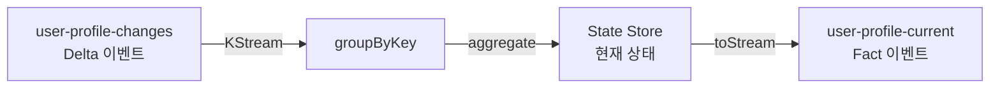
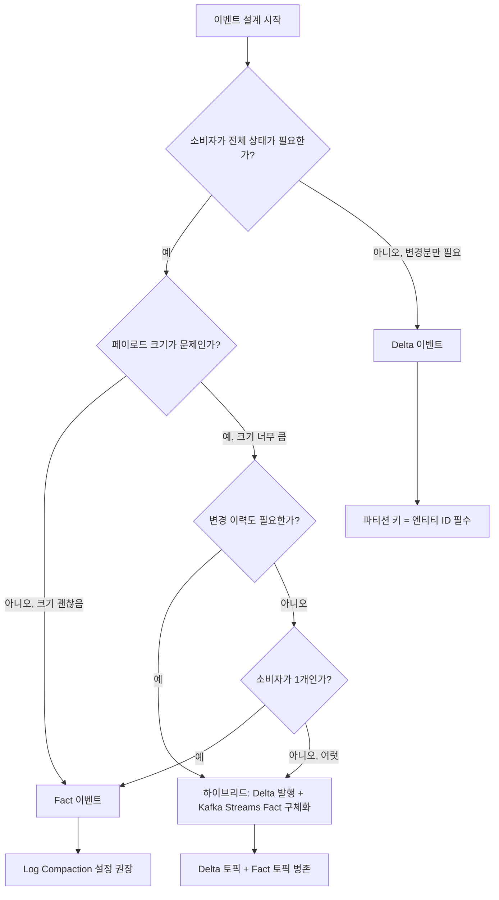

# 3. Facts vs Deltas — 전체 상태와 변경분

Fact/Delta 이벤트 비교, KTable + Log Compaction 시너지, `aggregate()`로 상태 복원. 선행: [02-event-design-intro.md](./02-event-design-intro.md).

---

## 1. Fact 이벤트: 엔티티의 현재 전체 상태

Fact 이벤트는 발행 시점의 엔티티 전체 상태를 담는다. 소비자는 이 이벤트 하나만으로 해당 엔티티의 현재 상태를 파악할 수 있다. 이전 이벤트를 참조하거나 상태를 별도로 유지할 필요가 없다.

사용자 프로필을 예로 들면, Fact 이벤트는 다음처럼 생겼다.

```json
{
  "eventId": "evt-001",
  "type": "UserProfileUpdated",
  "time": "2024-01-15T10:00:00Z",
  "userId": "user-123",
  "name": "김철수",
  "email": "kim@example.com",
  "plan": "premium",
  "phone": "010-1234-5678",
  "address": "서울시 강남구",
  "createdAt": "2023-06-01T09:00:00Z"
}
```

사용자가 이메일 주소만 바꿨더라도 Fact 이벤트에는 모든 필드가 포함된다. 소비자 입장에서는 "현재 user-123의 상태는 이 이벤트에 있는 그대로다"라고 확신할 수 있다.

Fact 이벤트의 가장 큰 강점은 **소비자 독립성**이다. 결제 서비스, 알림 서비스, 검색 인덱스 서비스가 각각 이 이벤트를 구독하더라도, 모두 이 이벤트 하나로 필요한 정보를 얻는다. 어떤 소비자도 사용자 서비스에 별도로 API를 호출해서 현재 상태를 물어볼 필요가 없다.

---

## 2. Delta 이벤트: 변경된 부분만

Delta 이벤트는 변경된 필드만 담는다. 같은 사용자가 이메일을 바꿨다면 Delta 이벤트는 이렇게 생겼다.

```json
{
  "eventId": "evt-002",
  "type": "UserProfileChanged",
  "time": "2024-01-15T10:05:00Z",
  "userId": "user-123",
  "changes": {
    "email": "new.kim@example.com"
  }
}
```

페이로드가 훨씬 작다. 하지만 소비자가 "user-123의 현재 이름은 무엇인가?"를 알려면 이전에 발행된 이벤트들을 모두 누적해야 한다. 첫 이벤트에서 `name: "김철수"`가 설정됐고, 이후 이름 변경 이벤트가 없었다면 지금도 "김철수"다. 소비자는 이 히스토리를 직접 추적해야 한다.

Delta 이벤트는 변경 이력을 자연스럽게 보존한다는 부수 효과가 있다. "사용자가 언제 어떤 필드를 바꿨는가"를 토픽에서 직접 조회할 수 있다. 이는 감사 로그(audit log)나 이벤트 소싱(event sourcing) 패턴에서 유용하다.

---

## 3. 비교: 어떤 상황에서 무엇을 선택할까

두 방식은 여러 기준에서 trade-off가 있다.

| 기준 | Fact 이벤트 | Delta 이벤트 |
|------|-------------|--------------|
| **페이로드 크기** | 크다 (전체 상태 포함) | 작다 (변경분만) |
| **소비자 복잡도** | 낮다 (이벤트 하나로 충분) | 높다 (상태 누적 필요) |
| **네트워크/스토리지 비용** | 높다 | 낮다 |
| **순서 의존성** | 낮다 (순서가 틀려도 최신 이벤트면 OK) | 높다 (순서 보장 필수) |
| **State Store 필요 여부** | 불필요 (단, 최신 이벤트만 필요) | 필요 (이전 상태 유지) |
| **변경 이력 보존** | 부분적 (Fact끼리의 diff로만 가능) | 자연스럽다 |
| **이벤트 소싱 패턴 적합성** | 낮다 | 높다 |

### 페이로드 크기가 미치는 실제 영향

사용자 프로필이 1KB짜리 Fact 이벤트라고 하자. 사용자 100만 명이 하루 평균 5번씩 상태 변경을 일으키면 하루 5GB가 토픽에 쌓인다. 실제 변경된 데이터는 평균 50바이트인데도 전체 상태를 항상 보내는 셈이다.

반면 Delta 이벤트를 쓰면 하루에 250MB(50바이트 × 5,000,000 이벤트)로 줄어든다. Kafka 보존 기간을 7일로 설정하면 Fact는 35GB, Delta는 1.75GB 차이가 난다. 클러스터 규모에 따라 이 차이가 인프라 비용에 직접 영향을 준다.

### 순서 의존성이 중요한 이유

Delta 이벤트는 순서에 민감하다. 사용자가 A→B→C 순으로 이메일을 바꿨는데, 소비자가 A→C→B 순으로 받으면 최종 상태가 B로 잘못 기록된다. Kafka는 같은 파티션 안에서는 순서를 보장하므로, Delta 이벤트를 쓸 때는 **같은 엔티티의 이벤트가 반드시 같은 파티션에 들어가도록** 파티션 키를 엔티티 ID(`userId` 등)로 설정해야 한다.

Fact 이벤트는 순서에 덜 민감하다. 여러 이벤트가 도착하면 가장 최신 `timestamp`를 가진 것이 현재 상태다. 단, 같은 시간에 두 이벤트가 동시에 발행됐다면 소비자가 어느 것을 "최신"으로 볼지 모호해질 수 있다. 이 경우에도 파티션 키를 엔티티 ID로 설정하는 것이 안전하다.

---

## 4. KTable과 Fact 이벤트의 관계

Kafka Streams의 KTable은 **토픽의 각 키에 대한 최신 값**을 나타내는 추상화다. KTable을 만들면 내부적으로 State Store에 각 키의 현재 값이 유지된다.

Fact 이벤트 토픽을 KTable로 읽으면 매우 자연스럽다. 각 이벤트 자체가 해당 엔티티의 전체 상태이므로, KTable은 "마지막으로 수신한 Fact 이벤트"를 각 키에 저장한다.

```java
// Fact 이벤트 토픽 → KTable (현재 사용자 상태 테이블)
KTable<String, UserProfile> userProfiles = builder.table(
    "user-profile-facts",
    Consumed.with(Serdes.String(), userProfileSerde),
    Materialized.as("user-profiles-store")
);

// 다른 스트림과 조인 가능
KStream<String, Order> orders = builder.stream("order-events", ...);
KStream<String, EnrichedOrder> enrichedOrders = orders.join(
    userProfiles,
    (order, profile) -> new EnrichedOrder(order, profile.getName(), profile.getEmail())
);
```

이 패턴의 장점은 `userProfiles` KTable이 항상 최신 사용자 상태를 갖고 있다는 점이다. 주문 이벤트가 도착하면 KTable에서 즉시 사용자 정보를 조회해 enrichment를 수행할 수 있다. 사용자 서비스에 HTTP 요청을 보낼 필요가 없다.

### Log Compaction과의 시너지

Kafka Log Compaction은 토픽에서 같은 키의 오래된 이벤트를 제거하고 마지막 이벤트만 보존하는 기능이다. 이는 Fact 이벤트 토픽에 최적이다.

```
시간 흐름 →
[user-123: 상태A] [user-123: 상태B] [user-123: 상태C]
                     ↓ Log Compaction
                  [user-123: 상태C]  ← 최신 상태만 보존
```

Log Compaction이 적용된 Fact 이벤트 토픽은 사실상 **각 엔티티의 현재 상태를 담은 분산 데이터베이스**처럼 동작한다. Kafka Streams의 KTable은 새로 시작할 때 이 토픽을 처음부터 읽어 State Store를 복원한다. Log Compaction이 없다면 처음부터 읽는 데 엄청난 시간이 걸리지만, Compaction이 적용된 토픽에서는 각 키의 최신 이벤트만 읽으므로 복원이 빠르다.

```yaml
# Log Compaction 설정 (Kafka/Redpanda 토픽 생성 시)
cleanup.policy: compact
min.cleanable.dirty.ratio: 0.5
delete.retention.ms: 86400000  # 삭제된 이벤트 24시간 보존
```

---

## 5. Delta 집계 패턴: Kafka Streams로 현재 상태 복원

Delta 이벤트를 사용하기로 했다면, 소비자가 현재 상태를 알고 싶을 때 Kafka Streams의 `aggregate()` 연산을 활용할 수 있다.



`aggregate()` 연산의 작동 방식은 이렇다. 같은 `userId`를 가진 Delta 이벤트들이 순서대로 도착하면, `aggregate()`는 누산기(accumulator) 객체에 각 Delta를 적용한다. 누산기는 처음에 빈 `UserProfile` 객체로 시작하고, Delta 이벤트를 받을 때마다 변경된 필드를 업데이트한다.

```java
KStream<String, UserProfileDelta> deltaStream = builder.stream(
    "user-profile-changes",
    Consumed.with(Serdes.String(), deltaProfileSerde)
);

KTable<String, UserProfile> currentState = deltaStream
    .groupByKey()
    .aggregate(
        // 초기값: 빈 프로필
        UserProfile::new,
        // 누산 로직: delta를 현재 상태에 적용
        (userId, delta, current) -> current.applyDelta(delta),
        // State Store 설정
        Materialized.<String, UserProfile, KeyValueStore<Bytes, byte[]>>as("user-profiles-store")
            .withKeySerde(Serdes.String())
            .withValueSerde(userProfileSerde)
    );
```

`applyDelta()` 메서드는 Delta에 포함된 필드만 현재 상태에 덮어쓴다.

```java
public UserProfile applyDelta(UserProfileDelta delta) {
    if (delta.getName() != null) this.name = delta.getName();
    if (delta.getEmail() != null) this.email = delta.getEmail();
    if (delta.getPlan() != null) this.plan = delta.getPlan();
    if (delta.getPhone() != null) this.phone = delta.getPhone();
    return this;
}
```

### 이벤트 소싱과의 유사성

이 패턴은 Event Sourcing과 구조적으로 닮았다. Event Sourcing에서는 엔티티의 현재 상태를 직접 저장하지 않고, 발생한 이벤트(도메인 이벤트)를 모두 저장한 뒤 재생(replay)하여 현재 상태를 도출한다.

Kafka Streams의 Delta 집계도 같은 원리다. `user-profile-changes` 토픽의 이벤트를 처음부터 재생하면 현재 사용자 상태를 복원할 수 있다. Kafka Streams 앱이 재시작하면 자동으로 State Store를 Kafka 토픽에서 복원한다는 점도 Event Sourcing의 재생 메커니즘과 같다.

차이점은 Event Sourcing은 보통 도메인 모델 레벨에서 이루어지지만, 여기서는 스트림 처리 레벨에서 이루어진다는 점이다. 도메인 서비스가 Delta를 발행하면, Kafka Streams 앱이 그 Delta를 집계하여 현재 상태를 유지한다.

---

## 6. 하이브리드 접근: 최선의 선택

Fact와 Delta 중 하나를 반드시 골라야 하는 것은 아니다. 많은 실제 시스템에서 두 방식을 조합한다.

**패턴 1: Delta로 발행 → Fact로 구체화**

발행 측은 Delta 이벤트만 보낸다 (네트워크 효율). Kafka Streams 앱이 Delta를 집계하여 Fact 이벤트를 별도 토픽에 발행한다. 소비자는 자신의 필요에 따라 Delta 토픽이나 Fact 토픽을 선택한다.

```
[user-profile-changes] (Delta, 작은 페이로드)
        ↓ Kafka Streams aggregate
[user-profile-current] (Fact, 전체 상태, Log Compacted)
```

- Delta 토픽을 구독하는 소비자: 변경 이력이 필요한 감사 서비스, 이벤트 소싱 기반 서비스
- Fact 토픽을 구독하는 소비자: 현재 상태만 필요한 검색 인덱스, 알림 서비스

**패턴 2: Fact로 발행 → State Store로 쿼리**

Fact 이벤트만 발행하고, Kafka Streams의 Interactive Query로 현재 상태를 조회한다. 별도의 데이터베이스 없이 State Store가 "현재 상태 저장소" 역할을 담당한다.

```java
// Interactive Query로 특정 사용자 현재 상태 조회
ReadOnlyKeyValueStore<String, UserProfile> store = streams.store(
    StoreQueryParameters.fromNameAndType("user-profiles-store", QueryableStoreTypes.keyValueStore())
);
UserProfile current = store.get("user-123");
```

---

## 7. 선택 가이드

실제 프로젝트에서 어떤 방식을 선택할지 결정하는 흐름이다.



간단한 경험칙을 하나 제시하면:

- **소비자가 적고, 엔티티가 작고, 현재 상태만 필요하다** → Fact
- **소비자가 많고, 엔티티가 크고, 네트워크 비용이 중요하다** → Delta 또는 하이브리드
- **감사 로그나 이벤트 소싱이 필요하다** → Delta (이력 보존) 또는 하이브리드

---

## 8. 운영 고려사항

설계를 마쳤다고 해도 실제로 운영하면서 부딪히는 문제들이 있다. 미리 알아두면 설계 단계에서 대비책을 마련할 수 있다.

### Fact 이벤트 토픽의 용량 계획

Fact 이벤트는 매 변경마다 전체 상태를 발행하므로 토픽이 빠르게 커진다. Log Compaction을 적용해도 Compaction이 실행되기 전까지는 중간 상태들이 모두 쌓인다. `min.cleanable.dirty.ratio`를 낮게 설정(예: 0.1)하면 Compaction이 더 자주 실행되어 용량을 줄일 수 있지만, 브로커 CPU 부하가 올라간다. 이 값은 클러스터 부하 패턴을 보면서 조정해야 한다.

Fact 이벤트 페이로드가 크면(수 KB 이상) 네트워크 대역폭도 문제가 된다. 이 경우 페이로드를 gzip으로 압축하거나(`compression.type=gzip`), 자주 바뀌지 않는 대용량 필드를 별도 참조 서비스로 분리하는 방안을 검토한다.

### Delta 이벤트의 상태 재구성 지연

새 Kafka Streams 인스턴스가 시작될 때 Delta 이벤트 토픽의 처음부터 읽어야 State Store를 채울 수 있다. 토픽에 이벤트가 수억 건 쌓여 있다면 재구성에 수 시간이 걸릴 수 있다. 이 "복원 지연" 동안에는 State Store가 불완전하여 Interactive Query 결과가 부정확할 수 있다.

대응 방법은 두 가지다. 첫째, Delta 이벤트와 별도로 주기적인 스냅샷 Fact 이벤트를 발행한다. 재구성 시 가장 최근 스냅샷부터 시작하면 된다. 둘째, Standby Replica를 설정한다(`num.standby.replicas=1`). 이 옵션은 다른 인스턴스가 State Store 복사본을 항상 최신 상태로 유지하여, 인스턴스 교체 시 복원 시간을 최소화한다.

### 스키마 진화와 applyDelta의 관계

Delta 이벤트 스키마에 새 필드가 추가되면 `applyDelta()` 메서드도 함께 변경해야 한다. 스키마 변경과 코드 변경이 항상 동기화되어야 한다는 뜻이다. 이를 잊으면 새 Delta 필드가 State Store에 반영되지 않는 조용한 버그가 생긴다. 이런 실수를 방지하려면 `applyDelta()`의 단위 테스트에서 모든 필드를 명시적으로 검증하는 습관이 중요하다.

---

## 9. 실제 사례: 전자상거래 주문 시스템

추상적인 설명보다 구체적인 사례로 두 방식이 어떻게 적용되는지 살펴본다.

### 시나리오

전자상거래 플랫폼에서 주문 상태가 변경될 때마다 이벤트를 발행한다. 주문 상태는 `PLACED → PAYMENT_CONFIRMED → PREPARING → SHIPPED → DELIVERED` 순으로 변한다. 이 외에도 주문 금액, 배송지 주소, 택배사 정보 등이 주문 생명주기 동안 업데이트된다.

**소비자 목록과 필요 정보**:

| 소비자 | 필요한 정보 | 관심 시점 |
|--------|-------------|-----------|
| 알림 서비스 | 상태 변경 + 고객 이메일 | 모든 상태 변경 |
| 배송 추적 서비스 | 현재 배송 상태 + 택배사 정보 | SHIPPED 이후 |
| 정산 서비스 | 최종 주문 금액 + 결제 정보 | DELIVERED 시점 |
| 분석 서비스 | 전체 주문 이력 | 항상 |

### Fact 이벤트로 설계할 경우

`order-events` 토픽에 상태가 변경될 때마다 주문의 전체 현재 상태를 발행한다.

```json
{
  "orderId": "ord-9001",
  "status": "SHIPPED",
  "customerId": "cust-123",
  "customerEmail": "kim@example.com",
  "items": [{"productId": "p-001", "qty": 2, "price": 29900}],
  "totalAmount": 59800,
  "shippingAddress": "서울시 강남구 ...",
  "carrier": "CJ대한통운",
  "trackingNumber": "12345678901",
  "paymentMethod": "카드",
  "paidAt": "2024-01-15T10:00:00Z",
  "updatedAt": "2024-01-16T14:30:00Z"
}
```

알림 서비스, 배송 추적 서비스, 정산 서비스 모두 이 이벤트 하나로 처리가 가능하다. 배송 추적 서비스는 `status`, `carrier`, `trackingNumber`만 쓰고, 나머지는 무시한다. 단순하지만, 주문이 SHIPPED로 바뀔 때마다 주문 전체 데이터(수백 바이트)가 토픽에 쌓인다.

### Delta 이벤트로 설계할 경우

상태가 변경될 때 변경된 부분만 발행한다.

```json
// PLACED → PAYMENT_CONFIRMED 전환 시
{
  "orderId": "ord-9001",
  "changes": {
    "status": "PAYMENT_CONFIRMED",
    "paymentMethod": "카드",
    "paidAt": "2024-01-15T10:00:00Z"
  }
}

// PAYMENT_CONFIRMED → SHIPPED 전환 시
{
  "orderId": "ord-9001",
  "changes": {
    "status": "SHIPPED",
    "carrier": "CJ대한통운",
    "trackingNumber": "12345678901"
  }
}
```

페이로드가 작다. 하지만 알림 서비스가 "SHIPPED" 이벤트를 받았을 때 고객 이메일을 보내려면 `customerEmail`이 없다. 이전에 발행된 `PLACED` 이벤트에서 이 정보를 가져와야 한다. 알림 서비스가 State Store를 유지하거나, 별도로 고객 서비스에 API를 호출해야 한다.

### 이 사례에서의 권장 선택

주문 이벤트는 하이브리드가 적합하다. 주문 서비스는 Delta 이벤트를 `order-changes` 토픽에 발행(네트워크 효율). Kafka Streams 앱이 이를 집계하여 `order-current` 토픽에 Fact 이벤트를 발행. 알림 서비스, 정산 서비스는 `order-current`를 구독. 분석 서비스는 전체 이력이 필요하므로 `order-changes`를 구독한다.

---

## Redpanda 호환성 노트

- Facts vs Deltas는 브로커와 무관한 설계 패턴이므로 Redpanda에서도 동일하게 적용된다.
- Log Compaction은 Redpanda에서 `cleanup.policy=compact`로 설정한다. Kafka와 동일한 설정 키를 사용한다.
- Delta 집계를 위한 Kafka Streams State Store는 내부적으로 RocksDB를 사용한다. Redpanda를 브로커로 쓸 때 State Store 복원을 위한 Changelog 토픽이 Redpanda에 자동 생성된다 (`{app-id}-{store-name}-changelog` 형식).
- Standby Replica(`num.standby.replicas`)는 Kafka Streams 설정이므로 브로커와 무관하게 Redpanda에서도 동일하게 작동한다.
- Interactive Query는 브로커와 독립적인 Kafka Streams 기능이므로 Redpanda와의 호환성 이슈는 없다.

---

## 10. 멱등성과 Facts/Deltas

분산 시스템에서는 네트워크 장애로 이벤트가 중복 발행될 수 있다. 생산자가 이벤트를 발행했지만 브로커 응답을 받지 못하면, 타임아웃 후 재시도하여 같은 이벤트가 두 번 토픽에 들어갈 수 있다. 이 상황에서 Fact 이벤트와 Delta 이벤트는 다르게 반응한다.

**Fact 이벤트의 멱등성**: 같은 Fact 이벤트가 두 번 발행되더라도 소비자 입장에서는 "같은 상태를 두 번 받은 것"이다. KTable은 자동으로 마지막으로 받은 값을 유지하므로, 중복 이벤트가 State Store 내용을 바꾸지 않는다. Fact 이벤트는 본질적으로 멱등적이다.

**Delta 이벤트의 멱등성 문제**: 같은 Delta 이벤트가 두 번 발행되면 소비자가 같은 변경을 두 번 적용할 수 있다. "잔액 +1000원" Delta가 두 번 처리되면 잔액이 2000원 증가한다. Delta 이벤트를 쓸 때는 중복 처리를 방지하는 별도 메커니즘이 필요하다.

해결 방법으로는 이벤트에 고유 `eventId`를 포함하고, 소비자가 처리한 `eventId`를 별도 저장소에 기록하여 중복 도착 시 건너뛰는 방식(preemptive acquire 패턴)이 있다. Kafka 생산자의 `enable.idempotence=true` 설정은 브로커 레벨의 중복을 방지하지만, 소비자 레벨의 중복(at-least-once 전달)은 별도로 처리해야 한다.

---

## 11. Tombstone 이벤트와 삭제 처리

엔티티가 삭제될 때 이벤트 처리는 Facts와 Deltas 모두에서 특별한 고려가 필요하다.

Kafka에서 **Tombstone 이벤트**는 값이 `null`인 이벤트다. Log Compaction 토픽에서 Tombstone 이벤트가 발행되면 해당 키의 모든 이전 이벤트가 Compaction 시 삭제 대상이 된다. 엔티티를 삭제할 때 Tombstone을 발행하는 것이 관례다.

```java
// 사용자 삭제 시 Tombstone 발행
producer.send(new ProducerRecord<>("user-profile-facts", "user-123", null));
```

소비자는 값이 `null`인 이벤트를 받으면 해당 엔티티가 삭제됐음을 인식하고 자신의 로컬 상태에서도 제거한다. KTable은 Tombstone을 자동으로 처리한다 — `null` 값의 이벤트가 오면 State Store에서 해당 키를 제거한다.

Delta 이벤트 방식에서 엔티티 삭제를 표현할 때는 `{"deleted": true}` 같은 명시적 필드를 쓰거나, 별도 `UserDeleted` 이벤트 타입을 쓰는 방법이 있다. Fact 이벤트 방식에서는 Tombstone이 더 자연스럽다.

---

## 12. 요약: 판단 기준 한 줄씩

긴 설명 끝에 핵심만 한 줄로 정리한다.

**Fact를 쓸 때**: 소비자가 "지금 이 엔티티의 상태가 무엇인가"만 알면 충분할 때.

**Delta를 쓸 때**: "무엇이 바뀌었는가", "언제 바뀌었는가"가 비즈니스적으로 중요할 때. 또는 페이로드가 너무 커서 전체 상태를 매번 보내기 어려울 때.

**하이브리드를 쓸 때**: 발행 측은 네트워크 효율이 중요하고, 소비자 측은 현재 상태 접근이 편리해야 할 때. 두 요구사항을 동시에 만족시키는 유일한 방법이다.

어떤 방식을 선택했든, 파티션 키를 엔티티 ID로 고정하고 Schema Registry로 스키마 호환성을 관리하는 것은 공통 원칙이다.

---

## 체크포인트

- [ ] Fact 이벤트와 Delta 이벤트의 구조적 차이를 JSON 예시로 설명할 수 있다
- [ ] 페이로드 크기, 소비자 복잡도, 순서 의존성 기준으로 두 방식을 비교할 수 있다
- [ ] KTable이 Fact 이벤트 토픽을 읽을 때 어떤 이점이 있는지 이해한다
- [ ] Log Compaction이 Fact 이벤트 토픽에서 어떤 역할을 하는지 설명할 수 있다
- [ ] Kafka Streams `aggregate()`로 Delta를 현재 상태로 누적하는 코드 패턴을 따라갈 수 있다
- [ ] 하이브리드 접근(Delta 발행 → Kafka Streams Fact 구체화)이 왜 유용한지 설명할 수 있다
- [ ] Fact 이벤트가 Delta보다 중복 처리(멱등성)에 유리한 이유를 설명할 수 있다
- [ ] Tombstone 이벤트가 무엇이고 KTable에서 어떻게 처리되는지 이해한다
- [ ] 자신의 프로젝트에서 Fact, Delta, 하이브리드 중 어떤 방식을 선택할지 근거와 함께 말할 수 있다
