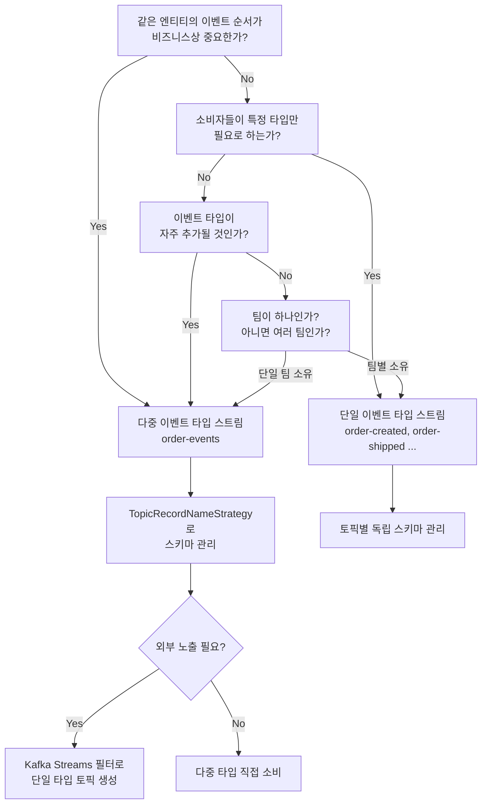

# 7. 단일 스트림 vs 다중 스트림 — 이벤트 타입과 토픽 설계

단일/다중 이벤트 타입 토픽 설계 비교, Avro Union + TopicRecordNameStrategy, 순서 보장 트레이드오프. 선행: [05-normalized-vs-denormalized.md](./05-normalized-vs-denormalized.md).

---

## 1. 문제의 시작: 하나의 토픽에 몇 가지 이벤트를 담아야 하는가

주문 도메인을 설계한다고 하자. 주문은 생성되고, 결제가 처리되고, 배송이 시작되고, 완료된다. 때로는 취소되기도 한다. 이 일련의 상태 변화를 카프카 토픽으로 표현할 때 두 가지 방향이 있다.

첫 번째는 상태 변화마다 별도의 토픽을 만드는 것이다. `order-created`, `order-payment-processed`, `order-shipped`, `order-completed`, `order-cancelled`처럼 이벤트 타입마다 토픽을 분리한다. 두 번째는 `order-events`라는 하나의 토픽에 모든 상태 변화를 담는 것이다.

이 선택은 단순한 네이밍 취향 문제가 아니다. 소비자의 구독 방식, 순서 보장 범위, 스키마 관리 복잡도, 모니터링 방식까지 달라진다.

---

## 2. 단일 이벤트 타입 스트림 (Single Event Type per Stream)

### 2.1 구조

"하나의 토픽에 하나의 이벤트 타입"이라는 원칙을 따른다.

```
토픽: order-created
{
  "orderId": "ORD-9871",
  "customerId": "CUST-42",
  "product": "무선 이어폰",
  "amount": 59000,
  "createdAt": "2026-02-27T09:00:00Z"
}

토픽: order-shipped
{
  "orderId": "ORD-9871",
  "trackingNumber": "TRACK-1234",
  "courier": "CJ대한통운",
  "shippedAt": "2026-02-27T15:30:00Z"
}

토픽: order-cancelled
{
  "orderId": "ORD-9871",
  "reason": "고객 요청",
  "cancelledAt": "2026-02-27T10:00:00Z"
}
```

각 토픽은 하나의 이벤트 타입만 담기 때문에 스키마가 명확하다. `order-created` 토픽의 Avro 스키마는 주문 생성에 필요한 필드만 포함하고, `order-shipped` 스키마는 배송 관련 필드만 포함한다.

### 2.2 장점

**스키마 진화가 독립적이다.** 배송 스키마에 필드를 추가해도 주문 생성 스키마에는 영향이 없다. 팀별로 자신이 소유한 이벤트 타입의 스키마를 독립적으로 발전시킬 수 있다.

**소비자가 필요한 것만 구독한다.** 배송 알림 서비스는 `order-shipped` 토픽만 구독하면 된다. 주문 생성이나 취소 이벤트를 받아서 타입을 확인하고 무시하는 필터링 로직이 필요 없다.

**토픽 단위로 접근 제어가 가능하다.** 결제 서비스는 `order-payment-processed` 토픽에 쓰기 권한을 갖고, 배송 서비스는 읽기 권한만 갖는 식으로 세밀한 ACL(Access Control List) 설정이 가능하다.

**모니터링이 직관적이다.** `order-created` 토픽의 메시지 수 = 오늘 생성된 주문 수. 지표 해석에 추가 처리가 필요 없다.

### 2.3 단점

**토픽 수가 급격히 늘어난다.** 도메인이 복잡할수록 토픽 수가 폭발적으로 증가한다. 토픽 수백 개를 관리하는 것은 운영 부담이 된다. 파티션 수, 복제 팩터, 보존 정책을 토픽마다 개별로 설정해야 한다.

**순서 보장이 어렵다.** 같은 `orderId`에 대한 이벤트가 여러 토픽에 흩어져 있다. 소비자가 "이 주문의 전체 라이프사이클을 순서대로 봐야 한다"면 여러 토픽을 구독하고 타임스탬프로 정렬하는 로직을 직접 구현해야 한다.

---

## 3. 다중 이벤트 타입 스트림 (Multiple Event Types per Stream)

### 3.1 구조

하나의 토픽이 같은 엔티티에 관한 모든 이벤트 타입을 담는다.

```
토픽: order-events
{
  "eventType": "OrderCreated",
  "orderId": "ORD-9871",
  "customerId": "CUST-42",
  "product": "무선 이어폰",
  "amount": 59000,
  "timestamp": "2026-02-27T09:00:00Z"
}

{
  "eventType": "OrderShipped",
  "orderId": "ORD-9871",
  "trackingNumber": "TRACK-1234",
  "courier": "CJ대한통운",
  "timestamp": "2026-02-27T15:30:00Z"
}

{
  "eventType": "OrderCancelled",
  "orderId": "ORD-9871",
  "reason": "고객 요청",
  "timestamp": "2026-02-27T10:00:00Z"
}
```

모두 `order-events` 토픽에 들어가며, `orderId`를 파티션 키로 쓴다.

### 3.2 순서 보장이 핵심 장점이다

카프카의 파티션 내 순서 보장이 다중 타입 스트림의 핵심 가치다. `orderId`를 키로 쓰면 같은 주문의 모든 이벤트가 같은 파티션에 들어간다. 파티션 안에서는 이벤트가 발행된 순서가 보장되므로, 소비자는 별도 정렬 없이 주문의 라이프사이클을 올바른 순서로 처리할 수 있다.

```
파티션 2 (orderId "ORD-9871"이 해시로 배치된 파티션):
┌─────────────────┬─────────────────┬──────────────────┬─────────────────┐
│  OrderCreated   │  PaymentProc.   │  OrderShipped    │ OrderCompleted  │
│  09:00          │  09:05          │  15:30           │  17:00          │
└─────────────────┴─────────────────┴──────────────────┴─────────────────┘
→ 소비자는 이 순서대로 메시지를 수신한다
```

단일 이벤트 타입 스트림에서 같은 결과를 얻으려면 여러 토픽의 이벤트를 `orderId`별로 묶고 타임스탬프로 정렬해야 한다. 이 과정에서 네트워크 지연으로 순서가 뒤집힐 수 있고, "모든 이벤트가 도착했는가"를 판단하는 것 자체가 복잡한 문제가 된다.

### 3.3 단점

**소비자가 타입 필터링을 직접 해야 한다.** 배송 알림만 필요한 서비스도 `OrderCreated`, `PaymentProcessed` 등 관심 없는 이벤트를 받아서 타입을 확인하고 건너뛰어야 한다. 이 오버헤드는 이벤트 비율이 높을수록 의미 있는 부담이 된다.

**스키마 관리가 복잡하다.** 하나의 토픽에 여러 스키마가 섞이기 때문에 Schema Registry에서의 관리 방식을 별도로 설계해야 한다. 이에 대해서는 섹션 5에서 상세히 다룬다.

---

## 4. 두 방식의 비교

```
측면               | 단일 이벤트 타입          | 다중 이벤트 타입
------------------|--------------------------|---------------------------
토픽 수           | 많음 (이벤트 타입당 1개)   | 적음 (엔티티당 1개)
순서 보장         | 별도 처리 필요            | 파티션 키로 자연스럽게 보장
소비자 구독       | 필요한 토픽만 구독         | 전체 수신 후 타입 필터링
스키마 관리       | 토픽별 독립 스키마          | 토픽 내 다중 스키마 (복잡)
접근 제어(ACL)   | 타입별 세밀한 제어 가능     | 토픽 단위로만 제어
운영 부담         | 토픽 수 많아서 높음        | 낮음 (토픽 수 적음)
모니터링          | 직관적 (토픽=이벤트 타입)   | 타입별 집계 처리 필요
```

---

## 5. 스키마 관리: 다중 타입 스트림의 핵심 도전

### 5.1 문제 정의

Avro를 사용할 때 Schema Registry는 토픽 이름을 기준으로 스키마를 관리한다. 기본 전략인 `TopicNameStrategy`는 `{topic}-value`라는 Subject에 하나의 스키마만 등록한다. 이 방식으로는 하나의 토픽에 여러 스키마를 등록할 수 없다.

다중 타입 스트림에서는 이 기본 전략을 바꿔야 한다. 세 가지 방법이 있다.

### 5.2 방법 1: Avro Union 타입

하나의 Avro 스키마 안에 여러 레코드 타입을 Union으로 정의하는 방식이다.

```json
{
  "type": "record",
  "name": "OrderEvent",
  "namespace": "com.example.events",
  "fields": [
    {
      "name": "event",
      "type": [
        {
          "type": "record",
          "name": "OrderCreated",
          "fields": [
            {"name": "orderId", "type": "string"},
            {"name": "customerId", "type": "string"},
            {"name": "product", "type": "string"},
            {"name": "amount", "type": "double"}
          ]
        },
        {
          "type": "record",
          "name": "OrderShipped",
          "fields": [
            {"name": "orderId", "type": "string"},
            {"name": "trackingNumber", "type": "string"},
            {"name": "courier", "type": "string"}
          ]
        },
        {
          "type": "record",
          "name": "OrderCancelled",
          "fields": [
            {"name": "orderId", "type": "string"},
            {"name": "reason", "type": "string"}
          ]
        }
      ]
    }
  ]
}
```

`order-events` 토픽은 `OrderEvent` 스키마 하나만 Schema Registry에 등록한다. 이벤트 타입마다 별도 스키마가 필요 없다.

**단점**: 새로운 이벤트 타입을 추가하려면 `OrderEvent` 스키마를 수정해야 한다. 이는 후방 호환성(backward compatibility) 관점에서 위험하다. 기존 소비자가 새 타입을 모르기 때문이다. 스키마 진화 전략을 신중하게 설계해야 한다.

### 5.3 방법 2: TopicRecordNameStrategy (권장)

`TopicRecordNameStrategy`는 `{topic}-{record name}` 형태의 Subject 이름을 사용한다. 같은 토픽에 여러 스키마를 독립적으로 등록할 수 있다.

```
Subject 이름 예시:
order-events-OrderCreated
order-events-OrderShipped
order-events-OrderCancelled
```

각 이벤트 타입이 별도 Subject로 관리되므로 스키마 진화도 독립적이다. `OrderShipped`에 새 필드를 추가해도 `OrderCreated` Subject와는 완전히 분리되어 있다.

**Producer 설정:**

```java
props.put(KafkaAvroSerializerConfig.VALUE_SUBJECT_NAME_STRATEGY,
          TopicRecordNameStrategy.class.getName());
```

**Consumer 설정:**

```java
props.put(KafkaAvroDeserializerConfig.VALUE_SUBJECT_NAME_STRATEGY,
          TopicRecordNameStrategy.class.getName());
```

**Schema Registry에 각 타입 등록:**

```bash
# OrderCreated 스키마 등록
curl -X POST http://localhost:8081/subjects/order-events-OrderCreated/versions \
  -H "Content-Type: application/vnd.schemaregistry.v1+json" \
  -d '{"schema": "{\"type\":\"record\",\"name\":\"OrderCreated\",...}"}'

# OrderShipped 스키마 등록
curl -X POST http://localhost:8081/subjects/order-events-OrderShipped/versions \
  -H "Content-Type: application/vnd.schemaregistry.v1+json" \
  -d '{"schema": "{\"type\":\"record\",\"name\":\"OrderShipped\",...}"}'
```

### 5.4 방법 3: 헤더 기반 타입 힌트

스키마는 별도 필드(`eventType` 같은)나 카프카 메시지 헤더에 타입 정보를 담고, 소비자가 헤더를 읽어서 어떤 클래스로 역직렬화할지 결정하는 방식이다.

```java
// Producer: 헤더에 이벤트 타입 추가
ProducerRecord<String, byte[]> record = new ProducerRecord<>("order-events", orderId, payload);
record.headers().add("eventType", "OrderCreated".getBytes(StandardCharsets.UTF_8));

// Consumer: 헤더로 타입 결정
String eventType = new String(record.headers().lastHeader("eventType").value(), StandardCharsets.UTF_8);
switch (eventType) {
    case "OrderCreated"  -> process(deserialize(record.value(), OrderCreated.class));
    case "OrderShipped"  -> process(deserialize(record.value(), OrderShipped.class));
    case "OrderCancelled"-> process(deserialize(record.value(), OrderCancelled.class));
}
```

Schema Registry 없이도 동작하지만, 타입 안전성이 낮고 관리 포인트가 코드에 흩어진다. 소규모 시스템이나 Avro를 쓰지 않는 경우에 선택한다.

---

## 6. Fact 스트림 패턴

### 6.1 개념

Fact 스트림은 다중 이벤트 타입 스트림의 특별한 형태다. 엔티티의 모든 상태 변화를 "사실(fact)"로 기록하고, 이 기록 자체가 진실의 원천(source of truth)이 된다. 이벤트 소싱(Event Sourcing) 아키텍처의 기반이 되는 패턴이다.

```
order-facts 토픽 (파티션 키: orderId)
┌──────────────────────────────────────────────────────────────┐
│ offset 0: {type: OrderCreated, orderId: ORD-9871, ...}       │
│ offset 1: {type: PaymentReceived, orderId: ORD-9871, ...}    │
│ offset 2: {type: InventoryReserved, orderId: ORD-9871, ...}  │
│ offset 3: {type: OrderShipped, orderId: ORD-9871, ...}       │
│ offset 4: {type: OrderCompleted, orderId: ORD-9871, ...}     │
└──────────────────────────────────────────────────────────────┘
```

이 토픽을 처음부터 읽으면 주문의 전체 라이프사이클을 재구성할 수 있다. DB에서 현재 상태만 보는 것이 아니라, 어떤 과정을 거쳐 지금 상태에 도달했는지 알 수 있다.

### 6.2 Log Compaction과의 결합

Fact 스트림에 **Log Compaction**을 적용하면 각 키의 최신 이벤트만 유지된다. `OrderCompleted` 이후에 `OrderCreated`, `PaymentReceived` 등 이전 이벤트들이 압축(compaction)으로 제거될 수 있다.

```bash
# 토픽 생성 시 Log Compaction 활성화
docker exec -it redpanda rpk topic create order-facts \
  --topic-config cleanup.policy=compact \
  --topic-config retention.ms=-1
```

Compaction이 적용된 Fact 스트림은 이벤트 로그인 동시에 현재 상태 조회를 위한 KTable의 기반이 된다. 새로 시작하는 소비자가 처음부터 읽으면 각 주문의 최신 상태만 보게 된다.

### 6.3 이벤트 소싱과의 관계

이벤트 소싱은 Fact 스트림 패턴을 아키텍처 수준으로 끌어올린 것이다. 애플리케이션의 상태를 DB에 직접 저장하지 않고, 이벤트의 순서로부터 상태를 계산(reduce/fold)한다.

```java
// 주문 상태를 이벤트 스트림에서 계산
OrderState currentState = orderEvents.stream()
    .sorted(Comparator.comparing(Event::getTimestamp))
    .reduce(OrderState.initial(), OrderState::apply, (a, b) -> b);
```

Kafka Streams에서는 이 패턴을 KTable과 Aggregation으로 구현한다. 이벤트를 집계해서 현재 상태를 상태 저장소에 유지하고, 이를 외부에 노출하는 방식이다.

---

## 7. 선택 기준

단일과 다중 방식 중 무엇을 선택할지는 다음 네 가지 질문으로 정리된다.

**첫 번째: 같은 엔티티의 이벤트 순서가 중요한가?**

결제 처리에서 `PaymentAuthorized` 전에 `PaymentCaptured`가 처리되면 안 된다. 이처럼 이벤트 간 인과관계와 순서가 비즈니스 로직에서 결정적이라면 다중 타입 스트림이 유리하다. 파티션 키 하나로 순서가 보장되기 때문이다.

**두 번째: 소비자들이 특정 이벤트 타입만 필요로 하는가?**

배송 추적 서비스는 `OrderShipped`만 필요하고, 고객 알림 서비스는 `OrderCompleted`와 `OrderCancelled`만 필요하다. 이처럼 소비자별로 관심 이벤트가 명확히 분리된다면 단일 타입 스트림으로 불필요한 이벤트 수신을 줄이는 것이 효율적이다.

**세 번째: 이벤트 타입이 앞으로 얼마나 늘어날 것인가?**

주문 도메인이 성장하면서 `OrderPartiallyShipped`, `OrderReturnRequested`, `OrderRefunded` 같은 타입이 추가될 수 있다. 단일 타입 방식에서는 토픽이 하나씩 늘어나고, 다중 타입 방식에서는 같은 토픽에 새 타입을 추가하면 된다. 스키마 관리 복잡도는 올라가지만 운영 토픽 수는 통제된다.

**네 번째: 팀 경계와 소유권이 어떻게 되는가?**

주문 생성은 주문 팀, 결제는 결제 팀, 배송은 배송 팀이 각각 소유한다면 단일 타입 방식이 팀 경계를 더 명확하게 표현한다. 반대로 하나의 팀이 전체 주문 라이프사이클을 소유한다면 다중 타입 방식이 자연스럽다.

---

## 8. 혼합 전략: 현실적인 접근

프로덕션 시스템에서는 두 방식을 도메인과 소비자 특성에 따라 혼합하는 경우가 많다. 아래는 실무에서 자주 쓰이는 패턴이다.

**내부는 Fact 스트림, 외부는 단일 타입 스트림.**

도메인 내부에서는 `order-facts`처럼 다중 타입 스트림으로 전체 라이프사이클을 유지한다. 외부 파트너나 다른 도메인에 노출할 때는 Kafka Streams로 필터링해서 `order-shipped` 같은 단일 타입 토픽으로 분리해 발행한다.

```java
// Fact 스트림에서 특정 이벤트 타입만 추출
builder.stream("order-facts")
    .filter((key, event) -> "OrderShipped".equals(event.getEventType()))
    .mapValues(event -> toShippedEvent(event))
    .to("order-shipped");
```

이 패턴은 내부의 풍부한 이벤트 로그를 유지하면서, 외부 인터페이스는 명확하고 단순하게 유지하는 균형점이다.

---

## 9. TopicRecordNameStrategy 실습

다음은 Redpanda Schema Registry와 함께 `TopicRecordNameStrategy`를 적용하는 실제 코드 예시다.

```java
// OrderCreated.avsc (src/main/avro/)
{
  "type": "record",
  "name": "OrderCreated",
  "namespace": "com.example.events.order",
  "fields": [
    {"name": "orderId", "type": "string"},
    {"name": "customerId", "type": "string"},
    {"name": "product", "type": "string"},
    {"name": "amount", "type": "double"},
    {"name": "createdAt", "type": "string"}
  ]
}
```

```java
// MultiTypeProducer.java
import io.confluent.kafka.serializers.KafkaAvroSerializer;
import io.confluent.kafka.serializers.subject.TopicRecordNameStrategy;

Properties props = new Properties();
props.put(ProducerConfig.BOOTSTRAP_SERVERS_CONFIG, "localhost:19092");
props.put(ProducerConfig.KEY_SERIALIZER_CLASS_CONFIG, StringSerializer.class);
props.put(ProducerConfig.VALUE_SERIALIZER_CLASS_CONFIG, KafkaAvroSerializer.class);
props.put("schema.registry.url", "http://localhost:8081");
props.put(KafkaAvroSerializerConfig.VALUE_SUBJECT_NAME_STRATEGY,
          TopicRecordNameStrategy.class.getName());

KafkaProducer<String, SpecificRecord> producer = new KafkaProducer<>(props);

// OrderCreated 발행 → Subject: order-events-OrderCreated
OrderCreated created = OrderCreated.newBuilder()
    .setOrderId("ORD-9871")
    .setCustomerId("CUST-42")
    .setProduct("무선 이어폰")
    .setAmount(59000.0)
    .setCreatedAt("2026-02-27T09:00:00Z")
    .build();
producer.send(new ProducerRecord<>("order-events", "ORD-9871", created));

// OrderShipped 발행 → Subject: order-events-OrderShipped
OrderShipped shipped = OrderShipped.newBuilder()
    .setOrderId("ORD-9871")
    .setTrackingNumber("TRACK-1234")
    .setCourier("CJ대한통운")
    .build();
producer.send(new ProducerRecord<>("order-events", "ORD-9871", shipped));
```

```java
// MultiTypeConsumer.java
Properties props = new Properties();
props.put(ConsumerConfig.BOOTSTRAP_SERVERS_CONFIG, "localhost:19092");
props.put(ConsumerConfig.GROUP_ID_CONFIG, "order-processor");
props.put(ConsumerConfig.KEY_DESERIALIZER_CLASS_CONFIG, StringDeserializer.class);
props.put(ConsumerConfig.VALUE_DESERIALIZER_CLASS_CONFIG, KafkaAvroDeserializer.class);
props.put("schema.registry.url", "http://localhost:8081");
props.put(KafkaAvroDeserializerConfig.SPECIFIC_AVRO_READER_CONFIG, true);
props.put(KafkaAvroDeserializerConfig.VALUE_SUBJECT_NAME_STRATEGY,
          TopicRecordNameStrategy.class.getName());

KafkaConsumer<String, SpecificRecord> consumer = new KafkaConsumer<>(props);
consumer.subscribe(Collections.singletonList("order-events"));

while (true) {
    ConsumerRecords<String, SpecificRecord> records = consumer.poll(Duration.ofMillis(100));
    for (ConsumerRecord<String, SpecificRecord> record : records) {
        SpecificRecord event = record.value();
        if (event instanceof OrderCreated created) {
            handleOrderCreated(created);
        } else if (event instanceof OrderShipped shipped) {
            handleOrderShipped(shipped);
        } else if (event instanceof OrderCancelled cancelled) {
            handleOrderCancelled(cancelled);
        }
    }
}
```

Java 16+의 `instanceof` 패턴 매칭을 활용하면 타입 확인과 캐스팅을 한 줄로 처리할 수 있다. 새 이벤트 타입이 추가되면 `else if` 블록만 추가하면 된다.

---

## 10. Mermaid: 전체 결정 흐름도



---

## Redpanda 호환성 노트

- **TopicRecordNameStrategy**: Redpanda 내장 Schema Registry는 `TopicRecordNameStrategy`를 완전히 지원한다. Confluent Schema Registry와 동일한 REST API를 제공하므로 동일한 설정 코드를 그대로 사용할 수 있다.
- **Subject 조회**: Redpanda Schema Registry에서 등록된 Subject 목록을 확인하려면 `curl http://localhost:8081/subjects`를 실행한다. `order-events-OrderCreated`, `order-events-OrderShipped` 같은 형태로 나타나면 정상이다.
- **Log Compaction**: Redpanda는 Log Compaction을 지원한다. Fact 스트림 패턴 적용 시 `rpk topic create order-facts --topic-config cleanup.policy=compact`로 토픽 생성한다.
- **토픽 설계 자체**: 단일 타입 vs 다중 타입 토픽 설계는 브로커에 완전히 무관한 결정이다. Redpanda를 쓰든 Kafka를 쓰든 이 패턴은 동일하게 동작한다.
- **Auto-create 주의**: 프로덕션에서는 `auto.create.topics.enable=false`로 설정하고 토픽을 사전에 수동 생성하는 것을 권장한다. Fact 스트림의 Compaction 정책, 파티션 수, 복제 팩터는 의도적으로 설정해야 하므로 자동 생성을 허용하면 기본값으로 생성되어 나중에 수정이 어렵다.

---

## 체크포인트

- [ ] 단일 이벤트 타입 스트림과 다중 이벤트 타입 스트림에서 `orderId: ORD-9871`의 이벤트 순서가 어떻게 다르게 보장되는지 설명할 수 있다
- [ ] `TopicNameStrategy`와 `TopicRecordNameStrategy`의 Subject 이름 차이를 예시를 들어 설명할 수 있다
- [ ] Avro Union 타입의 장단점을 `TopicRecordNameStrategy`와 비교해서 설명할 수 있다
- [ ] Fact 스트림에 Log Compaction을 적용하면 어떤 효과가 생기는지 설명할 수 있다
- [ ] "내부는 다중 타입, 외부는 단일 타입"의 혼합 전략에서 Kafka Streams가 어떤 역할을 하는지 설명할 수 있다
- [ ] 주어진 시나리오(팀 구조, 순서 요구사항, 이벤트 타입 증가 속도)에 맞는 방식을 선택하고 근거를 제시할 수 있다
- [ ] Redpanda Schema Registry에서 `TopicRecordNameStrategy` Subject가 올바르게 등록되었는지 확인하는 방법을 알고 있다
