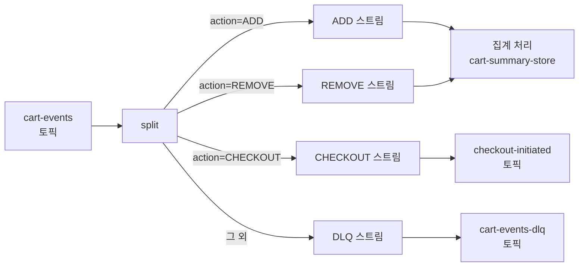

# 8. 단일 vs 다중 스트림 — 실습 (Kafka Streams)

branch/split 패턴으로 단일 토픽 다중 이벤트 처리, Interactive Query REST API, TopologyTestDriver. 선행: [07-single-vs-multiple-streams.md](./07-single-vs-multiple-streams.md).

---

## 1. 실습 시나리오: 장바구니 이벤트 처리

이 실습은 전자상거래 서비스의 장바구니(cart) 기능을 다룬다. 사용자가 상품을 담거나 제거하는 행동은 모두 `cart-events` 토픽에 발행되며, 시스템은 이를 실시간으로 집계해 현재 장바구니 상태를 유지해야 한다.

단일 스트림 방식의 핵심 선택지는 다음과 같다. ADD와 REMOVE를 별도 토픽으로 분리하는 대신, 하나의 `cart-events` 토픽에 `action` 필드로 구분하는 방식이다. 이렇게 하면 장바구니의 전체 이력이 하나의 토픽에서 순서대로 보존되고, 소비자는 단일 구독 지점에서 모든 장바구니 이벤트를 처리할 수 있다.

이벤트 구조는 다음과 같다.

```json
{
  "cartId": "cart-user123",
  "action": "ADD",
  "productId": "prod-987",
  "quantity": 2,
  "timestamp": 1700000000000
}
```

`cartId`가 메시지 키가 되어 동일 장바구니의 모든 이벤트가 같은 파티션으로 라우팅된다. 이는 Kafka Streams가 파티션 단위로 순서를 보장하기 때문에 중요한 설계 결정이다.

---

## 2. ksqlDB 원본 쿼리 (참고용)

Confluent 코스의 원본 실습은 ksqlDB SQL로 작성되어 있다. 실제 운영 환경에서 Kafka Streams Java를 사용하는 경우가 많으므로, 이 실습은 동일한 로직을 Java로 구현하는 방법을 보여준다.

```sql
-- ksqlDB 원본 (참고용, 실습에서 직접 사용하지 않음)
CREATE STREAM cart_events (
    cartId VARCHAR KEY,
    action VARCHAR,
    productId VARCHAR,
    quantity INT
) WITH (
    KAFKA_TOPIC='cart-events',
    VALUE_FORMAT='JSON'
);

CREATE TABLE cart_summary AS
    SELECT cartId,
           COLLECT_LIST(productId) AS products,
           SUM(CASE WHEN action='ADD' THEN quantity ELSE -quantity END) AS totalItems
    FROM cart_events
    GROUP BY cartId
    EMIT CHANGES;
```

ksqlDB는 SQL 문법으로 스트림 처리를 추상화하므로 간결하지만, 복잡한 비즈니스 로직(예: 특정 상품의 수량 추적, 유효하지 않은 REMOVE 방지)을 표현하기 어렵다. Kafka Streams Java는 이런 경우에 더 적합한 선택이다.

---

## 3. 도메인 모델: CartEvent와 CartSummary

Kafka Streams 코드를 작성하기 전에 도메인 모델을 정의한다. `CartEvent`는 토픽에서 읽어오는 이벤트이고, `CartSummary`는 집계 결과로 State Store에 저장된다.

```java
// CartEvent.java - 입력 이벤트
public class CartEvent {
    private String cartId;
    private String action;    // "ADD" 또는 "REMOVE"
    private String productId;
    private int quantity;
    private long timestamp;

    // 기본 생성자 (역직렬화 필요)
    public CartEvent() {}

    public CartEvent(String cartId, String action, String productId, int quantity) {
        this.cartId = cartId;
        this.action = action;
        this.productId = productId;
        this.quantity = quantity;
        this.timestamp = System.currentTimeMillis();
    }

    // getter/setter 생략
    public String getAction() { return action; }
    public String getProductId() { return productId; }
    public int getQuantity() { return quantity; }
}
```

```java
// CartSummary.java - 집계 결과 (State Store에 저장)
public class CartSummary {
    private Map<String, Integer> items;  // productId → 수량
    private int totalItems;

    public CartSummary() {
        this.items = new HashMap<>();
        this.totalItems = 0;
    }

    // apply()가 핵심 메서드: 이벤트를 받아 상태를 갱신한다
    public CartSummary apply(CartEvent event) {
        String productId = event.getProductId();
        int quantity = event.getQuantity();

        if ("ADD".equals(event.getAction())) {
            items.merge(productId, quantity, Integer::sum);
            totalItems += quantity;
        } else if ("REMOVE".equals(event.getAction())) {
            int current = items.getOrDefault(productId, 0);
            int newQty = Math.max(0, current - quantity);  // 음수 방지
            items.put(productId, newQty);
            totalItems = Math.max(0, totalItems - quantity);

            // 수량이 0이면 항목 제거
            if (newQty == 0) {
                items.remove(productId);
            }
        }
        return this;
    }

    public Map<String, Integer> getItems() { return Collections.unmodifiableMap(items); }
    public int getTotalItems() { return totalItems; }
}
```

`apply()` 메서드에서 음수 수량 방지 로직이 있다는 점에 주목한다. ksqlDB에서는 이런 비즈니스 규칙을 CASE WHEN으로만 처리해야 하지만, Java에서는 메서드 내부에서 자유롭게 표현할 수 있다.

---

## 4. Kafka Streams 집계 토폴로지

이제 본격적인 Kafka Streams 코드를 작성한다.

```java
// CartStreamTopology.java
@Component
public class CartStreamTopology {

    private static final String INPUT_TOPIC = "cart-events";
    private static final String STORE_NAME = "cart-summary-store";

    @Autowired
    public void buildTopology(StreamsBuilder builder) {
        // 1. Serde 설정 - JSON 직렬화 (실제 환경에서는 Avro 권장)
        JsonSerde<CartEvent> cartEventSerde = new JsonSerde<>(CartEvent.class);
        JsonSerde<CartSummary> cartSummarySerde = new JsonSerde<>(CartSummary.class);

        // 2. 스트림 생성: cart-events 토픽 구독
        KStream<String, CartEvent> cartStream = builder.stream(
            INPUT_TOPIC,
            Consumed.with(Serdes.String(), cartEventSerde)
        );

        // 3. 키 기준으로 그룹화 후 집계
        // cartId가 키이므로 groupByKey()로 충분하다
        KTable<String, CartSummary> cartSummary = cartStream
            .groupByKey()
            .aggregate(
                CartSummary::new,                           // 초기화: 빈 CartSummary 생성
                (cartId, event, summary) -> summary.apply(event),  // 집계 함수
                Materialized.<String, CartSummary, KeyValueStore<Bytes, byte[]>>as(STORE_NAME)
                    .withKeySerde(Serdes.String())
                    .withValueSerde(cartSummarySerde)
            );

        // 4. 결과를 출력 토픽으로 발행 (선택사항)
        cartSummary.toStream().to(
            "cart-summary-output",
            Produced.with(Serdes.String(), cartSummarySerde)
        );
    }
}
```

`Materialized.as(STORE_NAME)`이 중요한 이유는 Interactive Query 때문이다. 이름을 지정해야 외부에서 State Store를 조회할 수 있다. 이름을 생략하면 Kafka Streams가 내부적으로 임의의 이름을 생성하므로 외부 접근이 불가능해진다.

---

## 5. 다중 이벤트 타입 처리: branch/split 패턴

단일 토픽에 여러 이벤트 타입이 혼재하는 경우를 생각해보자. 예를 들어 `cart-events` 토픽에 ADD, REMOVE뿐 아니라 CHECKOUT 이벤트도 포함된다면 어떻게 처리할까?

Kafka Streams의 `split()` API(구 `branch()`)로 이벤트를 타입별로 분리할 수 있다.

```java
// 이벤트 타입별 분기 처리
Map<String, KStream<String, CartEvent>> branches = cartStream
    .split(Named.as("cart-"))
    .branch(
        (key, event) -> "ADD".equals(event.getAction()),
        Branched.as("add")
    )
    .branch(
        (key, event) -> "REMOVE".equals(event.getAction()),
        Branched.as("remove")
    )
    .branch(
        (key, event) -> "CHECKOUT".equals(event.getAction()),
        Branched.as("checkout")
    )
    .defaultBranch(Branched.as("unknown"));

// 각 분기를 독립적으로 처리
KStream<String, CartEvent> addEvents = branches.get("cart-add");
KStream<String, CartEvent> checkoutEvents = branches.get("cart-checkout");

// CHECKOUT 이벤트: 별도 처리 로직 (예: 결제 서비스 연동)
checkoutEvents
    .mapValues(event -> processCheckout(event))
    .to("checkout-initiated");

// 알 수 없는 이벤트 타입: 데드레터 큐로 라우팅
branches.get("cart-unknown").to("cart-events-dlq");
```

`split().branch()`를 사용할 때 주의할 점이 있다. 각 이벤트는 첫 번째로 조건을 만족하는 브랜치에만 들어간다. 따라서 조건이 겹치지 않도록 설계하거나, 순서를 의도적으로 배치해야 한다.



---

## 6. Interactive Query: State Store REST API 노출

집계 결과를 State Store에 저장한 뒤, HTTP REST API로 조회할 수 있다. 이 기능이 Kafka Streams의 강점 중 하나다. 별도 데이터베이스 없이 스트림 처리 결과를 실시간으로 서빙할 수 있다.

```java
// CartQueryController.java
@RestController
@RequestMapping("/api/carts")
public class CartQueryController {

    private final KafkaStreams kafkaStreams;
    private static final String STORE_NAME = "cart-summary-store";

    public CartQueryController(KafkaStreams kafkaStreams) {
        this.kafkaStreams = kafkaStreams;
    }

    @GetMapping("/{cartId}")
    public ResponseEntity<CartSummary> getCartSummary(@PathVariable String cartId) {
        // State Store에서 직접 조회 — 데이터베이스 쿼리 없음
        ReadOnlyKeyValueStore<String, CartSummary> store = kafkaStreams.store(
            StoreQueryParameters.fromNameAndType(
                STORE_NAME,
                QueryableStoreTypes.keyValueStore()
            )
        );

        CartSummary summary = store.get(cartId);

        if (summary == null) {
            return ResponseEntity.notFound().build();
        }

        return ResponseEntity.ok(summary);
    }

    @GetMapping("/count")
    public ResponseEntity<Long> getTotalCarts() {
        ReadOnlyKeyValueStore<String, CartSummary> store = kafkaStreams.store(
            StoreQueryParameters.fromNameAndType(
                STORE_NAME,
                QueryableStoreTypes.keyValueStore()
            )
        );

        long count = store.approximateNumEntries();
        return ResponseEntity.ok(count);
    }
}
```

Interactive Query는 로컬 State Store만 조회한다는 제약이 있다. 여러 인스턴스로 스케일아웃하면 각 인스턴스는 자신에게 할당된 파티션의 데이터만 갖는다. 분산 환경에서는 `kafkaStreams.metadataForKey()`로 어느 인스턴스가 해당 키를 보유하는지 찾은 뒤, 그 인스턴스로 HTTP 요청을 포워딩해야 한다.

---

## 7. TopologyTestDriver로 단위 테스트

Kafka Streams는 `TopologyTestDriver`를 제공하여 실제 Kafka 브로커 없이 토폴로지를 테스트할 수 있다. ADD → ADD → REMOVE 시퀀스를 검증하는 예시다.

```java
// CartStreamTopologyTest.java
class CartStreamTopologyTest {

    private TopologyTestDriver testDriver;
    private TestInputTopic<String, CartEvent> inputTopic;
    private TestOutputTopic<String, CartSummary> outputTopic;

    @BeforeEach
    void setup() {
        StreamsBuilder builder = new StreamsBuilder();
        CartStreamTopology topology = new CartStreamTopology();
        topology.buildTopology(builder);

        Properties props = new Properties();
        props.put(StreamsConfig.APPLICATION_ID_CONFIG, "cart-test");
        props.put(StreamsConfig.BOOTSTRAP_SERVERS_CONFIG, "dummy:9092");

        testDriver = new TopologyTestDriver(builder.build(), props);

        JsonSerde<CartEvent> cartEventSerde = new JsonSerde<>(CartEvent.class);
        JsonSerde<CartSummary> cartSummarySerde = new JsonSerde<>(CartSummary.class);

        inputTopic = testDriver.createInputTopic(
            "cart-events",
            new StringSerializer(),
            cartEventSerde.serializer()
        );

        outputTopic = testDriver.createOutputTopic(
            "cart-summary-output",
            new StringDeserializer(),
            cartSummarySerde.deserializer()
        );
    }

    @AfterEach
    void teardown() {
        testDriver.close();
    }

    @Test
    void ADD_두번후_REMOVE_하면_수량이_정확히_계산되어야한다() {
        String cartId = "cart-user001";

        // 1. 상품 A를 2개 추가
        inputTopic.pipeInput(cartId, new CartEvent(cartId, "ADD", "prod-A", 2));
        // 2. 상품 A를 1개 더 추가
        inputTopic.pipeInput(cartId, new CartEvent(cartId, "ADD", "prod-A", 1));
        // 3. 상품 A를 1개 제거
        inputTopic.pipeInput(cartId, new CartEvent(cartId, "REMOVE", "prod-A", 1));

        // State Store 직접 조회로 최종 상태 확인
        KeyValueStore<String, CartSummary> store = testDriver.getKeyValueStore("cart-summary-store");
        CartSummary summary = store.get(cartId);

        assertThat(summary).isNotNull();
        assertThat(summary.getTotalItems()).isEqualTo(2);  // 2 + 1 - 1 = 2
        assertThat(summary.getItems().get("prod-A")).isEqualTo(2);
    }

    @Test
    void REMOVE가_ADD보다_많아도_음수가_되지않아야한다() {
        String cartId = "cart-user002";

        inputTopic.pipeInput(cartId, new CartEvent(cartId, "ADD", "prod-B", 1));
        inputTopic.pipeInput(cartId, new CartEvent(cartId, "REMOVE", "prod-B", 5));  // 과도한 REMOVE

        KeyValueStore<String, CartSummary> store = testDriver.getKeyValueStore("cart-summary-store");
        CartSummary summary = store.get(cartId);

        assertThat(summary.getTotalItems()).isEqualTo(0);  // 음수 방지 로직 동작
        assertThat(summary.getItems()).doesNotContainKey("prod-B");  // 0이 되면 제거
    }

    @Test
    void CHECKOUT_이벤트는_checkout_initiated_토픽으로_라우팅되어야한다() {
        String cartId = "cart-user003";
        inputTopic.pipeInput(cartId, new CartEvent(cartId, "CHECKOUT", null, 0));

        TestOutputTopic<String, CartEvent> checkoutTopic = testDriver.createOutputTopic(
            "checkout-initiated",
            new StringDeserializer(),
            new JsonSerde<>(CartEvent.class).deserializer()
        );

        assertThat(checkoutTopic.isEmpty()).isFalse();
        KeyValue<String, CartEvent> record = checkoutTopic.readKeyValue();
        assertThat(record.key).isEqualTo(cartId);
    }
}
```

`TopologyTestDriver`를 사용하면 실제 Kafka/Redpanda 없이 단위 테스트를 빠르게 실행할 수 있다. CI 파이프라인에서 브로커 없이 스트림 로직의 정확성을 검증하는 표준적인 방법이다.

---

## 8. Spring Boot 통합 설정

Spring Boot + Kafka Streams 조합에서 필요한 설정을 정리한다.

```yaml
# application.yml
spring:
  kafka:
    streams:
      application-id: cart-stream-app
      bootstrap-servers: localhost:19092  # Redpanda 포트
      properties:
        default.key.serde: org.apache.kafka.common.serialization.Serdes$StringSerde
        default.value.serde: org.springframework.kafka.support.serializer.JsonSerde
        # State Store 변경 로그 토픽 복제본 수
        replication.factor: 1  # 개발환경, 운영은 3
```

```java
// KafkaStreamsConfig.java
@Configuration
@EnableKafkaStreams
public class KafkaStreamsConfig {

    @Bean(name = KafkaStreamsDefaultConfiguration.DEFAULT_STREAMS_CONFIG_BEAN_NAME)
    public KafkaStreamsConfiguration streamsConfig() {
        Map<String, Object> props = new HashMap<>();
        props.put(StreamsConfig.APPLICATION_ID_CONFIG, "cart-stream-app");
        props.put(StreamsConfig.BOOTSTRAP_SERVERS_CONFIG, "localhost:19092");
        props.put(StreamsConfig.DEFAULT_KEY_SERDE_CLASS_CONFIG, Serdes.String().getClass());
        props.put(StreamsConfig.COMMIT_INTERVAL_MS_CONFIG, 1000);  // 1초마다 State Store 커밋
        return new KafkaStreamsConfiguration(props);
    }
}
```

---

## Redpanda 호환성 노트

Kafka Streams 애플리케이션은 Redpanda와 완전히 호환된다. 다만 몇 가지 사항을 알아두어야 한다.

Kafka Streams는 내부적으로 여러 토픽을 자동 생성한다. 집계의 경우 changelog 토픽(`app-id-cart-summary-store-changelog`), repartitioning이 필요하면 repartition 토픽(`app-id-KSTREAM-xxx-repartition`)이 생성된다. Redpanda는 이 토픽들을 일반 토픽처럼 관리하며 정상적으로 동작한다.

`interactive.queries`를 사용하는 분산 환경에서는 Kafka Streams의 내부 메타데이터 브로드캐스트가 Redpanda에서도 동일하게 동작한다. `KafkaStreams.metadataForKey()`가 반환하는 `KeyQueryMetadata`를 활용해 인스턴스 간 쿼리 포워딩을 구현할 수 있다.

State Store의 복구(Recovery)는 changelog 토픽에서 리플레이하는 방식으로 동작한다. Redpanda는 토픽 리텐션 정책을 동일하게 지원하므로 State Store 복구 동작도 동일하다. 단, `KAFKA_STREAMS_COMMIT_INTERVAL_MS`를 적절히 설정해 복구 시간을 관리하는 것이 좋다.

---

## 체크포인트

- [ ] CartEvent, CartSummary POJO를 직접 작성하고 `apply()` 메서드가 ADD/REMOVE를 올바르게 처리함을 확인했다
- [ ] `groupByKey().aggregate()` 패턴으로 장바구니 집계 토폴로지를 구현했다
- [ ] `split().branch()`로 CHECKOUT 이벤트를 별도 토픽으로 라우팅했다
- [ ] Interactive Query REST API에서 State Store를 조회하는 엔드포인트를 구현했다
- [ ] TopologyTestDriver로 ADD→ADD→REMOVE 시퀀스 테스트를 작성하고 통과시켰다
- [ ] 음수 수량 방지 로직이 테스트로 검증되었다
- [ ] Redpanda에 연결된 실제 환경에서 토폴로지가 정상 동작함을 확인했다
