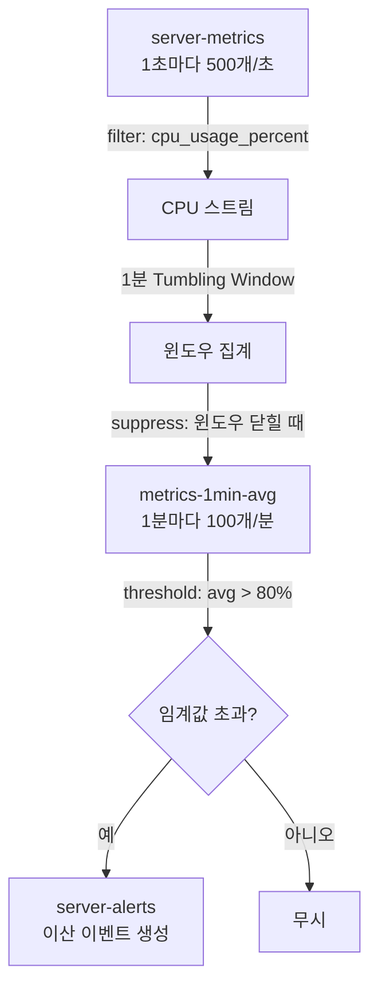
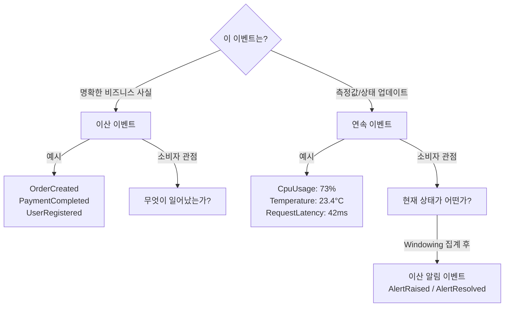

# 9. 이산 이벤트 vs 연속 이벤트 흐름

이산(비즈니스 사실) vs 연속(측정값) 구분, 상태 머신 모델링, Windowing + suppress()로 볼륨 관리. 선행: [08-single-vs-multiple-streams-handson.md](./08-single-vs-multiple-streams-handson.md).

---

## 1. 두 가지 이벤트의 본질적 차이

이벤트 스트리밍을 설계할 때 가장 먼저 물어야 할 질문이 있다. "이 이벤트는 명확한 경계를 가진 비즈니스 사실인가, 아니면 끊임없이 흘러오는 측정값인가?"

이산 이벤트(Discrete Events)는 정확히 한 번 발생하고 완결된 사실이다. "2024년 3월 15일 오전 10시 23분에 사용자 kim@example.com이 주문 #ORD-2847을 생성했다"는 불변의 사실이다. 이 이벤트를 두 번 보내도 비즈니스 의미는 같은 주문 생성 한 건이다. 소비자가 이 이벤트에서 알고 싶은 것은 "무엇이 일어났는가"다.

연속 이벤트(Continuous Events)는 측정 대상의 현재 상태를 나타내며, 개별 이벤트 하나보다 흐름 전체가 의미를 갖는다. 서버 CPU 사용률이 37%, 38%, 41%, 43%로 계속 발행된다면, 이 중 어느 하나만 봐서는 서버 상태를 판단하기 어렵다. 소비자가 알고 싶은 것은 "지금 상태가 어떤가"이며, 이를 위해 일정 시간의 데이터를 집계해야 한다.

두 가지를 혼동하면 설계가 꼬인다. 주문 생성을 연속 이벤트처럼 처리하면 중복 발행 시 비즈니스 오류가 발생하고, CPU 메트릭을 이산 이벤트처럼 처리하면 초당 수백 개의 이벤트가 모두 개별적인 처리 대상이 되어 시스템이 과부하된다.

---

## 2. 이산 이벤트: 상태 머신으로 비즈니스 프로세스 표현

이산 이벤트가 빛나는 영역은 상태 전이가 있는 비즈니스 프로세스다. 주문 처리 흐름을 예로 들어보자.

```
주문 생성 → 결제 대기 → 결제 완료 → 배송 준비 → 배송 중 → 배송 완료
                                   ↓
                              결제 실패 → 주문 취소
```

각 화살표가 하나의 이산 이벤트다.

```json
// OrderCreated
{
  "eventId": "evt-018c1a2b-3d4e-5f6a-b7c8-9d0e1f2a3b4c",
  "type": "OrderCreated",
  "orderId": "ord-2847",
  "customerId": "cust-kim",
  "items": [{"productId": "prod-123", "quantity": 2, "price": 29900}],
  "totalAmount": 59800,
  "occurredAt": "2024-03-15T10:23:45.123Z"
}

// PaymentCompleted (OrderCreated 이후에만 유효)
{
  "eventId": "evt-019d2b3c-4e5f-6a7b-c8d9-0e1f2a3b4c5d",
  "type": "PaymentCompleted",
  "orderId": "ord-2847",
  "paymentId": "pay-9876",
  "amount": 59800,
  "occurredAt": "2024-03-15T10:23:48.456Z"
}
```

상태 머신 관점에서 "결제 완료" 이벤트는 주문이 "결제 대기" 상태일 때만 유효하다. 이미 취소된 주문에 대한 결제 완료 이벤트가 들어오면 유효하지 않은 전이로 거부해야 한다.

```java
// OrderStateMachine.java
public class OrderStateMachine {

    public enum OrderState {
        CREATED, PAYMENT_PENDING, PAYMENT_COMPLETED, SHIPPING, DELIVERED, CANCELLED
    }

    private static final Map<OrderState, Set<String>> VALID_TRANSITIONS = Map.of(
        OrderState.CREATED, Set.of("PaymentInitiated"),
        OrderState.PAYMENT_PENDING, Set.of("PaymentCompleted", "PaymentFailed"),
        OrderState.PAYMENT_COMPLETED, Set.of("ShippingStarted", "OrderCancelled"),
        OrderState.SHIPPING, Set.of("OrderDelivered"),
        OrderState.DELIVERED, Set.of(),
        OrderState.CANCELLED, Set.of()
    );

    public OrderState transition(OrderState current, String eventType) {
        Set<String> allowed = VALID_TRANSITIONS.getOrDefault(current, Set.of());
        if (!allowed.contains(eventType)) {
            throw new InvalidStateTransitionException(
                String.format("상태 '%s'에서 '%s' 이벤트는 허용되지 않습니다", current, eventType)
            );
        }
        return nextState(current, eventType);
    }
}
```

Kafka Streams에서 이 상태 머신을 유지하려면 `KTable`이나 `aggregate()`를 활용한다. 주문 ID를 키로, 현재 상태를 값으로 저장하고, 새 이벤트가 들어올 때마다 상태 전이를 검증한 후 상태를 갱신한다.

```java
KTable<String, OrderState> orderStateTable = orderEventStream
    .groupByKey()
    .aggregate(
        () -> OrderState.CREATED,
        (orderId, event, currentState) -> {
            try {
                return stateMachine.transition(currentState, event.getType());
            } catch (InvalidStateTransitionException e) {
                // 유효하지 않은 전이: 상태 변경 없이 현재 상태 유지
                // 실제 운영에서는 DLQ로 보내거나 알림 발행
                log.warn("유효하지 않은 상태 전이: orderId={}, event={}", orderId, event.getType());
                return currentState;
            }
        },
        Materialized.as("order-state-store")
    );
```

---

## 3. 연속 이벤트: 측정값의 흐름

IoT 센서, 시스템 메트릭, 사용자 행동 추적은 연속 이벤트의 전형적인 사례다.

```json
// 서버 CPU 메트릭 (1초마다 발행)
{
  "serverId": "server-prod-01",
  "metric": "cpu_usage_percent",
  "value": 73.4,
  "collectedAt": "2024-03-15T10:23:45.000Z"
}
```

이 이벤트를 하나씩 처리하는 것은 비효율적이다. 1초마다 100개 서버에서 각 5개 메트릭이 발행되면, 초당 500개의 이벤트가 발생한다. 이를 모두 개별 알림으로 처리하면 노이즈만 넘친다. 대신 60초 윈도우 평균이 80%를 초과할 때 알림을 보내는 방식이 실용적이다.

```java
// MetricStreamProcessor.java
KStream<String, MetricEvent> metricStream = builder.stream(
    "server-metrics",
    Consumed.with(Serdes.String(), metricSerde)
);

// CPU 사용률만 필터링 (serverId를 키로 사용)
KStream<String, MetricEvent> cpuStream = metricStream
    .filter((serverId, event) -> "cpu_usage_percent".equals(event.getMetric()));

// 60초 텀블링 윈도우로 평균 계산
TimeWindows window = TimeWindows.ofSizeWithNoGrace(Duration.ofSeconds(60));

KTable<Windowed<String>, Double> avgCpuTable = cpuStream
    .groupByKey()
    .windowedBy(window)
    .aggregate(
        () -> new MetricAggregator(),
        (serverId, event, agg) -> agg.add(event.getValue()),
        Materialized.with(Serdes.String(), metricAggSerde)
    )
    .mapValues(agg -> agg.average());
```

`TimeWindows.ofSizeWithNoGrace()`의 `NoGrace`는 윈도우가 닫힌 후 늦게 도착하는 이벤트를 처리하지 않겠다는 의미다. 메트릭의 경우 늦게 도착한 데이터보다 즉각적인 알림이 중요하므로 적합한 선택이다.

---

## 4. 다운샘플링: 연속 이벤트의 볼륨 관리

연속 이벤트의 가장 큰 도전은 볼륨이다. 1초마다 발행되는 메트릭을 모두 저장하면 비용이 급증한다. 실시간 분석에는 1초 단위가 필요하지만, 장기 트렌드 분석에는 10분 단위 집계로 충분하다.

`suppress()`를 활용하면 윈도우가 완전히 닫힐 때까지 중간 결과를 억제하고 최종 결과만 발행한다. 이것이 다운샘플링의 핵심이다.

```java
// 1분 단위 집계를 suppress()로 완료 시점에만 발행
KTable<Windowed<String>, Double> minuteAvg = cpuStream
    .groupByKey()
    .windowedBy(TimeWindows.ofSizeWithNoGrace(Duration.ofMinutes(1)))
    .aggregate(
        MetricAggregator::new,
        (key, value, agg) -> agg.add(value.getValue()),
        Materialized.with(Serdes.String(), metricAggSerde)
    )
    .mapValues(MetricAggregator::average)
    .suppress(
        // 윈도우가 완전히 닫힌 후에만 결과 발행 (1분에 1개)
        Suppressed.untilWindowCloses(Suppressed.BufferConfig.unbounded())
    );

// 결과를 "metrics-1min-avg" 토픽으로 발행 (원본의 1/60 볼륨)
minuteAvg.toStream()
    .map((windowedKey, avgValue) -> KeyValue.pair(
        windowedKey.key(),
        new MetricSummary(windowedKey.key(), avgValue, windowedKey.window().startTime())
    ))
    .to("metrics-1min-avg");
```

`suppress()` 없이 `aggregate()`만 사용하면 윈도우가 진행되는 동안 중간 업데이트가 계속 발행된다. 1분 윈도우에 1초마다 메트릭이 들어오면 최대 60개의 중간 결과가 발행된다. `suppress()`로 이를 1개로 줄일 수 있다.



---

## 5. 연속 이벤트에서 이산 이벤트 추출: 하이브리드 패턴

연속 이벤트 흐름에서 특별한 조건이 충족될 때 이산 이벤트를 생성하는 패턴이다. "CPU 사용률이 80%를 초과했다"는 연속 메트릭에서 추출된 이산 알림 이벤트다.

단순히 임계값을 초과하는 매 측정값마다 알림을 보내면 안 된다. CPU가 79%, 81%, 80%, 82%로 반복하면 계속 알림이 발행된다. 실제로 필요한 것은 "이전에는 80% 미만이었는데 처음으로 초과한 순간"이라는 이산 이벤트다.

이를 위해 상태를 유지해야 한다. 이전 상태가 "정상"이었고 현재 상태가 "위험"일 때만 알림 이벤트를 생성한다.

```java
// AlertState: 이전 알림 상태를 저장
public class AlertState {
    private boolean alertActive;
    private double lastAvg;

    public AlertState() {
        this.alertActive = false;
        this.lastAvg = 0.0;
    }
}

// 이산 알림 이벤트 생성
KStream<String, ServerAlert> alertStream = minuteAvg
    .toStream()
    .map((windowedKey, avgValue) -> KeyValue.pair(windowedKey.key(), avgValue))
    .transformValues(
        () -> new ValueTransformerWithKey<String, Double, ServerAlert>() {
            private KeyValueStore<String, AlertState> stateStore;

            @Override
            public void init(ProcessorContext context) {
                stateStore = context.getStateStore("alert-state-store");
            }

            @Override
            public ServerAlert transform(String serverId, Double avgCpu) {
                AlertState state = stateStore.getOrDefault(serverId, new AlertState());
                boolean wasAlert = state.isAlertActive();
                boolean isAlert = avgCpu > 80.0;

                state.setAlertActive(isAlert);
                state.setLastAvg(avgCpu);
                stateStore.put(serverId, state);

                // 상태가 변화했을 때만 이벤트 생성
                if (!wasAlert && isAlert) {
                    // 정상 → 위험: AlertRaised 이벤트 생성
                    return new ServerAlert(serverId, "AlertRaised", avgCpu);
                } else if (wasAlert && !isAlert) {
                    // 위험 → 정상: AlertResolved 이벤트 생성
                    return new ServerAlert(serverId, "AlertResolved", avgCpu);
                }

                return null;  // 상태 변화 없음: 이벤트 생성 안 함
            }
        },
        "alert-state-store"
    )
    .filter((serverId, alert) -> alert != null)  // null 제거
    .to("server-alerts");
```

이 패턴의 핵심은 "상태 변화"를 감지한다는 점이다. 연속적인 측정값 스트림에서 의미 있는 전환점만 이산 이벤트로 추출한다. `server-alerts` 토픽에는 초당 수백 개가 아닌, 실제로 상황이 변했을 때만 이벤트가 발행된다.

---

## 6. 이산/연속 이벤트 선택 기준

실제 설계 상황에서 어떤 유형을 선택할지 판단하는 기준을 정리한다.

**이산 이벤트를 선택해야 하는 경우**

비즈니스 프로세스의 상태 전이를 표현할 때는 이산 이벤트가 적합하다. 주문, 결제, 배송, 사용자 계정 변경처럼 명확한 비즈니스 의미를 가진 사건이 이에 해당한다. 이벤트 하나가 "중요한 무언가가 발생했다"는 사실 자체를 전달한다. 소비자가 이 이벤트를 놓치면 비즈니스 오류가 발생한다.

특히 감사(Audit) 로그, 컴플라이언스 기록처럼 이벤트가 법적/비즈니스적으로 불변해야 하는 경우에도 이산 이벤트가 적합하다. 이벤트 소싱(Event Sourcing) 패턴도 이산 이벤트를 기반으로 한다.

**연속 이벤트를 선택해야 하는 경우**

물리적 측정, 센서 데이터, 시스템 메트릭처럼 시간적으로 연속하는 값을 다룰 때는 연속 이벤트가 적합하다. 개별 측정값 하나의 의미보다 시간 구간의 집계(평균, 최대, 분포)가 중요하다. GPS 추적, 주가 데이터, 트래픽 모니터링이 좋은 예다.

연속 이벤트에서는 소비자가 개별 이벤트를 처리하기보다 Windowing으로 집계한 결과를 사용한다. 이벤트 하나를 놓쳐도 전체 집계에 미치는 영향은 미미하다.



---

## 7. 실제 설계에서 마주치는 모호한 경우

"사용자가 페이지를 방문했다"는 이산 이벤트일까, 연속 이벤트일까? 하나의 방문은 이산 이벤트지만, 하루에 수백만 번 발생하는 방문 이벤트의 흐름은 연속 이벤트처럼 다루는 것이 적합하다. 개별 방문을 모두 처리하기보다 1분당 방문 수, 세션당 페이지뷰처럼 집계된 지표가 더 유용하다.

이런 경우에는 두 가지를 함께 적용하는 것이 정답이다. 원본 이벤트는 이산 이벤트로 보존하고(감사/분석 목적), 집계된 지표는 별도의 연속 이벤트 파이프라인으로 처리한다. Lambda Architecture나 Kappa Architecture가 이런 분리를 구현하는 패턴이다.

---

## 8. Windowing 유형 비교: Tumbling, Hopping, Sliding, Session

연속 이벤트를 집계할 때 어떤 윈도우 유형을 선택하느냐에 따라 결과가 달라진다. Kafka Streams는 4가지 윈도우 유형을 지원하며, 각각 적합한 사용 시나리오가 있다.

**Tumbling Window (텀블링 윈도우)**

겹치지 않는 고정 크기 윈도우다. 1분 텀블링 윈도우라면 [0:00, 1:00), [1:00, 2:00), [2:00, 3:00)처럼 각 구간이 독립적으로 존재한다. 한 이벤트는 정확히 하나의 윈도우에만 속한다.

서버 메트릭을 1분 단위로 집계해 "이 1분 동안 평균 CPU 사용률"을 계산할 때 적합하다. 구간 간 중복이 없으므로 이중 집계 걱정이 없다.

```java
// 1분 텀블링 윈도우
TimeWindows tumblingWindow = TimeWindows.ofSizeWithNoGrace(Duration.ofMinutes(1));
```

**Hopping Window (호핑 윈도우)**

윈도우 크기보다 작은 간격으로 이동하므로 윈도우가 겹친다. 5분 크기, 1분 간격의 호핑 윈도우라면 [0:00, 5:00), [1:00, 6:00), [2:00, 7:00)처럼 이동한다. 한 이벤트가 여러 윈도우에 속할 수 있다.

"최근 5분간 평균"을 1분마다 업데이트하는 롤링 집계에 적합하다. 이동 평균(Moving Average) 계산에 자연스럽게 사용된다.

```java
// 5분 크기, 1분 간격 호핑 윈도우
SlidingWindows hoppingWindow = SlidingWindows.ofTimeDifferenceWithNoGrace(
    Duration.ofMinutes(5)  // 윈도우 내 이벤트 간 최대 시간 차
);
// 또는 JoinWindows를 활용한 방식
```

**Session Window (세션 윈도우)**

이벤트 간 비활성 시간(gap)을 기준으로 세션을 나누는 동적 크기 윈도우다. 30분 gap을 설정하면, 마지막 이벤트 이후 30분 이상 이벤트가 없으면 세션이 닫힌다. 사용자 행동 분석에서 세션당 총 체류 시간, 세션당 페이지뷰를 계산할 때 적합하다.

```java
// 30분 비활성 기준 세션 윈도우
SessionWindows sessionWindow = SessionWindows.ofInactivityGapWithNoGrace(
    Duration.ofMinutes(30)
);

KTable<Windowed<String>, Long> sessionPageViews = pageViewStream
    .groupByKey()
    .windowedBy(sessionWindow)
    .count(Materialized.as("session-pageview-store"));
```

세션 윈도우는 이벤트 타임스탬프에 따라 기존 세션이 연장되거나 병합될 수 있다. 늦게 도착한 이벤트가 두 개의 분리된 세션을 하나로 합치는 상황도 발생하므로, 하위 집계를 병합하는 `Merger` 함수가 필요하다.

```java
KTable<Windowed<String>, Long> sessionCounts = pageViewStream
    .groupByKey()
    .windowedBy(sessionWindow)
    .aggregate(
        () -> 0L,
        (userId, pageView, count) -> count + 1,  // adder
        (userId, count1, count2) -> count1 + count2,  // merger (세션 병합 시)
        Materialized.as("session-count-store")
    );
```

**윈도우 유형 선택 기준 요약**

| 사용 목적 | 추천 윈도우 | 이유 |
|-----------|-------------|------|
| 시간대별 집계 (1분, 1시간) | Tumbling | 겹침 없음, 구간 명확 |
| 이동 평균, 롤링 집계 | Hopping | 주기적 업데이트 + 과거 포함 |
| 사용자 세션 분석 | Session | 활동 패턴 기반 동적 경계 |
| 두 스트림의 시간 근접 조인 | Sliding | 이벤트 쌍 매칭 |

---

## 9. 이벤트 시간(Event Time) vs 처리 시간(Processing Time)

연속 이벤트를 다룰 때 "언제 발생했는가"와 "언제 처리됐는가"의 차이가 집계 결과에 영향을 미친다.

이벤트 시간(Event Time)은 이벤트가 실제로 발생한 시각으로, 이벤트 페이로드의 `timestamp` 필드에 포함된다. IoT 센서가 오프라인이었다가 재연결하면 수분 전 데이터를 한꺼번에 발행할 수 있다. 이때 이벤트 시간 기준으로 집계하면 올바른 시간대에 데이터가 반영된다.

처리 시간(Processing Time)은 Kafka Streams가 이벤트를 처리하는 시각이다. 구현이 단순하지만, 늦게 도착한 이벤트가 현재 윈도우에 들어가므로 집계 결과가 부정확해질 수 있다.

Kafka Streams는 기본적으로 이벤트 시간을 사용한다. `TimestampExtractor`를 구현하면 어떤 필드를 이벤트 시간으로 사용할지 지정할 수 있다.

```java
// 커스텀 TimestampExtractor: 페이로드의 collectedAt 필드를 이벤트 시간으로 사용
public class MetricTimestampExtractor implements TimestampExtractor {

    @Override
    public long extract(ConsumerRecord<Object, Object> record, long partitionTime) {
        if (record.value() instanceof MetricEvent) {
            MetricEvent event = (MetricEvent) record.value();
            return event.getCollectedAt();  // 센서 수집 시각
        }
        // 페이로드에서 추출 실패 시 파티션 시간(최근 처리 시각) 폴백
        return partitionTime;
    }
}

// Streams 설정에 적용
props.put(StreamsConfig.DEFAULT_TIMESTAMP_EXTRACTOR_CLASS_CONFIG,
    MetricTimestampExtractor.class);
```

늦게 도착하는 이벤트(Late Arrivals)를 얼마나 허용할지는 `grace` 기간으로 설정한다. `ofSizeWithNoGrace()`는 grace를 0으로 설정해 윈도우가 닫히면 늦은 이벤트를 버린다. 반면 `ofSizeAndGrace(size, grace)`는 윈도우가 닫혀도 grace 기간 동안 늦은 이벤트를 수용한다.

```java
// 5분 grace: 윈도우 종료 후 5분까지 늦은 이벤트 허용
TimeWindows windowWithGrace = TimeWindows.ofSizeAndGrace(
    Duration.ofMinutes(1),   // 윈도우 크기
    Duration.ofMinutes(5)    // grace 기간
);
```

메트릭처럼 실시간성이 중요한 경우에는 grace를 짧게 유지하는 것이 좋다. 반면 모바일 클라이언트처럼 네트워크 단절이 빈번한 환경에서 수집된 이벤트라면 더 긴 grace가 필요하다.

---

## Redpanda 호환성 노트

연속 이벤트의 높은 처리량은 Redpanda의 Thread-per-core 아키텍처가 잘 처리하는 영역이다. Redpanda는 스레드 간 컨텍스트 스위칭을 최소화하고 코어당 하나의 스레드가 전담하므로, IoT 메트릭처럼 초당 수만 건의 소규모 이벤트가 몰려도 테일 레이턴시가 안정적이다.

Kafka Streams의 Windowing 처리는 내부적으로 RocksDB를 State Store로 사용하고, 변경 사항을 changelog 토픽에 기록한다. Redpanda는 이 changelog 토픽을 일반 토픽처럼 관리하며, 리텐션 정책도 동일하게 적용된다.

`suppress()`는 Kafka Streams 2.1 이상에서 지원된다. Redpanda와 함께 사용할 때 특별한 설정 변경은 필요 없다. 다만 `suppress()`가 윈도우 닫힘을 결정하는 데 스트림 시간(이벤트 타임스탬프)을 기준으로 하므로, 이벤트 발행이 뜸한 경우 윈도우가 오래 열려 있을 수 있다는 점을 유의해야 한다.

---

## 체크포인트

- [ ] 이산 이벤트와 연속 이벤트의 차이를 예시와 함께 설명할 수 있다
- [ ] 주문 처리 흐름을 이산 이벤트 기반 상태 머신으로 모델링했다
- [ ] Tumbling Window + suppress()로 CPU 메트릭을 1분 집계로 다운샘플링했다
- [ ] 연속 메트릭에서 AlertRaised/AlertResolved 이산 이벤트를 추출하는 상태 기반 변환을 구현했다
- [ ] 모호한 이벤트(사용자 클릭 등)를 두 가지 유형 중 어떻게 다룰지 판단할 수 있다
- [ ] Redpanda의 Thread-per-core 아키텍처가 연속 이벤트 처리에 유리한 이유를 설명할 수 있다
