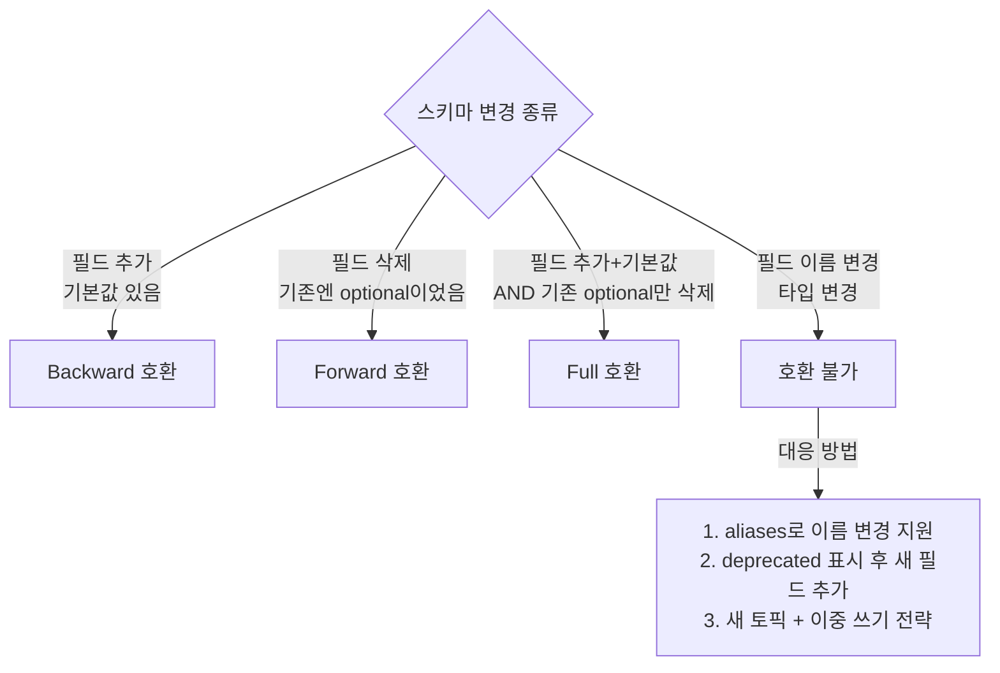
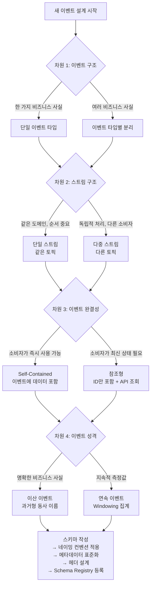

# 10. 이벤트 설계 베스트 프랙티스

Schema-First 설계, 이벤트 네이밍/메타데이터 기준, 스키마 진화 전략(Forward/Backward/Full), 4차원 의사결정 통합. 선행: [09-discrete-vs-continuous.md](./09-discrete-vs-continuous.md).

---

## 1. 스키마 설계 원칙: Schema-First 접근

이벤트 설계에서 가장 흔한 실수는 코드를 먼저 작성하고 스키마를 나중에 정의하는 것이다. 이 순서가 뒤집히면 스키마는 구현의 부산물이 되고, 소비자와 생산자 간 계약이 느슨해진다.

Schema-First 접근은 다음 순서를 따른다. 먼저 이벤트가 전달해야 하는 비즈니스 의미를 팀과 합의하고, 그 의미를 표현하는 Avro(또는 Protobuf) 스키마를 작성한다. 스키마를 Schema Registry에 등록하고 리뷰를 거친 뒤에야 코드를 생성한다.

```json
// orders.avsc - 스키마를 먼저 정의한다
{
  "type": "record",
  "name": "OrderCreated",
  "namespace": "com.example.orders.v1",
  "doc": "고객이 주문을 완료했을 때 발행되는 이벤트",
  "fields": [
    {
      "name": "eventId",
      "type": "string",
      "doc": "이벤트 고유 식별자 (UUID v7 권장)"
    },
    {
      "name": "orderId",
      "type": "string",
      "doc": "주문 식별자"
    },
    {
      "name": "customerId",
      "type": "string"
    },
    {
      "name": "items",
      "type": {
        "type": "array",
        "items": {
          "type": "record",
          "name": "OrderItem",
          "fields": [
            {"name": "productId", "type": "string"},
            {"name": "quantity", "type": "int"},
            {"name": "unitPrice", "type": "long", "doc": "원화 단위 (소수점 미사용)"}
          ]
        }
      }
    },
    {
      "name": "totalAmount",
      "type": "long"
    },
    {
      "name": "occurredAt",
      "type": "long",
      "logicalType": "timestamp-millis",
      "doc": "이벤트 발생 시각 (브로커 수신 시각 아님, 서비스 내부 시각)"
    },
    {
      "name": "shippingAddress",
      "type": ["null", "string"],
      "default": null,
      "doc": "배송지 주소. 디지털 상품은 null이 될 수 있으므로 optional"
    }
  ]
}
```

필드 설계에서 두 가지 원칙이 충돌한다. 필수 필드를 최소화하면 다양한 상황에 유연하게 대응할 수 있지만, 너무 많은 optional 필드는 소비자가 어떤 값이 언제 존재하는지 파악하기 어렵게 만든다. 균형점은 "이 필드 없이는 이벤트의 비즈니스 의미가 성립하지 않는가"를 기준으로 삼는 것이다. `orderId`와 `customerId`는 없으면 주문 이벤트가 성립하지 않으므로 필수다. `shippingAddress`는 디지털 상품에서 불필요하므로 optional이 맞다.

기본값(default) 설정은 스키마 진화를 위해 중요하다. 새 필드를 추가할 때 기본값이 없으면 기존 소비자가 구 스키마로 직렬화된 메시지를 읽을 때 오류가 발생한다. 기본값이 있으면 Avro가 자동으로 채워준다.

---

## 2. 이벤트 네이밍 컨벤션

이벤트 이름은 "무엇이 일어났는가"를 명확하게 전달해야 한다. 명령형이나 현재형이 아닌 과거형 동사를 사용하는 이유가 여기에 있다. 이벤트는 이미 발생한 불변의 사실이기 때문이다.

```
좋은 예:
  OrderCreated      ← 주문이 생성됐다 (완료된 사실)
  PaymentProcessed  ← 결제가 처리됐다
  UserDeactivated   ← 사용자가 비활성화됐다
  InventoryDepleted ← 재고가 소진됐다

나쁜 예:
  CreateOrder    ← 명령형 (이벤트가 아닌 커맨드처럼 읽힌다)
  OrderUpdate    ← 동사 원형 + 무엇이 업데이트됐는지 불명확
  OrderEvent     ← 너무 포괄적, 어떤 주문 이벤트인지 알 수 없다
  NewOrder       ← 형용사형, 이벤트 완료 의미가 없다
```

네임스페이스는 이벤트가 어떤 도메인에서 발행되는지를 나타낸다. Avro 스키마의 `namespace` 필드를 활용하면 이름 충돌을 방지하고 Schema Registry에서 구조적으로 관리할 수 있다.

```
com.example.orders.v1.OrderCreated
com.example.payments.v1.PaymentProcessed
com.example.inventory.v1.InventoryDepleted
```

토픽 이름에 버전을 넣는 방식(`orders-v2`, `payments-v1`)은 피해야 한다. 토픽이 쌓이면 소비자가 어떤 버전을 구독해야 하는지 파악하기 어렵고, 버전 전환 시 소비자 코드를 일제히 바꿔야 한다. 스키마 호환성으로 버전을 관리하면 토픽 이름은 안정적으로 유지하면서 스키마만 진화시킬 수 있다.

---

## 3. 이벤트 ID와 멱등성

모든 이벤트에는 고유한 `eventId`가 있어야 한다. 네트워크 장애로 재전송이 발생하거나, 소비자가 실패 후 재처리할 때 중복 이벤트를 감지하는 유일한 수단이 `eventId`다.

UUID 버전 선택에서는 맥락이 중요하다.

UUID v4는 완전 무작위로 생성되어 충돌 가능성이 극히 낮다. 단, 시간 순서가 없으므로 데이터베이스에서 UUID를 기본키로 사용하면 인덱스 단편화가 발생한다.

UUID v7은 타임스탬프 기반 정렬을 지원한다. 같은 시간에 생성된 UUID끼리 인접한 값을 가지므로 데이터베이스 인덱스 효율이 좋다. 이벤트 ID가 데이터베이스에 저장되는 경우라면 UUID v7이 더 적합하다.

```java
// UUID v7 생성 (Java 라이브러리 활용)
// 의존성: com.fasterxml.uuid:java-uuid-generator:4.3.0
import com.fasterxml.uuid.Generators;

String eventId = Generators.timeBasedEpochGenerator().generate().toString();
// 예: "018c1a2b-3d4e-7f6a-b7c8-9d0e1f2a3b4c"
// 시간 순서가 유지되어 정렬 시 일관성 있음
```

`correlationId`는 분산 트랜잭션에서 연관된 이벤트들을 추적하는 데 사용한다. 사용자가 주문을 완료하면 `correlationId`가 설정되고, 이 주문에서 파생된 결제, 재고 차감, 배송 준비 이벤트 모두 같은 `correlationId`를 공유한다. 이를 통해 로그에서 전체 트랜잭션 흐름을 재구성할 수 있다.

소비자 측 중복 제거는 간단한 패턴으로 구현한다.

```java
// IdempotentEventProcessor.java
@Service
public class IdempotentEventProcessor {

    private final ProcessedEventRepository processedEvents;

    public void process(OrderCreated event) {
        // 1. 이미 처리된 이벤트인지 확인
        if (processedEvents.existsByEventId(event.getEventId())) {
            log.info("중복 이벤트 스킵: eventId={}", event.getEventId());
            return;
        }

        // 2. 비즈니스 로직 처리
        orderService.handleOrderCreated(event);

        // 3. 처리 완료 기록 (트랜잭션 내에서)
        processedEvents.save(new ProcessedEvent(event.getEventId(), Instant.now()));
    }
}
```

---

## 4. 메타데이터 표준화

이벤트마다 일관된 메타데이터를 포함하면 소비자가 이벤트를 처리하는 데 필요한 컨텍스트를 코드 변경 없이 얻을 수 있다. CloudEvents 표준은 이런 메타데이터의 공통 필드를 정의한다.

```json
{
  "specversion": "1.0",
  "id": "018c1a2b-3d4e-7f6a-b7c8-9d0e1f2a3b4c",
  "source": "https://orders.example.com/v1",
  "type": "com.example.orders.v1.OrderCreated",
  "time": "2024-03-15T10:23:45.123Z",
  "datacontenttype": "application/avro",
  "schemaurl": "https://schema-registry.example.com/subjects/orders-value",
  "correlationid": "corr-2847-payment",
  "data": {
    "orderId": "ord-2847",
    "customerId": "cust-kim"
  }
}
```

CloudEvents 표준의 모든 필드를 강제할 필요는 없다. 중요한 것은 팀 내에서 메타데이터 구조를 일관되게 유지하는 것이다. 최소한 포함해야 하는 필드는 다음과 같다.

`eventId`: 이벤트 고유 식별자 (멱등성 처리용)
`occurredAt` 또는 `time`: 이벤트 발생 시각 (브로커 수신 시각이 아닌 서비스 내부 시각)
`source`: 이벤트를 발행한 서비스 식별자 (디버깅, 감사 추적용)
`type`: 이벤트 타입 (스키마 레지스트리 없이도 타입 판별 가능하게)

`occurredAt`이 브로커 수신 시각이 아닌 서비스 내부 시각이어야 하는 이유가 있다. 네트워크 지연이나 재시도로 인해 이벤트가 실제 발생보다 늦게 브로커에 도달할 수 있다. 감사 목적으로는 실제 발생 시각이 더 중요하다.

---

## 5. Kafka 헤더 활용: 페이로드와 라우팅 정보의 분리

Kafka Record에는 Key와 Value 외에 Headers가 있다. 헤더는 바이트 배열 형태의 키-값 쌍으로, 메시지 본문(Value)을 역직렬화하지 않고도 처리할 수 있는 정보를 담는 데 적합하다.

```java
// 이벤트 발행 시 헤더 추가
ProducerRecord<String, byte[]> record = new ProducerRecord<>("order-events", key, avroBytes);

record.headers().add("event-type", "OrderCreated".getBytes(StandardCharsets.UTF_8));
record.headers().add("correlation-id", correlationId.getBytes(StandardCharsets.UTF_8));
record.headers().add("source-service", "order-service".getBytes(StandardCharsets.UTF_8));
record.headers().add("schema-version", "1".getBytes(StandardCharsets.UTF_8));
record.headers().add("traceparent", traceContext.getBytes(StandardCharsets.UTF_8));  // W3C 분산 추적
```

헤더를 사용하면 Kafka Streams나 라우터가 메시지를 역직렬화하지 않고 `event-type` 헤더만 읽어 라우팅 결정을 내릴 수 있다. Avro 역직렬화 비용이 없으므로 필터링 처리량이 향상된다.

페이로드 필드와 헤더 중 어디에 정보를 넣을지 결정하는 기준은 다음과 같다.

헤더에 넣어야 하는 것: 라우팅 정보, 분산 추적 컨텍스트(traceparent), 스키마 버전, 소스 서비스 식별자. 이런 정보는 메시지를 처리하는 인프라가 사용하는 것이므로 비즈니스 페이로드와 분리하는 것이 적절하다.

페이로드에 넣어야 하는 것: 비즈니스 데이터, 이벤트 ID, 발생 시각, 비즈니스 컨텍스트. 이런 정보는 소비자가 비즈니스 로직에서 사용하는 것이므로 스키마의 일부로 관리해야 한다.

```java
// Kafka Streams에서 헤더 기반 필터링
KStream<String, byte[]> orderStream = builder.stream("order-events");

KStream<String, byte[]> createdEvents = orderStream.filter((key, value, headers) -> {
    Header eventType = headers.lastHeader("event-type");
    return eventType != null &&
           "OrderCreated".equals(new String(eventType.value(), StandardCharsets.UTF_8));
});
// 역직렬화 없이 필터링 완료
```

---

## 6. 스키마 진화 전략

스키마는 시간이 지나면 반드시 변해야 한다. 새 비즈니스 요구사항이 생기거나, 필드 이름이 더 명확한 이름으로 바뀌거나, 더 이상 필요 없는 필드가 생긴다. 스키마 진화 전략을 이해하지 못하면 스키마 변경이 프로덕션 장애로 이어진다.

**Backward 호환성**: 새 스키마로 직렬화된 메시지를 구 스키마를 가진 소비자가 읽을 수 있다. 가장 일반적인 배포 순서(소비자 먼저 배포, 생산자 나중 배포)에서 필요하다. 새 필드 추가 시 기본값이 있으면 Backward 호환성이 유지된다.

**Forward 호환성**: 구 스키마로 직렬화된 메시지를 새 스키마를 가진 소비자가 읽을 수 있다. 생산자를 먼저 배포할 때 필요하다. 필드 삭제 시 Forward 호환성이 유지된다(소비자가 없는 필드를 무시).

**Full 호환성**: Backward와 Forward를 모두 만족한다. 필드 추가 시 기본값 필수, 필드 삭제 시 새 스키마에서도 기본값을 가진 optional 상태 유지. 가장 안전하지만 가장 제약이 많다.



필드를 삭제해야 할 때는 즉시 삭제하지 않는다. 먼저 해당 필드를 `deprecated`로 표시하고 `doc`에 삭제 예정임을 기록한다. 한 배포 사이클이 지나 모든 생산자가 그 필드를 채우지 않도록 업데이트된 후에야 실제로 삭제한다.

```json
// 필드 단계적 삭제
{
  "name": "oldFieldName",
  "type": ["null", "string"],
  "default": null,
  "doc": "[DEPRECATED] v1.5.0에서 삭제 예정. 대신 newFieldName 사용"
}
```

---

## 7. 이벤트 크기 관리: Claim Check 패턴

Kafka의 기본 최대 메시지 크기는 1MB다(브로커의 `max.message.bytes` 설정). 첨부 파일, 이미지 바이너리, 대용량 JSON 문서를 이벤트 페이로드에 직접 담으면 이 한계에 걸린다.

Claim Check 패턴으로 이 문제를 해결한다. 대용량 데이터는 외부 스토리지(S3, GCS, 데이터베이스)에 저장하고, 이벤트에는 데이터에 접근할 수 있는 참조(URL 또는 ID)만 포함한다.

```json
// Claim Check 패턴 적용 전 (잘못된 방식)
{
  "eventId": "...",
  "type": "DocumentUploaded",
  "document": {
    "content": "base64로 인코딩된 5MB PDF 파일...",
    "filename": "contract.pdf"
  }
}

// Claim Check 패턴 적용 후 (올바른 방식)
{
  "eventId": "...",
  "type": "DocumentUploaded",
  "documentId": "doc-2847",
  "storageUrl": "s3://my-bucket/documents/doc-2847.pdf",
  "filename": "contract.pdf",
  "contentType": "application/pdf",
  "sizeBytes": 5242880,
  "uploadedAt": "2024-03-15T10:23:45Z"
}
```

이 패턴의 장점은 단순한 크기 제한 우회를 넘어선다. 이벤트 스트림에서 대용량 바이너리를 배제하면 브로커의 저장 비용과 네트워크 대역폭이 줄어든다. 또한 같은 문서를 여러 이벤트에서 참조할 수 있어 중복 저장을 방지한다.

소비자는 필요할 때만 외부 스토리지에서 실제 데이터를 가져온다. 모든 소비자가 항상 전체 파일을 처리할 필요는 없으므로 불필요한 네트워크 I/O를 피할 수 있다.

---

## 8. 4가지 차원 통합 의사결정 트리

Confluent Event Design 코스에서 다룬 4가지 설계 차원을 통합해 하나의 의사결정 흐름으로 정리한다.



차원 1(이벤트 구조): 하나의 이벤트에 여러 비즈니스 의미를 담지 말 것. `OrderCreatedAndPaymentInitiated`는 잘못된 이름이다. `OrderCreated`와 `PaymentInitiated`로 분리해야 한다.

차원 2(스트림 구조): 소비자가 어떻게 나뉘는지를 보라. 주문 서비스와 재고 서비스 모두 주문 이벤트를 필요로 하지만 처리 방식이 다르다면, 같은 토픽을 서로 다른 컨슈머 그룹으로 구독하는 방식이 낫다.

차원 3(이벤트 완결성): 소비자가 이벤트만으로 처리를 완료할 수 있는가. `userId`만 포함하면 소비자가 사용자 정보를 조회하는 API 호출이 추가로 필요하다. 필요한 정보를 이벤트에 포함하면 소비자가 독립적으로 처리 가능하다. 다만 페이로드가 커지고 정보가 오래될 수 있다는 트레이드오프가 있다.

차원 4(이벤트 성격): 앞 문서에서 다룬 이산/연속 구분이다.

---

## 9. 운영 관점의 체크리스트

설계 단계에서 놓치기 쉬운 운영 고려사항을 정리한다.

**토픽 파티션 수 결정**: 파티션 수는 최대 소비자 처리량을 결정한다. 나중에 늘릴 수 있지만 줄이는 것은 불가능하고, 늘리면 키 기반 파티셔닝이 깨진다. 예상 처리량 × 3 정도의 여유를 두고 시작하는 것이 일반적이다.

**리텐션 정책**: 이산 이벤트는 감사/재처리 목적으로 장기 보존이 필요할 수 있다(7일 ~ 무제한). 연속 이벤트는 집계 후 원본 데이터 보존 기간이 짧아도 되는 경우가 많다(1~3일).

**압축(Compaction) vs 삭제**: KTable의 원천이 되는 토픽(예: 사용자 프로필 최신 상태)은 Log Compaction을 사용해 키당 최신 값만 보존한다. 이벤트 히스토리가 필요한 토픽은 삭제 정책을 사용한다.

**Schema Registry 브랜치 전략**: 피처 브랜치에서는 Schema Registry에 스키마를 실제 등록하지 않고 `testCompatibility`로 호환성만 검사한다. 스키마 실제 등록은 `develop`이나 `main` 브랜치 병합 후 CI/CD에서만 수행한다.

**이벤트 설계 리뷰 체크리스트**: 새 이벤트 스키마를 팀 리뷰에 올리기 전에 다음 질문에 답할 수 있어야 한다.

- 이 이벤트의 소비자는 누구이고, 그들이 이 이벤트를 받으면 무엇을 하는가?
- 이벤트 이름은 과거형 동사로 "무엇이 일어났는가"를 표현하는가?
- 필수 필드와 optional 필드의 구분이 비즈니스 규칙에 근거하는가?
- 새 필드를 추가하거나 필드를 삭제할 때 호환성 정책은 확인했는가?
- 페이로드 크기가 1MB 제한에 걸릴 가능성은 없는가? (대용량 데이터 → Claim Check 적용)
- 소비자가 이벤트만으로 처리를 완료할 수 있는가, 아니면 추가 API 호출이 필요한가?

이 질문들은 단순한 형식 점검이 아니다. 이벤트가 서비스 경계를 넘어 장기간 사용될 공개 API라는 사실을 상기시킨다. REST API의 엔드포인트를 변경하면 클라이언트가 즉시 인지하지만, 이벤트 스키마를 변경하면 어떤 소비자가 영향을 받는지 파악하기 어렵다. 스키마 변경은 REST API 버전 올리기보다 더 신중해야 한다.

---

## Redpanda 호환성 노트

Redpanda 내장 Schema Registry는 Confluent Schema Registry API와 호환되므로 Forward, Backward, Full 호환성 모드를 그대로 지원한다. 기존 Confluent Schema Registry를 사용하던 코드를 Schema Registry URL만 Redpanda로 변경하면 동작한다.

Kafka Record Header도 Redpanda에서 동일하게 지원한다. 헤더 크기는 메시지 크기 제한(max.message.bytes)에 포함되므로, 헤더에 지나치게 많은 정보를 담으면 페이로드 공간이 줄어든다는 점을 유의해야 한다.

`max.message.bytes` 설정은 브로커 레벨(`max_bytes` in redpanda.yaml)과 토픽 레벨(`max.message.bytes` 토픽 설정) 모두 지원하므로 Claim Check 패턴 적용 기준을 동일하게 설정할 수 있다.

Schema Registry에 스키마를 등록할 때 Redpanda는 기본적으로 Backward 호환성 모드로 동작한다. 전체 호환성 정책을 변경하려면 다음 명령을 사용한다.

```bash
# 글로벌 호환성 모드를 FULL로 변경
curl -X PUT http://localhost:18081/config \
  -H "Content-Type: application/vnd.schemaregistry.v1+json" \
  -d '{"compatibility": "FULL"}'

# 특정 subject의 호환성 모드 변경
curl -X PUT http://localhost:18081/config/orders-value \
  -H "Content-Type: application/vnd.schemaregistry.v1+json" \
  -d '{"compatibility": "BACKWARD"}'
```

---

## 체크포인트

- [ ] Schema-First 접근 방식으로 새 이벤트 스키마를 작성할 수 있다 (코드 생성 전에 `.avsc` 작성)
- [ ] 이벤트 이름에 과거형 동사를 사용하고 도메인 네임스페이스를 적용했다
- [ ] 모든 이벤트에 `eventId`, `occurredAt`, `source`, `type` 메타데이터가 포함되어 있다
- [ ] 라우팅/추적 정보는 Kafka 헤더에, 비즈니스 데이터는 페이로드에 분리했다
- [ ] 새 필드 추가 시 기본값을 설정해 Backward 호환성을 유지했다
- [ ] 대용량 데이터(1MB 초과 예상)에 Claim Check 패턴을 적용했다
- [ ] 4가지 차원(이벤트 구조, 스트림 구조, 완결성, 이산/연속)을 기준으로 설계를 검토했다
- [ ] Schema Registry에서 호환성 모드를 확인하고 스키마 변경 전 testCompatibility로 검사했다
