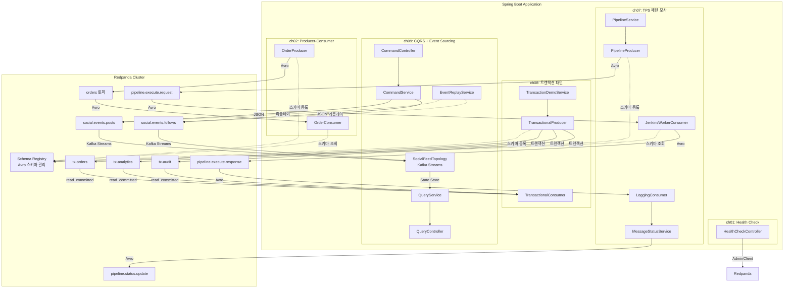
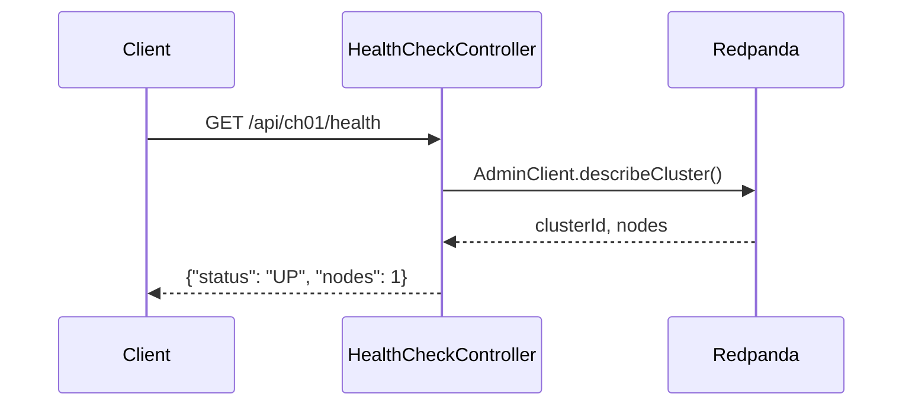
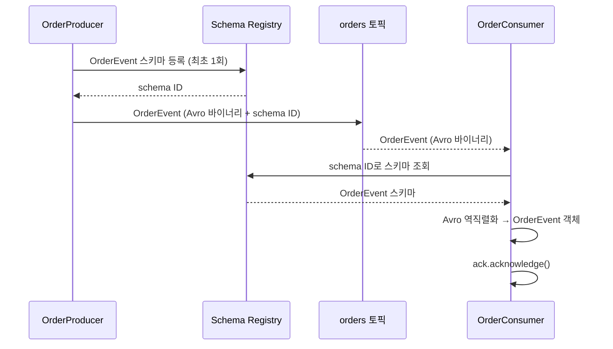
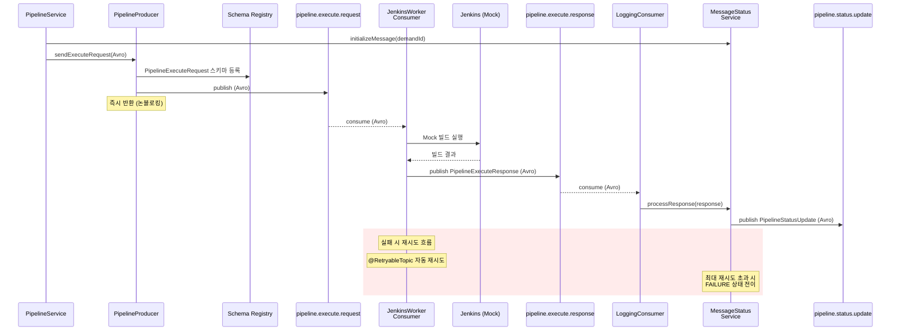
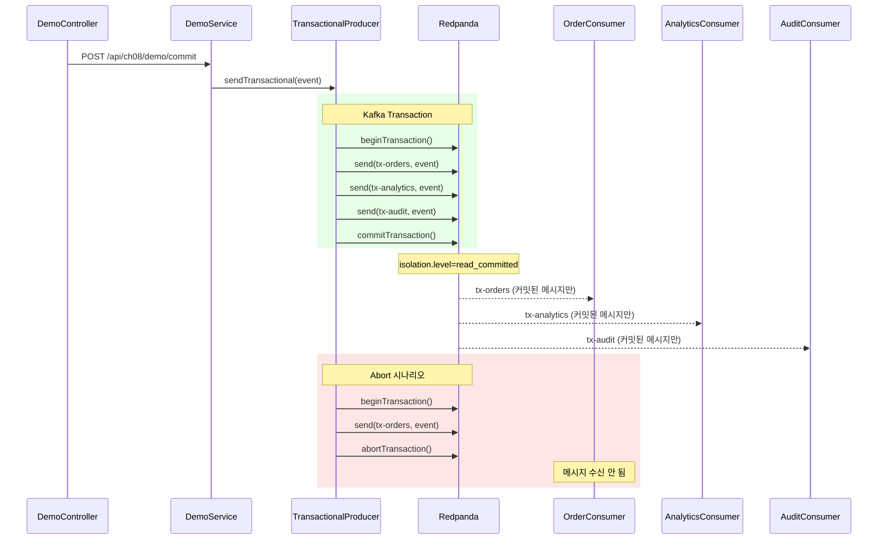
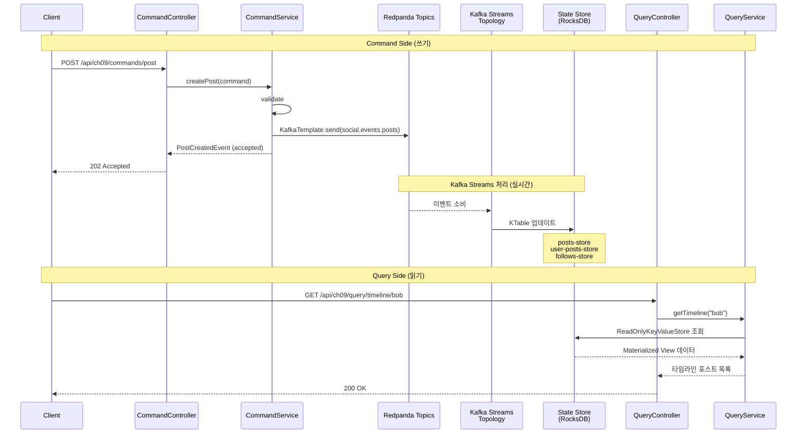
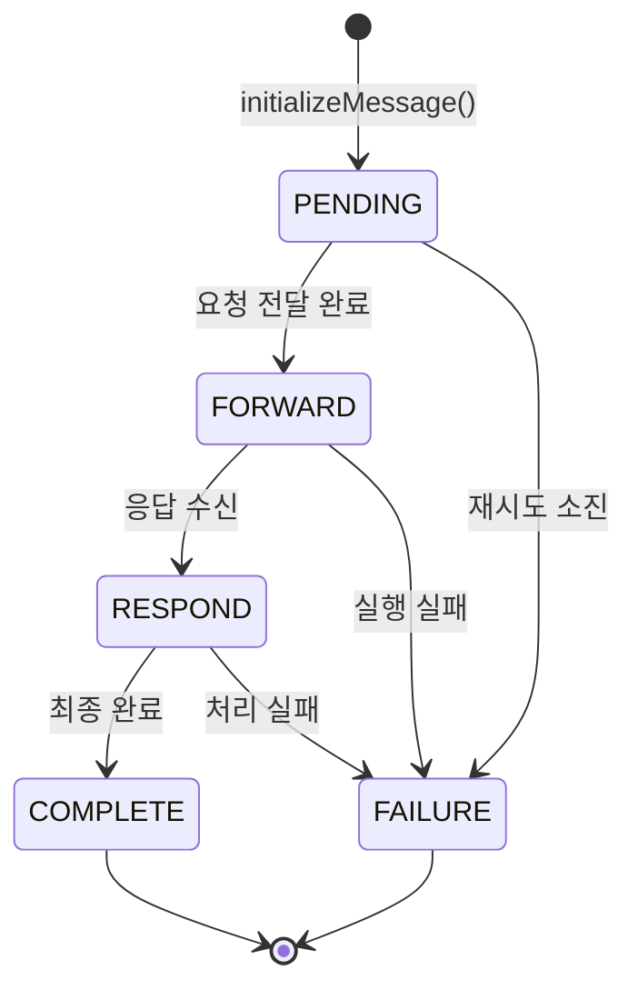

# Redpanda Spring Boot PoC

Redpanda + Spring Kafka + **Apache Avro** 기반 이벤트 드리븐 아키텍처 실습 프로젝트.
TPS 프로젝트의 REST 기반 비동기 통신을 Redpanda 메시지큐로 대체하는 PoC입니다.

---

## Why This PoC Exists

TPS 프로젝트는 Jenkins CI/CD 파이프라인을 REST API(Feign Client)와 10초 폴링 스케줄러로 관리한다. 이 구조는 **7가지 근본적 한계**를 갖고 있으며, 이벤트 드리븐 아키텍처로 전환하면 이를 체계적으로 해결할 수 있다.

**핵심 동기:**

1. **10초 폴링 = 최대 10초 지연** — 이벤트 드리븐은 ms 단위 즉시 전달
2. **단일 스레드 스케줄러 = 병목** — Consumer Group으로 수평 확장 가능
3. **fire-and-forget = 메시지 유실** — acks=all + 오프셋 관리로 전달 보장
4. **Thread.sleep(10000) = 스레드 낭비** — 비동기 이벤트로 자원 효율화
5. **DB를 MQ로 사용 = 안티패턴** — 전용 메시지큐로 관심사 분리
6. **JSON 수동 파싱 = 런타임 오류** — Avro + Schema Registry로 타입 안전성
7. **DB 분산 락 = 수평 확장 불가** — Consumer Group 파티션 기반 자동 분배

> 상세: [TPS-FLOW-DIAGRAM.md](../../TPS-FLOW-DIAGRAM.md)

---

## AS-IS 문제점 요약

| # | 문제 | 심각도 | 현재 코드 | 영향 |
|---|------|--------|----------|------|
| 1 | `Thread.sleep(10000)` 하드코딩 | **Critical** | `AsyncMessageFeignClient` | 스레드 10초 블로킹, 거짓 성공 |
| 2 | Jenkins 상태 폴링 미구현 | **Critical** | `CompletableFuture.runAsync()` | 빌드 결과 확인 불가 |
| 3 | fire-and-forget 패턴 | **High** | `JenkinsFeignClient` | 메시지 유실 가능, 백프레셔 없음 |
| 4 | 10초 폴링 지연 | **High** | `MessageTaskScheduler` | 최대 10초 응답 지연 |
| 5 | 단일 스레드 스케줄러 | **Medium** | `poolSize = 1` | 수평 확장 불가 |
| 6 | DB 폴링 오버헤드 | **Medium** | `TB_TPS_MS_021 SELECT` | 10초마다 불필요한 쿼리 |
| 7 | Jenkins Webhook 미사용 | **Low** | 미구현 | 푸시 모델 활용 안 함 |

> 상세: [01-scheduler-to-event-driven.md](docs/logic-changes/01-scheduler-to-event-driven.md), [04-thread-sleep-to-async-event.md](docs/logic-changes/04-thread-sleep-to-async-event.md)

---

## 기술 스택

| 기술 | 버전 | 역할 |
|------|------|------|
| **Redpanda** | v25.3.6 | Kafka 호환 스트리밍 플랫폼 (Schema Registry 내장) |
| **Spring Boot** | 3.3.0 | 애플리케이션 프레임워크 |
| **Spring Kafka** | - | Kafka Producer/Consumer 통합 |
| **Kafka Streams** | - | 스트림 처리 라이브러리 (ch09: CQRS Materialized View) |
| **Apache Avro** | 1.11.3 | 스키마 기반 직렬화 |
| **Confluent Avro Serializer** | 7.6.0 | Avro + Schema Registry 연동 |
| **Testcontainers** | - | 통합 테스트 (Redpanda 컨테이너) |
| **Java** | 17 | 언어 |

## 아키텍처 개요



## 챕터별 흐름도

### Ch01: Health Check

Redpanda 클러스터 연결 상태를 확인합니다.



### Ch02: Producer-Consumer (Avro)

Avro 직렬화를 사용한 기본 메시지 발행/소비 실습입니다.



### Ch07: TPS 미들웨어 패턴 모사 (Avro)

TPS 프로젝트의 `pipeline-api ↔ ppln-logging-api` REST 기반 비동기 통신을
Redpanda 토픽 + Avro 스키마로 대체합니다.



### Ch08: 트랜잭션 패턴

Kafka 트랜잭션을 사용하여 다중 토픽에 원자적으로 메시지를 발행합니다.
`executeInTransaction()`으로 commit/abort를 제어하고, Consumer는 `read_committed` 격리 수준으로 커밋된 메시지만 소비합니다.



### Ch09: CQRS + Event Sourcing (소셜 피드)

이벤트를 source of truth로 사용하는 CQRS 패턴입니다.
Command Side는 이벤트를 토픽에 발행하고, Query Side는 Kafka Streams의 Materialized View에서 조회합니다.



### 상태 전이 다이어그램



## Avro 스키마 구조

```
src/main/avro/
├── MessageStatus.avsc            # enum: PENDING, FORWARD, RESPOND, COMPLETE, FAILURE
├── OrderEvent.avsc               # ch02: 주문 이벤트
├── PipelineExecuteRequest.avsc   # ch07: 파이프라인 실행 요청
├── PipelineExecuteResponse.avsc  # ch07: 파이프라인 실행 응답
├── PipelineStatusUpdate.avsc     # ch07: 상태 업데이트
└── TransactionEvent.avsc         # ch08: 트랜잭션 이벤트 (eventId, eventType, orderId, step, payload, success)
```

Avro 스키마는 `./gradlew generateAvroJava`로 `com.study.redpanda.avro.*` 패키지에 Java 클래스를 생성합니다.
Gradle 빌드 시 자동으로 실행됩니다.

### JSON vs Avro 비교

| 항목 | JSON (이전) | Avro (현재) |
|------|------------|------------|
| **직렬화 크기** | 큼 (필드명 포함) | 작음 (바이너리, 필드명 없음) |
| **스키마 검증** | 런타임 실패 | 빌드 타임 검증 + Schema Registry |
| **호환성 관리** | 수동 | BACKWARD/FORWARD/FULL 자동 검증 |
| **코드 생성** | 수동 DTO 작성 | `.avsc` → Java 클래스 자동 생성 |
| **타입 안전성** | Object 캐스팅 필요 | Specific Record (타입 안전) |

## 프로젝트 구조

```
redpanda-spring-boot/
├── build.gradle                    # Avro 플러그인 + Confluent 저장소
├── docs/                           # 학습 문서
│   ├── logic-changes/              # 로직 변경 문서 (7개)
│   └── cross-cutting/              # 횡단 관심사 문서 (6개)
├── src/
│   ├── main/
│   │   ├── avro/                   # Avro 스키마 (.avsc)
│   │   ├── java/com/study/redpanda/
│   │   │   ├── RedpandaApplication.java
│   │   │   ├── config/
│   │   │   │   ├── KafkaConfig.java          # KafkaAdmin 설정
│   │   │   │   └── KafkaTopicConfig.java     # ch02 토픽 생성
│   │   │   ├── ch01/
│   │   │   │   └── HealthCheckController.java
│   │   │   ├── ch02/
│   │   │   │   ├── producer/OrderProducer.java     # TODO
│   │   │   │   └── consumer/OrderConsumer.java     # TODO
│   │   │   ├── ch07/
│   │   │   │   ├── config/MiddlewareTopicConfig.java
│   │   │   │   ├── model/MessageStatusRule.java    # 상태 전이 규칙
│   │   │   │   ├── producer/PipelineProducer.java  # TODO
│   │   │   │   ├── consumer/
│   │   │   │   │   ├── JenkinsWorkerConsumer.java  # TODO
│   │   │   │   │   └── LoggingConsumer.java        # TODO
│   │   │   │   └── service/
│   │   │   │       ├── PipelineService.java        # TODO
│   │   │   │       └── MessageStatusService.java   # TODO
│   │   │   ├── ch08/
│   │   │   │   ├── config/
│   │   │   │   │   ├── KafkaTransactionConfig.java    # 트랜잭션 ProducerFactory
│   │   │   │   │   └── TransactionTopicConfig.java    # tx-orders/analytics/audit
│   │   │   │   ├── producer/TransactionalProducer.java  # TODO
│   │   │   │   ├── consumer/TransactionalConsumer.java  # TODO
│   │   │   │   ├── service/TransactionDemoService.java  # TODO
│   │   │   │   └── controller/TransactionDemoController.java
│   │   │   └── ch09/                                    # CQRS + Event Sourcing
│   │   │       ├── config/
│   │   │       │   ├── SocialFeedTopicConfig.java       # posts/follows 토픽
│   │   │       │   └── Ch09KafkaProducerConfig.java     # JSON KafkaTemplate
│   │   │       ├── event/                               # 이벤트 (Source of Truth)
│   │   │       │   ├── PostCreatedEvent.java
│   │   │       │   ├── PostDeletedEvent.java
│   │   │       │   ├── UserFollowedEvent.java
│   │   │       │   └── UserUnfollowedEvent.java
│   │   │       ├── command/                             # Command Side (쓰기)
│   │   │       │   ├── dto/
│   │   │       │   │   ├── CreatePostCommand.java
│   │   │       │   │   └── FollowCommand.java
│   │   │       │   ├── controller/CommandController.java
│   │   │       │   └── service/CommandService.java
│   │   │       ├── stream/                              # Kafka Streams (처리)
│   │   │       │   ├── config/KafkaStreamsConfig.java
│   │   │       │   ├── topology/SocialFeedTopology.java # 핵심 토폴로지
│   │   │       │   └── serde/JsonSerde.java
│   │   │       ├── query/                               # Query Side (읽기)
│   │   │       │   ├── controller/QueryController.java
│   │   │       │   └── service/QueryService.java
│   │   │       └── replay/                              # Event Replay
│   │   │           ├── EventReplayService.java
│   │   │           └── ReplayController.java
│   │   └── resources/
│   │       └── application.yml     # Avro Serializer + Schema Registry
│   └── test/
│       └── java/com/study/redpanda/
│           ├── config/AbstractKafkaTest.java   # Testcontainers + SR
│           ├── ch01/HealthCheckControllerTest.java
│           ├── ch07/MessageStatusServiceTest.java
│           ├── ch08/TransactionalProducerTest.java  # TODO
│           └── ch09/
│               ├── SocialFeedTopologyTest.java      # TopologyTestDriver 단위 테스트
│               └── CommandServiceTest.java          # Mock 단위 테스트
└── README.md
```

## 빠른 시작

```bash
# 1. Redpanda + Console 실행
cd ../
docker-compose up -d
# Console: http://localhost:8080
# Schema Registry: http://localhost:18081

# 2. Avro 클래스 생성 + 빌드
./gradlew build

# 3. 로컬 실행
./gradlew bootRun --args='--spring.profiles.active=local'

# 4. K8s 클러스터 연결
./gradlew bootRun --args='--spring.profiles.active=dev'

# 5. 헬스체크
curl http://localhost:8080/api/ch01/health

# 6. 테스트 (Testcontainers + Schema Registry)
./gradlew test
```

## 프로파일 설정

| 프로파일 | Kafka | Schema Registry | 용도 |
|----------|-------|-----------------|------|
| `local` | `localhost:19092` | `http://localhost:18081` | docker-compose 로컬 개발 |
| `dev` | `10.255.17.176:31092` | `http://10.255.17.176:30081` | K8s 클러스터 연결 |

## TPS 패턴 매핑

| TPS 원본 | PoC 대응 | 변경점 |
|----------|---------|--------|
| `JenkinsFeignClient` (REST) | `PipelineProducer` (Kafka + Avro) | REST → Avro 메시지큐 |
| `AsyncMessageFeignClient` (REST) | `LoggingConsumer` (Kafka + Avro) | Feign → @KafkaListener |
| `CompletableFuture` + `Thread.sleep` | 토픽 기반 비동기 | 폴링 → 이벤트 드리븐 |
| `TB_TPS_MS_021` 상태관리 | `MessageStatusService` (인메모리) | DB → 인메모리 (PoC) |
| JSON 직렬화 | Avro + Schema Registry | 스키마 진화 + 호환성 검증 |
| Quartz 분산 락 (`TB_TPS_PL_099`) | Consumer Group 파티션 할당 | DB 락 → 자동 리밸런싱 |
| JSON 수동 파싱/생성 | Avro 바이너리 + 스키마 자동 검증 | 런타임 오류 → 빌드 타임 검증 |

---

## 로직 변경 문서

AS-IS(TPS) → TO-BE(RedPanda) 로직 변경을 상세하게 분석한 문서입니다.

| # | 문서 | 핵심 변경 | 링크 |
|---|------|----------|------|
| 01 | 스케줄러 → 이벤트 드리븐 | 10초 폴링 제거, @KafkaListener 즉시 전달 | [바로가기](docs/logic-changes/01-scheduler-to-event-driven.md) |
| 02 | Feign REST → Kafka Producer | fire-and-forget 제거, acks=all 전달 보장 | [바로가기](docs/logic-changes/02-feign-rest-to-kafka-producer.md) |
| 03 | REST 폴링 → Kafka Consumer | 수신자 가용성 의존 제거, 오프셋 관리 | [바로가기](docs/logic-changes/03-rest-polling-to-kafka-consumer.md) |
| 04 | Thread.sleep → 비동기 이벤트 | 10초 하드코딩 제거, 이벤트 기반 완료 감지 | [바로가기](docs/logic-changes/04-thread-sleep-to-async-event.md) |
| 05 | DB 상태 테이블 → 인메모리+토픽 | DB를 MQ로 사용하는 안티패턴 제거 | [바로가기](docs/logic-changes/05-db-state-to-inmemory-topic.md) |
| 06 | JSON → Avro + Schema Registry | 런타임 역직렬화 실패 방지, 스키마 진화 | [바로가기](docs/logic-changes/06-json-manual-to-avro-schema-registry.md) |
| 07 | DB 분산 락 → Consumer Group | 수평 확장 가능, 빠른 리밸런싱 | [바로가기](docs/logic-changes/07-db-lock-to-consumer-group.md) |

## 횡단 관심사 문서

에러 핸들링, 모니터링, 보안, 테스트, 마이그레이션 등 전체를 관통하는 주제입니다.

| # | 문서 | 핵심 내용 | 링크 |
|---|------|----------|------|
| 08 | 에러 핸들링 비교 | 스케줄러 재시도 vs @RetryableTopic/DLQ | [바로가기](docs/cross-cutting/08-error-handling-comparison.md) |
| 09 | 모니터링/옵저버빌리티 | DB 상태 조회 vs Prometheus + Consumer Lag | [바로가기](docs/cross-cutting/09-monitoring-observability.md) |
| 10 | 보안 비교 | Basic Auth+Crumb vs TLS+SASL+ACL | [바로가기](docs/cross-cutting/10-security-comparison.md) |
| 11 | 테스트 전략 | 수동 테스트 vs Testcontainers+Redpanda | [바로가기](docs/cross-cutting/11-testing-strategy.md) |
| 12 | 마이그레이션 전략 | Strangler Fig: Dual-write → Shadow → Primary | [바로가기](docs/cross-cutting/12-migration-strategy.md) |
| 13 | 성능 기대치 | 10초 폴링→ms 이벤트, 파티션 병렬도 | [바로가기](docs/cross-cutting/13-performance-expectations.md) |

---

## 면접 Quick Reference

| # | 질문 | 1줄 답변 | 상세 |
|---|------|---------|------|
| 1 | 왜 REST 대신 메시지큐? | fire-and-forget 제거, 비동기 디커플링, 백프레셔 확보 | [02](docs/logic-changes/02-feign-rest-to-kafka-producer.md) |
| 2 | 10초 폴링의 문제점? | 최대 10초 지연 + 단일 스레드 병목 + DB 부하 | [01](docs/logic-changes/01-scheduler-to-event-driven.md) |
| 3 | Consumer Group이란? | 파티션 기반 자동 분배로 수평 확장, DB 락 대체 | [07](docs/logic-changes/07-db-lock-to-consumer-group.md) |
| 4 | Avro vs JSON? | 바이너리 직렬화로 크기 절감, Schema Registry로 호환성 자동 검증 | [06](docs/logic-changes/06-json-manual-to-avro-schema-registry.md) |
| 5 | DLQ란? | 처리 실패 메시지를 격리하는 Dead Letter Topic, Poison Pill 방지 | [08](docs/cross-cutting/08-error-handling-comparison.md) |
| 6 | Kafka 트랜잭션? | executeInTransaction()으로 다중 토픽 원자적 발행, read_committed 격리 | ch08 소스 |
| 7 | 마이그레이션 전략? | Strangler Fig 패턴: Dual-write → Shadow → Primary 순차 전환 | [12](docs/cross-cutting/12-migration-strategy.md) |
| 8 | 모니터링 방법? | Prometheus 메트릭 + Consumer Lag 추적 + Grafana 대시보드 | [09](docs/cross-cutting/09-monitoring-observability.md) |
| 9 | Kafka 보안? | TLS(암호화) + SASL(인증) + ACL(인가) 3계층 심층 방어 | [10](docs/cross-cutting/10-security-comparison.md) |
| 10 | 테스트 전략? | Testcontainers로 실제 Redpanda 컨테이너 사용, 테스트 피라미드 준수 | [11](docs/cross-cutting/11-testing-strategy.md) |
| 11 | CQRS란? | Command(쓰기)와 Query(읽기)를 분리하여 독립 최적화, Eventual Consistency | ch09 소스 |
| 12 | Event Sourcing이란? | 현재 상태 대신 이벤트 시퀀스를 저장, 이벤트 리플레이로 상태 복원 가능 | ch09 소스 |
| 13 | Kafka Streams? | 브로커 없이 라이브러리로 스트림 처리, KTable + Interactive Query | ch09 소스 |

## 현직 사례 요약

| 기업 | 핵심 사례 | 교훈 | 상세 |
|------|----------|------|------|
| **Toss** | 듀얼 프로듀서 전략: 시세(acks=0) vs 거래(acks=all) | 데이터 중요도별 전달 보장 수준 차등 적용 | [02](docs/logic-changes/02-feign-rest-to-kafka-producer.md) |
| **LINE** | 단일 클러스터 250억 레코드/일, 210TB | 파티션 설계 + request quota로 대규모 운영 | [01](docs/logic-changes/01-scheduler-to-event-driven.md) |
| **Saramin** | max.poll.records=500→2 튜닝으로 리밸런싱 해결 | Consumer 설정이 안정성의 핵심 | [03](docs/logic-changes/03-rest-polling-to-kafka-consumer.md) |
| **우아한형제들** | Transactional Outbox + CDC로 주문 유실률 0% | 이벤트 드리븐 + at-least-once 보장 | [08](docs/cross-cutting/08-error-handling-comparison.md) |

> 상세 사례 분석: 각 문서의 "현직 사례" 섹션 참고

---

## TODO 실습 항목

### Ch02: Producer-Consumer

| # | 파일 | 난이도 | 설명 |
|---|------|--------|------|
| 1 | `OrderProducer.java` | ★☆☆ | KafkaTemplate으로 Avro OrderEvent 발행 |
| 2 | `OrderConsumer.java` | ★☆☆ | @KafkaListener로 Avro OrderEvent 소비 |

### Ch07: TPS 패턴 모사

| # | 파일 | 난이도 | 설명 |
|---|------|--------|------|
| 3 | `PipelineProducer.java` | ★★☆ | Avro 요청 발행 + 콜백 로깅 |
| 4 | `JenkinsWorkerConsumer.java` | ★★☆ | Avro 요청 소비 → Mock 실행 → Avro 응답 발행 |
| 5 | `LoggingConsumer.java` | ★★☆ | Avro 응답 소비 → 상태 관리 |
| 6 | `PipelineService.java` | ★★☆ | Avro Builder로 요청 생성 + 오케스트레이션 |
| 7 | `MessageStatusService.java` | ★★★ | 상태 전이 + MessageStatusRule 검증 + Avro 이벤트 발행 |

### Ch08: 트랜잭션 패턴

| # | 파일 | 난이도 | 설명 |
|---|------|--------|------|
| 8 | `TransactionalProducer.java` | ★★☆ | executeInTransaction()으로 다중 토픽 원자적 발행 |
| 9 | `TransactionalConsumer.java` | ★★☆ | read_committed 격리 수준으로 커밋된 메시지만 소비 |
| 10 | `TransactionDemoService.java` | ★★★ | commit/abort/batch/parallel/sequential 5가지 시나리오 |
| 11 | `TransactionalProducerTest.java` | ★★★ | Testcontainers로 트랜잭션 commit/abort 검증 |

### Ch09: CQRS + Event Sourcing (구현 완료)

| # | 파일 | 난이도 | 설명 |
|---|------|--------|------|
| 12 | `CommandService.java` | ★★☆ | 커맨드 검증 → 이벤트 발행 (토픽이 DB 대신 저장소) |
| 13 | `SocialFeedTopology.java` | ★★★ | Kafka Streams 토폴로지: KTable, aggregate, State Store |
| 14 | `QueryService.java` | ★★☆ | Interactive Query로 Materialized View 조회 |
| 15 | `EventReplayService.java` | ★★★ | 전체 이벤트 리플레이 → State Store 재구축 |

**Ch09 API 테스트:**
```bash
# 1. 팔로우 관계 설정
curl -X POST http://localhost:8080/api/ch09/commands/follow \
  -H "Content-Type: application/json" \
  -d '{"followerId":"bob","followeeId":"alice"}'

# 2. 포스트 작성
curl -X POST http://localhost:8080/api/ch09/commands/post \
  -H "Content-Type: application/json" \
  -d '{"authorId":"alice","content":"Hello CQRS!"}'

# 3. 타임라인 조회 (Kafka Streams 처리 후)
sleep 3
curl http://localhost:8080/api/ch09/query/timeline/bob

# 4. 유저 포스트 조회
curl http://localhost:8080/api/ch09/query/posts/alice

# 5. Event Replay (Materialized View 재구축)
curl -X POST http://localhost:8080/api/ch09/replay/rebuild
```

**학습 문서:** `learning/06-cqrs-event-sourcing/` (5개 문서)
