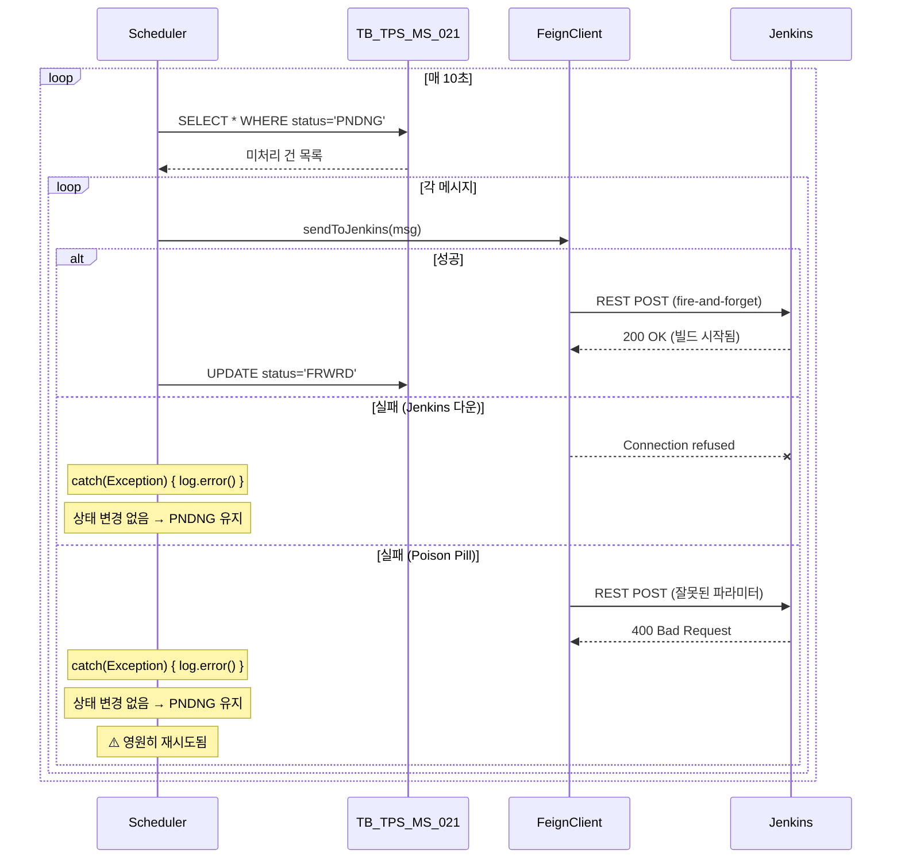
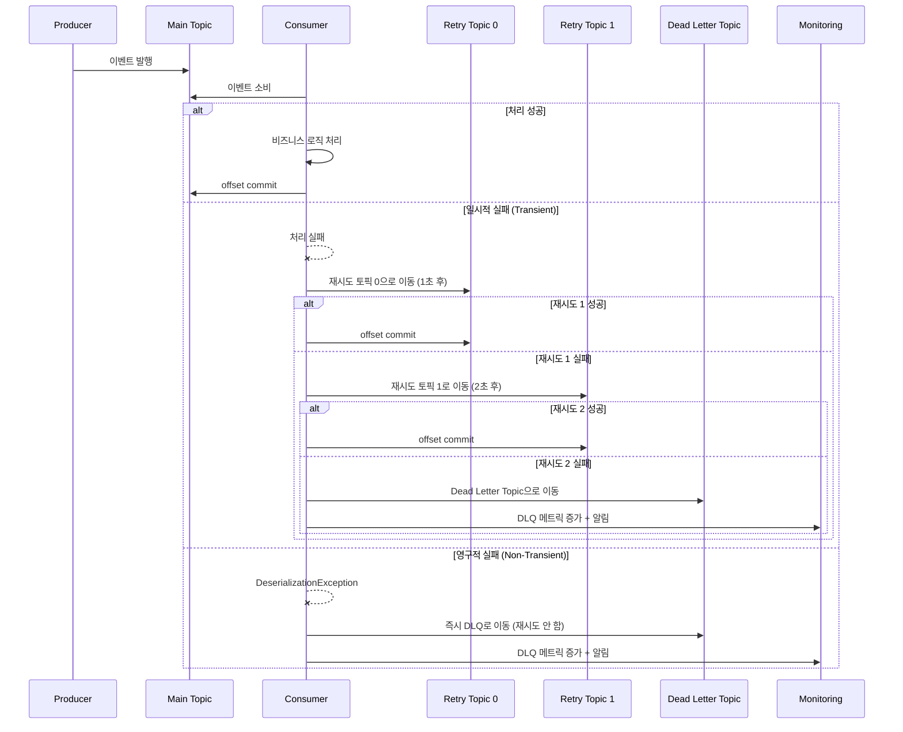

# 에러 핸들링 비교: 스케줄러 재시도 vs @RetryableTopic / DLQ

> 한줄 요약: TPS의 스케줄러 기반 암묵적 재시도를 Spring Kafka의 @RetryableTopic + Dead Letter Queue로 대체하여, 에러 분류·재시도·격리·재처리를 체계적으로 관리한다.

---

## 1. AS-IS: TPS 에러 핸들링 방식

### 1.1 현재 에러 처리 구조

TPS 시스템은 **명시적 에러 핸들링 전략이 없다**. 스케줄러가 10초마다 재실행되면서, 이전에 실패한 작업을 암묵적으로 "재시도"하는 구조다.

```java
// MessageTaskScheduler.java — 에러 핸들링의 부재
@Scheduled(fixedDelay = 10000)
public void processMessages() {
    try {
        // 1. DB에서 미처리 건 조회
        List<Message> pending = messageMapper.selectPending();

        // 2. 각 건 처리
        for (Message msg : pending) {
            try {
                feignClient.sendToJenkins(msg);  // fire-and-forget
                messageMapper.updateStatus(msg.getId(), "FRWRD");
            } catch (Exception e) {
                // ⚠️ 개별 실패 시: 로그만 남기고 다음 건으로
                log.error("처리 실패: {}", msg.getId(), e);
                // 상태 업데이트 없음 → 다음 스케줄에서 다시 조회됨
            }
        }
    } catch (Exception e) {
        // ⚠️ 전체 실패 시: 로그만 남기고 다음 스케줄 대기
        log.error("스케줄러 실행 실패", e);
    }
}
```

### 1.2 암묵적 재시도 메커니즘

```
┌──────────────────────────────────────────────────┐
│ TPS 암묵적 재시도 흐름                             │
│                                                  │
│  [스케줄러 실행] ──→ [DB 조회: 상태=PNDNG]         │
│       │                     │                    │
│       │              ┌──────┴──────┐             │
│       │              │  처리 시도   │             │
│       │              └──────┬──────┘             │
│       │              성공 ↙     ↘ 실패            │
│       │        상태=FRWRD    상태 유지(PNDNG)      │
│       │                         │                │
│       │    ┌────────────────────┘                 │
│       │    │                                     │
│  [10초 후] ──→ [DB 조회: 상태=PNDNG] ← 동일 건    │
│       │              │                           │
│       │         다시 처리 시도 (무한 반복)          │
│       └──────────────────────────────────────────│
└──────────────────────────────────────────────────┘
```

### 1.3 에러 유형별 현재 대응

| 에러 유형 | 예시 | TPS 대응 | 문제점 |
|-----------|------|---------|--------|
| **일시적 오류** | Jenkins 일시 불가, 네트워크 단절 | 다음 스케줄에서 재시도 | 10초 대기, 재시도 횟수 무제한 |
| **영구적 오류** | 잘못된 데이터, Jenkins Job 삭제됨 | 영원히 재시도 (Poison Pill) | 무한 루프, DB 부하 |
| **부분 실패** | 10건 중 3건 실패 | 실패 건만 다음에 재처리 | 순서 보장 없음, 추적 불가 |
| **시스템 장애** | DB 연결 실패, OOM | 스케줄러 자체 중단 | 복구 메커니즘 없음 |

### 1.4 시퀀스 다이어그램



---

## 2. Problem: 왜 바꿔야 하는가

### 2.1 구체적 문제점

#### 문제 1: Poison Pill 무한 루프

```
시나리오: Jenkins Job이 삭제된 메시지
─────────────────────────────────
시도 1 (T+0s):   POST /job/deleted-job/build → 404 → 로그
시도 2 (T+10s):  POST /job/deleted-job/build → 404 → 로그
시도 3 (T+20s):  POST /job/deleted-job/build → 404 → 로그
...
시도 8640 (T+24h): POST /job/deleted-job/build → 404 → 로그
→ 하루에 8,640회 무의미한 호출, 로그 파일 비대화
→ 다른 정상 메시지 처리 지연
```

#### 문제 2: 에러 분류 부재

```java
// 현재 코드: 모든 에러를 동일하게 처리
catch (Exception e) {
    log.error("처리 실패: {}", msg.getId(), e);
    // ConnectException (일시적) = 404 Not Found (영구적) = NPE (버그)
    // → 모두 "다음 스케줄에서 재시도"
}

// 있어야 할 코드:
catch (ConnectException e) {
    // 일시적 → 재시도 (backoff 적용)
} catch (HttpClientErrorException e) {
    if (e.getStatusCode() == 404) {
        // 영구적 → DLQ로 이동
    }
} catch (Exception e) {
    // 알 수 없는 에러 → 격리 후 알림
}
```

#### 문제 3: 재시도 전략 부재

```
현재: 고정 10초 간격, 무한 재시도
────────────────────────
문제점:
├── Backoff 없음: 장애 서비스에 10초마다 요청 폭탄
├── Max retry 없음: 영원히 재시도
├── Circuit breaker 없음: 장애 전파
└── 재시도 횟수 추적 없음: 몇 번 실패했는지 모름

필요한 것: Exponential Backoff + Max Retry + DLQ
────────────────────────
시도 1: 즉시
시도 2: 1초 후
시도 3: 2초 후
시도 4: 4초 후 (최대 3회 재시도 후 DLQ 이동)
```

#### 문제 4: 실패 추적/모니터링 불가

```sql
-- 현재 가능한 조회: "PNDNG 상태인 건이 몇 개인가?"
SELECT COUNT(*) FROM TB_TPS_MS_021 WHERE linkSttsCd = 'PNDNG';
-- 결과: 47건

-- 알 수 없는 것:
-- 1. 47건 중 새로 들어온 건 vs 재시도 중인 건?
-- 2. 각 건이 몇 번 재시도되었는가?
-- 3. 실패 원인이 무엇인가? (일시적? 영구적?)
-- 4. 언제부터 실패하기 시작했는가?
-- 5. 특정 Jenkins Job에서만 실패하는가?
```

### 2.2 문제가 발생하는 시나리오

**시나리오 1: Jenkins 버전 업그레이드 중 부분 장애**

```
상황: Jenkins 노드 3대 중 1대가 업그레이드 중 (30분)
─────────────────────────────────
TPS AS-IS:
- 해당 노드로 보내는 메시지 → 모두 실패
- 10초마다 재시도 (30분 = 180회 무의미한 호출)
- 로그에 180개 에러 기록
- 다른 노드로 보내는 메시지도 지연 (단일 스레드)

TO-BE (이벤트 드리븐):
- 첫 번째 실패 → 1초 후 재시도
- 두 번째 실패 → 2초 후 재시도
- 세 번째 실패 → 4초 후 재시도 (3회 소진)
- DLQ로 이동 → 알림 발송
- 다른 메시지 처리에 영향 없음 (독립 파티션)
```

**시나리오 2: 데이터 오류로 인한 Poison Pill**

```
상황: 신규 연동 시스템에서 잘못된 포맷의 데이터 전송
─────────────────────────────────
TPS AS-IS:
- 50건 잘못된 데이터 도착
- 50건 모두 PNDNG 상태 유지
- 10초마다 50건 × 재시도 = 하루 432,000회 무의미한 처리
- 정상 데이터 처리 속도 저하
- 운영팀은 "왜 느려졌지?" → DB 조회 → 원인 파악 수시간

TO-BE (이벤트 드리븐):
- 50건 도착 → 역직렬화 실패 (Non-Transient Error 감지)
- 즉시 DLQ(Dead Letter Topic)로 이동
- 정상 메시지 처리에 영향 없음
- 알림: "DLQ에 50건 적재, 원인: 역직렬화 실패"
- 운영팀: 즉시 원인 파악 + 데이터 보정 후 DLQ 재처리
```

---

## 3. TO-BE: RedPanda 기반 에러 핸들링

### 3.1 설계 원리

```
이벤트 드리븐 에러 핸들링 3원칙:
─────────────────────────────
1. 에러 분류 (Classification)
   → Transient vs Non-Transient 구분
   → 각 유형에 맞는 전략 적용

2. 격리 (Isolation)
   → 실패 메시지를 DLQ로 격리
   → 정상 메시지 처리에 영향 없음

3. 관측 (Observability)
   → 재시도 횟수, 실패 원인, DLQ 적재량 추적
   → 알림으로 빠른 대응
```

### 3.2 Spring Kafka 에러 핸들링 계층

```
┌────────────────────────────────────────────────────┐
│ Layer 1: Producer 에러 핸들링                        │
│ ├── acks=all: 브로커 수신 보장                       │
│ ├── retries=3: 프로듀서 레벨 재시도                   │
│ ├── Callback: 성공/실패 비동기 처리                   │
│ └── Idempotent: enable.idempotence=true             │
├────────────────────────────────────────────────────┤
│ Layer 2: Consumer 에러 핸들링                        │
│ ├── DefaultErrorHandler: 동기식 재시도               │
│ ├── @RetryableTopic: 토픽 기반 비동기 재시도          │
│ ├── SeekToCurrentErrorHandler: 오프셋 되감기         │
│ └── RecoveringBatchErrorHandler: 배치 에러           │
├────────────────────────────────────────────────────┤
│ Layer 3: Dead Letter Queue                          │
│ ├── DLT 토픽 자동 생성                               │
│ ├── 원본 메시지 + 에러 정보 보존                      │
│ ├── DLQ 모니터링 서비스                              │
│ └── 재처리 API                                      │
└────────────────────────────────────────────────────┘
```

### 3.3 방식 1: DefaultErrorHandler (동기식)

```java
@Configuration
public class KafkaErrorConfig {

    @Bean
    public DefaultErrorHandler errorHandler(
            KafkaTemplate<String, Object> kafkaTemplate) {

        // 1. DLQ Publisher 설정
        DeadLetterPublishingRecoverer recoverer =
            new DeadLetterPublishingRecoverer(kafkaTemplate,
                (record, ex) -> new TopicPartition(
                    record.topic() + ".DLT", record.partition()));

        // 2. Backoff 설정: 1초 → 2초 → 4초 (최대 3회)
        FixedBackOff backOff = new FixedBackOff(1000L, 3L);

        // 3. ErrorHandler 생성
        DefaultErrorHandler handler = new DefaultErrorHandler(recoverer, backOff);

        // 4. Non-Transient Error는 즉시 DLQ로 (재시도 안 함)
        handler.addNotRetryableExceptions(
            DeserializationException.class,
            MessageConversionException.class,
            MethodArgumentNotValidException.class
        );

        return handler;
    }
}
```

**특징:**
- 같은 컨슈머 스레드에서 재시도 (동기식)
- 재시도 중 다른 메시지 처리 차단
- 단순한 구조, 적은 재시도에 적합

### 3.4 방식 2: @RetryableTopic (비동기식, 권장)

```java
@Component
public class JenkinsEventConsumer {

    @RetryableTopic(
        attempts = "4",           // 최초 1회 + 재시도 3회
        backoff = @Backoff(
            delay = 1000,         // 초기 1초
            multiplier = 2,       // 2배씩 증가
            maxDelay = 10000      // 최대 10초
        ),
        topicSuffixingStrategy = TopicSuffixingStrategy.SUFFIX_WITH_INDEX_VALUE,
        dltStrategy = DltStrategy.FAIL_ON_ERROR,
        exclude = {                // 재시도하지 않는 에러
            DeserializationException.class,
            MessageConversionException.class
        }
    )
    @KafkaListener(topics = "jenkins-build-events", groupId = "tps-consumer")
    public void handleBuildEvent(JenkinsBuildEvent event) {
        log.info("이벤트 수신: {}", event.getBuildId());

        // 비즈니스 로직 처리
        buildResultService.process(event);
    }

    @DltHandler
    public void handleDlt(JenkinsBuildEvent event,
                          @Header(KafkaHeaders.RECEIVED_TOPIC) String topic,
                          @Header(KafkaHeaders.EXCEPTION_MESSAGE) String errorMsg) {
        log.error("DLQ 도착 - topic: {}, event: {}, error: {}",
                  topic, event.getBuildId(), errorMsg);

        // DLQ 모니터링 메트릭 증가
        meterRegistry.counter("kafka.dlq.count", "topic", topic).increment();

        // 알림 발송
        alertService.sendDlqAlert(topic, event, errorMsg);

        // DLQ 이벤트 저장 (재처리용)
        dlqRepository.save(new DlqRecord(topic, event, errorMsg));
    }
}
```

**@RetryableTopic 토픽 흐름:**

```
jenkins-build-events          ← 원본 토픽
  │ 실패
  ▼
jenkins-build-events-retry-0  ← 1초 후 재시도
  │ 실패
  ▼
jenkins-build-events-retry-1  ← 2초 후 재시도
  │ 실패
  ▼
jenkins-build-events-retry-2  ← 4초 후 재시도
  │ 실패
  ▼
jenkins-build-events-dlt      ← Dead Letter Topic (최종)
```

**장점:**
- 재시도를 별도 토픽으로 분리 → 원본 토픽 소비 차단 없음
- 토픽별 backoff 자동 관리
- DLT 자동 생성 및 @DltHandler 연동

### 3.5 PoC 코드 매핑

| 에러 핸들링 요소 | PoC 파일 | 설명 |
|-----------------|---------|------|
| 재시도 설정 | `ch02/config/KafkaProducerConfig.java` | retries=3, acks=all |
| Consumer 에러 | `ch02/consumer/EventConsumer.java` | @KafkaListener + try-catch |
| 트랜잭션 에러 | `ch08/producer/TransactionalProducer.java` | executeInTransaction + abort |
| DLQ 설정 | TODO (ch09 예정) | @RetryableTopic + @DltHandler |

### 3.6 시퀀스 다이어그램



---

## 4. AS-IS vs TO-BE 비교

| 비교 항목 | AS-IS (TPS 스케줄러) | TO-BE (Spring Kafka + DLQ) |
|-----------|---------------------|---------------------------|
| **에러 분류** | 없음 (모든 에러 동일 처리) | Transient vs Non-Transient 구분 |
| **재시도 전략** | 고정 10초, 무한 반복 | Exponential Backoff, 최대 횟수 제한 |
| **Poison Pill 대응** | 없음 (무한 루프) | Non-Transient → 즉시 DLQ 격리 |
| **실패 격리** | 없음 (같은 테이블, 같은 스레드) | DLT 토픽으로 격리, 정상 처리 무영향 |
| **재시도 추적** | 불가 (재시도 횟수 미기록) | 토픽별 재시도 횟수 자동 추적 |
| **모니터링** | DB 수동 조회 | Prometheus 메트릭 + 실시간 알림 |
| **재처리** | 수동 (DBA가 상태 업데이트) | DLQ 재처리 API 제공 |
| **순서 보장** | 없음 (재시도 시 순서 뒤바뀜) | 파티션 내 순서 보장 |
| **처리량 영향** | 실패 건이 정상 건 처리 지연 | 실패 건 격리, 정상 처리 무영향 |
| **코드 복잡도** | 낮음 (에러 핸들링 자체가 없음) | 중간 (@RetryableTopic 어노테이션) |

---

## 5. DLQ 운영 전략

### 5.1 DLQ 모니터링 서비스

```java
@Service
@RequiredArgsConstructor
public class DlqMonitoringService {

    private final KafkaAdmin kafkaAdmin;
    private final MeterRegistry meterRegistry;

    @Scheduled(fixedRate = 60000)  // 1분마다
    public void checkDlqStatus() {
        try (AdminClient admin = AdminClient.create(
                kafkaAdmin.getConfigurationProperties())) {

            // DLT 토픽 목록 조회
            Set<String> dltTopics = admin.listTopics().names().get()
                .stream()
                .filter(t -> t.endsWith(".DLT") || t.endsWith("-dlt"))
                .collect(Collectors.toSet());

            for (String dlt : dltTopics) {
                // Consumer Group의 lag 조회
                long lag = calculateLag(admin, dlt);

                // 메트릭 기록
                meterRegistry.gauge("kafka.dlq.lag",
                    Tags.of("topic", dlt), lag);

                // 임계치 초과 시 알림
                if (lag > 100) {
                    alertService.sendAlert(
                        "DLQ 적재량 임계치 초과: " + dlt + " = " + lag);
                }
            }
        }
    }
}
```

### 5.2 DLQ 재처리 API

```java
@RestController
@RequestMapping("/api/dlq")
@RequiredArgsConstructor
public class DlqReprocessController {

    private final KafkaTemplate<String, Object> kafkaTemplate;
    private final DlqRepository dlqRepository;

    // 특정 DLQ 메시지 재처리
    @PostMapping("/reprocess/{id}")
    public ResponseEntity<?> reprocessSingle(@PathVariable Long id) {
        DlqRecord record = dlqRepository.findById(id)
            .orElseThrow(() -> new NotFoundException("DLQ record not found"));

        // 원본 토픽으로 재발행
        String originalTopic = record.getOriginalTopic();
        kafkaTemplate.send(originalTopic, record.getKey(), record.getValue());

        record.markReprocessed();
        dlqRepository.save(record);

        return ResponseEntity.ok("Reprocessed: " + id);
    }

    // 특정 토픽의 DLQ 전체 재처리
    @PostMapping("/reprocess/topic/{topicName}")
    public ResponseEntity<?> reprocessByTopic(@PathVariable String topicName) {
        List<DlqRecord> records = dlqRepository
            .findByOriginalTopicAndStatus(topicName, DlqStatus.PENDING);

        int count = 0;
        for (DlqRecord record : records) {
            kafkaTemplate.send(topicName, record.getKey(), record.getValue());
            record.markReprocessed();
            count++;
        }
        dlqRepository.saveAll(records);

        return ResponseEntity.ok("Reprocessed " + count + " records from " + topicName);
    }
}
```

### 5.3 Kafka 트랜잭션과 DLQ의 관계

```
트랜잭션 + DLQ 통합 시나리오:
────────────────────────────
1. Consumer가 메시지 소비
2. 비즈니스 로직 실행 (트랜잭션 내)
3. 결과를 다른 토픽에 발행 (같은 트랜잭션)
4. Consumer 오프셋 커밋 (같은 트랜잭션)

실패 시:
- 트랜잭션 abort → 모든 변경 롤백
- @RetryableTopic에 의해 재시도 토픽으로 이동
- 재시도 소진 → DLT로 이동
- DLT 발행도 트랜잭션으로 보호 가능

PoC ch08 참고:
- TransactionalProducer.sendWithAbort() → 의도적 abort 시나리오
- isolation.level=read_committed → 커밋된 메시지만 소비
```

---

## 6. 현직 사례

### 6.1 Toss: 금융 이벤트 에러 핸들링

```
전략:
├── 에러 분류 자동화
│   ├── HTTP 4xx → Non-Transient → 즉시 DLQ
│   ├── HTTP 5xx → Transient → 3회 재시도 후 DLQ
│   └── Timeout → Transient → 5회 재시도 후 DLQ
├── DLQ 운영
│   ├── DLQ 토픽 보존 기간: 7일
│   ├── 자동 알림: Slack + PagerDuty
│   └── 재처리 대시보드 (관리자 UI)
└── 듀얼 프로듀서 전략
    ├── acks=0: 시세 데이터 (유실 허용)
    └── acks=all: 거래 데이터 (유실 불허)
```

### 6.2 우아한형제들: 주문 이벤트 재시도

```
전략:
├── Transactional Outbox 패턴
│   ├── DB 트랜잭션 + 아웃박스 테이블 동시 커밋
│   ├── CDC(Change Data Capture)로 아웃박스 → Kafka 발행
│   └── at-least-once 보장
├── Consumer 재시도
│   ├── Exponential Backoff: 1s → 2s → 4s → 8s → 16s
│   ├── 최대 5회 재시도
│   └── DLQ 적재 후 수동 검토
└── 결과
    ├── 주문 유실률: 0%
    └── 평균 재처리 시간: 30초 이내
```

### 6.3 Saramin: Consumer Lag으로 인한 에러 대응

```
문제 상황:
├── max.poll.records=500 설정
├── 각 레코드 처리 시 DB 조회 (1.5~2분 소요)
├── max.poll.interval.ms 초과 → Consumer 그룹 이탈
├── 리밸런싱 반복 → 처리 중단
│
해결:
├── max.poll.records=2로 축소
├── DB 조회 최적화 (배치 조회)
├── 에러 발생 시 pause() → 복구 후 resume()
└── Consumer Lag 모니터링 알림 추가

교훈:
→ "에러 핸들링은 Consumer 설정 튜닝에서 시작한다"
→ max.poll.interval.ms, session.timeout.ms 조정이 핵심
```

---

## 7. 면접 예상 질문 (Q&A)

### Q1: Kafka에서 에러가 발생하면 어떻게 처리하나요?

**답변:**

에러를 크게 두 가지로 분류합니다.

첫째, **Transient Error**(일시적 오류)는 네트워크 단절, 다운스트림 서비스 일시 불가 등으로, 시간이 지나면 자가 치유됩니다. 이 경우 Exponential Backoff를 적용한 재시도를 합니다. Spring Kafka의 `@RetryableTopic`을 사용하면 별도 재시도 토픽으로 메시지를 옮기면서, 원본 토픽의 다른 메시지 처리를 차단하지 않습니다.

둘째, **Non-Transient Error**(영구적 오류)는 역직렬화 실패, 스키마 불일치 등 아무리 재시도해도 실패하는 Poison Pill입니다. 이 경우 재시도 없이 즉시 Dead Letter Topic(DLT)으로 보내 격리하고, 운영팀에 알림을 보냅니다.

DLT에 적재된 메시지는 원인 분석 후 데이터를 보정하거나 코드를 수정한 뒤, 재처리 API를 통해 원본 토픽으로 다시 발행합니다.

### Q2: DefaultErrorHandler와 @RetryableTopic의 차이는?

**답변:**

| 항목 | DefaultErrorHandler | @RetryableTopic |
|------|-------------------|----------------|
| 재시도 방식 | 같은 스레드에서 동기 재시도 | 별도 토픽으로 비동기 재시도 |
| 처리 차단 | 재시도 중 다른 메시지 차단 | 원본 토픽 소비 계속 진행 |
| 적합한 상황 | 짧은 재시도 (1-2회) | 긴 재시도 (백오프 포함) |
| DLQ 통합 | DeadLetterPublishingRecoverer 필요 | @DltHandler 자동 연동 |
| 토픽 생성 | 없음 | retry-0, retry-1, dlt 자동 생성 |

프로덕션에서는 **@RetryableTopic을 권장**합니다. 재시도 중에도 다른 메시지를 계속 처리할 수 있어 처리량 영향이 없기 때문입니다.

### Q3: TPS 프로젝트에서 에러 핸들링을 개선한다면?

**답변:**

TPS의 현재 문제는 스케줄러 기반 암묵적 재시도입니다. 10초마다 DB를 폴링하면서 실패한 건을 무한히 재시도하는데, 에러 분류가 없어 Poison Pill도 영원히 재시도됩니다.

개선 방안은 세 단계입니다.

1. **에러 분류 도입**: Jenkins 404(Job 없음) → Non-Transient, 503(일시 불가) → Transient
2. **@RetryableTopic 적용**: Transient는 1초→2초→4초 backoff로 3회 재시도
3. **DLQ + 모니터링**: 실패 건을 DLT로 격리, Prometheus 메트릭으로 적재량 추적, 임계치 초과 시 Slack 알림

이렇게 하면 Poison Pill 무한 루프를 방지하고, 실패 원인별 대응 전략을 자동화할 수 있습니다.

### Q4: DLQ에 쌓인 메시지는 어떻게 재처리하나요?

**답변:**

재처리 프로세스는 세 단계입니다.

1. **감지**: DLQ 모니터링 서비스가 1분마다 DLT 토픽의 lag을 체크하고, 임계치 초과 시 알림을 보냅니다.

2. **분석**: DLT 메시지의 헤더에 원본 토픽, 에러 메시지, 스택 트레이스가 포함되어 있어, 실패 원인을 바로 파악할 수 있습니다.

3. **재처리**: 원인을 해결한 후(코드 수정, 데이터 보정), 재처리 API(`POST /api/dlq/reprocess/{id}`)를 호출하면 원본 토픽으로 메시지를 다시 발행합니다. 배치 재처리도 가능합니다.

주의할 점은 **멱등성(Idempotency)**입니다. 재처리 시 중복 처리가 발생할 수 있으므로, Consumer 측에서 멱등성을 보장해야 합니다. 예를 들어 주문 ID 기반으로 중복 체크를 하거나, DB upsert를 사용합니다.

---

## 8. 관련 문서

### 내부 문서
- [01. 스케줄러 → 이벤트 드리븐](../logic-changes/01-scheduler-to-event-driven.md) — 스케줄러 제거와 에러 핸들링 개선의 연관성
- [02. Feign REST → Kafka Producer](../logic-changes/02-feign-rest-to-kafka-producer.md) — Producer 측 에러 핸들링 (acks, retries)
- [03. REST 폴링 → Kafka Consumer](../logic-changes/03-rest-polling-to-kafka-consumer.md) — Consumer 측 에러 핸들링 (수동 커밋)
- [09. 모니터링/옵저버빌리티](./09-monitoring-observability.md) — DLQ 모니터링 메트릭
- [11. 테스트 전략](./11-testing-strategy.md) — 에러 시나리오 테스트 방법
- [13. 성능 기대치](./13-performance-expectations.md) — 재시도가 성능에 미치는 영향

### 학습 자료
- `learning/03-spring-boot-integration/06-dlq-strategy.md` — DLQ 구현 상세
- `learning/04-advanced-patterns/05-error-handling.md` — 에러 유형 분류 및 고급 패턴

### 외부 참고
- [Spring Kafka Error Handling](https://docs.spring.io/spring-kafka/reference/kafka/annotation-error-handling.html)
- [Kafka Dead Letter Queue Best Practices](https://www.confluent.io/blog/error-handling-patterns-in-kafka/)
