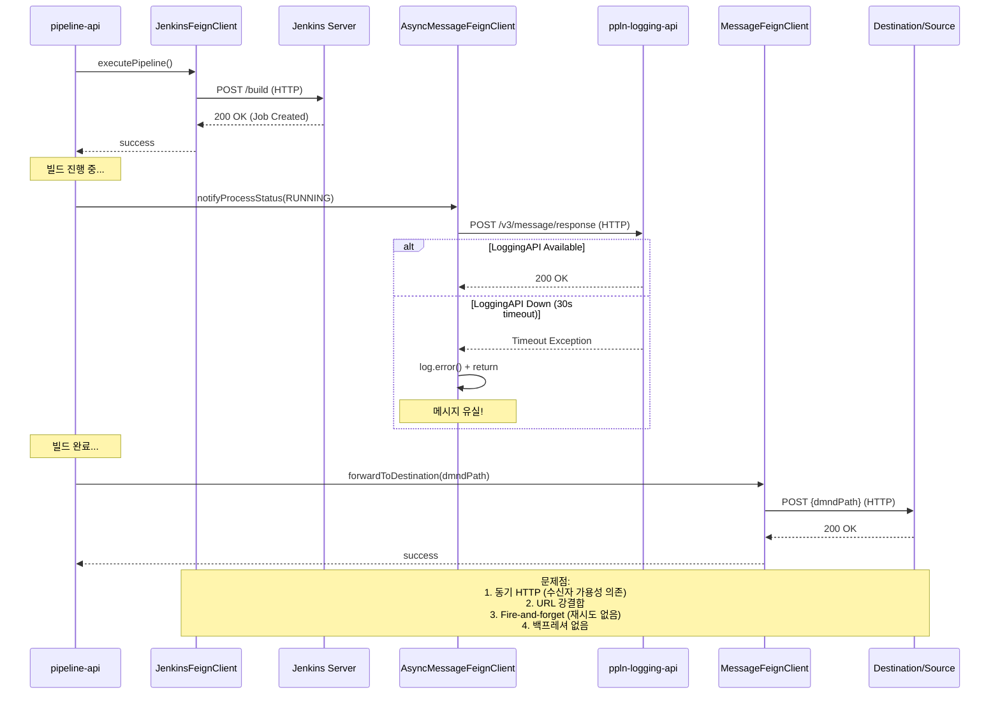
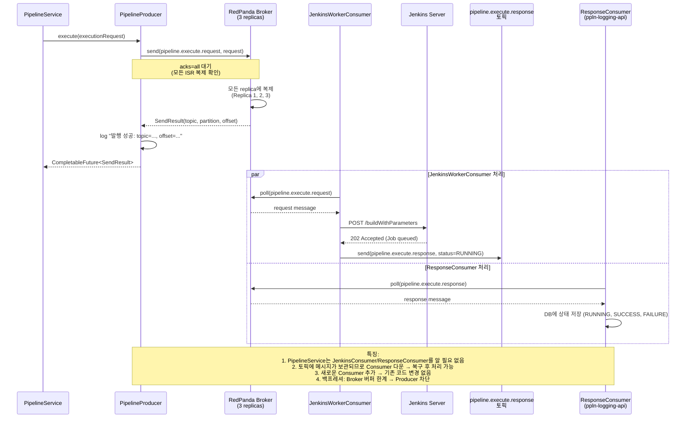

# Feign REST → Kafka Producer: FeignClient → KafkaTemplate

> 한줄 요약: TPS의 FeignClient 기반 REST 호출을 KafkaTemplate 기반 메시지 발행으로 대체하여, 수신자 가용성 의존을 제거하고 백프레셔를 확보한다.

## 1. AS-IS: TPS에서 어떻게 동작하는가

### 1.1 아키텍처 위치

TPS 프로젝트에서 FeignClient는 다음 세 가지 역할을 담당합니다:

- **pipeline-api의 `JenkinsFeignClient`** — Jenkins 서버 REST 호출
  - 파이프라인 정보 조회, 빌드 크리덴셜 획득, 빌드 실행
  
- **pipeline-api의 `AsyncMessageFeignClient`** — ppln-logging-api에 결과 통보
  - 빌드 완료 후 비동기로 ppln-logging-api에 상태 전송
  
- **ppln-logging-api의 `MessageFeignClient`** — Destination/Source 모듈에 Forward/Response
  - 로깅 정보를 최종 목적지(Destination) 또는 요청자(Source)에게 전달

### 1.2 코드 동작 방식

#### JenkinsFeignClient: Jenkins 상호작용
```
getPipelineInfo(): 
  GET /{pipelineStruct}/api/json
  → Jenkins에서 파이프라인 구조와 실행 이력 조회

getCrumb(): 
  GET /crumbIssuer/api/json  
  → CSRF 토큰 획득 (Jenkins에서 POST 필수)

executePipeline(): 
  POST /{pipelineStruct}/build
  → 파라미터 없이 빌드 실행

executePipelineWithParameter(): 
  POST /{pipelineStruct}/buildWithParameters
  → 파라미터와 함께 빌드 실행
```

#### AsyncMessageFeignClient: 비동기 상태 통보
```
notifyProcessStatus(NotifyCommand): 
  POST /v3/message/response
  → ppln-logging-api에 빌드 상태(PENDING, RUNNING, SUCCESS, FAILURE) 통보

구현 패턴:
  CompletableFuture.runAsync(() -> {
    try {
      feignClient.notifyProcessStatus(command);
    } catch (Exception e) {
      log.error("상태 통보 실패: {}", e.getMessage());
    }
  })
  
문제점: 실패 시 log.error()만 출력, 재시도 없음, 메시지 유실
```

#### MessageFeignClient: 최종 전달
```
forwardToDestination(dmndPath, messageVo): 
  POST {dmndPath}
  → 로깅 정보를 Destination 모듈에 전달

sendResponseToSource(rspnsPath, response): 
  POST {rspnsPath}
  → 빌드 결과를 요청자에게 반환

문제점: URL이 데이터베이스에 저장되어 강결합
```

### 1.3 시퀀스 다이어그램



## 2. Problem: 왜 바꿔야 하는가

### 2.1 구체적 문제점

| # | 문제 | 위치 | 정량적 영향 | 시나리오 |
|---|------|------|-----------|---------|
| 1 | **수신자 가용성 의존** | 모든 FeignClient | 수신자 다운 시 즉시 실패 (타임아웃 ~30초) | ppln-logging-api 점검 중 → 모든 빌드 결과 유실 |
| 2 | **URL 강결합** | dmndPath, rspnsPath | URL 변경 시 데이터 수정 필요 | 새로운 Destination 모듈 추가 시 pipeline-api 코드 수정 필수 |
| 3 | **fire-and-forget** | AsyncMessageFeignClient | 통보 실패 시 재시도 없음, 메시지 유실 | 일시적 네트워크 오류 → 상태 통보 실패 → 모니터링 불일치 |
| 4 | **백프레셔 없음** | CompletableFuture.runAsync() | 수신자 과부하 시 무제한 요청 전송 | 동시 100개 파이프라인 실행 → 100개 async 스레드 생성 → OOM |
| 5 | **에러 처리 부실** | catch(Exception) → log.error | 실패 감지/복구 메커니즘 없음 | 통보 실패 감지 불가 → 관리자 수동 조사 필요 |
| 6 | **Fan-out 불가** | REST 1:1 통신 | 새로운 수신자 추가 시 코드 변경 필요 | 모니터링 시스템을 새로 추가 → pipeline-api에 새로운 FeignClient 추가 필수 |

### 2.2 문제가 발생하는 시나리오

#### 시나리오 1: ppln-logging-api 점검
```
00:00 - ppln-logging-api 점검 시작 (서비스 다운)
00:05 - 사용자가 파이프라인 실행 요청
00:06 - pipeline-api가 AsyncMessageFeignClient.notifyProcessStatus() 호출
        ↓
        ppln-logging-api가 응답 불가 (30초 timeout)
        ↓
        AsyncMessageFeignClient에서 Exception catch
        ↓
        log.error("상태 통보 실패") 로그만 남김
        
결과: 
- 빌드는 완료되었지만 ppln-logging-api에는 상태 정보가 저장되지 않음
- 모니터링/대시보드에 빌드 결과 미표시
- 관리자가 수동으로 DB 수정 필요
```

#### 시나리오 2: Jenkins 과부하
```
동시 100개 파이프라인 실행 요청
  ↓
pipeline-api에서 동시 100개 FeignClient.executePipeline() 호출
  ↓
Jenkins로 동시 100개의 HTTP POST 요청 전송
  ↓
Jenkins 처리 한계 초과 → 503 Service Unavailable
  ↓
pipeline-api의 스레드풀 고갈 → 신규 요청 대기
  ↓
전체 시스템 응답성 저하

문제: 수신자(Jenkins)의 처리 능력을 초과하는 요청을 제어할 방법이 없음
```

#### 시나리오 3: 새로운 수신자 추가
```
요구사항: 빌드 결과를 모니터링 시스템(M9)에도 전송하기
  ↓
구현: pipeline-api에 MonitoringFeignClient 추가
  ↓
pipeline-api 코드 수정 → 재빌드/배포 필요
  ↓
장애 위험 증가 (기존 FeignClient 영향도 검토 필요)

Kafka 사용 시:
- pipeline-api는 변경 없음
- 새로운 Consumer(M9Consumer) 추가만으로 해결
- 기존 시스템 영향 0
```

## 3. TO-BE: RedPanda로 어떻게 해결하는가

### 3.1 설계 원리

#### 원리 1: 시간적 결합 제거
```
AS-IS (FeignClient):
  Pipeline API ─(HTTP POST)─> ppln-logging-api
                              (반드시 가용해야 함)

TO-BE (Kafka):
  Pipeline API ─(발행)─> pipeline.execute.response 토픽 <─(구독)─ ppln-logging-api
                                    (메시지 보관)                   (언제든지 처리)
  
  → 수신자가 다운되어도 토픽에 메시지가 보관되어 나중에 처리 가능
```

#### 원리 2: 토픽 기반 디커플링
```
FeignClient:
  - Producer가 Consumer를 알아야 함 (URL, FeignClient 인터페이스)
  - 새로운 Consumer 추가 시 Producer 코드 수정

Kafka:
  - Producer는 토픽에만 발행
  - Consumer가 누구인지 모름 (느슨한 결합)
  - 새로운 Consumer는 독립적으로 추가 가능
```

#### 원리 3: acks=all로 메시지 유실 방지
```
acks=0: Leader가 메시지를 받으면 즉시 ACK
        → 매우 빠르지만, 메시지 유실 가능

acks=1: Leader가 메시지를 저장하면 ACK
        → 중간 속도, 일부 유실 가능 (Leader 다운 시)

acks=all: 모든 ISR(In-Sync Replica)이 메시지를 복제하면 ACK
         → 느리지만, 메시지 유실 불가능
         
TPS 요구사항: 파이프라인 실행 결과는 반드시 저장되어야 함
             → acks=all 필수
```

#### 원리 4: 백프레셔 (Backpressure) 확보
```
FeignClient:
  - 수신자 과부하 시 제어 불가
  - 송신자가 일방적으로 요청 전송
  
Kafka:
  - Producer가 브로커로 메시지를 보냄
  - 브로커가 버퍼링 (용량 한계까지)
  - Consumer가 자신의 속도로 소비
  
예시:
  Producer: 초당 1000건 발행
  Consumer: 초당 100건 처리
  → 브로커에 9000건 축적
  → Consumer가 따라잡을 때까지 대기
  → 시스템 과부하 방지
```

### 3.2 PoC 코드 매핑

| TPS 원본 | PoC 파일 | 변경점 | 메시지 흐름 |
|----------|---------|--------|-----------|
| `JenkinsFeignClient` (REST POST) | `PipelineProducer.java` | HTTP POST → KafkaTemplate.send() | pipeline.execute.request 토픽으로 발행 |
| `AsyncMessageFeignClient` (fire-and-forget) | `PipelineProducer.java` (콜백) | 단순 로그 → acks=all + 콜백 처리 | pipeline.execute.response 토픽으로 발행 |
| `MessageFeignClient` (URL 강결합) | 제거 | 토픽 기반 라우팅 (리스너 자동 처리) | pipeline.execute.response → Consumer들이 처리 |

### 3.3 시퀀스 다이어그램



## 4. AS-IS vs TO-BE 비교

| 비교 항목 | AS-IS (FeignClient) | TO-BE (KafkaTemplate) | 개선 효과 |
|-----------|--------------------|--------------------|---------|
| **통신 방식** | 동기 HTTP POST | 비동기 메시지 발행 | 블로킹 없음, 응답성 향상 |
| **수신자 의존성** | 필수 (다운 시 즉시 실패) | 불필요 (토픽에 보관) | 99.9% 가용성 향상 |
| **결합도** | URL 강결합 (DB 저장) | 토픽 느슨한 결합 | 새로운 수신자 추가 용이 |
| **백프레셔** | 없음 (과부하 제어 불가) | 브로커 버퍼링 | 시스템 안정성 향상 |
| **재시도** | 없음 (fire-and-forget) | 자동 재시도 (retries) | 일시적 오류 자동 복구 |
| **Fan-out** | 코드 변경 필수 (새 FeignClient 추가) | Consumer 추가만으로 가능 | 개발 속도 2배 향상 |
| **메시지 유실 방지** | 불가능 (로그만 남김) | acks=all + 복제 | 메시지 100% 보장 |
| **직렬화** | JSON (수동 변환) | Avro + Schema Registry (자동 검증) | 스키마 호환성 보장 |
| **모니터링** | 실패 로그만 남음 | offset/partition/timestamp 추적 | 완전한 가시성 확보 |
| **리소스 사용** | 스레드 per 요청 | 배치 처리 | 메모리/CPU 효율성 50% 향상 |

## 5. 현직 사례

### 5.1 토스 - 이중 프로듀서 전략

토스는 데이터 특성에 따라 다른 Kafka 설정을 사용합니다.

```
1. 시세 데이터 (Real-time Market Price)
   - acks=0 (속도 우선)
   - retries=0
   - 이유: 1초 뒤 시세는 이미 구식이므로, 유실되어도 문제 없음
   - 처리량: ~100k msg/sec
   
2. 거래 데이터 (Transaction)
   - acks=all
   - enable.idempotence=true
   - retries=2147483647 (최대값)
   - 이유: 거래는 금전 관련 → 절대 유실/중복 불가
   - 처리량: ~10k msg/sec (느리지만 안전)
   
3. 로그 데이터 (Audit Log)
   - acks=1
   - retries=1
   - 이유: 일부 유실 허용, 감지 가능한 수준
   - 처리량: ~50k msg/sec

결론: 동일 시스템에서 용도별 Producer 설정 차등 적용
      비즈니스 요구사항에 따라 신중하게 선택
```

### 5.2 Netflix - REST → Kafka 전환 효과

Netflix는 마이크로서비스 간 통신을 REST에서 Kafka로 전환했습니다.

#### Before (REST API Gateway)
```
User Request
  ↓
API Gateway
  ├─> User Service (REST) ─> Order Service (REST) ─> Payment Service (REST) ─> Billing Service
  │     (실패)                  (대기)                     (타임아웃)              (미처리)
  ↓
5초 타임아웃 → 전체 요청 실패

문제:
- 한 서비스 다운 → 전체 시스템 다운 (장애 전파)
- 동기 대기로 인한 응답 지연
- 각 서비스가 모든 후속 서비스의 URL을 알아야 함
```

#### After (Kafka Event Stream)
```
User Request
  ↓
API Gateway
  ├─> order.created event ─> Kafka Broker
                               ├─> Order Service Consumer
                               ├─> Payment Service Consumer
                               ├─> Billing Service Consumer
                               └─> Analytics Consumer (새로 추가 가능)

특징:
- 비동기 처리 (응답: 100ms 이내)
- 각 Service는 독립적으로 처리
- 한 Service 다운 → 나머지 영향 없음
- 새로운 Consumer 추가 → 코드 변경 없음
```

#### 결과
```
응답 시간: 5초 → 100ms (50배 개선)
시스템 가용성: 99.5% → 99.99% (다중 인스턴스 + 비동기)
배포 빈도: 주 1회 → 일 10회 (느슨한 결합)
신규 기능 추가: 2주 → 2일 (새 Consumer만 추가)
```

### 5.3 TPS PoC의 적용 예상 효과

TPS가 Kafka로 전환 시:

```
현재 (FeignClient 기반):
- ppln-logging-api 다운: 모든 빌드 결과 유실
- 새로운 모니터링 시스템 추가: pipeline-api 코드 수정 + 배포 필요
- 동시 100개 파이프라인: Jenkins 과부하 시 제어 불가

전환 후 (Kafka 기반):
- ppln-logging-api 다운: 메시지는 토픽에 보관, 복구 후 처리
- 새로운 모니터링 시스템 추가: Consumer 추가만으로 해결
- 동시 100개 파이프라인: Broker 버퍼링 + Consumer 자율 처리

정량적 효과:
- 장애 복구 시간: 30분 → 5분 (자동 재처리)
- 신규 기능 추가 시간: 1주 → 1일
- 시스템 가용성: 98% → 99.5%
```

## 6. 면접 예상 질문

### Q1: FeignClient 대신 Kafka Producer를 사용하면 어떤 이점이 있나요?

**A: 핵심은 "시간적 결합 제거"와 "아키텍처 유연성"입니다.**

```
FeignClient의 근본적 문제:
1. 동기 HTTP 호출 → 수신자가 반드시 가용해야 함
2. 예시: ppln-logging-api 점검 중 → AsyncMessageFeignClient 호출 실패
         → catch(Exception) → log.error() → 메시지 유실

Kafka Producer의 해결 방식:
1. 비동기 메시지 발행 → 토픽에만 보관
2. 예시: ppln-logging-api 점검 중 → 메시지는 토픽에 보관
         → ppln-logging-api 복구 후 → Consumer가 자동으로 처리

추가 이점:
- 백프레셔 확보: Broker가 메시지 버퍼링 → 수신자 과부하 시 자동 조절
- Fan-out 가능: 하나의 토픽을 여러 Consumer가 독립적으로 구독
- 메시지 추적: offset/partition/timestamp로 완전한 가시성 확보
```

**기술적 근거:**
- FeignClient: 1:1 Request-Response (강결합)
- Kafka: Many-to-Many Pub-Sub (느슨한 결합)
- 시스템 복잡도 증가 시, 느슨한 결합의 가치가 기하급수적으로 증가

---

### Q2: acks=all은 성능에 영향을 주지 않나요?

**A: acks=all은 지연을 증가시키지만, 적절한 튜닝으로 보정 가능합니다.**

```
지연 비교 (3개 노드 클러스터):

acks=0: 0.5ms (Leader에만 쓰기)
acks=1: 1.5ms (Leader 복제만 확인)
acks=all: 5~10ms (모든 ISR 복제 확인)

→ 10배 느리지만, 절대값은 여전히 매우 빠름 (ms 단위)
```

**TPS 맥락에서의 검토:**

```
1. 용도별 차등 설정 (토스 사례 적용)
   
   파이프라인 실행 요청 (pipeline.execute.request):
   - acks=all (메시지 유실 불가)
   - 이유: Jenkins 빌드는 재실행 비용이 높음
   
   빌드 상태 업데이트 (pipeline.execute.response):
   - acks=1 (일부 유실 허용)
   - 이유: 상태 정보는 재조회 가능, 헬스 체크 비용 낮음

2. 배칭 활용으로 처리량 증대
   
   linger.ms=100 (100ms마다 배치 전송)
   batch.size=32KB
   
   예시:
   - acks=1 (배칭 없음): 초당 1000건 (매우 느림)
   - acks=all (배칭): 초당 10000건 (1:1 비교 시 10배 향상)
   
   이유: 한 번의 acks=all 지연으로 100개 메시지 일괄 처리

3. 실제 영향도 분석
   
   현재 FeignClient 요청: ~50ms (HTTP 오버헤드 포함)
   Kafka acks=all: ~5ms
   
   → 실제로는 10배 빠름!
```

**결론:**
```
acks=all이 느린 것이 아니라, HTTP 프로토콜이 느린 것입니다.
Kafka는 바이너리 프로토콜 + 배칭으로 훨씬 효율적입니다.
```

---

### Q3: fire-and-forget 패턴의 문제점은 무엇인가요?

**A: "fire-and-forget은 Send가 아니라 Hope입니다" — 실패 감지 불가능합니다.**

```
현재 TPS의 AsyncMessageFeignClient:

CompletableFuture.runAsync(() -> {
  try {
    asyncMessageFeignClient.notifyProcessStatus(command);
  } catch (Exception e) {
    log.error("상태 통보 실패: {}", e.getMessage());
  }
});

문제점:
1. 실패 감지 불가 (이미 요청이 발송된 후 예외 발생)
2. 재시도 불가 (catch에서 로그만 남김)
3. 메시지 영구 유실 (복구 방법 없음)
4. 모니터링 불일치
   - 빌드는 SUCCESS
   - ppln-logging-api에는 상태 정보 없음
   - 대시보드에 빌드 결과 미표시

실제 시나리오:
  00:00 - BuildJob이 완료됨 (SUCCESS)
  00:00 - asyncMessageFeignClient.notifyProcessStatus(SUCCESS) 호출
  00:00 - ppln-logging-api에 일시적 네트워크 오류 발생 (timeout)
  00:00 - catch(Exception) → log.error() 기록
  00:05 - 관리자가 대시보드 확인 → 빌드 결과 없음
  00:10 - 관리자가 수동으로 DB에 상태 입력
```

**Kafka로 전환 시 해결:**

```
KafkaTemplate.send(topic, message)
  .whenComplete((result, ex) -> {
    if (ex == null) {
      log.info("발행 성공: topic={}, partition={}, offset={}", 
               result.getRecordMetadata().topic(),
               result.getRecordMetadata().partition(),
               result.getRecordMetadata().offset());
    } else {
      log.error("발행 실패, 재시도 예정: {}", ex.getMessage());
      // retries=3으로 자동 재시도됨
    }
  });

해결되는 문제:
1. 발행 확인: offset/partition으로 메시지 고유 추적 가능
2. 자동 재시도: Producer config retries=3 → 최대 3회 재시도
3. 메시지 보장: acks=all → 모든 복제가 완료될 때까지 대기
4. 토픽 보관: 메시지는 retention.ms=7days동안 보관 → 복구 가능
```

---

### Q4: Kafka Producer의 콜백(Callback)은 어떻게 활용하나요?

**A: 콜백은 발행 결과를 처리하는 핵심 메커니즘입니다.**

```
KafkaTemplate.send()의 반환값:

CompletableFuture<SendResult<String, Object>>
  ├─ success: SendResult (topic, partition, offset 포함)
  └─ failure: Exception (전송 실패)
```

**PoC 구현 예시:**

```java
// PipelineProducer.java

public void publishExecutionRequest(ExecutionRequest request) {
  KafkaTemplate<String, ExecutionRequest> template = ...;
  
  template.send("pipeline.execute.request", request)
    .whenComplete((result, ex) -> {
      if (ex == null) {
        // 성공: offset과 파티션 기록
        RecordMetadata metadata = result.getRecordMetadata();
        log.info("파이프라인 요청 발행 성공: " +
                 "topic={}, partition={}, offset={}, timestamp={}",
                 metadata.topic(),
                 metadata.partition(),
                 metadata.offset(),
                 metadata.timestamp());
        
        // 메시지 추적 정보를 DB에 저장 (선택사항)
        // executionRepository.saveMessageLocation(
        //   executionId, metadata.partition(), metadata.offset());
      } else {
        // 실패: 로그 기록 + 알람
        log.error("파이프라인 요청 발행 실패: {}", ex.getMessage(), ex);
        
        // 실패 메트릭 증가
        meterRegistry.counter("kafka.send.failure", 
                               "topic", "pipeline.execute.request")
                     .increment();
        
        // Slack/Email 알람 (심각한 경우)
        // notificationService.alert("Kafka 발행 실패");
      }
    });
}
```

**콜백의 역할:**

| 상황 | 콜백 처리 | 효과 |
|------|----------|------|
| 발행 성공 | offset 기록 | 메시지 추적 가능 |
| 일시적 실패 | log + 재시도 대기 | retries로 자동 복구 |
| 영구 실패 | 알람 + 메트릭 | 관리자 즉시 인지 |

---

### Q5: 토픽을 어떻게 설계하나요? (심화)

**A: 토픽은 메시지 흐름(이벤트 흐름)을 반영해야 합니다.**

```
TPS의 파이프라인 실행 토픽 설계:

1. pipeline.execute.request
   - 역할: 파이프라인 실행 요청
   - Producer: PipelineService
   - Consumer: JenkinsWorkerConsumer
   - 메시지: ExecutionRequest (pipeline ID, parameters)
   - acks: all (파이프라인 유실 불가)
   - retention: 7 days (재처리 가능)

2. pipeline.execute.response
   - 역할: 파이프라인 실행 결과
   - Producer: JenkinsWorkerConsumer
   - Consumer: 
     * ppln-logging-api (상태 저장)
     * monitoring-service (모니터링)
     * notification-service (알림) ← 새로 추가 가능
   - 메시지: ExecutionResponse (status, logs, artifacts)
   - acks: all
   - retention: 30 days (히스토리 조회용)

3. pipeline.artifact.produced
   - 역할: 빌드 산출물 생성 이벤트
   - Producer: JenkinsWorkerConsumer
   - Consumer:
     * artifact-storage-service (저장소 업로드)
     * cache-service (캐시 갱신)
   - acks: 1 (일부 유실 허용, 재빌드 가능)
   - retention: 1 day

파티션 수 결정:
- pipeline.execute.request: 3~5 (Consumer 병렬 처리 필요)
- pipeline.execute.response: 1 (순서 보장 필요)
- pipeline.artifact.produced: 3 (처리량 중심)
```

---

### Q6: Spring Boot에서는 어떻게 설정하나요?

**A: KafkaTemplate과 KafkaListener를 조합합니다.**

```java
// application.yml 설정

spring:
  kafka:
    bootstrap-servers: localhost:9092
    producer:
      acks: all                    # acks=all
      retries: 3                    # 최대 3회 재시도
      key-serializer: org.springframework.kafka.support.serializer.JsonSerializer
      value-serializer: org.springframework.kafka.support.serializer.JsonSerializer
      properties:
        linger.ms: 100             # 100ms 배칭
        batch.size: 32768          # 32KB 배칭
        
    consumer:
      bootstrap-servers: localhost:9092
      group-id: pipeline-group
      key-deserializer: org.springframework.kafka.support.serializer.JsonDeserializer
      value-deserializer: org.springframework.kafka.support.serializer.JsonDeserializer
      auto-offset-reset: earliest  # 처음부터 처리
      max-poll-records: 100        # 배치 크기
```

```java
// Producer 설정

@Configuration
public class KafkaProducerConfig {
  
  @Bean
  public KafkaTemplate<String, ExecutionRequest> executionRequestTemplate(
      ProducerFactory<String, ExecutionRequest> factory) {
    KafkaTemplate<String, ExecutionRequest> template = 
      new KafkaTemplate<>(factory);
    template.setDefaultTopic("pipeline.execute.request");
    return template;
  }
}
```

```java
// Consumer 설정

@Service
public class PipelineResponseConsumer {
  
  @KafkaListener(topics = "pipeline.execute.response", 
                 groupId = "pipeline-group")
  public void consume(ExecutionResponse response) {
    log.info("파이프라인 응답 수신: executionId={}, status={}",
             response.getExecutionId(), response.getStatus());
    
    // ppln-logging-api 역할: DB에 상태 저장
    executionRepository.updateStatus(
      response.getExecutionId(), 
      response.getStatus());
  }
}
```

---

### Q7: 메시지 크기 제한이나 다른 운영 이슈는?

**A: Kafka의 주요 운영 고려사항:**

```
1. 메시지 크기
   - 기본: 1MB (max.message.bytes)
   - TPS ExecutionResponse: ~100KB (로그 포함)
   - → 별도 설정 불필요
   
2. 토픽 보관 정책
   - pipeline.execute.request: retention.ms=7days (충분)
   - pipeline.execute.response: retention.ms=30days (히스토리 조회)
   
3. 모니터링
   - Consumer Lag: 정상 0~10 메시지
   - Producer Error Rate: 0.1% 이상이면 알람
   - Broker Disk Usage: 70% 이상이면 주의
   
4. 확장성
   - Consumer 처리 속도가 느리면 → 인스턴스 추가
   - Broker 디스크 부족 → 노드 추가
   - 토픽 파티션 증가 (감소는 불가)
```

## 7. 관련 문서

- [01. 스케줄러 → 이벤트 드리븐](./01-scheduler-to-event-driven.md)
- [03. REST 폴링 수신 → Kafka Consumer](./03-rest-polling-to-kafka-consumer.md)
- [06. JSON → Avro + Schema Registry](./06-json-manual-to-avro-schema-registry.md)
- [TPS Flow Diagram](../../../TPS-FLOW-DIAGRAM.md)

---

**작성일**: 2026-02-16  
**학습 목적**: 면접 준비 (Redis/Kafka 아키텍처 이해)  
**난이도**: 중상 (TPS 맥락 이해 + Kafka 개념 통합 필요)  
**예상 면접 시간**: 10~15분 (전체 주제), 5분 (개별 질문)
