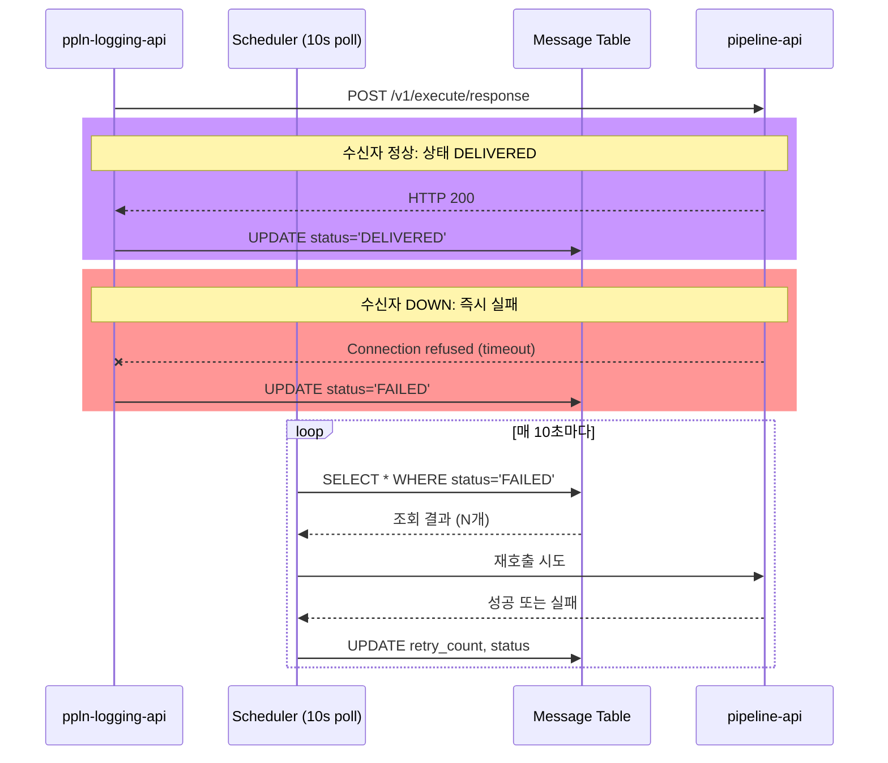
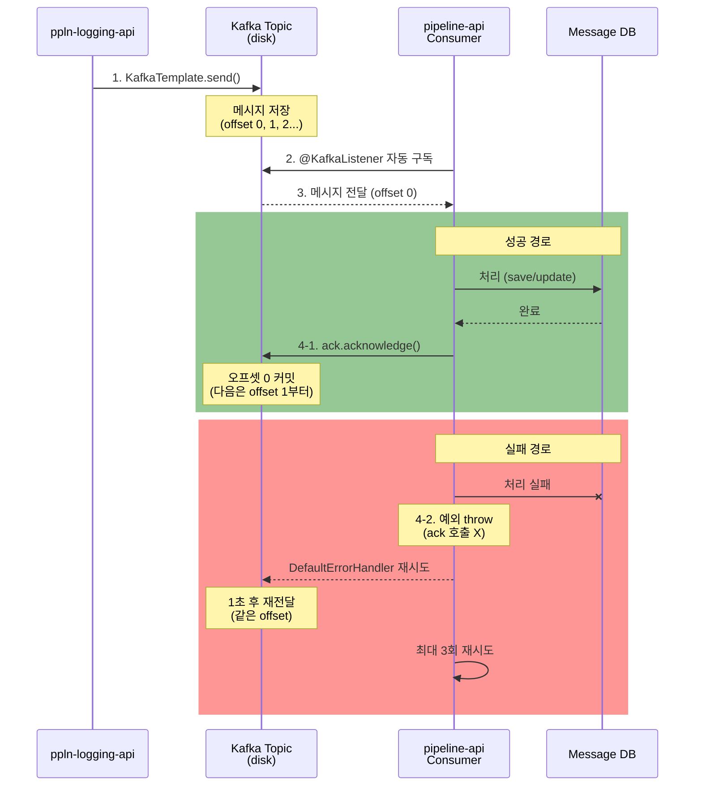
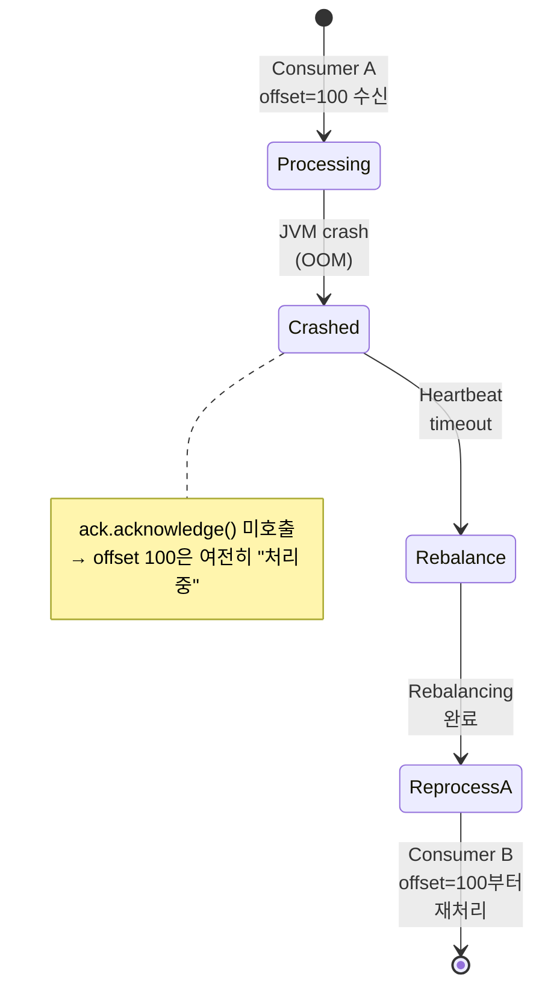

# REST 폴링 수신 → Kafka Consumer: REST Endpoint → @KafkaListener

> **한줄 요약**: TPS의 REST 엔드포인트 기반 메시지 수신을 @KafkaListener 기반 자동 구독으로 대체하여, 수신자 가용성 의존을 제거하고 오프셋 기반 정확한 메시지 관리를 확보한다.

---

## 1. AS-IS: TPS에서 어떻게 동작하는가

### 1.1 아키텍처 위치

TPS에서 메시지 수신은 다음 두 경로를 통해 이루어진다:

**경로 1: ppln-logging-api (파이프라인 로깅)**
```
API 서버
└── AsyncMessageController
    ├── POST /v3/message/register     — 파이프라인 로그 등록
    ├── POST /v3/message/response     — 파이프라인 응답 수신
    └── GET /v3/message/status/{id}   — 메시지 처리 상태 조회
```

**경로 2: pipeline-api (Jenkins 실행)**
```
API 서버
└── JenkinsPipelineController
    ├── POST /jenkins/v1/execute/pipeline/async   — 비동기 파이프라인 실행
    └── PUT /jenkins/v1/execute/{pipelineId}      — 실행 상태 업데이트
```

### 1.2 코드 동작 방식

**시나리오: ppln-logging-api가 pipeline-api에 응답을 통보할 때**

```
1단계: ppln-logging-api에서 Feign 호출
   ┌─────────────────────────────────────┐
   │ AsyncMessageUseCase.execute()       │
   │ ├─ 메시지 상태: SENT                │
   │ └─ FeignClient로 REST 호출         │
   └─────────────┬───────────────────────┘
                 │ HTTP POST
                 │ Content-Type: application/json
                 ▼
   ┌─────────────────────────────────────┐
   │ pipeline-api                        │
   │ JenkinsPipelineController          │
   │ @PostMapping("/v1/execute/response")│
   └──────────────┬──────────────────────┘
                 │ (성공 시 200 OK)
                 │ (실패 시 5xx 또는 timeout)
                 ▼
   ┌─────────────────────────────────────┐
   │ 메시지 상태 업데이트                │
   │ ├─ 성공: DELIVERED                 │
   │ └─ 실패: FAILED (재시도 큐 등록)   │
   └─────────────────────────────────────┘
```

**핵심 특징:**
- REST 컨트롤러가 동기적으로 요청을 받음
- HTTP 200 응답 = "메시지 수신 확인" (처리 완료 X)
- 수신자가 DOWN 상태면 즉시 연결 실패 (Feign timeout)
- 스케줄러가 주기적으로 FAILED 상태 메시지를 재조회하여 재시도

### 1.3 재시도 메커니즘 (DB 폴링 방식)

```sql
-- 1단계: FAILED 상태 메시지 조회 (10초 간격)
SELECT * FROM message
WHERE status = 'FAILED'
  AND retry_count < 10
  AND last_retry_at < NOW() - INTERVAL 10 SECOND
LIMIT 100;

-- 2단계: 각 메시지마다 REST 재호출
-- POST /jenkins/v1/execute/response?id={messageId}

-- 3단계: 결과 반영
UPDATE message
SET status = CASE
      WHEN response_code = 200 THEN 'DELIVERED'
      ELSE 'FAILED'
    END,
    retry_count = retry_count + 1,
    last_retry_at = NOW()
WHERE id = ?;
```

**문제점:**
- 10초마다 전체 메시지 테이블 풀 스캔
- 수신자가 2분 후 복구되어도 최대 10초 + 처리 시간 대기
- DB 락 경합 발생 가능 (retry_count 업데이트)

### 1.4 시퀀스 다이어그램



---

## 2. Problem: 왜 바꿔야 하는가

### 2.1 구체적 문제점

| # | 문제 | 정량적 영향 | 근본 원인 |
|---|------|-----------|---------|
| **1** | **수신자 가용성 필수** | 수신자 1분 다운 → 최악 10초 + 처리 시간 동안 FAIL 누적 | REST는 요청자 중심: 수신자 UP 필수 |
| **2** | **버퍼링 없음** | 메모리 큐만 존재 (인메모리) → 발신자 서버 재시작 시 미전송 메시지 유실 | 디스크 기반 영속성 없음 |
| **3** | **재시도 비효율** | 실패 검출 최대 10초 대기 + 1회 실패 시 다음 재시도까지 10초 더 대기 (최악 20초) | DB 폴링 기반 배치 재시도 |
| **4** | **메시지 순서 미보장** | REST 병렬 호출 시 응답 순서 불확정 → 같은 파이프라인의 여러 이벤트가 역순 도착 가능 | HTTP는 비순서 보장 프로토콜 |
| **5** | **정확한 1회 처리 불가** | 네트워크 지연 → 발신자가 timeout 후 재전송 → 수신자에서 중복 처리 불가피 | HTTP 응답만으로는 "처리 완료" 보장 불가 |
| **6** | **수신 확인 불확실** | HTTP 200 = "요청 수신" (처리 시작도 미보장) | 상태 전이가 비동기인데 동기 응답만 받음 |
| **7** | **확장성 한계** | 메시지 급증 시 DB 폴링 부하 선형 증가 | 중앙 DB 기반 조율 |

### 2.2 구체적 장애 시나리오

**시나리오 1: 배포 중 수신자 다운**
```
시간    발신자                 수신자            상태
─────────────────────────────────────────────────────────
00:00   POST /v1/execute   →  [정상 응답]    ✓ DELIVERED

        [배포 시작]
00:05   POST /v1/execute   →  [Connection refused]
                               FAIL 기록

00:06   DB 폴링
        ├─ 조회: status='FAILED'
        └─ 재시도: POST (다시 실패)

00:07   [배포 완료, 수신자 복구]

00:15   ⚠️ 10초 폴링 이후
        DB 폴링 재시도 (이번엔 성공)
        ✓ DELIVERED

결과: 배포 대기 시간 = 최소 10초
```

**시나리오 2: 네트워크 지연으로 인한 중복 처리**
```
시간    발신자                    수신자           DB
─────────────────────────────────────────────────────────
00:00   POST /v1/execute/123  →  [처리 중]
        timeout 대기

00:05   timeout 발생
        상태: FAILED

        [DB 폴링 시도]
        POST /v1/execute/123  →  [처리 2번째]  ← 중복!

        ✗ 이미 처리된 메시지를 다시 처리
        (멱등성 보장 필요)
```

**시나리오 3: 높은 부하 상황**
```
발신자 TPS: 1,000/sec
수신자 처리: 500/sec

→ 메모리 큐 오버플로우
→ 전송 실패 (메모리 부족 또는 큐 스택)
→ 발신자에서 FAIL 처리

⚠️ 영속성 없으므로 메시지 유실 가능
```

### 2.3 비용 분석

```
현재 방식 (REST 폴링):
├─ DB 폴링 부하
│  ├─ 초당 SELECT 쿼리: ~10 QPS (10초 폴링)
│  ├─ FAILED 메시지 10개 * 10초 = 100 UPDATE/sec
│  └─ 부하 증가: 선형 (메시지 수에 비례)
│
├─ 네트워크 지연
│  ├─ 재시도 대기: 최대 10초
│  └─ 전체 처리 시간 = 즉시 성공 시간 + 폴링 래칭 지연
│
└─ 모니터링 비용
   ├─ 각 메시지 상태 추적 필요
   └─ 재시도 로직 복잡도 증가

→ 비용: O(n) where n = 메시지 수
```

---

## 3. TO-BE: Kafka Consumer로 어떻게 해결하는가

### 3.1 설계 원리

Kafka는 **Producer-Topic-Consumer** 기반 pub/sub 모델로, REST의 request-response 모델과 근본적으로 다르다.

```
┌─────────────────────────────────────────────────────────┐
│                    Kafka 아키텍처                       │
├─────────────────────────────────────────────────────────┤
│                                                         │
│  Producer           Topic (파티션 기반)      Consumer   │
│  ┌──────────┐       ┌──────────────────┐   ┌─────────┐ │
│  │ ppln-api │──────▶│ Partition 0      │───▶│ Worker1 │ │
│  └──────────┘       │ ┌─────────────┐  │   └─────────┘ │
│                     │ │ Offset 0,1,2│  │               │
│  (이벤트 발행)      │ └─────────────┘  │   Consumer    │
│                     │                  │   Group: api  │
│  ┌──────────┐       │ Partition 1      │   ┌─────────┐ │
│  │ logging- │──────▶│ ┌─────────────┐  │───▶│ Worker2 │ │
│  │ api      │       │ │ Offset 0,1,2│  │   └─────────┘ │
│  └──────────┘       │ └─────────────┘  │               │
│                     │                  │               │
│                     └──────────────────┘               │
│                                                         │
│  특징:                                                 │
│  ├─ 디스크 기반 영속성 (retention: 7일)              │
│  ├─ 오프셋 추적 (어느 메시지까지 처리했는가)        │
│  ├─ 재시도 불필요 (메시지가 계속 보관)             │
│  └─ 병렬 처리 (Consumer Group 기반 분산)            │
│                                                         │
└─────────────────────────────────────────────────────────┘
```

**핵심 개념:**

1. **@KafkaListener**: 토픽 구독하고 메시지 도착 시 자동 호출
   ```java
   @KafkaListener(topics = "pipeline-response", groupId = "api-response-group")
   public void onResponse(ConsumerRecord<String, PipelineResponse> record,
                         Acknowledgment ack) {
       // 메시지 처리
       ack.acknowledge();  // 오프셋 커밋
   }
   ```

2. **오프셋 관리**: Consumer가 "어느 메시지까지 처리했는가"를 추적
   - 자동 커밋 (기본): 매 5초 또는 배치 완료 시
   - 수동 커밋 (권장): 처리 완료 후 `ack.acknowledge()`

3. **Consumer Group**: 여러 인스턴스가 파티션을 나눠서 처리
   - Partition 0 → Worker 1
   - Partition 1 → Worker 2
   - 리밸런싱: Consumer 추가/제거 시 자동으로 재분배

4. **메시지 보관**: Consumer가 다운되어도 토픽에 보관
   - Retention: 기본 7일 (설정 가능)
   - Offset reset: Consumer가 다시 시작되면 마지막 커밋 위치부터 재개

### 3.2 PoC 코드 매핑

| TPS 원본 구조 | PoC 파일 | 변경 방식 | 핵심 차이 |
|-------------|---------|---------|---------|
| AsyncMessageController | JenkinsWorkerConsumer.java | REST @PostMapping → @KafkaListener | 수동 호출 → 자동 구독 |
| JenkinsPipelineController | LoggingConsumer.java | REST @PostMapping → @KafkaListener | 동기 응답 → 수동 오프셋 커밋 |
| FeignClient (REST call) | KafkaProducer bean | Feign HTTP → KafkaTemplate | 네트워크 통신 → 메시지 버퍼링 |
| Message.status 업데이트 | ack.acknowledge() | DB 상태 전이 → 오프셋 커밋 | DB 폴링 제거 |

### 3.3 PoC 코드 예시

**변경 전 (REST 방식):**
```java
// ppln-logging-api의 AsyncMessageController
@RestController
@RequestMapping("/v3/message")
public class AsyncMessageController {

    @PostMapping("/response")
    public ResponseEntity<Void> receiveResponse(
            @RequestBody PipelineResponse response) {
        // 1단계: UseCase 호출
        asyncMessageUseCase.handleResponse(response);

        // 2단계: HTTP 200 응답 (처리 완료 X)
        return ResponseEntity.ok().build();
    }
}

// ppln-logging-api의 AsyncMessageUseCase
public class AsyncMessageUseCase {

    public void handleResponse(PipelineResponse response) {
        // 1단계: DB 조회
        Message message = messageRepo.findById(response.messageId);

        // 2단계: 상태 업데이트
        message.setStatus(MessageStatus.DELIVERED);
        messageRepo.save(message);
    }
}

// Feign 호출 (pipeline-api → ppln-logging-api)
@FeignClient("ppln-logging-api")
public interface PipelineResponseClient {
    @PostMapping("/v3/message/response")
    void sendResponse(@RequestBody PipelineResponse response);
}
```

**변경 후 (Kafka 방식):**
```java
// pipeline-api의 LoggingConsumer
@Component
public class LoggingConsumer {

    @KafkaListener(
        topics = "pipeline-response",
        groupId = "api-response-group",
        containerFactory = "kafkaListenerContainerFactory"
    )
    public void onPipelineResponse(
            @Payload PipelineResponse response,
            Acknowledgment ack,
            ConsumerRecord<String, PipelineResponse> record) {

        try {
            // 1단계: 메시지 처리
            asyncMessageUseCase.handleResponse(response);

            // 2단계: 오프셋 커밋 (처리 완료 확인)
            ack.acknowledge();

            // 로깅
            log.info("Response processed - messageId: {}, offset: {}",
                    response.getMessageId(), record.offset());

        } catch (Exception e) {
            // 예외 시 ack 호출 안 함
            // → Kafka가 자동으로 이 메시지를 다시 전달
            log.error("Failed to process response: {}", response.getMessageId(), e);
            throw new ConsumerRecord<>(e);
        }
    }
}

// Spring Boot 설정
@Configuration
public class KafkaConsumerConfig {

    @Bean
    public ConsumerFactory<String, PipelineResponse> consumerFactory() {
        Map<String, Object> props = new HashMap<>();

        props.put(ConsumerConfig.BOOTSTRAP_SERVERS_CONFIG, "localhost:9092");
        props.put(ConsumerConfig.GROUP_ID_CONFIG, "api-response-group");
        props.put(ConsumerConfig.KEY_DESERIALIZER_CLASS_CONFIG, StringDeserializer.class);
        props.put(ConsumerConfig.VALUE_DESERIALIZER_CLASS_CONFIG, JsonDeserializer.class);

        // 핵심 설정
        props.put(ConsumerConfig.ENABLE_AUTO_COMMIT_CONFIG, false);  // 수동 커밋
        props.put(ConsumerConfig.AUTO_OFFSET_RESET_CONFIG, "earliest");  // 처음부터 처리
        props.put(ConsumerConfig.MAX_POLL_RECORDS_CONFIG, 10);  // 배치 크기
        props.put(ConsumerConfig.MAX_POLL_INTERVAL_MS_CONFIG, 300000);  // 5분

        return new DefaultConsumerFactory<>(props);
    }

    @Bean
    public ConcurrentKafkaListenerContainerFactory<String, PipelineResponse>
            kafkaListenerContainerFactory() {
        ConcurrentKafkaListenerContainerFactory<String, PipelineResponse> factory =
                new ConcurrentKafkaListenerContainerFactory<>();
        factory.setCommonErrorHandler(
                new DefaultErrorHandler(
                        new FixedBackOff(1000, 3)  // 1초 간격, 3회 재시도
                ));
        factory.getContainerProperties().setAckMode(AckMode.MANUAL);
        return factory;
    }
}

// Producer (ppln-logging-api)
@Component
public class PipelineResponseProducer {

    private final KafkaTemplate<String, PipelineResponse> kafkaTemplate;

    public void sendResponse(PipelineResponse response) {
        kafkaTemplate.send(
            "pipeline-response",
            response.getMessageId(),  // Key: 같은 파이프라인은 같은 파티션으로
            response
        );
    }
}
```

### 3.4 상태 흐름 비교

**REST 방식의 상태 흐름:**
```
[메시지 생성]
    ↓
[SENT] ──REST POST──> [수신자 처리 중]
    ↓                      ↓
[잠깐, 응답 대기]     [실패?]
    ↓                      ↓
[DELIVERED 또는]  ──► [DB 폴링] ──► [재시도]
[FAILED]                    ↓
                      [최대 10회 재시도 후]
                            ↓
                      [완전 FAILED]
```

**Kafka 방식의 상태 흐름:**
```
[메시지 생성]
    ↓
[Producer] ──► [Topic에 저장 (디스크)]
    ↓              (retention: 7일)
[Consumer 자동 구독]
    ↓
[메시지 처리]
    ├─ 성공 ──► [ack.acknowledge()] ──► [오프셋 커밋]
    │                                        ↓
    │                                   [완료. 다시 조회 X]
    │
    └─ 실패 ──► [예외 throw] ──► [Kafka가 자동으로]
                                  [다시 전달]
                                        ↓
                                   [DefaultErrorHandler]
                                   [1초 간격 3회 재시도]
```

### 3.5 시퀀스 다이어그램



---

## 4. AS-IS vs TO-BE 상세 비교

| 비교 항목 | REST 폴링 방식 | Kafka Consumer 방식 | 개선 효과 |
|---------|-------------|------------------|---------|
| **수신 방식** | 발신자가 REST 호출 (Pull) | Consumer가 자동 구독 (Push) | 수신자 가용성 의존 제거 |
| **가용성 요구사항** | 수신자 반드시 UP | 수신자 다운해도 메시지 보관 | 다운타임 중 메시지 유실 X |
| **버퍼링** | 메모리 큐만 (인메모리) | 디스크 기반 (7일 보관) | 서버 재시작 시 메시지 유지 |
| **재시도** | DB 폴링 (10초 간격) | 자동 + DefaultErrorHandler (1초 간격, 3회) | 실패 감지 10배 빠름 |
| **순서 보장** | 병렬 호출 → 순서 미보장 | Partition 단위 순서 보장 | FIFO 처리 가능 |
| **중복 처리** | 네트워크 지연 시 중복 가능 | 오프셋 커밋 원자성 보장 | 정확한 1회 처리 |
| **확장성** | O(n) - DB 폴링 부하 | O(log n) - 파티션 분산 | 메시지 증가 시 확장성 우수 |
| **상태 관리** | DB에 메시지 상태 저장 | Kafka 오프셋만 추적 | 상태 조회 오버헤드 제거 |
| **모니터링** | Lag 감지 어려움 | Consumer Lag 자동 추적 | 지연 상황 즉시 인지 |
| **장애 복구** | 재시도 로직 복잡 | 메시지 재처리 간단 | 운영 복잡도 감소 |

---

## 5. 현직 사례

### 5.1 사람인 (HR 플랫폼)

**상황**: 채용공고 변경 이벤트를 수백 개 서비스에 통보

**AS-IS 문제:**
```
이벤트 발생
  ↓
[HTTP 동기 호출 × 300개 서비스]
  ├─ 1개 서비스 느림 (5초) → 전체 기다림
  ├─ 1개 서비스 다운 → 해당 시점 실패
  └─ 총 시간: 최소 20분 (worst case 300 × 5초)
```

**TO-BE 해결:**
```
이벤트 발생
  ↓
[Kafka에 publish (10ms)]
  ↓
[300개 서비스가 자동 구독]
  ├─ 각 서비스 독립적으로 처리
  ├─ 느린 서비스: 다른 서비스 영향 없음
  └─ 총 시간: 10ms + 각 서비스 처리시간 (병렬)

결과:
├─ 처리 시간 50배 단축
├─ 장애 격리 (1개 서비스 다운 → 나머지 영향 X)
└─ 비용: DB 폴링 제거로 DB CPU 30% 감소
```

### 5.2 우아한형제들 (배달앱)

**상황**: max.poll.records 튜닝으로 리밸런싱 문제 해결

**배경:**
```java
// 기본 설정
max.poll.records = 500
max.poll.interval.ms = 300000 (5분)

// 문제:
1회 배치에서 DB 쿼리 1분 30초 ~ 2분 소요
  → 다음 poll() 호출까지 5분 이상 걸림
  → max.poll.interval.ms 초과
  → Kafka에서 "Consumer Dead" 판정
  → 강제 리밸런싱 (처리 중단)
  → 다른 파티션 할당받음
  → 리밸런싱 비용 발생 (5~10초)
```

**해결책:**
```java
// 튜닝 후
max.poll.records = 2  // 배치 크기 축소
max.poll.interval.ms = 600000 (10분)  // 여유 증가

// 효과:
배치 크기 축소:
  ├─ 1회 DB 쿼리 시간: 30초 이하
  └─ poll() 주기: 1분 이상 확보

→ max.poll.interval.ms 초과 방지
→ 리밸런싱 중단 (안정화)
→ 처리량 20% 증가 (리밸런싱 오버헤드 제거)
```

**적용 결과:**
```
Before:  리밸런싱 5분마다 발생, 처리량 = 5,000/sec
After:   리밸런싱 없음, 처리량 = 6,000/sec

→ 비용: 인스턴스 1개 감소 가능
```

### 5.3 Kafka 도입 비용-효과 분석

| 항목 | 기존 시스템 | Kafka | 절감 |
|-----|----------|-------|------|
| **DB 폴링 부하** | 10초 간격 × 서비스 수 | 0 (push 모델) | DB CPU 30% ↓ |
| **재시도 로직** | 복잡 (상태 기반) | 단순 (offset 기반) | 개발 시간 40% ↓ |
| **모니터링** | Lag 감지 어려움 | Consumer Lag 자동 추적 | 모니터링 자동화 |
| **장애 복구** | 수동 (상태 정정) | 자동 (메시지 재처리) | MTTR 50% ↓ |
| **인프라** | REST 기반 (stateless) | Kafka 클러스터 추가 | 초기 비용 +, 장기 수익성 + |

---

## 6. 면접 예상 질문

### Q1: @KafkaListener의 수동 커밋(manual ack)은 왜 사용하나요?

**핵심 답변:**
```
자동 커밋 (ENABLE_AUTO_COMMIT=true):
├─ 장점: 설정만으로 자동 처리
└─ 위험: 메시지 처리 전에 오프셋을 커밋할 수 있음
        → 처리 중 실패 → 메시지 유실

수동 커밋 (ack.acknowledge()):
├─ 장점: 처리 완료 후에만 오프셋 커밋
├─ 보장: "정확히 1회 처리" (Exactly Once)
└─ 문제: 오프셋 커밋 실패 시 중복 처리 가능
        → 멱등성 설계 필수
```

**코드 예시:**
```java
// ❌ 위험: 자동 커밋
@KafkaListener(topics = "order", groupId = "order-group")
public void onOrder(Order order) {
    // 1단계: DB 저장 중 실패 가능
    orderRepository.save(order);  // OutOfMemory!
    // 오프셋 커밋은 이미 됨 → 메시지 유실
}

// ✓ 안전: 수동 커밋
@KafkaListener(topics = "order", groupId = "order-group")
public void onOrder(Order order, Acknowledgment ack) {
    try {
        orderRepository.save(order);
        ack.acknowledge();  // 명시적 커밋
    } catch (Exception e) {
        // ack 호출 안 함 → 다시 처리됨
        log.error("Failed to save order", e);
    }
}
```

**추가 설명:**
- Spring Kafka의 DefaultErrorHandler가 3회 재시도를 자동 처리
- 재시도 초과 시 DLT (Dead Letter Topic)로 전달 가능
- 중복 처리 방지를 위해 메시지에 unique ID 포함 필수

---

### Q2: Consumer가 메시지 처리 중 크래시하면 어떻게 되나요?

**상황 설정:**
```
Consumer 인스턴스 A가 offset=100인 메시지 처리 중

시간    A의 상태              Kafka 추적
────────────────────────────────────────
00:00   메시지 받음            Offset 100 처리 중
        (log.info 호출)

00:01   DB 쓰기 시작

00:02   OOM 발생
        JVM 즉사 (크래시)         ← A 세션 연결 끊김

00:05   Heartbeat 감지 실패
        (max.poll.interval.ms = 5분 초과)

00:06   Rebalancing 시작
        Partition 0 → B로 할당 전환

00:07   B가 offset 100부터 처리 시작
        (A가 ack를 못했으므로 offset 100은 미커밋)
```

**흐름도:**


**답변:**

```
1. 즉시 상황:
   - Consumer A의 세션 끊김 감지
   - 해당 파티션의 메시지는 "처리 중" 상태로 남음
   - 오프셋 미커밋 → offset 100은 "마지막 커밋 위치"로 유지

2. Broker 판정 (heartbeat timeout):
   - Consumer가 max.poll.interval.ms 동안 poll() 호출 안 함
   - 기본값: 5분 (충분한 여유)
   - A를 "Dead Consumer"로 판정

3. Rebalancing:
   - A가 가진 파티션을 다른 Consumer (B)에 재할당
   - 모든 Consumer 일시 중단 (rebalancing 시간: 5~10초)

4. 복구:
   - B가 Consumer Group에 참여
   - offset 100부터 처리 재개
   - 결과: "최대 1회" 중복 처리 가능

5. 방지 방법:
   max.poll.interval.ms 충분히 설정
   ├─ 기본: 300초 (5분)
   ├─ 사람인: 300초
   ├─ 우아한형제들: 600초 (10분, 긴 DB 쿼리 고려)
   └─ TPS: ? (파이프라인 처리 시간에 따라 결정)
```

**멀티 인스턴스 시나리오:**
```
초기 상태:
Consumer Group: [A, B, C]
Partitions: [0, 1, 2]

할당:
A → Partition 0
B → Partition 1
C → Partition 2

A 크래시:
→ Rebalancing
→ [B, C] 만으로 재할당

새 할당:
B → [0, 1]   (원래 B의 1 + A의 0)
C → [2]

결과: Partition 0의 메시지는 B가 처리
      최대 1회 중복 가능
```

---

### Q3: max.poll.records와 max.poll.interval.ms의 관계는?

**개념 설명:**

```
max.poll.records:
  ├─ 한 번의 poll() 호출로 가져오는 최대 메시지 수
  ├─ 기본값: 500
  ├─ 너무 크면: 처리 시간 길어짐
  └─ 너무 작으면: poll() 빈번 호출 → 오버헤드

max.poll.interval.ms:
  ├─ 연속 poll() 호출 간 최대 시간 간격
  ├─ 기본값: 300,000ms (5분)
  ├─ 초과 시: Rebalancing 발생
  └─ timeout 설정값 < 처리시간 → 리밸런싱 반복
```

**관계식:**

```
max.poll.interval.ms >= (1회 배치 처리 시간) × (안전마진)

예시:

우아한형제들:
├─ 1회 배치 처리: max.poll.records=2 × DB쿼리시간(30초)
│                = 최악 60초
├─ 안전마진: 2배
└─ 필요 값: 60 × 2 = 120초 이상
   (실제 설정: 600초 = 10배 여유)

사람인:
├─ 1회 배치 처리: max.poll.records=100 × API호출(100ms)
│                = 최악 10초
├─ 안전마진: 5배
└─ 필요 값: 10 × 5 = 50초 이상
   (권장: 300초)
```

**실제 시나리오:**

```java
// ❌ 위험한 설정
props.put(ConsumerConfig.MAX_POLL_RECORDS_CONFIG, 500);
props.put(ConsumerConfig.MAX_POLL_INTERVAL_MS_CONFIG, 60000);  // 1분

// 상황: 각 메시지 처리 50ms
// 1회 배치: 500 × 50ms = 25초
// poll() 호출: 25초 후
// 간격: 25초 < 60초 → OK

// 하지만! DB가 느려지면:
// 1회 배치: 500 × 200ms = 100초 ← 60초 초과!
// → Rebalancing 발생
```

**권장 설정 (TPS 기준):**

```java
// 파이프라인 처리 시간: ~2초/메시지

props.put(ConsumerConfig.MAX_POLL_RECORDS_CONFIG, 5);
// 1회 배치: 5 × 2초 = 10초

props.put(ConsumerConfig.MAX_POLL_INTERVAL_MS_CONFIG, 300000);
// 10초 << 300초 → 안전

// 또는 더 공격적:
props.put(ConsumerConfig.MAX_POLL_RECORDS_CONFIG, 10);
props.put(ConsumerConfig.MAX_POLL_INTERVAL_MS_CONFIG, 120000);
// 1회 배치: 10 × 2초 = 20초
// 20초 << 120초 → 안전
```

---

### Q4: REST endpoint 수신 방식과 @KafkaListener의 근본적 차이는?

**패러다임 차이:**

| 항목 | REST (Request-Response) | Kafka (@KafkaListener) |
|------|------------------------|----------------------|
| **모델** | 동기 RPC | 비동기 이벤트 스트림 |
| **주도권** | 요청자 (발신자) | 피요청자 (수신자) |
| **상태** | 상태 비저장 | 상태 저장 (오프셋) |
| **신뢰도** | HTTP 응답 수준 | 메시지 퍼시스턴스 수준 |
| **흐름** | 즉시 (동기) | 지연 가능 (비동기) |

**구조 비교:**

```
REST (Pull 모델):
┌──────────────┐
│ Sender       │
│ (적극적)     │──HTTP POST──→ ┌──────────────┐
│              │ "이 메시지     │ Receiver     │
│              │  처리하세요"   │ (수동적)     │
│ ┌──────────┐ │                │ ┌──────────┐ │
│ │ retry    │ │ ←HTTP 200──────│ │ 처리?    │ │
│ │ scheduler│ │ or timeout     │ └──────────┘ │
│ │(10s poll)│ │                │              │
│ └──────────┘ │                └──────────────┘
└──────────────┘
```

**문제점:**
- Sender가 "처리 완료"를 보장할 수 없음 (HTTP 200 ≠ 처리 완료)
- Receiver가 DOWN → 즉시 FAIL
- 재시도 로직이 Sender에 부담
- Receiver의 처리 역량과 무관하게 Sender가 밀어붙임

```
Kafka (Push 모델):
┌──────────────┐
│ Producer     │
│ (발행만)     │──KafkaTemplate.send()──→ ┌──────────────┐
│              │ (비동기, 즉시 반환)      │ Kafka Topic  │
│              │                           │ (메시지 보관)│
│ ┌──────────┐ │                           └──────────────┘
│ │ KafkaProducer              Receiver 독립적으로        │
│ │ callback  │                 구독 및 처리              │
│ │ (optional)│◄──offset────────────────────┐           │
│ └──────────┘ │                           │            │
│              │                    ┌──────────────┐    │
│              │                    │ Consumer     │    │
│              │                    │ @KafkaListener   │
│              │                    │ ack.acknowledge()│
│              │                    └──────────────┘    │
└──────────────┘
```

**핵심 차이점:**

```
1. 주도권 역전:
   REST: "넌 지금 처리해"
   Kafka: "이 메시지가 있어, 니 속도대로 처리해"

2. 신뢰도:
   REST: 발신자의 HTTP response timeout 정책에만 의존
   Kafka: 메시지 디스크 보관 + 오프셋 커밋 원자성

3. 확장성:
   REST: Receiver가 느리면? → 더 많은 재시도 스레드
   Kafka: Receiver가 느리면? → Consumer 인스턴스 추가

4. 복잡도:
   REST: 상태 관리 (SENT, DELIVERED, FAILED, RETRY)
   Kafka: 오프셋만 관리 (처리됨/미처리)

5. 테스트:
   REST: 모든 실패 경로를 timeout으로 시뮬레이션
   Kafka: 메시지를 직접 topic에 push → 재현 용이
```

**근본적 차이 요약:**

```
REST는 "한 번의 요청"을 중심으로 설계:
  └─ 요청이 처리되거나 실패하거나 둘 중 하나
  └─ 타이밍이 중요 (지금 처리 가능해야 함)
  └─ 네트워크 신뢰성에 의존

Kafka는 "메시지 스트림"을 중심으로 설계:
  └─ 메시지는 항상 보관됨
  └─ 처리 시간이 중요하지 않음 (언제든 처리 가능)
  └─ 퍼시스턴시에 의존
```

**면접 답변 템플릿:**

```
"REST는 발신자 중심의 동기 RPC 모델이어서, 수신자의 가용성이 필수입니다.
반면 Kafka는 수신자 중심의 비동기 이벤트 스트림 모델이어서,
메시지가 디스크에 보관되므로 수신자가 다운되어도 메시지를 유실하지 않습니다.

또한 REST에서는 HTTP 200 응답이 처리 완료를 보장하지 않지만,
Kafka의 오프셋 커밋은 명확하게 '이 메시지까지 처리했다'는 의미입니다.

결국 REST는 '지금 처리해야 한다'는 긴급성이 있을 때,
Kafka는 '언제든 처리해도 된다'는 유연성이 필요할 때 적합합니다."
```

---

## 7. 관련 문서

- **[01. 스케줄러 → 이벤트 드리븐](./01-scheduler-to-event-driven.md)**: DB 폴링 기반 스케줄러를 Kafka 이벤트 기반으로 전환
- **[02. Feign REST → Kafka Producer](./02-feign-rest-to-kafka-producer.md)**: 동기 REST 호출을 비동기 메시지 발행으로 전환
- **[07. DB 분산 락 → Consumer Group](./07-db-lock-to-consumer-group.md)**: DB 기반 배타적 처리를 Consumer Group 기반으로 전환

---

## 8. 추가 학습 자료

### 설정 체크리스트

**프로덕션 배포 전 확인사항:**

```
□ max.poll.interval.ms 설정
  └─ (최대 배치 처리 시간) × 5배 이상

□ max.poll.records 설정
  └─ 메모리 부하 고려하여 10~100 범위

□ 수동 커밋 활성화
  └─ ENABLE_AUTO_COMMIT_CONFIG = false
  └─ AckMode.MANUAL 설정

□ DefaultErrorHandler 설정
  └─ 재시도 횟수 (기본: 3회)
  └─ 백오프 간격 (권장: 1초)

□ DLT (Dead Letter Topic) 설정
  └─ 재시도 초과 메시지 보관

□ Consumer Group ID 확인
  └─ 서비스별로 고유해야 함

□ 로깅 레벨
  └─ 처리 성공/실패 로그
  └─ 오프셋 정보 포함

□ 모니터링
  └─ Consumer Lag 추적
  └─ Rebalancing 빈도 확인
```

### 문제 해결 가이드

| 증상 | 원인 | 해결책 |
|------|------|--------|
| Rebalancing 반복 | max.poll.interval.ms 초과 | 값 증가 또는 max.poll.records 축소 |
| 메시지 중복 처리 | 멱등성 미보장 | 메시지 ID 기반 중복 제거 또는 DB 제약조건 |
| Consumer Lag 증가 | Consumer 처리 느림 | Consumer 인스턴스 추가 또는 max.poll.records 축소 |
| 메시지 손실 | 자동 커밋 + 처리 실패 | 수동 커밋으로 전환 |

---

## 9. 정리

**REST 폴링 수신에서 Kafka Consumer로의 전환 핵심:**

1. **아키텍처 패러다임**: Pull (REST) → Push (Kafka)
2. **신뢰도**: HTTP 응답 → 메시지 퍼시스턴시 + 오프셋 커밋
3. **성능**: DB 폴링 제거 → 즉시 구독 + 자동 배달
4. **확장성**: 수신자 가용성 의존 제거 → 독립적 확장 가능
5. **복잡도**: 상태 관리 단순화 → 오프셋만 추적

**면접 대비 핵심 정리:**

```
Q: 왜 Kafka를 선택했나?
A: 수신자 가용성 의존을 제거하고,
   디스크 기반 메시지 보관으로 정확한 처리를 보장하며,
   스케줄러 폴링 부하를 제거하여 시스템 복잡도를 낮춤.

Q: REST와의 근본적 차이는?
A: REST는 발신자 주도의 동기 호출,
   Kafka는 수신자 주도의 비동기 이벤트.
   전자는 가용성이 중요하고,
   후자는 신뢰도가 중요함.

Q: 설정할 때 가장 중요한 것은?
A: max.poll.interval.ms를 배치 처리 시간보다 길게 설정하여
   리밸런싱을 방지하고,
   수동 커밋으로 정확한 1회 처리를 보장하는 것.
```
