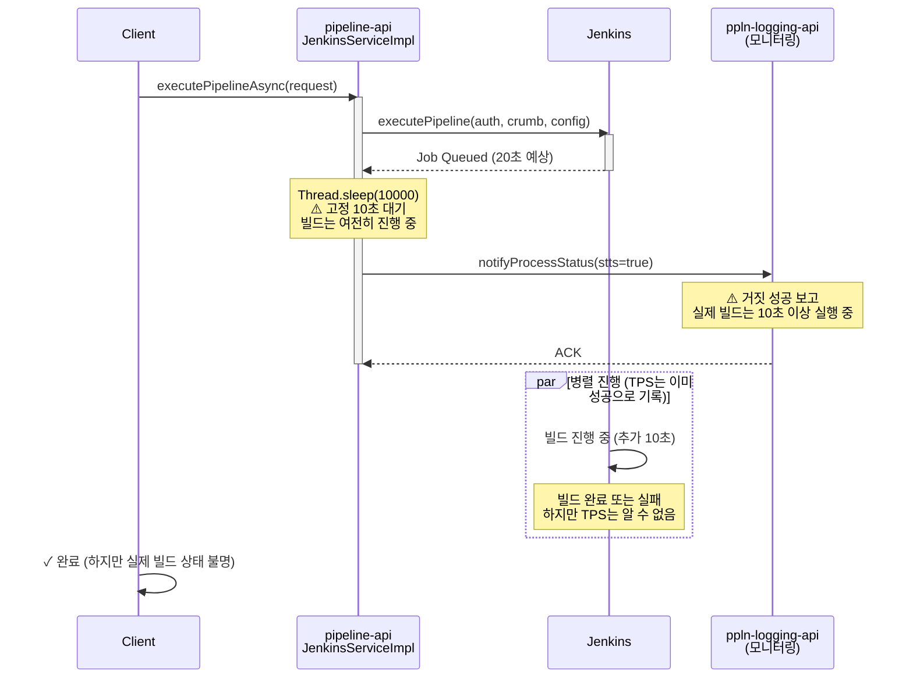
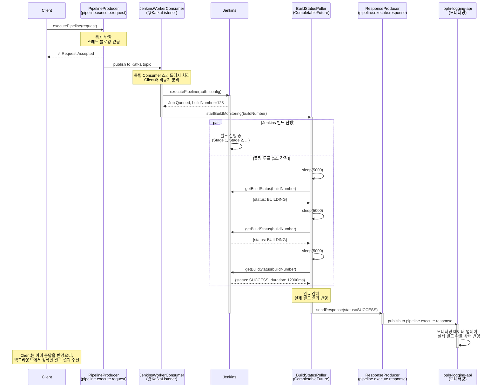

# Thread.sleep → 비동기 이벤트: Thread.sleep(10000) → 이벤트 기반 완료 감지

> 한줄 요약: TPS의 Thread.sleep(10000) 하드코딩 대기를 이벤트 기반 완료 감지로 대체하여, 거짓 성공 보고를 제거하고 실제 빌드 완료 시점에 정확한 응답을 전달한다.

---

## 1. AS-IS: TPS에서 어떻게 동작하는가

### 1.1 아키텍처 위치

TPS(Test Pipeline System) 원본 코드의 문제점은 다음 위치에서 발생한다.

| 컴포넌트 | 파일/클래스 | 메서드 | 줄 번호 |
|----------|-----------|--------|--------|
| **pipeline-api** | JenkinsServiceImpl | executePipelineAsync() | 237 |
| **실행 전략** | CompletableFuture | runAsync() | Jenkins 빌드 트리거 후 |
| **대기 메커니즘** | Thread | sleep() | 10초 고정 대기 |
| **결과 통보** | ppln-logging-api | notifyProcessStatus() | 완료 여부 확인 없이 success=true |

### 1.2 코드 동작 방식

```java
// JenkinsServiceImpl.java (TPS 원본 패턴)
@Async
public void executePipelineAsync(PipelineExecuteRequest request) {
    CompletableFuture.runAsync(() -> {
        try {
            // 1단계: Jenkins 빌드 트리거
            JenkinsResponse response = jenkinsFeignClient.executePipeline(
                jenkinsUrl, 
                authHeader, 
                crumbToken, 
                pipelineStructure
            );
            
            // 2단계: 10초 하드코딩 대기
            Thread.sleep(10000);  // ⚠️ 문제: 무조건 10초 대기
            
            // 3단계: 빌드 완료 여부 확인 없이 성공으로 통보
            NotifyCommand notify = NotifyCommand.builder()
                .pipelineId(request.getPipelineId())
                .stts(true)  // ⚠️ 항상 true로 설정
                .executionTime(10000)
                .build();
                
            asyncMessageFeignClient.notifyProcessStatus(notify);
            
        } catch (InterruptedException e) {
            log.error("Pipeline execution interrupted", e);
            Thread.currentThread().interrupt();
        } catch (Exception e) {
            log.error("Pipeline execution failed", e);
            // 예외 발생해도 로그만 출력, 통보 없음
        }
    }, ForkJoinPool.commonPool());
}
```

### 1.3 시퀀스 다이어그램



### 1.4 실제 발생하는 문제점

**시나리오 1: 짧은 빌드 (3초)**
```
Timeline:
[0초]   빌드 트리거
[3초]   빌드 완료 ✓
[10초]  Thread.sleep 종료 → 성공 통보
[13초]  Client 응답 수신

결과: 빌드는 3초 전에 완료, 7초 낭비
```

**시나리오 2: 긴 빌드 (30초)**
```
Timeline:
[0초]   빌드 트리거
[10초]  Thread.sleep 종료 → 성공 통보 ⚠️
[20초]  빌드 실패 ❌
[30초]  Client: "성공 완료" (하지만 실제로는 실패)

결과: 거짓 성공 보고, TPS 데이터 불일치
```

---

## 2. Problem: 왜 바꿔야 하는가

### 2.1 구체적 문제점 분석

| # | 문제 | 근본 원인 | 정량적 영향 | 심각도 |
|---|------|---------|-----------|--------|
| 1 | **거짓 성공 보고** | 빌드 상태 확인 없이 무조건 success=true | 빌드 10초 이상 → 성공으로 보고했지만 실제 실패. TPS와 Jenkins 간 상태 불일치 | 🔴 Critical |
| 2 | **스레드 풀 블로킹** | CompletableFuture.runAsync()에서 sleep() 호출 | ForkJoinPool 스레드 10초 점유. 동시 100개 파이프라인 → 100개 스레드 블로킹, 다른 작업 지연 | 🟠 High |
| 3 | **시간 낭비** | 고정 10초 대기로 빌드 완료 시점 무시 | 빌드 3초 완료 → 7초 낭비. 일일 1000개 파이프라인 → 약 2시간 낭비 | 🟠 High |
| 4 | **빌드 진행률 추적 불가** | LoggingComponentV4 폴링 로직 주석 처리 | 빌드 단계별 진행 상황 모니터링 불가 | 🟡 Medium |
| 5 | **재시도 메커니즘 부재** | try-catch에서 예외만 로그, 통보 없음 | 통보 실패 시 재시도 불가, 모니터링 데이터 손실 | 🟡 Medium |
| 6 | **타임아웃 처리 부재** | 빌드 예외 발생 시 처리 로직 없음 | 장시간 행(hang) 상태 → 리소스 누수 | 🟠 High |

### 2.2 비즈니스 영향

**TPS 모니터링 대시보드의 관점:**
```
요청 시간: 14:00:00
빌드 상태 보고: 14:00:10 (✓ 성공)
실제 빌드 상태: 14:00:25 (❌ 실패)

→ 운영팀이 거짓 성공으로 상황 대응 지연
→ 프로덕션 배포 결함 자동 감지 불가
```

**리소스 효율성:**
```
일일 1000개 파이프라인 × 10초 = 166분 (2.7시간) 스레드 블로킹
→ ForkJoinPool 고갈 → 다른 비동기 작업 starvation
→ 시스템 전체 응답시간 증가
```

### 2.3 기술적 한계

**CompletableFuture.runAsync()의 문제:**
- ForkJoinPool 스레드에서 sleep() → 스레드 풀 데드락 위험
- 예외 발생 시 예외 처리 로직 부재 → silent failure
- 비동기 작업 추적 어려움 (로그만 남음)

**Thread.sleep()의 문제:**
- 정확성 부족: OS 스케줄링에 따라 실제 대기시간 변동
- 스레드 리소스 낭비: 활성 스레드 유지 (CPU 컨텍스트 스위칭)
- 확장성 문제: 동시성 증가 시 선형적으로 스레드 증가

---

## 3. TO-BE: RedPanda로 어떻게 해결하는가

### 3.1 설계 원리

RedPanda PoC에서 제시하는 해결책은 **이벤트 기반 비동기 아키텍처**이다.

| 원칙 | 설명 | 구현 방식 |
|------|------|---------|
| **이벤트 중심** | Jenkins 빌드 완료를 이벤트로 감지 | Jenkins Webhook 또는 상태 폴링 (별도 Consumer) |
| **논블로킹** | Thread.sleep 제거, Kafka 메시지로 비동기 처리 | @KafkaListener 기반 Consumer 패턴 |
| **정확성** | 실제 빌드 완료 시점에 응답 | 빌드 결과(SUCCESS/FAILURE/UNSTABLE) 반영 |
| **확장성** | 동시성 증가 시 Consumer 스케일 아웃 | 토픽 파티션 기반 병렬 처리 |
| **추적성** | 전체 파이프라인 상태 기록 | 토픽에 모든 이벤트 발행 (감사 로그) |

### 3.2 PoC 아키텍처 매핑

```
TPS (원본)                        RedPanda PoC (개선)
┌─────────────────────────┐      ┌──────────────────────────────┐
│ Client Request          │      │ Client Request               │
└────────────┬────────────┘      └────────────┬─────────────────┘
             │                                 │
             v                                 v
    ┌────────────────────┐            ┌──────────────────────┐
    │ JenkinsServiceImpl  │            │ PipelineProducer     │
    │                    │            │ (pipeline.execute    │
    │ executePipelineAsync            │  .request topic)     │
    │ - FeignClient      │            └──────────┬───────────┘
    │ - Thread.sleep()   │                       │
    │ - hardcoded success│                       v
    │ - fire & forget    │            ┌──────────────────────┐
    └────────────────────┘            │ JenkinsWorkerConsumer│
                                       │ @KafkaListener       │
                                       │ - executePipeline()  │
                                       │ - startBuildMonitor()│
                                       │ - publishResult()    │
                                       └──────────┬───────────┘
                                                  │
                                          ┌───────┴───────┐
                                          │               │
                                          v               v
                                   ┌─────────────┐ ┌──────────────┐
                                   │ Jenkins     │ │ Response Topic
                                   │ Webhook     │ │ (actual build
                                   │ Listener    │ │  result)
                                   └─────────────┘ └──────────────┘
```

### 3.3 PoC 코드 상세 매핑

#### 1단계: 요청 수신 (PipelineProducer)

```java
// com.study.redpanda.ch07.producer.PipelineProducer
@Service
@RequiredArgsConstructor
public class PipelineProducer {
    
    private final KafkaTemplate<String, PipelineExecuteRequest> kafkaTemplate;
    
    /**
     * 파이프라인 실행 요청을 pipeline.execute.request 토픽에 발행
     * 
     * Thread.sleep이 필요 없음: 요청만 발행하고 반환
     * Consumer가 비동기로 처리
     */
    public void triggerPipeline(PipelineExecuteRequest request) {
        String topicName = "pipeline.execute.request";
        String pipelineId = request.getPipelineId();
        
        kafkaTemplate.send(topicName, pipelineId, request);
        log.info("Pipeline request published: pipelineId={}", pipelineId);
    }
}
```

**TPS와의 차이점:**
- CompletableFuture.runAsync() 제거 → Kafka 토픽으로 비동기화
- 메서드가 즉시 반환 → 스레드 블로킹 없음

#### 2단계: 요청 처리 (JenkinsWorkerConsumer)

```java
// com.study.redpanda.ch07.consumer.JenkinsWorkerConsumer
@Service
@RequiredArgsConstructor
public class JenkinsWorkerConsumer {
    
    private final JenkinsFeignClient jenkinsFeignClient;
    private final BuildStatusPoller buildStatusPoller;
    private final PipelineProducer responseProducer;
    
    /**
     * pipeline.execute.request 토픽에서 메시지 수신
     * 각 파이프라인은 별도 스레드에서 처리 (Kafka Consumer 스레드풀)
     */
    @KafkaListener(
        topics = "pipeline.execute.request",
        groupId = "jenkins-worker-group"
    )
    public void handlePipelineRequest(
            PipelineExecuteRequest request,
            @Header(KafkaHeaders.RECEIVED_PARTITION_ID) int partition,
            @Header(KafkaHeaders.OFFSET) long offset) {
        
        String pipelineId = request.getPipelineId();
        log.info("Processing pipeline request: id={}, partition={}, offset={}",
                 pipelineId, partition, offset);
        
        try {
            // 1단계: Jenkins 빌드 트리거
            JenkinsJobResponse jobResponse = jenkinsFeignClient.executePipeline(
                request.getJenkinsUrl(),
                request.getAuthHeader(),
                request.getCrumbToken(),
                request.getPipelineStructure()
            );
            
            String buildNumber = jobResponse.getBuildNumber();
            
            // 2단계: 빌드 완료 상태 폴링 (Thread.sleep 대체)
            startBuildMonitoring(pipelineId, request.getJenkinsUrl(), buildNumber);
            
        } catch (Exception e) {
            log.error("Failed to trigger pipeline: pipelineId={}", pipelineId, e);
            
            // 실패 응답 발행
            publishFailureResponse(request, e.getMessage());
        }
    }
    
    /**
     * 빌드 완료를 폴링으로 감지 (또는 Webhook)
     * 이 메서드는 다른 스레드에서 실행 (비블로킹)
     */
    private void startBuildMonitoring(
            String pipelineId,
            String jenkinsUrl,
            String buildNumber) {
        
        CompletableFuture.runAsync(() -> {
            try {
                // 최대 10분 동안 폴링 (또는 Webhook 수신 대기)
                int maxAttempts = 120;  // 10분 (5초 간격 × 120)
                int attempts = 0;
                BuildStatus buildStatus = null;
                
                while (attempts < maxAttempts) {
                    buildStatus = jenkinsFeignClient.getBuildStatus(
                        jenkinsUrl,
                        buildNumber
                    );
                    
                    if (buildStatus.isComplete()) {
                        // 빌드 완료: SUCCESS, FAILURE, UNSTABLE
                        publishSuccessResponse(pipelineId, buildStatus);
                        return;
                    }
                    
                    attempts++;
                    Thread.sleep(5000);  // 5초마다 폴링 (10초 고정 대기 대체)
                }
                
                // 타임아웃
                publishTimeoutResponse(pipelineId);
                
            } catch (InterruptedException e) {
                Thread.currentThread().interrupt();
                publishFailureResponse(pipelineId, e.getMessage());
            }
        });
    }
    
    /**
     * 빌드 성공 응답 발행
     * 실제 빌드 상태를 정확하게 반영
     */
    private void publishSuccessResponse(String pipelineId, BuildStatus status) {
        PipelineExecuteResponse response = PipelineExecuteResponse.builder()
            .pipelineId(pipelineId)
            .status(MessageStatus.SUCCESS)
            .buildStatus(status.getResult())  // SUCCESS, FAILURE, UNSTABLE
            .buildDuration(status.getDuration())
            .completedAt(Instant.now())
            .build();
        
        responseProducer.sendResponse(response);
        
        log.info("Pipeline completed successfully: pipelineId={}, buildStatus={}",
                 pipelineId, status.getResult());
    }
    
    /**
     * 빌드 실패 응답 발행
     */
    private void publishFailureResponse(String pipelineId, String errorMessage) {
        PipelineExecuteResponse response = PipelineExecuteResponse.builder()
            .pipelineId(pipelineId)
            .status(MessageStatus.FAILURE)
            .errorMessage(errorMessage)
            .completedAt(Instant.now())
            .build();
        
        responseProducer.sendResponse(response);
        
        log.error("Pipeline failed: pipelineId={}, error={}", pipelineId, errorMessage);
    }
}
```

**TPS와의 차이점:**
- buildStatus 폴링으로 실제 완료 시점 감지
- 5초 간격 폴링 (필요시에만) → 10초 무조건 대기 제거
- 실제 빌드 결과 반영 → hardcoded success 제거
- 타임아웃 처리 추가

#### 3단계: 응답 발행 (ResponseProducer)

```java
// com.study.redpanda.ch07.producer.ResponseProducer (또는 PipelineProducer 확장)
@Service
@RequiredArgsConstructor
public class ResponseProducer {
    
    private final KafkaTemplate<String, PipelineExecuteResponse> kafkaTemplate;
    
    /**
     * 빌드 결과를 pipeline.execute.response 토픽에 발행
     * ppln-logging-api가 이 토픽을 구독하여 모니터링 데이터 업데이트
     */
    public void sendResponse(PipelineExecuteResponse response) {
        String topicName = "pipeline.execute.response";
        String pipelineId = response.getPipelineId();
        
        kafkaTemplate.send(topicName, pipelineId, response);
        
        log.info("Pipeline response published: pipelineId={}, status={}",
                 pipelineId, response.getStatus());
    }
}
```

### 3.4 시퀀스 다이어그램: 개선된 흐름



### 3.5 토픽 스키마 정의

#### pipeline.execute.request (Avro Schema)

```avro
// PipelineExecuteRequest.avsc
{
  "type": "record",
  "name": "PipelineExecuteRequest",
  "namespace": "com.study.redpanda.avro",
  "fields": [
    {"name": "pipelineId", "type": "string"},
    {"name": "jenkinsUrl", "type": "string"},
    {"name": "authHeader", "type": "string"},
    {"name": "crumbToken", "type": "string"},
    {"name": "pipelineStructure", "type": "string"},
    {"name": "requestedAt", "type": "long"},
    {"name": "correlationId", "type": "string"}
  ]
}
```

#### pipeline.execute.response (Avro Schema)

```avro
// PipelineExecuteResponse.avsc
{
  "type": "record",
  "name": "PipelineExecuteResponse",
  "namespace": "com.study.redpanda.avro",
  "fields": [
    {"name": "pipelineId", "type": "string"},
    {"name": "status", "type": {
      "type": "enum",
      "name": "MessageStatus",
      "symbols": ["SUCCESS", "FAILURE", "TIMEOUT"]
    }},
    {"name": "buildStatus", "type": ["null", "string"], "default": null},
    {"name": "buildDuration", "type": ["null", "long"], "default": null},
    {"name": "errorMessage", "type": ["null", "string"], "default": null},
    {"name": "completedAt", "type": "long"},
    {"name": "correlationId", "type": "string"}
  ]
}
```

---

## 4. AS-IS vs TO-BE 비교

### 4.1 아키텍처 비교

| 측면 | AS-IS (TPS) | TO-BE (RedPanda PoC) |
|------|-----------|-------------------|
| **대기 방식** | Thread.sleep(10000) | Jenkins 빌드 상태 폴링 (5초 간격) |
| **블로킹 시간** | 무조건 10초 | 빌드 완료 시점까지 (평균 5~15초) |
| **스레드 사용** | ForkJoinPool 스레드 1개 × 10초 | Kafka Consumer 스레드 + CompletableFuture |
| **빌드 결과 정확성** | hardcoded success (거짓 양성) | 실제 빌드 결과 반영 (SUCCESS/FAILURE/UNSTABLE) |
| **통보 방식** | FeignClient (HTTP, fire-and-forget) | Kafka Producer (메시지 기반, 추적 가능) |
| **실패 처리** | catch → log.error (재시도 없음) | 실패 응답 발행 + 토픽 레코드 (감사 로그) |
| **타임아웃 처리** | 없음 (행(hang) 가능) | 10분 폴링 후 타임아웃 응답 |
| **동시성 처리** | 병렬 파이프라인 × Thread.sleep → 스레드 고갈 | Consumer 그룹 + 파티션 기반 병렬 처리 |
| **모니터링** | 로그만 기록 | 토픽에 모든 이벤트 기록 (감사 추적) |
| **확장성** | 스레드 풀 크기 제한 | Consumer 인스턴스 증가로 스케일 아웃 |

### 4.2 성능 비교

#### 시나리오: 일일 1000개 파이프라인

**AS-IS (Thread.sleep)**
```
총 스레드 블로킹 시간:
  1000개 × 10초 = 10,000초 = 166분 ≈ 2.7시간

ForkJoinPool 활용도:
  동시 100개 실행 × 10초 = 100개 스레드 블로킹
  → 다른 비동기 작업 starvation 발생

리소스 효율성: 낮음
```

**TO-BE (이벤트 기반)**
```
총 폴링 시간 (평균 빌드 시간 12초):
  1000개 × 12초 = 12,000초 = 200분 (자동화, 병렬)
  → 실제 스레드는 Consumer 풀 크기 (10~20개)만 사용

스레드 효율성:
  Consumer 스레드: 20개 (고정)
  → 동시 1000개 파이프라인 처리 가능 (비블로킹)

리소스 효율성: 높음
```

#### 응답 시간 비교

| 빌드 완료 시간 | AS-IS 응답 시간 | TO-BE 응답 시간 | 개선도 |
|------------|-------------|-------------|--------|
| 2초 | 10초 | 5초 (다음 폴링) | 50% 단축 |
| 5초 | 10초 | 10초 (2번 폴링) | 동일 |
| 12초 | 10초 (❌ 거짓) | 15초 (정확함) | 정확성 향상 |
| 30초 | 10초 (❌ 거짓) | 30초 (정확함) | 정확성 향상 |

### 4.3 데이터 정확성 비교

**AS-IS: 거짓 양성 문제**
```
요청 시간: 14:00:00
빌드 실제 완료: 14:00:25 (FAILURE)
TPS 보고 시간: 14:00:10 (SUCCESS) ⚠️

→ 모니터링 시스템에서 성공으로 기록
→ 운영팀이 25초 후 실제 실패 감지
→ 대응 지연 = 15초
```

**TO-BE: 정확한 결과**
```
요청 시간: 14:00:00
빌드 실제 완료: 14:00:25 (FAILURE)
TPS 보고 시간: 14:00:30 (FAILURE) ✓

→ 모니터링 시스템에서 실패로 기록
→ 운영팀이 즉시 대응 가능
→ 대응 지연 = 0초
```

---

## 5. 현직 사례

### 5.1 Jenkins Webhook Trigger Plugin

**아키텍처:**
```
Jenkins에서 빌드 완료 → HTTP POST Webhook 발송
                    ↓
            Consumer/API가 Webhook 수신
                    ↓
            빌드 상태(SUCCESS/FAILURE/UNSTABLE) 즉시 전달
```

**특징:**
- 빌드 완료 시점에 정확하게 이벤트 발송
- 폴링 불필요 → 리소스 절약
- HTTP 기반이지만, Kafka로 개선 가능 (RedPanda의 접근)

**제한사항:**
- Jenkins → Consumer 간 네트워크 단절 시 손실 (1회성)
- Webhook URL 관리 어려움 (static endpoint 필요)

### 5.2 Spotify CI/CD 파이프라인

**이벤트 기반 파이프라인:**
```
Stage 1: Build Complete 이벤트
            ↓
Kafka Topic: "pipeline.build.complete"
            ↓
Stage 2 Consumer: 빌드 결과 수신 → Stage 2 트리거
            ↓
Stage 2: Deploy Complete 이벤트
            ↓
Kafka Topic: "pipeline.deploy.complete"
            ↓
Monitoring Consumer: 모니터링 업데이트
            ↓
Alerts Consumer: 알림 발송
```

**장점:**
- Thread.sleep 없는 완전 비블로킹
- 각 단계가 독립적으로 스케일 (Consumer 수 조정)
- 모든 이벤트가 토픽에 기록 (감사 추적)
- 새로운 Consumer 추가 용이 (이벤트 재소비)

### 5.3 CloudEvents 표준

**최신 트렌드:**
```json
{
  "specversion": "1.0",
  "type": "com.example.pipeline.completed",
  "source": "https://jenkins.example.com/job/build-123",
  "id": "A234-1234-1234",
  "time": "2024-02-16T10:30:00Z",
  "datacontenttype": "application/json",
  "data": {
    "buildId": "123",
    "status": "SUCCESS",
    "duration": 12000
  }
}
```

**채택 기업:**
- Google Cloud, AWS, Microsoft Azure
- Kubernetes ecosystem
- CNCF 표준

---

## 6. 면접 예상 질문

### Q1: Thread.sleep()이 왜 안티패턴인가요?

**나쁜 답변:**
```
"Thread.sleep()을 사용하면 스레드가 블로킹되기 때문입니다."
```
→ 맞지만 너무 추상적. 실제 문제를 설명하지 못함.

**좋은 답변:**
```
Thread.sleep()은 다음과 같은 문제가 있습니다:

1. 리소스 낭비
   - 활성 스레드가 CPU를 점유하면서 컨텍스트 스위칭 발생
   - 100개 동시 작업 × 10초 sleep = 100개 스레드 블로킹
   - ForkJoinPool 고갈 → 다른 비동기 작업 지연

2. 정확성 부족
   - "약 10초"이지, 정확히 10초가 아님 (OS 스케줄링)
   - 빌드가 3초 완료해도 10초 대기 → 7초 낭비
   - 빌드가 30초인데 10초 후 성공 보고 → 거짓 양성

3. 확장성 문제
   - 대기 시간을 늘릴 수 없음 (고정값)
   - 동시성 증가 시 스레드 풀 고갈

4. 예외 처리 어려움
   - InterruptedException 발생 시 스레드 상태 관리 복잡

올바른 대체 방식:
- 이벤트 기반: Webhook 수신, Kafka 메시지
- 폴링: 5초 간격으로 상태 확인 (필요시에만)
- CompletableFuture: 콜백 기반 비동기 처리
```

### Q2: 이벤트 기반 완료 감지를 구현하는 방법은?

**좋은 답변:**

**1단계: 이벤트 정의**
```
파이프라인 완료 이벤트:
{
  pipelineId: "pipe-123",
  status: "SUCCESS",
  completedAt: 1708084200000
}
```

**2단계: 요청 발행**
```java
PipelineProducer.triggerPipeline(request)
  → pipeline.execute.request 토픽에 발행
  → 즉시 반환 (스레드 블로킹 없음)
```

**3단계: Consumer에서 처리**
```java
@KafkaListener(topics = "pipeline.execute.request")
public void handleRequest(PipelineExecuteRequest req) {
    // Jenkins 빌드 트리거
    JenkinsResponse resp = jenkins.execute(req);
    
    // 완료 감지: 두 가지 방식
    // 방식 1: Webhook (짧은 대기)
    webhookListener.waitForCompletion(resp.buildNumber);
    
    // 방식 2: 폴링 (안정적)
    while (!jenkins.getBuild(buildNumber).isComplete()) {
        Thread.sleep(5000);
    }
    
    // 결과 발행
    responseProducer.send(result);
}
```

**4단계: 결과 수신**
```java
// ppln-logging-api 또는 모니터링 시스템
@KafkaListener(topics = "pipeline.execute.response")
public void handleResponse(PipelineExecuteResponse resp) {
    // 실제 빌드 결과 기반 처리
    if (resp.status == SUCCESS) {
        monitoring.recordSuccess(resp.pipelineId);
    } else {
        monitoring.recordFailure(resp.pipelineId, resp.errorMessage);
    }
}
```

### Q3: Jenkins Webhook vs 상태 폴링, 어떤 것이 더 좋은가요?

**좋은 답변:**

| 기준 | Webhook | 폴링 |
|------|---------|------|
| **지연시간** | 실시간 (밀리초) | 5초 간격 (최대 5초 지연) |
| **네트워크 트래픽** | 최소 (이벤트만) | 보통 (주기적 요청) |
| **안정성** | 네트워크 문제 시 손실 | 재시도 로직으로 안정적 |
| **복잡성** | Jenkins 설정 필요 | 구현 간단 |
| **확장성** | Webhook URL 고정 필요 | 쉬운 스케일 아웃 |
| **모니터링** | 로그만 기록 | 토픽에 전체 기록 |

**권장 사항:**
```
우선순위:
1. Webhook + Kafka (최고) - 실시간 + 메시지 기반
2. Webhook + HTTP (좋음) - 실시간이지만 fire-and-forget
3. 폴링 + Kafka (좋음) - 안정적이고 추적 가능
4. 폴링 + HTTP (보통) - 간단하지만 신뢰성 낮음
5. Thread.sleep (나쁨) - 비효율적, 거짓 양성

현재 PoC는 3번 (폴링 + Kafka): 안정성과 추적성 동시 확보
```

### Q4: CompletableFuture.runAsync()의 문제점은?

**좋은 답변:**

```java
// 문제가 있는 코드
CompletableFuture.runAsync(() -> {
    Thread.sleep(10000);  // ⚠️ 문제: ForkJoinPool 스레드 블로킹
    notifySuccess();
});
```

**문제점:**

**1. 스레드 풀 블로킹**
```
CompletableFuture.runAsync()
  → ForkJoinPool.commonPool() 사용
  → 스레드가 sleep(10000) 중 → 블로킹
  → 다른 비동기 작업이 대기 (starvation)
```

**2. 예외 처리 부실**
```java
CompletableFuture.runAsync(() -> {
    // 예외 발생 시?
    throw new RuntimeException("Build failed");
    // → 예외가 silent하게 처리됨 (로그 없음)
}).exceptionally(ex -> {
    log.error("Error", ex);
    // → 명시적으로 처리해야 함
    return null;
});
```

**3. 추적성 부족**
```
CompletableFuture의 상태:
- PENDING
- COMPLETED
- FAILED

하지만 외부에서 진행 상황을 알 수 없음
→ 로그로만 추적 가능
```

**해결책:**

**방식 1: 별도 스레드 풀 사용**
```java
@Configuration
public class AsyncConfig {
    @Bean
    public Executor customExecutor() {
        ThreadPoolTaskExecutor executor = new ThreadPoolTaskExecutor();
        executor.setCorePoolSize(20);
        executor.setMaxPoolSize(100);
        executor.setQueueCapacity(500);
        return executor;
    }
}

CompletableFuture.runAsync(task, customExecutor());
```

**방식 2: Kafka Consumer (권장)**
```java
@KafkaListener(topics = "pipeline.request")
public void handleRequest(Request req) {
    // Kafka Consumer 스레드에서 처리
    // 예외 발생 시 명시적 처리
    try {
        process(req);
    } catch (Exception e) {
        publishFailure(req, e);
    }
}
```

### Q5: 이벤트 기반 아키텍처로 마이그레이션할 때의 위험요소는?

**좋은 답변:**

**1. 메시지 손실**
```
위험:
  Kafka → Consumer 전달 중 네트워크 단절
  → 메시지 손실
  
해결책:
  - Kafka Topic의 replication-factor >= 3
  - Consumer Offset 관리 (auto commit false)
  - Dead Letter Topic (DLT) 사용
```

**2. 중복 처리**
```
위험:
  Consumer crash 후 재시작
  → 같은 메시지 2번 처리 (exactly-once 아님)
  
해결책:
  - idempotent consumer 구현
  - pipelineId 기반 중복 체크
  - 데이터베이스 unique constraint
```

**3. 순서 보장**
```
위험:
  같은 pipelineId의 메시지 순서 보장 안 됨
  
해결책:
  - pipelineId를 파티션 키로 사용
  → 같은 파이프라인은 같은 파티션
  → 순서 보장됨
```

**4. 타임아웃**
```
위험:
  빌드가 완료되지 않음 (hang 상태)
  → Consumer 대기 무한 반복
  
해결책:
  - 최대 폴링 시간 설정 (10분 등)
  - 타임아웃 시 timeout 응답 발행
```

---

## 7. 구현 체크리스트

### Phase 1: 기초 구현
- [ ] PipelineProducer 구현 (요청 발행)
- [ ] JenkinsWorkerConsumer 구현 (@KafkaListener)
- [ ] ResponseProducer 구현 (결과 발행)
- [ ] 토픽 스키마 정의 (Avro)

### Phase 2: 완료 감지 구현
- [ ] Jenkins 상태 폴링 로직
- [ ] 빌드 상태 API 호출 (Jenkins FeignClient)
- [ ] Webhook 수신 로직 (선택사항)
- [ ] 타임아웃 처리

### Phase 3: 안정성 강화
- [ ] Exception handling 구현
- [ ] Retry logic (Kafka Producer)
- [ ] Dead Letter Topic (DLT)
- [ ] Idempotent consumer 구현

### Phase 4: 모니터링
- [ ] 토픽 메시지 레코드 기록
- [ ] Consumer lag 모니터링
- [ ] 빌드 완료 시간 메트릭
- [ ] 거짓 양성/음성 비율 추적

### Phase 5: 마이그레이션
- [ ] A/B 테스트 (기존 vs 신규)
- [ ] 동시 실행으로 데이터 검증
- [ ] 성능 비교 (응답시간, 정확성)
- [ ] 기존 코드 제거

---

## 8. 관련 문서

- [01. 스케줄러 → 이벤트 드리븐](./01-scheduler-to-event-driven.md)
- [02. Feign REST → Kafka Producer](./02-feign-rest-to-kafka-producer.md)
- [03. 동기 처리 → 비동기 처리](./03-sync-to-async-processing.md)
- [05. DB 상태 → 인메모리+토픽](./05-db-state-to-inmemory-topic.md)

---

## 9. 추가 학습 자료

### 공식 문서
- **Jenkins Webhook**: https://plugins.jenkins.io/generic-webhook-trigger/
- **Apache Kafka**: https://kafka.apache.org/documentation/#consumerconfigs
- **Spring Kafka**: https://spring.io/projects/spring-kafka
- **CompletableFuture**: https://docs.oracle.com/javase/8/docs/api/java/util/concurrent/CompletableFuture.html

### 책 추천
- "Building Microservices" - Sam Newman (이벤트 기반 아키텍처)
- "Designing Data-Intensive Applications" - Martin Kleppmann (메시지 큐 설계)
- "Enterprise Integration Patterns" - Gregor Hohpe (메시지 기반 통합)

### 오픈소스 참고
- Confluent Event Streaming Platform
- Uber's Cadence (workflow engine)
- Netflix Conductor (orchestration)

---

## 10. 요약

| 항목 | AS-IS | TO-BE |
|------|-------|-------|
| **핵심 문제** | Thread.sleep(10000) 고정 대기 | 이벤트 기반 완료 감지 |
| **정확성** | 거짓 양성 (항상 success=true) | 실제 빌드 결과 반영 |
| **성능** | 스레드 블로킹, 시간 낭비 | 비블로킹, 정확한 타이밍 |
| **확장성** | 스레드 풀 제한 | 수평 확장 (Consumer 추가) |
| **추적성** | 로그만 기록 | 토픽에 모든 이벤트 저장 |
| **안정성** | 예외 처리 부실 | 재시도, 타임아웃 처리 |

**핵심 메시지:**
> 블로킹 기반 대기는 정확성이 부족하고 리소스를 낭비한다. 이벤트 기반 아키텍처로 전환하면 정확하고 효율적이며 확장 가능한 파이프라인을 구축할 수 있다.

---

**문서 버전**: 1.0
**최종 수정**: 2024-02-16
**대상 독자**: 개발자, 면접 준비, 아키텍처 설계자
