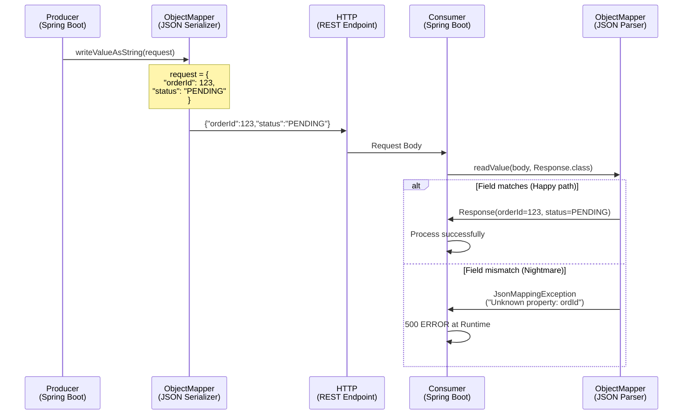
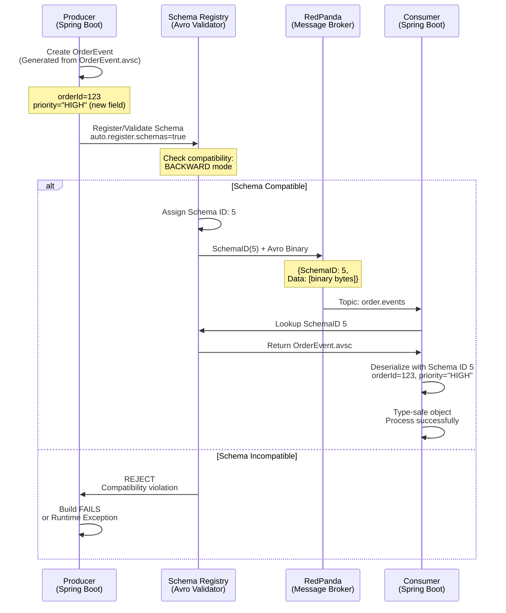

# JSON 수동 직렬화 → Avro + Schema Registry

> 한줄 요약: TPS의 JSON 문자열 기반 수동 직렬화를 Avro 바이너리 + Schema Registry 자동 검증으로 대체하여, 런타임 역직렬화 실패를 빌드 타임 검증으로 앞당기고 스키마 진화를 자동 관리한다.

---

## 1. AS-IS: TPS에서 어떻게 동작하는가

### 1.1 아키텍처 위치

TPS 아키텍처에서 REST 통신의 직렬화 방식:

- **REST 통신 전반**: JSON 기반 직렬화가 표준
- **AsyncMessageRequest/Response**: Avro 어노테이션은 클래스에 붙어있으나, 실제 전송은 JSON 형식
- **FeignClient**: HTTP 통신 시 Jackson의 ObjectMapper를 기본 인코더/디코더로 사용
- **스키마 관리**: 중앙 스키마 저장소 없음 — Producer와 Consumer가 동일한 DTO 클래스를 소스코드 상에서 공유

이 구조는 마이크로서비스 간 강한 결합을 만들기 때문에 배포 순서가 중요하다.

### 1.2 코드 동작 방식

#### Producer 측 (메시지 발행)
```
1. DTO 객체 생성 (AsyncMessageRequest)
   ↓
2. FeignClient의 ObjectMapper.writeValueAsString()
   ↓
3. HTTP POST body로 JSON 문자열 전송
   (예: {"orderId": 123, "userId": 456, "amount": 10000})
   ↓
4. 스키마 검증 없음 — 잘못된 필드도 그냥 전송
```

#### Consumer 측 (메시지 수신)
```
1. HTTP body의 JSON 문자열 수신
   ↓
2. FeignClient의 ObjectMapper.readValue(body, AsyncMessageResponse.class)
   ↓
3. JSON → DTO 역직렬화
   ↓
4. 필드 불일치 시 JsonMappingException (런타임 에러)
```

#### 핵심 문제점
- `AsyncMessageMapper`: Avro ↔ VO 변환 로직이 있으나, 실제로는 JSON 기반으로 동작
- Producer와 Consumer의 DTO 필드가 불일치하면 **런타임에만 발견**
- 필드 추가/삭제 시 양쪽 모두 동시에 배포해야 함

### 1.3 시퀀스 다이어그램



---

## 2. Problem: 왜 바꿔야 하는가

### 2.1 구체적 문제점

| # | 문제 | 설명 | 정량적 영향 |
|---|------|------|-----------|
| 1 | **런타임 역직렬화 실패** | 필드명/타입 불일치 시 운영 중 JsonMappingException 발생. 빌드 시점에 감지 불가 | 프로덕션 장애, 복구 시간 수시간 |
| 2 | **스키마 진화 불가능** | 필드 추가/삭제/이름변경 시 Producer와 Consumer를 동일 시점에 배포 강제 | 배포 조율 비용, 다운타임 위험 |
| 3 | **직렬화 크기 낭비** | JSON은 모든 필드명을 매번 포함하여 페이로드 크기 증대. Avro 대비 2-5배 | 네트워크 대역폭 낭비, 지연시간 증가 |
| 4 | **타입 안전성 부재** | ObjectMapper의 Object 캐스팅 필요, 런타임 ClassCastException 위험 | 개발자 실수, 테스트 누락 시 장애 |
| 5 | **호환성 검증 없음** | 스키마 변경이 기존 Consumer를 깨뜨리는지 수동 확인만 가능 | 휴먼 에러, 호환성 문제 간과 |
| 6 | **버전 관리 어려움** | API 버저닝 또는 필드명 변경 시 모든 클라이언트 추적 필요 | 유지보수 복잡도 증가 |

### 2.2 문제가 발생하는 구체적 시나리오

#### 시나리오 A: 필드 추가 — Producer 먼저 배포
```
Timeline:
  T0. Producer 배포: field "priority" 추가
      {
        "orderId": 123,
        "priority": "HIGH"    ← 새 필드
      }

  T1. Consumer는 아직 구버전
      필드 "priority"를 모르므로 JsonMappingException 또는 무시

  T2. 운영 팀이 Consumer 배포 시까지 에러 발생

  T3. Consumer 배포 완료 후 정상화
```

결과: 배포 순서 강제, 조율 비용, 장애 시간 발생.

#### 시나리오 B: 필드명 오타
```
Producer에서 "demandId" 필드로 정의
Consumer에서는 "dmndId" 필드로 정의

{
  "demandId": 456    ← Producer가 보냄
}

Consumer의 ObjectMapper.readValue() 호출 시:
  JsonMappingException: "Unknown property: demandId"
  (Consumer는 "dmndId"를 기대)

→ 런타임 에러, 즉시 대응 필요
```

#### 시나리오 C: 필드 삭제 — Consumer 먼저 배포
```
Producer에서 "legacyField" 필드 삭제
Consumer는 아직 해당 필드를 기대

{
  "orderId": 123
  (legacyField 없음)
}

Consumer의 ObjectMapper.readValue() 호출 시:
  필드가 없으면 기본값(null 또는 예외) 할당
  만약 필드가 @NonNull이면 NullPointerException
```

이 모든 시나리오는 **빌드 타임에 감지될 수 없다**. 런타임 통합 테스트나 운영 중에만 발견된다.

---

## 3. TO-BE: RedPanda로 어떻게 해결하는가

### 3.1 설계 원리

#### 핵심 개념 4가지

**1. Schema Registry (스키마 중앙 저장소)**
- 모든 스키마를 버전과 함께 저장
- 각 스키마에 고유 ID 부여
- Producer 발행 시 스키마 자동 검증
- Consumer 수신 시 스키마 ID로 역직렬화 방식 결정

**2. Avro 바이너리 직렬화**
- JSON처럼 필드명을 매번 포함하지 않음
- 필드 값만 스키마 순서대로 바이너리로 인코딩
- 크기: JSON 대비 2-5배 작음
- 속도: JSON 파싱보다 빠름

**3. 호환성 검증 (자동)**
- 새 스키마가 기존 메시지와 호환되는지 자동 검증
- BACKWARD/FORWARD/FULL 모드로 유연성 제공
- 호환성 위반 시 배포 자체를 차단

**4. 코드 생성 (빌드 타임)**
- .avsc(Avro Schema) → Java 클래스 자동 생성
- Gradle 플러그인이 빌드 시점에 생성
- 타입 안전성 보장, 런타임 ClassCastException 원천 차단

### 3.2 PoC 코드 매핑

| TPS 원본 | PoC 파일 | 변경점 | 의미 |
|----------|---------|--------|------|
| ObjectMapper (JSON) | KafkaAvroSerializer | Avro 직렬화로 교체 | 바이너리 크기 절감 |
| 수동 DTO 작성 | .avsc 스키마 파일 | 스키마 정의 | 단일 정보원(SSOT) |
| 없음 | Schema Registry | 스키마 중앙 관리 | 호환성 자동 검증 |
| FeignClient (HTTP) | KafkaTemplate (토픽) | 통신 방식 변경 | 비동기 메시징 |
| 동시 배포 강제 | BACKWARD 호환성 | 독립 배포 가능 | 배포 유연성 |

#### PoC의 Avro 스키마 파일 구조

```
redpanda-spring-boot/
├── src/main/avro/
│   ├── OrderEvent.avsc
│   ├── PipelineExecuteRequest.avsc
│   ├── PipelineExecuteResponse.avsc
│   ├── PipelineStatusUpdate.avsc
│   ├── TransactionEvent.avsc
│   └── MessageStatus.avsc (enum)
│
├── build.gradle
│   └── plugins {
│       id 'com.commercetools.gradle.avro' version '0.13.0'
│     }
│
└── src/main/java/generated/
    └── (자동 생성된 Java 클래스들)
```

**OrderEvent.avsc 예시:**
```json
{
  "type": "record",
  "name": "OrderEvent",
  "namespace": "com.runners.event",
  "fields": [
    {
      "name": "orderId",
      "type": "long"
    },
    {
      "name": "userId",
      "type": "long"
    },
    {
      "name": "amount",
      "type": "double"
    },
    {
      "name": "priority",
      "type": ["null", "string"],
      "default": null
    },
    {
      "name": "createdAt",
      "type": "long"
    }
  ]
}
```

**빌드 시 자동 생성되는 Java 클래스:**
```java
// 생성된 OrderEvent.java
public class OrderEvent extends SpecificRecordBase {
  public Long orderId;
  public Long userId;
  public Double amount;
  public String priority;  // BACKWARD 호환 - 기본값 null
  public Long createdAt;

  // Avro의 getSchema() 메서드 자동 구현
  // toString(), equals(), hashCode() 자동 구현
}
```

### 3.3 시퀀스 다이어그램



#### 다이어그램 설명

1. **Schema Registration (빌드/배포 시)**
   - Producer가 OrderEvent 객체를 생성
   - Schema Registry에 스키마 등록 요청
   - BACKWARD 호환성 자동 검증
   - 호환 가능하면 Schema ID 부여 (예: 5)

2. **Message Publishing (런타임)**
   - Avro Serializer가 객체를 바이너리로 변환
   - SchemaID + 바이너리 데이터를 토픽에 발행
   - JSON 대비 훨씬 작은 페이로드

3. **Message Consuming (런타임)**
   - Consumer가 메시지 수신 (SchemaID 5 + 바이너리)
   - Schema Registry에서 SchemaID 5의 정의 조회
   - Avro Deserializer가 스키마에 맞게 객체 복원
   - 타입 안전한 OrderEvent 객체 반환

---

## 4. AS-IS vs TO-BE 비교

| 비교 항목 | AS-IS (JSON + ObjectMapper) | TO-BE (Avro + Schema Registry) |
|-----------|--------------------------|-------------------------------|
| **직렬화 크기** | 크다 (필드명 매번 포함, ~500 bytes) | 작다 (바이너리, ~100-150 bytes) |
| **네트워크 오버헤드** | 높음 (2-5배 낭비) | 낮음 (최적화) |
| **검증 시점** | 런타임 (ObjectMapper 역직렬화 시) | 빌드 타임 (gradle build) + 배포 타임 (Schema Registry) |
| **에러 발견** | 운영 중 JsonMappingException | 배포 파이프라인에서 호환성 검증으로 차단 |
| **호환성 관리** | 수동 (동시 배포 강제) | BACKWARD/FORWARD/FULL 자동 |
| **코드 생성** | 수동 DTO 작성 (휴먼 에러 위험) | .avsc → Java 클래스 자동 (빌드 타임) |
| **타입 안전성** | Object 캐스팅 필요 (런타임 위험) | SpecificRecord (컴파일 타임 안전) |
| **스키마 진화** | 어려움 (버전 관리 복잡) | 쉬움 (기본값 + 호환성 자동) |
| **필드 추가** | Producer-Consumer 동시 배포 | Consumer 먼저 배포 가능 (BACKWARD) |
| **필드 삭제** | Producer-Consumer 동시 배포 | Producer 먼저 배포 가능 (FORWARD) |
| **배포 독립성** | 강한 결합 (불가능) | 느슨한 결합 (가능) |
| **개발자 경험** | DTO 수동 유지 (복잡도 높음) | 스키마만 관리 (복잡도 낮음) |

---

## 5. 현직 사례 및 업계 표준

### 5.1 LinkedIn — Avro 도입기

LinkedIn은 2011년부터 Kafka와 함께 Avro를 표준 직렬화 포맷으로 채택했습니다.

**현황:**
- 수천 개의 토픽 스키마를 Schema Registry로 중앙 관리
- 매일 수조 개의 Avro 메시지 처리
- BACKWARD 호환성으로 독립 배포 보장

**교훈:**
- JSON으로는 스케일링 불가능
- 스키마 진화는 선택이 아닌 필수
- 호환성 자동 검증이 운영 안정성 핵심

### 5.2 Confluent Schema Registry (사실상 표준)

Confluent가 개발한 Schema Registry는 Apache Kafka 생태계의 표준입니다.

**특징:**
- Kafka 브로커와 독립적으로 작동
- RESTful API 제공
- 여러 직렬화 형식 지원 (Avro, Protobuf, JSON Schema, JSON)
- 호환성 모드: BACKWARD (기본), FORWARD, FULL, NONE

**RedPanda 호환성:**
- Confluent Schema Registry와 100% API 호환
- 별도 설치 불필요 (선택 사항)
- 동일한 .avsc 스키마 파일 사용 가능

### 5.3 Schema Registry의 호환성 모드

```
BACKWARD (권장, 기본값)
├─ 정의: 새 스키마가 이전 데이터를 읽을 수 있음
├─ 사용 시점: Consumer 먼저 배포
├─ 규칙: 필드 삭제 가능, 필드 추가 시 기본값 필수
└─ 예시:
    v1: {orderId, userId}
    v2: {orderId, userId, priority=null}  ← 호환
    v2는 v1 메시지를 읽을 수 있음

FORWARD
├─ 정의: 이전 스키마가 새 데이터를 읽을 수 있음
├─ 사용 시점: Producer 먼저 배포
├─ 규칙: 필드 추가 가능, 필드 삭제 시 기본값 필수
└─ 예시:
    v1: {orderId, userId, priority}
    v2: {orderId, userId}  ← 호환
    v1은 v2 메시지를 읽을 수 있음

FULL (양방향)
├─ 정의: 새 스키마가 이전 데이터를, 이전 스키마가 새 데이터를 모두 읽을 수 있음
├─ 사용 시점: 배포 순서 무관
├─ 규칙: 필드 추가/삭제 모두 기본값 필수
└─ 예시: BACKWARD + FORWARD 모두 만족

NONE
├─ 정의: 호환성 검증 없음
├─ 주의: 프로덕션에서 비권장 (스키마 혼란 위험)
└─ 사용처: 개발/테스트 환경
```

### 5.4 Avro vs Protobuf vs JSON Schema 비교

| 항목 | Avro | Protobuf | JSON Schema |
|------|------|----------|-------------|
| **크기** | 최소 (바이너리) | 소 (바이너리) | 대 (텍스트 JSON) |
| **성능** | 빠름 | 매우 빠름 | 느림 |
| **스키마 진화** | 우수 (기본값) | 우수 (필드 번호) | 보통 |
| **Kafka 통합** | 최고 (Confluent 표준) | 좋음 (점유율 증가) | 보통 |
| **코드 생성** | 빌드 타임 | 빌드 타임 | 런타임 또는 수동 |
| **학습곡선** | 낮음 (간단한 JSON 문법) | 중간 (필드 번호 개념) | 낮음 (JSON 친화적) |
| **업계 점유율** | Kafka 생태계 1순위 | gRPC, 마이크로서비스 선호 | 초기 단계 |
| **권장 사용처** | Kafka 이벤트 | gRPC 서비스 간 통신 | REST API 요청/응답 |

---

## 6. 면접 예상 질문 및 답변

### Q1: JSON 대신 Avro를 사용하는 이유는?

**A:** 세 가지 핵심 이점이 있습니다.

**(1) 크기 절감:**
- JSON: 필드명을 모든 메시지에 포함하므로 {orderId: 123, userId: 456} = ~30 bytes
- Avro: 필드명 없이 값만 바이너리로 저장 = ~10 bytes
- 실제 로그 이벤트 기준 2-5배 크기 차이
- 대규모 데이터 처리 시 네트워크 대역폭과 스토리지 비용 절감

**(2) 안전성 향상:**
- JSON은 ObjectMapper의 리플렉션 기반 역직렬화이므로 런타임 에러 발생
- Avro는 빌드 타임에 .avsc → Java 클래스 자동 생성으로 컴파일 타임 안전성 보장
- Schema Registry가 Producer 발행 시 호환성 자동 검증 → 잘못된 스키마 배포 원천 차단

**(3) 진화 가능성:**
- JSON: 필드 추가/삭제 시 Producer-Consumer 동시 배포 강제
- Avro: BACKWARD 호환성으로 새 필드에 기본값 지정하면 Consumer 먼저 배포 가능
- 마이크로서비스 환경에서 배포 자유도 획기적 증대

**면접관의 추가 질문 대비:**

Q: "그럼 JSON + 버전 관리로는 안 되나요?"
A: 이론상 가능하지만 (1) 버전별 클래스 관리 복잡도 (2) 런타임 타입 안전성 부재 (3) 호환성 검증 수동 → Avro 자동화 이점을 포기합니다. Uber, Netflix 같은 대형 IT 기업도 이유로 Avro 채택했습니다.

---

### Q2: Schema Registry의 호환성 모드를 설명해주세요.

**A:** 호환성 모드는 스키마 진화 시 "누가 먼저 배포되어야 하는가"를 결정합니다.

**BACKWARD (기본, 권장):**
```
상황: 기존 필드 유지 + 새 필드 추가
스키마 변경:
  v1: {orderId, userId}
  v2: {orderId, userId, priority: string = "NORMAL"}

의미: v2 Consumer가 v1 Producer 메시지 읽기 가능
배포 순서: Consumer 먼저 배포 → Producer 나중 배포
실무: 가장 안전 (기존 데이터 손실 없음)
```

**FORWARD:**
```
상황: 필드 삭제 또는 기본값 없이 진화
스키마 변경:
  v1: {orderId, userId, priority: string}
  v2: {orderId, userId}  (priority 삭제)

의미: v1 Consumer가 v2 Producer 메시지 읽기 가능
배포 순서: Producer 먼저 배포 → Consumer 나중 배포
실무: 위험 (v1 Consumer는 priority를 기대)
```

**FULL:**
```
상황: 양방향 호환성 필요
조건: 모든 필드 변경에 기본값 지정
배포 순서: 무관
실무: 매우 제한적 (변경 거의 불가능)
```

**NONE:**
```
상황: 호환성 검증 안 함
위험도: 매우 높음 (스키마 버전 충돌 가능)
사용처: 개발/테스트만 사용
```

**결론:** 프로덕션에서는 BACKWARD만 사용하고, 필드 추가 시 항상 기본값 지정하는 것이 정답입니다.

---

### Q3: Avro 스키마에 필드를 추가할 때 주의점은?

**A:** BACKWARD 호환성을 유지하려면 **새 필드에 반드시 기본값을 지정**해야 합니다.

**올바른 예:**
```json
{
  "name": "OrderEvent",
  "fields": [
    {"name": "orderId", "type": "long"},
    {"name": "userId", "type": "long"},
    {
      "name": "priority",
      "type": ["null", "string"],
      "default": null
    }
  ]
}
```

**잘못된 예:**
```json
{
  "name": "OrderEvent",
  "fields": [
    {"name": "orderId", "type": "long"},
    {"name": "userId", "type": "long"},
    {
      "name": "priority",
      "type": "string"
      // default 없음 ← 에러!
    }
  ]
}
```

**왜 기본값이 필수인가:**

```
이전 Producer가 보낸 메시지:
{orderId: 123, userId: 456}
(priority 필드 없음)

새 Consumer (BACKWARD 호환성):
priority 필드를 읽으려고 하는데
  - 기본값 있으면: null 할당 → 정상 처리
  - 기본값 없으면: 필드 누락 에러 → 런타임 exception

따라서 기본값이 있어야 이전 메시지를 읽을 수 있음
```

**필드 삭제 시 고려사항:**

필드 삭제도 BACKWARD 호환성을 생각해야 합니다.
```
이전 Producer가 보낸 메시지:
{orderId: 123, userId: 456, legacyField: "old"}

새 Consumer (BACKWARD 호환성):
legacyField를 스키마에서 제거했으므로 무시
정상 처리 ✓

하지만 이전 Consumer는 새 Producer 메시지를 읽을 수 없음
→ FORWARD 호환성 필요 (Producer 먼저 배포)
```

---

### Q4: 프로덕션에서 auto.register.schemas를 false로 설정하는 이유는?

**A:** 세 가지 이유로 프로덕션에서는 반드시 false로 설정해야 합니다.

**(1) 의도하지 않은 스키마 변경 방지:**
```
auto.register.schemas=true인 상태에서
개발자가 실수로 DTO 필드를 추가하고 배포하면
자동으로 새 스키마가 등록되어 호환성 검증 없이 배포 완료

→ 기존 Consumer와 호환성 깨질 수 있음
```

**(2) CI/CD 파이프라인에 스키마 등록 명시화:**
```
다음과 같은 배포 단계로 관리:

1. Build 단계
   gradle build
   (Avro 코드 생성, 스키마 파일 검증)

2. Schema Registry 단계
   ./scripts/register-schemas.sh
   (스키마 호환성 명시 검증)

3. Deploy 단계
   kubectl apply (Producer 배포)

4. Verify 단계
   Consumer가 토픽 구독 가능한지 확인

→ 스키마 등록이 명시적이므로 추적 가능
```

**(3) 호환성 검증을 배포 파이프라인에 통합:**
```
register-schemas.sh 예시:

#!/bin/bash
SCHEMA_REGISTRY_URL="http://localhost:8081"
SUBJECT="order-events-value"

# BACKWARD 호환성 검증 후 등록
curl -X POST \
  -H "Content-Type: application/vnd.schemaregistry.v1+json" \
  -d '{
    "schema": $(cat src/main/avro/OrderEvent.avsc),
    "schemaType": "AVRO",
    "references": []
  }' \
  "${SCHEMA_REGISTRY_URL}/subjects/${SUBJECT}/versions"

# 호환성 위반 시 exit code 1로 실패
# → 배포 파이프라인 중단
```

**정리:**
- **개발/테스트:** auto.register.schemas=true (편의성)
- **프로덕션:** auto.register.schemas=false (안정성)
- **권장:** Schema Registry 스키마 등록을 별도 CI/CD 단계로 관리

---

### Q5: Schema Registry 없이 Avro만 사용할 수 있나요?

**A:** 기술적으로는 가능하지만 **강력히 비권장**입니다.

**가능한 방식 (비권장):**
```
Producer 측:
  .avsc → Java 클래스 생성 (빌드 타임)
  Avro 직렬화 (바이너리)
  토픽에 발행

Consumer 측:
  동일한 .avsc 파일 필요 (코드 공유)
  Avro 역직렬화
  객체 사용

문제점:
  1. 코드 복제: 동일 .avsc를 양쪽 프로젝트에 유지
  2. 호환성 검증 없음: 스키마 변경 시 수동 확인
  3. 버전 관리 어려움: 여러 버전 스키마 동시 지원 불가
  4. 스키마 진화 불가: 필드 추가/삭제 시 동시 배포 강제
```

**Schema Registry의 진정한 가치:**
```
Schema Registry가 있을 때:
  1. 중앙 저장소: 하나의 스키마 정의, 여러 Consumer 사용
  2. 호환성 자동 검증: BACKWARD/FORWARD/FULL 모드
  3. 스키마 버전 관리: 여러 버전 동시 지원
  4. 스키마 진화: 필드 추가/삭제 시 호환성에 따라 배포 순서 결정
  5. 조직 규모 확장: 서비스 50개 이상일 때 운영 복잡도 급감
```

**결론:** Avro는 직렬화 포맷일 뿐, Schema Registry 없으면 그 이점을 포기하는 것입니다. 꼭 필요한 경우만 예외입니다.

---

### Q6: "우리 조직도 Avro 도입하려면 어디서 시작해야 하나요?"

**A:** 다음 3단계 로드맵으로 진행하면 좋습니다.

**1단계: 파일럿 (1개 토픽)**
```
목표: 팀이 Avro + Schema Registry 학습
범위: 1개 도메인의 이벤트 (예: OrderEvent)

진행:
- 해당 서비스의 .avsc 정의
- Producer/Consumer 모두 Avro로 전환
- Schema Registry 로컬 배포 (Docker)
- BACKWARD 호환성으로 스키마 진화 테스트
- 팀이 개념 숙달 후 초기화

산출: Avro 코드 샘플, CI/CD 스크립트
```

**2단계: 확대 (핵심 토픽)**
```
목표: 조직 내 가장 많이 사용되는 토픽 전환
범위: 상위 5-10개 토픽

진행:
- 파일럿에서 학습한 패턴 적용
- Schema Registry 쿠버네티스 배포 (HA)
- 스키마 버전 관리 프로세스 수립
- CI/CD 통합 (자동 호환성 검증)

산출: 조직 레벨 스키마 가이드, 배포 자동화
```

**3단계: 전사 표준화**
```
목표: 모든 이벤트 기반 통신을 Avro로 표준화
범위: 전체 토픽

진행:
- 기존 JSON 토픽 마이그레이션 계획
- 팀별 Avro 교육 및 온보딩
- 스키마 거버넌스 구축 (리뷰 프로세스)
- 모니터링/알림 (호환성 위반 감지)

산출: 전사 표준, 스키마 카탈로그, 자동화 도구
```

**체크리스트:**
- [ ] Schema Registry 로컬 배포 및 테스트
- [ ] .avsc 파일 작성 가이드 작성
- [ ] Gradle Avro 플러그인 설정
- [ ] KafkaAvroSerializer/Deserializer 통합
- [ ] CI/CD에서 호환성 검증 자동화
- [ ] 팀 교육 및 온보딩

---

## 7. 심화 주제 (추가 학습)

### 7.1 스키마 버전 관리 패턴

```
버전 관리 전략 1: 필드 추가만 허용 (권장)

v1: {orderId, userId, amount}
v2: {orderId, userId, amount, priority: string = "NORMAL"}
v3: {orderId, userId, amount, priority, region: string = "KR"}

장점: 항상 BACKWARD 호환 (하위호환)
단점: 디프리케이션 필드 관리 필요

버전 관리 전략 2: 메이저/마이너 분리

v1.0 (STABLE):
  {orderId, userId, amount}

v2.0 (BREAKING, 새 토픽):
  {orderId, userId, totalAmount}  (amount → totalAmount 이름 변경)

방법: 기존 Consumer는 v1 사용, 새 Consumer는 v2 사용
장점: 명확한 버전 관리
단점: 토픽 증가, 복잡도 증가
```

### 7.2 Avro 스키마 복잡한 타입

```json
{
  "type": "record",
  "name": "OrderEventAdvanced",
  "fields": [
    {
      "name": "items",
      "type": {
        "type": "array",
        "items": {
          "type": "record",
          "name": "OrderItem",
          "fields": [
            {"name": "productId", "type": "long"},
            {"name": "quantity", "type": "int"},
            {"name": "price", "type": "double"}
          ]
        }
      }
    },
    {
      "name": "shippingAddress",
      "type": ["null", {
        "type": "record",
        "name": "Address",
        "fields": [
          {"name": "street", "type": "string"},
          {"name": "city", "type": "string"},
          {"name": "zip", "type": "string"}
        ]
      }],
      "default": null
    },
    {
      "name": "status",
      "type": {
        "type": "enum",
        "name": "OrderStatus",
        "symbols": ["PENDING", "CONFIRMED", "SHIPPED", "DELIVERED"]
      }
    }
  ]
}
```

### 7.3 Schema Registry 보안

```
프로덕션 권장 설정:

1. 인증 (Authentication)
   schema.registry.authentication.method=BASIC
   schema.registry.authentication.realm=SchemaRegistry

2. 권한 (Authorization)
   schema.registry.ssl.key.store.location=/path/to/keystore.jks
   schema.registry.ssl.key.store.password=password

3. Schema Registry API 보호
   모든 Producer/Consumer는 Schema Registry 접근 권한 확인

4. 감사 로그 (Audit)
   스키마 등록/변경 내역 기록
   누가 언제 어떤 스키마를 배포했는지 추적
```

---

## 8. 관련 문서

- [02. Feign REST → Kafka Producer](./02-feign-rest-to-kafka-producer.md) — REST 마이그레이션 패턴
- [08. 에러 핸들링 비교](../cross-cutting/08-error-handling-comparison.md) — Poison Pill과 DLQ 전략
- [README - Avro 스키마 구조](../../README.md#avro-스키마-구조) — 프로젝트 스키마 참조
- **Confluent Docs**: https://docs.confluent.io/platform/current/schema-registry/
- **Apache Avro**: https://avro.apache.org/docs/current/

---

## 9. 학습 체크리스트

다음 항목들을 이해하면 이 문서를 완벽히 학습한 것입니다.

- [ ] JSON과 Avro의 크기 차이를 정량적으로 설명할 수 있다
- [ ] Schema Registry의 역할을 3가지 이상 설명할 수 있다
- [ ] BACKWARD, FORWARD, FULL 호환성의 차이를 구분할 수 있다
- [ ] Avro 필드 추가 시 기본값이 필수인 이유를 설명할 수 있다
- [ ] auto.register.schemas의 true/false 설정 기준을 설명할 수 있다
- [ ] .avsc 파일에서 Java 클래스가 자동 생성되는 빌드 프로세스를 이해한다
- [ ] 필드 추가 시 Consumer 먼저 배포 가능한 이유를 설명할 수 있다
- [ ] Schema Registry 없이 Avro만 사용 불가능한 이유를 설명할 수 있다
- [ ] 면접 Q1-Q6을 자신의 말로 설명할 수 있다
- [ ] 조직에 Avro 도입한다면 3단계 로드맵을 제시할 수 있다

---

## 10. 용어 정리

| 용어 | 설명 |
|------|------|
| **Avro** | Apache 직렬화 포맷, 바이너리, Kafka 표준 |
| **Schema Registry** | 스키마 중앙 저장소, Confluent가 개발, RedPanda 호환 |
| **SpecificRecord** | Avro 코드 생성 클래스, 타입 안전 |
| **BACKWARD 호환성** | 새 스키마 Consumer가 이전 Producer 메시지 읽기 가능 |
| **.avsc** | Avro Schema 정의 파일 (JSON 형식) |
| **Schema ID** | Schema Registry가 각 스키마에 부여하는 고유 ID |
| **호환성 검증** | 새 스키마가 기존 메시지와 호환되는지 자동 확인 |
| **스키마 진화** | 시간에 따라 스키마 구조 변경 (필드 추가/삭제/이름 변경) |
| **런타임 에러** | 프로그램 실행 중 발생하는 에러 (JSON Mapping Exception) |
| **빌드 타임 검증** | 컴파일/빌드 단계에서 문제 발견 |

---

## 마지막 당부

이 문서는 **TPS의 현재 JSON 기반 체계**와 **RedPanda PoC의 Avro 기반 체계**를 비교하여 다음을 이해하도록 설계되었습니다.

1. **왜** JSON만으로는 부족한가 (런타임 실패, 배포 강제, 크기 낭비)
2. **어떻게** Avro + Schema Registry가 이를 해결하는가 (빌드 타임 검증, 독립 배포, 크기 절감)
3. **누가** 실무에서 이미 사용 중인가 (LinkedIn, Netflix, Uber)
4. **면접에서** 어떻게 설명할 것인가 (Q1-Q6)

**면접 시 가장 중요한 답변:**
> "JSON은 runtime에 에러가 발생하지만, Avro + Schema Registry는 build time에 호환성을 검증해서 runtime 장애를 원천 차단합니다. 그래서 마이크로서비스 환경에서 필수입니다."

이 한 문장으로 면접관을 설득할 수 있습니다.
