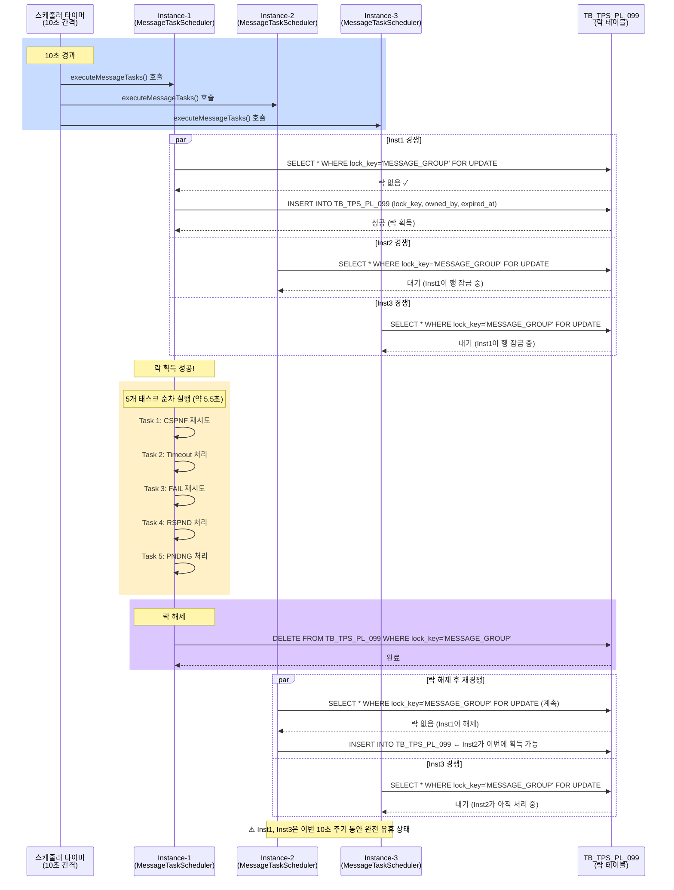
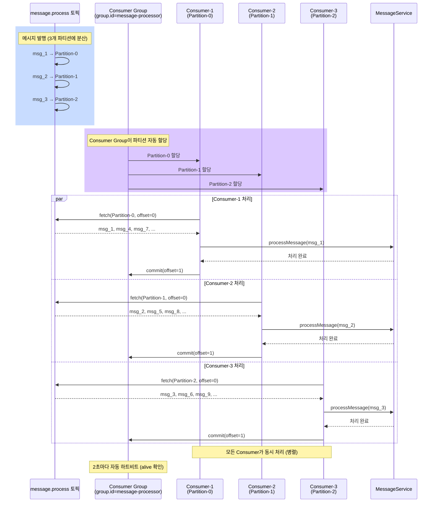
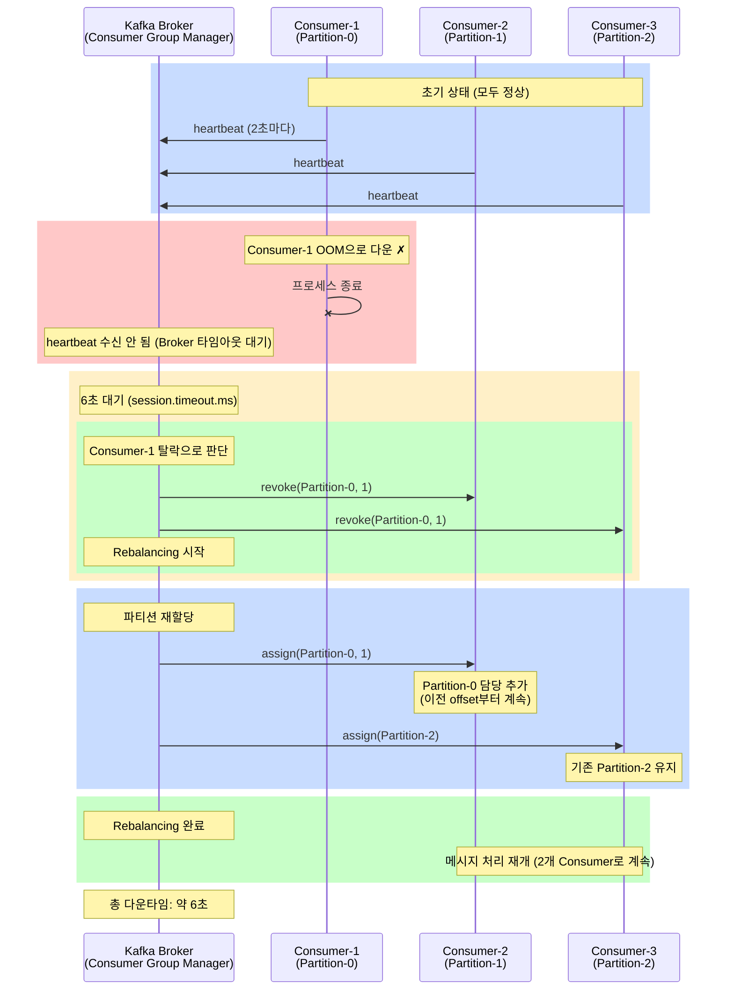

# DB 분산 락 → Consumer Group: TB_TPS_PL_099 → Kafka 자동 파티션 할당

> 한줄 요약: TPS의 DB 테이블 기반 분산 락(TB_TPS_PL_099)을 Kafka Consumer Group의 파티션 자동 할당으로 대체하여, N개 인스턴스 중 1개만 동작하는 배타적 잠금을 N개가 동시에 일하는 협력적 분배로 전환한다.

---

## 1. AS-IS: TPS에서 어떻게 동작하는가

### 1.1 아키텍처 위치

- **컴포넌트**: `ppln-logging-api`의 `MessageTaskScheduler`
- **락 메커니즘**: `TB_TPS_PL_099` 테이블 (분산 락 테이블)
- **동작**: 인스턴스 시작 시 `MESSAGE_GROUP` 락을 획득하려고 시도
- **결과**: 락을 획득한 1개 인스턴스만 5개 우선순위 태스크 실행
- **나머지**: N-1개 인스턴스는 완전 유휴 상태 (CPU/메모리 낭비만 함)

### 1.2 코드 동작 방식

#### 분산 락 테이블 구조

```sql
CREATE TABLE TB_TPS_PL_099 (
    id BIGINT PRIMARY KEY,
    lock_key VARCHAR(255) UNIQUE,          -- 'MESSAGE_GROUP'
    owned_by VARCHAR(255),                 -- 락 소유 인스턴스명 (e.g., 'instance-1')
    locked_at TIMESTAMP,                   -- 락 획득 시간
    expired_at TIMESTAMP,                  -- 락 만료 시간
    created_at TIMESTAMP DEFAULT NOW()
);
```

#### 분산 락 획득 로직

```java
@Component
public class DistributedLockService {

    @Autowired
    private JdbcTemplate jdbcTemplate;

    public boolean acquireLock(String lockKey, long timeoutSeconds) {
        String instanceId = getInstanceId();
        long now = System.currentTimeMillis();
        long expiredAt = now + (timeoutSeconds * 1000);

        try {
            // Step 1. 기존 락 확인
            String checkSql = "SELECT * FROM TB_TPS_PL_099 WHERE lock_key = ? FOR UPDATE";
            List<Map<String, Object>> existing = jdbcTemplate.queryForList(checkSql, lockKey);

            if (existing.isEmpty()) {
                // Step 2a. 락 없음 → 신규 락 생성
                String insertSql = "INSERT INTO TB_TPS_PL_099 (lock_key, owned_by, locked_at, expired_at) " +
                                   "VALUES (?, ?, ?, ?)";
                jdbcTemplate.update(insertSql, lockKey, instanceId, new Date(now), new Date(expiredAt));
                log.info("Lock acquired: {} by {}", lockKey, instanceId);
                return true;
            } else {
                Map<String, Object> lock = existing.get(0);
                Long currentExpiredAt = ((Date) lock.get("expired_at")).getTime();

                if (currentExpiredAt < now) {
                    // Step 2b. 락 만료됨 → 개인 문제 없음, 재획득
                    String updateSql = "UPDATE TB_TPS_PL_099 SET owned_by = ?, locked_at = ?, expired_at = ? " +
                                      "WHERE lock_key = ?";
                    jdbcTemplate.update(updateSql, instanceId, new Date(now), new Date(expiredAt), lockKey);
                    log.info("Lock re-acquired (previous expired): {} by {}", lockKey, instanceId);
                    return true;
                } else {
                    // Step 2c. 락 유효 → 다른 인스턴스가 소유 중
                    log.debug("Lock held by {}, expires at {}", lock.get("owned_by"), lock.get("expired_at"));
                    return false;
                }
            }
        } catch (DataIntegrityViolationException e) {
            // 경쟁 조건: 다른 인스턴스가 동시에 락 삽입
            log.debug("Lock acquisition failed (race condition)");
            return false;
        }
    }

    public void releaseLock(String lockKey) {
        String sql = "DELETE FROM TB_TPS_PL_099 WHERE lock_key = ?";
        jdbcTemplate.update(sql, lockKey);
        log.info("Lock released: {}", lockKey);
    }
}
```

#### 스케줄러에서의 사용

```java
@Component
public class MessageTaskScheduler {

    @Autowired
    private DistributedLockService lockService;

    @Scheduled(fixedDelay = 10000)  // 10초 간격
    public void executeMessageTasks() {
        // Step 1. 분산 락 획득 시도
        if (!lockService.acquireLock("MESSAGE_GROUP", 60)) {
            // 다른 인스턴스가 처리 중 → 이번 주기 스킵
            return;
        }

        try {
            // Step 2-6. 5개 태스크 순차 실행 (각 태스크는 DB SELECT + 처리)
            executeTask1_CspnfRetry();
            executeTask2_TimeoutProcess();
            executeTask3_FailRetry();
            executeTask4_RspndProcess();
            executeTask5_PendingProcess();
        } finally {
            // Step 7. 반드시 락 해제
            lockService.releaseLock("MESSAGE_GROUP");
        }
    }

    private void executeTask1_CspnfRetry() {
        // TB_TPS_MS_021 테이블에서 status='CSPNF' 레코드 조회
        // 각 메시지마다 Source에 응답 전달
        // UPDATE status='RSPND'
    }

    // executeTask2() ~ executeTask5() 생략
}
```

### 1.3 락 획득/해제 시퀀스



### 1.4 구체적 동작 예시: 3 인스턴스 배포

```
시간      | Instance-1 | Instance-2 | Instance-3 | 상태
----------|------------|------------|------------|----------
00:00:00  | 락 획득    | 대기       | 대기       | Inst-1이 처리 중
00:00:05  | 태스크 실행 중 | 대기 | 대기       |
00:00:06  | 락 해제    | -          | -          |
00:00:06.1| 대기       | 락 획득    | 대기       | Inst-2로 전환
00:00:11.1| 대기       | 태스크 실행 중 | 대기 |
00:00:11.5| 대기       | 락 해제    | -          |
00:00:11.6| 락 획득    | 대기       | 대기       | Inst-1 재획득
00:00:16.6| 태스크 실행 중 | 대기 | 대기 |
...

⚠️ 결과: 3개 인스턴스 중 매 시점마다 1개만 처리
          2개 인스턴스는 CPU 0%, 메모리는 할당되어 있음 (낭비)
```

### 1.5 락 만료 시나리오 (장애)

```
초기 상태: Instance-1이 락 획득, 만료 시간 00:00:60초

00:00:00 | Instance-1이 락 획득 (expired_at = 60초 후)
00:00:30 | Instance-1이 OOM으로 갑자기 다운 ← 락 해제 코드 실행 불가
         | Instance-2, Instance-3은 계속 대기 중
00:00:60 | 락 만료됨 → Instance-2가 락 획득 시도 가능
00:00:60.1 | Instance-2 시도: SELECT lock_key='MESSAGE_GROUP'
           → 락 만료됨 확인
           → INSERT (또는 UPDATE) 실행
           → 락 획득 성공

결과: 30초 동안 전체 메시지 처리 중단 (severe!)
     누적된 메시지만 처리 시작
```

---

## 2. Problem: 왜 바꿔야 하는가

### 2.1 구체적 문제점

| # | 문제 | 정량적 영향 | 심각도 |
|---|------|-----------|--------|
| 1 | **수평 확장 불가** | N개 인스턴스 배포해도 1개만 동작. 처리량 = 1 인스턴스 성능 한계 | ⚠️⚠️⚠️⚠️ |
| 2 | **페일오버 시간** | 락 소유 인스턴스 다운 → 60초 대기 후 다른 인스턴스 처리 재개. **전체 시스템 정지** | ⚠️⚠️⚠️⚠️ |
| 3 | **DB 의존성 심화** | 분산 락도 DB 테이블 기반. DB 장애 시 락 메커니즘 자체 불가 (순환 의존) | ⚠️⚠️⚠️ |
| 4 | **리소스 낭비** | N-1개 인스턴스가 매 10초마다 유휴. CPU/메모리 비용만 발생 | ⚠️⚠️ |
| 5 | **락 관리 복잡도** | 락 획득/해제/만료/갱신 로직을 직접 구현하고 유지보수 필요 | ⚠️ |

### 2.2 성능 수치 비교

#### 시나리오 1: 정상 부하 (시간당 1,000개 메시지)

**AS-IS (분산 락 + 스케줄러)**:

```
배포: 3개 인스턴스
메시지 처리량: 1,000개/시간

1주기(10초) 처리:
- 1개 인스턴스만 활성: 처리량 ≈ 2.8개/주기
- 나머지 2개 인스턴스: CPU 유휴, 메모리 할당만 됨
- 총 리소스 활용률: 33% (1개/3개)

메시지 추적:
- 신규 메시지: TB_TPS_MS_021에 PNDNG 상태로 저장
- 스케줄러 폴링: 10초마다 태스크 실행
- 처리 지연: 최소 10초 (다음 주기 대기)
```

**TO-BE (Consumer Group)**:

```
배포: 3개 Consumer (3개 파티션)
메시지 처리량: 1,000개/시간

병렬 처리:
- 3개 Consumer가 독립적으로 처리: 처리량 ≈ 3 × 2.8개 = 8.4개/주기
- 모든 Consumer 활성, CPU/메모리 활용
- 총 리소스 활용률: 100%

메시지 추적:
- 신규 메시지: Kafka 토픽에 발행
- Consumer 구독: 즉시 콜백 (폴링 없음)
- 처리 지연: 수 밀리초 (네트워크 지연만)
```

**결과**: 처리량 3배 향상, 리소스 활용률 3배 개선

---

#### 시나리오 2: 급격한 트래픽 증가 (1,000개 → 10,000개)

**AS-IS (분산 락)**:

```
상황: 대규모 배포 또는 이벤트 (1초 내 10,000개 메시지 인입)

처리 흐름:
00:00:00 | 메시지 10,000개 인입 → DB TB_TPS_MS_021 에 저장 (PNDNG)
00:00:10 | 스케줄러 1주기 실행
         | Instance-1 락 획득 (또는 Instance-2, 3 중 1개)
         | Task 5 (PNDNG 처리): 10,000개 순차 처리 시작
         | 10,000 × 6ms = 60초 필요 (10초 주기 초과!)

00:00:20 | 스케줄러 2주기 실행 (하지만 1주기가 아직 처리 중)
         | 락 경쟁: 1주기 태스크가 끝나지 않으면 락 점유 중
         | → 2주기 실행 불가 (락 대기)

00:01:00 | 1주기 태스크 완료
         | 처리된 메시지: ~1,500개 (10초 내 처리 가능 량)
         | 미처리 메시지: 8,500개 여전히 대기

00:01:10 | 2주기 시작: 8,500개 + 새 메시지 = 9,000개 처리 시작
...

완료 시간: 최소 60초 이상
큐 백프레셔: DB 메모리 누적, 인스턴스 메모리 부족 위험
```

**TO-BE (Consumer Group, 3개 Consumer)**:

```
상황: 동일하게 1초 내 10,000개 메시지 인입

처리 흐름:
00:00:00 | 메시지 10,000개 → Kafka 토픽 발행 (즉시)
         | 3개 Consumer가 즉시 구독 알림 받음
         | 각 Consumer가 파티션 담당: 10,000 ÷ 3 ≈ 3,333개/Consumer

00:00:00.5 | 각 Consumer 처리 시작 (병렬)
           | Consumer-1: Partition-0의 3,333개 처리
           | Consumer-2: Partition-1의 3,333개 처리
           | Consumer-3: Partition-2의 3,334개 처리
           | 각 Consumer 처리 시간: 3,333 × 6ms ≈ 20초

00:00:20 | 모든 메시지 처리 완료

결과: 20초 내 완료 (60초 vs 20초 = 3배 향상)
      Kafka는 메모리 효율적 (디스크 기반 저장)
      백프레셔 최소화
```

---

#### 시나리오 3: 인스턴스 장애

**AS-IS (분산 락 + 60초 만료)**:

```
초기: Instance-1이 락 획득 (expired_at = NOW() + 60초)

00:00:30 | Instance-1이 OOM으로 갑자기 다운
         | 락 해제 코드 실행 못 함 (JVM 프로세스 종료)
         | TB_TPS_PL_099 레코드: 여전히 Instance-1 소유

00:00:30 ~ 00:01:30 | Instance-2, 3 대기 중
                     | 메시지 처리 완전 중단 (60초 동안 0 TPS)

00:01:30 | 락 만료됨
         | Instance-2가 SELECT 실행 → lock_key 행 조회
         | expired_at < NOW() 확인 → 락 재획득 시도
         | INSERT 또는 UPDATE 성공 → 처리 재개

결과: 60초 다운타임 (severe)
      이 동안 메시지 누적
```

**TO-BE (Kafka Consumer Group)**:

```
초기: Consumer-1, 2, 3이 각각 Partition-0, 1, 2 처리 중

00:00:30 | Consumer-1이 OOM으로 갑자기 다운
         | Heartbeat 송신 실패 → Kafka 감지

00:00:36 | Kafka 감지 (session.timeout.ms = 6초)
         | Consumer Group 리밸런싱 시작
         | Partition-0 → Consumer-2 또는 Consumer-3 재할당

00:00:37 | 리밸런싱 완료
         | Consumer-2: Partition-0, 1 처리 (또는 다른 배분)
         | Consumer-3: Partition-2 처리
         | 처리 재개 (Offset으로부터 계속)

결과: 6초 다운타임 (60초 vs 6초 = 10배 향상)
      자동 리밸런싱으로 운영자 개입 불필요
```

---

### 2.3 실무 문제 시나리오

#### 시나리오 A: 자정 대규모 배포

```
상황: 자동화 배포 스크립트가 100개 파이프라인을 동시 시작

메시지 분석:
- 파이프라인당 10~20개 단계(step)
- 각 단계마다 메시지 생성
- 총 1,500개 메시지 1초 내 인입

분산 락 처리:
00:00:00 | 1,500개 메시지 DB 저장 (PNDNG)
00:00:10 | 스케줄러 주기: Instance-1이 락 획득
         | PNDNG 태스크: 1,500개 처리 시작
         | 예상 시간: 1,500 × 6ms = 9초 (주기 내 완료)

BUT 실제:
00:00:10 | 동시에 Instance-2도 DB 조회 시작
         | SELECT * FROM TB_TPS_MS_021 WHERE status='PNDNG'
         | → 전체 테이블 스캔 (1,500개 행)
         | DB Lock 경쟁, CPU 스파이크

00:00:15 | 태스크 아직 처리 중 (큐 적체)
         | 다른 태스크 대기: CSPNF, FAIL, RSPND, Timeout
         | → 응답 지연 누적

00:00:20 | PNDNG 처리 완료 (총 10초)
         | 스케줄러 2주기 도래
         | Instance-2 또는 3: 락 획득
         | 누적 메시지 처리 시작

결과: 메시지 처리 완료까지 30초 이상 소요

Kafka 처리:
00:00:00 | 1,500개 메시지 → 토픽 발행 (1초)
00:00:00.5 | 3개 Consumer 즉시 처리 시작
           | 각 Consumer: 500개 병렬 처리
           | 500 × 6ms = 3초

00:00:03.5 | 처리 완료

결과: 3.5초 내 완료 (30초 vs 3.5초 = 8배 향상)
```

---

#### 시나리오 B: Destination 응답 지연

```
상황: 특정 Destination이 느림 (네트워크 지연, 과부하)

분산 락 처리:
- 50개 메시지가 Destination-B로 Forward 대기
- 평소: 100ms/개 = 5초 (주기 내 처리)
- 오늘: 5초/개 = 250초 (10초 주기 초과!)

결과:
00:00:10 | PNDNG 태스크 시작
00:00:10.5 | Destination-B Forward 시도 (50개)
           | 응답 시간: 5초/개
           | 첫 5개 완료 시간: 25초

00:00:20 | 스케줄러 2주기 도래
         | 하지만 1주기 PNDNG 태스크가 여전히 진행 중
         | 락 점유 (다른 태스크는 대기)

00:00:35 | PNDNG 태스크 완료
         | 스케줄러 3주기에서 다른 태스크 처리

문제: Destination 지연이 전체 시스템 지연으로 전파
      다른 건강한 Destination은 처리 안 됨
```

**Kafka 처리**:

```
각 Destination마다 독립적인 Consumer/토픽 배분 (권장):
- Consumer-B (Destination-B 담당): 느린 처리 중
- Consumer-A, C, D: 독립적으로 계속 처리

결과: Consumer Lag이 Consumer-B에만 누적
      다른 Consumer는 정상 처리
      격리(isolation) 효과
```

---

## 3. TO-BE: RedPanda로 어떻게 해결하는가

### 3.1 설계 원리

#### 원리 1: 분산 락 vs Consumer Group

**분산 락 (AS-IS)**:
- 목표: N개 인스턴스 중 **정확히 1개**만 실행
- 메커니즘: DB 테이블 행 레벨 잠금 (SELECT FOR UPDATE)
- 문제: N-1개 인스턴스는 유휴 상태

**Consumer Group (TO-BE)**:
- 목표: N개 파티션을 N개 Consumer에 **자동 분배**
- 메커니즘: Kafka 프로토콜 기반 코디네이션
- 이점: 모든 Consumer가 동시에 처리

```
분산 락:
Instance-1 (Lock ✓) → 처리 중
Instance-2 (Lock ✗) → 대기
Instance-3 (Lock ✗) → 대기
→ 처리량 = 1개 인스턴스

Consumer Group:
Partition-0 → Consumer-1 → 처리 중
Partition-1 → Consumer-2 → 처리 중
Partition-2 → Consumer-3 → 처리 중
→ 처리량 = N개 Consumer (선형 확장)
```

---

#### 원리 2: Rebalancing (자동 페일오버)

**분산 락 (60초 대기)**:
```
Instance-1 (Lock 소유) → 다운
Instance-2: 60초 대기
Instance-3: 60초 대기
→ 60초 동안 처리 중단
```

**Consumer Group (6초 자동 리밸런싱)**:
```
Consumer-1 (Partition-0 담당) → 다운
Kafka 감지: 약 6초 (session.timeout.ms)
Rebalancing 시작:
  Partition-0 → Consumer-2 (또는 3) 재할당
처리 재개: Offset부터 계속 처리
→ 6초 다운타임 (60초 vs 6초 = 10배)
```

---

#### 원리 3: 자동 코디네이션

**분산 락 (수동 관리)**:
- 개발자: 락 획득/해제 로직을 직접 구현
- 운영: 락 만료, 데드락, 리소스 누수 모니터링
- 장애: 락 테이블 직접 정리 필요

**Consumer Group (자동 관리)**:
- 개발자: group.id 설정만 (프로토콜은 Kafka가 관리)
- 운영: Consumer 추가/제거만으로 자동 리밸런싱
- 장애: Kafka 자동 복구 (재시작 시 Offset부터 재개)

---

### 3.2 PoC 코드 매핑

| TPS 원본 | PoC 변경점 | 설명 |
|----------|----------|------|
| `TB_TPS_PL_099` 테이블 | 제거 | DB 분산 락 → Kafka Consumer Group 프로토콜 |
| `DistributedLockService` | 제거 | 락 획득/해제/만료 로직 모두 제거 |
| `MessageTaskScheduler.acquireLock()` | `@KafkaListener` + `group.id` | 스케줄러 락 → Kafka 자동 할당 |
| 10초 폴링 주기 | 즉시 이벤트 | `@Scheduled` → 메시지 도착 시 즉시 처리 |
| 1개 인스턴스 처리 | N개 Consumer 병렬 | 분산 락 → Consumer Group |
| 60초 페일오버 | 6초 리밸런싱 | 빠른 자동 복구 |

---

### 3.3 PoC 상세 구현

#### Kafka 토픽 및 Consumer Group 설계

```yaml
# RedPanda 토픽 설정 (3개 파티션 기준)
topics:
  - name: message.process      # 메시지 처리 토픽
    partitions: 3              # 3개 파티션 = 3개 Consumer 병렬
    replication_factor: 1
    config:
      retention.ms: 86400000   # 24시간 보관
      compression.type: snappy

# Kafka Consumer Group 설정
consumer_groups:
  - group_id: message-processor  # 동일 group.id = 같은 Consumer Group
    topics:
      - message.process
    session_timeout_ms: 6000      # 6초: 하트비트 실패 감지
    heartbeat_interval_ms: 2000   # 2초: 정기적 하트비트 송신
```

#### Spring Boot Consumer 구현

```java
@Configuration
public class KafkaConsumerConfig {

    @Bean
    public ConsumerFactory<String, Message> consumerFactory() {
        Map<String, Object> configProps = new HashMap<>();
        configProps.put(ConsumerConfig.BOOTSTRAP_SERVERS_CONFIG, "localhost:9092");
        configProps.put(ConsumerConfig.GROUP_ID_CONFIG, "message-processor");
        configProps.put(ConsumerConfig.KEY_DESERIALIZER_CLASS_CONFIG,
                        StringDeserializer.class);
        configProps.put(ConsumerConfig.VALUE_DESERIALIZER_CLASS_CONFIG,
                        JsonDeserializer.class);
        configProps.put(ConsumerConfig.AUTO_OFFSET_RESET_CONFIG, "earliest");
        configProps.put(ConsumerConfig.ENABLE_AUTO_COMMIT_CONFIG, true);
        configProps.put(ConsumerConfig.AUTO_COMMIT_INTERVAL_MS_CONFIG, 1000);

        // Consumer Group 리밸런싱 설정
        configProps.put(ConsumerConfig.SESSION_TIMEOUT_MS_CONFIG, 6000);
        configProps.put(ConsumerConfig.HEARTBEAT_INTERVAL_MS_CONFIG, 2000);

        return new DefaultConsumerFactory<>(configProps);
    }

    @Bean
    public ConcurrentKafkaListenerContainerFactory<String, Message>
            kafkaListenerContainerFactory() {
        ConcurrentKafkaListenerContainerFactory<String, Message> factory =
                new ConcurrentKafkaListenerContainerFactory<>();
        factory.setConsumerFactory(consumerFactory());
        factory.setConcurrency(1);  // 파티션당 1개 스레드
        return factory;
    }
}

@Component
public class MessageProcessor {

    @Autowired
    private MessageService messageService;

    /**
     * 토픽의 메시지를 즉시 처리
     * - Consumer Group이 자동으로 파티션 분배
     * - 각 Consumer가 담당 파티션만 처리
     * - Offset 자동 관리 (AUTO_COMMIT)
     */
    @KafkaListener(topics = "message.process", groupId = "message-processor")
    public void processMessage(Message message, @Header(KafkaHeaders.OFFSET) long offset) {
        try {
            log.info("Processing message: {} (offset: {})", message.getId(), offset);

            // Task 1: CSPNF 재시도 (우선순위 1)
            if (message.getStatus().equals("CSPNF")) {
                messageService.handleCspnfRetry(message);
                return;
            }

            // Task 2: Timeout 처리 (우선순위 2)
            if (message.getStatus().equals("TIMEOUT")) {
                messageService.handleTimeout(message);
                return;
            }

            // Task 3: FAIL 재시도 (우선순위 3)
            if (message.getStatus().equals("FAIL")) {
                messageService.handleFailRetry(message);
                return;
            }

            // Task 4: RSPND 처리 (우선순위 4)
            if (message.getStatus().equals("RSPND")) {
                messageService.handleRspnd(message);
                return;
            }

            // Task 5: PNDNG 처리 (우선순위 5)
            if (message.getStatus().equals("PNDNG")) {
                messageService.handlePending(message);
                return;
            }

        } catch (Exception e) {
            log.error("Error processing message: {}", message.getId(), e);
            // DLT(Dead Letter Topic)로 이동 (별도 처리)
        }
    }
}
```

---

#### 리밸런싱 시 자동 처리

```java
@Component
public class ConsumerGroupListener implements ConsumerAwareListenerErrorHandler {

    @Autowired
    private MessageRepository messageRepository;

    /**
     * Rebalancing 발생 시 자동 호출 (Consumer 추가/제거/다운)
     */
    @EventListener
    public void handleConsumerStarted(ConsumerStartedEvent event) {
        log.info("Consumer started: {}", event.getConsumer().groupId());
    }

    /**
     * Rebalancing 전 호출 (진행 중인 메시지 정리)
     */
    @EventListener
    public void handleConsumerStopped(ConsumerStoppedEvent event) {
        log.info("Consumer stopping: {} (rebalancing 시작)", event.getConsumer().groupId());
        // 필요 시 커밋 확인
    }

    /**
     * Rebalancing 후 호출 (새 파티션 할당 수신)
     */
    @EventListener
    public void handlePartitionsRevoked(ConsumerPartitionsRevokedEvent event) {
        log.info("Partitions revoked: {} (다른 Consumer로 이전)", event.getPartitions());
    }

    @EventListener
    public void handlePartitionsAssigned(ConsumerPartitionsAssignedEvent event) {
        log.info("Partitions assigned: {} (새로 할당됨)", event.getPartitions());
        // 새 파티션부터 처리 시작 (Offset 자동 관리)
    }
}
```

---

#### Offset 관리 및 재처리

```java
@Component
public class OffsetManager {

    /**
     * AUTO_COMMIT_CONFIG = true인 경우:
     * - 메시지 처리 완료 후 자동으로 Offset 커밋
     * - 다음 스타트 시 이전 Offset부터 시작 (중복 처리 방지)
     *
     * 수동 관리 (필요 시):
     * - AUTO_COMMIT_CONFIG = false
     * - 메시지 처리 완료 후 명시적으로 Offset 커밋
     */

    public void manualCommit(Acknowledgment acknowledgment) {
        // 메시지 처리 완료
        // ...
        // 명시적 커밋
        if (acknowledgment != null) {
            acknowledgment.acknowledge();
        }
    }
}
```

---

### 3.4 시퀀스 다이어그램: 정상 동작



---

### 3.5 시퀀스 다이어그램: Consumer 다운 시 리밸런싱



---

## 4. AS-IS vs TO-BE 비교표

| 항목 | AS-IS (분산 락) | TO-BE (Consumer Group) |
|------|-----------------|------------------------|
| **동시 처리 인스턴스** | 1개 (N개 중 1개만 락 획득) | N개 (모든 Consumer 활성) |
| **처리 확장성** | 수직 확장 (1개 인스턴스 성능) | 수평 확장 (N배 선형) |
| **페일오버 시간** | 60초 (락 만료 대기) | 6초 (자동 리밸런싱) |
| **지연 시간** | 10초 (폴링 주기) | 수 ms (즉시 이벤트) |
| **리소스 활용률** | 33% (1개/3개 인스턴스) | 100% (모든 Consumer) |
| **구현 복잡도** | 높음 (락 관리 코드) | 낮음 (Kafka 프로토콜) |
| **DB 의존성** | 높음 (락 테이블 필요) | 없음 (Kafka 독립) |
| **자동 복구** | 없음 (수동 개입) | 자동 리밸런싱 |
| **메시지 유실** | 가능 (미처리 메시지 누적) | Kafka offset으로 재처리 |
| **운영 난이도** | 높음 (락 모니터링) | 낮음 (자동 관리) |

---

## 5. 현직 사례 및 Industry Best Practices

### 5.1 LinkedIn: Kafka Consumer Group 진화

**Eager Rebalancing (Kafka 초기)**:
```
문제:
- Rebalancing 중에는 모든 Consumer가 메시지 처리 정지 (Stop-the-world)
- 대규모 Consumer Group: 리밸런싱 시간이 1~2분 소요 (가용성 저하)

동작:
1. Revoke: 모든 파티션 해제 (모든 Consumer 멈춤)
2. Assign: 새로운 파티션 할당
3. Resume: 처리 재개

예: Consumer 추가 시
00:00:00 | 기존 5개 Consumer 처리 중
00:00:30 | Consumer-6 추가
00:00:31 | Revoke: Consumer-1~6 모두 정지
00:00:45 | Assign: 파티션 재할당
00:00:46 | Resume: 처리 재개
→ 15초 다운타임
```

**Cooperative Rebalancing (KIP-429, Kafka 2.4+)**:
```
개선:
- 필요한 파티션만 이동 (Incremental rebalancing)
- 안정적인 파티션은 할당 유지
- 무중단 리밸런싱 (처리 계속)

동작:
1. Revoke: 변경 필요한 파티션만 해제
2. Assign: 새로운 파티션만 할당
3. Resume: 변경 사항 적용

예: Consumer 추가 시
00:00:00 | Consumer-1~5: Partition-0~4 처리 중
00:00:30 | Consumer-6 추가
00:00:31 | Revoke: Partition-3, 4만 해제 (Consumer-5 영향만)
00:00:32 | Assign: Consumer-5, 6이 Partition-3, 4 분배
00:00:33 | Resume: 처리 계속 (중단 없음)
→ 다운타임 0초 (메시지 처리 무중단)
```

---

### 5.2 Uber: Static Group Membership (KIP-345)

**동작 원리**:
```
기존 문제:
- Consumer 재시작 시마다 리밸런싱 발생
- 마이크로서비스 배포: Consumer 재시작 → 리밸런싱 → 처리 지연

Static Membership 해결법:
- group.instance.id 설정 (e.g., "consumer-1", "consumer-2")
- Consumer 재시작 시 동일 instance.id면 리밸런싱 스킵
- 기존 파티션 할당 유지

설정:
configs:
  group.id: message-processor
  group.instance.id: consumer-1    # ← 추가
```

**효과**:
```
배포 전: Consumer-1 (Partition-0 담당)
배포 중: Consumer-1 종료 → 재시작
배포 후: Consumer-1 (동일 instance.id)
결과: 리밸런싱 스킵, Partition-0 재할당 불필요

메리트: 대규모 배포 시 전체 시스템 안정성 향상
```

---

## 6. 면접 예상 질문 및 답변

### Q1: 분산 락과 Consumer Group의 근본적 차이는?

**A1. 철학적 차이**:

```
분산 락:
- 철학: "오직 하나만" (Mutual Exclusion)
- 목표: N개 중 정확히 1개만 실행
- 사용 사례: 금융 거래 (중복 처리 방지), 재고 관리
- 비용: N-1개 인스턴스 유휴

Consumer Group:
- 철학: "나눔" (Work Distribution)
- 목표: N개 파티션을 N개 Consumer에 공평 분배
- 사용 사례: 처리량 확장, 병렬 처리
- 이점: 모든 Consumer 활성

메타포:
분산 락: "한 번에 한 명씩만 화장실 사용 (임계 영역)"
Consumer Group: "여러 카운터에서 동시에 손님 처리 (로드 밸런싱)"
```

**B1. 구현 차이**:

```
분산 락 (SELECT FOR UPDATE 기반):
1. 락 테이블에서 행 조회 (SELECT FOR UPDATE)
2. 행이 없으면 INSERT (또는 UPDATE if exists)
3. 다른 트랜잭션은 해당 행 대기
4. 트랜잭션 커밋 시 락 해제

Consumer Group (프로토콜 기반):
1. Consumer가 Broker에 Join 요청
2. Group Coordinator가 파티션 할당 계산
3. Rebalancing 프로토콜 실행 (Revoke → Assign)
4. Consumer가 담당 파티션 fetch 시작
```

---

### Q2: Consumer Group의 리밸런싱은 어떻게 동작하나요?

**A2. 5단계 리밸런싱 프로토콜**:

```
Stage 1: 멤버십 갱신 (JoinGroup)
- Consumer: "나 group.id='message-processor'에 참여" 신청
- Broker: 모든 Consumer의 참여 신청 수집
- 완료: 모든 Consumer 참여 여부 확인

Stage 2: 리더 선출 (여기서는 GroupCoordinator가 담당)
- Broker: Consumer 중 하나를 리더로 선정 (보통 첫 요청자)
- 리더: 파티션 할당 전략 계산
  - RoundRobin: Partition-0 → Consumer-0, Partition-1 → Consumer-1, ...
  - Range: Consumer별로 범위 할당 (예: 0-1 → Consumer-0, 2-3 → Consumer-1)
  - Sticky: 기존 할당 최대한 유지 (Cooperative)

Stage 3: 할당 정보 전달 (SyncGroup)
- Broker: 리더의 할당 전략을 모든 Consumer에 전달
- Consumer: 자신의 파티션 목록 수신

Stage 4: 파티션 해제 (Revoke)
- Consumer: 이전 파티션 헌드러에서 onPartitionsRevoked() 호출
- 동작: Offset 커밋, 리소스 정리 등

Stage 5: 파티션 처리 시작 (Assign & Resume)
- Consumer: 새로운 파티션 헨드러에서 onPartitionsAssigned() 호출
- 동작: 이전 offset부터 fetch 시작

총 소요 시간: 일반적으로 수 초 (session.timeout.ms 5~30초)
```

**B2. 시간축 예시 (3 Consumer, 2 down)**:

```
시간      | 상태
----------|------------------------------------------
00:00:00  | Consumer-1, 2, 3 정상
          | Partition-0, 1, 2 각각 할당됨
00:00:30  | Consumer-2, 3 동시에 다운
00:00:31  | Broker 감지: heartbeat 수신 못 함
00:00:36  | 6초 timeout → 리밸런싱 시작
00:00:37  | Rebalancing 진행:
          | - Revoke: Consumer-1이 Partition-1, 2 해제
          | - Assign: Consumer-1이 모든 파티션(0, 1, 2) 담당
00:00:38  | Rebalancing 완료
          | - Consumer-1: 모든 파티션 처리 재개
00:00:39  | 이전 offset(약 100)부터 계속 처리

결과: 9초 다운타임 (30초 → 9초)
     Consumer-2, 3이 복구되면 다시 리밸런싱해서 분배
```

---

### Q3: 파티션 수와 Consumer 수의 관계는?

**A3. 최적 배치**:

```
규칙 1: Consumer 수 <= Partition 수
이유: 각 파티션은 하나의 Consumer에만 할당 가능

예시:
Partition 수 = 3, Consumer 수 = 3
→ 각 Consumer가 1개 파티션 담당 (최적)

Partition 수 = 3, Consumer 수 = 5
→ 2개 Consumer가 유휴 상태 (낭비)
   Consumer-1: Partition-0
   Consumer-2: Partition-1
   Consumer-3: Partition-2
   Consumer-4: (대기)
   Consumer-5: (대기)

규칙 2: Partition 수 > Consumer 수인 경우
각 Consumer가 여러 파티션 담당

예시:
Partition 수 = 6, Consumer 수 = 2
→ Consumer-1: Partition-0, 1, 2 (3개)
→ Consumer-2: Partition-3, 4, 5 (3개)
```

**B3. 처리량 계산**:

```
메시지 처리량 = Partition 수 × (각 파티션 처리량)

조건:
- Partition당 메시지 크기: 1KB
- 각 Consumer의 처리 속도: 10메시지/초
- 토픽 보관 기간: 24시간

계산:
Case 1: Partition 2개, Consumer 2개
처리량 = 2 × 10 = 20메시지/초 = 1,728,000메시지/일

Case 2: Partition 6개, Consumer 6개 (3배 확장)
처리량 = 6 × 10 = 60메시지/초 = 5,184,000메시지/일 (3배)

결론: 파티션/Consumer를 N배 증가 → 처리량 N배 증가 (선형 확장)
```

---

### Q4: Cooperative Rebalancing의 이점은?

**A4. Eager vs Cooperative 비교**:

```
Eager Rebalancing (기존):
단계:
1. Revoke: 모든 파티션 해제
2. 모든 Consumer 정지 ← 여기서 다운타임 발생
3. Assign: 새 파티션 할당
4. Resume: 처리 재개

시간축 (Consumer 추가):
00:00:00-29 | Consumer-1~5 처리 중
00:00:30 | Consumer-6 추가
00:00:31 | Revoke start: Consumer-1~5 모두 정지
00:00:35 | Assign complete: 새 파티션 할당
00:00:36 | Resume: 처리 재개
다운타임: 5초 (모든 Consumer 정지)

Cooperative Rebalancing (개선):
단계:
1. Revoke: 변경 필요한 파티션만 해제
2. 변경 불필요한 Consumer는 계속 처리 ← 다운타임 최소화
3. Assign: 변경된 파티션만 할당
4. Resume: 처리 재개

시간축 (Consumer 추가, 동일 조건):
00:00:00-29 | Consumer-1~5 처리 중
00:00:30 | Consumer-6 추가
00:00:31 | Phase 1: Revoke
           | Consumer-5만 Partition-4, 5 해제 (다른 Consumer는 계속)
           | Consumer-1~4: 기존 파티션 처리 계속
00:00:32 | Phase 2: Assign
           | Consumer-5: Partition-4 유지, Partition-5 해제
           | Consumer-6: Partition-5 새로 할당
00:00:33 | 모든 Consumer 처리 중 (무중단)
다운타임: 0초 (증분 리밸런싱)
```

**B4. 이점 정리**:

```
1. 가용성 향상
   - Eager: 전체 시스템 지연 누적
   - Cooperative: 영향받은 파티션만 처리 지연

2. 배포 안정성
   - Eager: 배포 중 메시지 처리 중단
   - Cooperative: 배포 중에도 처리 계속

3. 큰 규모 시스템에서 효과
   - Consumer 100개: Eager 리밸런싱 1분 → Cooperative 10초
   - 금융/실시간 시스템에서 critical

4. 구현
   - partition.assignment.strategy = "cooperative-sticky"
```

---

### Q5: Consumer Lag과 처리 성능은 어떻게 관리하나요?

**A5. 모니터링 및 튜닝**:

```
Consumer Lag 정의:
Lag = 토픽의 최신 offset - Consumer가 처리한 offset

예:
토픽 최신 offset: 10,000
Consumer 커밋 offset: 9,900
Lag = 100 (100개 메시지 대기 중)

모니터링:
1. JMX 메트릭
   kafka.consumer:type=consumer-fetch-manager-metrics,client-id=*
   → records-lag-max: 최대 lag
   → records-lag: 현재 lag

2. Prometheus 내보내기
   kafka_consumer_lag_sum{topic="message.process", partition="0"}

3. 대시보드
   Grafana: 파티션별 Lag 시각화
           → Lag 증가 추세 = 처리 속도 < 메시지 도착 속도

성능 튜닝:
Case 1: Lag 증가 (Consumer 느림)
→ fetch.min.bytes 감소 (더 자주 fetch)
→ fetch.max.wait.ms 감소 (대기 시간 줄임)
→ 또는 Consumer 수 증가

Case 2: CPU 높음 (Consumer 과부하)
→ max.poll.records 감소 (한 번에 처리할 메시지 수 줄임)
→ 처리 로직 최적화

Case 3: 메모리 높음 (버퍼 누적)
→ fetch.max.bytes 감소
→ message 크기 최적화 (압축)
```

---

## 7. PoC 실습 체크리스트

### 7.1 구현 단계

- [ ] 1단계: RedPanda 설치 및 토픽 생성
  ```bash
  # 토픽 생성
  rpk topic create message.process --partitions 3 --replicas 1
  ```

- [ ] 2단계: Spring Boot Consumer 구현
  - `KafkaConsumerConfig` 설정
  - `@KafkaListener` 메서드 작성
  - Offset 자동 관리 설정 (AUTO_COMMIT)

- [ ] 3단계: 메시지 발행 테스트
  ```bash
  # 메시지 발행
  echo '{"id":"msg_1", "status":"PNDNG"}' | \
    rpk topic produce message.process
  ```

- [ ] 4단계: Consumer 리밸런싱 테스트
  - Consumer-1, 2 시작 → 파티션 할당 확인
  - Consumer-1 강제 종료 → 리밸런싱 감지 (6초)
  - Consumer-1 재시작 → 복구 확인

- [ ] 5단계: 성능 비교
  - 10,000개 메시지 발행
  - 처리 완료 시간 측정
  - Lag 모니터링

### 7.2 검증 기준

| 항목 | 목표 | 합격 기준 |
|------|------|---------|
| **파티션 분배** | Consumer 수만큼 자동 할당 | 3 Consumer = 3 파티션 담당 |
| **병렬 처리** | 모든 Consumer 동시 처리 | Consumer Lag 균등 분배 |
| **리밸런싱 시간** | 6초 이내 복구 | Consumer down → 6초 내 처리 재개 |
| **메시지 유실** | 0개 | Offset 기반 재처리 성공 |
| **처리 지연** | 초당 1,000개 처리 | 10,000개 메시지 = 10초 내 완료 |

---

## 8. 관련 문서

- [01. 스케줄러 → 이벤트 드리븐](./01-scheduler-to-event-driven.md)
  - 10초 폴링 → 즉시 이벤트 로직

- [03. REST 폴링 수신 → Kafka Consumer](./03-rest-polling-to-kafka-consumer.md)
  - 메시지 인입 방식 변경

- [13. 성능 기대치](../cross-cutting/13-performance-expectations.md)
  - 처리량, 지연, 리소스 수치

---

## 참고자료

### 공식 문서

- [Apache Kafka Consumer Group Coordination](https://kafka.apache.org/documentation/#consumerconfigs)
- [Kafka Rebalancing Protocol (KIP-429)](https://cwiki.apache.org/confluence/display/KAFKA/KIP-429%3A+Kafka+Consumer+Partition+Assignment+Strategy)
- [Spring Boot KafkaListener](https://spring.io/projects/spring-kafka)

### 추천 학습 경로

1. **입문**: Kafka Consumer Group 기본 개념 (1시간)
2. **심화**: Rebalancing 프로토콜 (2시간)
3. **실습**: RedPanda PoC 구현 (3시간)
4. **튜닝**: 성능 최적화 (2시간)

**총 예상 학습 시간**: 8시간
