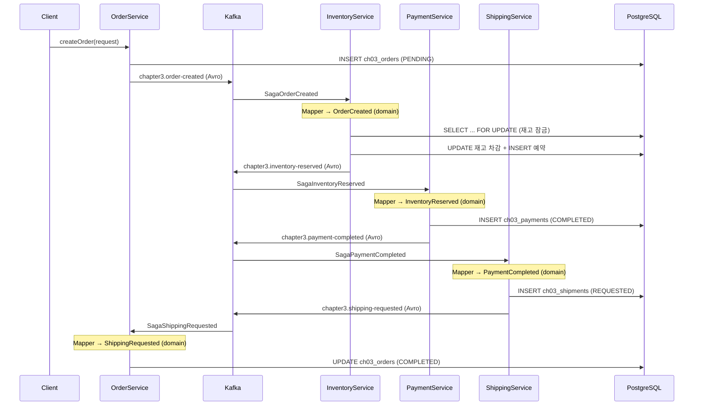
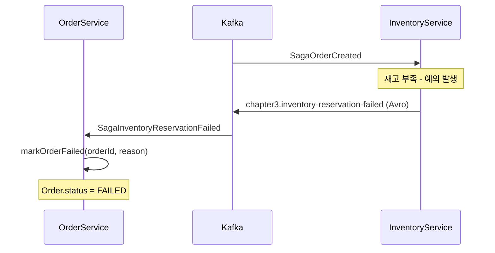
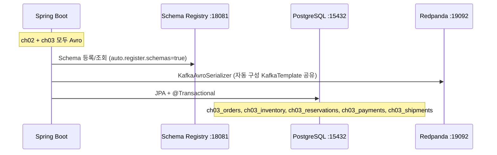

# #2: 정상 플로우 구현

Order→Inventory→Payment→Shipping 이벤트 체인, Choreography 패턴으로 서비스 간 자율 협업

---

## 구현 요약

| 항목 | 내용 |
|------|------|
| 실습 번호 | #2 (정상 플로우 구현) |
| 주요 파일 | avro 9개 + config 2개 + domain 9개 + repository 5개 + service 4개 + mapper 1개 + dto 1개 + initializer 1개 (총 32파일) |
| 테스트 파일 | `AbstractSagaTest.java` + `SagaNormalFlowTest.java` (로컬 인프라 기반) |
| LEARN.md 위치 | line 39~62 (시퀀스 다이어그램), line 348~767 (서비스 코드) |

### 파일 목록

| 계층 | 파일 | 역할 |
|------|------|------|
| avro | `SagaOrderCreated.avsc` 외 8개 | ch03 SAGA 이벤트 Avro 스키마 (namespace: `com.study.redpanda.avro.saga`) |
| config | `SagaKafkaConfig.java` | ch03 전용 Listener Factory (RECORD ack, Avro ConsumerFactory 재사용) |
| config | `SagaTopicConfig.java` | 9개 NewTopic 빈 (chapter3.* 네이밍) |
| domain | `Order.java`, `OrderStatus.java` | 주문 + 상태 (PENDING→COMPLETED/FAILED) |
| domain | `Inventory.java` | 재고 (@Lock PESSIMISTIC_WRITE) |
| domain | `Reservation.java`, `ReservationStatus.java` | 예약 기록 + 상태 |
| domain | `Payment.java`, `PaymentStatus.java` | 결제 기록 + 상태 |
| domain | `Shipping.java`, `ShippingStatus.java` | 배송 기록 + 상태 |
| event | `OrderSagaEvent.java` + 9개 record | sealed interface + record (도메인 이벤트) |
| mapper | `SagaEventMapper.java` | Avro ↔ Domain 변환 (static 메서드) |
| dto | `CreateOrderRequest.java` | 주문 생성 요청 (record) |
| repository | `OrderRepository.java` 외 4개 | JpaRepository 기반 (PostgreSQL) |
| service | `OrderService.java` | SAGA 시작(createOrder) + 최종 상태 관리 |
| service | `InventoryService.java` | 재고 예약 → InventoryReserved/Failed |
| service | `PaymentService.java` | 결제 처리 → PaymentCompleted/Failed |
| service | `ShippingService.java` | 배송 요청 → ShippingRequested/Failed |
| init | `SagaDataInitializer.java` | 초기 재고 데이터 3개 상품 |

## 왜 이렇게 구현했는가

### Avro + Domain 분리 (Transport vs Business Logic)

ch02와 ch03 모두 Avro + Schema Registry를 사용한다. 하지만 ch03는 도메인 내부에서 sealed interface + record를 활용하여 타입 안전한 비즈니스 로직을 유지한다.

```
서비스 → Domain record → [Mapper] → Avro SpecificRecord → KafkaAvroSerializer → Kafka
Kafka → KafkaAvroDeserializer → Avro SpecificRecord → [Mapper] → Domain record → 서비스
```

| 계층 | 기술 | 역할 |
|------|------|------|
| **Transport** (Kafka) | Avro `.avsc` → 생성 클래스 | 직렬화/역직렬화, Schema Registry 호환성 검증 |
| **Domain** (서비스 내부) | sealed interface + record | 타입 안전한 패턴 매칭, 비즈니스 로직 |
| **Mapping** | `SagaEventMapper` | Avro ↔ Domain 변환 (Instant↔String, BigDecimal↔String) |

**이 구조의 장점**:
1. **ch02와 동일한 KafkaTemplate 공유** — `@Qualifier` 격리 불필요, SagaKafkaConfig에서 ProducerFactory/ConsumerFactory/KafkaTemplate 3개 빈 삭제
2. **Schema Registry 활용** — 이벤트 스키마 진화, 호환성 검증
3. **도메인 타입 안전성 유지** — `sealed interface`로 컴파일 타임 exhaustiveness 체크
4. **관심사 분리** — Kafka 직렬화 형식이 도메인 로직에 영향 안 줌

**비용**: `.avsc` 파일 9개 + Mapper 클래스 (Avro↔Domain 필드 매핑)

#### 실제 사례: Avro-Domain 분리 패턴

이 패턴은 Hexagonal Architecture(Ports & Adapters)에서 표준적으로 사용된다.

**사례 1: DZone - Ports & Adapters with Kafka + Avro + Spring Boot**
도메인 객체 `Person.java`를 Kafka로 보낼 때 Avro 객체 `PersonDto.java`로 변환하고, 소비 시 다시 도메인 객체로 변환한다. Kafka Producer Adapter가 이 변환을 담당한다. 핵심 원칙: "도메인은 기술에 무관(technology agnostic)해야 한다."
([출처](https://dzone.com/articles/ports-and-adapters-architecture-with-kafka-avro-and-spring-boot))

**사례 2: Confluent - Microservices + Kafka + DDD**
DDD의 Bounded Context별로 별도 도메인 모델을 유지하면서, Avro 스키마는 Context 간 공유 계약(shared contract)으로 사용한다. "Avro schemas encapsulate the boundary between contexts, describing how field A in a message maps to field B in the domain model."
([출처](https://www.confluent.io/blog/microservices-apache-kafka-domain-driven-design/))

**사례 3: E-commerce 마이그레이션 (DZone, 2025)**
토픽 네이밍: `{도메인}.{이벤트명}.{버전}` (예: `Orders.OrderCreated.v1`). 스키마 변경 시 v2를 새로 릴리스하고 v1은 하위 호환성을 위해 유지한다.
([출처](https://dzone.com/articles/kafka-event-driven-ecommerce-migration))

#### 네이밍 분리 컨벤션

| 패턴 | Avro 클래스 | Domain 클래스 | 사용처 |
|------|------------|--------------|--------|
| **Dto 접미사** | `PersonDto` | `Person` | DZone Hexagonal 예제 |
| **Avro 접미사** | `OrderCreatedAvro` | `OrderCreated` | Confluent 예제 |
| **네임스페이스 분리** | `com.company.avro.OrderCreated` | `com.company.domain.OrderCreated` | DDD 프로젝트 |

우리 프로젝트: 네임스페이스 분리(`com.study.redpanda.avro.saga` vs `com.study.redpanda.ch03.event`) + `Saga` 접두사로 클래스명도 구분한다. Avro 스키마는 `src/main/avro/ch03/`에 ch02와 디렉토리 분리되어 있다.

#### 진화 과정: JSON → Avro

처음에는 ch03를 JSON 직렬화(JsonSerializer/JsonDeserializer)로 구현했다. 이 경우:

```
이전 (JSON): SagaKafkaConfig 4개 빈 (@Qualifier 격리), JavaTimeModule 수동 등록 필요
현재 (Avro): SagaKafkaConfig 1개 빈 (Listener Factory만), 자동 구성 KafkaTemplate 재사용
```

JSON에서 Avro로 전환하면서 **SagaKafkaConfig가 4개 빈 → 1개 빈으로 단순화**되었다. 더 이상 ProducerFactory, ConsumerFactory, KafkaTemplate을 별도 등록할 필요가 없다.

#### SagaKafkaConfig.java — Listener Factory만 유지

```java
@Bean("ch03KafkaListenerContainerFactory")
public ConcurrentKafkaListenerContainerFactory<String, Object> ch03KafkaListenerContainerFactory(
        ConsumerFactory<String, Object> consumerFactory) {  // 자동 구성된 Avro ConsumerFactory 주입
    factory.setConsumerFactory(consumerFactory);
    factory.getContainerProperties().setAckMode(ContainerProperties.AckMode.RECORD);
    return factory;
}
```

ch02는 MANUAL ack (`application.yml` 기본값)을 사용하고, ch03는 RECORD ack를 사용한다. RECORD ack는 리스너 메서드가 정상 반환하면 자동 커밋하고, 예외 발생 시 미커밋하여 재전달한다. `@Transactional` + RECORD ack 조합으로 "트랜잭션 커밋 후 ack"가 보장된다.

#### SagaTopicConfig.java — 9개 토픽 선언

| 구분 | 토픽명 | 발행 서비스 |
|------|--------|------------|
| 성공 | `chapter3.order-created` | OrderService |
| 성공 | `chapter3.inventory-reserved` | InventoryService |
| 성공 | `chapter3.payment-completed` | PaymentService |
| 성공 | `chapter3.shipping-requested` | ShippingService |
| 실패 | `chapter3.inventory-reservation-failed` | InventoryService |
| 실패 | `chapter3.payment-failed` | PaymentService |
| 실패 | `chapter3.shipping-failed` | ShippingService |
| 보상 | `chapter3.inventory-released` | InventoryService (#3) |
| 보상 | `chapter3.payment-refunded` | PaymentService (#3) |

`NewTopic` 빈을 선언하면 Spring Boot의 `KafkaAdmin`이 시작 시 자동으로 토픽을 생성한다. `chapter3.*` 접두사로 ch02의 `chapter2.*` 토픽과 네임스페이스를 분리한다. 파티션 3개는 `spring.kafka.listener.concurrency: 3`과 맞춰 Consumer 스레드가 파티션별로 병렬 처리하도록 했다.

#### SagaEventMapper.java — Avro ↔ Domain 변환

9개 이벤트 타입 각각에 `toAvro()`/`toDomain()` 정적 메서드를 제공한다.

```java
// 서비스에서 사용 (Producer)
OrderCreated domainEvent = new OrderCreated(...);
kafkaTemplate.send("chapter3.order-created", SagaEventMapper.toAvro(domainEvent));

// 서비스에서 사용 (Consumer)
public void onOrderCreated(SagaOrderCreated avroEvent) {
    OrderCreated event = SagaEventMapper.toDomain(avroEvent);
    // ... 비즈니스 로직
}
```

타입 변환 규칙:
- `Instant` ↔ `String`: `Instant.toString()` / `Instant.parse(str)` (ISO-8601)
- `BigDecimal` ↔ `String`: `toPlainString()` / `new BigDecimal(str)`

Avro 스키마에서 `Instant`과 `BigDecimal`을 `string` 타입으로 정의한 이유: Avro의 `timestamp-millis` 논리 타입이나 `decimal` 논리 타입보다 단순하고 가독성이 높다. SAGA 학습에서 Avro 논리 타입 복잡성은 핵심이 아니므로 string으로 통일했다.

#### Avro로 전환 시 onSagaFailed 분리

JSON 방식에서는 `sealed interface OrderSagaEvent`를 활용하여 3개 실패 토픽을 하나의 리스너로 처리했다:

```java
// 이전 (JSON): sealed interface로 다형성 활용
@KafkaListener(topics = {"chapter3.inventory-reservation-failed",
                         "chapter3.payment-failed",
                         "chapter3.shipping-failed"})
public void onSagaFailed(OrderSagaEvent event) {
    String reason = getFailureReason(event);  // instanceof 체인
}
```

Avro 전환 후 각 토픽의 Avro 타입이 다르므로 **3개 리스너로 분리**:

```java
// 현재 (Avro): 토픽별 개별 리스너
@KafkaListener(topics = "chapter3.inventory-reservation-failed")
public void onInventoryReservationFailed(SagaInventoryReservationFailed avroEvent) { ... }

@KafkaListener(topics = "chapter3.payment-failed")
public void onPaymentFailed(SagaPaymentFailed avroEvent) { ... }

@KafkaListener(topics = "chapter3.shipping-failed")
public void onShippingFailed(SagaShippingFailed avroEvent) { ... }
```

공통 로직은 `private markOrderFailed(orderId, reason)` 메서드로 추출했다.

### PostgreSQL + JPA 실제 DB 사용

초기에는 `ConcurrentHashMap` 인메모리 저장소로 시작했으나, `@Transactional`이 실제로 동작하는지 검증하기 위해 PostgreSQL + JPA로 전환했다.

- docker-compose에 PostgreSQL 16 추가 (port 15432)
- `spring-boot-starter-data-jpa` + `postgresql` 의존성 추가
- 도메인 클래스 → JPA `@Entity` 전환 (ch03_orders, ch03_inventory 등 테이블)
- `ConcurrentHashMap` Repository → `JpaRepository` 인터페이스 전환
- `InventoryRepository.findByProductIdWithLock()` — `@Lock(PESSIMISTIC_WRITE)` 비관적 잠금
- `Inventory.reserve()`에서 `synchronized` 제거 (DB 레벨 잠금으로 대체)
- `SagaDataInitializer` — `@PostConstruct` → `CommandLineRunner` + `@Transactional` (트랜잭션 매니저 초기화 이후 실행)

### 정상 플로우 + 실패 감지, 보상은 미포함

각 서비스의 try-catch에서 실패 이벤트(InventoryReservationFailed, PaymentFailed, ShippingFailed)를 발행한다. 이것은 **실패 감지**(forward failure detection)로, 정상 플로우의 일부다. **보상 리스너**(onPaymentFailed→재고복구, onShippingFailed→환불)는 #3에서 구현한다.

```
#2 범위: 정상 체인 + 실패 감지 (try-catch → failure event)
#3 범위: 보상 리스너 (failure event → 역순 복구)
```

### 이벤트 체인 흐름

#### 정상 플로우 (SAGA 성공)



각 서비스는 `@Transactional` 안에서 DB 업데이트 + Kafka 이벤트 발행을 수행한다. DB 트랜잭션이 실패하면 롤백되지만, 이미 발행된 Kafka 메시지는 롤백되지 않는다 (이 문제는 #4 Kafka 트랜잭션에서 해결).

#### 실패 감지 (SAGA 실패)



실패 이벤트는 발행되지만, 아직 **보상**(역순 복구)은 구현되지 않았다. 보상 리스너는 #3에서 추가한다.

#### 인프라 구성



### 테스트: 로컬 인프라 사용 (not Testcontainers)

처음에는 Testcontainers(Redpanda + PostgreSQL)로 테스트를 구성했으나, `@SpringBootTest`가 전체 앱(ch02 + ch03)을 로드하면서 ch02의 `BatchKafkaConfig`가 Avro `ConsumerFactory` 빈을 찾지 못하는 문제가 발생했다.

**원인**: Testcontainers의 `@DynamicPropertySource`가 `schema.registry.url`만 설정하고 `value-serializer`/`value-deserializer`는 설정하지 않아, Spring Boot의 Avro 자동 구성이 불완전했다.

**해결**: `@ActiveProfiles("local")`로 변경하여 `application.yml`의 local 프로파일(Avro 직렬화 설정 포함)을 그대로 사용한다. docker-compose의 로컬 인프라(Redpanda:19092 + PostgreSQL:15432)가 실행 중이어야 한다.

```
Testcontainers 방식 (폐기)           로컬 인프라 방식 (채택)
────────────────────────            ────────────────────────
@DynamicPropertySource              @ActiveProfiles("local")
Redpanda 컨테이너 자동 생성            docker-compose up -d 필요
PostgreSQL 컨테이너 자동 생성          docker-compose up -d 필요
ch02 Avro 빈 로딩 실패 ❌             application.yml 설정 전체 적용 ✅
테스트 시작 느림 (컨테이너 기동)         테스트 시작 빠름
```

## 교차 검증 결과

### Claude 리뷰

- LEARN.md의 4개 서비스 구조(line 348~767)와 1:1 매칭 확인
- 정상 플로우 시퀀스(line 39~62)와 이벤트 체인 순서 일치
- ch02 토픽 네이밍 패턴(`chapter2.*`)을 `chapter3.*`로 일관되게 적용
- Avro 스키마 9개 + SagaEventMapper 매핑 일관성 확인
- `@Qualifier` 제거 후 자동 구성 KafkaTemplate 정상 주입 확인
- 컴파일 성공 확인 (`./gradlew compileJava compileTestJava` BUILD SUCCESSFUL)

### LEARN.md와의 차이점

| 항목 | LEARN.md | 구현 | 이유 |
|------|----------|------|------|
| 직렬화 | JSON (sealed interface 직접 전송) | Avro + Mapper | Schema Registry 활용, ch02와 통일 |
| 저장소 | JPA Repository + @Transactional | PostgreSQL + JPA (동일) | 실제 트랜잭션 동작 검증 |
| 결제 처리 | PaymentGateway 외부 서비스 | 인메모리 시뮬레이션 (항상 성공) | 외부 의존성 제거 |
| 배송 처리 | ShippingProvider 외부 서비스 | 인메모리 시뮬레이션 (항상 성공) | 외부 의존성 제거 |
| 토픽명 | `order-created` (접두사 없음) | `chapter3.order-created` | ch02와 충돌 방지 |
| 실패 리스너 | 단일 리스너 + instanceof | 토픽별 3개 리스너 + markOrderFailed() | Avro 타입별 분리 필요 |
| 보상 리스너 | 같은 서비스 파일에 포함 | 미포함 (#3에서 추가) | 개념 단위 분리 |

## 핵심 학습 포인트

- **Choreography 패턴은 중앙 조정자 없이 서비스가 이벤트로 협업한다.** 각 서비스는 자신이 관심 있는 이벤트만 구독하고, 처리 결과를 새 이벤트로 발행한다. 서비스 간 직접 호출이 없으므로 느슨한 결합이 유지된다.
- **Avro(Transport)와 Domain record(Business Logic)는 분리할 수 있다.** Avro 생성 클래스는 Kafka 직렬화용, sealed interface + record는 비즈니스 로직용으로 역할을 나눈다. Mapper가 두 계층을 연결한다.
- **Avro로 통일하면 @Qualifier 격리가 불필요해진다.** JSON 방식에서는 ch02(Avro)와 ch03(JSON)의 직렬화 충돌로 4개 빈을 별도 등록해야 했지만, ch03도 Avro를 사용하면 자동 구성 KafkaTemplate을 공유한다. Config가 4개 빈 → 1개 빈(Listener Factory만)으로 단순화된다.
- **Avro에서는 다형성 리스너가 불가능하다.** JSON의 sealed interface + type header로 하나의 리스너에서 여러 이벤트를 수신할 수 있지만, Avro는 각 토픽이 고유한 SpecificRecord 타입을 가지므로 토픽별 리스너를 분리해야 한다.
- **RECORD ack + @Transactional 조합은 at-least-once를 보장한다.** 리스너 메서드가 정상 반환하면 자동 ack, 예외 시 미ack → 재전달. @Transactional과 결합하면 트랜잭션 커밋 후 ack가 보장된다.
- **인메모리 저장소에서는 @Transactional이 무의미하다.** `ConcurrentHashMap`은 Spring 트랜잭션 매니저와 연동되지 않으므로, 롤백이 동작하지 않는다. 실제 트랜잭션 동작을 검증하려면 PostgreSQL 같은 실제 DB가 필요하다.
- **비관적 잠금(@Lock PESSIMISTIC_WRITE)은 Java synchronized를 대체한다.** DB 레벨에서 `SELECT ... FOR UPDATE`로 동시 접근을 직렬화하므로, 다중 인스턴스 환경에서도 동작한다.
- **@PostConstruct에서 @Transactional은 동작하지 않을 수 있다.** 트랜잭션 매니저가 완전히 초기화되기 전에 실행될 수 있으므로, `CommandLineRunner`를 사용하는 것이 안전하다.
