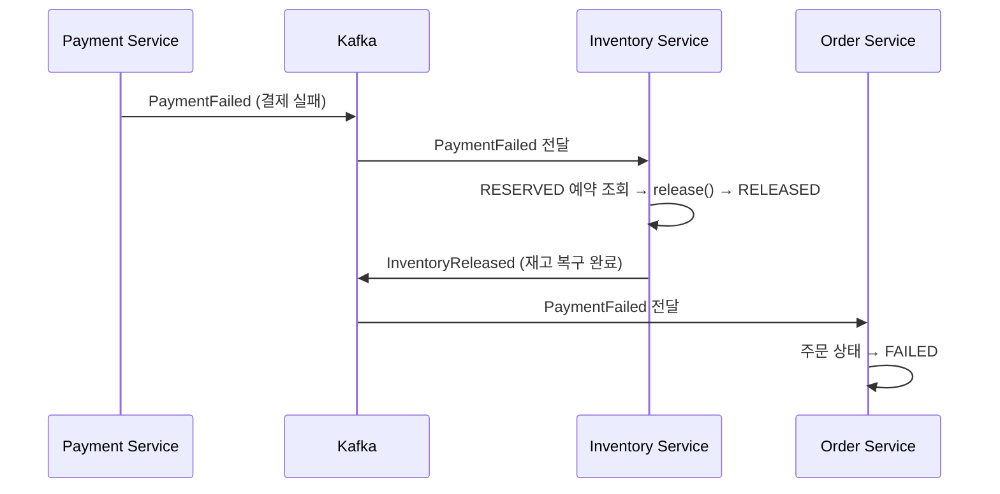
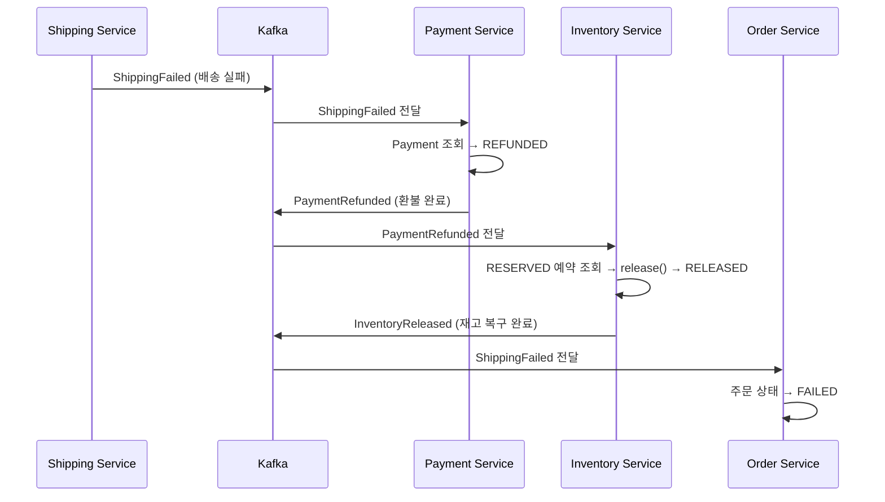

# #3: 보상 트랜잭션

실패 시 역순 복구 — PaymentFailed→재고복구, ShippingFailed→환불→재고복구

---

## 구현 요약

| 항목 | 내용 |
|------|------|
| 실습 번호 | #3 (보상 트랜잭션) |
| 변경 파일 | `InventoryService.java` (리스너 2개 + 공통 메서드 1개 추가), `PaymentService.java` (리스너 1개 추가) |
| 신규 파일 | 없음 (#1, #2에서 이미 준비된 이벤트/스키마/매퍼/토픽 활용) |
| LEARN.md 위치 | line 64~88 (실패 플로우 다이어그램), line 239~260 (보상 순서 이론) |

---

## 보상 플로우 2가지

### 시나리오 1: 결제 실패 (PaymentFailed)



결제가 실패하면 이미 예약된 재고만 복구하면 된다. 환불할 결제가 없으므로 단순하다.

### 시나리오 2: 배송 실패 (ShippingFailed) — 역순 보상



정방향: 재고 예약 → 결제 → 배송
**역순 보상: 환불 → 재고 복구** (ShippingFailed → PaymentRefunded → InventoryReleased)

---

## 왜 이렇게 구현했는가

### 1. 역순 보상이 필요한 이유

배송 실패 시 "재고 복구 → 환불" 순서로 하면 문제가 생긴다:
- 재고는 복구됐는데 환불이 실패하면 → 고객은 돈을 낸 채로 상품을 받지 못하는 불일치 상태
- **환불을 먼저** 해야 고객 피해를 최소화할 수 있다

Choreography에서 역순을 보장하는 방법:
- InventoryService는 `ShippingFailed`를 직접 구독하지 **않는다**
- 대신 `PaymentRefunded`를 구독한다 → 환불이 완료된 후에야 재고 복구가 시작된다

### 2. releaseInventory() 공통 메서드 추출

`onPaymentFailed`와 `onPaymentRefunded`의 재고 복구 로직이 동일하므로 `releaseInventory(orderId, correlationId)` 메서드로 추출했다.

```java
private void releaseInventory(String orderId, String correlationId) {
    List<Reservation> reservations = reservationRepository
            .findByOrderIdAndStatus(orderId, ReservationStatus.RESERVED);
    // RESERVED 예약을 찾아 → inventory.release() → RELEASED → InventoryReleased 발행
}
```

### 3. RESERVED 상태 체크로 중복 방지

`findByOrderIdAndStatus(orderId, RESERVED)` — 이미 RELEASED된 예약은 조회되지 않으므로, 같은 보상 이벤트가 두 번 오더라도 빈 리스트가 반환되어 안전하다.

### 4. 이미 준비된 것들 (#1, #2에서)

| 준비된 항목 | 위치 |
|------------|------|
| `InventoryReleased` 도메인 이벤트 | `ch03/event/InventoryReleased.java` |
| `PaymentRefunded` 도메인 이벤트 | `ch03/event/PaymentRefunded.java` |
| Avro 스키마 | `src/main/avro/ch03/SagaInventoryReleased.avsc`, `SagaPaymentRefunded.avsc` |
| Mapper 메서드 | `SagaEventMapper.toAvro(InventoryReleased)`, `toAvro(PaymentRefunded)` |
| 토픽 | `chapter3.inventory-released`, `chapter3.payment-refunded` |
| 도메인 메서드 | `Inventory.release()`, `ReservationStatus.RELEASED`, `PaymentStatus.REFUNDED` |
| Repository | `ReservationRepository.findByOrderIdAndStatus()`, `PaymentRepository.findByOrderId()` |

이벤트 설계(#1)에서 보상 이벤트를 미리 정의하고, 정상 플로우(#2)에서 도메인/스키마/매퍼를 모두 준비해두었기 때문에 보상 로직은 **리스너 3개 추가**만으로 완성됐다.

---

## 추가된 리스너 정리

| 서비스 | 리스너 | 구독 토픽 | 보상 동작 | 발행 토픽 |
|--------|--------|----------|----------|----------|
| InventoryService | `onPaymentFailed` | `chapter3.payment-failed` | 예약 해제 (reserve → release) | `chapter3.inventory-released` |
| InventoryService | `onPaymentRefunded` | `chapter3.payment-refunded` | 예약 해제 (reserve → release) | `chapter3.inventory-released` |
| PaymentService | `onShippingFailed` | `chapter3.shipping-failed` | 결제 환불 (COMPLETED → REFUNDED) | `chapter3.payment-refunded` |

---

## LEARN.md와의 차이점

| 항목 | LEARN.md | 실제 구현 |
|------|----------|----------|
| 직렬화 | JSON (SagaEvent sealed interface) | Avro SpecificRecord + Domain record + Mapper |
| 재고 복구 트리거 | PaymentFailed만 언급 | PaymentFailed + PaymentRefunded 두 경로 |
| 역순 보장 방법 | 이론 설명만 | InventoryService가 PaymentRefunded만 구독 (ShippingFailed 직접 구독 안 함) |
| 중복 방지 | correlationId 기반 필터 (#7에서 다룸) | ReservationStatus.RESERVED 상태 체크로 기본 보호 |

---

## 코드 리뷰 결과

### 발견된 이슈 및 수정

| 심각도 | 이슈 | 수정 내용 |
|--------|------|----------|
| **HIGH** | `Inventory.release()`에 guard 없음 — reservedQuantity가 음수로 갈 수 있음 | `reservedQuantity < quantity` 체크 추가 (`reserve()`와 대칭) |
| **HIGH** | `PaymentService.onShippingFailed`에 상태 체크 없음 — 중복 ShippingFailed 이벤트 시 중복 PaymentRefunded 발행 | `PaymentStatus.REFUNDED` 체크 후 early return 추가 |
| **MEDIUM** | 보상 리스너에 에러 핸들링 없음 — 예외 시 무한 재시도 가능 | try-catch + log + rethrow 패턴 추가 (보상은 반드시 성공해야 하므로 Kafka 재시도에 맡김) |
| **LOW** | 보상 리스너가 raw Avro 필드 접근 — 정방향 리스너의 toDomain() 패턴과 불일치 | `SagaEventMapper.toDomain()` 사용으로 통일 |

### 리뷰에서 배운 점

1. **reserve()와 release()는 대칭이어야 한다** — 검증 로직을 한쪽에만 넣으면 데이터 정합성이 깨질 수 있다
2. **at-least-once 환경에서 상태 체크는 필수** — Kafka 재전달 시 `REFUNDED` 상태 체크 없으면 보상 이벤트가 중복 발행된다
3. **보상 실패 전략: log + rethrow** — 보상은 반드시 성공해야 하므로 예외를 삼키지 않고 Kafka에 재시도를 맡긴다. 프로덕션에서는 DLQ + 재시도 횟수 제한 + 수동 개입 플래그가 필요하다

---

## 핵심 학습 포인트

1. **Choreography 보상은 이벤트 구독 토픽 선택으로 순서를 강제한다** — InventoryService가 ShippingFailed 대신 PaymentRefunded를 구독하면 자연스럽게 "환불 → 재고 복구" 순서가 된다
2. **보상 트랜잭션은 정방향의 역순이어야 한다** — 각 단계가 이전 단계의 결과에 의존하므로, 나중에 성공한 것을 먼저 되돌려야 불일치를 방지한다
3. **상태 기반 중복 방지가 기본 보호막** — `findByOrderIdAndStatus(RESERVED)`로 이미 복구된 예약은 다시 복구하지 않는다 (본격적인 멱등성은 #7에서)
4. **사전 설계의 효과** — 이벤트 설계(#1)에서 보상 이벤트를 미리 정의하면 구현 시 리스너만 추가하면 되어 작업량이 크게 줄어든다
5. **reserve/release 대칭 검증** — 도메인 메서드에 입력 검증을 넣을 때 반대 동작에도 대칭으로 넣어야 데이터 무결성이 보장된다
6. **보상 실패 시 전략** — log + rethrow(Kafka 재시도) → DLQ → 수동 개입 순서가 프로덕션 패턴이다
