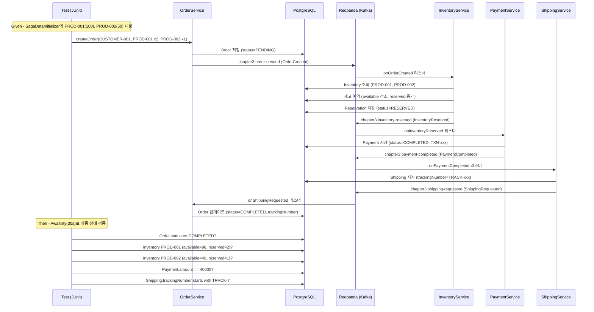
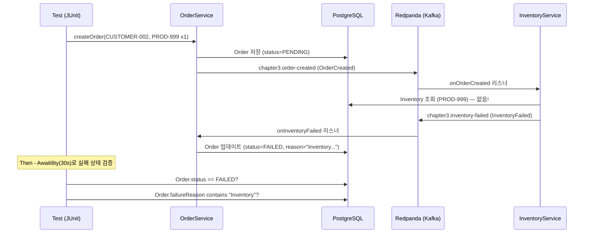
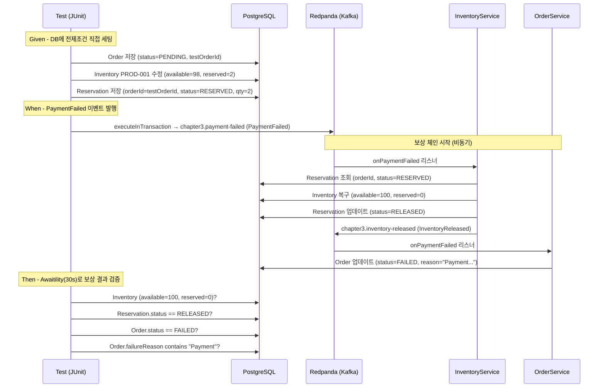
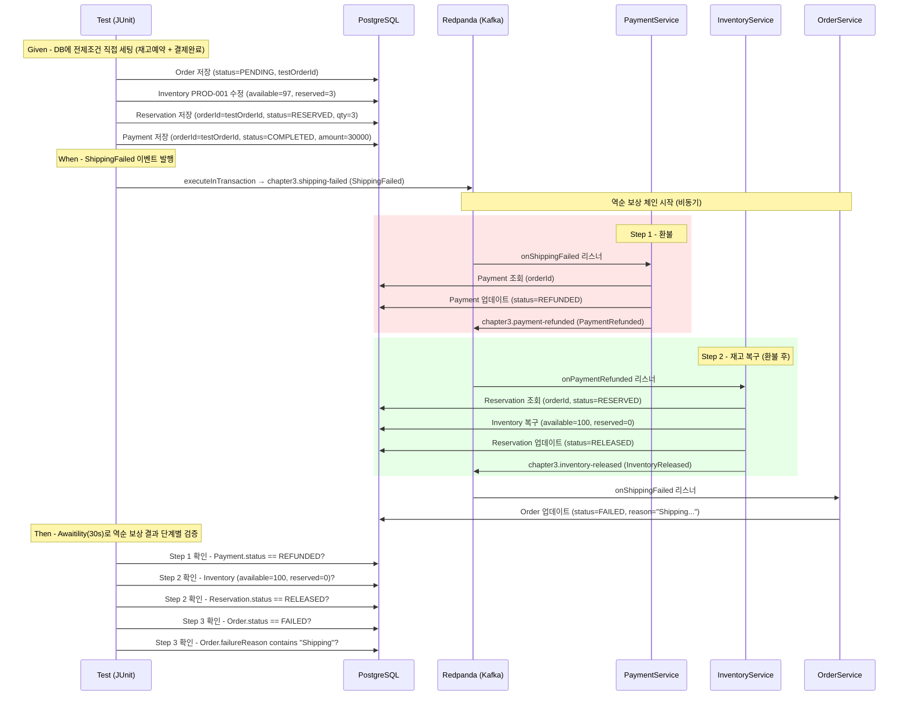

# #5: 통합 테스트

정상 플로우 + 보상 플로우를 통합 테스트로 검증

---

## 구현 요약

| 항목 | 내용 |
|------|------|
| 실습 번호 | #5 (통합 테스트) |
| 테스트 파일 | `SagaNormalFlowTest.java` (기존, #2에서 작성), `SagaCompensationFlowTest.java` (신규) |
| 공통 클래스 | `AbstractSagaTest.java` (@ActiveProfiles("local")), `SagaDataInitializer.java` (초기 재고) |
| 테스트 시나리오 | 정상 2개 + 보상 2개 = 총 4개 |

---

## 테스트 시나리오

### SagaNormalFlowTest (기존)

| 테스트 | 시나리오 | 검증 |
|--------|----------|------|
| `normalFlow_orderCompletedSuccessfully` | 주문 → 재고예약 → 결제 → 배송 → 완료 | Order.status=COMPLETED, 재고 차감, 결제/배송 기록 |
| `inventoryFailed_orderMarkedAsFailed` | 존재하지 않는 상품 주문 → 실패 | Order.status=FAILED, failureReason에 "Inventory" |

### SagaCompensationFlowTest (신규)

| 테스트 | 시나리오 | 검증 |
|--------|----------|------|
| `paymentFailed_inventoryReleased` | DB 전제조건 세팅 → PaymentFailed 발행 | 재고 복구(100,0), Reservation=RELEASED, Order=FAILED |
| `shippingFailed_paymentRefunded_thenInventoryReleased` | DB 전제조건 세팅 → ShippingFailed 발행 | Payment=REFUNDED → 재고 복구 → Reservation=RELEASED → Order=FAILED |

---

## 테스트 흐름도

### 시나리오 1: 정상 플로우 (normalFlow_orderCompletedSuccessfully)



### 시나리오 2: 재고 부족 실패 (inventoryFailed_orderMarkedAsFailed)



### 시나리오 3: 결제 실패 보상 (paymentFailed_inventoryReleased)



### 시나리오 4: 배송 실패 역순 보상 (shippingFailed_paymentRefunded_thenInventoryReleased)



역순 보상의 핵심은 **ShippingFailed → PaymentRefunded → InventoryReleased** 순서다. InventoryService는 ShippingFailed가 아닌 PaymentRefunded를 구독하여, 환불이 완료된 후에만 재고를 복구한다. 이렇게 하면 "환불은 안 됐는데 재고만 복구된" 불일치 상태를 방지한다.

---

## 왜 이렇게 구현했는가

### 1. 보상 테스트를 별도 클래스로 분리

정상 플로우 테스트(`SagaNormalFlowTest`)는 `OrderService.createOrder()`로 SAGA를 시작하고 전체 체인이 완료되는지 검증한다. 보상 테스트(`SagaCompensationFlowTest`)는 **중간 상태를 DB에 직접 세팅**하고 실패 이벤트만 발행하여 보상 리스너를 독립적으로 테스트한다.

분리 이유:
- 정상 플로우 전체를 거치면 실패를 유도하기 어렵다 (어디서 실패시킬지 제어 불가)
- 보상 리스너만 검증하려면 전제조건을 직접 세팅하는 것이 더 정확하다
- 두 테스트 클래스의 setup/teardown 요구사항이 다르다

### 2. executeInTransaction으로 이벤트 발행

ch03의 KafkaTemplate은 `transactional.id`가 설정되어 있어, 모든 send()가 반드시 트랜잭션 컨텍스트 안에서 실행되어야 한다. 테스트에서 직접 `kafkaTemplate.send()`를 호출하면 트랜잭션 컨텍스트가 없어 에러가 발생할 수 있다.

`executeInTransaction()`으로 명시적 트랜잭션을 열어 이벤트를 발행한다.

### 3. @BeforeEach에서 재고 원복

`SagaDataInitializer`가 앱 시작 시 PROD-001(100개)을 초기화하지만, 같은 Spring Context에서 여러 테스트가 실행되면 이전 테스트가 재고를 변경한 상태가 남는다. `@BeforeEach`에서 PROD-001 재고를 100/0으로 원복하여 테스트 격리를 보장한다.

### 4. Reservation assertion을 Awaitility 안으로

보상 리스너가 비동기로 실행되므로, Reservation 상태 변경도 비동기다. Awaitility 블록 밖에서 즉시 검증하면 아직 업데이트되지 않은 상태를 읽어 실패할 수 있다.

---

## 코드 리뷰 결과

### 발견된 이슈 및 수정

| 심각도 | 이슈 | 수정 |
|--------|------|------|
| **HIGH** | Reservation RELEASED assertion이 Awaitility 밖 — 비동기 업데이트 전에 검증하면 실패 | Awaitility 블록 안으로 이동 |
| **HIGH** | PROD-001 재고가 이전 테스트에서 변경된 상태 유지 — 테스트 격리 실패 | @BeforeEach에서 재고 원복 |
| **MEDIUM** | Transactional KafkaTemplate에 트랜잭션 컨텍스트 없이 send() 호출 | executeInTransaction() 사용 |
| **MEDIUM** | 이전 테스트 실행의 토픽 메시지가 남아 간섭 가능 | earliest + UUID orderId로 완화 (문서화) |
| **LOW** | Awaitility timeout 불일치 (30초/10초 혼재) | 전체 30초로 통일 |

### 알려진 제한사항: 토픽 오염

테스트가 로컬 Redpanda를 직접 사용하므로, 이전 실행의 메시지가 토픽에 남아있을 수 있다. 현재 다음으로 완화:
- `auto.offset.reset=earliest` + 고유한 consumer group (Spring 기본 생성)
- UUID 기반 `testOrderId`로 다른 테스트의 메시지와 구분

완전한 해결은 Testcontainers로 테스트마다 새 Redpanda 인스턴스를 사용하는 것이지만, ch03에서는 로컬 인프라 직접 사용 방식을 유지한다.

---

## LEARN.md와의 차이점

| 항목 | LEARN.md | 실제 구현 |
|------|----------|----------|
| 보상 테스트 방식 | 정상 플로우 후 실패 유도 | DB 전제조건 직접 세팅 + 실패 이벤트만 발행 |
| 이벤트 발행 | kafkaTemplate.send() | executeInTransaction() (트랜잭션 Producer 호환) |
| 인프라 | Testcontainers 또는 Embedded Kafka | 로컬 docker-compose (Redpanda + PostgreSQL) |

---

## 보상 트랜잭션 vs DLT: 비즈니스 실패와 기술 실패

### 구분 기준: "실패 이벤트를 발행할 수 있는가"

| | 비즈니스 실패 | 기술 실패 |
|---|---|---|
| **원인** | 잔액 부족, 재고 없음, 배송 불가 등 | DB 다운, 네트워크 끊김, 역직렬화 오류 등 |
| **서비스 상태** | 메시지를 처리하고 "안 된다"고 판단 | 메시지 처리 자체를 못 함 |
| **복구 경로** | 실패 이벤트 발행 → SAGA 보상 체인 (자동) | 재시도 → DLT → 지연 재처리 → 수동 개입 |
| **설계 여부** | SAGA의 정상적인 일부 (설계된 흐름) | 예외 상황 (별도 복구 메커니즘 필요) |

### 기술 실패의 3단계 복구 정책

| 단계 | 메커니즘 | 설명 |
|------|----------|------|
| 1차 | 즉시 재시도 (BackOff) | DB 일시적 타임아웃 → 1초 후 재시도 → 대부분 여기서 해결 |
| 2차 | DLT + 지연 재처리 | 재시도 소진 → DLT → 별도 Consumer가 5분, 15분, 1시간 간격으로 재시도 |
| 3차 | 수동 개입 | 지연 재처리도 실패 → 운영 알림(PagerDuty, Slack) → 대시보드에서 수동 보상 |

### 가장 위험한 시나리오: 보상 리스너에서 기술 실패

정상 플로우 기술 실패는 아직 상태 변경이 없으므로 큰 문제가 아니다. 하지만 보상 플로우에서 기술 실패가 발생하면 **불일치 상태**가 된다:

```
PaymentFailed → InventoryService.onPaymentFailed 처리 중 DB 다운
→ 재시도 소진 → DLT 전송
→ 결제는 실패했는데 재고는 안 복구됨 → 불일치!
```

프로덕션 대응:
- 보상 리스너의 재시도 횟수를 더 많이 설정 (일반 3회, 보상 10회)
- DLT Consumer에서 보상 메시지를 우선 처리
- 최종 실패 시 즉시 알림
- **멱등성 필수** (#7 실습) — DLT 재처리나 수동 보상 시 같은 보상을 여러 번 실행해도 안전해야 함

---

## 핵심 학습 포인트

1. **보상 테스트는 전제조건을 직접 세팅** — 정상 플로우 전체를 거치지 않고, 중간 상태를 DB에 세팅하면 보상 리스너만 독립적으로 검증할 수 있다
2. **Transactional KafkaTemplate은 트랜잭션 컨텍스트 필수** — 리스너 안에서는 KafkaTransactionManager가 자동 제공하지만, 테스트에서 직접 호출할 때는 executeInTransaction() 사용
3. **비동기 검증은 모두 Awaitility 안에서** — 보상 체인의 모든 결과는 비동기이므로, DB 상태 검증을 Awaitility 블록 밖에서 하면 타이밍에 따라 실패한다
4. **테스트 격리는 @BeforeEach에서 명시적으로** — 같은 Spring Context를 공유하는 통합 테스트에서는 이전 테스트의 부작용을 직접 정리해야 한다
5. **비즈니스 실패 ≠ 기술 실패** — SAGA 보상은 비즈니스 실패에 대한 자동 복구이고, 기술 실패는 재시도 → DLT → 수동 개입의 별도 경로로 처리한다. 보상 리스너에서 기술 실패가 나면 불일치가 되므로 멱등성이 필수다
