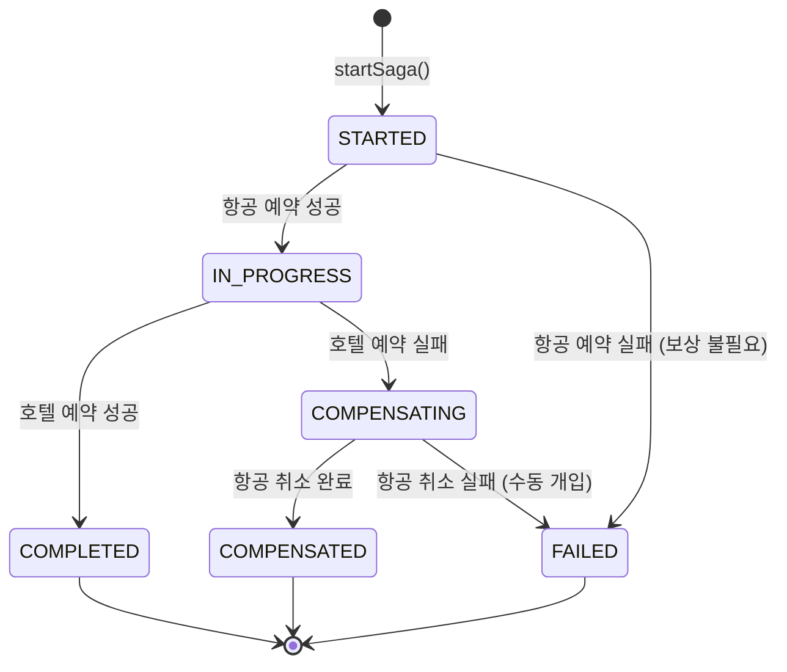
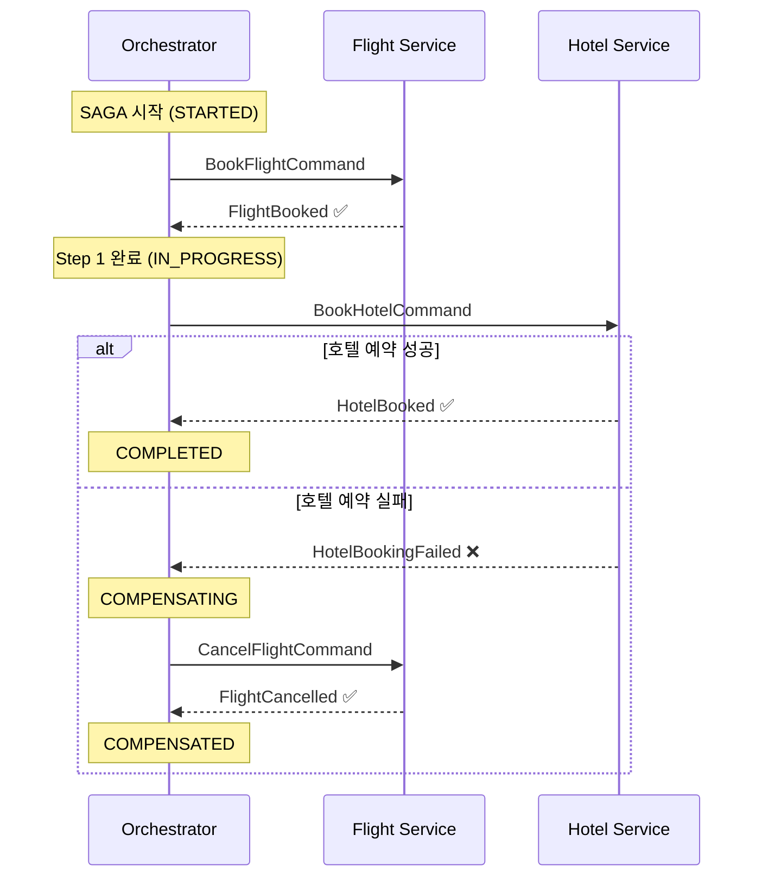
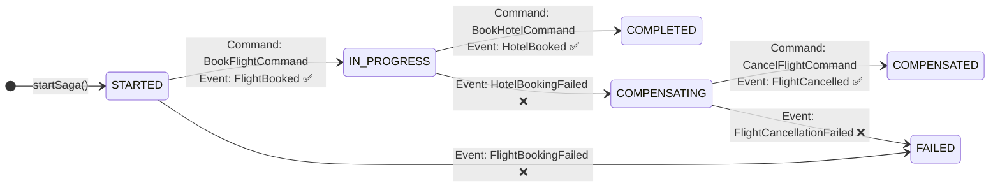

# Ch09 실습 #1: 상태 모델 + Command 설계

## 목적

SAGA Orchestration의 기반을 구축한다. Orchestrator가 워크플로우를 제어하려면 두 가지가 필요하다:
1. **상태 모델**: 현재 어디까지 진행했는지 기록 (SagaState)
2. **메시지 계약**: 서비스에게 무엇을 시키고(Command), 결과를 어떻게 받을지(Event)

## 도메인: 여행 예약 (Travel Booking)

Ch08(온라인 주문, 4단계)과 달리 **2단계**로 단순화하여 Orchestration 패턴 자체에 집중한다.

```
Step 1: 항공 예약 (Flight Booking)
Step 2: 호텔 예약 (Hotel Booking)
```

### 왜 2단계인가?

Orchestration 패턴의 핵심은 "중앙 조정자가 단계를 순차 실행하고, 실패 시 역순 보상"이다.
이 패턴을 이해하는 데 4단계는 불필요하게 복잡하다. 2단계면 충분히 보여줄 수 있다:
- 정상: 항공 → 호텔 → 완료
- Step 1 실패: 항공 실패 → 바로 FAILED (보상 없음)
- Step 2 실패: 호텔 실패 → 항공 취소 (보상 1건)

---

## 상태 전이 다이어그램



---

## 생성된 파일 (21개)

### 도메인 (4개)

| 파일 | 역할 |
|------|------|
| `SagaStep` | 진행 단계 enum (FLIGHT_BOOKING, HOTEL_BOOKING, COMPLETED) |
| `SagaStatus` | 전체 상태 enum (STARTED → IN_PROGRESS → COMPLETED / COMPENSATING → COMPENSATED) |
| `SagaState` | JPA 엔티티 — sagaId, tripId, 단계별 결과, 실패 정보, 타임스탬프 |
| `SagaStateRepository` | Spring Data JPA — stalled SAGA 조회 쿼리 포함 |

### Command (3개) — Orchestrator → Service

| 파일 | 방향 | 용도 |
|------|------|------|
| `BookFlightCommand` | Orchestrator → Flight Service | 항공 예약 요청 |
| `CancelFlightCommand` | Orchestrator → Flight Service | 항공 예약 취소 (보상) |
| `BookHotelCommand` | Orchestrator → Hotel Service | 호텔 예약 요청 |

### Event (5개) — Service → Orchestrator

| 파일 | 방향 | 용도 |
|------|------|------|
| `FlightBooked` | Flight Service → Orchestrator | 항공 예약 성공 |
| `FlightBookingFailed` | Flight Service → Orchestrator | 항공 예약 실패 |
| `FlightCancelled` | Flight Service → Orchestrator | 항공 취소 완료 (보상 결과) |
| `HotelBooked` | Hotel Service → Orchestrator | 호텔 예약 성공 |
| `HotelBookingFailed` | Hotel Service → Orchestrator | 호텔 예약 실패 |

### Avro 스키마 (8개) — `src/main/avro/ch04/`

| 파일 | 타입 | namespace |
|------|------|-----------|
| `TripBookFlightCommand.avsc` | Command | `com.study.redpanda.avro.trip` |
| `TripCancelFlightCommand.avsc` | Command | `com.study.redpanda.avro.trip` |
| `TripBookHotelCommand.avsc` | Command | `com.study.redpanda.avro.trip` |
| `TripFlightBooked.avsc` | Event | `com.study.redpanda.avro.trip` |
| `TripFlightBookingFailed.avsc` | Event | `com.study.redpanda.avro.trip` |
| `TripFlightCancelled.avsc` | Event | `com.study.redpanda.avro.trip` |
| `TripHotelBooked.avsc` | Event | `com.study.redpanda.avro.trip` |
| `TripHotelBookingFailed.avsc` | Event | `com.study.redpanda.avro.trip` |

### 매퍼 (1개)

| 파일 | 역할 |
|------|------|
| `TripSagaEventMapper` | 도메인 record ↔ Avro SpecificRecord 변환 (Ch08 `SagaEventMapper` 패턴 동일) |

Avro에서 `Instant`/`LocalDate`는 string으로 직렬화하고, 매퍼에서 `parse()`/`toString()`으로 변환한다. Ch08과 동일한 패턴이다.

---

## 메시지 흐름



---

## Command vs Event 설계 원칙

### 메시지 타입 분류

SAGA 패턴에서 메시지는 4가지로 분류된다:

| 타입 | 정의 | 방향 | 네이밍 | 트리거 |
|------|------|------|--------|--------|
| **Command** | 상태 전이를 유발하는 **의도** | Orchestrator → Service | 명령형 (`Book~`, `Cancel~`) | 상태 다이어그램의 **화살표 시작** |
| **Success Event** | 상태 전이 **완료 사실** | Service → Orchestrator | 과거분사 (`~Booked`, `~Cancelled`) | 상태 다이어그램의 **화살표 도착** |
| **Failure Event** | 상태 전이 **실패 사실** | Service → Orchestrator | `~Failed` 접미사 | 분기(alt) 경로 진입 |
| **Compensation Event** | **보상 완료** 사실 | Service → Orchestrator | 과거분사 (`~Cancelled`, `~Released`) | 보상 화살표 도착 |

### 상태 다이어그램에서 메시지 도출하는 방법



**도출 규칙:**
1. **상태 노드** = `SagaStatus` enum 값 (STARTED, IN_PROGRESS, COMPLETED, ...)
2. **정방향 화살표** = Command 발행(Orchestrator) + Success/Failure Event 수신
3. **보상 화살표** = Compensation Command 발행 + Compensation Event 수신
4. **분기 조건** = Success Event → 다음 상태 / Failure Event → 보상 또는 실패 상태

### Choreography vs Orchestration 메시지 차이

| 패턴 | Command | Event | 설계 기준 |
|------|---------|-------|----------|
| Choreography (Ch08) | **없음** | 서비스 → 다음 서비스 | 각 서비스가 자율적으로 다음 행동 결정 |
| Orchestration (Ch09) | **있음** | Service → Orchestrator | 중앙 조정자가 명시적으로 지시 |

Choreography에서 Command가 없는 이유: 중앙 조정자가 없으므로 "지시"할 주체가 없다. 각 서비스는 이전 서비스의 Event를 듣고 스스로 판단한다.

### Query는 왜 Kafka 메시지가 아닌가?

Query(읽기 요청)는 Command/Event와 달리 **동기적 REST API** 레벨에서 처리된다. Kafka는 비동기 메시지 흐름(Command → Event)을 담당하고, Query는 Materialized View(읽기 모델)에 대한 직접 조회이다.

> Query 설계 상세: `docs/08_MessageQueue/Patterns/02_CQRS.md` (Query Handler, Read Model 전략)
> Query API 분리 패턴: `poc/02_Architecture/01-event-driven/learning/09-request-response-bridge.md`

---

## Ch08(Choreography)과의 설계 차이

| 항목 | Ch08 (Choreography) | Ch09 (Orchestration) |
|------|---------------------|----------------------|
| 메시지 방향 | 서비스 → 서비스 (이벤트 체인) | Orchestrator ↔ 서비스 (Command/Event) |
| 상태 추적 | ProcessedEvent 테이블 재활용 | SagaState 전용 엔티티 |
| 식별자 | correlationId | sagaId |
| 직렬화 | Avro + Schema Registry | Avro + Schema Registry |
| 단계 수 | 4 (주문→재고→결제→배송) | 2 (항공→호텔) |
| 서비스 수 | 4 | 2 |

### 왜 Ch09도 Avro인가?

프로젝트 전체를 Avro + Schema Registry로 통일했다. 직렬화 형식을 일관되게 유지하면 Ch08~Ch09의 Kafka 설정 패턴이 동일해지고, 실습 간 전환 시 인지 비용이 줄어든다. Ch09만 JSON으로 바꾸면 별도의 직렬화 설정이 필요해져 오히려 복잡해진다.

---

## SagaState 설계 결정

### DB 기반 상태 관리를 선택한 이유

| 항목 | DB 기반 | Event Sourcing |
|------|---------|----------------|
| 구현 복잡도 | 낮음 | 높음 |
| 조회 성능 | 빠름 (직접 SELECT) | 느림 (이벤트 재생 필요) |
| 감사 추적 | UPDATE로 이전 상태 손실 | 완벽한 이력 보존 |
| 복구 | DB 조회 → 상태 복원 | 이벤트 재생 → 상태 복원 |

학습 목적으로는 DB 기반이 적합하다. Event Sourcing은 별도 학습 주제에서 다룬다:
- **EDA Ch15**: `poc/02_Architecture/01-event-driven/learning/15-event-sourcing.md` — 핵심 개념, Snapshot, CQRS 통합
- **이론 심화**: `docs/08_MessageQueue/Patterns/01_Event_Sourcing.md` — CRUD 비교, Aggregate, Schema Evolution
- **면접 정리**: `docs/08_MessageQueue/Patterns/01_Event_Sourcing_면접정리.md`

### 보상에 필요한 데이터를 SagaState에 직접 저장

`flightReservationId`를 SagaState에 저장하는 이유: 호텔 예약이 실패하면 Orchestrator가 항공 취소 Command를 보내야 하는데, 이때 `reservationId`가 필요하다. 이벤트를 다시 찾아보는 대신 상태에 저장해두면 즉시 보상을 시작할 수 있다.

---

## DB 모델 설계 레퍼런스

### Eventuate Tram 프레임워크 스키마 (산업 표준)

Chris Richardson의 Eventuate Tram Sagas 프레임워크는 4개 테이블을 사용한다:

| 테이블 | 역할 | 주요 컬럼 |
|--------|------|----------|
| `saga_instance` | SAGA 인스턴스 상태 | saga_type, saga_id, state_name, end_state, compensating, failed, saga_data_json |
| `saga_instance_participants` | 참여 서비스 추적 | saga_type, saga_id, destination, resource |
| `saga_lock_table` | 동시 접근 제어 | target, saga_type, saga_id |
| `saga_stash_table` | 대기 메시지 보관 | message_id, target, saga_type, saga_id, message_headers, message_payload |

### Ch09 설계와 비교

| 항목 | Ch09 (현재) | Eventuate Tram | 평가 |
|------|------------|----------------|------|
| 상태 저장 | `ch04_saga_state` (단일 테이블, 16 컬럼) | `saga_instance` (9 컬럼) + `saga_data_json` | Ch09가 도메인 데이터 인라인 저장 (학습용 명시적) |
| 참여자 추적 | 없음 (하드코딩) | `saga_instance_participants` | Ch09는 2단계 고정이라 불필요 |
| 멱등성 | `ch04_processed_command` (별도 테이블) | 프레임워크 내장 | 동일 패턴 |
| 동시성 | `@Version` (Optimistic Lock) | `saga_lock_table` (Pessimistic) | 접근 방식 차이 |
| 메시지 스태싱 | 없음 | `saga_stash_table` | Ch09는 순차 실행만 |
| 보상 데이터 | SagaState에 직접 저장 (flightReservationId) | saga_data_json에 직렬화 | Ch09가 더 명시적 |
| 타임아웃 | `stepStartedAt` + 스케줄러 | 프레임워크 내장 | 동일 개념 |

### Ch09가 학습 목적으로 적절한 이유

1. **도메인 필드 인라인**: `flightReservationId` 등을 직접 저장하므로 `saga_data_json`보다 의도가 명확하다
2. **참여자 테이블 생략**: 2단계 고정이므로 하드코딩이 오히려 단순하다
3. **Optimistic Lock**: 학습 환경(단일 인스턴스)에서는 `@Version`이 `saga_lock_table`보다 구현이 간결하다

### 프로덕션 확장 시 고려사항

1. **saga_instance_participants**: 동적 단계 추가 시 참여자 테이블이 필요해진다
2. **saga_lock_table**: 멀티 인스턴스 환경에서 동시 보상 방지에 Pessimistic Lock이 적합하다
3. **saga_stash_table**: 순서 보장이 필요한 메시지 대기열 (현재 Ch09는 순차 실행만 지원)
4. **saga_data_json**: 도메인 변경에 유연한 직렬화 — 인라인 필드는 스키마 변경 시 DDL 마이그레이션 필요
5. **완료 SAGA 클린업**: 아카이빙 또는 TTL 전략으로 테이블 크기 관리

### 참고 자료

- [Eventuate Tram Sagas 스키마 (PostgreSQL)](https://github.com/eventuate-tram/eventuate-tram-sagas/blob/master/postgres/tram-saga-schema.sql)
- [Chris Richardson — Implementing Orchestration-based Sagas](https://microservices.io/post/sagas/2019/12/12/developing-sagas-part-4.html)
- [Microsoft Azure SAGA Pattern](https://learn.microsoft.com/en-us/azure/architecture/patterns/saga)
- [Saga Orchestration + Outbox Pattern (InfoQ)](https://www.infoq.com/articles/saga-orchestration-outbox/)
- [Modeling Saga as State Machine (DZone)](https://dzone.com/articles/modelling-saga-as-a-state-machine)

---

## 빌드 결과

`./gradlew compileJava compileTestJava` → **BUILD SUCCESSFUL**
