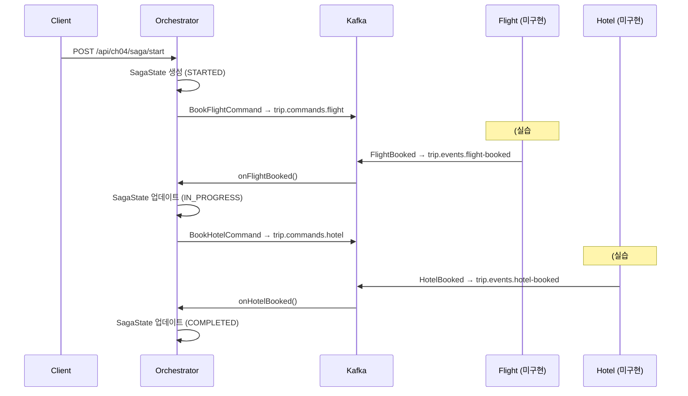

# Ch09 실습 #2: Orchestrator 정상 플로우

## 목적

SAGA Orchestration의 핵심인 **중앙 조정자(Orchestrator)**를 구현한다. 정상 플로우만 먼저 구현하여 "Orchestrator가 단계를 순차 실행하는" 패턴을 학습한다. 보상 로직은 실습 #4에서 추가한다.

## 생성된 파일 (3개)

| 파일 | 역할 |
|------|------|
| `TripKafkaConfig` | ch04 전용 Avro Kafka 설정 (Producer/Consumer/TX Manager/Error Handler/Listener Factory) |
| `TripSagaOrchestrator` | 정상 플로우 — startSaga + onFlightBooked + onHotelBooked |
| `TripSagaController` | REST API — SAGA 시작 + 상태 조회 |

---

## 정상 플로우



---

## 토픽 설계

### Command 토픽 (Orchestrator → Service) — 서비스별 묶음

| 토픽 | 수신자 | Command 타입 |
|------|--------|-------------|
| `trip.commands.flight` | Flight Service | BookFlightCommand, CancelFlightCommand |
| `trip.commands.hotel` | Hotel Service | BookHotelCommand |

Command 토픽을 서비스별로 묶는 이유: 같은 서비스가 처리하는 명령은 하나의 토픽에 넣고, Command Handler가 `instanceof`로 분기한다. 서비스 입장에서 하나의 토픽만 구독하면 되므로 설정이 단순해진다.

### Event 토픽 (Service → Orchestrator) — 이벤트 타입별 분리

| 토픽 | 발신자 | Event 타입 |
|------|--------|-----------|
| `trip.events.flight-booked` | Flight Service | FlightBooked |
| `trip.events.flight-booking-failed` | Flight Service | FlightBookingFailed |
| `trip.events.flight-cancelled` | Flight Service | FlightCancelled |
| `trip.events.hotel-booked` | Hotel Service | HotelBooked |
| `trip.events.hotel-booking-failed` | Hotel Service | HotelBookingFailed |

Event 토픽을 타입별로 분리하는 이유: Orchestrator의 `@KafkaListener`가 각 이벤트 타입에 1:1로 매핑된다. 하나의 토픽에 여러 타입을 넣으면 역직렬화 시 Avro SpecificRecord 타입이 불일치하여 ClassCastException이 발생한다.

### Ch08과의 토픽 설계 차이

| 항목 | Ch08 (Choreography) | Ch09 (Orchestration) |
|------|---------------------|----------------------|
| 토픽 수 | 이벤트 타입별 1:1 (9개) | Command 2개 + Event 5개 = 7개 |
| 방향 | 서비스 → 서비스 | Orchestrator ↔ 서비스 |
| 네이밍 | `saga.{이벤트명}` | `trip.commands.{서비스}`, `trip.events.{이벤트}` |

---

## 핵심 구현 패턴

### 1. 상태 전이 가드

```java
if (state.getStatus() != SagaStatus.STARTED) {
    log.warn("Invalid state for flight booked: sagaId={}, status={}",
            event.sagaId(), state.getStatus());
    return;
}
```

이벤트가 중복 수신되거나 순서가 뒤바뀌는 경우, 현재 상태를 확인하여 잘못된 전이를 방지한다. 이것은 멱등성의 첫 번째 계층이다.

### 2. 보상 데이터 저장

```java
state.setFlightReservationId(event.reservationId());
```

Step 1(항공) 성공 시 `reservationId`를 SagaState에 저장한다. 나중에 Step 2(호텔) 실패로 보상이 필요하면, 이 값으로 `CancelFlightCommand`를 즉시 생성할 수 있다.

### 3. Avro 변환 계층

```java
// 발행 시: 도메인 → Avro
kafkaTemplate.send(FLIGHT_COMMAND_TOPIC, sagaId, TripSagaEventMapper.toAvro(cmd));

// 수신 시: Avro → 도메인
FlightBooked event = TripSagaEventMapper.toDomain(avroEvent);
```

Kafka에는 Avro SpecificRecord가 흐르고, 비즈니스 로직은 도메인 record로 처리한다. 매퍼가 이 두 세계를 분리한다.

---

## Kafka 설정 (TripKafkaConfig)

Ch08 `SagaKafkaConfig`와 동일한 구조에서 빈 이름만 `ch04` 접두사로 변경:

| 빈 | 역할 |
|----|------|
| `ch04ProducerFactory` | Avro Serializer + Transactional (prefix: `trip-saga-tx-`) |
| `ch04KafkaTemplate` | ch04 전용 KafkaTemplate |
| `ch04KafkaTransactionManager` | Kafka TX 매니저 |
| `ch04ConsumerFactory` | Avro Deserializer + `read_committed` + `specific.avro.reader=true` |
| `ch04ErrorHandler` | DLT + FixedBackOff(1s, 3회) |
| `ch04KafkaListenerContainerFactory` | 위 모든 빈 조합 + `AckMode.MANUAL` |

---

## REST API

| Method | Path | 설명 |
|--------|------|------|
| POST | `/api/ch04/saga/start` | SAGA 시작, `{sagaId}` 반환 |
| GET | `/api/ch04/saga/{sagaId}` | sagaId로 상태 조회 |
| GET | `/api/ch04/saga/trip/{tripId}` | tripId로 상태 목록 조회 |

---

## 빌드 결과

`./gradlew compileJava` → **BUILD SUCCESSFUL** (경고 1개: `setTransactionManager` deprecated — Ch08과 동일, Spring Kafka 향후 버전에서 API 변경 예정)
