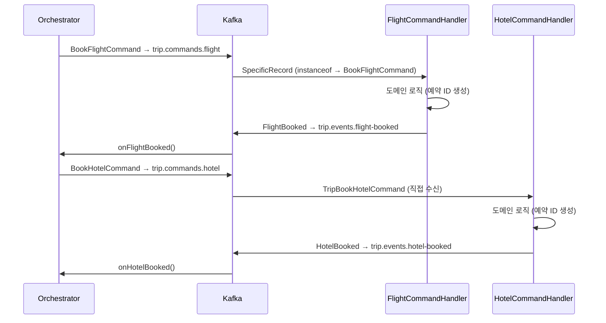

# Ch09 실습 #3: Command Handler 구현

## 목적

Orchestrator가 발행한 Command를 실제로 처리하는 서비스 측 컴포넌트를 구현한다. Command Handler는 Command를 수신하고, 도메인 로직을 실행하고, 결과 Event를 발행한다.

## 생성된 파일 (2개)

| 파일 | 역할 | 토픽 | Command 타입 |
|------|------|------|-------------|
| `FlightCommandHandler` | 항공 서비스 | `trip.commands.flight` | BookFlight, CancelFlight (2종) |
| `HotelCommandHandler` | 호텔 서비스 | `trip.commands.hotel` | BookHotel (1종) |

---

## 핵심 설계: 같은 토픽에 여러 Command 타입

### 문제

`trip.commands.flight` 토픽에 `BookFlightCommand`와 `CancelFlightCommand` 두 가지 Avro 타입이 공존한다. `specific.avro.reader=true` 설정에서 리스너가 특정 타입 하나만 받으면 ClassCastException이 발생한다.

### 해결

```java
@KafkaListener(topics = "trip.commands.flight", ...)
public void handle(SpecificRecord record) {
    if (record instanceof TripBookFlightCommand avroCmd) {
        handleBookFlight(TripSagaEventMapper.toDomain(avroCmd));
    } else if (record instanceof TripCancelFlightCommand avroCmd) {
        handleCancelFlight(TripSagaEventMapper.toDomain(avroCmd));
    }
}
```

Avro Schema Registry가 메시지별로 스키마 ID를 임베딩하므로, 역직렬화 시 올바른 SpecificRecord 타입이 자동 생성된다. 리스너는 `SpecificRecord`로 수신하고 `instanceof`로 분기하면 된다.

### HotelCommandHandler는 왜 직접 수신?

`trip.commands.hotel` 토픽에는 `BookHotelCommand` 1종만 있으므로, 리스너가 `TripBookHotelCommand`를 직접 받아도 안전하다. `instanceof` 분기가 불필요하다.

---

## 실패 시뮬레이션

통합 테스트에서 실패 시나리오를 쉽게 트리거하기 위해 간단한 규칙을 적용했다:

| 핸들러 | 실패 조건 | 발행 Event |
|--------|----------|-----------|
| FlightCommandHandler | `departure == "FAIL"` | `FlightBookingFailed` |
| HotelCommandHandler | `hotelName == "FAIL"` | `HotelBookingFailed` |

정상 처리 시 예약 ID 생성 규칙: `FLT-{UUID앞8자리}`, `HTL-{UUID앞8자리}`

---

## 메시지 흐름 (정상)



---

## Command Handler의 책임 범위

Command Handler는 **자기 도메인의 로직만** 실행한다:
1. Command 수신 (역직렬화)
2. 도메인 로직 실행 (예약, 취소 등)
3. 결과 Event 발행

"다음에 뭘 할지"는 결정하지 않는다. 그것은 Orchestrator의 역할이다. 이것이 Choreography와의 근본적 차이다:

| 항목 | Ch08 서비스 (Choreography) | Ch09 Handler (Orchestration) |
|------|---------------------------|------------------------------|
| 트리거 | 다른 서비스의 Event를 듣고 자발적 동작 | Orchestrator의 Command를 받고 지시대로 동작 |
| 다음 단계 | 자기가 Event를 발행하면 다음 서비스가 알아서 반응 | Orchestrator가 Event를 보고 다음 Command 결정 |
| 워크플로우 지식 | 전체 흐름을 몰라도 됨 (자기 부분만) | 전체 흐름을 몰라도 됨 (자기 부분만) |

두 패턴 모두 개별 서비스는 자기 도메인만 알면 된다. 차이는 "누가 흐름을 조정하는가"에 있다.

---

## 빌드 결과

`./gradlew compileJava` → **BUILD SUCCESSFUL**
