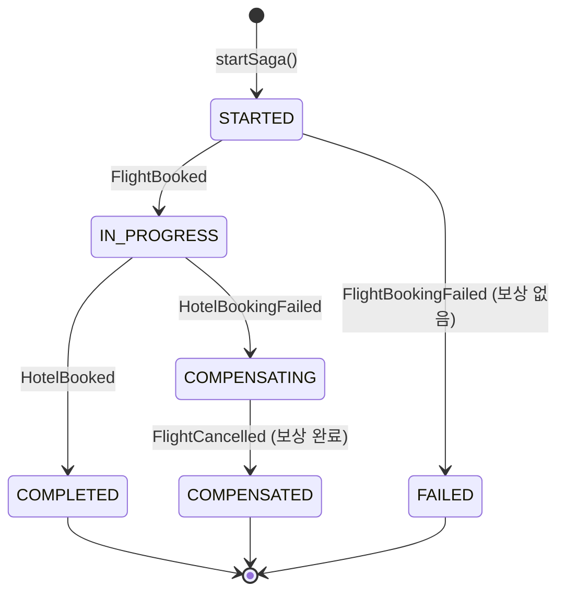

# Ch09 실습 #4: 보상 트랜잭션

## 목적

SAGA에서 중간 단계가 실패했을 때, 이미 성공한 이전 단계를 역순으로 취소하는 보상(Compensation) 로직을 구현한다.

## 변경된 파일 (1개)

| 파일 | 변경 내용 |
|------|----------|
| `TripSagaOrchestrator` | 보상 리스너 3개 + 토픽 상수 3개 + import 추가 |

---

## 보상 시나리오 (2단계 SAGA)

### Case 1: Step 1 실패 → 보상 불필요

```
startSaga() → BookFlightCommand
  → FlightBookingFailed (departure="FAIL")
    → onFlightBookingFailed() → FAILED (끝)
```

항공 예약이 첫 단계이므로, 실패해도 이전에 성공한 단계가 없다. 보상할 것이 없으므로 바로 FAILED로 전이한다.

### Case 2: Step 2 실패 → Step 1 보상

```
startSaga() → BookFlightCommand
  → FlightBooked (reservationId=FLT-xxx)
    → onFlightBooked() → BookHotelCommand
      → HotelBookingFailed (hotelName="FAIL")
        → onHotelBookingFailed() → COMPENSATING → CancelFlightCommand(FLT-xxx)
          → FlightCancelled
            → onFlightCancelled() → COMPENSATED (끝)
```

호텔 예약이 실패하면, 이미 성공한 항공 예약을 취소해야 한다. Orchestrator가 SagaState에 저장된 `flightReservationId`로 `CancelFlightCommand`를 발행한다.

---

## 상태 전이 다이어그램 (보상 포함)



---

## 추가된 리스너 3개

### 1. onFlightBookingFailed — STARTED → FAILED

```java
state.setStatus(SagaStatus.FAILED);
state.setFailureReason(event.reason());
state.setFailedStep("FLIGHT_BOOKING");
```

Step 1 실패는 가장 단순한 케이스다. 이전 단계가 없으므로 보상 없이 바로 종료한다.

### 2. onHotelBookingFailed — IN_PROGRESS → COMPENSATING

```java
state.setStatus(SagaStatus.COMPENSATING);
state.setFailureReason(event.reason());
state.setFailedStep("HOTEL_BOOKING");

CancelFlightCommand cmd = new CancelFlightCommand(
        event.tripId(), event.sagaId(), state.getFlightReservationId());
kafkaTemplate.send(FLIGHT_COMMAND_TOPIC, event.sagaId(), TripSagaEventMapper.toAvro(cmd));
```

핵심: `flightReservationId`를 SagaState에서 가져온다. 실습 #2에서 `onFlightBooked()`가 이 값을 저장해둔 덕분에, 보상 시점에 즉시 사용할 수 있다.

### 3. onFlightCancelled — COMPENSATING → COMPENSATED

```java
state.setStatus(SagaStatus.COMPENSATED);
state.setCompletedAt(Instant.now());
```

보상이 완료되면 COMPENSATED로 전이한다. COMPENSATED의 의미: "실패했지만 일관성은 복구되었다."

---

## 상태 전이 가드의 역할

각 리스너에서 현재 상태를 확인하는 가드:

| 리스너 | 기대 상태 | 거부 시 |
|--------|----------|---------|
| onFlightBookingFailed | STARTED | 중복 메시지 무시 |
| onHotelBookingFailed | IN_PROGRESS | 중복 메시지 무시 |
| onFlightCancelled | COMPENSATING | 중복 메시지 무시 |

이 가드가 없으면 중복 이벤트로 인한 잘못된 상태 전이가 발생할 수 있다. 예를 들어 이미 COMPENSATED인 SAGA에 FlightCancelled가 다시 도착해도 무시된다.

---

## Ch08 보상과의 비교

| 항목 | Ch08 (Choreography) | Ch09 (Orchestration) |
|------|---------------------|----------------------|
| 보상 트리거 | 각 서비스가 실패 이벤트를 듣고 자발적으로 보상 | Orchestrator가 실패 이벤트를 듣고 보상 Command 발행 |
| 보상 순서 | 이벤트 체인으로 암묵적 역순 | Orchestrator가 명시적으로 역순 실행 |
| 보상 경로 수 | 3 (결제실패→재고해제, 배송실패→환불+재고해제) | 1 (호텔실패→항공취소) |
| 상태 추적 | ProcessedEvent 재활용 | SagaState에 명시적 COMPENSATING 상태 |
| 가시성 | 분산되어 추적 어려움 | Orchestrator에 집중되어 추적 용이 |

Orchestration의 장점: 보상 로직이 Orchestrator 한 곳에 모여 있어서 "어디까지 보상했는지"를 SagaState로 즉시 확인할 수 있다.

---

## 빌드 결과

`./gradlew compileJava` → **BUILD SUCCESSFUL**
