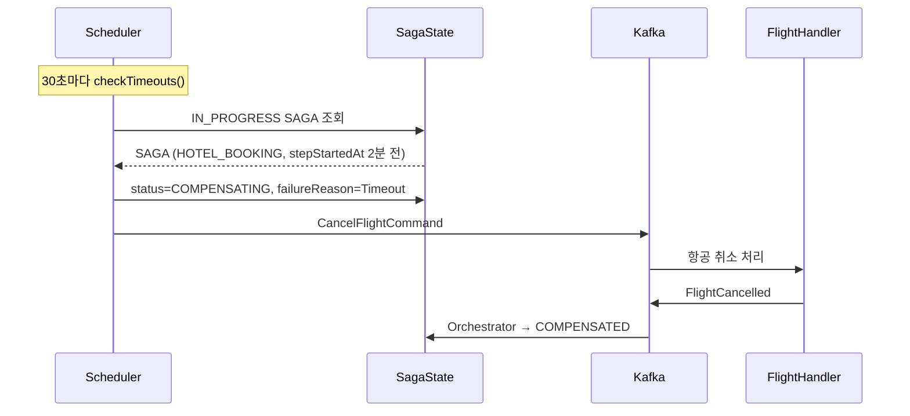
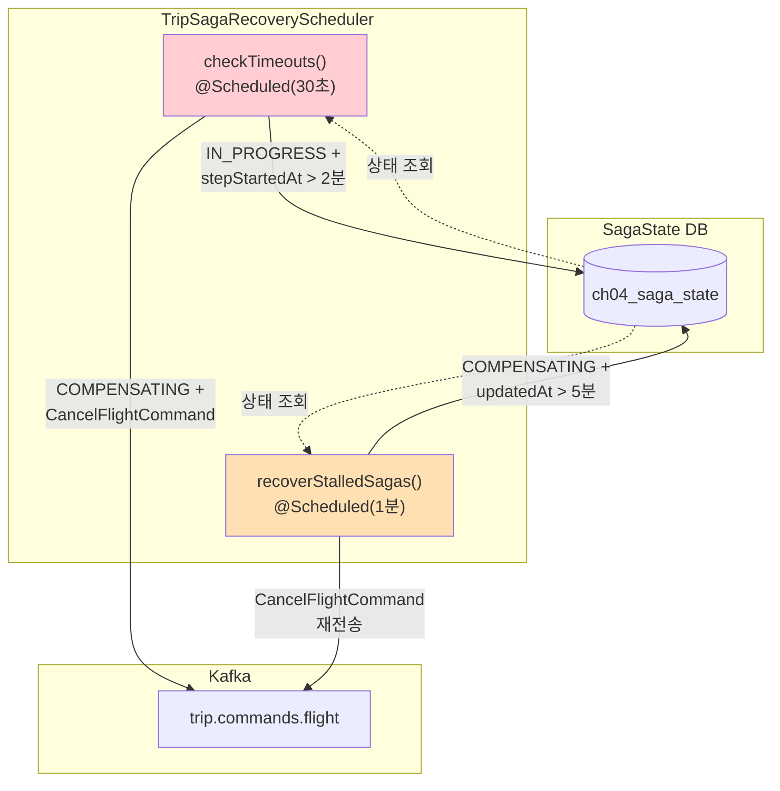
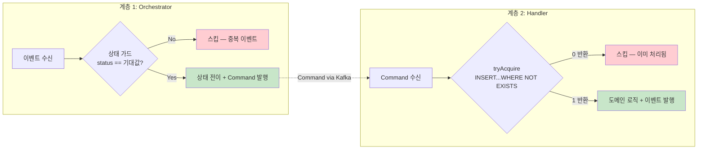

# Ch09 실습 #6: 타임아웃 + 장애 복구

## 목적

Orchestrator가 무한 대기하지 않도록 타임아웃을 설정하고, Orchestrator 다운 후 재시작 시 중단된 SAGA를 복구하는 메커니즘을 구현한다. 추가로 Codex 코드 리뷰에서 발견된 HIGH 이슈(멱등성, 낙관적 잠금)도 함께 해결한다.

## 변경/생성된 파일 (7개)

| 파일 | 작업 | 변경 내용 |
|------|------|----------|
| `SagaState` | 수정 | `stepStartedAt` 필드 + `@Version` 낙관적 잠금 추가 |
| `ProcessedCommand` | **신규** | Handler 측 멱등성 엔티티 (sagaId + commandType) |
| `ProcessedCommandRepository` | **신규** | `tryAcquire()` 네이티브 쿼리 (preemptive acquire) |
| `SagaStateRepository` | 수정 | `findByStatusIn()` 쿼리 추가 |
| `TripKafkaConfig` | 수정 | `@EnableScheduling` 추가 |
| `TripSagaRecoveryScheduler` | **신규** | 타임아웃 감지 + stalled SAGA 복구 스케줄러 |
| `TripSagaOrchestrator` | 수정 | `stepStartedAt` 설정 (startSaga, onFlightBooked) |
| `FlightCommandHandler` | 수정 | `ProcessedCommand` 멱등성 체크 + `@Transactional` |
| `HotelCommandHandler` | 수정 | `ProcessedCommand` 멱등성 체크 + `@Transactional` |

---

## 타임아웃 메커니즘

### SagaState에 stepStartedAt 추가

각 단계 시작 시점을 기록하여 타임아웃 판단의 기준점으로 사용한다.

```java
// startSaga() — Step 1 시작
.stepStartedAt(Instant.now())

// onFlightBooked() — Step 2 시작
state.setStepStartedAt(Instant.now());
```

### 타임아웃 감지 스케줄러 (30초 간격)

```
@Scheduled(fixedDelay = 30_000)
checkTimeouts()
  ├── IN_PROGRESS / STARTED 상태 SAGA 조회
  ├── stepStartedAt + 2분 초과 여부 확인
  └── 초과 시 handleTimeout()
        ├── FLIGHT_BOOKING 타임아웃 → FAILED (보상 없음)
        └── HOTEL_BOOKING 타임아웃 → COMPENSATING → CancelFlightCommand
```

STEP_TIMEOUT = 2분. 서비스가 2분 내에 응답하지 않으면 해당 단계를 실패로 간주한다.

### 타임아웃 시나리오



---

## Stalled SAGA 복구 (Orchestrator 장애)

### 문제

Orchestrator가 다운되면 IN_PROGRESS나 COMPENSATING 상태의 SAGA가 방치된다. DB에 상태가 영속화되어 있으므로, 재시작 후 조회하여 복구할 수 있다.

### 복구 스케줄러 (1분 간격)

```
@Scheduled(fixedDelay = 60_000)
recoverStalledSagas()
  ├── COMPENSATING 상태 + updatedAt 5분 초과 SAGA 조회
  └── CancelFlightCommand 재전송
      └── updatedAt 갱신 (다음 스케줄에서 재검출 방지)
```

STALLED_THRESHOLD = 5분. Orchestrator 재시작 시간을 고려한 임계값이다.

### 타임아웃 vs Stalled 차이

| 항목 | 타임아웃 | Stalled 복구 |
|------|---------|-------------|
| 감지 대상 | IN_PROGRESS, STARTED | COMPENSATING |
| 판단 기준 | stepStartedAt + 2분 | updatedAt + 5분 |
| 동작 | 보상 트리거 (상태 전이) | 보상 Command 재전송 |
| 주기 | 30초 | 1분 |
| 목적 | 서비스 무응답 대응 | Orchestrator 다운 복구 |

### 스케줄러 아키텍처 전체도



---

## 멱등성 2계층

### Codex HIGH-1 해결: Handler 측 멱등성 추가

Ch08의 `ProcessedEvent` 패턴을 Ch09에 적용하되, SAGA Orchestration의 특성에 맞게 키를 (sagaId, commandType)으로 설계했다.

#### 왜 (sagaId, commandType)인가?

- Choreography(Ch08): 이벤트 체인이므로 `(correlationId, eventType)` — 같은 correlationId에 여러 eventType
- Orchestration(Ch09): Command 기반이므로 `(sagaId, commandType)` — 같은 sagaId에 여러 commandType

#### ProcessedCommand 엔티티

```java
@Entity
@Table(name = "ch04_processed_command",
    uniqueConstraints = @UniqueConstraint(columnNames = {"sagaId", "commandType"}))
public class ProcessedCommand {
    @Id @GeneratedValue(strategy = GenerationType.IDENTITY)
    private Long id;
    private String sagaId;
    private String commandType;
    private Instant processedAt;
}
```

#### Preemptive Acquire 패턴

```java
// INSERT ... WHERE NOT EXISTS → 0이면 중복, 1이면 최초
int acquired = processedCommandRepository.tryAcquire(sagaId, "BOOK_FLIGHT", Instant.now());
if (acquired == 0) {
    log.info("Duplicate BookFlightCommand skipped: sagaId={}", sagaId);
    return;
}
```

Ch08에서 학습한 동일 패턴: JPA `saveAndFlush()` + `DataIntegrityViolationException`은 Hibernate 세션 오염을 일으키므로 네이티브 쿼리 `INSERT ... WHERE NOT EXISTS`로 대체한다.

### Orchestrator 측 멱등성 (기존 유지)

Orchestrator의 상태 전이 가드가 1계층 멱등성을 제공한다:

```java
if (state.getStatus() != SagaStatus.STARTED) {
    log.warn("Invalid state for FlightBooked: ...");
    return;  // 중복 이벤트 무시
}
```

### 2계층 멱등성 정리

| 계층 | 위치 | 키 | 메커니즘 |
|------|------|-----|---------|
| 1 | Orchestrator | SagaState.status | 상태 전이 가드 (if status != expected → skip) |
| 2 | Handler | (sagaId, commandType) | ProcessedCommand + preemptive acquire |



---

## Codex HIGH 이슈 해결 현황

| # | 이슈 | 해결 |
|---|------|------|
| H1 | 멱등성 없음 | ProcessedCommand 엔티티 + preemptive acquire 패턴 추가 |
| H2 | AckMode.MANUAL인데 ack.acknowledge() 없음 | **False Positive** — KafkaTransactionManager가 오프셋을 TX 내에서 커밋하므로 수동 ack 불필요 |
| H3 | @Transactional 경계 불명확 | Practice #5에서 DB+Kafka TX 간극을 문서화, Practice #6의 복구 스케줄러가 간극을 보완 |

### H2 상세 설명

`AckMode.MANUAL` + `KafkaTransactionManager` 조합에서:
- TX Manager가 리스너 호출 전 Kafka TX 시작
- 리스너 정상 완료 → TX 커밋 (오프셋 포함)
- 리스너 예외 → TX abort (오프셋 미커밋)

`Acknowledgment.acknowledge()`는 TX Manager가 없을 때 수동 오프셋 커밋용이다. TX Manager가 있으면 오프셋 커밋을 TX Manager가 관리하므로 `acknowledge()` 호출이 불필요하다.

---

## @Version 낙관적 잠금

Codex 리뷰 권고에 따라 `SagaState`에 `@Version`을 추가했다.

```java
@Version
private Long version;
```

복구 스케줄러와 Orchestrator 리스너가 동일 SAGA를 동시에 수정할 경우, `OptimisticLockException`이 발생하여 한쪽이 재시도된다. 이는 "이미 처리된" SAGA를 중복 수정하는 것을 방지한다.

---

## Ch08 멱등성과의 비교

| 항목 | Ch08 (Choreography) | Ch09 (Orchestration) |
|------|---------------------|----------------------|
| 엔티티 | ProcessedEvent | ProcessedCommand |
| 복합 키 | (correlationId, eventType) | (sagaId, commandType) |
| 패턴 | preemptive acquire | preemptive acquire (동일) |
| 쿼리 | INSERT...WHERE NOT EXISTS | INSERT...WHERE NOT EXISTS (동일) |
| 적용 위치 | 각 서비스 리스너 | Command Handler |
| 추가 보호 | — | @Version 낙관적 잠금 |

Orchestration의 장점: 멱등성 체크가 Handler 2개에만 필요하다. Choreography는 서비스 수만큼(4개) 필요했다.

---

## 빌드 결과

`./gradlew compileJava` → **BUILD SUCCESSFUL**
