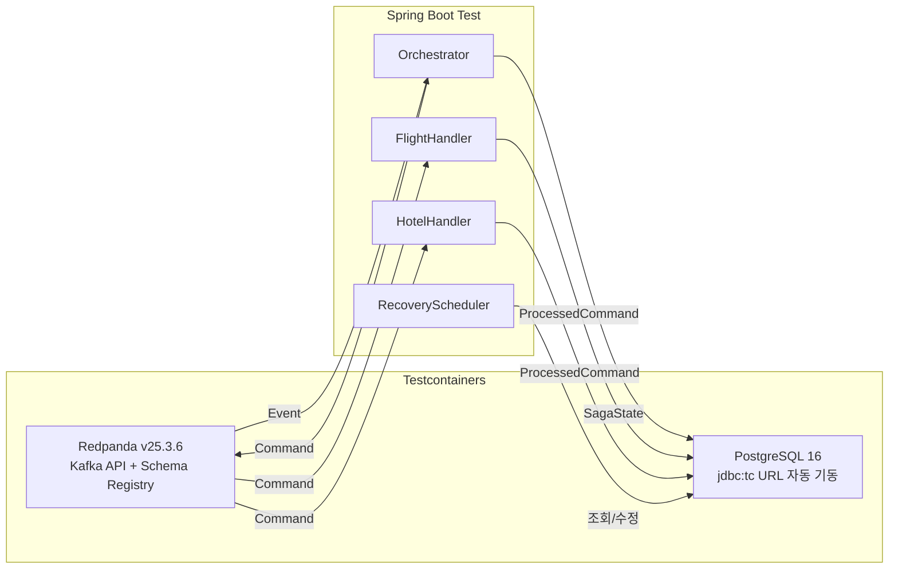
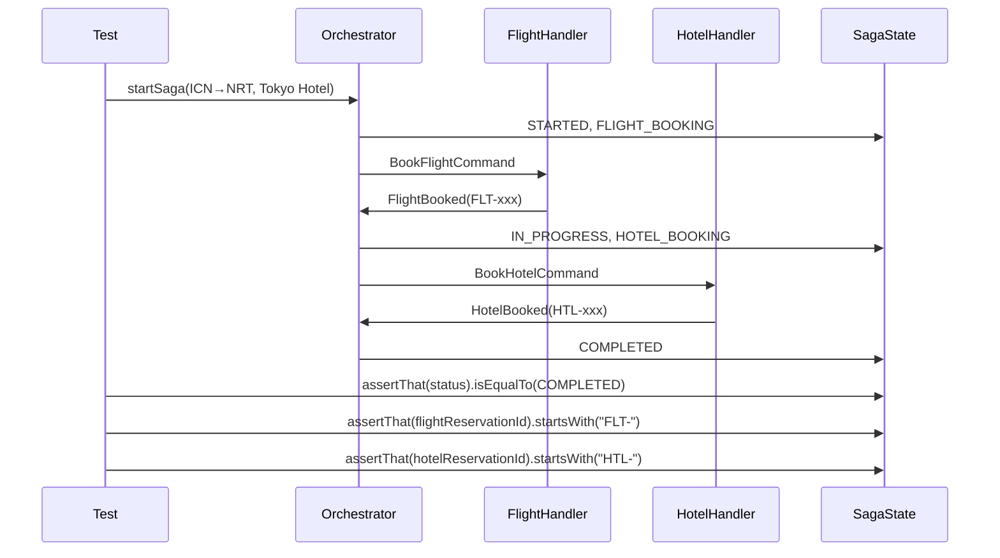
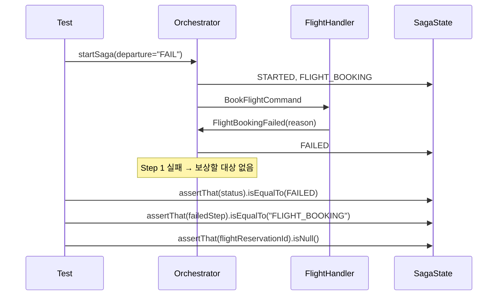
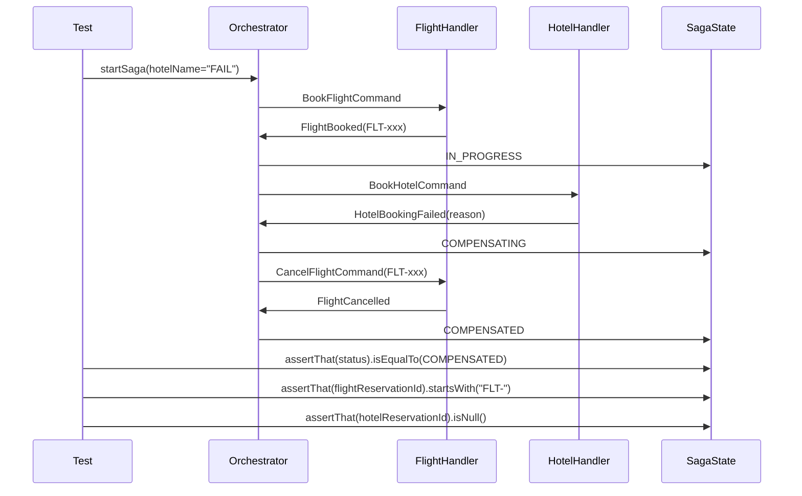
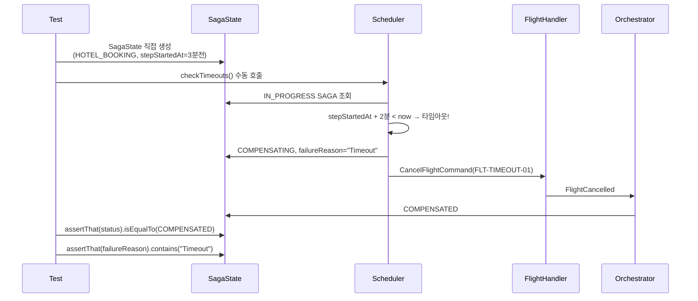
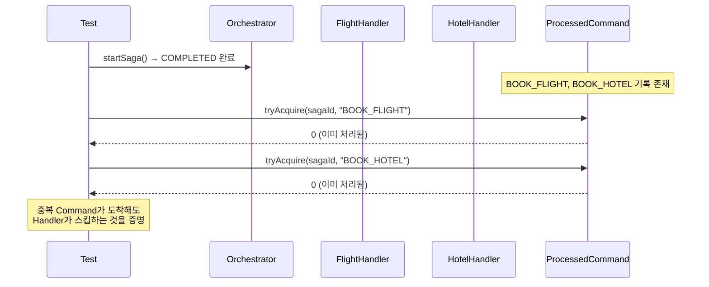

# Ch09 실습 #7: 통합 테스트

## 목적

Practice #1~#6 전체를 Testcontainers 기반 End-to-End 테스트로 검증한다. 정상/실패/보상/타임아웃/멱등성 5가지 시나리오를 커버한다.

## 테스트 인프라

- **Redpanda**: `@Container` + `@DynamicPropertySource`로 동적 주소 주입
- **PostgreSQL**: `jdbc:tc:postgresql:16:///saga` — Testcontainers JDBC URL 방식 (별도 `@Container` 불필요)
- **Awaitility**: 비동기 CTP 체인 완료를 폴링 검증 (최대 30초, 1초 간격)

---

## 테스트 시나리오 (5개)

### Test 1: 정상 플로우 → COMPLETED

**검증**: `SagaStatus.COMPLETED`, 양쪽 예약 ID 존재, `completedAt` not null.

### Test 2: Step 1 실패 → FAILED

**검증**: 보상 없이 즉시 `FAILED`, `flightReservationId` null.

### Test 3: Step 2 실패 → 보상 → COMPENSATED

**검증**: 항공 예약 후 취소 완료, `COMPENSATED`, `flightReservationId` 보존 (추적용).

### Test 4: 타임아웃 → 스케줄러 보상 → COMPENSATED

**핵심**: `stepStartedAt`을 과거(3분 전)로 설정하여 2분 타임아웃을 즉시 트리거. 실제 2분을 기다리지 않는다.

### Test 5: 멱등성 → ProcessedCommand 중복 방지

**검증**: 정상 플로우 완료 후 동일 `(sagaId, commandType)`으로 `tryAcquire()` 재호출 → 0 반환.

---

## 테스트 실행 환경

| 항목 | 설정 |
|------|------|
| 프레임워크 | JUnit 5 + Spring Boot Test |
| 컨테이너 | Testcontainers (Redpanda + PostgreSQL) |
| DDL | `hibernate.ddl-auto: create-drop` |
| 비동기 검증 | Awaitility (30초 타임아웃, 1초 폴링) |
| 테스트 순서 | `@TestMethodOrder(OrderAnnotation.class)` |
| 프로파일 | `@ActiveProfiles("test")` |

---

## 빌드 결과

`./gradlew compileTestJava` → **BUILD SUCCESSFUL**
