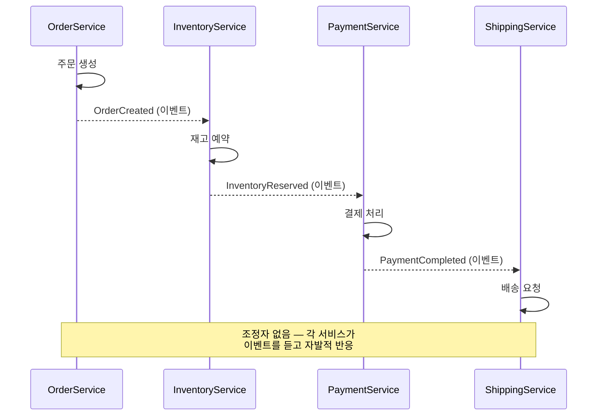
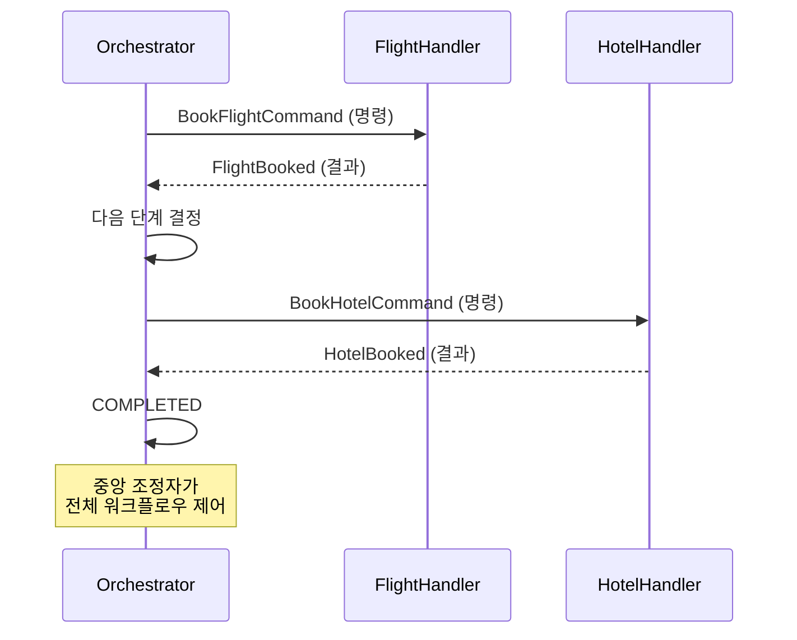
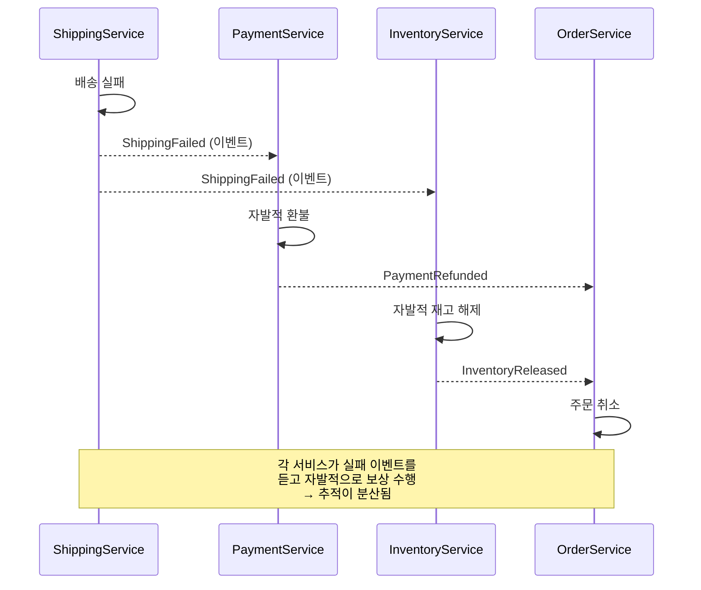
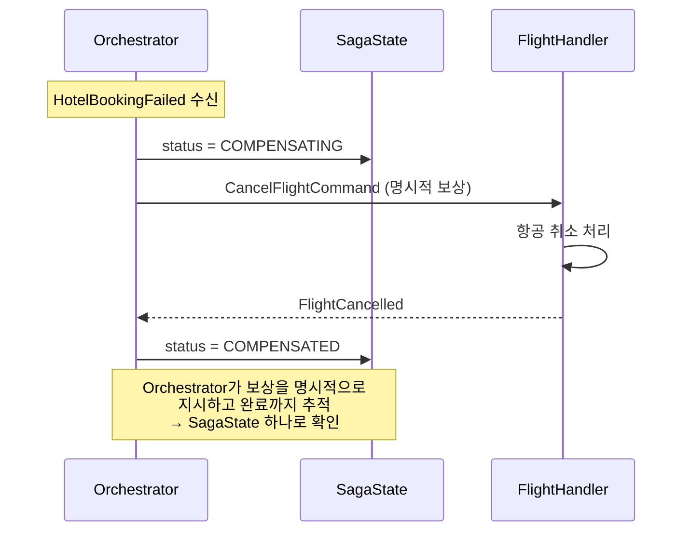
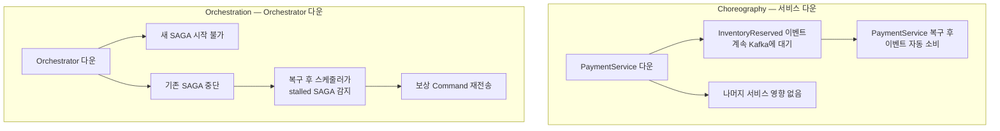
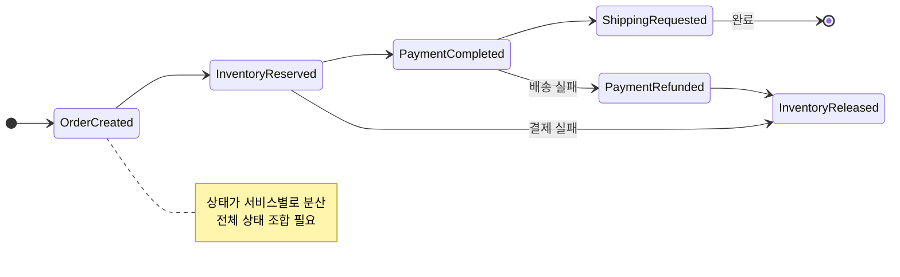
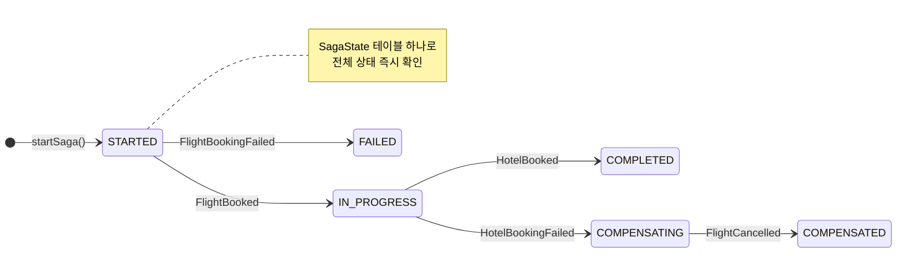
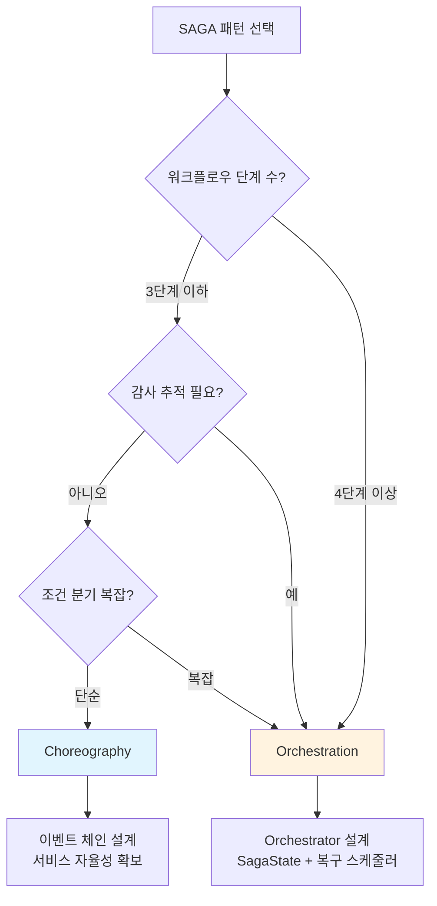

# Ch09 실습 #8: Choreography vs Orchestration 비교 리뷰

## 목적

Ch08(Choreography)과 Ch09(Orchestration)를 직접 구현한 경험을 바탕으로, 두 SAGA 패턴의 트레이드오프를 정리한다. 이론이 아닌 코드 수준의 비교다.

---

## 구현 규모 비교

| 항목 | Ch08 (Choreography) | Ch09 (Orchestration) |
|------|---------------------|----------------------|
| 도메인 | 온라인 주문 | 여행 예약 |
| 단계 수 | 4 (주문→재고→결제→배송) | 2 (항공→호텔) |
| 서비스 수 | 4 | 2 |
| 보상 경로 | 3 | 1 |
| 조정자 | 없음 | TripSagaOrchestrator |
| Java 파일 수 | ~25 | ~20 |
| 실습 항목 | 8 | 8 |

Ch09가 2단계로 단순하지만 Orchestrator, Scheduler, ProcessedCommand 등 인프라 코드가 추가된다.

---

## 아키텍처 비교

### 통신 패턴

**Choreography**: 이벤트 체인 (각 서비스가 자발적으로 반응)



**Orchestration**: Command/Event (Orchestrator가 지시)



### 핵심 차이: "누가 다음 단계를 결정하는가?"

| | Choreography | Orchestration |
|---|---|---|
| 다음 단계 결정 | 각 서비스가 이벤트를 발행하면 다음 서비스가 자발적 반응 | Orchestrator가 이벤트를 보고 다음 Command 결정 |
| 워크플로우 위치 | 분산 (각 서비스의 @KafkaListener) | 집중 (TripSagaOrchestrator) |
| 서비스의 지식 | 자기 도메인만 | 자기 도메인만 (동일) |

---

## 보상 비교

### Choreography (Ch08) — 배송 실패 보상 흐름



보상 트리거: 각 서비스가 실패 이벤트를 듣고 **자발적으로** 보상 수행.
추적: 보상이 완료되었는지 확인하려면 여러 서비스의 로그를 모아야 함.

### Orchestration (Ch09) — 호텔 실패 보상 흐름



보상 트리거: Orchestrator가 실패 이벤트를 듣고 **명시적으로** 보상 Command 발행.
추적: SagaState 테이블 하나로 "어디까지 보상했는지" 즉시 확인 가능.

### 보상 추적성 비교

| 항목 | Ch08 | Ch09 |
|------|------|------|
| 상태 추적 | ProcessedEvent 재활용 + SagaStatusController | SagaState 전용 엔티티 |
| 보상 진행률 | 여러 서비스의 ProcessedEvent를 조합해야 확인 | SagaState.status 하나로 확인 |
| 관측성 구축 | 직접 구축 필요 (SagaMdc + 상태 API) | 기본 내장 (SagaState가 전체 상태 보유) |

---

## 멱등성 비교

| 항목 | Ch08 | Ch09 |
|------|------|------|
| 엔티티 | ProcessedEvent | ProcessedCommand |
| 복합 키 | (correlationId, eventType) | (sagaId, commandType) |
| 적용 위치 | 서비스 4개 × 리스너 N개 | Handler 2개 |
| 추가 보호 | — | @Version 낙관적 잠금 |
| 패턴 | preemptive acquire (동일) | preemptive acquire (동일) |

Orchestration의 장점: 멱등성 체크 지점이 적다. Handler 수 = 서비스 수이므로, 서비스가 많을수록 차이가 커진다.

---

## 장애 복구 비교

| 항목 | Ch08 | Ch09 |
|------|------|------|
| 단일 장애점 | 없음 | Orchestrator |
| 복구 메커니즘 | Kafka at-least-once + 멱등성 | 복구 스케줄러 + 멱등성 |
| 타임아웃 | 구현 안 함 (학습 범위 외) | @Scheduled 스케줄러 (30초 주기) |
| Stalled 복구 | 해당 없음 | @Scheduled 스케줄러 (1분 주기) |

Choreography는 서비스가 독립적이므로 한 서비스 다운이 전체를 멈추지 않는다 (다운스트림만 영향). Orchestration은 Orchestrator 다운 시 새 SAGA를 시작할 수 없다 (기존 SAGA는 복구 가능).

### 장애 시나리오 비교



---

## 상태 전이 비교

### Ch08 Choreography — 암묵적 상태



### Ch09 Orchestration — 명시적 상태



---

## 테스트 비교

| 항목 | Ch08 | Ch09 |
|------|------|------|
| 단위 테스트 | 각 서비스별 (4개) | Orchestrator 1개 + Handler 2개 |
| 통합 테스트 | 전체 이벤트 체인 (추적 어려움) | Orchestrator 중심 (추적 용이) |
| 실패 시뮬레이션 | 각 서비스에 실패 조건 | Handler에 실패 조건 (동일) |
| 타임아웃 테스트 | — | 스케줄러 수동 호출로 검증 |

Orchestration의 장점: 전체 워크플로우가 Orchestrator에 집중되어 있으므로 "어디서 뭐가 잘못됐는지" 테스트에서 즉시 파악 가능.

---

## 안티패턴 체크리스트

### 1. God Orchestrator

Orchestrator가 비즈니스 로직까지 포함하면 거대한 단일체가 된다.

**현재 구현 검증**: TripSagaOrchestrator는 상태 전이 + Command 발행만 담당. 예약 로직(ID 생성, 실패 판정)은 Handler에 있다. → **위반 없음**

### 2. 동기 호출 혼합

Orchestrator가 일부 서비스를 HTTP로 직접 호출하면 Kafka 트랜잭션의 원자성이 깨진다.

**현재 구현 검증**: 모든 통신이 Kafka 토픽 기반. HTTP 호출 없음. → **위반 없음**

### 3. 보상 누락

새 단계를 추가했을 때 보상 로직을 빠뜨리면 데이터 불일치가 발생한다.

**현재 구현 검증**: 2단계만 있고, 각 실패 시나리오(Step1 실패, Step2 실패)의 보상이 모두 구현됨. 통합 테스트로 검증됨. → **위반 없음**

---

## 선택 기준 정리

| 기준 | Choreography | Orchestration |
|------|-------------|---------------|
| **서비스 결합도** | 낮음 (이벤트만 의존) | 높음 (Orchestrator가 모든 서비스 인지) |
| **워크플로우 가시성** | 낮음 (분산) | 높음 (집중) |
| **신규 서비스 추가** | 쉬움 (이벤트 구독만) | 어려움 (Orchestrator 수정) |
| **복잡한 조건 분기** | 어려움 | 적합 |
| **감사/추적** | 어려움 (직접 구축) | 쉬움 (기본 내장) |
| **단일 장애점** | 없음 | Orchestrator |
| **학습 난이도** | 이벤트 흐름 이해 필요 | 상태 머신 이해 필요 |

### 실무 선택 플로우차트



- **Choreography**: 3단계 이하 단순 워크플로우, 서비스 독립 진화 중요, 마이크로서비스 팀 자율성 강조
- **Orchestration**: 4단계 이상 복잡한 워크플로우, 금융/의료 감사 추적, 조건 분기 많은 비즈니스
- **혼용 가능**: 같은 시스템에서 단순한 흐름은 Choreography, 복잡한 핵심 프로세스는 Orchestration

---

## DB 기반 vs Event Sourcing 상태 관리

현재 구현은 DB 기반(SagaState JPA 엔티티)을 선택했다.

| 항목 | DB 기반 (현재) | Event Sourcing |
|------|--------------|----------------|
| 조회 | 즉시 (SELECT) | 이벤트 리플레이 필요 |
| 구현 복잡도 | 낮음 | 높음 (이벤트 스토어, 스냅샷) |
| 이력 | 최신 상태만 | 전체 이력 보존 |
| 디버깅 | 현재 상태만 확인 | 과거 시점 재현 가능 |
| 적합 상황 | 대부분의 SAGA | 감사 이력 필수, 시간여행 디버깅 |

학습 프로젝트에서는 DB 기반이 적합하다. Event Sourcing은 이벤트 스토어 인프라 + CQRS 패턴이 추가로 필요하여 학습 초점이 분산된다.

---

## 대안 패턴 비교

### WorkflowStep + WebClient (동기 Reactive)

```java
public interface WorkflowStep {
    Mono<Boolean> process();
    Mono<Boolean> revert();
}
```

- 장점: 코드가 간결, Kafka 인프라 불필요
- 단점: 동기 호출이므로 서비스 간 강결합, 장애 전파
- 적합: 서비스 2~3개, 내부 서비스 간 통신

### Spring State Machine

- 장점: 상태 전이 검증이 프레임워크 수준에서 보장
- 단점: 학습 곡선, Kafka 통합 복잡, 과도한 추상화
- 적합: 상태 전이가 매우 복잡한 도메인 (보험 심사, 대출 승인)

### 현재 구현 (Kafka 기반 Orchestration)

- 장점: 비동기 통신, 느슨한 결합, CTP 원자성
- 단점: Kafka 인프라 필요, 메시지 직렬화 복잡도
- 적합: 마이크로서비스 환경, 이벤트 기반 아키텍처
