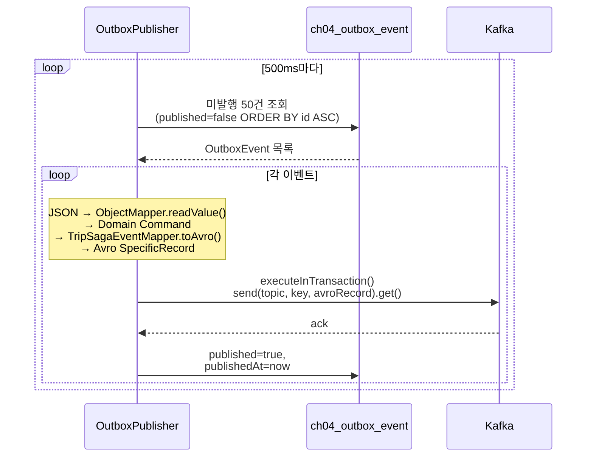
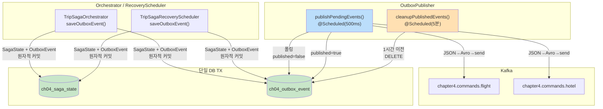

# Ch09 실습 #9: Transactional Outbox 패턴

## 목적

실습 #5에서 확인한 DB+Kafka Dual-Write 불일치 문제를 Transactional Outbox 패턴으로 근본적으로 해결한다. DB 커밋 후 Kafka 발행 실패로 SAGA가 멈추는 시나리오를 원천 차단하고, 기존 Recovery Scheduler의 2분 타임아웃 보상에 의존하지 않는 구조로 개선한다.

---

## Before/After: 무엇이 바뀌었나

### Before (Dual-Write)

```
@Transactional
startSaga() {
    sagaStateRepository.save(state);   ── DB TX ──┐
}                                                  │ 커밋
                                                   ▼
kafkaTemplate.send(BookFlightCommand); ── Kafka ── ❌ 실패 가능!
```

DB 커밋과 Kafka 발행이 별도 트랜잭션이다. DB는 커밋됐는데 Kafka 발행이 실패하면 SagaState는 `STARTED`인데 BookFlightCommand는 전달되지 않는 불일치가 발생한다. RecoveryScheduler가 2분 후 타임아웃으로 감지하여 보상하지만, 이는 "불일치를 허용하고 나중에 보상"하는 방식이다.

### After (Transactional Outbox)

```
@Transactional
startSaga() {
    sagaStateRepository.save(state);       ─┐
    outboxEventRepository.save(outboxEvent); ├── 단일 DB TX → 원자적 커밋
}                                           ─┘

OutboxPublisher (비동기 500ms 폴링)
    outbox 미발행 조회 → Kafka 전송 → published=true
```

SagaState와 OutboxEvent가 같은 DB 트랜잭션에서 커밋된다. 둘 다 저장되거나 둘 다 롤백되므로 불일치가 원천적으로 불가능하다. Kafka 발행은 별도 Publisher가 폴링으로 처리하며, 실패해도 다음 폴링에서 재시도한다.

---

## 변경/생성된 파일 (5개)

| 파일 | 작업 | 변경 내용 |
|------|------|----------|
| `OutboxEvent` | **신규** | Outbox 엔티티 — `ch04_outbox_event` 테이블 |
| `OutboxEventRepository` | **신규** | 미발행 폴링 쿼리 + 발행 완료 정리 JPQL |
| `OutboxPublisher` | **신규** | 폴링 CDC 발행자 — 500ms 폴링, JSON→Avro→Kafka |
| `TripSagaOrchestrator` | 수정 | `kafkaTemplate` → `outboxEventRepository` + `objectMapper` |
| `TripSagaRecoveryScheduler` | 수정 | 동일하게 outbox 방식으로 변경 |

---

## OutboxEvent 엔티티

### 테이블 설계

```
ch04_outbox_event
├── id             BIGSERIAL PK    ← 발행 순서 보장 (ORDER BY id ASC)
├── aggregate_id   VARCHAR         ← sagaId (그룹핑/추적용)
├── topic          VARCHAR         ← Kafka 대상 토픽
├── message_key    VARCHAR         ← Kafka 메시지 키 (sagaId)
├── command_type   VARCHAR         ← "BookFlightCommand" 등 (역직렬화 키)
├── payload        TEXT            ← JSON 직렬화된 Command
├── published      BOOLEAN         ← 발행 완료 여부
├── created_at     TIMESTAMP       ← @PrePersist
└── published_at   TIMESTAMP       ← 발행 완료 시각
```

인덱스: `(published, id)` — 미발행 이벤트를 id 순으로 빠르게 조회하기 위한 복합 인덱스.

### 왜 JSON인가?

| 방식 | 장점 | 단점 |
|------|------|------|
| **JSON** (채택) | SQL로 payload 직접 확인 가능, 디버깅 용이 | 직렬화/역직렬화 비용 |
| Avro byte[] | 스키마 진화 내장, 크기 작음 | DB에서 읽을 수 없음, 디버깅 어려움 |
| Java Serializable | 구현 단순 | 버전 호환성 문제, 보안 취약 |

JSON을 선택한 이유: outbox 테이블은 운영 중 직접 조회할 일이 많다. `SELECT payload FROM ch04_outbox_event WHERE aggregate_id = ?`로 어떤 Command가 발행되었는지 바로 확인할 수 있다. Jackson은 Java record를 canonical constructor로 역직렬화하므로 추가 어노테이션이 불필요하다.

---

## OutboxEventRepository

```java
// 폴링: 미발행 이벤트를 id 오름차순으로 조회
List<OutboxEvent> findByPublishedFalseOrderByIdAsc(Pageable pageable);

// 정리: 발행 완료된 오래된 레코드 삭제
@Modifying
@Query("DELETE FROM OutboxEvent e WHERE e.published = true AND e.publishedAt < :threshold")
int deletePublishedBefore(@Param("threshold") Instant threshold);
```

`Pageable`로 배치 크기를 제어한다. Publisher에서 `PageRequest.of(0, 50)`으로 호출하여 한 번에 50건씩 처리한다.

---

## TripSagaOrchestrator 변경

### 핵심: publishCommand() → saveOutboxEvent() 교체

```java
// Before
private final KafkaTemplate<String, Object> kafkaTemplate;

private void publishCommand(String topic, String sagaId, Object avroRecord) {
    kafkaTemplate.send(topic, sagaId, avroRecord)
            .whenComplete((result, ex) -> { ... });
}

// After
private final OutboxEventRepository outboxEventRepository;
private final ObjectMapper objectMapper;

private void saveOutboxEvent(String topic, String sagaId,
                              String commandType, Object command) {
    OutboxEvent event = OutboxEvent.builder()
            .aggregateId(sagaId).topic(topic).messageKey(sagaId)
            .commandType(commandType)
            .payload(objectMapper.writeValueAsString(command))
            .published(false).build();
    outboxEventRepository.save(event);
}
```

### 변경 지점 3곳

| 메서드 | Before | After |
|--------|--------|-------|
| `startSaga()` | `publishCommand(FLIGHT_COMMAND_TOPIC, sagaId, toAvro(cmd))` | `saveOutboxEvent(FLIGHT_COMMAND_TOPIC, sagaId, "BookFlightCommand", cmd)` |
| `onFlightBooked()` | `publishCommand(HOTEL_COMMAND_TOPIC, ...)` | `saveOutboxEvent(HOTEL_COMMAND_TOPIC, ..., "BookHotelCommand", cmd)` |
| `onHotelBookingFailed()` | `publishCommand(FLIGHT_COMMAND_TOPIC, ...)` | `saveOutboxEvent(FLIGHT_COMMAND_TOPIC, ..., "CancelFlightCommand", cmd)` |

### import 변경

```diff
- import org.springframework.beans.factory.annotation.Qualifier;
- import org.springframework.kafka.core.KafkaTemplate;
- import com.study.redpanda.ch04.event.mapper.TripSagaEventMapper;  // (이벤트 수신 시 toDomain()은 유지)
+ import com.fasterxml.jackson.core.JsonProcessingException;
+ import com.fasterxml.jackson.databind.ObjectMapper;
+ import com.study.redpanda.ch04.domain.OutboxEvent;
+ import com.study.redpanda.ch04.repository.OutboxEventRepository;
```

`TripSagaEventMapper`의 `toDomain()` 메서드는 이벤트 수신 리스너에서 여전히 사용하므로 import가 유지된다. 제거된 것은 `toAvro()` 호출 — 이 책임이 OutboxPublisher로 이동했다.

### TX 보장 메커니즘

```
onFlightBooked() 호출 시:
  ┌─ @Transactional (DB TX) ──────────────────────────────┐
  │  1. SagaState UPDATE (STARTED → IN_PROGRESS)           │
  │  2. OutboxEvent INSERT (BookHotelCommand, JSON)         │
  │  → 커밋 성공: 둘 다 저장됨                              │
  │  → 커밋 실패: 둘 다 롤백됨 (Kafka 오프셋도 미커밋)       │
  └────────────────────────────────────────────────────────┘
```

---

## TripSagaRecoveryScheduler 변경

### 동일 패턴 적용

Orchestrator와 동일하게 `kafkaTemplate` → `outboxEventRepository` + `objectMapper`로 교체했다.

### 생성자 변경

```java
// Before
public TripSagaRecoveryScheduler(
        SagaStateRepository sagaStateRepository,
        @Qualifier("ch04KafkaTemplate") KafkaTemplate<String, Object> kafkaTemplate,
        TransactionTemplate transactionTemplate)

// After
public TripSagaRecoveryScheduler(
        SagaStateRepository sagaStateRepository,
        OutboxEventRepository outboxEventRepository,
        ObjectMapper objectMapper,
        TransactionTemplate transactionTemplate)
```

### 변경 지점 2곳

| 메서드 | 변경 |
|--------|------|
| `handleTimeout()` | `kafkaTemplate.send(FLIGHT_COMMAND_TOPIC, ...)` → `saveOutboxEvent(FLIGHT_COMMAND_TOPIC, ..., "CancelFlightCommand", cmd)` |
| `retryCompensation()` | 동일 패턴으로 교체 |

### TX 보장

`transactionTemplate.executeWithoutResult()` 내에서 `saveOutboxEvent()`가 호출되므로, SagaState UPDATE + OutboxEvent INSERT가 동일 DB TX에서 커밋된다.

---

## OutboxPublisher (폴링 CDC)

### 발행 흐름



### 페이로드 직렬화/역직렬화

```
쓰기 (Orchestrator/RecoveryScheduler):
  Domain Command (Java record) → ObjectMapper.writeValueAsString() → JSON → outbox.payload

읽기 (Publisher):
  outbox.payload → ObjectMapper.readValue(json, CommandClass) → TripSagaEventMapper.toAvro() → Kafka
```

commandType 문자열로 역직렬화 대상 클래스를 결정한다:

```java
return switch (event.getCommandType()) {
    case "BookFlightCommand"  -> toAvro(objectMapper.readValue(json, BookFlightCommand.class));
    case "BookHotelCommand"   -> toAvro(objectMapper.readValue(json, BookHotelCommand.class));
    case "CancelFlightCommand"-> toAvro(objectMapper.readValue(json, CancelFlightCommand.class));
    default -> throw new IllegalArgumentException("Unknown: " + event.getCommandType());
};
```

### executeInTransaction() 사용 이유

`ch04KafkaTemplate`에 `transactional.id`가 설정되어 있다. `@KafkaListener` 내부에서는 KafkaTransactionManager가 자동으로 TX를 시작하지만, `@Scheduled` 메서드에서는 Kafka TX가 자동으로 시작되지 않는다. 따라서 `executeInTransaction()`으로 명시적 TX를 열어 `.get()`으로 동기 전송한다.

### 정리 스케줄

```
@Scheduled(fixedDelay = 300_000)  // 5분마다
cleanupPublishedEvents()
  → DELETE FROM outbox WHERE published=true AND publishedAt < (now - 1시간)
```

발행 완료된 레코드를 영구 보관할 필요가 없으므로 1시간 후 삭제한다. 디버깅이 필요한 경우 publishedAt 기준으로 1시간의 여유가 있다.

---

## 아키텍처 전체도



---

## 실습 #5와의 연결

실습 #5에서 DB+Kafka 원자성 해결 방법을 3단계로 정리했다:

| 방식 | DB+Kafka 원자성 | 복잡도 | 적합 상황 |
|------|----------------|--------|----------|
| Kafka TX만 (CTP) | Kafka 내부만 보장 | 낮음 | Kafka-to-Kafka 변환 |
| DB TX + Kafka TX 체이닝 | 대부분 안전, 간극 존재 | 중간 | ~~현재 구현~~ (이전 구현) |
| **Transactional Outbox** | **완벽한 원자성** | 높음 | **현재 구현** |

실습 #5 시점에서는 2번(체이닝)이었고 Recovery Scheduler가 간극을 보완했다. 이번 실습에서 3번(Outbox)으로 승격하여 간극 자체를 제거했다.

### Recovery Scheduler의 역할 변화

| 항목 | Before (Dual-Write) | After (Outbox) |
|------|---------------------|----------------|
| 타임아웃 감지 | Kafka 발행 실패도 타임아웃으로 잡힘 | 순수하게 서비스 무응답만 감지 |
| 보상 Command 전송 | `kafkaTemplate.send()` — 이것도 실패 가능 | `saveOutboxEvent()` — DB TX 보장 |
| Stalled 복구 | 재전송도 Kafka 직접 발행 | 재전송도 outbox 경유 |

Recovery Scheduler는 여전히 필요하다. Outbox가 해결하는 것은 "DB와 Kafka 간 불일치"이지, "서비스가 응답하지 않는 상황"은 아니기 때문이다. 다만 보상 Command를 전송하는 방식이 Kafka 직접 발행에서 outbox 저장으로 바뀌어, 보상 자체의 신뢰성도 향상되었다.

---

## Handler(Consumer) 변경 불필요 — 왜?

Outbox 패턴은 Producer 측의 변경이다. Consumer(FlightCommandHandler, HotelCommandHandler)는 여전히 Kafka에서 Avro 메시지를 수신하므로 변경이 없다.

```
Before: Orchestrator → kafkaTemplate.send(Avro) → Kafka → Handler
After:  Orchestrator → outbox(JSON) → Publisher → kafkaTemplate.send(Avro) → Kafka → Handler
                                       ▲
                                    여기만 추가됨
```

Handler 입장에서 Kafka 메시지의 형식(Avro)과 토픽이 동일하므로, Outbox 도입 여부를 알 필요가 없다. 실습 #6에서 추가한 ProcessedCommand 멱등성도 그대로 동작한다.

---

## 폴링 CDC vs Debezium CDC

이번 구현은 폴링 방식이다. 프로덕션에서는 Debezium CDC가 더 적합할 수 있다.

| 항목 | 폴링 CDC (현재) | Debezium CDC |
|------|----------------|-------------|
| 지연 | 500ms (폴링 간격) | 수십 ms (WAL 기반) |
| DB 부하 | 주기적 SELECT 쿼리 | WAL 읽기 (쿼리 없음) |
| 순서 보장 | ORDER BY id ASC | WAL 순서 보장 |
| 인프라 | 추가 인프라 불필요 | Debezium + Kafka Connect 필요 |
| 구현 복잡도 | 낮음 (Spring @Scheduled) | 높음 (커넥터 설정 + 운영) |
| 적합 상황 | PoC, 낮은 처리량 | 프로덕션, 높은 처리량 |

Debezium 설정 예시는 `OutboxPublisher.java` Javadoc에 포함했다. PostgreSQL의 logical replication slot을 통해 `ch04_outbox_event` 테이블의 INSERT를 실시간으로 감지하고, Outbox Event Router SMT로 payload를 올바른 토픽에 라우팅한다.

---

## 빌드 결과

`./gradlew compileJava` → **BUILD SUCCESSFUL**
