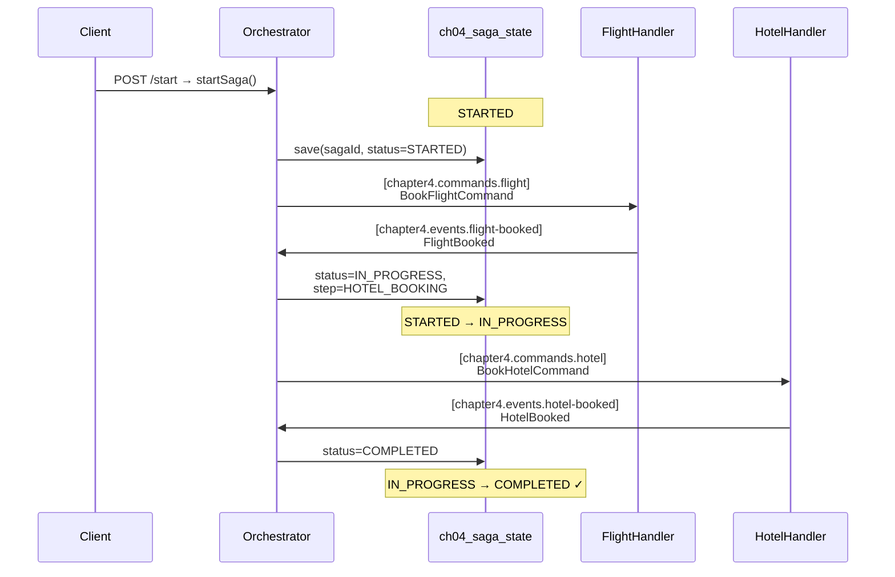
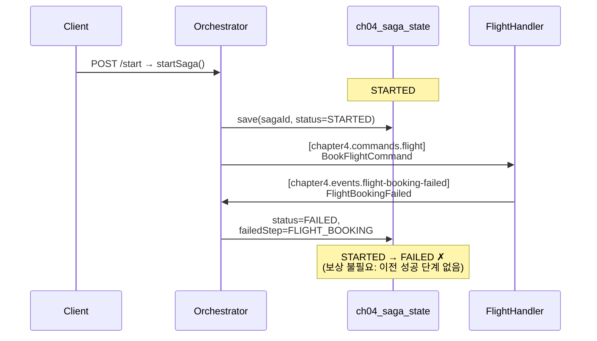
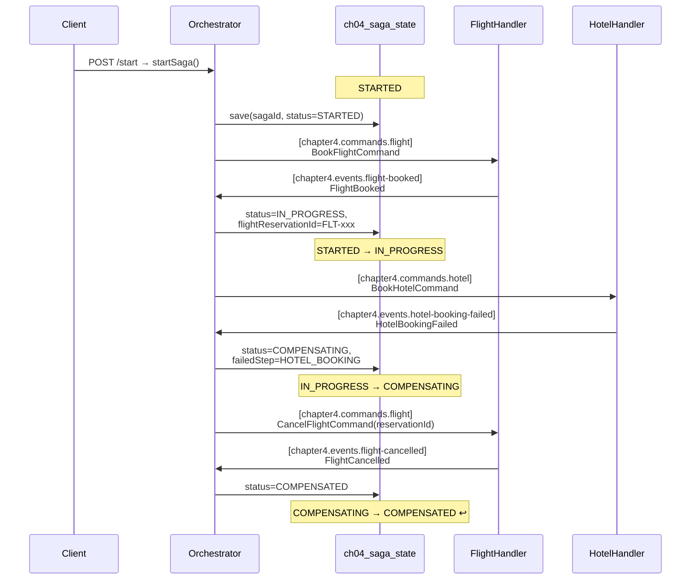
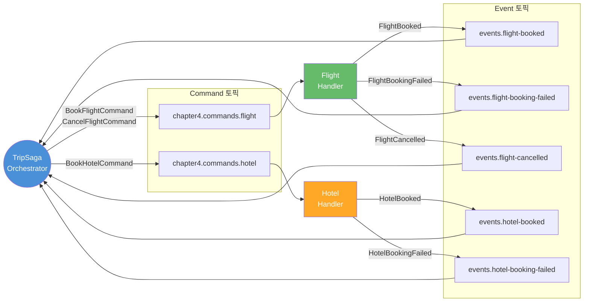
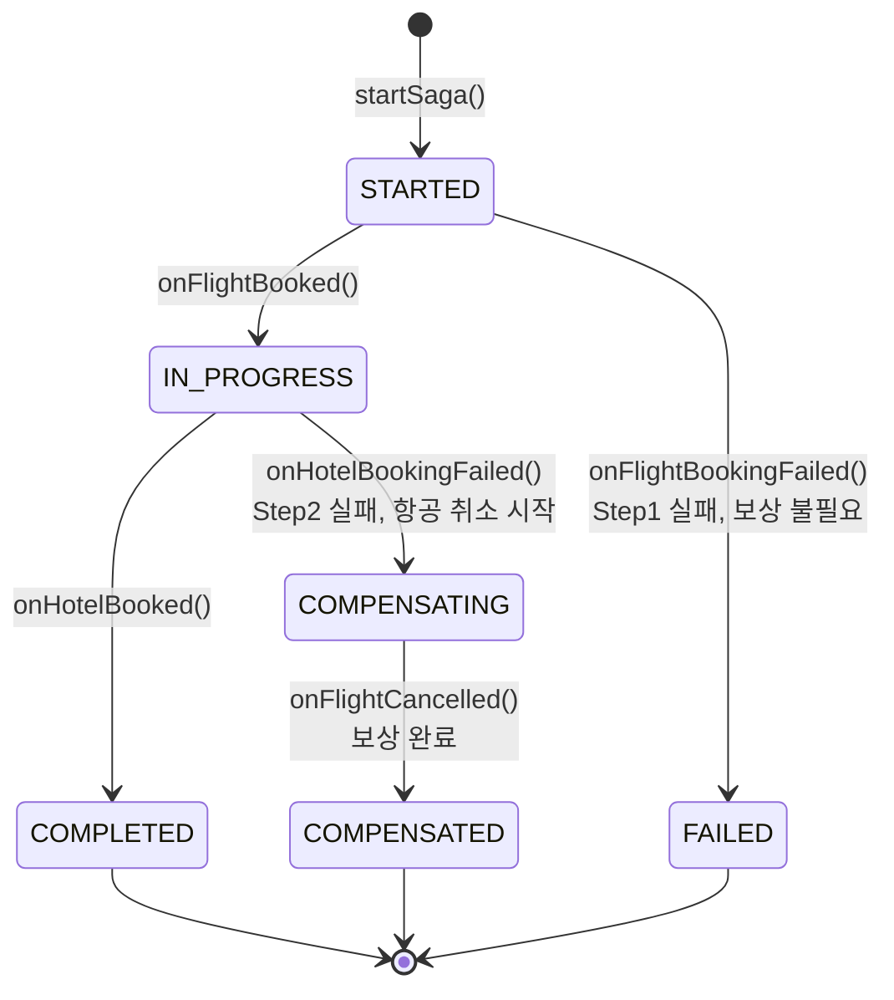
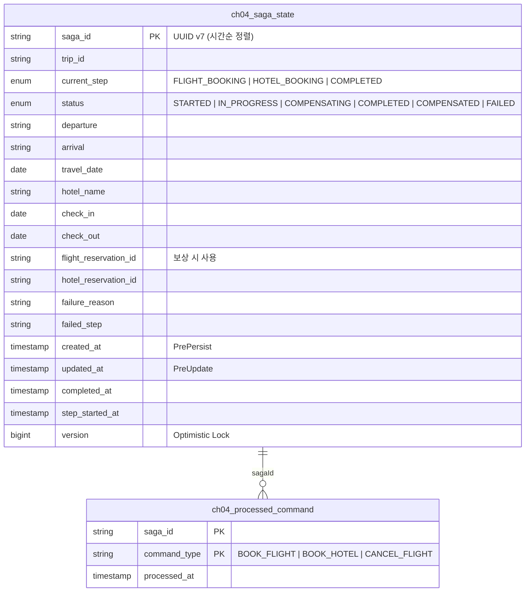

# Ch09 SAGA Orchestration — 내부 로직 흐름도

---

## 시나리오별 흐름도 (메서드 + 토픽 + 상태)

### A: 정상 흐름 (COMPLETED)



### B: 항공 실패 (FAILED)



### C: 호텔 실패 → 보상 (COMPENSATED)



---

## 전체 토픽 구조



---

## 상태 전이 다이어그램



---

## DB 테이블 구조



---

## 시나리오 비교 요약

| | A: 정상 | B: 항공실패 | C: 호텔실패+보상 |
|---|---------|-----------|---------------|
| **최종 status** | `COMPLETED` | `FAILED` | `COMPENSATED` |
| **상태 전이** | STARTED→IN_PROGRESS→COMPLETED | STARTED→FAILED | STARTED→IN_PROGRESS→COMPENSATING→COMPENSATED |
| **version** | 2 | 1 | 3 |
| **flight_reservation_id** | FLT-xxx | null | FLT-xxx (취소됨) |
| **hotel_reservation_id** | HTL-xxx | null | null |
| **보상 실행** | 없음 | 없음 | CancelFlightCommand |
| **processed_commands** | 2건 | 1건 | 3건 |

---

## DB + Kafka 트랜잭션 분석

### 현재 구조: 원자적인가?

**아니다.** DB TX와 Kafka TX는 독립적으로 커밋되며 진정한 원자성은 없다.

#### 메서드별 트랜잭션 경계

| 메서드 | DB TX | Kafka TX | Dual-Write 갭 |
|--------|-------|----------|---------------|
| `startSaga()` | `@Transactional` (JPA) | 없음 (REST 호출) | DB INSERT 성공 → send 실패 시 STARTED로 stuck |
| `@KafkaListener` 메서드들 | `@Transactional` (JPA) | 컨테이너 관리 | DB 커밋 성공 → Kafka TX 커밋 실패 시 offset 미커밋 → 메시지 재수신 |

#### 커밋 순서 (KafkaListener 메서드)

```
메서드 진입
  ├─ Kafka TX 시작 (컨테이너)
  ├─ DB TX 시작 (@Transactional)
  │   ├─ DB 조작 (SagaState UPDATE)
  │   └─ DB TX 커밋 ← 여기서 DB 확정
  ├─ kafkaTemplate.send() ← Kafka TX에 포함
  └─ Kafka TX 커밋 ← 여기서 offset + send 확정
                     ↑ 이 사이에서 실패하면 불일치
```

#### 현재 보상 메커니즘

- **RecoveryScheduler**: `stepStartedAt` 기준 타임아웃 감지 → stuck 상태를 FAILED/재시도
- **processed_command 테이블**: 중복 Command 처리 방지 (사실상 **Inbox 패턴의 원시적 형태**)

### Outbox 패턴 vs Inbox 패턴

#### Outbox 패턴 (Producer 측)

DB에 이벤트를 함께 저장 → CDC(Debezium) 또는 폴링으로 Kafka에 발행.
하나의 DB TX로 "비즈니스 데이터 + 발행할 메시지"를 원자적으로 커밋한다.

```
현재: DB.save(state) → kafka.send(command)  ← 2개 시스템, 원자성 없음
개선: DB.save(state) + DB.save(outbox)      ← 1개 TX, 원자성 보장
      → CDC/Poller가 outbox → Kafka 발행
```

**해결하는 문제**: Orchestrator의 `publishCommand()`에서 발생하는 Dual-Write

#### Inbox 패턴 (Consumer 측)

수신한 메시지를 inbox 테이블에 저장 → 중복 체크 → 처리.
"메시지 수신 + 처리"를 멱등하게 만든다.

**현재 코드에 이미 존재**: `ch04_processed_command` 테이블이 Inbox 역할을 한다.
`tryAcquire(sagaId, commandType)`로 중복 처리를 방지하고 있다.

#### 둘 다 필요한가?

| 패턴 | 역할 | 현재 상태 | 필수도 |
|------|------|----------|--------|
| **Outbox** | 발행 보장 (Producer) | 없음 → Dual-Write 갭 존재 | **높음** — 없으면 DB↔Kafka 불일치 발생 |
| **Inbox** | 멱등 소비 (Consumer) | `processed_command`로 부분 구현 | **높음** — Kafka는 at-least-once이므로 중복 수신 불가피 |

**결론: 사실상 둘 다 필수다.**

- **Outbox 없이**: DB 커밋 후 Kafka 발행 실패 → 메시지 유실 (RecoveryScheduler가 보상하지만, 타임아웃까지 지연 발생)
- **Inbox 없이**: Kafka 재전송/리밸런싱 → 같은 메시지 중복 처리 → 상태 꼬임
- 현재 코드는 Outbox는 없고, Inbox는 `processed_command`로 부분 구현한 상태
- Outbox + Inbox 조합이 Saga 정합성의 **사실상 표준 패턴**이며, 둘 중 하나만으로는 한쪽 방향의 실패만 커버됨
