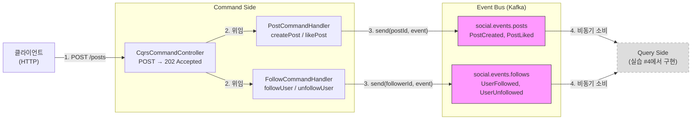

# Command Side 구현

---

## 구현 요약

| 항목 | 내용 |
|------|------|
| 실습 번호 | 2 |
| 주요 파일 | `cqrs/command/*.java`, `cqrs/handler/*.java`, `cqrs/controller/CqrsCommandController.java`, `cqrs/config/CqrsKafkaConfig.java` |
| 테스트 파일 | `http/cqrs-command-side.http` |
| LEARN.md 위치 | 01-cqrs-pattern.md line 157~278 |

## 무엇을 구현했는가

클라이언트가 REST 요청을 보내면 CqrsCommandController가 받아서 해당 Handler에 위임한다. PostCommandHandler는 CreatePostCommand를 받아 PostCreated Avro 이벤트를 생성하고, `kafkaTemplate.send(postId, event)`로 social.events.posts 토픽에 발행한다. partition key는 postId여서 같은 게시물의 모든 이벤트(생성, 좋아요)가 동일 파티션에 순서대로 쌓인다.

FollowCommandHandler도 같은 패턴이다. FollowUserCommand를 UserFollowed 이벤트로 변환하고 social.events.follows 토픽에 발행하되, key는 followerId를 쓴다. 한 사용자의 팔로우/언팔로우 이벤트 순서가 보장되어야 타임라인이 깨지지 않기 때문이다.

Controller는 모든 엔드포인트에서 202 Accepted와 함께 eventId를 반환한다. 다이어그램에서 Query Side가 점선인 이유는 아직 구현 전이기 때문이고, 실습 #4에서 Kafka Streams로 이벤트를 소비하여 State Store(읽기 모델)를 구성한다.

CqrsKafkaConfig는 Producer만 구성했다. 멱등 프로듀서(enable.idempotence=true)로 네트워크 재전송 중복을 방지하고, TopicRecordNameStrategy로 한 토픽에 여러 Avro 타입을 허용한다. `ProducerListener`를 KafkaTemplate에 등록하여 모든 send()의 성공/실패 로그를 공통 처리한다. Handler마다 `whenComplete()`를 반복하지 않아도 된다. Consumer 설정은 Query Side 구현 시 추가한다.

## 왜 이렇게 구현했는가

Command에 eventId와 timestamp를 넣지 않은 이유부터 설명한다. Command는 "게시물을 만들어라"라는 의도를 표현할 뿐이고, 이벤트는 "게시물이 만들어졌다"라는 사실을 기록한다. eventId나 발생 시각은 사실이 확정되는 시점, 즉 Handler가 이벤트를 생성하는 그 순간에 정해져야 한다. 클라이언트가 eventId를 생성하면 재전송 시 같은 ID가 들어오는 문제가 생기고, timestamp를 클라이언트 시간으로 잡으면 시계 동기화 이슈가 따라온다. Command record는 userId와 content만 담고, 나머지는 Handler의 책임으로 남겼다.

partition key 선택은 같은 Aggregate의 이벤트 순서를 보장하기 위한 결정이다. PostCreated와 PostLiked 모두 postId를 키로 사용하면, 한 게시물에 대한 모든 이벤트가 같은 파티션에 들어간다. Kafka는 파티션 내 순서만 보장하므로, 이렇게 해야 "생성 → 좋아요" 순서가 Query Side에서도 유지된다. 팔로우 이벤트는 followerId를 키로 잡았는데, 한 사용자의 팔로우/언팔로우 순서가 뒤바뀌면 타임라인 구성이 깨지기 때문이다.

202 Accepted를 반환하는 건 CQRS에서 Command 처리의 핵심 특성을 반영한다. 이벤트가 Kafka에 발행된 시점에 Query Model은 아직 갱신되지 않은 상태이고, 클라이언트가 즉시 GET으로 조회하면 데이터가 없을 수 있다. 200 OK는 "요청이 완료되었다"는 뜻인데, CQRS에서 Command 처리는 이벤트 발행까지만이지 읽기 모델 반영까지가 아니다. 202는 "수락했고, 비동기로 처리 중"이라는 의미여서 eventual consistency 모델에 정확히 맞는다. 응답 본문에 eventId를 포함시켜 클라이언트가 나중에 상태를 추적할 수 있도록 했다.

CqrsKafkaConfig를 ch04 TripKafkaConfig보다 단순하게 만든 것은 의도적이다. ch04 SAGA는 Consumer가 이벤트를 읽고 → 다시 Produce하는 체인이 있어서 KafkaTransactionManager가 필수였다. Command Side는 REST 요청을 받아 이벤트를 발행할 뿐이므로 Consumer-Producer 체인이 없고, transactionIdPrefix를 설정할 이유가 없다. 멱등 프로듀서(enable.idempotence=true)만 켜서 네트워크 재전송 시 브로커 측 중복을 방지하되, 불필요한 트랜잭션 오버헤드는 피했다. Consumer 설정은 실습 #4(Kafka Streams Topology)에서 Query Side를 구현할 때 추가한다.

TopicRecordNameStrategy를 적용한 이유는 social.events.posts 토픽 하나에 PostCreated와 PostLiked 두 가지 Avro 타입이 들어가기 때문이다. 기본 TopicNameStrategy는 토픽당 하나의 스키마만 허용해서, 두 번째 타입을 발행하는 순간 Schema Registry에서 NAME_MISMATCH 에러가 발생한다. ch04에서 같은 문제를 겪었고 동일한 해법을 적용했다.

## 교차 검증 결과

### Claude 리뷰

~~Handler에서 `kafkaTemplate.send()`의 반환값 `CompletableFuture`를 무시하고 있다.~~ → **수정 완료.** `CqrsKafkaConfig`에 `ProducerListener`를 등록하여 모든 send()에 대해 공통 성공/실패 로그를 남기도록 했다. Handler에서 개별 `whenComplete()`를 반복하지 않아도 된다.

~~`@Qualifier`를 `@RequiredArgsConstructor`의 final 필드에 직접 붙이는 패턴~~ → **수정 완료.** `lombok.config`가 없어서 실제 런타임에 `@Qualifier`가 복사되지 않았다(`required a single bean, but 3 were found` 에러 발생). `@RequiredArgsConstructor`를 제거하고 명시적 생성자에 `@Qualifier`를 직접 지정하는 방식으로 수정했다. ch04 `OutboxPublisher`와 동일한 패턴이다.

eventId와 postId 생성에 `UUID.randomUUID()`(v4, 랜덤)를 사용했는데, UUID v4는 시간 순서를 보장하지 않는다. ch04에서 sagaId에 UUID v7(`UuidCreator.getTimeOrderedEpoch()`)을 쓰는 패턴과 일관성을 맞춰 UUID v7으로 변경했다. UUID v7은 앞 48비트가 밀리초 타임스탬프여서 문자열 정렬이 곧 시간 순서가 된다.

`DELETE /follows`에 `@RequestBody`를 사용했는데, HTTP 스펙상 DELETE 요청의 본문은 "의미 없음(no defined semantics)"이다. 대부분의 클라이언트와 프록시가 본문을 전달하긴 하지만, AWS ALB 같은 일부 로드밸런서가 본문을 제거할 수 있다. 대안으로 `DELETE /follows/{followerId}/{followeeId}` 경로 변수나 쿼리 파라미터를 쓸 수 있지만, 나머지 엔드포인트와의 일관성을 위해 현재 형태를 유지했다.

### Codex 교차 리뷰

(Codex 미사용 환경 — Claude 자체 리뷰만으로 진행)

### 수정 사항

3건 모두 수정 완료: (1) ProducerListener 공통 로그, (2) 명시적 생성자로 @Qualifier 문제 해결, (3) UUID v4→v7 변경. 빌드 검증 통과.

## 핵심 학습 포인트

- **Command와 Event의 책임 경계.** Command는 의도("만들어라")를 담고, Event는 사실("만들어졌다")을 기록한다. eventId, timestamp 같은 메타데이터는 사실이 확정되는 Handler 시점에 생성해야 한다. 클라이언트에서 이 값을 보내면 재전송이나 시계 동기화 문제가 생긴다.

- **202 Accepted는 eventual consistency의 HTTP 표현이다.** CQRS에서 Command 응답은 "이벤트 발행 완료"까지만 보장하고, Query Model 반영은 별도 비동기 프로세스가 담당한다. 200 OK를 쓰면 "완료"라는 잘못된 기대를 주고, 202는 "수락했지만 아직 처리 중"이라는 정확한 의미를 전달한다.

- **partition key = aggregateId는 이벤트 순서 보장의 최소 단위다.** Kafka는 파티션 내 순서만 보장한다. 같은 게시물의 "생성 → 좋아요"가 다른 파티션에 들어가면 Query Side에서 순서가 뒤바뀔 수 있다. aggregateId를 키로 쓰면 한 Aggregate의 모든 이벤트가 같은 파티션에 모인다.

- **트랜잭션은 Consumer-Producer 체인이 있을 때만 필요하다.** REST → Produce만 하는 Command Side에는 KafkaTransactionManager가 불필요하다. 멱등 프로듀서(enable.idempotence)만으로 네트워크 재전송 중복을 방지할 수 있다. 트랜잭션 오버헤드를 넣을 이유가 없으면 넣지 않는다.
