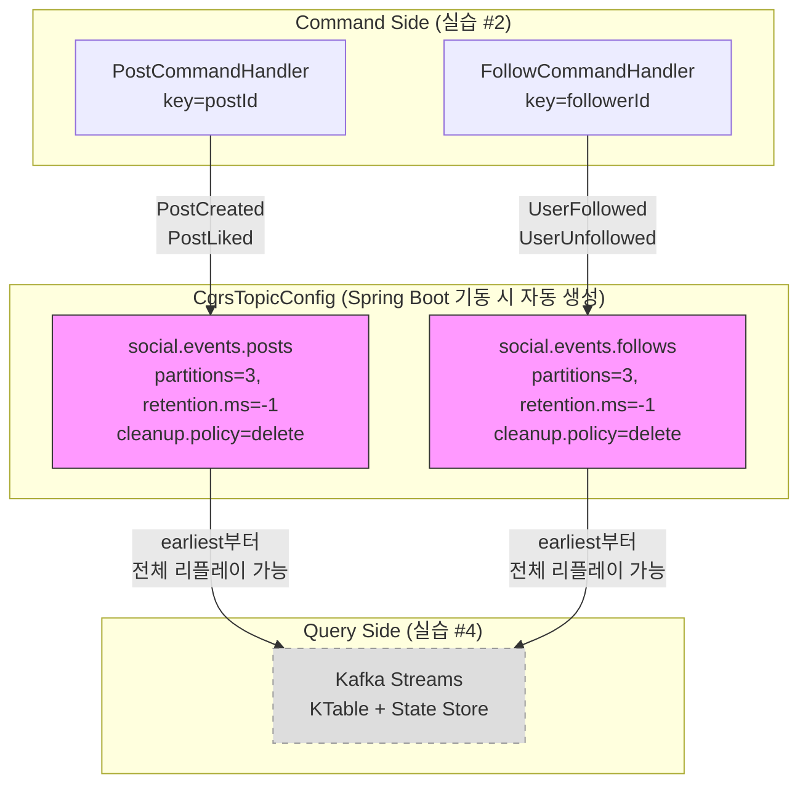

# Event Store 토픽 설계

---

## 구현 요약

| 항목 | 내용 |
|------|------|
| 실습 번호 | 3 |
| 주요 파일 | `cqrs/config/CqrsTopicConfig.java` |
| 테스트 파일 | `http/cqrs-event-store-topic.http` |
| LEARN.md 위치 | 02-event-sourcing-fundamentals.md line 157~225 |

## 토픽-메시지 매핑

| 토픽 | 메시지 (Avro) | Partition Key | 의미 |
|------|--------------|---------------|------|
| `social.events.posts` | **PostCreated** | postId | 게시물 생성 이벤트 |
| `social.events.posts` | **PostLiked** | postId | 게시물 좋아요 이벤트 |
| `social.events.follows` | **UserFollowed** | followerId | 사용자 팔로우 이벤트 |
| `social.events.follows` | **UserUnfollowed** | followerId | 사용자 언팔로우 이벤트 |

하나의 토픽에 여러 Avro 타입이 공존한다. `TopicRecordNameStrategy`로 스키마를 구분하므로, Consumer는 `instanceof`로 이벤트 타입을 분기한다.

---

## 무엇을 구현했는가

`CqrsTopicConfig`는 Spring Boot 기동 시 두 토픽을 자동 생성한다. 두 토픽 모두 `retention.ms=-1`로 이벤트를 영구 보존하며, 이 토픽들이 Event Store 역할을 한다.

실습 #2에서 만든 Command Handler가 이 토픽에 이벤트를 발행하고, 실습 #4에서 만들 Kafka Streams가 이 토픽을 처음부터(earliest) 소비하여 State Store(읽기 모델)를 구성한다. retention이 무한이므로 새 Consumer Group을 만들어 전체 이벤트를 리플레이할 수 있다. 이것이 Event Sourcing의 핵심 가치다.

partition key는 aggregateId를 사용한다. posts 토픽은 postId, follows 토픽은 followerId가 키다. 같은 Aggregate의 모든 이벤트가 동일 파티션에 순서대로 쌓이므로, Consumer가 "생성 → 좋아요" 순서를 항상 보장받는다.

## 왜 이렇게 구현했는가

`retention.ms=-1`을 설정한 이유는 Event Store의 근본 원칙 때문이다. Event Sourcing에서 이벤트는 "일어난 사실"을 기록한다. 사실은 삭제되지 않는다. 은행 거래 내역을 TTL로 자동 삭제하면 안 되는 것과 같다. Kafka의 기본 retention은 7일인데, 이대로 두면 7일 전 이벤트가 사라져서 리플레이할 때 불완전한 상태가 복원된다.

`cleanup.policy=delete`를 선택한 이유는 compact와의 차이에 있다. compact는 같은 키의 최신 값만 남기고 이전 값을 제거한다. CRUD State Store라면 compact가 맞지만, Event Sourcing에서는 같은 postId에 대해 PostCreated → PostLiked → PostLiked가 모두 필요하다. compact를 쓰면 마지막 PostLiked만 남고 나머지가 사라진다. delete + retention=-1 조합이 "모든 이벤트를 영구 보존"하는 유일한 방법이다.

파티션 수를 3으로 잡은 건 학습용 PoC 기준이다. 프로덕션에서는 예상 처리량과 Consumer 수에 맞춰 조정한다. 파티션은 늘릴 수 있지만 줄일 수 없으므로 보수적으로 시작하는 편이 낫다. 중요한 건 파티션 수가 아니라 partition key 설계다. postId를 키로 쓰면 같은 게시물의 이벤트가 항상 같은 파티션에 들어가고, Kafka는 파티션 내 순서만 보장하므로 이 설계가 Aggregate 단위 순서 보장의 최소 단위가 된다.

Kafka/Redpanda가 Event Store로 적합한 이유는 구조적이다. Kafka는 본질적으로 append-only 분산 로그여서 Event Store와 데이터 모델이 동일하다. 관계형 DB로 Event Store를 만들려면 INSERT only 제약, 순서 보장(ORDER BY), 리플레이(전체 스캔), 수평 확장(샤딩)을 모두 직접 구현해야 한다. Kafka는 이 모든 것을 네이티브로 제공한다. Consumer offset을 0으로 리셋하면 전체 리플레이가 자연스럽게 되고, 파티션을 추가하면 처리량이 선형으로 늘어난다.

## 교차 검증 결과

### Claude 리뷰

`CqrsTopicConfig`를 공용 `KafkaTopicConfig`와 분리한 것은 적절하다. ch02 토픽은 학습용(retention 기본)이고, CQRS 토픽은 Event Store(retention 무한)이므로 설정 목적이 다르다. 같은 Config에 두면 의도가 섞인다.

`replicas(1)`은 학습용 단일 브로커 환경이므로 맞다. 프로덕션에서는 최소 3으로 설정해야 한다. `acks=all`과 결합하면 `replicas=1`은 사실상 의미가 없다(ISR이 리더 하나뿐). 하지만 이 PoC의 docker-compose는 Redpanda 1대이므로 1이 맞다.

토픽이 이미 존재할 때 `TopicBuilder`는 설정을 덮어쓰지 않는다. 수동으로 토픽을 만들어 놨다면 retention 설정이 반영되지 않을 수 있다. `rpk topic describe`로 실제 설정을 확인하는 습관이 필요하다.

### 수정 사항

빌드 검증 통과. 리뷰 이슈 없이 진행.

## 핵심 학습 포인트

- **retention.ms=-1은 Event Store의 필수 설정이다.** Event Sourcing에서 이벤트는 "사실"이고 사실은 삭제되면 안 된다. 기본 7일 retention을 그대로 두면 리플레이 시 불완전한 상태가 복원된다. Event Store 토픽은 반드시 무한 보존으로 설정한다.

- **cleanup.policy=delete를 쓰는 이유: compact는 최신 값만 남긴다.** compact는 같은 키의 이전 레코드를 제거하므로, PostCreated → PostLiked 중 PostLiked만 남을 수 있다. Event Sourcing에는 전체 이력이 필요하므로 delete + 무한 retention 조합만 Event Store로 적합하다.

- **partition key = aggregateId는 순서 보장의 최소 단위다.** Kafka는 파티션 내 순서만 보장한다. postId를 키로 쓰면 한 게시물의 모든 이벤트가 같은 파티션에 모이고, Consumer는 항상 "생성 → 좋아요" 순서를 보장받는다. 다른 게시물 간의 순서는 보장할 필요가 없다.

- **Kafka는 Event Store와 구조가 동일하다.** append-only 로그, 파티션 내 순서 보장, 불변 레코드, offset 리셋 리플레이, 수평 확장 — Event Store의 핵심 요구사항을 모두 네이티브로 제공한다. 관계형 DB로 Event Store를 만들면 이 모든 것을 직접 구현해야 한다.
