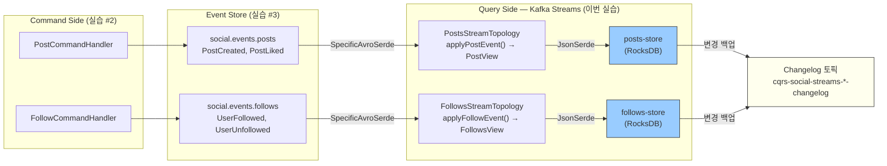

# Kafka Streams Topology 구현

---

## 구현 요약

| 항목 | 내용 |
|------|------|
| 실습 번호 | 4 |
| 주요 파일 | `cqrs/config/CqrsStreamsConfig.java`, `cqrs/query/topology/PostsStreamTopology.java`, `cqrs/query/topology/FollowsStreamTopology.java`, `cqrs/query/model/PostView.java`, `cqrs/query/model/FollowsView.java` |
| 테스트 파일 | `http/cqrs-kafka-streams.http` |
| LEARN.md 위치 | 04-kafka-streams-topology.md line 136~317 |

## 토픽-메시지-스토어 매핑

각 토픽이 어떤 메시지를 운반하고, 어떤 토폴로지가 소비하여 어떤 State Store에 집계하는지를 정리한 표다.

| 토픽 | 메시지 (Avro) | Topology 클래스 | 집계 함수 | State Store | View Model |
|------|--------------|----------------|----------|-------------|------------|
| `social.events.posts` | **PostCreated** | PostsStreamTopology | `applyPostEvent()` → 새 PostView 생성 | posts-store | PostView |
| `social.events.posts` | **PostLiked** | PostsStreamTopology | `applyPostEvent()` → likeCount++, likedBy 추가 | posts-store | PostView |
| `social.events.follows` | **UserFollowed** | FollowsStreamTopology | `applyFollowEvent()` → followees Set에 추가 | follows-store | FollowsView |
| `social.events.follows` | **UserUnfollowed** | FollowsStreamTopology | `applyFollowEvent()` → followees Set에서 제거 | follows-store | FollowsView |

Serde 전략: 입력은 `SpecificAvroSerde`(Avro 이벤트), State Store 저장은 `JsonSerde`(POJO).

---

## 무엇을 구현했는가

CQRS의 "Q"(Query) 쪽을 구현했다. `CqrsStreamsConfig`가 `@EnableKafkaStreams`로 Kafka Streams 인스턴스를 등록하고, `PostsStreamTopology`와 `FollowsStreamTopology`가 각각 `@Autowired StreamsBuilder`에 토폴로지를 선언한다.

각 토폴로지는 집계 로직을 private 메서드(`applyPostEvent()`, `applyFollowEvent()`)로 분리하여 `buildTopology()`에서는 토폴로지 흐름만 보이도록 구성했다. 토픽명과 스토어명은 `TOPIC`, `STORE_NAME` 상수로 추출하여 매직 스트링을 제거했다.

PostsStreamTopology는 social.events.posts 토픽을 SpecificAvroSerde로 소비한다. `applyPostEvent()`에서 PostCreated이면 `newPostView()`로 새 PostView를 생성하고, PostLiked이면 기존 PostView의 likeCount를 증가시킨다. 집계 결과는 "posts-store" State Store에 RocksDB로 저장된다. FollowsStreamTopology도 같은 패턴이다. `applyFollowEvent()`에서 UserFollowed면 followees Set에 추가하고, UserUnfollowed면 제거한다.

두 토폴로지 모두 `aggregate()` 초기값을 null로 잡았다. PostLiked가 PostCreated보다 먼저 도착하면 currentView가 null이므로 그대로 null을 반환하여 데이터 유실 없이 넘어간다. partition key가 aggregateId이므로 정상적인 상황에서는 순서가 보장되지만, 재파티셔닝이나 토픽 재구성 시 방어가 필요하다.

State Store의 변경사항은 Kafka가 자동 생성하는 Changelog 토픽(`cqrs-social-streams-posts-store-changelog`)에 백업된다. 인스턴스가 재시작되면 이 토픽에서 상태를 복구하므로 데이터 손실이 없다.

## 왜 이렇게 구현했는가

`@EnableKafkaStreams`를 별도의 `CqrsStreamsConfig`에 선언한 이유는 ch02~ch04의 Producer/Consumer 설정과 충돌을 피하기 위해서다. Kafka Streams는 자체 Consumer를 내부적으로 관리하므로, 기존 `@KafkaListener` 기반 Consumer와 독립적으로 동작한다. `APPLICATION_ID_CONFIG`가 Consumer Group ID로도 쓰이기 때문에, "cqrs-social-streams"라는 고유 ID를 설정하여 기존 Consumer Group과 겹치지 않게 했다.

`AUTO_OFFSET_RESET_CONFIG`를 "earliest"로 설정한 건 Event Store의 본질과 관련된다. Kafka Streams가 처음 기동되면 토픽의 첫 이벤트부터 전부 소비하여 State Store를 재구성해야 한다. "latest"로 두면 기동 전에 발행된 이벤트가 누락되어 불완전한 읽기 모델이 만들어진다.

SpecificAvroSerde를 토폴로지 내부에서 직접 생성하고 configure()를 호출한 이유는, Kafka Streams의 default value serde를 Avro로 설정하면 모든 토폴로지가 영향을 받기 때문이다. 토폴로지별로 Consumed.with()에 명시적으로 Serde를 전달하면, 각 토폴로지가 독립적으로 직렬화 전략을 결정할 수 있다. Value Serde로 SpecificAvroSerde(입력)와 JsonSerde(State Store)를 혼합 사용하는 것도 이 방식이기 때문에 가능하다.

State Store의 Value Serde를 JsonSerde로 선택한 이유는 실용성이다. PostView와 FollowsView는 POJO이므로 Avro 스키마가 없다. JsonSerde는 Jackson 기반이라 별도 스키마 정의 없이 Java 객체를 직렬화한다. State Store는 내부 저장소이므로 Schema Registry 호환성이 필요 없다.

aggregate()에서 instanceof 분기로 이벤트 타입을 구분하는 건, 한 토픽에 여러 Avro 타입이 들어오기 때문이다. TopicRecordNameStrategy로 발행된 PostCreated와 PostLiked가 같은 토픽에 섞여 있으므로, Consumer 쪽에서 타입을 확인하고 분기해야 한다. Java 16의 pattern matching(`event instanceof PostCreated created`)을 활용하여 캐스팅과 변수 선언을 한 줄로 처리했다.

## 교차 검증 결과

### Claude 리뷰

`@EnableKafkaStreams`는 애플리케이션 전체에 하나만 선언할 수 있다. ch02~ch04에 이미 선언되어 있다면 충돌이 발생한다. 현재 프로젝트에는 다른 곳에 선언이 없으므로 문제없지만, 향후 다른 챕터에서 Kafka Streams를 추가할 때 주의가 필요하다.

PostsStreamTopology에서 PostLiked가 null인 currentView를 만나면 null을 반환한다. 이 null이 State Store에 tombstone으로 기록되어 해당 키의 데이터가 삭제된다. 프로덕션에서는 Out-of-Order 이벤트를 별도 토픽에 저장하고 나중에 재처리하는 방식이 더 안전하지만, 학습용 PoC에서는 방어 처리로 충분하다.

SpecificAvroSerde를 각 토폴로지에서 매번 생성하고 있다. 공통 빈으로 추출하면 중복을 줄일 수 있지만, Kafka Streams의 Serde는 스레드 세이프하지 않을 수 있으므로 토폴로지별 인스턴스가 안전한 선택이다.

### 수정 사항

`kafka-streams-avro-serde:7.6.0` 의존성이 build.gradle에 없어서 빌드 실패 → 의존성 추가 후 빌드 통과.

## 핵심 학습 포인트

- **Kafka Streams = CQRS의 Query Side 엔진이다.** StreamsBuilder로 선언한 토폴로지가 이벤트를 소비하고, aggregate()로 집계하여 State Store(RocksDB)에 읽기 모델을 구성한다. DB 없이 Kafka만으로 Query Side가 완성된다.

- **AUTO_OFFSET_RESET=earliest는 Event Store와 짝이다.** Kafka Streams가 처음 기동될 때 모든 이벤트를 처음부터 소비해야 완전한 State Store가 만들어진다. latest를 쓰면 기동 전 이벤트가 누락되어 읽기 모델이 불완전해진다.

- **State Store 변경은 Changelog 토픽에 자동 백업된다.** Materialized.as("posts-store")를 선언하면 Kafka가 `<app-id>-posts-store-changelog` 토픽을 자동 생성한다. 인스턴스 재시작 시 이 토픽에서 상태를 복구하므로 데이터 손실이 없다.

- **입력 Serde와 출력 Serde를 다르게 쓸 수 있다.** 토픽에서 읽을 때는 SpecificAvroSerde(Avro 이벤트), State Store에 쓸 때는 JsonSerde(POJO)를 사용한다. Consumed.with()와 Materialized.withValueSerde()를 명시적으로 지정하면 이런 혼합이 가능하다.
