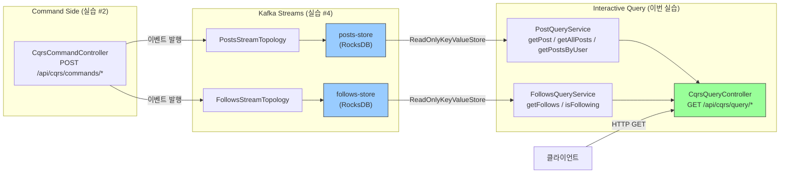

# Interactive Query API 구현

---

## 구현 요약

| 항목 | 내용 |
|------|------|
| 실습 번호 | 5 |
| 주요 파일 | `cqrs/query/service/PostQueryService.java`, `cqrs/query/service/FollowsQueryService.java`, `cqrs/controller/CqrsQueryController.java` |
| 테스트 파일 | `http/cqrs-interactive-query.http` |
| LEARN.md 위치 | 04-kafka-streams-topology.md line 36~136 |

## API 엔드포인트 매핑

Command Side(실습 #2)와 Query Side(이번 실습)의 URL이 명시적으로 분리된다.

| Side | HTTP Method | URL | 응답 |
|------|-------------|-----|------|
| Command | POST | `/api/cqrs/commands/posts` | 202 Accepted |
| Command | POST | `/api/cqrs/commands/posts/like` | 202 Accepted |
| Command | POST | `/api/cqrs/commands/follows` | 202 Accepted |
| **Query** | **GET** | **`/api/cqrs/query/posts`** | **200 + PostView[]** |
| **Query** | **GET** | **`/api/cqrs/query/posts/{postId}`** | **200 + PostView** |
| **Query** | **GET** | **`/api/cqrs/query/users/{userId}/posts`** | **200 + PostView[]** |
| **Query** | **GET** | **`/api/cqrs/query/follows/{followerId}`** | **200 + FollowsView** |
| **Query** | **GET** | **`/api/cqrs/query/follows/{id}/is-following/{id}`** | **200 + {following: bool}** |

---

## 무엇을 구현했는가

세 개의 파일을 추가하여 CQRS의 Query Side 읽기 API를 완성했다. `PostQueryService`와 `FollowsQueryService`가 Kafka Streams의 State Store를 Interactive Query로 직접 조회하고, `CqrsQueryController`가 REST GET 엔드포인트로 노출한다.

`PostQueryService`는 세 가지 조회를 제공한다. `getPost(postId)`는 posts-store에서 key로 직접 O(1) 조회한다. `getAllPosts()`는 `KeyValueIterator.all()`로 전체 스캔하여 모든 PostView를 반환한다. `getPostsByUser(userId)`도 전체 스캔이지만 userId로 필터링한다. State Store의 key가 postId이므로 userId 기반 조회는 전체 스캔이 불가피하다. 프로덕션에서는 userId를 key로 하는 별도 State Store를 토폴로지에 추가해야 하지만, 학습 PoC에서는 전체 스캔으로 충분하다.

`FollowsQueryService`는 두 가지 조회를 제공한다. `getFollows(followerId)`는 follows-store에서 FollowsView(followees Set)를 반환한다. `isFollowing(followerId, followeeId)`는 followees Set에 특정 사용자가 포함되어 있는지 boolean으로 반환한다. 팔로우 관계가 없으면 view 자체가 null이므로 false를 반환한다.

두 서비스 모두 `getStore()` 메서드에서 `StreamsBuilderFactoryBean.getKafkaStreams()`를 통해 KafkaStreams 인스턴스를 얻고, `State.RUNNING` 상태를 확인한 뒤 `StoreQueryParameters.fromNameAndType()`으로 `ReadOnlyKeyValueStore`를 획득한다. RUNNING이 아니면 `IllegalStateException`을 던지고 컨트롤러가 503 Service Unavailable로 변환한다.

`CqrsQueryController`는 404(조회 실패)와 503(Streams 미준비)을 구분하여 응답한다. 존재하지 않는 리소스를 조회하면 `NoSuchElementException` → 404, Streams가 REBALANCING이나 NOT_RUNNING 상태이면 `IllegalStateException` → 503이다.

## 왜 이렇게 구현했는가

`StreamsBuilderFactoryBean`을 주입한 이유는 Spring Kafka의 표준 방식이기 때문이다. Spring Kafka는 `@EnableKafkaStreams`가 선언되면 `StreamsBuilderFactoryBean`을 자동 등록한다. 이 빈이 `KafkaStreams` 인스턴스의 생명주기를 관리하므로, `KafkaStreams`를 직접 생성하거나 별도 빈으로 등록할 필요가 없다. `factoryBean.getKafkaStreams()`를 호출할 때마다 현재 관리 중인 인스턴스를 반환한다.

`ReadOnlyKeyValueStore`를 매 요청마다 획득하는 이유는 Kafka Streams의 리밸런싱 때문이다. 리밸런싱이 발생하면 파티션 할당이 변경되어 기존 Store 참조가 무효화될 수 있다. 매번 `kafkaStreams.store()`를 호출하면 현재 유효한 Store를 반환받으므로 안전하다. Store 참조를 필드에 캐싱하면 리밸런싱 후 `InvalidStateStoreException`이 발생할 수 있다.

`State.RUNNING` 체크를 서비스 레이어에 둔 이유는 Store 접근 전 선행 조건이기 때문이다. RUNNING이 아닌 상태에서 `kafkaStreams.store()`를 호출하면 예외가 발생한다. 명시적으로 상태를 확인하고 의미 있는 에러 메시지를 반환하는 것이 디버깅에 유리하다.

`KeyValueIterator`를 `try-with-resources`로 감싼 이유는 리소스 누수 방지다. Iterator는 RocksDB의 네이티브 리소스를 점유하므로 반드시 닫아야 한다. 닫지 않으면 RocksDB 파일 디스크립터가 누수되어 장시간 운영 시 Out of File Descriptors 에러가 발생할 수 있다.

Command 경로(`/api/cqrs/commands/`)와 Query 경로(`/api/cqrs/query/`)를 URL 레벨에서 분리한 이유는 CQRS의 핵심 원칙을 API 설계에 반영하기 위해서다. 이렇게 분리하면 향후 Command와 Query를 별도 마이크로서비스로 분리할 때 URL 변경 없이 라우팅만 조정하면 된다.

## 교차 검증 결과

### Claude 리뷰

`getPostsByUser()`의 전체 스캔은 데이터가 많아지면 성능 문제가 될 수 있다. 프로덕션에서는 `selectKey((postId, post) -> post.getUserId())`로 re-keying한 별도 KTable을 추가하여 userId 기반 O(1) 조회를 제공해야 한다. 실습 #4의 토폴로지 코드에 이미 이 패턴(`postsByUser` re-keying)이 학습 문서에 나와 있다.

`getStore()` 호출 시 `KafkaStreams.State.RUNNING` 외에 `REBALANCING` 상태에서도 일부 파티션의 Store는 조회 가능할 수 있다. Kafka Streams 2.5+에서는 `StaleStoreQueryParameters`를 사용하면 리밸런싱 중에도 stale 데이터를 조회할 수 있지만, 학습 PoC에서는 RUNNING만 허용하는 것이 명확하다.

Store 이름 상수(`"posts-store"`, `"follows-store"`)가 Topology 클래스에서 private이므로 Query Service에서 문자열을 중복 선언했다. 공유 상수 클래스를 만들 수 있지만, 현재 두 곳에서만 사용하므로 과도한 추상화다. 주석으로 원본 위치를 명시하여 동기화를 돕는 것으로 충분하다.

### 수정 사항

없음. `compileJava` 빌드 통과.

## 핵심 학습 포인트

- **Interactive Query = 별도 DB 없는 CQRS Query Side.** `ReadOnlyKeyValueStore`로 Kafka Streams State Store를 HTTP API에서 직접 조회한다. RocksDB 로컬 조회이므로 네트워크 I/O가 없고 응답이 1~5ms 수준으로 빠르다.

- **StreamsBuilderFactoryBean이 KafkaStreams 생명주기를 관리한다.** Spring Kafka에서는 `KafkaStreams`를 직접 생성하지 않고 `StreamsBuilderFactoryBean.getKafkaStreams()`로 접근한다. `@EnableKafkaStreams`가 이 빈을 자동 등록한다.

- **Store 참조는 매 요청마다 획득해야 한다.** 리밸런싱으로 파티션 할당이 바뀌면 기존 Store 참조가 무효화된다. 필드에 캐싱하면 `InvalidStateStoreException`이 발생할 수 있으므로 매번 `kafkaStreams.store()`를 호출하는 것이 안전하다.

- **State.RUNNING 확인은 필수다.** Kafka Streams 기동 직후에는 Changelog 토픽에서 State Store를 복구 중이다. RUNNING이 아닌 상태에서 Store에 접근하면 예외가 발생하므로, 요청을 503으로 거부하고 클라이언트가 재시도하도록 안내해야 한다.

- **KeyValueIterator는 반드시 닫아야 한다.** `try-with-resources`로 감싸지 않으면 RocksDB 네이티브 리소스가 누수된다. 이는 Kafka Streams 공식 문서에서도 강조하는 주의사항이다.
