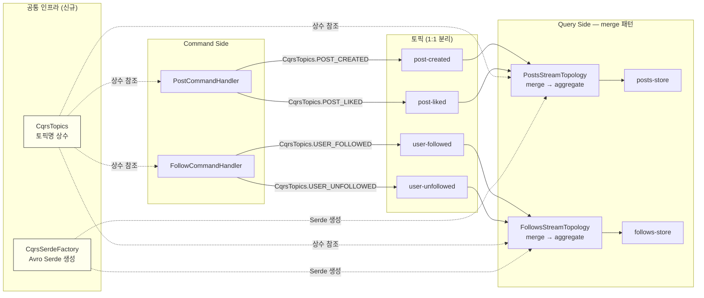

# 토픽 1:1 분리 + Serde 팩토리 + 토픽 상수 관리

---

## 구현 요약

| 항목 | 내용 |
|------|------|
| 실습 번호 | 6 |
| 주요 파일 | `cqrs/config/CqrsTopicConfig.java`, `cqrs/config/CqrsTopics.java`, `cqrs/config/CqrsSerdeFactory.java`, `cqrs/handler/PostCommandHandler.java`, `cqrs/handler/FollowCommandHandler.java`, `cqrs/query/topology/PostsStreamTopology.java`, `cqrs/query/topology/FollowsStreamTopology.java` |
| 테스트 파일 | `http/cqrs/02-command-side.http`, `http/cqrs/03-event-store.http` |
| 관련 이론 | Single Writer Principle, 토픽 1 이벤트 1 원칙 |

## 토픽 변경 매핑

| 기존 (1 토픽 N 이벤트) | 변경 후 (1 토픽 1 이벤트) |
|------------------------|--------------------------|
| `social.events.posts` (PostCreated + PostLiked) | `social.events.post-created` + `social.events.post-liked` |
| `social.events.follows` (UserFollowed + UserUnfollowed) | `social.events.user-followed` + `social.events.user-unfollowed` |

---

## 무엇을 구현했는가

세 가지 변경을 수행했다.

**1. 토픽 1:1 분리**: `CqrsTopicConfig`의 2개 토픽 빈을 4개로 분리했다. 공통 설정(3파티션, retention=-1, cleanup=delete)을 `eventStoreTopic()` 헬퍼로 추출하여 중복을 제거했다. Command Side의 `PostCommandHandler`는 `createPost()`에서 `POST_CREATED` 토픽으로, `likePost()`에서 `POST_LIKED` 토픽으로 각각 발행한다. `FollowCommandHandler`도 동일한 패턴으로 분리했다.

**2. Query Side merge 패턴**: 토픽이 분리되었으므로 `PostsStreamTopology`에서 `post-created`와 `post-liked` 두 스트림을 각각 `streamsBuilder.stream()`으로 소비한 뒤, `merge()`로 합쳐서 기존과 동일한 `groupByKey().aggregate()` 파이프라인에 연결했다. `FollowsStreamTopology`도 같은 패턴이다. merge 후 타입이 `SpecificRecord`로 소실되므로 `instanceof` 분기는 유지된다.

**3. 공통 인프라 추출**: `CqrsTopics` 상수 클래스로 토픽명을 중앙 관리한다. 기존에는 `CqrsTopicConfig`, `PostCommandHandler`, `PostsStreamTopology` 3곳에 동일한 문자열이 중복되어 있어서 토픽명 변경 시 3곳을 동시에 수정해야 했다. `CqrsSerdeFactory`는 두 토폴로지에서 동일했던 `createAvroSerde()` private 메서드를 유틸리티 클래스로 추출한 것이다.

## 왜 이렇게 구현했는가

1 토픽 N 이벤트에서 1 토픽 1 이벤트로 분리한 이유는 Consumer의 선택적 구독을 가능하게 하기 위해서다. 예를 들어 "좋아요 알림 서비스"는 `post-liked` 토픽만 구독하면 되는데, 기존 구조에서는 `social.events.posts` 전체를 소비한 뒤 PostLiked만 필터링해야 했다. 또한 토픽별로 파티션 수, 보존 정책, ACL을 독립적으로 튜닝할 수 있다.

merge()를 사용한 이유는 하나의 State Store에 여러 이벤트 타입을 집계해야 하기 때문이다. `posts-store`는 PostCreated로 초기화되고 PostLiked로 업데이트된다. Kafka Streams에서 두 개의 독립 aggregate()가 같은 State Store에 쓸 수 없으므로, merge로 합친 뒤 단일 aggregate에서 instanceof로 분기하는 것이 가장 간결한 방법이다. 대안으로 `process()`를 사용하면 instanceof 없이 각 스트림이 State Store에 독립 접근할 수 있지만, Processor 클래스가 이벤트 타입당 하나씩 필요해서 코드량이 늘어난다.

`CqrsTopics`를 `@UtilityClass`로 만든 이유는 인스턴스 생성이 불필요한 순수 상수 모음이기 때문이다. Lombok `@UtilityClass`는 private 생성자를 자동 생성하고 모든 메서드를 static으로 강제한다.

`CqrsSerdeFactory`에서 `isKey=false`를 고정한 이유는 이 프로젝트에서 key가 항상 String(postId, followerId)이라 `Serdes.String()`을 사용하고, Avro Serde는 value 전용으로만 쓰기 때문이다. `isKey` 파라미터는 Schema Registry subject 이름에 영향을 미친다. `false`면 `-value` suffix, `true`면 `-key` suffix가 붙어서 key/value 스키마가 독립적으로 관리된다.

## 교차 검증 결과

### Claude 리뷰

토픽 분리 후 `PostCreated`와 `PostLiked` 간 순서가 보장되지 않는다. 서로 다른 토픽이므로 파티션 키가 같더라도 도착 순서를 제어할 수 없다. 기존 방어 코드(`if (currentView == null) return null`)가 이를 처리하므로 기능적 문제는 없지만, 순서 역전 시 PostLiked 이벤트가 유실(무시)된다는 점은 인지해야 한다. 프로덕션에서는 이런 이벤트를 retry 토픽에 보관했다가 재처리하는 방식을 고려할 수 있다.

`CqrsSerdeFactory.createAvroValueSerde()`가 제네릭 `<T extends SpecificRecord>`을 사용하므로 타입 추론이 가능하다. 호출부에서 별도 캐스팅 없이 `SpecificAvroSerde<SpecificRecord>`로 받을 수 있다.

### 수정 사항

`@Builder`와 필드 초기값(`new ArrayList<>()`, `new HashSet<>()`) 조합에서 Lombok 경고 발생 → `@Builder.Default` 추가로 해결. `compileJava` 빌드 통과, 경고 0개.

## 핵심 학습 포인트

- **토픽 1 이벤트 1 원칙은 Consumer 결합도를 낮춘다.** 1 토픽 N 이벤트 방식에서는 모든 Consumer가 불필요한 이벤트까지 소비한 뒤 필터링해야 한다. 토픽을 분리하면 필요한 이벤트만 선택 구독할 수 있고, 토픽별로 독립적인 운영 정책을 적용할 수 있다.

- **merge()는 분리된 토픽을 Query Side에서 재결합하는 패턴이다.** 토픽이 분리되어도 하나의 State Store에 집계해야 할 때 merge()를 사용한다. merge 후 타입 정보가 소실되므로 instanceof 분기가 필요한데, 이는 merge의 본질적 한계다.

- **토픽명 상수 클래스는 3곳 이상 중복되면 가치가 있다.** `CqrsTopicConfig`, `CommandHandler`, `StreamTopology`에서 동일한 토픽명을 사용하므로, 변경 시 한 곳만 수정하면 되는 상수 클래스가 실용적이다.

- **Serde 팩토리는 설정 중복을 제거한다.** `schema.registry.url`과 `specific.avro.reader` 설정이 여러 토폴로지에서 반복되므로, 팩토리로 추출하면 설정 변경 시 한 곳만 수정하면 된다. 단, Serde 인스턴스는 토폴로지별로 각각 생성해야 스레드 안전하다.
