# 06. 에러 처리 (Error Handling)

## 학습 목표
Go의 명시적 에러 처리 방식과 defer, panic/recover를 이해한다.

---

## Go의 에러 처리 철학

Go는 다른 언어들과 달리 **예외(Exception)를 사용하지 않습니다**. 대신 에러를 **일반 값(value)**으로 취급합니다. 이것이 "Errors are values(에러도 값이다)"라는 Go의 철학입니다.

### 예외 vs 에러 반환

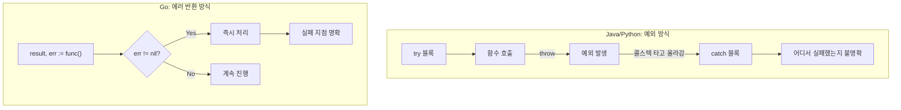

Java나 Python 같은 언어에서는 예외가 발생하면 콜스택을 타고 올라가며 catch 블록을 찾습니다. 이 방식은 코드 어디서든 예외가 발생할 수 있어 흐름을 추적하기 어렵습니다.

```java
// Java: 어디서 예외가 발생할지 모름
try {
    User user = userService.findById(id);
    Order order = orderService.createOrder(user);
} catch (Exception e) {
    // 어디서 실패했는지 불명확
}
```

Go는 함수가 에러를 **명시적으로 반환**합니다. 호출자는 반드시 에러를 확인해야 하므로 실패 가능성이 코드에 드러납니다.

```go
// Go: 에러 발생 지점이 명확함
user, err := userService.FindByID(id)
if err != nil {
    return fmt.Errorf("사용자 조회 실패: %w", err)
}

order, err := orderService.CreateOrder(user)
if err != nil {
    return fmt.Errorf("주문 생성 실패: %w", err)
}
```

### 왜 이런 방식을 선택했는가?

Go 개발팀은 예외 처리 방식이 **제어 흐름을 숨긴다**고 판단했습니다. 에러를 값으로 처리하면 에러 처리 로직이 일반 코드와 동일한 방식으로 작성되어 가독성이 높아집니다. 또한 에러를 무시하려면 명시적으로 `_`를 사용해야 하므로 실수로 에러를 무시하기 어렵습니다.

---

## error 인터페이스

Go에서 에러는 `error` 인터페이스를 구현한 값입니다. 이 인터페이스는 `Error() string` 메서드 하나만 정의합니다.

```go
type error interface {
    Error() string
}
```

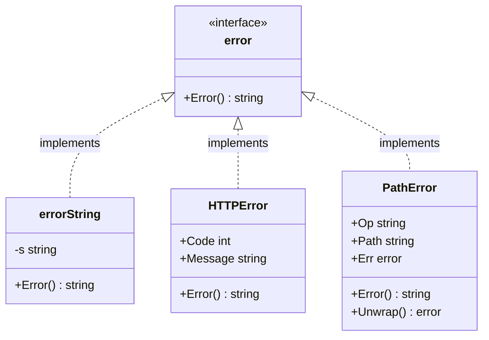

이 단순한 설계 덕분에 **어떤 타입이든** `Error() string` 메서드만 구현하면 에러로 사용할 수 있습니다. 문자열 메시지만 반환하는 단순한 에러부터 HTTP 상태 코드, 스택 트레이스 등을 포함하는 복잡한 에러까지 모두 같은 인터페이스로 처리할 수 있습니다.

### nil의 의미

Go에서 에러가 `nil`이면 에러가 없음을 의미합니다. 함수가 정상적으로 완료되면 에러로 `nil`을 반환합니다.

```go
func ReadFile(path string) ([]byte, error) {
    // 정상 완료
    return data, nil

    // 에러 발생
    return nil, errors.New("파일을 찾을 수 없습니다")
}
```

### 반환 규칙

Go에서 에러를 반환하는 함수는 관례적으로 **마지막 반환값**으로 에러를 반환합니다. 이는 Go 커뮤니티에서 지켜지는 강력한 규칙입니다.

```go
// 올바른 형태
func DoSomething() (Result, error)
func ReadAll() ([]byte, error)

// 잘못된 형태 (피해야 함)
func DoSomething() (error, Result)
```

---

## 에러 생성

### errors.New

`errors.New()`는 가장 단순한 에러 생성 방법입니다. 문자열 메시지를 받아서 error 인터페이스를 구현한 값을 반환합니다.

```go
import "errors"

err := errors.New("파일을 찾을 수 없습니다")
```

**중요한 특성**: `errors.New()`는 호출할 때마다 **새로운 에러 객체**를 생성합니다. 같은 메시지로 생성해도 서로 다른 객체이므로 `==` 비교 시 `false`가 됩니다.

```go
err1 := errors.New("error")
err2 := errors.New("error")

fmt.Println(err1 == err2)                 // false (다른 객체)
fmt.Println(err1.Error() == err2.Error()) // true (메시지는 같음)
```

이 특성 때문에 특정 에러를 확인하려면 **센티널 에러**(미리 정의된 에러 변수)를 사용해야 합니다.

### fmt.Errorf

`fmt.Errorf()`는 포맷 문자열을 사용해 동적인 에러 메시지를 생성합니다. Printf와 같은 문법을 사용할 수 있어 변수 값을 에러 메시지에 포함할 수 있습니다.

```go
userID := 123
err := fmt.Errorf("사용자 %d를 찾을 수 없습니다", userID)
// err.Error() = "사용자 123를 찾을 수 없습니다"
```

### %w를 사용한 에러 래핑 (Go 1.13+)

`fmt.Errorf()`에서 `%w` 포맷 동사를 사용하면 원본 에러를 **래핑(wrapping)**할 수 있습니다. 래핑된 에러는 원본 에러에 대한 참조를 유지하므로 나중에 `errors.Is()`나 `errors.As()`로 원본 에러를 찾을 수 있습니다.

```go
originalErr := errors.New("connection refused")
wrappedErr := fmt.Errorf("DB 연결 실패: %w", originalErr)

// wrappedErr.Error() = "DB 연결 실패: connection refused"
// errors.Unwrap(wrappedErr) = originalErr
```

### %v vs %w의 결정적 차이

두 포맷 동사 모두 에러 메시지를 문자열로 포함하지만, **에러 체인 유지 여부**가 다릅니다.

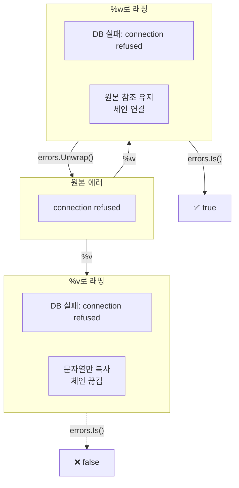

```go
originalErr := errors.New("connection refused")

// %v: 문자열로만 변환 (에러 체인 끊김)
errV := fmt.Errorf("DB 실패: %v", originalErr)

// %w: 에러 래핑 (에러 체인 유지)
errW := fmt.Errorf("DB 실패: %w", originalErr)
```

**출력은 동일**합니다:
```
DB 실패: connection refused
```

**하지만 내부 구조가 다릅니다**:

| 비교 | `%v` | `%w` |
|------|------|------|
| 출력 메시지 | 동일 | 동일 |
| 원본 에러 참조 | ❌ 없음 | ✅ 있음 |
| `errors.Is(err, originalErr)` | `false` | `true` |
| `errors.Unwrap(err)` | `nil` | `originalErr` |

**실무 규칙**: 에러를 상위로 전달할 때는 **항상 %w를 사용**해야 합니다. 그래야 호출자가 원본 에러를 확인할 수 있습니다.

---

## 센티널 에러 (Sentinel Error)

센티널 에러는 **패키지 수준에서 미리 정의된 에러 변수**입니다. "파수꾼(sentinel)"처럼 특정 조건을 나타내는 역할을 합니다.

### 표준 라이브러리의 센티널 에러

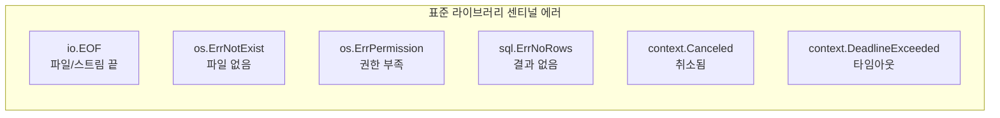

Go 표준 라이브러리에는 많은 센티널 에러가 정의되어 있습니다:

- `io.EOF`: 파일/스트림의 끝에 도달
- `os.ErrNotExist`: 파일이 존재하지 않음
- `os.ErrPermission`: 권한 부족
- `sql.ErrNoRows`: 쿼리 결과가 없음
- `context.Canceled`: 컨텍스트가 취소됨
- `context.DeadlineExceeded`: 타임아웃 초과

### 센티널 에러 정의 방법

패키지에서 센티널 에러를 정의할 때는 **패키지 수준 변수**로 선언하고, 이름은 `Err`로 시작합니다.

```go
package mypackage

import "errors"

var (
    ErrEmptyPath    = errors.New("path is empty")
    ErrFileNotFound = errors.New("file not found")
    ErrInvalidInput = errors.New("invalid input")
)
```

### 센티널 에러 사용

```go
func ReadFile(path string) (string, error) {
    if path == "" {
        return "", ErrEmptyPath  // 센티널 에러 반환
    }
    // ...
}

// 호출자에서 확인
_, err := ReadFile("")
if errors.Is(err, ErrEmptyPath) {
    fmt.Println("경로가 비어있습니다")
}
```

### 주의사항

센티널 에러는 **패키지의 공개 API 일부**가 됩니다. 한번 공개하면 변경하기 어려우므로 신중하게 정의해야 합니다. 또한 센티널 에러만으로는 추가 정보(어떤 파일인지, 어떤 사용자인지)를 전달할 수 없으므로, 복잡한 에러 정보가 필요하면 커스텀 에러 타입을 사용해야 합니다.

---

## 에러 확인: errors.Is vs errors.As

Go 1.13에서 도입된 두 함수는 **에러 체인을 순회**하며 특정 에러를 찾습니다.

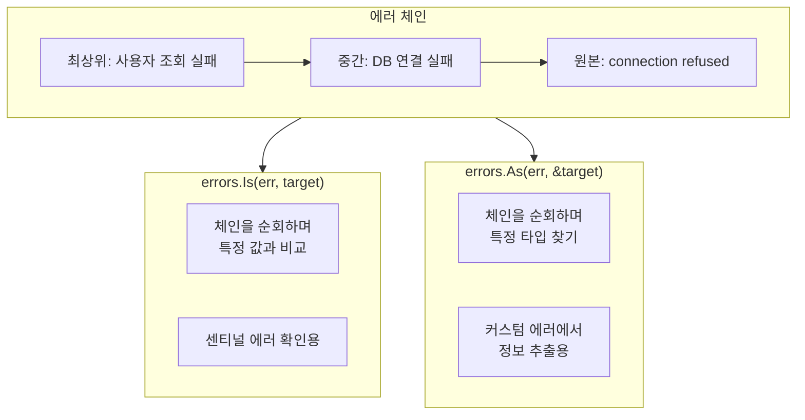

### errors.Is - 특정 에러 값 확인

`errors.Is()`는 에러 체인에서 **특정 에러 값**과 일치하는지 확인합니다. 센티널 에러를 확인할 때 사용합니다.

```go
func errors.Is(err, target error) bool
```

**왜 == 대신 errors.Is를 써야 하는가?**

에러가 래핑되어 있으면 `==` 비교는 실패합니다:

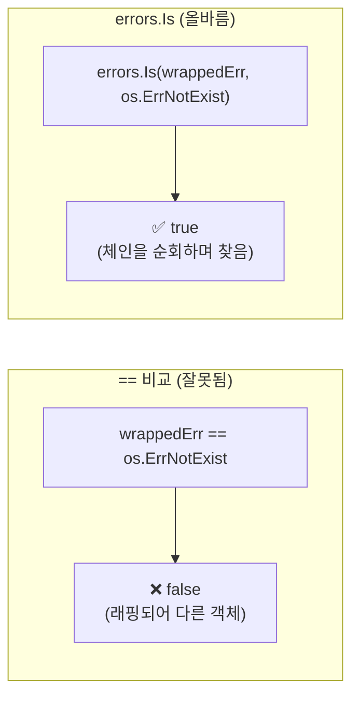

```go
originalErr := os.ErrNotExist
wrappedErr := fmt.Errorf("파일 읽기 실패: %w", originalErr)

// 잘못된 방법
if wrappedErr == os.ErrNotExist {  // false!
    // 실행 안 됨
}

// 올바른 방법
if errors.Is(wrappedErr, os.ErrNotExist) {  // true
    // 실행됨
}
```

`errors.Is()`는 래핑된 에러 체인을 따라가며 원본 에러를 찾습니다.

### errors.As - 특정 에러 타입 확인

`errors.As()`는 에러 체인에서 **특정 타입의 에러**를 찾아 변환합니다. 커스텀 에러 타입에서 추가 정보를 추출할 때 사용합니다.

```go
func errors.As(err error, target any) bool
```

**두 번째 인자는 반드시 에러 타입의 포인터**여야 합니다:

```go
var pathErr *os.PathError
if errors.As(err, &pathErr) {
    fmt.Println("경로:", pathErr.Path)
    fmt.Println("작업:", pathErr.Op)
}
```

### Is vs As 선택 기준

| 상황 | 사용 함수 |
|------|----------|
| 센티널 에러 확인 (`io.EOF`, `os.ErrNotExist` 등) | `errors.Is()` |
| 커스텀 에러 타입에서 정보 추출 | `errors.As()` |
| "이 에러인가?" | `errors.Is()` |
| "이 타입의 에러인가? 정보를 꺼내고 싶다" | `errors.As()` |

---

## errors.Unwrap과 에러 체인

`errors.Unwrap()`은 래핑된 에러에서 원본 에러를 꺼냅니다.

```go
originalErr := errors.New("connection refused")
wrappedErr := fmt.Errorf("DB 연결 실패: %w", originalErr)

unwrapped := errors.Unwrap(wrappedErr)
fmt.Println(unwrapped)  // connection refused
```

### 에러 체인 순회

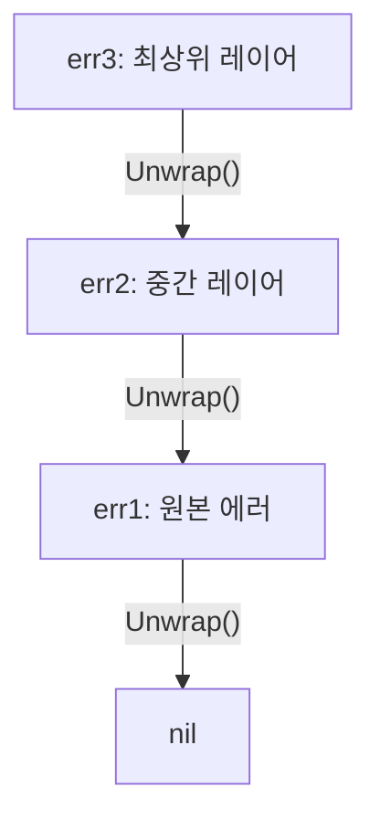

다중 래핑된 에러 체인을 순회할 수 있습니다:

```go
// 에러 체인 생성
err1 := errors.New("원본 에러")
err2 := fmt.Errorf("중간 레이어: %w", err1)
err3 := fmt.Errorf("최상위 레이어: %w", err2)

// 체인 순회
err := err3
for err != nil {
    fmt.Println(err)
    err = errors.Unwrap(err)
}
// 출력:
// 최상위 레이어: 중간 레이어: 원본 에러
// 중간 레이어: 원본 에러
// 원본 에러
```

---

## 커스텀 에러 타입

error 인터페이스를 구현하면 **추가 정보를 포함하는 커스텀 에러 타입**을 만들 수 있습니다.

### 기본 구현

```go
type HTTPError struct {
    Code    int
    Message string
}

func (e *HTTPError) Error() string {
    return fmt.Sprintf("HTTP %d: %s", e.Code, e.Message)
}
```

### 사용 예시

```go
func fetchUser(id int) (*User, error) {
    resp, err := http.Get(fmt.Sprintf("/users/%d", id))
    if err != nil {
        return nil, fmt.Errorf("요청 실패: %w", err)
    }

    if resp.StatusCode == 404 {
        return nil, &HTTPError{Code: 404, Message: "User not found"}
    }
    // ...
}

// 호출자에서 사용
user, err := fetchUser(123)
if err != nil {
    var httpErr *HTTPError
    if errors.As(err, &httpErr) {
        if httpErr.Code == 404 {
            fmt.Println("사용자가 존재하지 않습니다")
        } else if httpErr.Code >= 500 {
            fmt.Println("서버 오류, 재시도 필요")
        }
    }
}
```

### Unwrap 메서드로 래핑 지원

커스텀 에러가 다른 에러를 래핑하려면 `Unwrap() error` 메서드를 구현합니다:

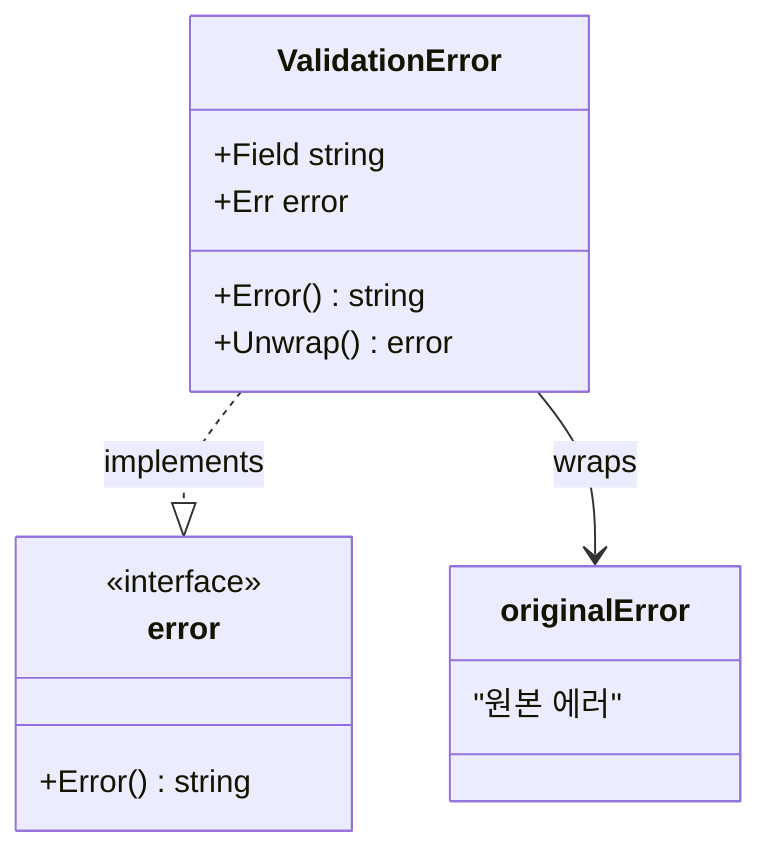

```go
type ValidationError struct {
    Field string
    Err   error  // 원본 에러
}

func (e *ValidationError) Error() string {
    return fmt.Sprintf("필드 '%s' 검증 실패: %v", e.Field, e.Err)
}

func (e *ValidationError) Unwrap() error {
    return e.Err  // errors.Is, errors.As가 원본 에러를 찾을 수 있음
}
```

---

## defer 문

`defer`는 **함수가 종료될 때 실행될 코드를 등록**합니다. 리소스 정리(파일 닫기, 잠금 해제, 연결 종료)에 주로 사용됩니다.

### 기본 사용법

```go
func readFile(path string) ([]byte, error) {
    f, err := os.Open(path)
    if err != nil {
        return nil, err
    }
    defer f.Close()  // 함수 종료 시 자동 실행

    return io.ReadAll(f)
}
```

defer를 사용하면 리소스 획득 직후에 정리 코드를 작성할 수 있어, 정리를 잊어버리는 실수를 방지할 수 있습니다.

### 실행 순서: LIFO (후입선출)

여러 defer가 있으면 **나중에 등록된 것이 먼저 실행**됩니다. 이는 스택 자료구조와 같습니다.

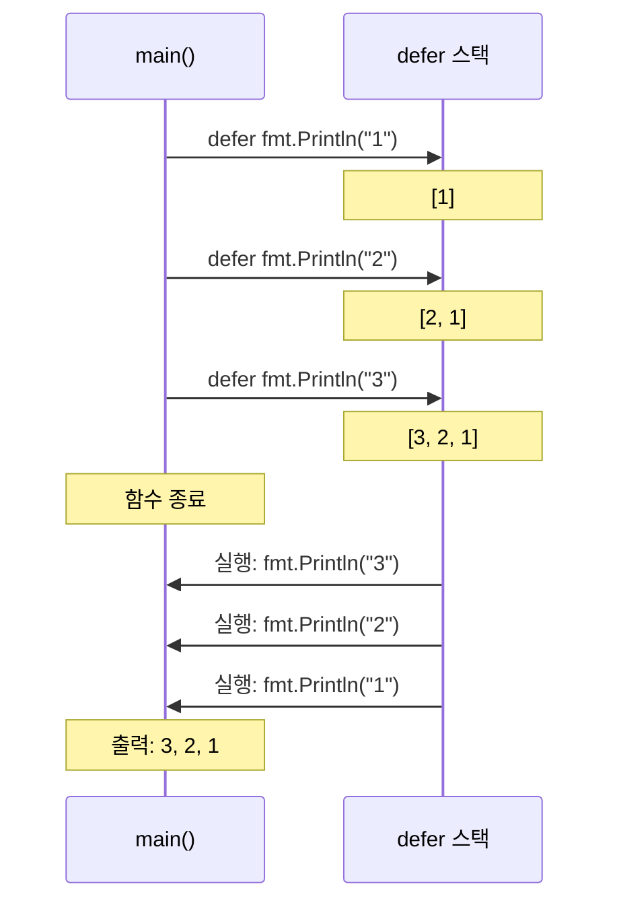

```go
func main() {
    defer fmt.Println("1")
    defer fmt.Println("2")
    defer fmt.Println("3")
}
// 출력: 3, 2, 1
```

이 순서가 중요한 이유는 **리소스는 열린 역순으로 닫아야** 하기 때문입니다:

```go
func copyFile(src, dst string) error {
    srcFile, err := os.Open(src)
    if err != nil {
        return err
    }
    defer srcFile.Close()  // 두 번째로 닫힘

    dstFile, err := os.Create(dst)
    if err != nil {
        return err
    }
    defer dstFile.Close()  // 첫 번째로 닫힘

    _, err = io.Copy(dstFile, srcFile)
    return err
}
```

### 인자 평가 시점 주의

defer 문의 **인자는 defer가 선언되는 시점에 평가**됩니다. 함수 실행 시점이 아닙니다.

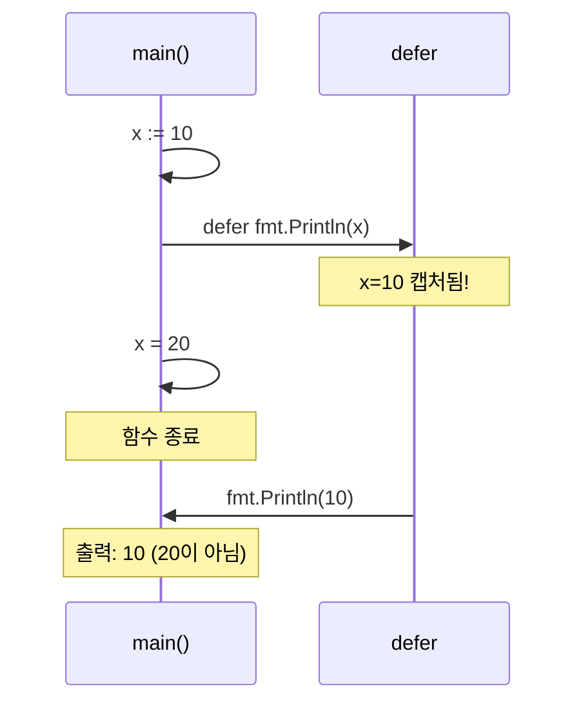

```go
func main() {
    x := 10
    defer fmt.Println(x)  // x=10이 캡처됨
    x = 20
}
// 출력: 10 (20이 아님!)
```

현재 값이 아닌 최종 값을 사용하려면 **클로저**를 사용합니다:

```go
func main() {
    x := 10
    defer func() {
        fmt.Println(x)  // 클로저가 x를 참조
    }()
    x = 20
}
// 출력: 20
```

### defer와 반환값

defer에서 **이름 있는 반환값**을 수정할 수 있습니다:

```go
func example() (result int) {
    defer func() {
        result = result * 2  // 반환값 수정
    }()
    return 10
}
// 반환값: 20 (10이 아님)
```

이 패턴은 에러 처리에 유용합니다:

```go
func doWork() (err error) {
    defer func() {
        if err != nil {
            err = fmt.Errorf("doWork 실패: %w", err)
        }
    }()

    // ... 작업 수행
    return someOperation()
}
```

---

## panic과 recover

### panic

`panic`은 **복구 불가능한 오류** 상황에서 프로그램을 즉시 중단시킵니다.

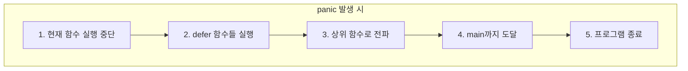

panic이 발생하면:
1. 현재 함수 실행 중단
2. defer 함수들 실행
3. 상위 함수로 전파 (콜스택을 타고 올라감)
4. main까지 전파되면 프로그램 종료

```go
func mustGetEnv(key string) string {
    val := os.Getenv(key)
    if val == "" {
        panic("필수 환경 변수 누락: " + key)
    }
    return val
}
```

### recover

`recover`는 panic을 잡아서 정상 흐름으로 복귀시킵니다. **반드시 defer 내에서만 동작**합니다.

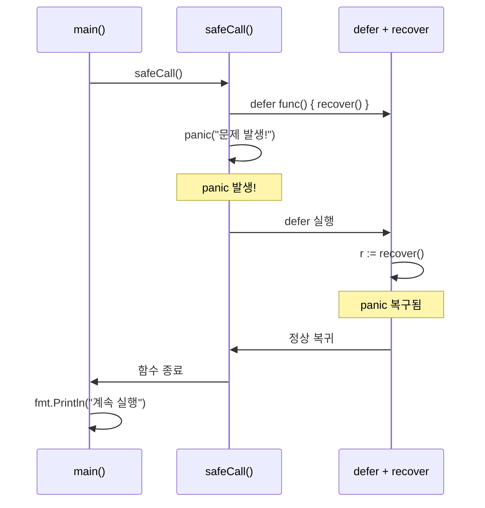

```go
func safeCall() {
    defer func() {
        if r := recover(); r != nil {
            fmt.Println("패닉 복구:", r)
        }
    }()

    panic("문제 발생!")
}

func main() {
    safeCall()
    fmt.Println("프로그램 계속 실행")
}
// 출력:
// 패닉 복구: 문제 발생!
// 프로그램 계속 실행
```

### panic 사용 시점

panic은 **정말 복구 불가능한 상황**에서만 사용해야 합니다:

| 상황 | panic 사용 |
|------|----------|
| 프로그램 초기화 실패 (필수 설정 누락) | ✅ |
| 프로그래머 오류 (불가능한 조건, 잘못된 인자) | ✅ |
| Must* 함수 패턴 (정규식 컴파일 등) | ✅ |
| 파일 없음, 네트워크 오류 | ❌ (error 반환) |
| 사용자 입력 검증 실패 | ❌ (error 반환) |

### Must 패턴

정규식 같이 **컴파일 타임에 확정되는 값**이 실패하면 프로그래머 오류이므로 panic이 적절합니다:

```go
// 표준 라이브러리의 regexp.MustCompile
var emailRegex = regexp.MustCompile(`^[a-z]+@[a-z]+\.[a-z]+$`)

// 직접 구현
func MustParseURL(rawURL string) *url.URL {
    u, err := url.Parse(rawURL)
    if err != nil {
        panic(fmt.Sprintf("잘못된 URL: %s", rawURL))
    }
    return u
}
```

---

## 에러 처리 패턴

### 패턴 1: 기본 에러 체크

```go
result, err := doSomething()
if err != nil {
    return fmt.Errorf("doSomething 실패: %w", err)
}
```

### 패턴 2: 센티널 에러로 분기

```go
_, err := os.Open(path)
if errors.Is(err, os.ErrNotExist) {
    // 파일이 없으면 생성
    return os.Create(path)
}
if err != nil {
    return err
}
```

### 패턴 3: 에러 래핑으로 컨텍스트 추가

```go
func processUser(id int) error {
    user, err := fetchUser(id)
    if err != nil {
        return fmt.Errorf("사용자 %d 조회 실패: %w", id, err)
    }

    if err := validateUser(user); err != nil {
        return fmt.Errorf("사용자 %d 검증 실패: %w", id, err)
    }

    return nil
}
```

### 패턴 4: 타입 단언으로 상세 처리

```go
var netErr net.Error
if errors.As(err, &netErr) {
    if netErr.Timeout() {
        // 타임아웃 - 재시도 가능
        return retry()
    }
    if netErr.Temporary() {
        // 일시적 오류 - 재시도 가능
        return retry()
    }
}
```

---

## 정리

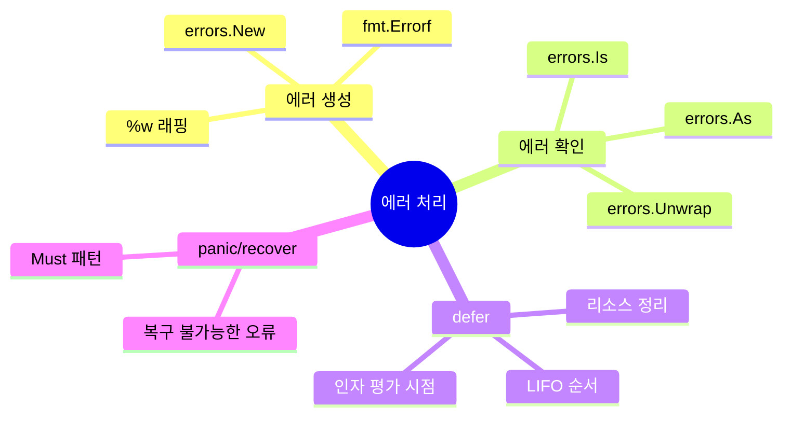

| 개념 | 설명 |
|------|------|
| `error` 인터페이스 | `Error() string` 메서드만 있는 단순한 인터페이스 |
| `errors.New()` | 정적 에러 메시지 생성 |
| `fmt.Errorf()` | 동적 에러 메시지 생성, `%w`로 래핑 |
| 센티널 에러 | 패키지 수준에서 미리 정의된 에러 변수 |
| `errors.Is()` | 에러 체인에서 특정 값 확인 |
| `errors.As()` | 에러 체인에서 특정 타입 확인 및 변환 |
| `errors.Unwrap()` | 래핑된 에러에서 원본 꺼내기 |
| `defer` | 함수 종료 시 실행할 코드 등록, LIFO 순서 |
| `panic` | 복구 불가능한 오류로 프로그램 중단 |
| `recover` | defer 내에서 panic 복구 |

---

## 참고 자료
- [Go Tour - Errors](https://go.dev/tour/methods/19)
- [Go Blog - Error handling and Go](https://go.dev/blog/error-handling-and-go)
- [Go Blog - Errors are values](https://go.dev/blog/errors-are-values)
- [Go Blog - Working with Errors in Go 1.13](https://go.dev/blog/go1.13-errors)
