# 09. fmt 패키지 심화

## 학습 목표
Go의 fmt 패키지를 깊이 이해하고, 다양한 출력/포맷팅 함수를 상황에 맞게 사용한다.

---

## 리눅스 기초: 파일 디스크립터와 표준 스트림

fmt 패키지를 제대로 이해하려면 먼저 리눅스/유닉스의 **파일 디스크립터(File Descriptor)** 개념을 알아야 합니다.

### 파일 디스크립터란?

운영체제는 프로세스가 파일, 소켓, 파이프 등 I/O 리소스에 접근할 때 **정수 번호**를 부여합니다. 이것이 파일 디스크립터(fd)입니다.

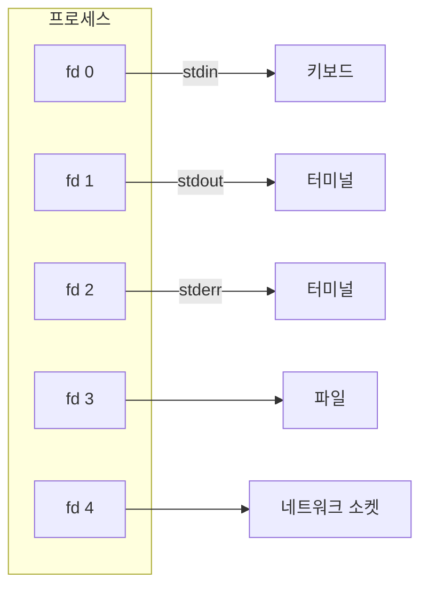

### 표준 스트림 (Standard Streams)

모든 프로세스는 시작할 때 **3개의 스트림**이 자동으로 열립니다:

| fd | 이름 | 용도 | Go에서 |
|----|------|------|--------|
| 0 | stdin | 입력 (키보드) | `os.Stdin` |
| 1 | stdout | 정상 출력 (화면) | `os.Stdout` |
| 2 | stderr | 에러 출력 (화면) | `os.Stderr` |

### stdout과 stderr 분리 이유

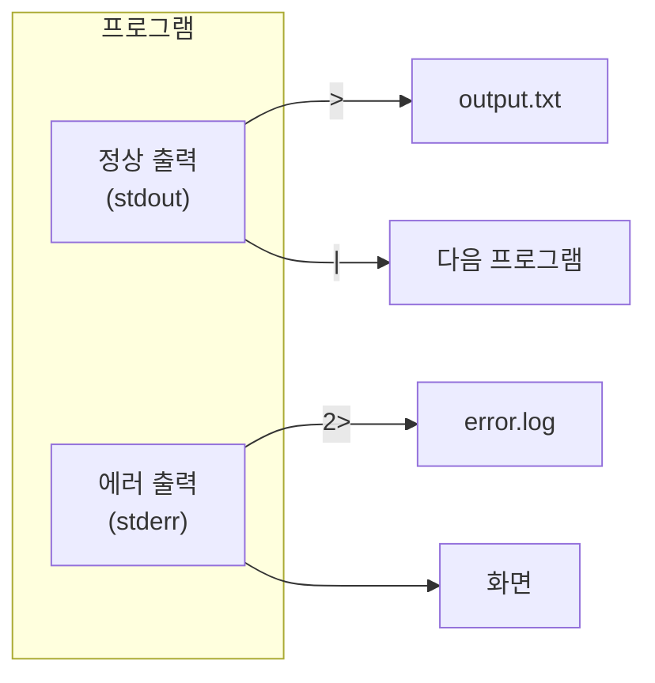

**왜 stdout과 stderr를 분리했을까?**

```bash
# stdout만 파일로 저장 (에러는 화면에 표시)
./program > output.txt

# stderr만 파일로 저장 (정상 출력은 화면에 표시)
./program 2> error.log

# 둘 다 같은 파일로
./program > all.log 2>&1

# stdout은 파이프로, stderr는 화면에
./program | grep "결과"
```

**핵심**: stdout과 stderr를 분리하면 정상 데이터와 에러 메시지를 **독립적으로 처리**할 수 있습니다.

### 셸 리다이렉션 문법 상세

리다이렉션은 프로그램의 입출력을 파일이나 다른 스트림으로 전환하는 셸 기능입니다.

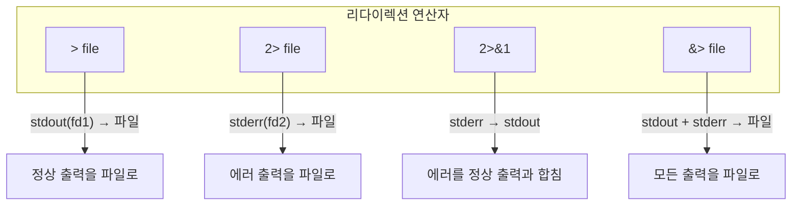

#### `>` : stdout을 파일로 리다이렉션

`>`는 **stdout(fd 1)**을 파일로 보냅니다. 숫자 없이 `>`만 쓰면 `1>`과 같습니다.

```bash
# 정상 출력만 파일로 저장
./program > output.txt

# 동일한 의미 (1은 stdout)
./program 1> output.txt
```

#### `2>` : stderr를 파일로 리다이렉션

`2>`는 **stderr(fd 2)**를 파일로 보냅니다. 숫자 2는 파일 디스크립터 번호입니다.

```bash
# 에러 출력만 파일로 저장
./program 2> error.log

# 정상 출력은 화면에, 에러만 파일로
./program 2> error.log
```

#### `2>&1` : stderr를 stdout으로 합치기

`2>&1`은 **stderr(fd 2)를 stdout(fd 1)이 가리키는 곳으로** 보냅니다. `&1`은 "fd 1이 현재 가리키는 대상"을 의미합니다.

```bash
# stdout을 파일로 보낸 후, stderr도 같은 파일로 합침
./program > all.log 2>&1
```

**순서가 중요합니다:**
```bash
# 올바른 순서: stdout을 먼저 리다이렉션 후 stderr를 합침
./program > all.log 2>&1

# 잘못된 순서: stderr가 터미널을 가리킬 때 합침 (파일에 안 들어감)
./program 2>&1 > all.log  # 에러는 여전히 화면에!
```

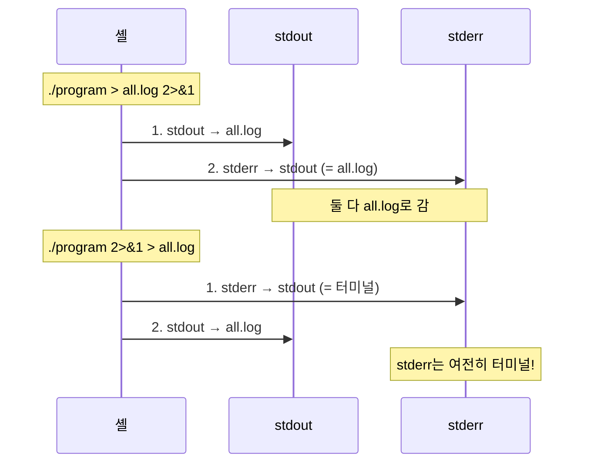

#### `&>` 또는 `>&` : 둘 다 파일로 (Bash 단축 문법)

```bash
# stdout과 stderr 모두 파일로 (Bash)
./program &> all.log

# 동일한 의미
./program >& all.log
./program > all.log 2>&1
```

#### 실용 예시

```bash
# 성공 출력만 보고, 에러는 버림
./program 2> /dev/null

# 에러만 보고, 정상 출력은 버림
./program > /dev/null

# 모든 출력 버림 (조용히 실행)
./program &> /dev/null

# 로그 파일 분리
./program > success.log 2> error.log

# 파이프에서 에러는 화면에 표시
./program 2>&1 | grep "결과"  # grep에 stdout+stderr 전달
./program 2>/dev/tty | grep "결과"  # stderr는 터미널, stdout만 grep으로
```

### 실제 동작 예시

```go
package main

import (
    "fmt"
    "os"
)

func main() {
    fmt.Println("정상 출력")              // stdout (fd 1)
    fmt.Fprintln(os.Stderr, "에러 출력")  // stderr (fd 2)
}
```

실행:
```bash
$ go run main.go > output.txt
에러 출력    # stderr는 화면에 출력됨

$ cat output.txt
정상 출력    # stdout만 파일에 저장됨
```

---

## io.Writer 인터페이스

Go에서 "출력 대상"을 추상화한 인터페이스입니다. Go의 **덕 타이핑(Duck Typing)** 철학을 보여주는 대표적인 예입니다.

### 정의

```go
type Writer interface {
    Write(p []byte) (n int, err error)
}
```

`Write` 메서드 하나만 구현하면 어디든 출력할 수 있습니다.

### Write 메서드 시그니처 분석

```go
Write(p []byte) (n int, err error)
```

| 요소 | 설명 |
|------|------|
| `p []byte` | 쓸 데이터 (바이트 슬라이스) |
| `n int` | 실제로 쓴 바이트 수 |
| `err error` | 에러 (없으면 nil) |

**핵심 규약**:
- `n`은 항상 `0 <= n <= len(p)`
- `n < len(p)`이면 반드시 `err != nil` (부분 쓰기는 에러로 간주)
- 호출자는 `p`를 수정하면 안 됨 (임시적으로도)

```go
// Write 메서드 구현 예시 (커스텀 Writer)
type UpperWriter struct {
    w io.Writer
}

func (u *UpperWriter) Write(p []byte) (n int, err error) {
    // 대문자로 변환하여 내부 Writer에 전달
    upper := bytes.ToUpper(p)
    return u.w.Write(upper)
}
```

### io.Writer를 구현하는 타입들

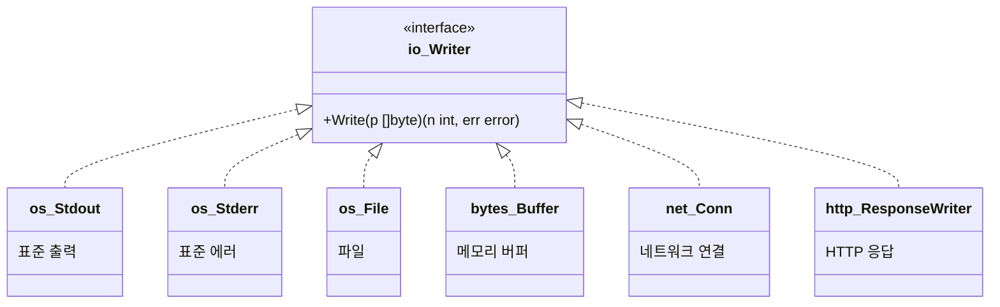

### 각 구현 타입의 특성

| 타입 | 패키지 | 특성 | 주요 용도 |
|------|--------|------|----------|
| `os.Stdout` | os | fd 1, 라인 버퍼링 | 일반 출력 |
| `os.Stderr` | os | fd 2, 버퍼링 없음 | 에러/로그 출력 |
| `*os.File` | os | 파일 디스크립터 사용 | 파일 I/O |
| `*bytes.Buffer` | bytes | 메모리 기반, 동적 확장 | 테스트, 문자열 조합 |
| `net.Conn` | net | TCP/UDP 연결 | 네트워크 통신 |
| `http.ResponseWriter` | net/http | HTTP 응답 스트림 | 웹 서버 |
| `*bufio.Writer` | bufio | 버퍼링된 Writer | 성능 최적화 |
| `*gzip.Writer` | compress/gzip | 압축하며 쓰기 | 압축 파일 |

### 왜 io.Writer가 중요한가?

**추상화의 힘**: 출력 대상을 바꿔도 코드를 수정할 필요가 없습니다.

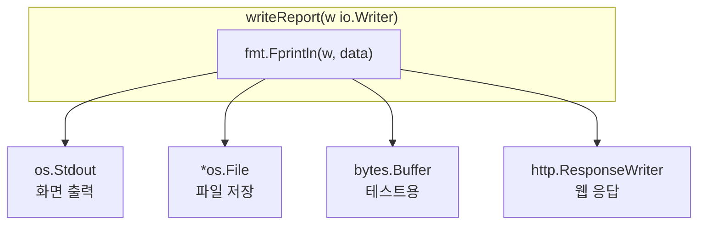

### 코드 예제 상세 분석

```go
// 이 함수는 "어디에" 출력하는지 모릅니다
func writeReport(w io.Writer, data string) {
    fmt.Fprintln(w, "=== 보고서 ===")
    fmt.Fprintln(w, data)
}
```

**핵심 포인트**: `writeReport`는 `io.Writer` 인터페이스만 알면 됩니다. 구체적인 타입(파일인지, 화면인지, 네트워크인지)은 전혀 모릅니다.

#### 사용 예시 1: 화면에 출력

```go
writeReport(os.Stdout, "분석 결과")
```

**동작 흐름**:
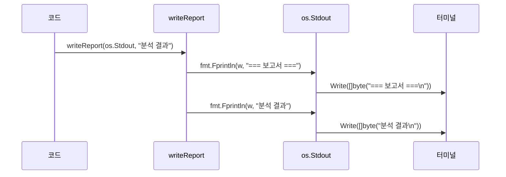

`os.Stdout`은 `*os.File` 타입이며, `Write` 메서드가 구현되어 있어 `io.Writer`를 만족합니다.

#### 사용 예시 2: 파일에 출력

```go
file, err := os.Create("report.txt")
if err != nil {
    log.Fatal(err)
}
defer file.Close()  // 반드시 닫아야 함!

writeReport(file, "분석 결과")
```

**동작 흐름**:
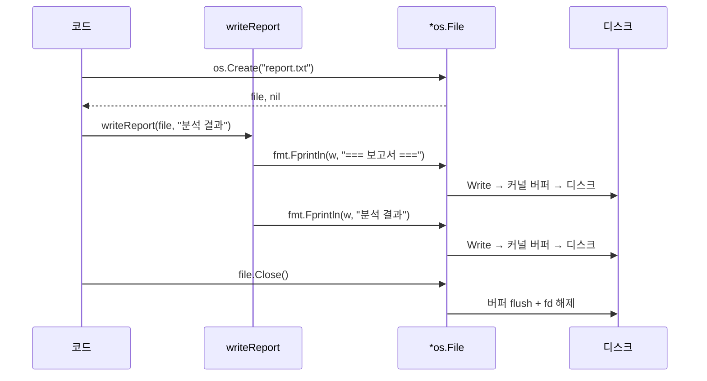

`*os.File`도 `Write` 메서드가 있어 `io.Writer`를 만족합니다.

#### 사용 예시 3: 메모리 버퍼에 출력 (테스트용)

```go
var buf bytes.Buffer           // 제로값으로 사용 가능
writeReport(&buf, "분석 결과")  // 주의: &buf (포인터)
result := buf.String()         // 버퍼 내용을 문자열로
fmt.Println(result)
```

**왜 `&buf`(포인터)를 사용하는가?**

```go
// bytes.Buffer의 Write 메서드 시그니처
func (b *Buffer) Write(p []byte) (n int, err error)
//       ↑ 포인터 리시버!
```

`bytes.Buffer`의 `Write` 메서드는 **포인터 리시버**로 정의되어 있습니다. 따라서:

| 표현 | io.Writer 만족? | 이유 |
|------|----------------|------|
| `buf` (값) | ❌ | 값 타입은 포인터 리시버 메서드를 가지지 않음 |
| `&buf` (포인터) | ✅ | 포인터 타입은 포인터 리시버 메서드를 가짐 |

```go
var buf bytes.Buffer

// 컴파일 에러!
// var w io.Writer = buf  // bytes.Buffer does not implement io.Writer

// 정상 동작
var w io.Writer = &buf  // *bytes.Buffer implements io.Writer
```

**동작 흐름**:
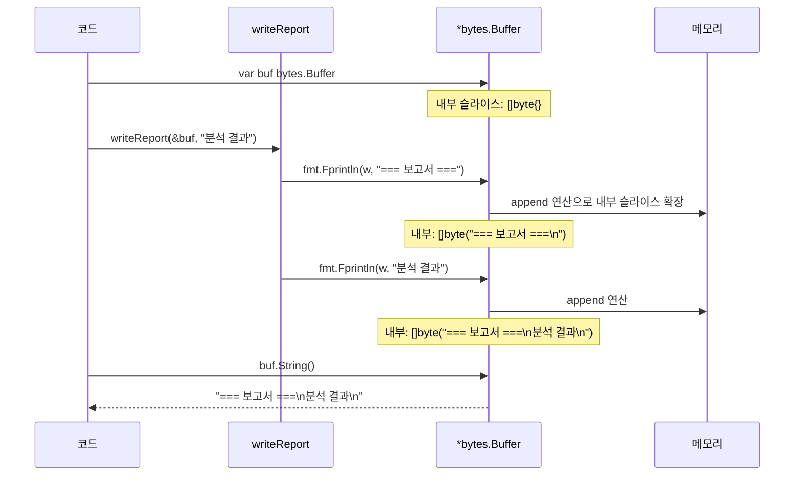

### 테스트에서의 활용 패턴

`io.Writer`의 진정한 힘은 **테스트 용이성**에서 드러납니다.

```go
// 실제 코드 - 출력 대상이 추상화됨
func GenerateReport(w io.Writer, data []string) error {
    fmt.Fprintln(w, "=== 보고서 ===")
    for i, item := range data {
        fmt.Fprintf(w, "%d. %s\n", i+1, item)
    }
    fmt.Fprintln(w, "=== 끝 ===")
    return nil
}
```

```go
// 테스트 코드 - 화면 대신 버퍼로 출력 캡처
func TestGenerateReport(t *testing.T) {
    var buf bytes.Buffer  // 테스트용 버퍼

    // 함수 실행 - 화면이 아닌 버퍼에 출력
    err := GenerateReport(&buf, []string{"항목1", "항목2"})
    if err != nil {
        t.Fatal(err)
    }

    // 출력 내용 검증
    output := buf.String()

    if !strings.Contains(output, "=== 보고서 ===") {
        t.Error("헤더가 없습니다")
    }
    if !strings.Contains(output, "1. 항목1") {
        t.Error("첫 번째 항목이 없습니다")
    }
    if !strings.Contains(output, "2. 항목2") {
        t.Error("두 번째 항목이 없습니다")
    }
}
```

**테스트 장점**:
- 화면 출력을 캡처할 필요 없음
- 출력 내용을 문자열로 검증 가능
- 테스트가 빠르고 독립적

### io.Writer 체이닝 (데코레이터 패턴)

여러 `io.Writer`를 연결하여 기능을 조합할 수 있습니다.


```go
// 압축 + 버퍼링 + 파일 쓰기
file, _ := os.Create("data.gz")
defer file.Close()

bufWriter := bufio.NewWriter(file)      // 버퍼링 추가
defer bufWriter.Flush()

gzWriter := gzip.NewWriter(bufWriter)   // 압축 추가
defer gzWriter.Close()

// gzWriter에 쓰면: 압축 → 버퍼링 → 파일
fmt.Fprintln(gzWriter, "압축될 데이터")
```

### io.MultiWriter - 여러 대상에 동시 출력

```go
// 화면과 파일에 동시 출력
file, _ := os.Create("log.txt")
defer file.Close()

// 두 Writer를 하나로 합침
multi := io.MultiWriter(os.Stdout, file)

// multi에 쓰면 stdout과 file 모두에 출력
fmt.Fprintln(multi, "이 메시지는 화면과 파일 모두에!")
```

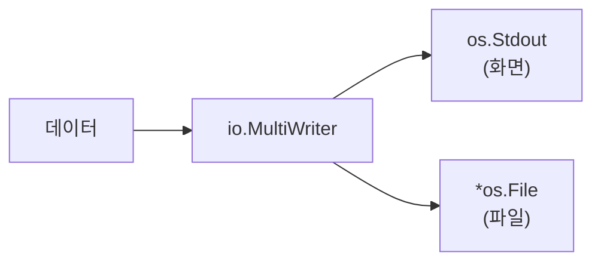

### 정리: io.Writer가 가능하게 하는 것들

| 시나리오 | 구현 방식 |
|----------|----------|
| 단위 테스트 | `bytes.Buffer`로 출력 캡처 |
| 로그 파일 | `*os.File`로 파일에 기록 |
| 웹 응답 | `http.ResponseWriter`로 HTTP 응답 |
| 압축 저장 | `gzip.Writer`로 압축하며 저장 |
| 동시 출력 | `io.MultiWriter`로 여러 대상에 출력 |
| 버퍼링 | `bufio.Writer`로 성능 최적화 |
| 네트워크 전송 | `net.Conn`으로 TCP/UDP 전송 |

**인터페이스의 힘**: 메서드 하나(`Write`)만 정의했지만, 이를 통해 무한한 확장성과 조합 가능성을 얻습니다

---

## fmt 함수 분류: 접두사의 의미

### 1. 출력 대상에 따른 분류

| 접두사 | 출력 대상 | 내부 동작 | 예시 |
|--------|----------|----------|------|
| (없음) | stdout (fd 1) | `os.Stdout`에 직접 출력 | `Print`, `Println`, `Printf` |
| **F** | io.Writer | 지정한 Writer에 출력 | `Fprint`, `Fprintln`, `Fprintf` |
| **S** | string 반환 | 문자열 생성 (출력 안 함) | `Sprint`, `Sprintln`, `Sprintf` |

### 동작 흐름 비교


### 상세 설명

#### Print 계열 (접두사 없음) - stdout 고정

```go
fmt.Print("Hello")     // stdout에 출력, 줄바꿈 없음
fmt.Println("Hello")   // stdout에 출력, 줄바꿈 있음
fmt.Printf("%s", "Hi") // stdout에 포맷 출력
```

내부 구현 (단순화):
```go
func Println(a ...any) (n int, err error) {
    return Fprintln(os.Stdout, a...)  // 결국 Fprint 호출
}
```

**한계**: 출력 대상이 stdout으로 고정되어 있어 테스트하기 어렵습니다.

#### Fprint 계열 (F = File/Flexible) - io.Writer 지정

```go
// 첫 번째 인자가 io.Writer
fmt.Fprint(w io.Writer, a ...any)
fmt.Fprintln(w io.Writer, a ...any)
fmt.Fprintf(w io.Writer, format string, a ...any)
```

사용 예시:
```go
// 표준 출력 (Print와 동일)
fmt.Fprintln(os.Stdout, "표준 출력")

// 표준 에러
fmt.Fprintln(os.Stderr, "에러 메시지")

// 파일
file, _ := os.Create("log.txt")
defer file.Close()
fmt.Fprintln(file, "파일에 기록")

// HTTP 응답
func handler(w http.ResponseWriter, r *http.Request) {
    fmt.Fprintln(w, "Hello, Web!")  // 브라우저에 출력
}

// 메모리 버퍼 (테스트용)
var buf bytes.Buffer
fmt.Fprintln(&buf, "버퍼에 저장")
result := buf.String()  // "버퍼에 저장\n"
```

**테스트에서의 활용**:
```go
func TestOutput(t *testing.T) {
    var buf bytes.Buffer

    // 테스트 대상 함수에 버퍼 전달
    writeReport(&buf, "test data")

    // 출력 내용 검증
    if !strings.Contains(buf.String(), "test data") {
        t.Error("expected output not found")
    }
}
```

#### Sprint 계열 (S = String) - 문자열 반환

```go
s := fmt.Sprint(a ...any)           // 문자열 반환
s := fmt.Sprintln(a ...any)         // 줄바꿈 포함 문자열 반환
s := fmt.Sprintf(format, a ...any)  // 포맷된 문자열 반환
```

**출력하지 않고 문자열만 생성**합니다.

사용 예시:
```go
// 문자열 조합
name := "Kim"
age := 30
s := fmt.Sprintf("이름: %s, 나이: %d", name, age)
// s = "이름: Kim, 나이: 30"

// 로그 메시지 생성
func logError(err error) string {
    return fmt.Sprintf("[ERROR] %s: %v", time.Now().Format("15:04:05"), err)
}

// 파일명 생성
filename := fmt.Sprintf("backup_%s.tar.gz", time.Now().Format("20060102"))
// filename = "backup_20240115.tar.gz"
```

### 2. 접미사에 따른 분류

| 접미사 | 동작 | 인자 구분 | 줄바꿈 |
|--------|------|----------|--------|
| (없음) | 기본 출력 | 없음 | 없음 |
| **ln** | 줄바꿈 추가 | 공백으로 구분 | 있음 |
| **f** | 포맷 문자열 | 포맷 동사로 지정 | 없음 |

```go
fmt.Print("a", "b")      // 출력: ab
fmt.Println("a", "b")    // 출력: a b\n (공백 + 줄바꿈)
fmt.Printf("%s-%s", "a", "b")  // 출력: a-b
```

### 3. 에러 생성 함수 (Errorf)

fmt 패키지는 출력뿐 아니라 **에러 생성**도 담당합니다.

| 함수 | 반환 타입 | 설명 |
|------|----------|------|
| `fmt.Errorf(format, a...)` | `error` | 포맷된 에러 메시지 생성 |

```go
// 기본 사용
err := fmt.Errorf("파일을 찾을 수 없음: %s", filename)

// %w로 에러 래핑 (Go 1.13+)
originalErr := errors.New("connection refused")
wrappedErr := fmt.Errorf("DB 연결 실패: %w", originalErr)
```

**왜 Errorf만 있고 Error, Errorln은 없는가?**

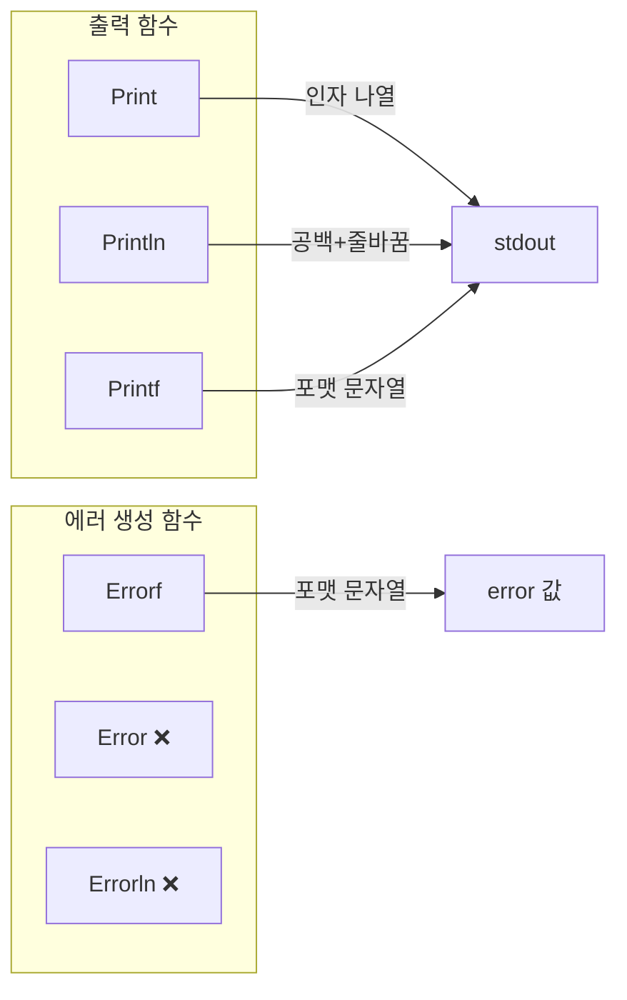

- **에러 메시지는 거의 항상 컨텍스트 정보가 필요**: 파일명, 사용자ID, 원인 등
- 단순 문자열 연결(`Error`)보다 포맷팅(`Errorf`)이 실용적
- 줄바꿈(`Errorln`)은 에러 메시지에 불필요

```go
// 실제로 이렇게 쓰지 않음 (컨텍스트 없음)
err := errors.New("실패")  // Error가 있다면 이런 용도

// 실제 사용 패턴 (항상 컨텍스트 포함)
err := fmt.Errorf("사용자 %d 조회 실패: %w", userID, dbErr)
```

#### Errorf vs Fprint(os.Stderr) 차이

혼동하기 쉬운 두 함수의 차이입니다. **완전히 다른 역할**을 합니다.

| 구분 | `fmt.Errorf` | `fmt.Fprint(os.Stderr, ...)` |
|------|-------------|------------------------------|
| **역할** | error 값 **생성** | stderr에 **출력** |
| **반환** | `error` 타입 | `(n int, err error)` |
| **화면 출력** | ❌ 없음 | ✅ 즉시 출력 |
| **용도** | 에러를 호출자에게 전달 | 사용자에게 메시지 표시 |

```go
// Errorf: 에러 값을 "생성"만 함 (출력 없음)
err := fmt.Errorf("파일 %s를 찾을 수 없음", filename)
// 화면에 아무것도 안 나옴
// err 변수에 error 값이 저장됨

// Fprint(os.Stderr): stderr에 "출력"함
fmt.Fprintln(os.Stderr, "파일을 찾을 수 없음:", filename)
// 화면에 즉시 출력됨
// error 값 생성 안 함
```

**동작 흐름 비교**:

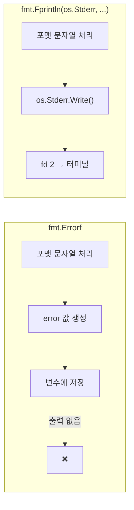

**실제 사용 패턴** - 함께 사용하는 경우:

```go
func readConfig(path string) ([]byte, error) {
    data, err := os.ReadFile(path)
    if err != nil {
        // Errorf: 에러를 래핑하여 호출자에게 반환 (출력 안 함)
        return nil, fmt.Errorf("설정 파일 읽기 실패: %w", err)
    }
    return data, nil
}

func main() {
    data, err := readConfig("config.json")
    if err != nil {
        // Fprint: 최종적으로 사용자에게 에러 메시지 출력
        fmt.Fprintln(os.Stderr, "에러:", err)
        os.Exit(1)
    }
    // ...
}
```

**요약**:
- `Errorf` → 에러를 **만들어서 전달**할 때 (함수 간 에러 전파)
- `Fprint(os.Stderr)` → 에러를 **화면에 보여줄** 때 (최종 사용자 출력)

### 4. 입력 함수 (Scan 계열)

출력의 반대 방향으로, **입력을 파싱**하는 함수들입니다.

| 접두사 | 입력 소스 | 예시 |
|--------|----------|------|
| (없음) | stdin | `Scan`, `Scanln`, `Scanf` |
| **F** | io.Reader | `Fscan`, `Fscanln`, `Fscanf` |
| **S** | string | `Sscan`, `Sscanln`, `Sscanf` |

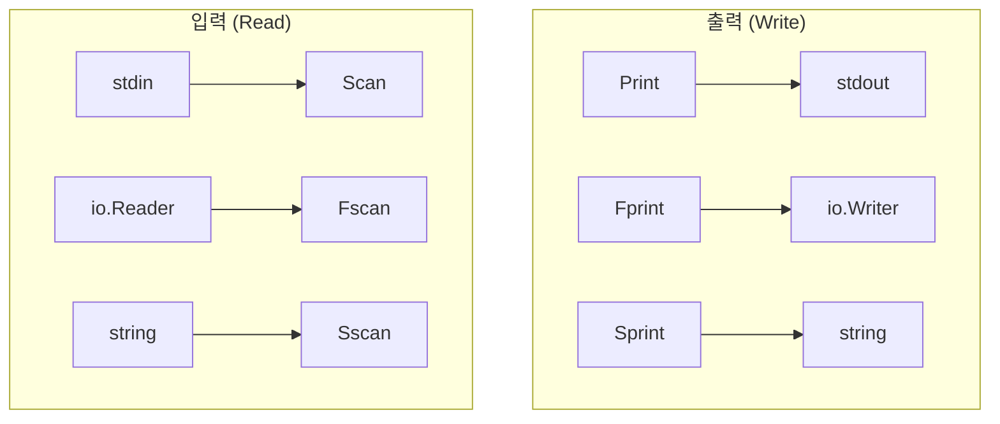

#### Scan 계열 (stdin에서 입력)

```go
var name string
var age int

// 공백으로 구분된 입력 읽기
fmt.Print("이름과 나이 입력: ")
fmt.Scan(&name, &age)  // 입력: "Kim 30"
// name = "Kim", age = 30

// 줄바꿈까지 읽기
fmt.Scanln(&name, &age)

// 포맷에 맞춰 읽기
fmt.Scanf("%s %d", &name, &age)
```

**주의**: 변수의 **포인터**를 전달해야 합니다 (`&name`, `&age`).

#### io.Reader 인터페이스

`io.Writer`가 "출력 대상"의 추상화라면, `io.Reader`는 **"입력 소스"의 추상화**입니다.

**정의**:

```go
type Reader interface {
    Read(p []byte) (n int, err error)
}
```

| 요소 | 설명 |
|------|------|
| `p []byte` | 데이터를 읽어올 버퍼 |
| `n int` | 실제로 읽은 바이트 수 |
| `err error` | 에러 (EOF 포함) |

**io.Writer vs io.Reader 대칭 구조**:

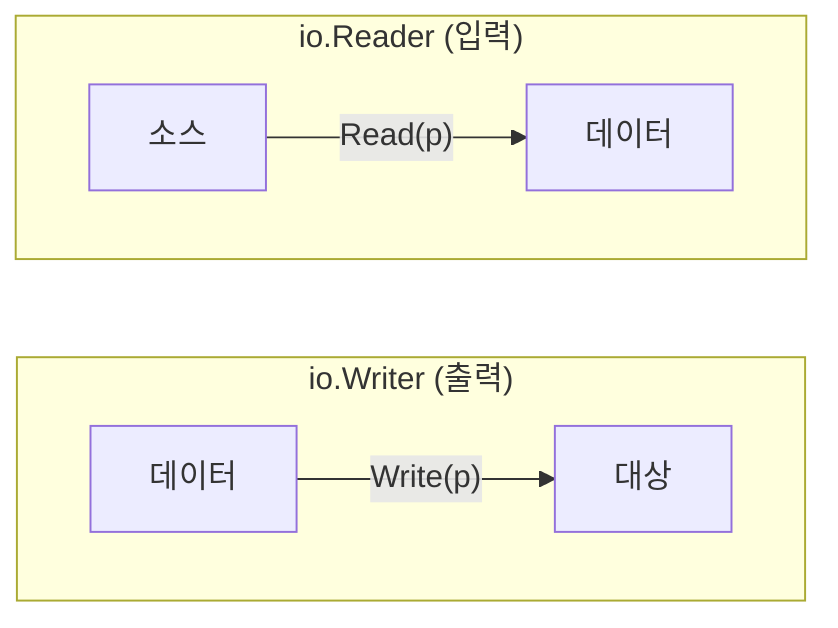

| 구분 | io.Writer | io.Reader |
|------|-----------|-----------|
| 방향 | 데이터 → 대상 | 소스 → 데이터 |
| 메서드 | `Write(p []byte)` | `Read(p []byte)` |
| 용도 | 출력, 저장, 전송 | 입력, 로드, 수신 |

**io.Reader를 구현하는 타입들**:

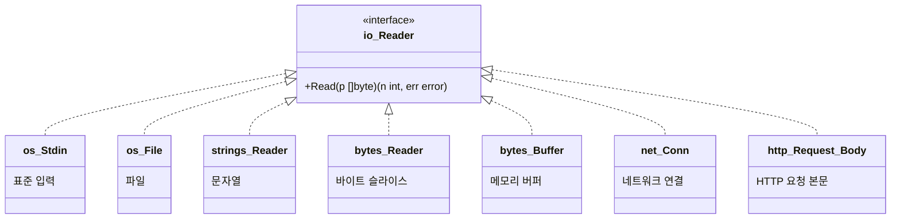

| 타입 | 패키지 | 특성 | 주요 용도 |
|------|--------|------|----------|
| `os.Stdin` | os | fd 0, 키보드 입력 | 사용자 입력 |
| `*os.File` | os | 파일 디스크립터 | 파일 읽기 |
| `*strings.Reader` | strings | 문자열을 Reader로 | 문자열 파싱, 테스트 |
| `*bytes.Reader` | bytes | []byte를 Reader로 | 바이트 데이터 처리 |
| `*bytes.Buffer` | bytes | 읽기/쓰기 모두 가능 | 버퍼링, 테스트 |
| `net.Conn` | net | TCP/UDP 연결 | 네트워크 수신 |
| `http.Request.Body` | net/http | HTTP 요청 본문 | 웹 서버 |

**왜 io.Reader가 중요한가?**

`io.Writer`와 마찬가지로, 입력 소스를 추상화하면 **코드를 수정하지 않고** 다양한 소스에서 데이터를 읽을 수 있습니다.

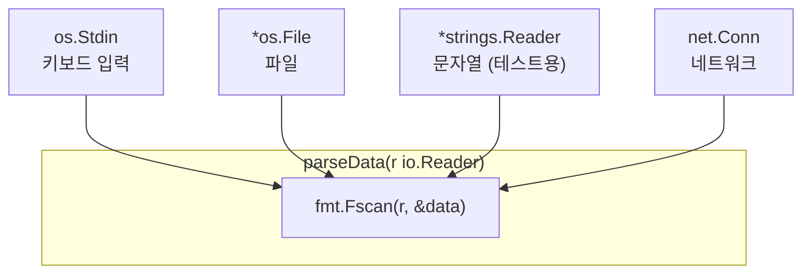

```go
// 이 함수는 "어디서" 읽는지 모릅니다
func parseConfig(r io.Reader) (Config, error) {
    var cfg Config
    _, err := fmt.Fscan(r, &cfg.Host, &cfg.Port)
    return cfg, err
}

// 키보드에서 입력
cfg, _ := parseConfig(os.Stdin)

// 파일에서 읽기
file, _ := os.Open("config.txt")
cfg, _ := parseConfig(file)

// 문자열에서 파싱 (테스트용)
reader := strings.NewReader("localhost 8080")
cfg, _ := parseConfig(reader)
```

**테스트에서의 활용**:

```go
func TestParseConfig(t *testing.T) {
    // 실제 파일이나 키보드 입력 없이 테스트 가능
    input := strings.NewReader("localhost 8080")

    cfg, err := parseConfig(input)
    if err != nil {
        t.Fatal(err)
    }

    if cfg.Host != "localhost" {
        t.Errorf("expected localhost, got %s", cfg.Host)
    }
}
```

#### Fscan 계열 (io.Reader에서 입력)

```go
// 파일에서 읽기
file, _ := os.Open("data.txt")
defer file.Close()

var x, y int
fmt.Fscan(file, &x, &y)

// 문자열 Reader에서 읽기 (테스트에 유용)
reader := strings.NewReader("100 200")
fmt.Fscan(reader, &x, &y)
// x = 100, y = 200
```

**strings.NewReader vs bytes.Buffer**:

| 타입 | 생성 | 특성 | 용도 |
|------|------|------|------|
| `*strings.Reader` | `strings.NewReader(s)` | 읽기 전용 | 문자열 → Reader |
| `*bytes.Buffer` | `bytes.NewBufferString(s)` | 읽기/쓰기 | 양방향 버퍼 |

```go
// strings.Reader: 읽기만 가능
sr := strings.NewReader("hello")
// sr.Write() 없음!

// bytes.Buffer: 읽기/쓰기 모두 가능
buf := bytes.NewBufferString("hello")
buf.WriteString(" world")  // 쓰기 가능
data, _ := buf.ReadString('\n')  // 읽기 가능
```

#### Sscan 계열 (문자열에서 파싱)

가장 실용적인 패턴입니다. 문자열을 파싱하여 변수에 저장합니다.

```go
input := "Kim 30 Seoul"

var name, city string
var age int

// 공백으로 구분된 값 파싱
fmt.Sscan(input, &name, &age, &city)
// name = "Kim", age = 30, city = "Seoul"

// 포맷에 맞춰 파싱
data := "2024-01-15"
var year, month, day int
fmt.Sscanf(data, "%d-%d-%d", &year, &month, &day)
// year = 2024, month = 1, day = 15
```

**활용 예시: 로그 파싱**

```go
logLine := "[ERROR] 2024-01-15 14:30:00 UserID=42 Message=connection timeout"

var level, date, time, userPart, msgPart string
fmt.Sscanf(logLine, "[%s %s %s %s %s", &level, &date, &time, &userPart, &msgPart)
```

### fmt 패키지 함수 전체 구조

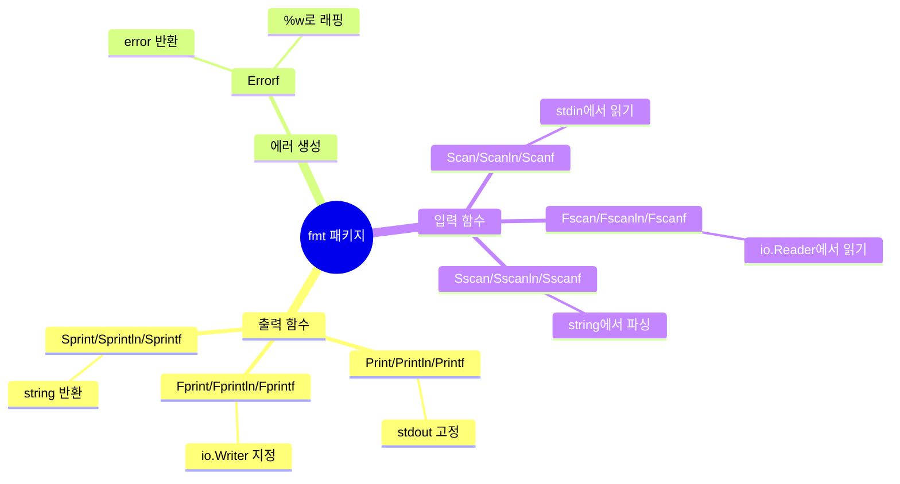

| 카테고리 | 접두사 없음 | F 접두사 | S 접두사 |
|----------|------------|----------|----------|
| **출력** | Print → stdout | Fprint → io.Writer | Sprint → string |
| **입력** | Scan ← stdin | Fscan ← io.Reader | Sscan ← string |
| **에러** | - | - | Errorf → error |

---

## stdout vs stderr 심화

### 버퍼링 차이

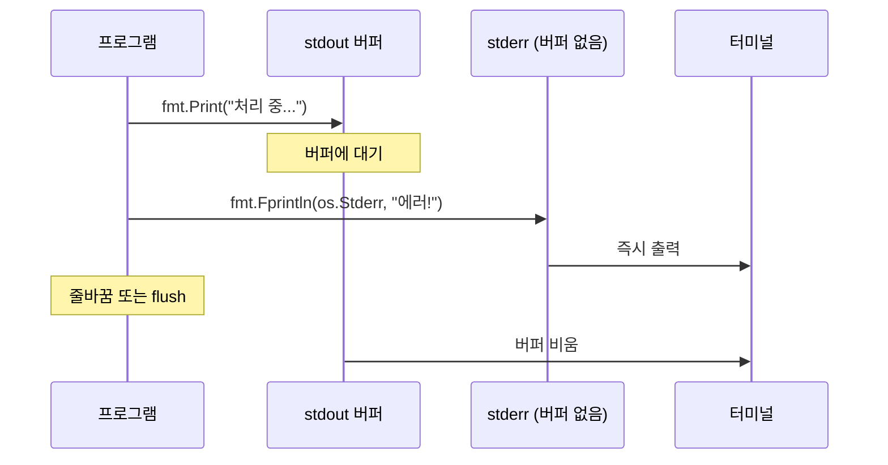

```
stdout: 라인 버퍼링 (줄바꿈 시 flush) 또는 풀 버퍼링 (파이프)
stderr: 버퍼링 없음 (즉시 출력)
```

이것이 왜 중요한가?

```go
func main() {
    fmt.Print("처리 중...")  // stdout - 버퍼에 머무를 수 있음
    // 오래 걸리는 작업
    panic("에러!")  // stderr - 즉시 출력
}
```

프로그램이 갑자기 종료되면 버퍼에 있던 stdout 내용이 **출력되지 않을 수 있습니다**. 그래서 에러 메시지는 반드시 stderr로 출력해야 합니다.

### CLI 도구에서의 규칙

```mermaid
flowchart LR
    subgraph CLI["CLI 도구"]
        DATA["정상 결과<br/>(JSON, CSV 등)"]
        LOG["진행 상황, 경고, 에러"]
    end

    DATA -->|stdout| PIPE["파이프<br/>jq, grep 등"]
    LOG -->|stderr| SCREEN["화면<br/>사용자 확인"]
```

```go
func main() {
    // 정상 결과 → stdout (다른 프로그램이 파싱 가능)
    fmt.Println(`{"status": "ok", "count": 42}`)

    // 진행 상황, 경고, 에러 → stderr (파이프에 영향 없음)
    fmt.Fprintln(os.Stderr, "처리 완료: 42건")
}
```

파이프 사용 시:
```bash
# stdout만 jq로 전달, stderr는 화면에 표시
./program | jq '.count'
# 화면: 처리 완료: 42건
# jq 출력: 42
```

### 종료 코드와 함께 사용

```go
func main() {
    if err := run(); err != nil {
        fmt.Fprintln(os.Stderr, "에러:", err)
        os.Exit(1)  // 실패
    }
    fmt.Println("성공")
    os.Exit(0)  // 성공
}
```

---

## 포맷 동사 (Format Verbs)

### 범용

| 동사 | 설명 | 예시 |
|------|------|------|
| `%v` | 기본 포맷 (value) | `{Kim 30}` |
| `%+v` | 필드명 포함 | `{Name:Kim Age:30}` |
| `%#v` | Go 문법 표현 | `main.Person{Name:"Kim", Age:30}` |
| `%T` | 타입 (type) | `main.Person` |
| `%%` | % 리터럴 | `%` |

```go
type Person struct {
    Name string
    Age  int
}
p := Person{"Kim", 30}

fmt.Printf("%v\n", p)   // {Kim 30}
fmt.Printf("%+v\n", p)  // {Name:Kim Age:30}
fmt.Printf("%#v\n", p)  // main.Person{Name:"Kim", Age:30}
fmt.Printf("%T\n", p)   // main.Person
```

### 불리언

| 동사 | 설명 | 예시 |
|------|------|------|
| `%t` | true/false | `true` |

```go
fmt.Printf("%t", true)   // true
fmt.Printf("%t", false)  // false
```

### 정수

| 동사 | 설명 | 예시 (42) |
|------|------|----------|
| `%d` | 10진수 (decimal) | `42` |
| `%b` | 2진수 (binary) | `101010` |
| `%o` | 8진수 (octal) | `52` |
| `%x` | 16진수 소문자 (hex) | `2a` |
| `%X` | 16진수 대문자 | `2A` |
| `%c` | 유니코드 문자 | `*` (42 = '*') |

### 실수

| 동사 | 설명 | 예시 (3.14159) |
|------|------|---------------|
| `%f` | 소수점 표기 | `3.141590` |
| `%e` | 지수 표기 (소문자) | `3.141590e+00` |
| `%E` | 지수 표기 (대문자) | `3.141590E+00` |
| `%g` | 자동 선택 (%e 또는 %f) | `3.14159` |
| `%.2f` | 소수점 2자리 | `3.14` |

### 문자열

| 동사 | 설명 | 예시 ("hello") |
|------|------|---------------|
| `%s` | 문자열 (string) | `hello` |
| `%q` | 따옴표 포함 (quoted) | `"hello"` |
| `%x` | 16진수 바이트 | `68656c6c6f` |

### 포인터

| 동사 | 설명 |
|------|------|
| `%p` | 포인터 주소 (0x로 시작) |

### 에러 래핑 (fmt.Errorf 전용)

| 동사 | 설명 |
|------|------|
| `%w` | 에러 래핑 (체인 유지) |

---

## 너비와 정밀도

### 너비 (Width) - 최소 출력 폭

```go
fmt.Printf("|%10d|\n", 42)   // |        42| (오른쪽 정렬, 기본)
fmt.Printf("|%-10d|\n", 42)  // |42        | (왼쪽 정렬)
fmt.Printf("|%010d|\n", 42)  // |0000000042| (0으로 채움)
```

### 정밀도 (Precision)

```go
// 실수: 소수점 자릿수
fmt.Printf("%.2f\n", 3.14159)  // 3.14
fmt.Printf("%.0f\n", 3.14159)  // 3

// 문자열: 최대 길이
fmt.Printf("%.5s\n", "Hello, World")  // Hello
```

### 조합

```go
// 너비 10, 소수점 2자리
fmt.Printf("|%10.2f|\n", 3.14159)  // |      3.14|

// 왼쪽 정렬, 너비 10, 소수점 2자리
fmt.Printf("|%-10.2f|\n", 3.14159) // |3.14      |
```

### 정렬 플래그 요약

| 플래그 | 의미 |
|--------|------|
| `-` | 왼쪽 정렬 (기본은 오른쪽) |
| `0` | 공백 대신 0으로 채움 |
| `+` | 양수에도 + 부호 표시 |
| ` ` (공백) | 양수 앞에 공백 |

---

## fmt.Errorf와 에러 래핑

### %v vs %w 차이

```mermaid
flowchart TB
    subgraph Original["원본 에러"]
        O["connection refused"]
    end

    subgraph WrapV["%v로 래핑"]
        V["DB 실패: connection refused"]
        V2["(문자열만, 체인 끊김)"]
    end

    subgraph WrapW["%w로 래핑"]
        W["DB 실패: connection refused"]
        W2["(원본 참조 유지)"]
    end

    Original -->|"%v"| WrapV
    Original -->|"%w"| WrapW

    WrapV -.->|"errors.Is()"| X["false"]
    WrapW -->|"errors.Is()"| Y["true"]
```

```go
originalErr := errors.New("connection refused")

// %v: 문자열로만 변환 (에러 체인 끊김)
err1 := fmt.Errorf("DB 연결 실패: %v", originalErr)

// %w: 에러 래핑 (에러 체인 유지)
err2 := fmt.Errorf("DB 연결 실패: %w", originalErr)
```

**출력은 동일**하지만 내부 구조가 다릅니다:

| 비교 | `%v` | `%w` |
|------|------|------|
| 출력 | `DB 연결 실패: connection refused` | 동일 |
| 원본 에러 보존 | ❌ | ✅ |
| `errors.Is()` | `false` | `true` |
| `errors.Unwrap()` | `nil` | 원본 반환 |

에러 처리 패턴은 **06-error-handling**에서 상세히 다룹니다.

---

## 실습 과제

### 과제 1: 포맷 동사 연습
다양한 타입의 값을 여러 포맷 동사로 출력해보세요.

### 과제 2: 테이블 출력기
정렬된 테이블 형태로 데이터를 출력하는 함수를 만드세요.

### 과제 3: 에러 체이닝
fmt.Errorf와 %w를 사용해 에러를 래핑하고 언래핑해보세요.

---

## 정리

```mermaid
mindmap
  root((fmt 패키지))
    접두사
      없음: stdout
      F: io.Writer
      S: string
    접미사
      없음: 기본
      ln: 줄바꿈
      f: 포맷
    스트림
      stdout fd1
      stderr fd2
    포맷 동사
      %v 범용
      %d %b %x 정수
      %f %e 실수
      %s %q 문자열
      %w 에러래핑
```

| 접두사 | 출력 대상 | 용도 |
|--------|----------|------|
| (없음) | stdout | 일반 출력 |
| F | io.Writer | 유연한 출력 (파일, 네트워크, 테스트) |
| S | string | 문자열 생성 |

| 개념 | 설명 |
|------|------|
| stdout (fd 1) | 정상 출력, 파이프 전달 가능 |
| stderr (fd 2) | 에러 출력, 버퍼링 없음 |
| io.Writer | 출력 대상 추상화 인터페이스 |
| 너비 | 최소 출력 폭 |
| 정밀도 | 소수점 자릿수 또는 문자열 최대 길이 |

---

## 참고 자료
- [Go Package - fmt](https://pkg.go.dev/fmt)
- [Go Package - io](https://pkg.go.dev/io)
- [Linux man: stdout(3)](https://man7.org/linux/man-pages/man3/stdout.3.html)
- [Go Blog - Error handling](https://go.dev/blog/go1.13-errors)
