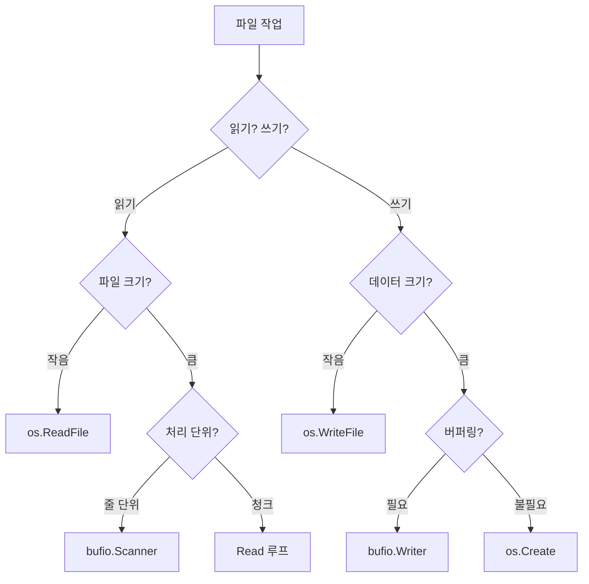

# 00. 파일 I/O (File I/O)

## 학습 목표
Go의 파일 읽기/쓰기, 디렉토리 작업, 경로 처리를 깊이 이해하고 상황에 맞게 사용한다.

---

## 문서 구조

| 문서 | 내용 | 핵심 주제 |
|------|------|----------|
| [01-FILE-IO-BASICS.md](01-FILE-IO-BASICS.md) | 파일 I/O 기초와 io 패키지 | 파일 디스크립터, `*os.File`, io 인터페이스 (Reader, Writer, Closer, Seeker, ReaderAt, WriterTo 등), io.Copy 최적화 |
| [02-FILE-READ-WRITE.md](02-FILE-READ-WRITE.md) | 파일 읽기/쓰기 | 읽기 방법 5가지, 쓰기 방법 4가지, 파일 모드/플래그, 권한, defer |
| [03-PATH-AND-PATTERNS.md](03-PATH-AND-PATTERNS.md) | 경로 처리와 실무 패턴 | filepath 패키지, 디렉토리 작업, 임시 파일, 에러 처리, 실무 패턴 5가지 |

---

## 빠른 참조

### 함수 선택 가이드

### 자주 쓰는 함수

| 함수 | 용도 |
|------|------|
| `os.ReadFile(path)` | 파일 전체 읽기 |
| `os.WriteFile(path, data, perm)` | 파일 전체 쓰기 |
| `os.Open(path)` | 읽기 전용 열기 |
| `os.Create(path)` | 파일 생성/덮어쓰기 |
| `os.OpenFile(path, flag, perm)` | 세밀한 제어 |
| `filepath.Join(...)` | 경로 조합 |

### 중요 규칙

| 규칙 | 설명 |
|------|------|
| `defer file.Close()` | 파일 열면 즉시 등록 |
| `filepath.Join` | 경로 조합 시 항상 사용 |
| 권한 `0644` | 일반 파일 기본값 |
| 권한 `0755` | 실행 파일, 디렉토리 |

---

## 하위 디렉토리
- `exec/`: os/exec 패키지 예제 (외부 명령 실행)

---

## 참고 자료
- [Go Package - os](https://pkg.go.dev/os)
- [Go Package - io](https://pkg.go.dev/io)
- [Go Package - bufio](https://pkg.go.dev/bufio)
- [Go Package - filepath](https://pkg.go.dev/path/filepath)
